# 用 Python 和 Plotly 实现实用统计和可视化

> 原文：<https://towardsdatascience.com/practical-statistics-visualization-with-python-plotly-770e96e35067?source=collection_archive---------3----------------------->


Photo credit: Pixabay

## 如何使用 Python 和 Plotly 进行统计可视化、推理和建模

上周有一天，我在用 Python 谷歌“ ***统计”，结果有些毫无收获。大部分文献、教程、文章都以 [***R***](https://www.r-project.org/) 为统计重点，因为 [***R***](https://www.r-project.org/) 是一种专门用于统计的语言，比 Python 有更多的统计分析特性。***

在两本优秀的统计学书籍中，《面向数据科学家的 [***实用*** ***统计学》、《统计学习入门***](https://www.amazon.ca/Practical-Statistics-Data-Scientists-Essential-ebook/dp/B071NVDFD6/ref=dp_kinw_strp_1)***[](http://www-bcf.usc.edu/~gareth/ISL/)*》中，统计概念均在 ***R*** 中实现。****

*[数据科学融合了多个学科，包括统计学、计算机科学、信息技术和特定领域](https://learning.oreilly.com/library/view/practical-statistics-for/9781491952955/preface01.html)。我们每天使用强大的开源[***Python***](https://www.python.org/)工具来操作、分析和可视化数据集。*

*我当然会建议任何对成为数据科学家或机器学习工程师感兴趣的人深入理解并不断实践统计学习理论。*

*这促使我为这个主题写一篇文章。我将使用一个数据集来回顾尽可能多的统计概念，让我们开始吧！*

# *数据*

*数据是房价数据集，可以在[这里](https://www.kaggle.com/c/house-prices-advanced-regression-techniques/data)找到。*

```
*import numpy as np
import pandas as pd
import matplotlib.pyplot as plt
import seaborn as sns
from plotly.offline import init_notebook_mode, iplot
import plotly.figure_factory as ff
import cufflinks
cufflinks.go_offline()
cufflinks.set_config_file(world_readable=True, theme='pearl')
import plotly.graph_objs as go
import plotly.plotly as py
import plotly
from plotly import tools
plotly.tools.set_credentials_file(username='XXX', api_key='XXX')
init_notebook_mode(connected=True)
pd.set_option('display.max_columns', 100)df = pd.read_csv('house_train.csv')
df.drop('Id', axis=1, inplace=True)
df.head()*
```

*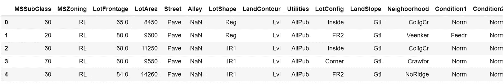*

*Table 1*

# *单变量数据分析*

*[**单变量分析**也许是最简单的统计分析形式，关键事实是只涉及一个变量](https://en.wikipedia.org/wiki/Univariate_analysis)。*

## *描述数据*

*数字数据的统计摘要包括数据的平均值、最小值和最大值，对于了解一些变量有多大以及哪些变量可能是最重要的非常有用。*

```
*df.describe().T*
```

*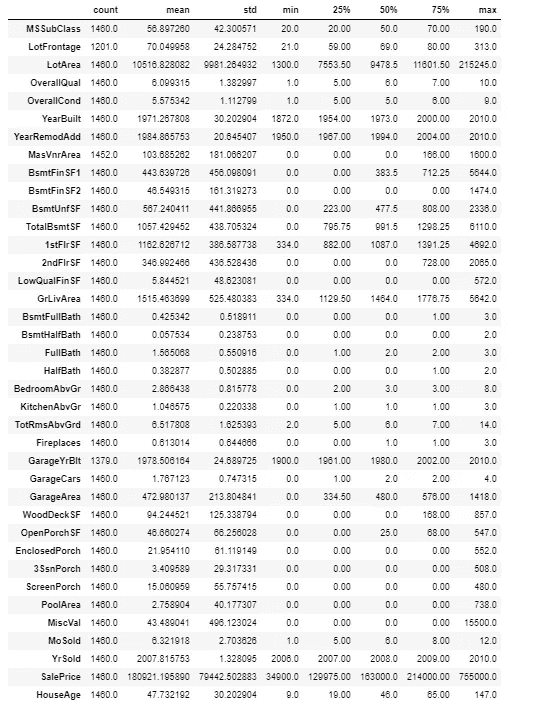*

*Table 2*

*分类或字符串变量的统计摘要将显示“计数”、“唯一”、“前几名”和“频率”。*

```
*table_cat = ff.create_table(df.describe(include=['O']).T, index=True, index_title='Categorical columns')
iplot(table_cat)*
```

*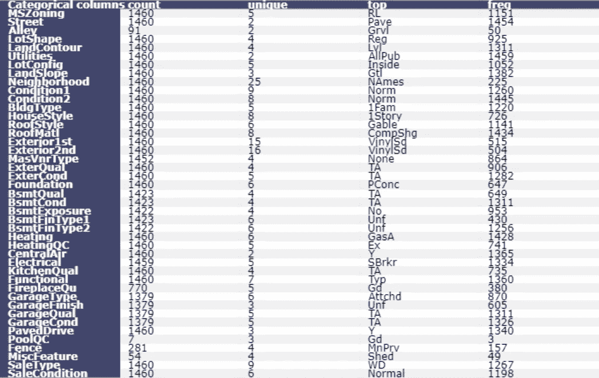*

*Table 3*

## *柱状图*

*绘制数据中所有房屋销售价格的直方图。*

```
*df['SalePrice'].iplot(
    kind='hist',
    bins=100,
    xTitle='price',
    linecolor='black',
    yTitle='count',
    title='Histogram of Sale Price')*
```

*Figure 1*

## *箱线图*

*绘制数据中所有房屋销售价格的箱线图。箱线图没有显示分布的形状，但它们可以让我们更好地了解分布的中心和分布，以及可能存在的任何潜在异常值。箱线图和直方图通常相互补充，帮助我们了解更多的数据。*

```
*df['SalePrice'].iplot(kind='box', title='Box plot of SalePrice')*
```

*Figure 2*

## *按组划分的直方图和箱线图*

*通过分组绘图，我们可以看到一个变量如何响应另一个变量而变化。例如，如果有或没有中央空调的房屋销售价格不同。或者房屋销售价格是否根据车库的大小而变化，等等。*

## *按有无空调分组的房屋销售价格箱线图和直方图*

*boxplot.aircon.py*

*Figure 3*

*histogram_aircon.py*

*Figure 4*

```
*df.groupby('CentralAir')['SalePrice'].describe()*
```

*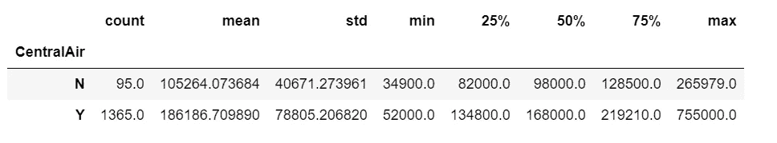*

*Table 4*

*显然，没有空调的房子的平均和中间销售价格比有空调的房子低得多。*

## *按车库大小分组的房屋销售价格箱线图和直方图*

*boxplot_garage.py*

*Figure 5*

*车库越大，房子的中间价格越高，这种情况一直持续到我们有 3 辆车的车库。显然，有 3 个车库的房子的中间价格最高，甚至高于有 4 个车库的房子。*

## *无车库房屋销售价格柱状图*

```
*df.loc[df['GarageCars'] == 0]['SalePrice'].iplot(
    kind='hist',
    bins=50,
    xTitle='price',
    linecolor='black',
    yTitle='count',
    title='Histogram of Sale Price of houses with no garage')*
```

*Figure 6*

## *单车库房屋销售价格柱状图*

```
*df.loc[df['GarageCars'] == 1]['SalePrice'].iplot(
    kind='hist',
    bins=50,
    xTitle='price',
    linecolor='black',
    yTitle='count',
    title='Histogram of Sale Price of houses with 1-car garage')*
```

*Figure 7*

## *带两个车库的房屋销售价格直方图*

```
*df.loc[df['GarageCars'] == 2]['SalePrice'].iplot(
    kind='hist',
    bins=100,
    xTitle='price',
    linecolor='black',
    yTitle='count',
    title='Histogram of Sale Price of houses with 2-car garage')*
```

*Figure 8*

## *带 3 个车库的房屋销售价格直方图*

```
*df.loc[df['GarageCars'] == 3]['SalePrice'].iplot(
    kind='hist',
    bins=50,
    xTitle='price',
    linecolor='black',
    yTitle='count',
    title='Histogram of Sale Price of houses with 3-car garage')*
```

*Figure 9*

## *带 4 个车库的房屋销售价格直方图*

```
*df.loc[df['GarageCars'] == 4]['SalePrice'].iplot(
    kind='hist',
    bins=10,
    xTitle='price',
    linecolor='black',
    yTitle='count',
    title='Histogram of Sale Price of houses with 4-car garage')*
```

*Figure 10*

## *频率表*

*频率告诉我们事情发生的频率。频率表给了我们数据的快照，让我们能够找到模式。*

## *总体质量频率表*

```
*x = df.OverallQual.value_counts()
x/x.sum()*
```

*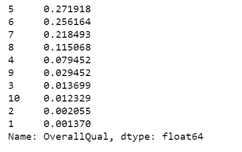*

*Table 5*

## *车库大小频率表*

```
*x = df.GarageCars.value_counts()
x/x.sum()*
```

*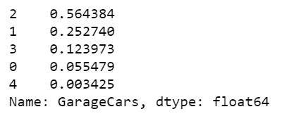*

*Table 6*

## *中央空调频率表*

```
*x = df.CentralAir.value_counts()
x/x.sum()*
```

*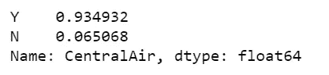*

*Table 7*

## *数字摘要*

*获得定量变量的一组数字汇总的快速方法是使用 describe 方法。*

```
*df.SalePrice.describe()*
```

*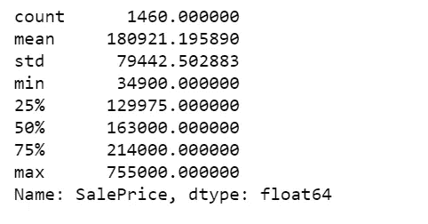*

*Table 8*

*我们还可以计算 SalePrice 的个别汇总统计数据。*

```
*print("The mean of sale price, - Pandas method: ", df.SalePrice.mean())
print("The mean of sale price, - Numpy function: ", np.mean(df.SalePrice))
print("The median sale price: ", df.SalePrice.median())
print("50th percentile, same as the median: ", np.percentile(df.SalePrice, 50))
print("75th percentile: ", np.percentile(df.SalePrice, 75))
print("Pandas method for quantiles, equivalent to 75th percentile: ", df.SalePrice.quantile(0.75))*
```

*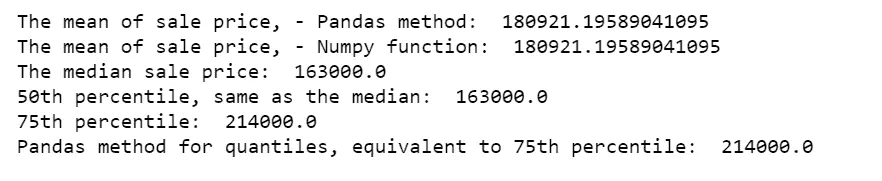*

*计算售价在第 25 百分位(129975)和第 75 百分位(214000)之间的房屋比例。*

```
*print('The proportion of the houses with prices between 25th percentile and 75th percentile: ', np.mean((df.SalePrice >= 129975) & (df.SalePrice <= 214000)))*
```

**

*计算地下室面积总平方英尺在第 25 百分位(795.75)和第 75 百分位(1298.25)之间的房屋比例。*

```
*print('The proportion of house with total square feet of basement area between 25th percentile and 75th percentile: ', np.mean((df.TotalBsmtSF >= 795.75) & (df.TotalBsmtSF <= 1298.25)))*
```

*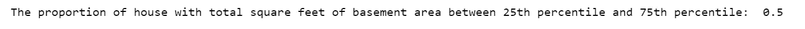*

*最后，我们计算每种情况下的房屋比例。由于有些房子同时符合这两个标准，所以下面的比例小于上面计算的两个比例之和。*

```
*a = (df.SalePrice >= 129975) & (df.SalePrice <= 214000)
b = (df.TotalBsmtSF >= 795.75) & (df.TotalBsmtSF <= 1298.25)
print(np.mean(a | b))*
```

*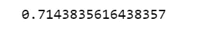*

*计算没有空调的房子在 IQR 的销售价格。*

```
*q75, q25 = np.percentile(df.loc[df['CentralAir']=='N']['SalePrice'], [75,25])
iqr = q75 - q25
print('Sale price IQR for houses with no air conditioning: ', iqr)*
```

*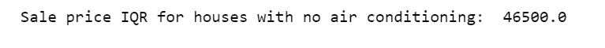*

*计算带空调房屋 IQR 销售价格。*

```
*q75, q25 = np.percentile(df.loc[df['CentralAir']=='Y']['SalePrice'], [75,25])
iqr = q75 - q25
print('Sale price IQR for houses with air conditioning: ', iqr)*
```

**

## *分层*

*从数据集中获取更多信息的另一种方法是将其分成更小、更统一的子集，并单独分析这些“层”。我们将创建一个新的 HouseAge 列，然后将数据划分到 HouseAge 层，并在每个层内构建并排的销售价格箱线图。*

```
*df['HouseAge'] = 2019 - df['YearBuilt']
df["AgeGrp"] = pd.cut(df.HouseAge, [9, 20, 40, 60, 80, 100, 147]) # Create age strata based on these cut points
plt.figure(figsize=(12, 5)) 
sns.boxplot(x="AgeGrp", y="SalePrice", data=df);*
```

*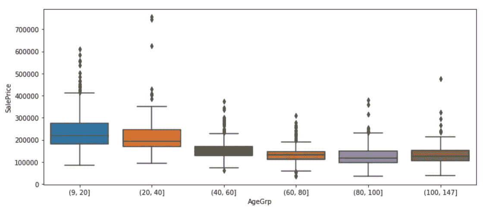*

*Figure 11*

*房子越老，价格中位数越低，也就是房价随着年龄的增长趋于降低，直到 100 岁。超过 100 年的房屋的中间价格高于 80 至 100 年的房屋的中间价格。*

```
*plt.figure(figsize=(12, 5))
sns.boxplot(x="AgeGrp", y="SalePrice", hue="CentralAir", data=df)
plt.show();*
```

*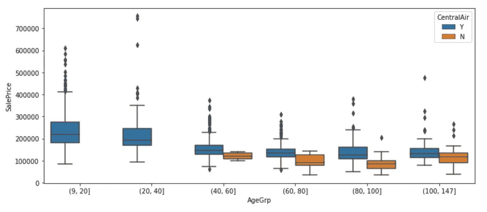*

*Figure 12*

*我们之前已经知道，有空调和没有空调的房价会有所不同。从上图中，我们还发现最近的房子(9-40 年)都装有空调。*

```
*plt.figure(figsize=(12, 5))
sns.boxplot(x="CentralAir", y="SalePrice", hue="AgeGrp", data=df)
plt.show();*
```

*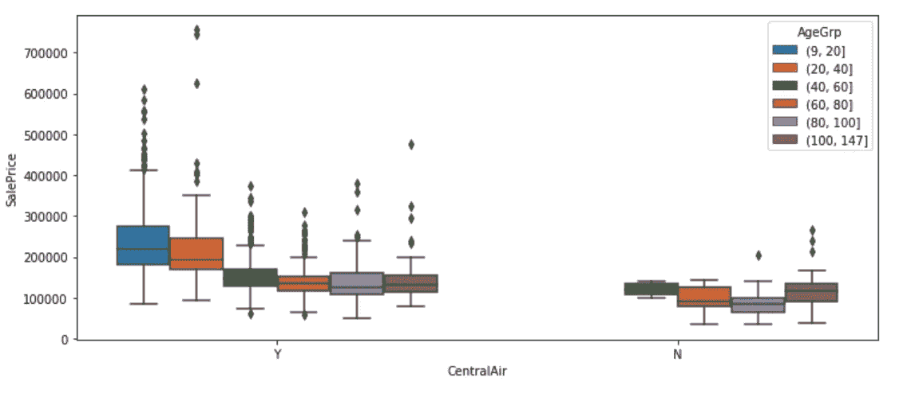*

*Figure 13*

*我们现在先按空调分组，然后在空调内按年龄段分组。每种方法突出了数据的不同方面。*

*我们还可以通过房屋年龄和空调来共同分层，以探索建筑类型如何同时受这两个因素的影响而变化。*

```
*df1 = df.groupby(["AgeGrp", "CentralAir"])["BldgType"]
df1 = df1.value_counts()
df1 = df1.unstack()
df1 = df1.apply(lambda x: x/x.sum(), axis=1)
print(df1.to_string(float_format="%.3f"))*
```

*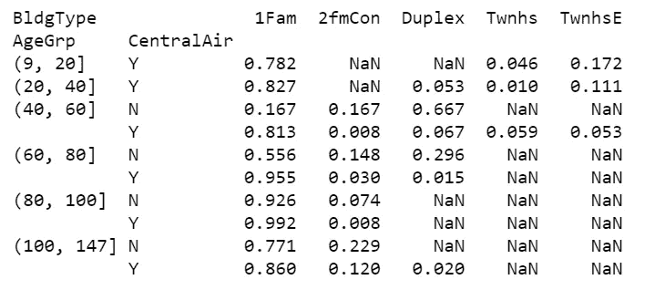*

*Table 9*

*对于所有住宅年龄组，数据中绝大多数住宅类型为 1Fam。房子越老，越有可能没有空调。但是，对于 100 年以上的 1Fam 房子来说，有空调的可能性比没有空调的可能性大一点。既没有很新也没有很旧的复式房屋类型。对于一个 40-60 岁的复式房子，它更有可能没有空调。*

# *多变量分析*

*[**多元分析**基于多元统计的统计原理，涉及一次对多个统计结果变量的观察和分析](https://en.wikipedia.org/wiki/Multivariate_analysis)。*

## *散点图*

*[散点图](https://en.wikipedia.org/wiki/Scatter_plot)是一种非常常见且易于理解的定量双变量数据可视化。下面我们做一个销售价格与地面居住面积平方英尺的散点图。这显然是一种线性关系。*

```
*df.iplot(
    x='GrLivArea',
    y='SalePrice',
    xTitle='Above ground living area square feet',
    yTitle='Sale price',
    mode='markers',
    title='Sale Price vs Above ground living area square feet')*
```

*Figure 14*

## *2D 密度联合图*

*以下两个地块边界分别显示了销售价格和地上居住面积的密度，而中间的地块共同显示了它们的密度。*

*price_GrLivArea.py*

*Figure 15*

## *异质性和分层*

*我们继续探索销售价格和 GrLivArea 之间的关系，按建筑类型分层。*

*stratify.py*

*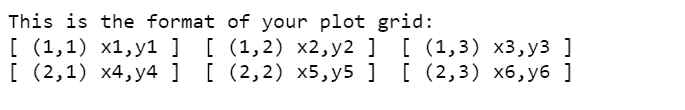*

*Figure 16*

*在几乎所有的建筑类型中，SalePrice 和 GrLivArea 呈现出正的线性关系。在下面的结果中，我们看到 1Fam 建筑类型的 SalepPrice 和 GrLivArea 之间的相关性最高，为 0.74，而复式建筑类型的相关性最低，为 0.49。*

```
*print(df.loc[df.BldgType=="1Fam", ["GrLivArea", "SalePrice"]].corr())
print(df.loc[df.BldgType=="TwnhsE", ["GrLivArea", "SalePrice"]].corr())
print(df.loc[df.BldgType=='Duplex', ["GrLivArea", "SalePrice"]].corr())
print(df.loc[df.BldgType=="Twnhs", ["GrLivArea", "SalePrice"]].corr())
print(df.loc[df.BldgType=="2fmCon", ["GrLivArea", "SalePrice"]].corr())*
```

*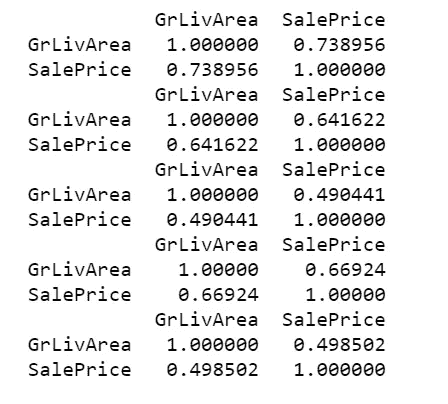*

*Table 10*

## *分类双变量分析*

*我们创建一个列联表，计算由建筑类型和一般分区分类组合定义的每个单元中的房屋数量。*

```
*x = pd.crosstab(df.MSZoning, df.BldgType)
x*
```

*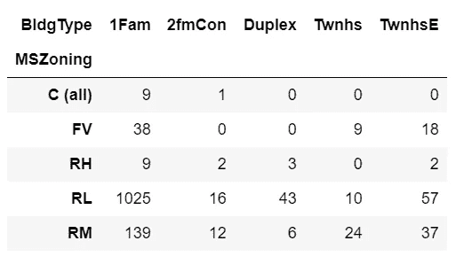*

*Table 11*

*下面我们在行内标准化。这就给出了每个分区分类中属于每个建筑类型变量的房屋比例。*

```
*x.apply(lambda z: z/z.sum(), axis=1)*
```

*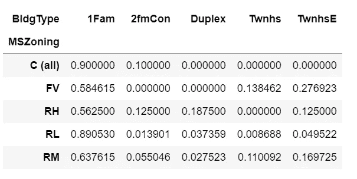*

*Table 12*

*我们也可以在列内标准化。这给了我们属于每个分区分类的每种建筑类型中的房屋比例。*

```
*x.apply(lambda z: z/z.sum(), axis=0)*
```

*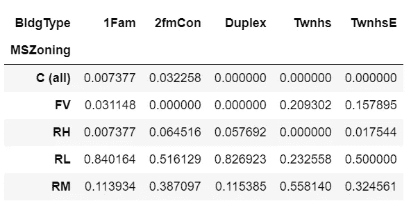*

*Table 13*

*更进一步，我们将针对空调和建筑类型变量的每个组合，查看每个分区类别中房屋的比例。*

```
*df.groupby(["CentralAir", "BldgType", "MSZoning"]).size().unstack().fillna(0).apply(lambda x: x/x.sum(), axis=1)*
```

*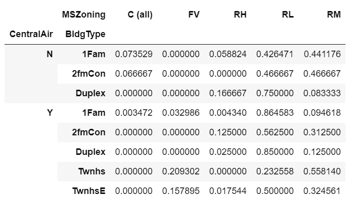*

*Table 14*

*数据中比例最高的房屋是分区 RL、带空调和 1Fam 建筑类型的房屋。由于没有空调，最高比例的房屋是分区 RL 和复式建筑类型的房屋。*

## *混合分类和定量数据*

*为了更有趣，我们将绘制一个小提琴图来显示每个建筑类型类别中房屋的销售价格分布。*

*price_violin_plot.py*

*Figure 17*

*我们可以看到，1Fam 建筑类型的销售价格分布略微右偏，而对于其他建筑类型，销售价格分布接近正态分布。*

*这个帖子的 Jupyter 笔记本可以在 [Github](https://github.com/susanli2016/Machine-Learning-with-Python/blob/master/Practical%20Statistics%20House%20Python_update.ipynb) 上找到，还有一个 [nbviewer 版本](https://nbviewer.jupyter.org/github/susanli2016/Machine-Learning-with-Python/blob/master/Practical%20Statistics%20House%20Python_update.ipynb)。*

*参考:*

*[](https://www.coursera.org/specializations/statistics-with-python?) [## 使用 Python | Coursera 进行统计

### 这种专业化的目的是教学习者开始和中级概念的统计分析使用？…

www.coursera.or](https://www.coursera.org/specializations/statistics-with-python?)*