# 成功描述客户群的实用步骤和注意事项

> 原文：<https://towardsdatascience.com/practical-steps-and-considerations-to-successfully-profile-your-customer-base-19f3f0991407?source=collection_archive---------10----------------------->

# 如何使用特征丰富的数据集，通过 K 均值聚类、主成分分析和 Bootstrap 聚类评估进行有效的统计分割


Photo by [Toa Heftiba](https://unsplash.com/@heftiba?utm_source=medium&utm_medium=referral) on [Unsplash](https://unsplash.com?utm_source=medium&utm_medium=referral)

# 概观

统计细分是我最喜欢的分析方法之一:我从自己的咨询经验中发现，它能很好地引起客户的共鸣，并且是一个相对简单的概念，可以向非技术受众解释。

今年早些时候，我使用了流行的 K-Means 聚类算法，根据客户对一系列**营销活动**的反应来划分客户。为了进行分析，我特意选择了一个基本数据集，以表明这不仅是一个相对容易进行的分析，而且有助于挖掘客户群中有趣的行为模式，即使使用很少的客户属性。

在这篇文章中，我使用一个**复杂且功能丰富的数据集**重新审视了客户细分，以展示在更现实的环境中运行这种类型的分析时，您需要采取的实际步骤和可能面临的典型决策。

**注意**为了简洁起见，我只包括了构成故事流程的一部分的代码，所以所有的图表都是“只有图片和数字”。你可以在我的网站 找到完整的客户档案分析 [**。**](https://rpubs.com/DiegoUsai/534775)

# 商业目标

选择合适的方法取决于你想要回答的问题的性质和你的企业所处的行业类型。在这篇文章中，我假设我正在与一个客户一起工作，这个客户希望**更好地了解他们的客户基础**，特别强调每个客户对企业底线的**货币价值**。

一种非常适合这种分析的方法是流行的 [RFM 细分](https://en.wikipedia.org/wiki/RFM_%28customer_value%29)，它考虑了 3 个主要属性:

*   `Recency`–*客户最近购买了什么？*
*   `Frequency`–*他们多久购买一次？*
*   `Monetary Value`–*他们花了多少钱？*

这是一种受欢迎的方法，理由很充分:实现很容易**(你只需要一个随时间变化的客户订单的交易数据库)，并且基于**每个客户贡献了多少**显式地创建子组。**

# 加载库

```
library(tidyverse)
library(lubridate)
library(readr)
library(skimr)
library(broom)
library(scales)
library(ggrepel)
library(fpc)
```

# 数据

我在这里使用的数据集附带了一个红皮书出版物，可以在附加资料部分免费下载。这些数据涵盖了**样本户外公司**的 *3 & 1/2 年*的销售额`orders`，这是一家虚构的 B2B 户外设备零售企业，并附有他们销售的`products`及其客户(在他们的案例中是`retailers`)的详细信息。

在这里，我只是加载已编译的数据集，但如果你想继续，我也写了一篇名为[加载、合并和连接数据集](https://diegousai.io/2019/09/loading-merging-and-joining-datasets/)的文章，其中我展示了我如何组装各种数据馈送，并整理出变量命名、新功能创建和一些常规内务任务等内容。

```
orders_tbl <- read_rds("orders_tbl.rds")
```

你可以在我的 Github 库上找到完整的代码。

# 数据探索

这是任何数据科学项目的关键阶段，因为它有助于理解数据集。在这里，你可以*了解变量之间的关系*，发现数据中有趣的模式，检测异常事件和异常值。这也是你*制定假设*的阶段，假设细分可能会发现哪些客户群。

首先，我需要创建一个分析数据集，我称之为`customers_tbl` ( `tbl`代表 [**tibble**](https://cran.r-project.org/web/packages/tibble/vignettes/tibble.html) ，R modern 代表数据帧)。我将`average order value`和`number of orders`包括在内，因为我想看看 RFM 标准之外的几个变量，即近期、频率和货币价值。

```
customers_tbl <- 
   orders_tbl %>%  
                                 # cut-off date is 30-June-2007
   mutate(days_since = as.double( 
     ceiling(
       difftime(
          time1 = "2007-06-30",
          time2 = orders_tbl$order_date, 
          units = "days")))
          ) %>%
   filter(order_date <= "2007-06-30") %>% 
   group_by(retailer_code) %>%    # create analysis variables
   summarise(
      recency = min(days_since),  # recency
      frequency = n(),            # frequency
      avg_amount = mean(revenue), # average sales
      tot_amount = sum(revenue),  # total sales
      # number of orders
      order_count = length(unique(order_date))
      ) %>%                          
   mutate(avg_order_val =         # average order value
            tot_amount / order_count) %>% 
   ungroup()
```

根据经验，你最好在你的细分中包括一个良好的 **2 到 3 年的交易历史**(这里我用的是完整的 *3 & 1/2* 年)。这确保您的数据有足够的变化，以捕捉各种各样的客户类型和行为、不同的购买模式和*异常值*。

**异常值**可能代表很少出现的客户，例如，在一段时间内只进行了一些零星的购买，或者只下了一两个非常大的订单就消失了。一些数据科学从业者更喜欢从细分分析中排除离群值，因为 *k 均值聚类*倾向于将它们放在自己的小组中，这可能没有什么描述能力。相反，我认为重要的是包括异常值，这样就可以研究它们，了解它们为什么会出现，如果这些客户再次出现，就用正确的激励措施瞄准他们(比如*推荐他们可能购买的产品*，多次购买折扣，或者让他们加入一个*忠诚度计划*)。

# 单变量探索

## 崭新

新近分布严重右偏，平均值约为 29，50%的观察值介于 9 和 15 之间。这意味着大部分顾客在过去 15 天内进行了最近一次购买。

```
**summary**(customers_tbl$frequency)##    Min. 1st Qu.  Median    Mean 3rd Qu.    Max. 
##     2.0   245.0   565.5   803.1   886.2  8513.0
```

通常情况下，我希望订单在时间上分布得更均匀一些，尾部的第一部分不会有太多缺口。集中在过去 2 周活动中的大量销售告诉我，订单是“手动”添加到数据集的，以模拟订单激增。

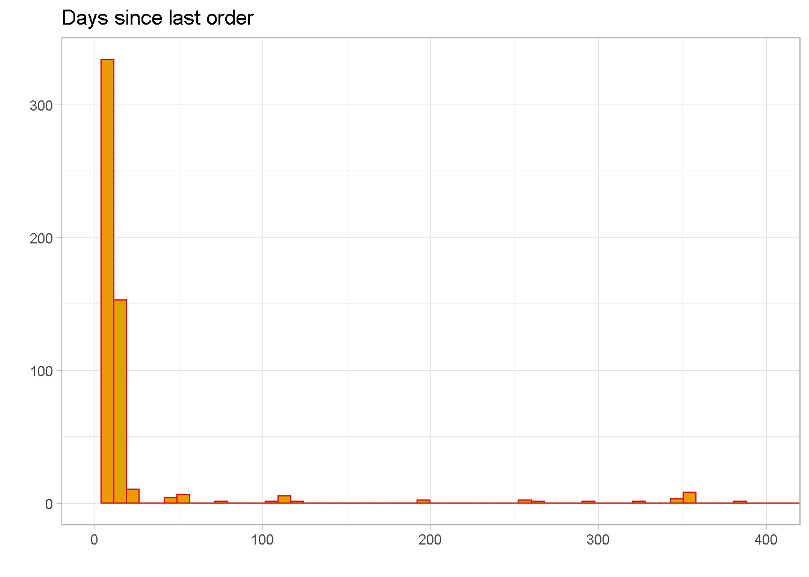

## 频率

分布是右偏的，大多数客户购买了 250 次到不到 900 次，平均值被右偏拉到中值以上。

```
**summary**(customers_tbl$frequency)##    Min. 1st Qu.  Median    Mean 3rd Qu.    Max. 
##     2.0   245.0   565.5   803.1   886.2  8513.0
```

在每个客户购买 4000 次以上时，可以发现少量异常值，其中一个极值点超过 8500 次。

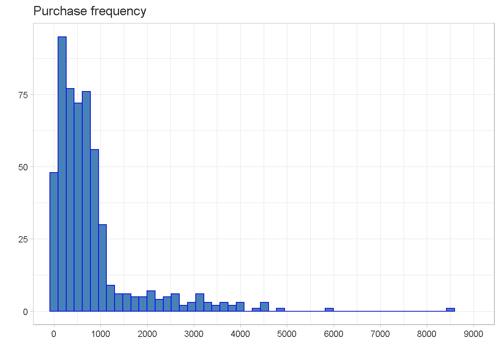

## 总销售额和平均销售额

`total sales`和`average sales`都是右偏的，总销售额在 5000 万美元和 7500 万美元标记处显示出一些极端的异常值，无论平均销售额是否有更连续的尾部。

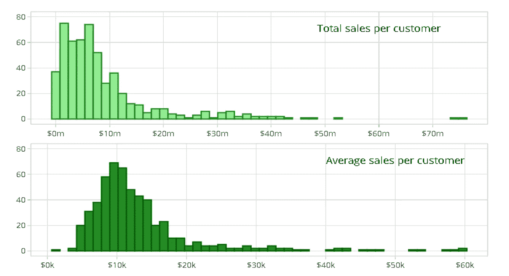

它们都可以很好地捕捉细分的*货币价值*维度，但我个人更喜欢`average sales`，因为它缓和了极端值的影响。

## 订单数量

`orders per customer`的数量在左手边显示出一个双模态的暗示，一个峰值在 30 左右，另一个峰值在 90 左右。这表明了数据中不同亚组的潜力。

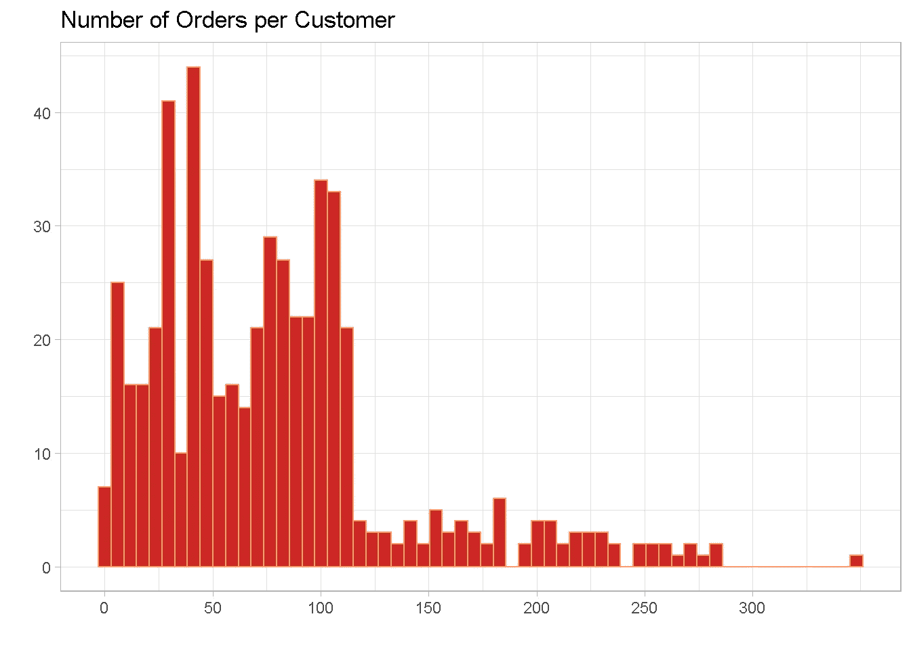

这种分布也有右偏，在截至 2007 年 6 月 30 日的 3 年中，大多数零售商的订单数量在 37 到 100 之间。有少量异常值，一个极端的例子是一家零售商在 3 年内下了 **349 份订单**。

```
**summary**(customers_tbl$order_count)##    Min. 1st Qu.  Median    Mean 3rd Qu.    Max. 
##    1.00   37.00   72.00   78.64  103.00  349.00
```

## 平均订单价值

`average order value`刚刚超过 10.5 万美元，50%的订单价值在 6.5 万美元到 13 万美元之间，少数异常值超过 30 万美元。

```
**summary**(customers_tbl$avg_order_val)##    Min. 1st Qu.  Median    Mean 3rd Qu.    Max. 
##   20238   65758   90367  105978  129401  661734
```

我们还发现了少量超出每个订单 30 万美元的异常值。

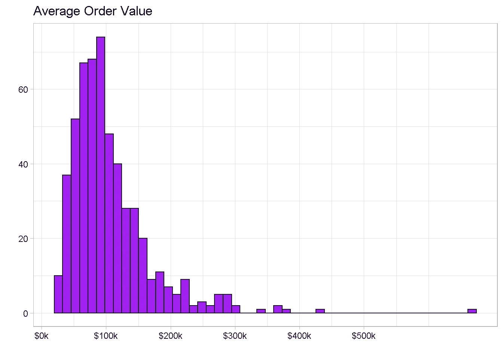

# 多变量探索

将 2 或 3 个变量绘制在一起是理解它们之间存在的关系的一个很好的方法，并且可以感觉到你可能会找到多少个聚类。绘制尽可能多的组合总是好的，但这里我只展示最显著的组合。

让我们画出 RFM 三重奏(`recency`、`frequency`和`average sales`)并使用频率对这些点进行颜色编码。

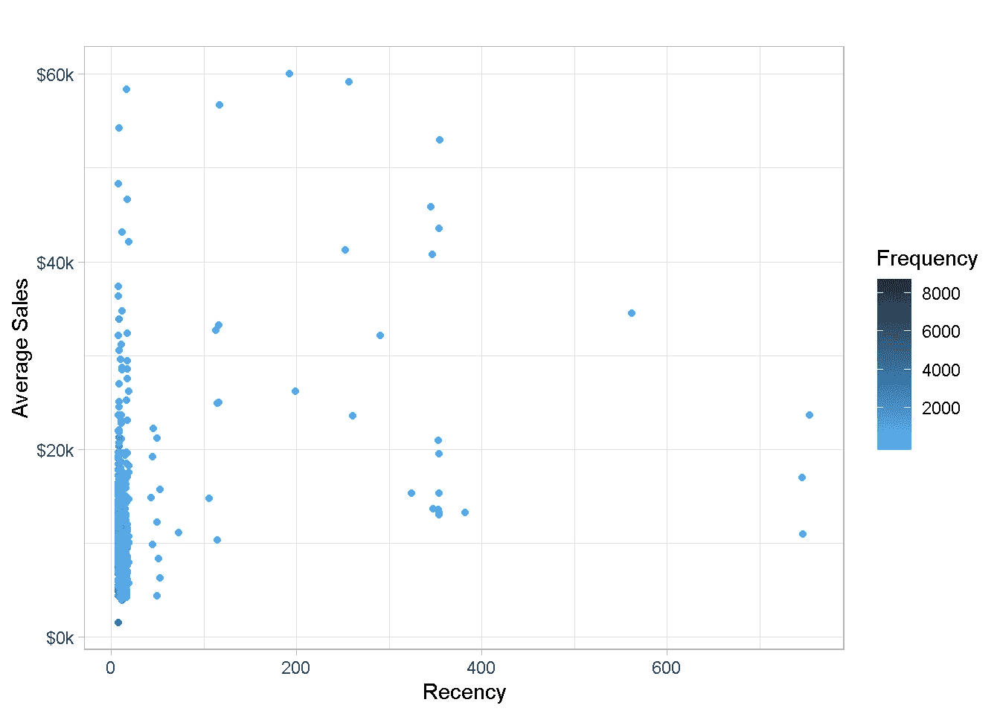

该图表不太容易阅读，因为大多数数据点聚集在左侧，鉴于我们在前一节中发现`recency`严重向右倾斜，这并不奇怪。您还可以注意到，大多数点都是淡蓝色，表示购买频率较低。

为了使图表更具可读性，通常方便的做法是用正偏斜对变量进行对数变换，以将观察值分布到整个绘图区。

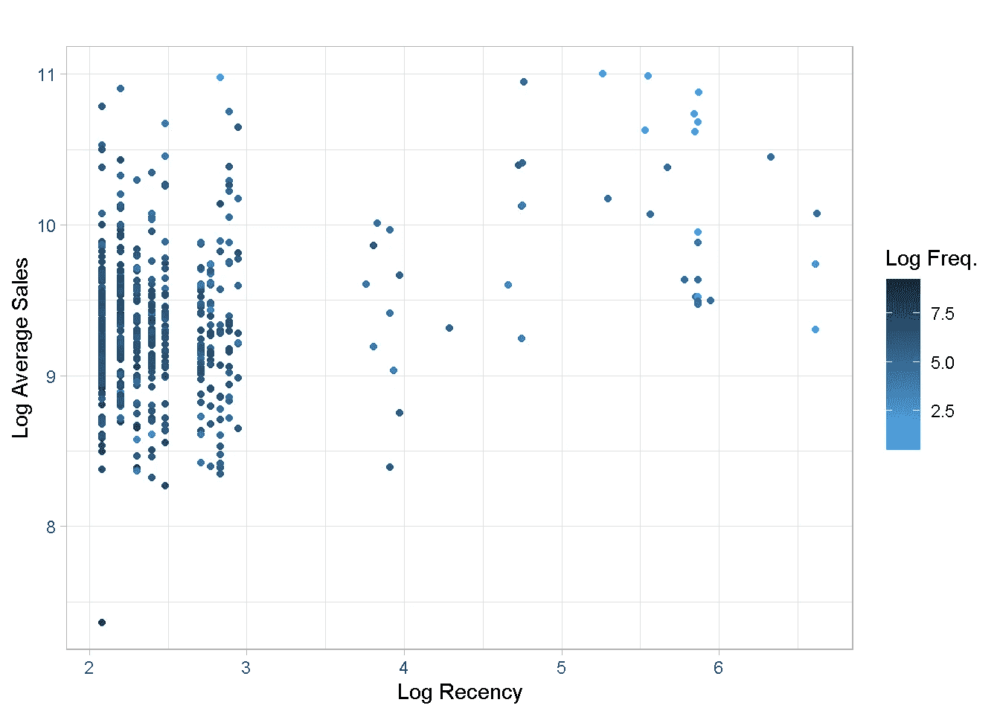

即使是对数刻度对图表的可读性也没有太大帮助。鉴于`recency`中发现的极端右偏，我预计聚类算法可能会发现很难识别定义良好的组。

# 分析

为了描述客户，我使用了 K 均值聚类技术:它可以很好地处理大型数据集，并快速迭代到稳定的解决方案。

首先，我需要调整变量的比例，以便它们大小的相对差异不会影响计算。

```
clust_data <- 
   customers_tbl %>% 
   **select**(-retailer_code) %>% 
   **scale**() %>% 
   **as_tibble**()
```

然后，我构建一个函数来计算任意数量的中心的`kmeans`,并创建一个嵌套的 tibble 来容纳所有的模型输出。

```
kmeans_map <- **function**(centers = centers) {
   **set.seed**(1975)                   *# for reproducibility*
   clust_data[,1:3] %>%  
      **kmeans**(centers = centers, 
             nstart = 100, 
             iter.max = 50)
}kmeans_map_tbl <-                *# Create a nested tibble*
   **tibble**(centers = 1:10) %>%    *# create column with centres* 
   **mutate**(k_means = centers %>% 
          **map**(kmeans_map)) %>%   *# iterate `kmeans_map` row-wise* 
   **mutate**(glance = k_means %>%   *# apply `glance()` row-wise* **map**(glance))
```

最后，我可以构建一个`scree plot`并寻找“肘”，在这个点上，添加额外集群的增益`tot.withinss`开始变得平稳。看起来最佳的集群数是 **4** 。

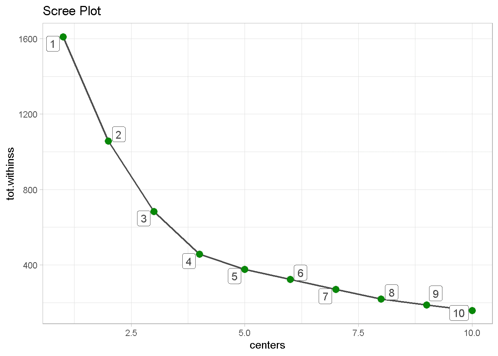

# 评估集群

尽管该算法在数据中捕获了一些不同的组，但是在分类 1 和 2 以及分类 3 和 4 之间也有一些明显的重叠。

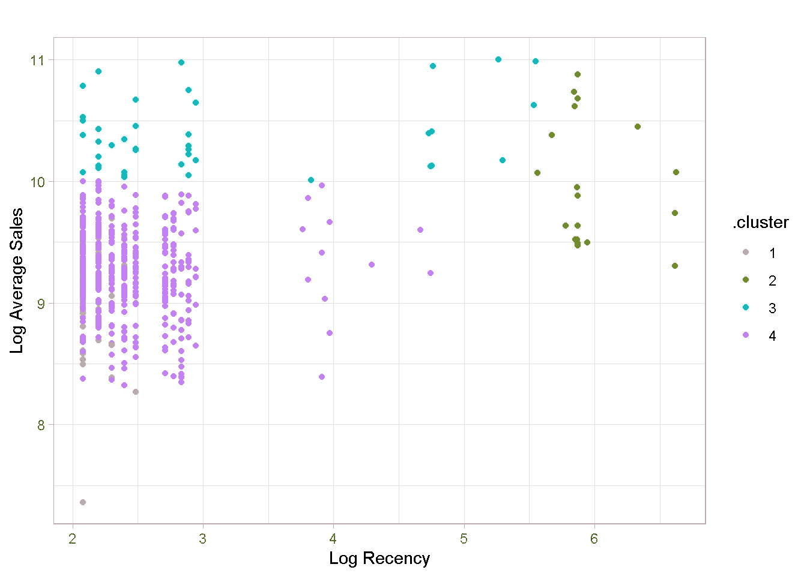

此外，集群之间的平衡不是特别好，第 4 组包含了所有`retailers`的近 80%,这对于分析您的客户来说用处有限。第 1 组、第 3 组和第 4 组具有非常相似的`recency`值，第 2 组捕获了一些(但不是全部)“最近”的买家。

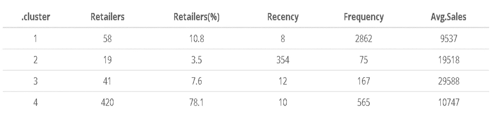

rfm 4-cluster table

# 替代分析

正如预期的那样，该算法正在努力寻找基于`recency`的定义明确的群体。我对基于 RFM 的分析不是特别满意，我认为考虑不同的特征组合是明智的。

我已经研究了几个备选方案(为了简洁起见，这里没有包括)，发现每个客户的`average order value`、`orders per customer`和`average sales` 是有希望的候选方案。绘制它们揭示了足够好的特征分离，这是令人鼓舞的。

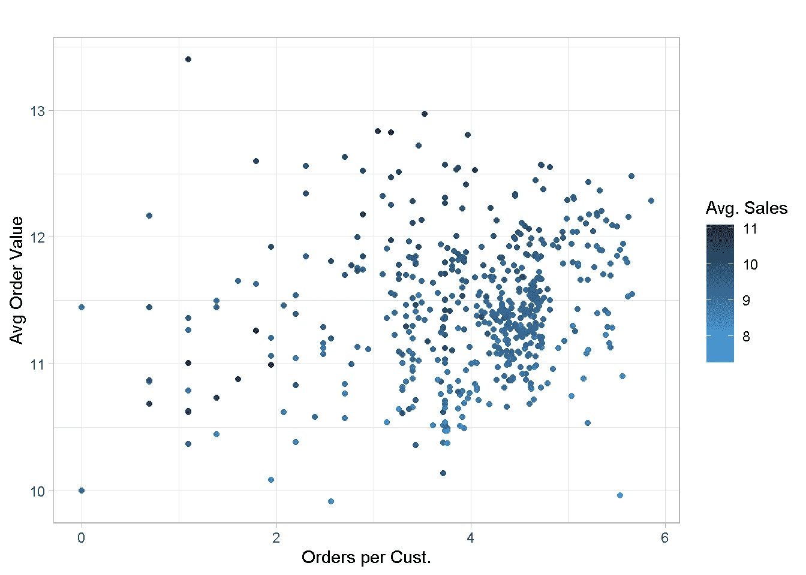

让我们用新的变量再进行一次客户细分。

```
*# function for a set number of centers*
kmeans_map_alt <- **function**(centers = centers) {
   **set.seed**(1975)                 *# for reproducibility*
   clust_data[,4:6] %>%           *# select relevant features*
      **kmeans**(centers = centers, 
             nstart = 100, 
             iter.max = 50)
}*# create nested tibble*
kmeans_map_tbl_alt <- 
   **tibble**(centers = 1:10) %>%     *# create column with centres* 
   **mutate**(k_means = centers %>% 
       **map**(kmeans_map_alt)) %>%   *# iterate row-wise* 
   **mutate**(glance = k_means %>%    *# apply `glance()` row-wise*
       **map**(glance)) 
```

同样，聚类的最佳数量应该是 **4** ，但是斜率变为 5 的变化没有我们之前看到的那么明显，这可能意味着有意义的组的数量可能会更高。

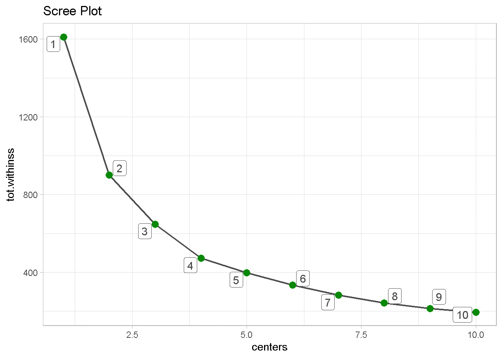

# 评估集群

虽然仍然存在，但集群重叠不太明显，群体分离更加明显。

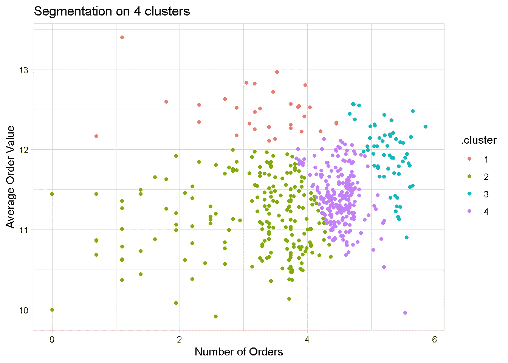

集群被更好地定义，不再像以前那样由一个群体主宰。虽然没有在模型中使用，但我已经在表格中添加了`recency`,表明即使是以前的“问题儿童”现在在各个组中也更加平衡了。

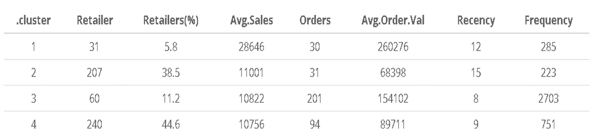

当我增加集群的数量时，组分离仍然很整齐，一些明显的重叠仅在 7 集群配置中再次出现。

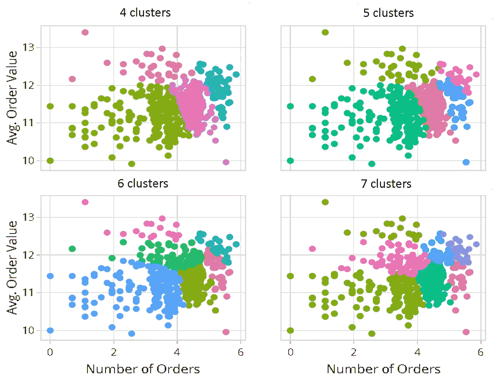

# 主成分分析

绘制变量组合图是一个很好的探索性练习，但本质上是任意的，可能会导致错误和遗漏，尤其是当您需要考虑的变量不止一个时。

幸运的是，我们可以使用降维算法，如主成分分析，简称 PCA，来可视化客户群。

PCA 的一个主要优点是每个 PCs 都与最大化数据线性方差的方向正交。这意味着前几个 PC 可以捕获数据中的大部分方差，并且是比上面图的变量比较更可靠的聚类的二维可视化。

为了执行*主成分分析*，我使用了基数 r 的`prcomp`函数。

**非常重要:**不要忘记缩放和居中您的数据！出于某种原因，这不是默认的！

```
pca_obj <- 
   customers_tbl[,5:7] %>% 
   **prcomp**(center = TRUE, 
          scale. = TRUE)**summary**(pca_obj)
*## Importance of components:*
*##                          PC1   PC2  PC3*
*## Standard deviation     1.422 0.942 0.30*
*## Proportion of Variance 0.674 0.296 0.03*
*## Cumulative Proportion  0.674 0.970 1.00*
```

最好看一下每台电脑解释的*差异*。我需要的信息是**方差比例**。

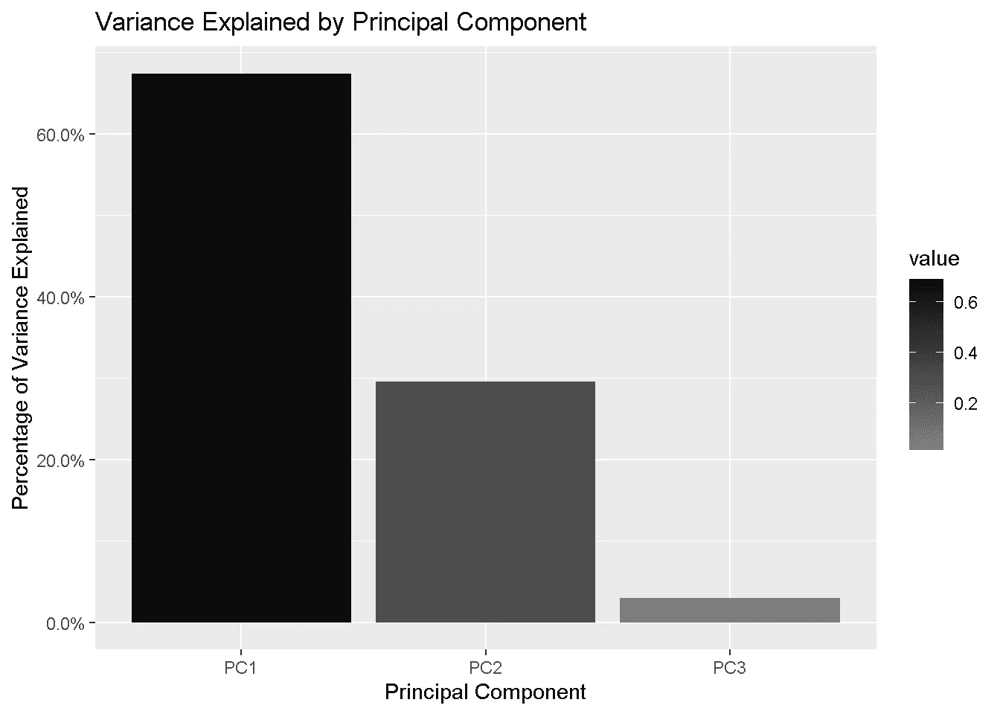

前两个组成部分解释了数据中 97%的变化，这意味着使用前两个 PC 将使我们对数据有很好的理解，随后的每个 PC 将增加很少的信息。当您有大量变量要在聚类中运行时，这显然更有意义。

# 4 个聚类的 PCA 可视化

首先，我从`pca_obj`中提取 PCA，并将元素`x`中包含的 PCs 坐标与原始`customer_tbl`集中的`retailer`信息连接起来。

```
pca_tbl <- 
   pca_obj$x %>%                 *# extract "x", which contains the PCs co-ordinates*
   **as_tibble**() %>%               *# change to a tibble*
   **bind_cols**(customers_tbl %>%   *# append retailer_code*
             **select**(retailer_code))
```

然后，我从`kmeans_map_tbl_alt`开始`pluck`第 4 个元素，将集群信息附加到它上面，并通过**零售商代码**连接`left_join`,这样我在一个 tibble 中就有了我需要的所有信息，为绘图做好准备。

```
km_pca_4_tbl <- 
   kmeans_map_tbl_alt %>% 
   **pull**(k_means) %>%
   **pluck**(4) %>%                  *# pluck element 4* 
   **augment**(customers_tbl) %>%    *# attach .cluster to the tibble* 
   **left_join**(pca_tbl,            *# left_join by retailer_code* 
             by = 'retailer_code')
```

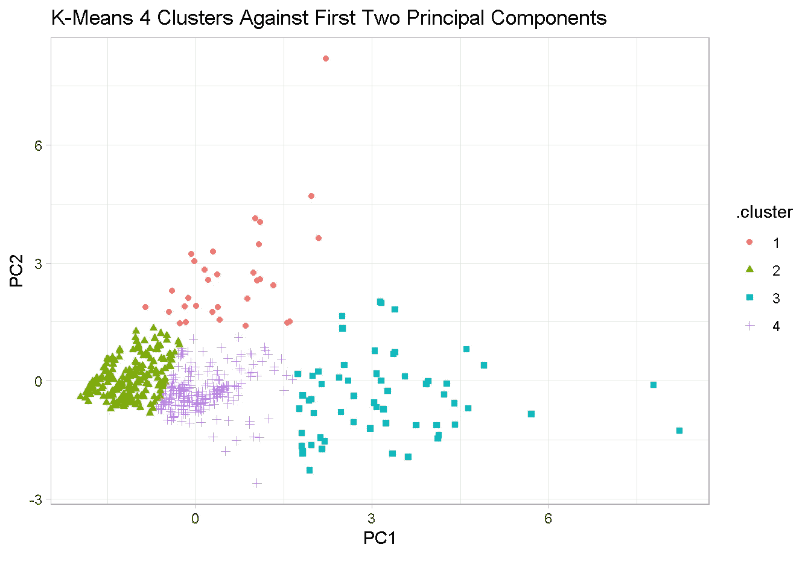

该图证实了在 4 集群配置中，各个段被很好地分开。分段 1 和分段 3 在不同方向上显示出显著的可变性，并且分段 2 和分段 4 之间存在一定程度的重叠。

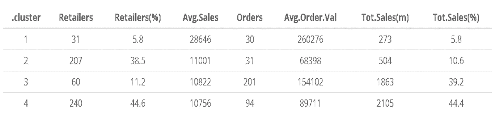

**第 1 组**包括下了少量高额订单的客户。尽管他们只占总销售额的 6%,鼓励他们下稍微多一点的订单也能大大增加你的底线。

**第 2 组**是“订单价值低”/“订单数量低”部分。然而，由于它几乎占客户群的 40%，我会鼓励他们增加订单价值或订单数量。

**第 3 组**相对较小(占总`retailers`的 11%),但已经下了*非常多的中高价值订单*。这些是你最有价值的客户，占总销售额的近 40%。我想让他们非常开心和投入。

**第四组**是**好机会**可能出现的地方！就零售商数量(45%)和对总销售额的贡献(44%)而言，这是最大的群体。我会试着激励他们转移到第 1 组或第 3 组**的**。

# 6 个聚类的 PCA 可视化

**重要提示**:集群编号是随机生成的，因此群组名称与上一节中的名称不匹配。

现在，让我们看看添加额外的集群是否揭示了一些隐藏的动态，并帮助我们微调这个分析练习。这里我只展示 6 集群配置，这是最有前途的。

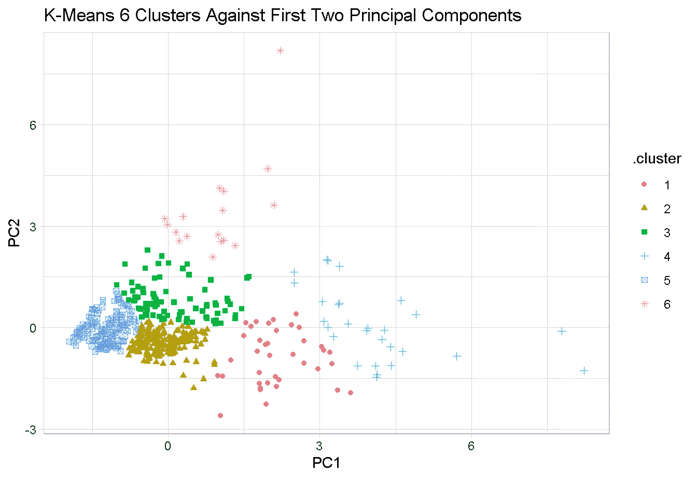

6-片段设置广泛地证实了在 4-分割解决方案中发现的组结构和分离，显示了良好的簇稳定性。之前的细分市场 1 和 3 进一步分裂，形成 2 个*“中端”*组，每个组都从之前的细分市场 2 和 4“借用”。

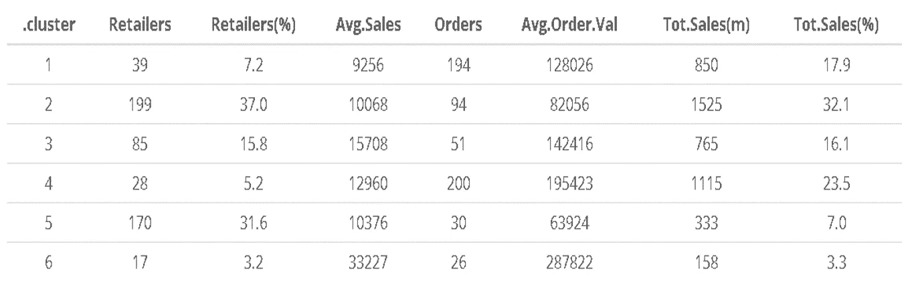

新的*【中端】*群体有其独特的特点:

*   **新组 1** 的客户正在下*中高价值*的*高订单数量，并贡献了*总销售额*的约 18%。*
*   **测试**的策略:由于他们已经频繁下订单，我们可能会向他们提供激励措施**以增加他们的订单价值**。
*   另一方面，**新的第 3 组**客户购买*的频率降低*，具有类似的*中高订单价值*，约占*总客户*的 16%。
*   **测试**的策略:在这种情况下，激励可以集中在**提高订单数量**。

定义更好的集群代表更大的潜在机会:测试不同的策略、了解每个群体真正的共鸣以及使用正确的激励与他们联系起来变得更加容易。

# 集群启动评估

值得采取的最后一个步骤是通过验证它们是否捕获了数据中的非随机结构来验证您的集群有多“真实”。这对于 k 均值聚类尤其重要，因为分析师必须提前指定聚类的数量。

**clusterboot 算法**使用 bootstrap 重采样来评估给定集群对数据扰动的稳定程度。通过测量给定数量的重采样运行的集合之间的相似性来评估聚类的稳定性。

```
kmeans_boot100 <-
   **clusterboot**(
      clust_data[,4:6],
      B = 50,                    *# number of resampling runs*
      bootmethod = "boot",       *# nonparametric resampling* 
      clustermethod = kmeansCBI, *# clustering method: k-means* 
      k = 7,                     *# number of clusters* 
      seed = 1975)               *# for reproducibility*bootMean_df <-                   # saving results to a data.frame
   **data.frame**(cluster = 1:7, 
              bootMeans = kmeans_boot100$bootmean)
```

为了解释结果，我用一个简单的图表来可视化测试输出。

请记住:

*   值**高于 0.8** (段 2、3 和 5)表示高度稳定的簇
*   值**在 0.6 和 0.75** 之间(段 1、4 和 6)表示可接受的稳定度
*   低于 0.6 (段 7)的值**应视为不稳定**

因此，6 集群配置总体上相当稳定。

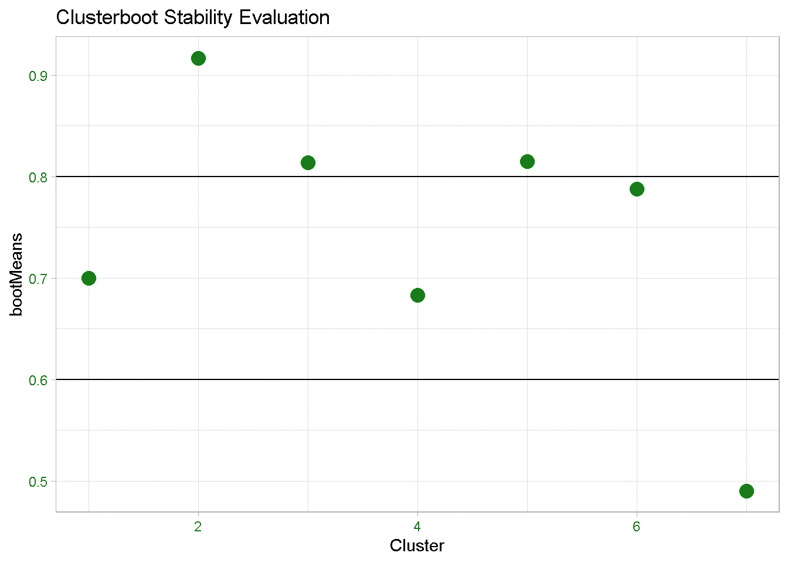

# 结束语

在这篇文章中，我使用了一个功能丰富的数据集来运行您需要采取的实际步骤，以及在运行客户概要分析时可能面临的考虑。我在一系列不同的客户属性上使用了 **K-means 聚类**技术，在客户群中寻找潜在的子群体，用**主成分分析**直观地检查了不同的群体，并用`fpc`包中的**集群引导**验证了集群的稳定性。

这种分析应该为与相关业务涉众的讨论提供一个坚实的基础。通常情况下，我会根据客户特征的不同组合向客户展示各种资料，并提出我自己的数据驱动型建议供讨论。然而，最终还是由他们来决定他们想要满足于多少个组，以及每个细分市场应该具有什么样的特征。

# 结论

统计细分非常容易实现，可以识别您的客户群中自然发生的行为模式。但是，它有一些限制，在商业环境中应该始终牢记。首先也是最重要的，它是一张及时的快照，就像一张照片一样，它只代表拍摄的那一瞬间。

因此，应该定期对**进行重新评估**，因为:

*   它可以捕捉不一定适用于不同时间段的季节性影响
*   **新客户**可以进入你的客户群，改变每个群体的构成
*   客户的购买模式会随着时间的推移而演变，你的客户档案也应该如此

尽管如此，统计细分仍然是在消费者数据中寻找群体的一个强大而有用的探索性练习。我从自己的咨询经验中发现，这也能引起客户的共鸣，而且对于非技术受众来说，这是一个相对简单的概念。

# 代码库

完整的 R 代码可以在[我的 GitHub 简介](https://github.com/DiegoUsaiUK/Customer_Analytics/tree/master/RFM_Segmentation)中找到

# 参考

*   关于[客户细分优势的更广泛讨论](https://www.insanegrowth.com/customer-segmentation/)
*   关于[主成分分析](http://setosa.io/ev/principal-component-analysis/)的直观介绍
*   对于[集群启动算法](https://www.r-bloggers.com/bootstrap-evaluation-of-clusters/)的应用
*   对于某些 [k-means 缺点的批判](https://www.datascience.com/blog/k-means-alternatives)

*原载于 2019 年 9 月 23 日*[*https://diegousei . io*](https://diegousai.io/2019/09/steps-and-considerations-to-run-a-successful-segmentation/)*。*