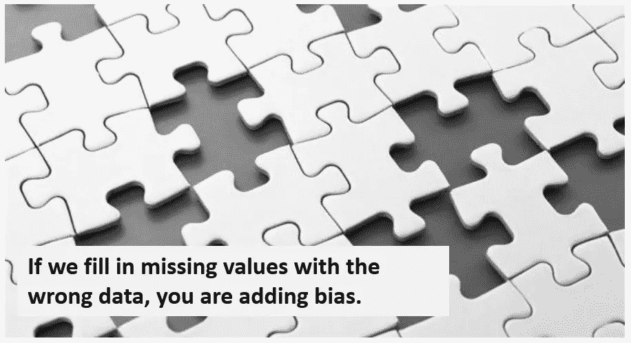
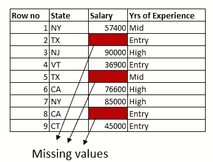
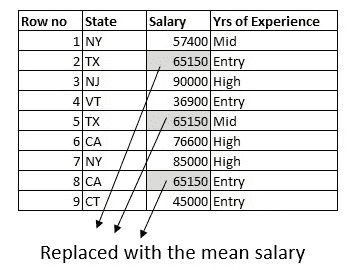
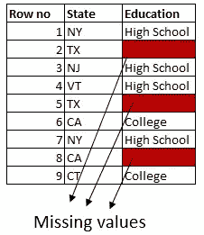
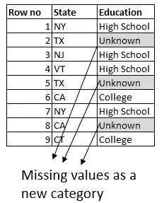

# 处理缺失值的实用策略

> 原文：<https://towardsdatascience.com/practical-strategies-to-handle-missing-values-626f9c43870b?source=collection_archive---------10----------------------->

大多数数据科学项目中的主要挑战之一是找出一种获得干净数据的方法。总时间的 60%到 80%花在清理数据上，然后您才能对其进行有意义的理解。对于 BI 和预测分析项目来说都是如此。为了提高数据清理过程的有效性，当前的趋势是从手动数据清理迁移到更加智能的基于机器学习的过程。

# 确定我们正在处理的缺失值的类型

在我们深入研究如何处理缺失值之前，弄清楚缺失值的性质是至关重要的。根据缺少的数据与数据集中的其他数据之间是否存在关系，有三种可能的类型。

1.  它们可能无法解释为什么一个列的数据与数据中的其他列一起丢失，并被称为完全随机丢失( **MCAR** )。这种情况的一个例子可能是由于某人不能赴约而导致调查数据丢失。或者管理员将他/她应该输入计算机的测试结果放错了地方。缺失值的原因与数据集中的数据无关。
2.  有些情况下，一列中缺少的数据可以用其他列中的数据来解释。这就是所谓的随机失踪( **MAR** )。这方面的一个例子是，在一所学校里，超过分数线的学生通常会得到分数。这意味着如果一些学生的分数缺失，可以用分数低于分数线的那一栏来解释。缺失值的原因可以通过另一列中的数据来描述。
3.  有些情况下，缺少的值与值本身有关。例如，高收入者可能不会公开他们的收入。缺失值与实际收入之间存在关联，并且不依赖于数据集中的其他变量。这被称为不是随机丢失( **MNAR** )

一般来说，删除缺失的行对 MCAR 来说是没问题的。输入数据适用于 MCAR 和马尔。如果是 MNAR，必须通过引入额外的列来建模。

# 处理缺失数据的策略

处理缺失值有几种策略。首先，可以使用像随机森林或 KNN 这样的算法，这些算法在处理缺失值时很健壮。第一种常见策略是删除缺少值的行。通常，任何单元格中缺少值的任何行都会被删除。有时，许多行将被删除的可能性很高。由于信息和数据的丢失，当没有足够的样本时，通常不使用这种方法。

可以用多种方式输入丢失的数据。它可能只基于缺少值的列中存在的信息。或者它也可以基于数据集中存在的其他列。最后，还可以使用分类或回归模型来预测缺失值。我们将通过下面的例子来讨论这些。

# 处理数字列中的缺失值

第一种方法是用下列策略之一替换丢失的值。

1.  用常数值替换它。通常，这用于与领域专家讨论我们正在处理的数据。
2.  用平均值或中间值代替它。这是一个不错的方法，特别是当数据很小时，但是它确实增加了偏差。
3.  通过利用其他列中的信息，用值替换它。我们将通过下面的例子对此进行更多的讨论。

在上面的雇员数据集子集中，我们在三行中缺少薪水。我们也有他们居住的州和他们在数据集中的经验。

第一种方法是用列的平均值填充缺失值。这里，我们只使用缺少值的列中的信息。

在领域专家的帮助下，我们可以做得更好，并使用来自数据集中其他列的信息。

各州平均工资不同。用它来填写值。计算在德克萨斯州工作的人的平均工资，并用在德克萨斯州工作的人的平均工资替换缺少德克萨斯州工资的行。对其他州也这样做。

我们还能做得更好吗？除了国家专栏，我们还可以利用多年的经验。

计算在德克萨斯州工作的人员的平均入门级工资，并用德克萨斯州的平均入门级工资替换缺少德克萨斯州入门级人员工资的行。对其他州和其他级别进行同样的操作。

这为你提供了一套很好的估算数据的方法，尤其是当我们有一个领域专家来指导我们的时候。请注意，有一些边界条件需要处理。例如，对于一个居住在得克萨斯州的人，可能会有一行缺少工资和工作经验。有多种方法可以解决这个问题。一个直接的方法是用德克萨斯州的平均工资替换缺失值。

# 使用算法预测缺失值

另一种方法是创建一个简单的回归模型。这里要预测的列是使用数据集中其他列的薪金。如果输入列中有缺失值，我们必须在创建预测模型时处理这些情况。有许多方法可以管理这种情况，但一种简单的方法是选择没有缺失值的要素，或者在任何像元中选取没有缺失值的行。人们可以用不同的技术和不同的算法(KNN，老鼠等)进行实验。)并选择最准确的一个。这可能会在随后的帖子中涉及。

# 处理分类列中的缺失值

处理分类列中的缺失值比处理数字列中的缺失值要容易得多。

1.用常数值或最流行的类别替换它。这是一个很好的方法，尤其是当数据很小时，但是它确实增加了偏差。例如，假设我们有一个包含高中和大学学位值的教育专栏。如果数据集中有更多拥有大学学位的人，我们可以用大学学位替换缺失的值。

2.我们可以通过利用其他专栏中的信息对此进行更多的调整。如果数据集中有更多来自德克萨斯州的高中学历的人，我们可以替换缺失的值来反映德克萨斯州高中毕业的人。

3.也可以创建一个分类模型。我们要预测的列是教育，使用数据集中的其他列。

4.最常见和最流行的方法是将分类列中缺失的值建模为一个名为“未知”的新类别

# 摘要

我们讨论了处理缺失值的几种策略。根据数据的种类和问题的类型，所采用的方法会略有不同。

对于数值，最好利用数据中存在的模式。对于分类列，最好将其建模为一个新的级别。如果你有领域专家的帮助，在填写缺失值时，最好能采纳专家的建议。

需要注意的是，无论选择哪种输入方法，最好运行预测模型，从准确性的角度来看哪种方法效果最好。