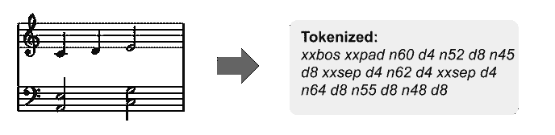
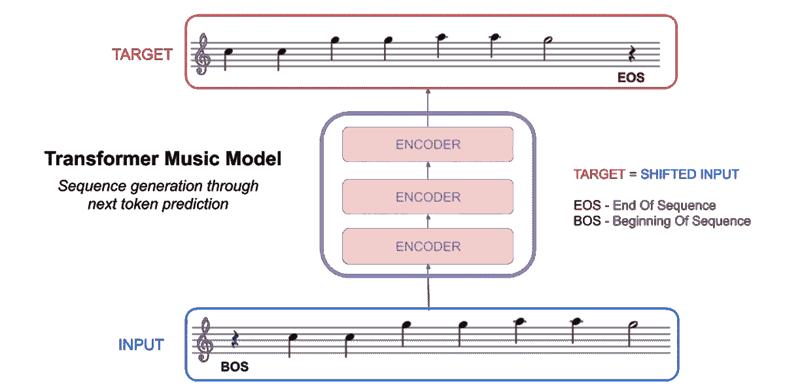

# 训练音乐模型的实用技巧

> 原文：<https://towardsdatascience.com/practical-tips-for-training-a-music-model-755c62560ec2?source=collection_archive---------6----------------------->

这是“构建人工智能音乐生成器”系列的第二部分。我们将更深入地构建在第一部分中介绍的音乐模型。

这里有一个简单的概述:

**数据编码**及如何处理:

*   复调音乐
*   音符音高/持续时间

**培训**最佳实践:

*   数据扩充
*   位置编码
*   教师强迫
*   TransformerXL 架构

*注意:这是一个更技术性的帖子，对于理解* [*第三部分*](https://medium.com/@andrew.t.shaw/a-multitask-music-model-with-bert-transformer-xl-and-seq2seq-3d80bd2ea08e) */* [*第四部分*](https://medium.com/@andrew.t.shaw/how-to-remix-the-chainsmokers-with-a-music-bot-6b920359248c) *并不重要。请随意跳过前面！*

# 快速重复。

在前一篇文章中，我提到了训练音乐模型的两个基本步骤:

**步骤一。**将音乐文件转换成一系列标记:



**第二步。**建立并训练语言模型，预测下一个令牌:



这个职位将被分割在完全相同的步骤。只是这一次，我们不会掩饰细节。

# 第一步。将音乐转换为代币

## 从原始数据开始

我们将使用一个主要由 MIDI 文件组成的数据集。这是最流行的数字音乐格式之一，互联网上有大量这样的文件。更多的数据是深度学习最好的朋友。

原始 MIDI 以字节表示。即使转换成文本也不是很容易读懂。

我不会显示 MIDI，而是向您展示如下内容:


Even if you can’t read music, it makes more sense than [this](https://gist.github.com/bearpelican/d123f61bbffba4005b4c6aee3dbf9195)

## 标记化

事实证明，在将音乐文件编码为令牌时，需要记住几个问题。对于文本，这是一个非常简单的转换。

下面是如何将文本编码为一系列标记:

```
Vocabulary: { 
  'a': 1, 
  'is': 2, 
  'language': 3,
  'like': 4,
  'model': 5,
  'music': 6
}Text:      “a  music model is like a  language model”
Tokenized: [1, 6,    5,    2, 4,   1  3,       5]
```

这是一种直接的一对一映射——单词到单词。您可以进行其他类型的编码，如拆分缩写或字节对编码，但这仍然是一种顺序转换。

然而，音乐在 2D 最具代表性:


这是看待它的另一种方式:


这是频率随时间变化的曲线图(也称为钢琴声)。您会注意到这个图表的两点:

1.  一个*单个*音符是一个*值的集合*(音高+持续时间)
2.  *多个音符*可以在一个*单个*时间点演奏(复调)

用音乐训练变形金刚的诀窍是弄清楚如何将这些 2D 数据符号化为一维。

## 注释—一对多

1.  一个*单个*音符代表一个*集合*的值:
    -音高(C，C #…A #，B)
    -时长(四分音符，全音符)

*注:一个音符实际上有更多的属性，如乐器类型(鼓、小提琴)、力度(响度)和速度(定时)。这些对于生成流行旋律并不重要，但对于生成* [*演奏片段*](https://magenta.tensorflow.org/performance-rnn) *却很有帮助。*

最简单的方法是将一个*单个*音符编码成一个*记号序列*:


*注意:另一种选择是* [*将*](http://christinemcleavey.com/clara-a-neural-net-music-generator/) *的值组合成一个单独的 token【C:QTR，D:QTR，E:HLF】，但这意味着更大的词汇量，对预测的控制更少。*

## **复调——多对一**

> 你怎么知道什么时候同时演奏一系列的音符，或者按顺序演奏？

另一个名为“ [bachbot](https://github.com/tensorflow/magenta/tree/master/magenta/models/polyphony_rnn) ”的音乐模型对此有一个巧妙的解决方案。如果音符由特殊的“ **SEP** ”符号分隔，则按顺序播放音符。如果没有，一次弹奏所有音符。


## **将所有这些放在一起**

把这些放在一起，你就有了我们一开始展示的例子:


*如果你喜欢 Python 胜过英语，试试这个* [*笔记本*](https://github.com/bearpelican/musicautobot/blob/master/notebooks/data_encoding/Midi2Tensor.ipynb) *。*

# 第二步。培训最佳实践

现在，我们准备好对我们的标记化数据进行训练。这将是与第一部分相同的训练代码，但是增加了一些特性。

让我们一行一行地检查代码。

## 数据扩充

> 第 3 行:config['**transpose _ range**']=(0，12)

数据扩充是一个伟大的数据集倍增器。一首歌转化成 12 首不同调的歌！

```
*item.to_text() # Key of C* **Tokens:    xxbos xxpad n60 d4 n52 d8 n45 d8 xxsep d4 n62 d4***item.transpose(4).to_text() # Key of E* **Transpose: xxbos xxpad n64 d4 n56 d8 n49 d8 xxsep d4 n66 d4**
```

数据扩充似乎有助于概括关键音阶和节拍。然而，在训练的最后几个时期，我删除了增强，保留了 c 调中的所有内容。

*无论是机器还是人类，预测和弹奏全白键都要容易得多。*

## 位置拍编码

> 第 2 行:config['encode_position'] = True

位置节拍编码是我们提供给模型的额外元数据，以使它对音乐定时有更好的感觉。

正如我们在标记化步骤中看到的，将音符转换成标记并不是一对一的映射。这意味着令牌的位置与它在时间上的实际位置不一致。

```
*item.to_text()* **Token:  xxbos xxpad n60 d4 n52 d8 n45 d8 xxsep d4 n62 d4***list(range(len(item.data)))*
**Index:   0,    1,    2,  3, 4,  5, 6,  7, 8,    9, 10, 11***item.position//4*
**Beat:    0,    0,    1,  1, 1,  1, 1,  1, 1,    1, 2,  2**
```

在*索引* 7 的**代币实际上是在*节拍* 1 上打出的。**

如果我们将“节拍”元数据和令牌一起发送给我们的模型，它将包含更多的上下文信息。它不再需要自己计算音乐的节奏。

## **老师逼问**

> 第 4 行:config[' **mask_steps** '] = 4

当训练变形金刚时，你通常应用一个注意力面具来防止模型偷看它应该预测的下一个令牌。

```
*lm_mask(x_len=10, device=None)               # 10 = bptt*tensor([[[[0, 1, 1, 1, 1, 1, 1, 1, 1, 1],    # Can only see itself
          [0, 0, 1, 1, 1, 1, 1, 1, 1, 1],
          [0, 0, 0, 1, 1, 1, 1, 1, 1, 1],
          [0, 0, 0, 0, 1, 1, 1, 1, 1, 1],
          [0, 0, 0, 0, 0, 1, 1, 1, 1, 1],
          [0, 0, 0, 0, 0, 0, 1, 1, 1, 1],
          [0, 0, 0, 0, 0, 0, 0, 1, 1, 1],
          [0, 0, 0, 0, 0, 0, 0, 0, 1, 1],
          [0, 0, 0, 0, 0, 0, 0, 0, 0, 1],  
          [0, 0, 0, 0, 0, 0, 0, 0, 0, 0]]]]) # Can see everything**# 0 = Can see token** 
**# 1 = Can't see token**
```

*每一行代表一个时间步长，它可以看到或看不到哪些标记。*

除了屏蔽未来的标记，您还可以屏蔽之前的几个标记。这迫使模型提前预测几个步骤，并在理想情况下产生一个更一般化的模型。

```
*window_mask(10, None, size=(2,0))           # Window size of 2*tensor([[[[0, 1, 1, 1, 1, 1, 1, 1, 1, 1],   # Only sees itself
          [0, 1, 1, 1, 1, 1, 1, 1, 1, 1],   # Only sees the previou
          [0, 0, 1, 1, 1, 1, 1, 1, 1, 1],
          [0, 0, 1, 1, 1, 1, 1, 1, 1, 1],
          [0, 0, 0, 0, 1, 1, 1, 1, 1, 1],
          [0, 0, 0, 0, 1, 1, 1, 1, 1, 1],
          [0, 0, 0, 0, 0, 0, 1, 1, 1, 1],
          [0, 0, 0, 0, 0, 0, 1, 1, 1, 1],
          [0, 0, 0, 0, 0, 0, 0, 0, 1, 1],
          [0, 0, 0, 0, 0, 0, 0, 0, 1, 1]]]])# Can't see final 2
```

把这个想成是一个反转的“老师逼”。

## 变压器架构

> 第 6 行:model = get _ language _ model(arch =**MusicTransformerXL**…)

[TransformerXL](https://ai.googleblog.com/2019/01/transformer-xl-unleashing-potential-of.html) 是一种特定风味的变压器型号。它具有相对位置编码和隐藏状态记忆功能。

**变压器内存**实现超快速推理。不必在每次预测时都重新评估整个序列，您只需要评估最后一个预测的标记。先前的令牌已经存储在存储器中

**相对位置—** 普通变压器仅使用绝对位置。对于音乐模型来说，知道每个记号*相对于另一个*的位置非常重要。*这是对我们的位置节拍编码*的补充

## 训练循环

> learn.to_fp16(dynamic=True，clip = 0.5)；
> learn.fit_one_cycle(4)

fastai 库免费提供训练代码。我就不赘述了，但是混合精度，一个周期，多 GPU 训练会节省你很多时间。

## 结束了。

咻！现在你知道了我所知道的关于音乐变形金刚的一切。现在我们可以在这个概念的基础上创造一个更酷的音乐模型——多任务变压器。

[**第三部分。构建一个多任务音乐模型**](https://medium.com/@andrew.t.shaw/a-multitask-music-model-with-bert-transformer-xl-and-seq2seq-3d80bd2ea08e)*——*一个增强的 MusicTransformer。它可以和声，产生旋律，并混音歌曲。**

*[**第四部分。用一个音乐机器人重新混合烟雾弹**](https://medium.com/@andrew.t.shaw/how-to-remix-the-chainsmokers-with-a-music-bot-6b920359248c)——*用音乐机器人重新混合艾伯顿的一个 EDM drop。纯娱乐目的而已。**

# **感谢阅读！**

> *特别感谢[耶鲁安·克斯滕](https://www.thehim.com/)和[杰瑞米·霍华德](https://www.fast.ai/)的指导，[南方公园公地](https://medium.com/@southparkcommons)和[帕拉帕维克](https://www.palapavc.com/)的支持。*