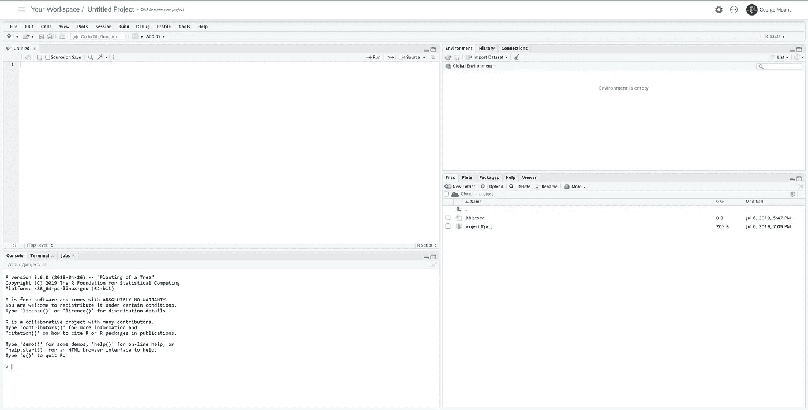

# 免费在云上练习 R 和 Python

> 原文：<https://towardsdatascience.com/practice-r-and-python-on-the-cloud-for-free-103e9d26902a?source=collection_archive---------21----------------------->

r 和 Python，数据科学的“动态二人组”，都是免费的开源编程语言。这意味着没有所谓的“供应商”,比如说，微软拥有 Excel。这使得开始使用这些程序变得有点棘手:有几种安装它们的方法，通常需要多个步骤，令人困惑，并且耗费大量资源。

对于一个全新的程序员来说，放弃那些甚至连安装都如此复杂的工具是很容易的——“如果*对*来说很难，想象一下试图*使用*它们！”

幸运的是，免费的基于云的应用程序可以让你试验这些程序，不需要安装。这为您节省了磁盘空间和麻烦，并允许您深入代码——和可能性——而不是逻辑。

# 对于 R: RStudio 云

RStudio Cloud 来自 RStudio，它是主流的 [RStudio](https://www.rstudio.com/) 集成开发环境的供应商。(我在[中使用 RStudio 来教授我的 R 课程](https://georgejmount.thinkific.com/courses/rexcelusers)。)

暗示创建一个 RStudio 帐户并开始使用。您可以创建一个新项目，并从浏览器运行 RStudio 会话。代码将在 RStudio 服务器上执行。

您的初始工作区将如下所示。这是 RStudio 界面的“虚拟”实例:

这是你第一次在 RStudio 工作，看看我下面的“RStudio 之旅”。

要继续涉猎 R，请查看我的帖子。您的 R 会话将像在您的计算机上一样运行，但这一次 RStudio 将负责软件。

# 对于 Python: Google 联合实验室

谷歌托管免费的协作服务，使用修改过的 [Jupyter 笔记本](https://jupyter.org/)运行 Python。Colab 的确切“外观和感觉”与使用像 [PyCharm](https://www.jetbrains.com/pycharm/) (我最喜欢的 Python 工作环境)这样的代码编辑器或者甚至是一个“普通”的 Jupyter 笔记本是不一样的，但是功能是存在的，而且你不必处理软件和软件包的维护。

要访问 Colab，请登录您的 Google 帐户，查看包含以下视频的 [Google Colab starter 笔记本](https://colab.research.google.com/notebooks/welcome.ipynb)。

谷歌 Colab 让你可以直接访问谷歌的超级计算机——你可以在这里做一些非常严肃的数据，正如来自 [TensorFlow](https://en.wikipedia.org/wiki/TensorFlow) 的认可所表明的那样(这是谷歌开发人员为深度学习开发的一个受欢迎的包)。你甚至可以完全从云端执行你的 [Google Drive 文件](/downloading-datasets-into-google-drive-via-google-colab-bcb1b30b0166)。

我写的 Python 不如 r 多，如果你想对这种语言有个大概的了解，可以看看 DataCamp 的免费课程，[Python 中的数据科学简介](https://www.datacamp.com/courses/introduction-to-data-science-in-python)。

# 结论:快速编码

有没有尝试过 RStudio Cloud 和 Google Colab？对你来说哪个看起来更人性化？学 R 和 Python 你更兴奋？

或者，您更喜欢使用不同的免费在线资源来练习 R 和/或 Python 吗？比如最近了解到的[微软 Azure 笔记本](https://notebooks.azure.com/)，可以让你从 Jupyter 笔记本上免费练习 R 和 Python 两种语言。

在评论里说吧。