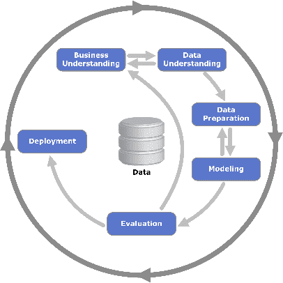
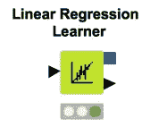
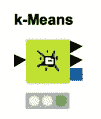
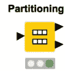
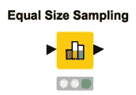
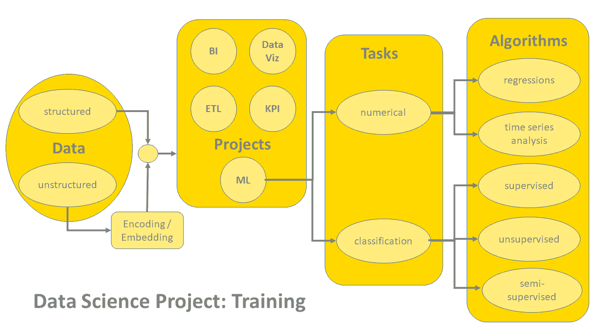
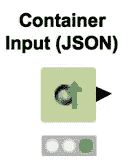
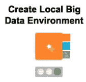
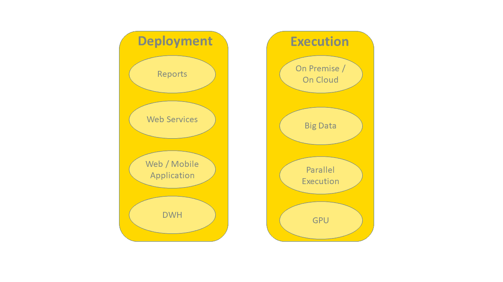
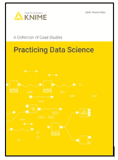

# 实践数据科学

> 原文：<https://towardsdatascience.com/practicing-data-science-5487e9f88aad?source=collection_archive---------20----------------------->

## 在数据科学项目中询问方向

数据科学项目的倾斜有很多:有无标注数据；停止数据争论或涉及机器学习算法；预测类别或预测数字；不均匀分布的类，二进制类，甚至没有一个类的例子；结构化数据和非结构化数据；利用过去的样本或者仅仅停留在现在；要求实时或接近实时执行或具有可接受的较慢性能；在光鲜亮丽的报告中展示结果，或者在中立的 IT 架构背后隐藏事实；有大量预算或者根本没有预算。

**CRISP-DM 循环够用吗？**

The CRISP-DM cycle chart as from Wikipedia

虽然数据科学项目的一般开发是相对标准的，例如遵循 [CRISP-DM 周期](https://en.wikipedia.org/wiki/Cross-industry_standard_process_for_data_mining)，但每个项目通常需要一些特殊的定制，即特殊的成分以适应特定的数据、目标、约束、领域知识，甚至项目的预算。

CRISP-DM 周期为任何数据科学项目推荐以下阶段:数据和业务理解、数据准备、模型训练、模型优化、模型评估，以及最后的模型部署。关于他们的实际实施的更多细节可以在[“分析和超越！”](https://www.knime.com/blog/analytics-and-beyond)

通过 CRISP-DM 循环提供的这些指南对于标准项目非常有用；也就是一个训练数据充足，类分布均匀，对速度或最终可视化没有特殊要求等等的项目。指南没有提供任何细节来处理数据、项目特征和最终用户请求的细节。

**定制 CRISP-DM 周期以适应您的项目**

即使我们清楚这个过程，如果没有合适的方向图，在许多机器学习算法和部署选项中进行选择可能会很困难。我们希望画出这样一张地图，以帮助理解根据手头的数据科学项目的特点应该朝哪个方向前进。

我们用一系列越来越复杂的问题来组织我们的定向之旅。我们从解决关于项目类型的基本疑问开始，然后我们转移到项目生产性实现的执行和部署选项。

**我需要机器学习模型吗？**

在我们碰巧工作的学科的命名混乱中，我们经常将数据科学、数据挖掘、人工智能、商业智能以及可能其他一些“数据”、“科学”和“智能”的排列放在同一个桶中。我不完全清楚每一个名字的细微差别和涵盖范围。

然而，我知道并不是所有与数据相关的项目都需要预测模型。通常，数据混合、清洗和转换；KPI 的计算；或者在仪表板或 BI 报告中组织成功的度量标准。在这种情况下，纯粹的数据转换和数学运算就足够了，不应该使用机器学习模型。

**分类还是数量预测？**

第二个问题指的是要预测的变量的性质。我们要预测一个类还是一个数？例如，我们是否希望预测客户将购买的下一个产品(类别)或明年的头发颜色(类别)趋势？还是我们要预测未来两周一台洗衣机的价格(数字)或者今晚伦敦金融城要消耗的千瓦(数字)？

请注意，有时数值预测问题可以简化为分类任务。例如，如果我想预测洗衣机价格的上涨或下跌(而不是以美元为单位的实际价格)，我可以定义三个类别(“价格上涨”、“价格相同”、“价格下跌”)，因此，这就变成了一个分类问题。

最常见和最容易的分类问题包括一个二元分类系统:“真”或“假”，“疾病”或“健康”，“低于”或“高于”某个值，等等。

一旦我们决定了我们是在处理分类还是数值预测问题，我们就可以从两个不同的机器学习算法库中进行选择。训练后，分类算法输出一组标称值(字符串)，而数值算法输出数字(整数或双精度)。

**数字预测和时间序列分析一样吗？**

数值预测的算法不一定实现时间序列分析。顾名思义，时间序列分析需要一个额外的约束:时间。以随机顺序预测数字，就像线性回归一样，只是将数字输出与输入要素的向量相关联。另一方面，时间序列预测算法接受按特定时间顺序排列的输入向量。

尽管在时间序列分析中也经常使用相同的数值预测技术，但是已经设计了专用算法来考虑训练期间输入数据的时间顺序。在时间序列项目的情况下，记住数据划分为训练集和测试集不能是随机的，但它必须符合过去和未来的概念。

**监督与非监督训练算法**

现在，让我们进入数据集的细节。对于分类问题，很多机器学习算法需要一个带标签的数据集；也就是说，数据集提供了示例向量，并且每个示例都标记了正确的类别。这种算法被称为“有监督的”,当出现特定的输入向量时，它使用这种训练集的标记样本来定义内部规则，以输出正确的类。

然而，通常有标签的数据集是一种奢侈。除非标签以某种方式自动可用，否则贴标签过程通常在时间和金钱上是昂贵的。如果没有可用的标记数据集，我们可以解决聚类过程，其中模式根据距离和规则分组在一起。

如果我们仍然坚持一个有标签的数据集，可以使用主动学习程序。在这种情况下，我们从一个带有标签的数据集开始。在接下来的几次迭代中，临界点的数据子集被手动标记，并且它们的类别以“无监督”的方式自动扩展到相邻点。

**分布不均匀、不常见和稀有类**

当训练数据集充分覆盖各种类的所有不同类型和子类型时，监督分类算法工作得最好。在一个完美的项目中，数据均匀地分布在所有的类中。

然而，有时数据远非均匀分布。在这种情况下，每个类都需要足够数量的代表性数据示例才能出现在最终预测中。当类别分布不均匀时，我们可能希望模型输出反映原始的先验类别概率。为了迫使模型学习各种先验概率，我们可以划分原始数据集，对类列应用分层采样。分层采样生成与原始数据集具有相同类别分布的训练集。

有时一个类比数据集中的其他类更不常见。在这种情况下，不平衡的类别分布可能会使模型产生偏差，并遮蔽不经常出现的类别。这里，我们需要在训练期间用一个人为的更频繁的类来强制输入模型。这是通过对最频繁的类进行下采样(如果不太频繁的类的例子数量足够的话)或者对最不频繁的类进行过采样(引导)来获得的。

在极端情况下，原始数据集中完全缺少一个类。例如，物联网中的异常检测就是这种情况。这个场景需要稍微改变一下视角。在这种情况下，机器学习模型仅在可用类的数据上训练，计算预测值和真实值之间的距离，并且从距离值中扣除可能的异常。

在某些情况下，一个类可能是罕见的，但充满了后果，如投资中的金钱损失或医疗程序中的死亡。然后，只有在绝对确定的情况下，我们才应该强制模型决定支持这个类。这通常通过在模型部署期间应用权重或更改阈值来实现。

**结构化数据与非结构化数据**

传统上，数据的分析是指数值或标称值。在数据库领域，我们称这样的数据架构为结构化的。然而，在过去的几年里，数据分析领域注入了一些不太传统的数据。文字、网络图、推文、评论等。已经成为我们数据库和数据湖的一部分。

特殊类型的数据需要特殊类型的处理。例如，文本和网络图需要一套特殊的工具来进行解析、清理、矢量化，当然还有可视化。

*图一。数据科学项目中的培训选项*

**闪亮的报告、休息和普通的后台执行**

一旦模型被训练、测试和接受，它就进入部署。部署工作流将模型应用于新的真实数据，并生成相应的预测。预测然后被返回给最终用户。

在一些项目中，部署工作流需要为结果呈现提供一个漂亮的交互式图形仪表板。可以安排部署工作流的执行，以便定期生成设计的仪表板。

然而，有时结果只需要传递给 web 服务网络中的下一个应用程序。这里，部署工作流需要被部署为 REST 服务本身。

在某些情况下，输出结果只是保存在一个文件(或数据库)中，不需要其他可视化或 REST 接口。

**执行选项:大数据、实时、流**

现在是最后一个问题。我们需要大数据平台吗？我们需要流媒体吗？我们需要实时执行吗？

让我们从实时执行开始。我们认为的实时有时仅仅是人类感知的实时。先说清楚，等待几秒钟对于人类来说是完全可以接受的，但不一定是真正的时间。

当然，执行性能取决于平台。然而，并不是所有的项目都需要高性能的执行。在开始对分布式平台进行大规模投资之前，要考虑执行需求是什么。如果最终用户可以等待几秒钟，那么在快速机器上的经典执行是可以接受的。

如果数据量很大，等待时间变长，那么并行执行就变得很有必要。

流也可能是您的项目的一个特定需求，即使大多数时候刷新从文件中读取的数据足以保持结果最新。

*图二。数据科学项目中的部署选项*

**作者注:**

我们已经在电子书[“实践数据科学”中收集了一系列用例及其实现的经验。案例研究集。”](https://www.knime.com/knimepress/practicing-data-science)这本书是按应用领域组织的。它从最古老的数据科学领域(CRM 数据分析)开始，然后转移到零售商店的推荐引擎。接下来，它涵盖了金融行业、社交媒体和物联网时间序列分析中的项目，最后以几个网络安全项目结束。

电子书中报道的所有例子都引用了一个(或两个)工作流，这些工作流位于 [KNIME EXAMPLES 服务器](https://youtu.be/CRa_SbWgmVk)上，在每一节的开头都会如实报道。

我们希望这些数据科学经验将有助于培养下一代数据科学家的实用数据科学技能。如需免费下载，请访问[https://www.knime.com/knimepress/practicing-data-science](https://www.knime.com/knimepress/practicing-data-science)，并使用以下促销代码: **MEDIUM-0519** 。

— — — — -

*为首次发表于*[*data versity*](http://www.dataversity.net/practicing-data-science/)*。*