# 布拉格步行无障碍。

> 原文：<https://towardsdatascience.com/prague-walking-accessibility-8c0954e83bea?source=collection_archive---------43----------------------->

# 1.摘要

在这项研究中，我们试图分析 10 至 16 岁儿童的城市步行能力。我们使用一些数据来源和网络分析来构建所选城市的可达性地图。使用 K 最近邻技术，我们执行聚类以选择具有不同步行能力分数的区域。我们根据可步行性得分和 poi 密度分析这些杂乱数据，并确定在步行可达性方面需要改进的区域。

这项研究的笔记本可以在 GitHub 上免费获得:

[数据采集和清理](https://github.com/tonnyeremin/Urban-Data-Science/blob/master/01.%20Walking%20Accessibility%20Data%20Acquisition.ipynb)

[探索性数据分析和可视化](https://github.com/tonnyeremin/Urban-Data-Science/blob/master/02.%20Walking%20Accessibility%20Data%20Analysis.ipynb)

[建模和聚类](https://github.com/tonnyeremin/Urban-Data-Science/blob/master/03.%20Walking%20Accessibility%20Modeling.ipynb)

## 关键词

*可达性聚类分析网络分析城市规划*

# 2.介绍

步行是最可靠、最轻松、最健康的旅行方式。然而，今天步行上学的儿童数量正在下降。这对我们儿童的健康、安全和福祉造成了破坏性后果。今天，超过 70%的父母在他们还是孩子的时候步行上学，但是现在只有不到一半的孩子步行上学。与此同时，开车上学的儿童数量正在增加，对交通拥堵、健康和社区产生了越来越大的负面影响[1]。

步行是一种简单，自由和健康的方式，让孩子们去学校或其他活动，如图书馆，文化和爱好中心，操场等。步行为每个人提供了很多好处。

行人无障碍是什么意思？对我们来说，它意味着在合理的时间内到达特定的日常生活兴趣点(POI)的能力。我们所说的合理时间是指儿童行走 1300 米所需的时间。对于选定的年龄范围，这个距离是合理的。[2]10 至 16 岁儿童的常见兴趣点有:学校、业余爱好和休闲设施、图书馆、体育设施和户外游乐场。

因此，本研究的目的是:(1)根据人口密度和兴趣点密度分析当前城市的儿童基础设施。(2)构建可步行路线网络。(3)定义可步行性集群

通过对相关文献的讨论，本部分介绍了本文的研究目的和范围。研究区域和数据部分进入研究区域和数据源。方法在方法部分介绍。结果部分展示了结果，并说明了如何将结果应用于规划实践。结论和政策建议见讨论和结论部分。

报告全文可在 [GitHib](https://github.com/tonnyeremin/Urban-Data-Science/blob/master/README.md) 上获得

# 3.研究区域和数据

布拉格是捷克共和国最大的城市，总面积 298 平方公里，人口 130 万，是欧盟第 14 大城市。它是著名的经济和文化中心，位于捷克共和国的中部地区。作为一个拥有超过 14 个世纪历史的城市，它拥有古典的中世纪城市中心，有许多历史建筑和小街道。市中心的周围更加现代化，外围则是小排屋和私人住宅。下图显示了布拉格市辖区的行政边界和每个区的总人口。

在我们的研究中，我们使用的数据类型包括所选 POI 的人口和地理数据。所有数据均来自公开数据来源:人口数据来自捷克统计局，教育设施数据来自捷克共和国教育、青年和体育部。其他数据集来自布拉格的开放数据门户和其他网络资源。

## 3.1 人口

作为人口数据集，我们使用捷克统计局的人口普查数据。[捷克统计局](https://www.czso.cz/)的整个数据集包含捷克共和国公民的人口、性别和年龄数据。特征名称已编码。


因为我们的研究区域是布拉格，所以我们只对具有 *uzcis = 44* 的行政区的人口感兴趣。我们根据这个参数从原始数据集中过滤数据，删除不必要的列并执行重命名。

## 3.2 地理形状

从 [IPR Praha](http://www.geoportalpraha.cz/) 获取行政区边界数据集。这是 json 数据，包含一组地区属性，如名称、形状、面积等。

```
"type" : "FeatureCollection",
	"name" : "TMMESTSKECASTI_P",
	"features" : [
		{
			"type" : "Feature",
			"geometry" : {
				"type" : "Polygon",
				"coordinates" : [
					[
						[ 14.535485616000074, 50.01175081800005 ],
						...
						[ 14.535067366000021, 50.011918405000074 ]
				]
			},
			"properties" : {
				"OBJECTID" : 1,
				"DAT_VZNIK" : "20171204150607",
				"DAT_ZMENA" : "20171204154726",
				"PLOCHA" : 3703180.2199999997,
				"ID" : 34,
				"KOD_MC" : 539791,
				"NAZEV_MC" : "Praha-Újezd",
				"KOD_MO" : 43,
				"KOD_SO" : "116",
				"TID_TMMESTSKECASTI_P" : 34,
				"POSKYT" : "HMP-IPR",
				"ID_POSKYT" : 43,
				"STAV_ZMENA" : "U",
				"NAZEV_1" : "Újezd",
				"Shape_Length" : 0.11393431835892182,
				"Shape_Area" : 3703180.22185
			}
		},
```

从这些数据中，我们感兴趣的是面积和几何形状，我们还得到一个区的名称作为唯一键。

我们通过地区名称来比较人口数据集和地区边界数据集。我们在这两个数据集中获得了 57 个唯一的记录。我们通过 *name* this 来执行连接，以将集合合并成结果集合。结果数据集被保存到 IBM 云存储中，命名为*布拉格 _ 区 _ 人口. csv* 。此外，还可以在我们的 [GitHub 库](https://github.com/tonnyeremin/Urban-Data-Science/blob/master/data/prague_district_population.csv)上访问它

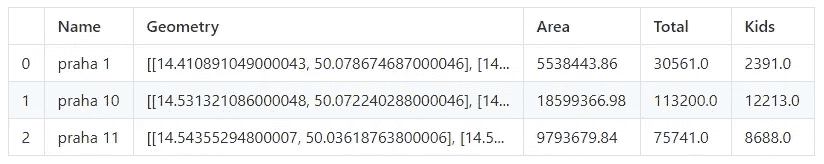

## 3.3 兴趣点

在我们的研究中，我们对一些类型的点感兴趣，如:学校、教育和爱好中心、图书馆、体育设施和操场。我们决定只使用这 5 种类型，因为这些类型是 10-16 岁儿童最常见的类型。数据是从许多数据源获得的。我们不使用任何类型的地理 API，如 Google Places 或 Foursquare，因为我们需要全面覆盖我们的研究领域。所有知名 API 都没有为免费账号提供这样的设施。

## 学校和教育中心

我们从教育、青年和体育部获得学校和教育中心的数据。这个 xml 数据集包含布拉格所有州立教育机构的信息。在我们的研究中，我们只对 poi 类型、地区和地理坐标感兴趣。

从原始教育数据集中，我们提取了教育设施的地址和类型，总共有 2273 行。类型是编码的。由于我们没有找到这个数据集的任何未来描述，我们必须决定什么类型的教育设施适合我们的研究。我们从检索到的数据中获得独特的类型:

```
Types in XML file
A00 Mateřská škola
L11 Školní jídelna
L13 Školní jídelna - výdejna
B00 Základní škola
M60 Přípravný stupeň základní školy speciální
G21 Školní družina
G22 Školní klub
F10 Základní umělecká škola
C00 Střední škola
D00 Konzervatoř
M20 Školní knihovna
E00 Vyšší odborná škola
M79 Jiné účelové zařízení
H22 Domov mládeže
G11 Dům dětí a mládeže
G40 Zařízení pro další vzdělávání pedagogických pracovníků
M40 Středisko praktického vyučování
H21 Internát
K20 Speciálně pedagogické centrum
G12 Stanice zájmových činností
K10 Pedagogicko-psychologická poradna
F20 Jazyková škola s právem státní jazykové zkoušky
J12 Dětský domov se školou
J21 Středisko výchovné péče
J14 Diagnostický ústav
J11 Dětský domov
J13 Výchovný ústav
L12 Školní jídelna - vývařovna
H10 Škola v přírodě
A15 Mateřská škola (lesní mateřská škola)
Schools and educational centers count 560
Unique types ['school' 'educatioanal center']
```

我们可以看到我们感兴趣的类型有:

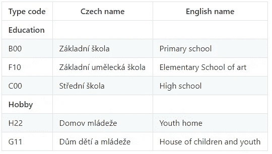

对于建模步骤，我们对实际的场地地址不感兴趣，而是对坐标感兴趣。我们使用 ArcGis api 检索纬度和经度。学校和教育中心的结果数据集包含 560 行

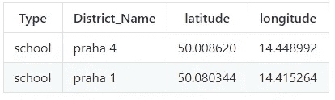

图书馆的数据从[网站](https://cs.wikipedia.org/wiki/M%C4%9Bstsk%C3%A1_knihovna_v_Praze)被废弃。作为数据清洗过程中，我们提取的地址和地区名称从原来的 html 页面。对于 html 解析，我们使用 *BeautifulSoup* 库。使用 ArcGis api 将地址转换为纬度和经度。结果数据集包含 41 个库。

## 体育中心、俱乐部和游乐场。

布拉格开放数据门户网站检索了体育设施和操场的数据。对于这些数据，我们执行与前面的数据集相同的步骤:提取地址和地区名称，将地址转换为纬度和经度。

我们将所有五个数据集合并成一个有 1623 行的数据集。数据集可在外部 [GitHub 存储库](https://github.com/tonnyeremin/Urban-Data-Science/blob/master/data/prague_pois.csv)上访问

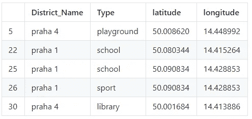

从开放街道地图(OSM)获得的街道网络数据 OSM 数据包含布拉格道路网络和周围连接的道路，这些是以长度为特征的线几何。这些可以用来构建一个可路由的拓扑图(有向的、加权的和连通的)，它由节点和边组成，因此任何众所周知的路由搜索算法都可以应用[3]。布拉格的步行网络包含 140 822 个节点和 204 575 条链路。预处理数据我们存储在 IBM 云对象存储和 [GitHub](https://github.com/tonnyeremin/Urban-Data-Science/blob/master/data/network_14.224437012000067_49.94190007000003_14.706787572000053_50.17742967400005.h5)

# 4.探索性数据分析

布拉格的总人口约为 130 万。最高值在南区，从 110K 到 130K。所有人口高于平均值的地区都位于历史中心区周围。这些地区的平均人口是 7 万人。这是意料之中的。在像布拉格这样的城市里，大多数人离开市中心很近，但不在市中心。北部两个人口从 9 万到 10 万的最大地区向我们展示了布拉格新的发展区域。

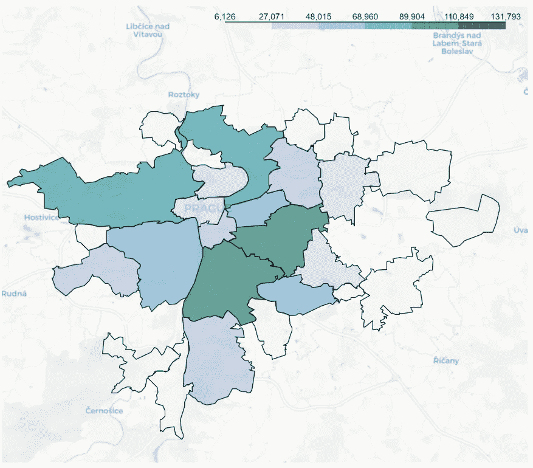

从另一个角度分析布拉格的人口，我们可以注意到每 1000 名成人中儿童的分布与之前的情况相关。在这张图中，我们可以清楚地看到主要受家庭欢迎的地区。中心区和郊区的儿童死亡率最低，而中心附近但离中心不远的地区的儿童死亡率平均为每 1000 名成人 160 至 180 名儿童。

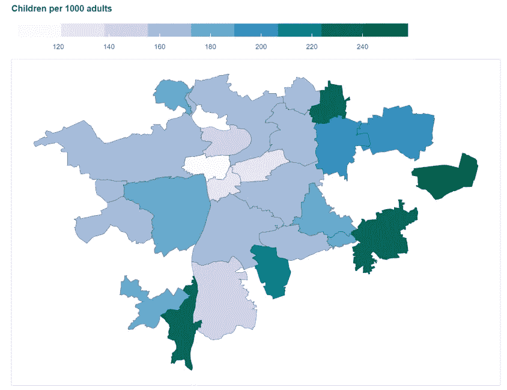

儿童人口最多的前 10 个地区是以前图片中的前 10 个地区的重复。在布拉格，我们最多只有 8%。

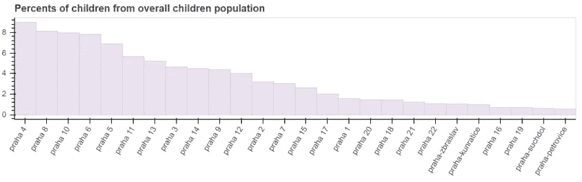

名胜古迹也集中在历史中心周围。按地区的分布与地区人口相关。这是预期值。我们在人口前 10 名的所有地区都有大致相等数量的点，在南部有一个异常的高度值。

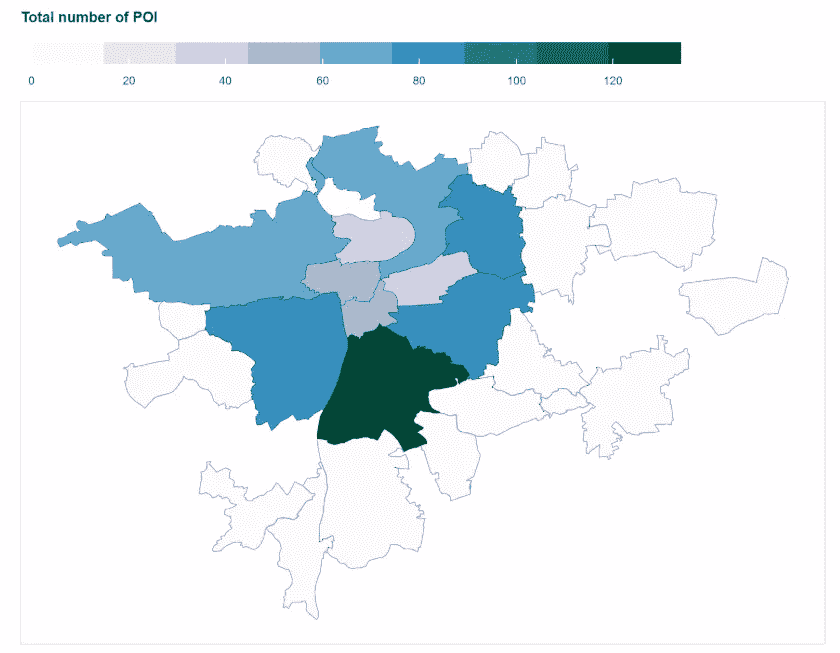

兴趣点的总数并不能全面反映每个地区对儿童的益处。对我们来说，更有趣的是研究兴趣点的数量与 1000 名儿童之间的关系。比如我们看学校/1000 的直方图。我们注意到最高值与儿童数量无关。我们可以看到布拉格 1 的值最高，但如果我们看一下以前的图表，我们可以看到布拉格的儿童百分比甚至没有进入前 10 名。另一方面，布拉格 4 区的人口数值最高，学校/1000 的平均值也最高。

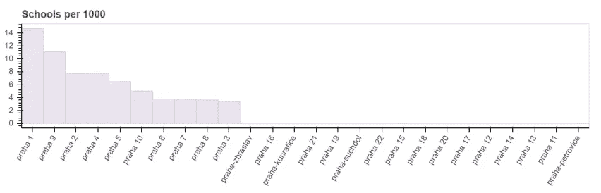

我们可以在接下来的直方图中看到同样的图片。中心区的 POIs/1000 值最高，郊区最低。一方面，这是因为城市中心的儿童人口较少，另一方面，其他城市正从其历史中心发展起来，那里的学校和其他设施的密度通常较高。

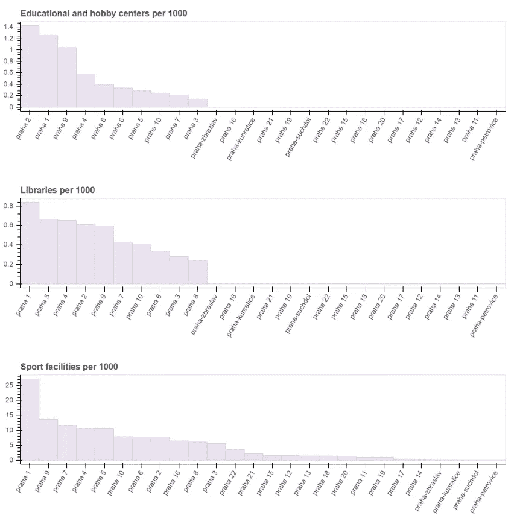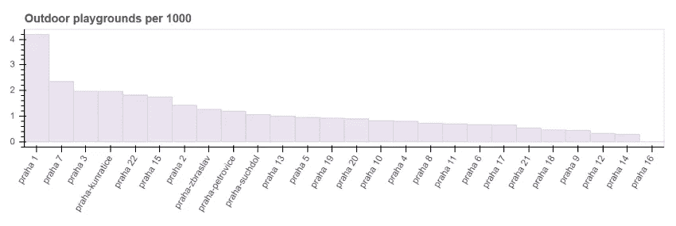

# 5.方法学

# 5.1 网络分析

这项研究的空间框架需要使用基于点的无障碍措施。常用的空间单位是行政区划和格网单元。由于研究区域从一个城市到一个国家，甚至整个世界，空间单元的类型、形状和大小因研究目的不同而有所差异，并且没有达成共识。在我们的研究中，使用布拉格的边界框作为空间框架。我们不能在研究中使用更小的框架，如行政区划，因为我们必须处理边界条件。如果儿童离开自己的地区，而最近的 POI 位于另一个地区。在这种情况下，父母通常会决定去最近的 POI。

第一步，我们将 OSM 街道网络转换成图形对象。对于构建图形，我们使用 Pandana 框架。Pandana 的主要用例是沿着网络执行聚合，即缓冲区查询。该 api 旨在以多线程方式(使用底层 C 库)同时为网络中的所有节点执行聚合。大多数步行规模的可访问性查询可以在不到一秒钟的时间内执行，甚至对于成千上万的节点也是如此。[4]

在“清理”中，我们指的是移除不代表实际交点的点(因此不是图论意义上的节点)。

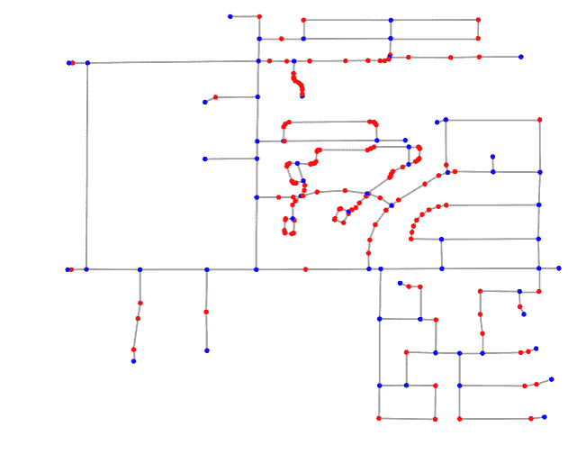

街道图[6]

因为第二步是从上一步到网络图定位兴趣点并计算可达性矩阵。在可达性矩阵中，我们指的是从在数据采集步骤中采集的预定义兴趣点阵列到前 3 个兴趣点的距离阵列。因为我们想研究可达性的平均值，所以我们计算了每种兴趣点的平均步行距离:学校、图书馆和其他儿童设施。并将其存储到数据集。这个数据集稍后将用于聚类。我们总共得到 140877 条边

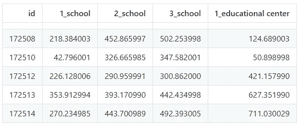

我们将使用 K-Means 聚类算法。这是一种矢量量化的方法，最初来自信号处理，在数据挖掘的聚类分析中很流行。k-means 聚类旨在将 n 个观察值划分为 k 个聚类，其中每个观察值属于具有最近均值的聚类，作为该聚类的原型。这导致将数据空间划分成 Voronoi 单元。k-Means 最小化类内方差(平方欧几里得距离)。确定我们使用的最佳聚类数和肘方法。

肘方法是一种启发式方法，用于解释和验证聚类分析中的一致性，旨在帮助在数据集中找到适当数量的聚类。它通常是不明确的并且不是非常可靠，因此用于确定聚类数量的其他方法，例如剪影方法是优选的。

这种方法将方差的百分比解释为聚类数的函数:应该选择多个聚类，这样添加另一个聚类不会提供更好的数据建模。更准确地说，如果绘制由聚类相对于聚类数量解释的方差的百分比，第一个聚类将增加很多信息(解释很多方差)，但是在某个点，边际增益将下降，在图中给出一个角度。在这一点上选择簇的数量，因此称为“肘形标准”。这个“肘”不能总是被明确地识别。[1]解释的方差百分比是组间方差与总方差的比率，也称为 f 检验。该方法的一个微小变化是绘制组内方差的曲率。[2]


# 5.2 可步行性集群

因此，我们有 4 个集群。我们计算每个集群的距离、可步行性核心和时间的平均值。我们所说的合理时间是指儿童行走 1300 米所需的时间。计算出每个聚类中每种类型的可步行性得分。分数=实际距离/1300。作为平均步行速度，我们得到 4 公里/小时[4]。

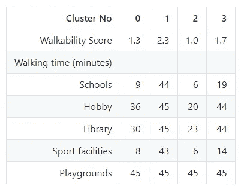

通过重新定义行走图上边的权重，我们可以在布拉格地图上可视化聚类。

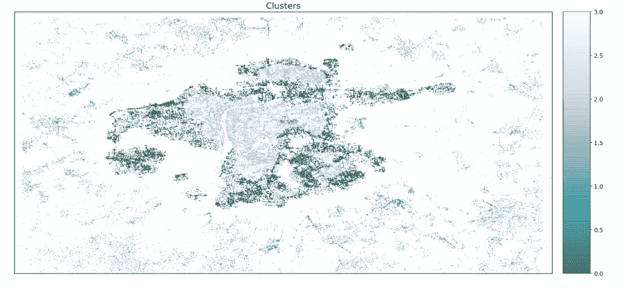

此外，我们还为每种类型的兴趣点建立了可步行性热图。

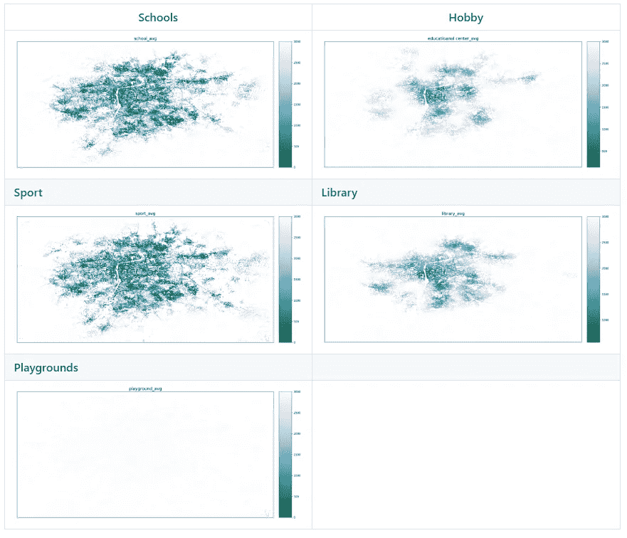

# 5.结果

因此，我们在布拉格有 4 个步行性集群。聚类 2 具有最佳步行性得分 1。这意味着，从这个集群内的每一个点，儿童都可以在平均大约 15 分钟内到达所有必要的兴趣点。学校在这个集群内是最容易到达的，这是一个非常好的结果。另一方面，集群 2 主要覆盖中心历史区，我们知道该区的儿童人口低于周边地区。第二组是 0 号。它的可行走性得分约为 1.3。学校和体育设施不到 10 分钟就能到达。这是非常好的结果。

这两个集群中可访问性得分最低的是图书馆和业余爱好中心。平均大约需要 30 分钟的步行时间。

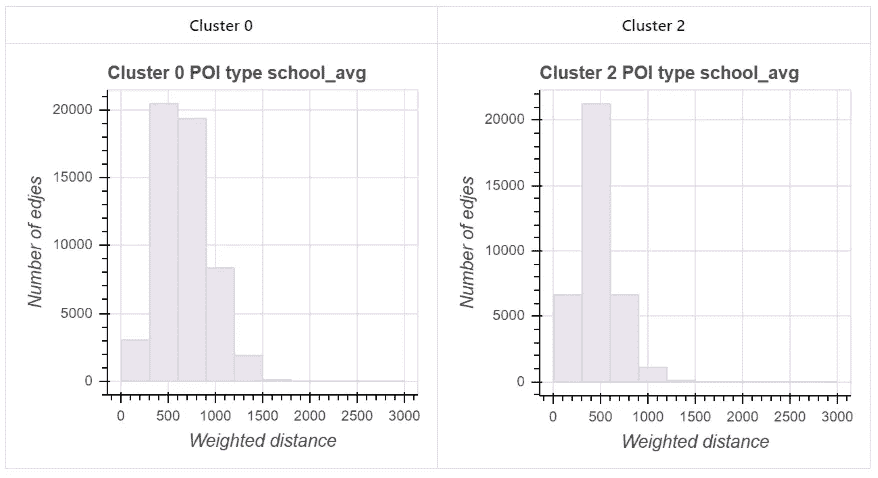

我们在第三组得到的最低值。该集群主要覆盖远离市中心的小郊区和地区，主要是小村庄。第三产业群内部的另一部分也坐落着许多新的开发项目

群组 1 我们决定将它算作噪声值，因为在这个群组中，我们主要有公园、墓地和工业区，换句话说就是非生活区。

最容易到达的兴趣点是学校，这是非常好的结果，因为根据不同的研究，到学校的步行距离在测量区域行人可达性方面具有最重要的价值。

结果也很好，我们有运动设施。除了第一组，其他组平均步行 10 分钟就能到达。

最低的可及性得分有业余爱好中心和图书馆，这是可预期的结果，因为我们像往常一样每个地区有一个这种类型的场所。

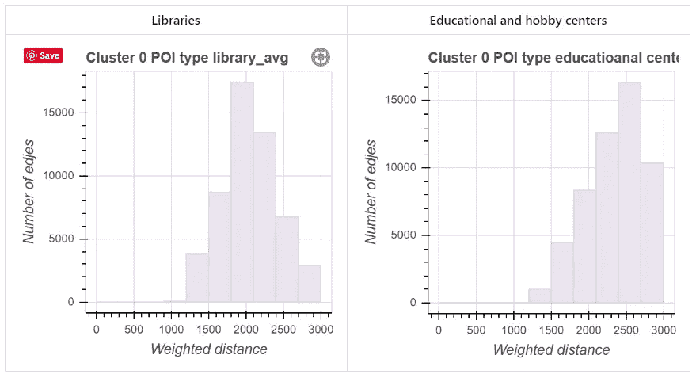

# 7.讨论和结论

在这项研究中，我们分析了布拉格的步行性。我们主要关注 10-16 岁儿童的步行无障碍性。我们确定了所选焦点组的共同兴趣点，并对所有所选兴趣点的最短距离进行了测量。利用无监督聚类算法，我们将研究区域划分为 4 类。用统计分析的方法检验了聚类的结果。

在未来的研究中，我们计划对每种类型进行更详细的分析。我们必须根据地势给街道图的边缘增加权重。此外，我们不仅从最短路线的角度，也从最安全的角度来看待行人可达性。

# 8.参考

1.  活生生的街道(行人协会)[一份活生生的街道报告](https://www.livingstreets.org.uk/media/3618/ls_school_run_report_web.pdf)
2.  [比利时大龄青少年主动上学的标准距离和相关因素。德尔菲恩·范·戴克，伊尔莎·德·布尔多胡伊，问候卡顿](https://ijbnpa.biomedcentral.com/articles/10.1186/1479-5868-7-87)
3.  瑙曼和科瓦廖夫(2017 年)。基于 OpenStreetMap 的行人路径搜索。在*智能交通系统和出行行为(第 87-96 页)*。湛:斯普林格。
4.  pandana[https://udst . github . io/pandana/introduction . html #简介](https://udst.github.io/pandana/introduction.html#introduction)
5.  儿童行走的力学[https://phys oc . online library . Wiley . com/doi/pdf/10.1113/jphysiol . 1983 . sp 014895](https://physoc.onlinelibrary.wiley.com/doi/pdf/10.1113/jphysiol.1983.sp014895)
6.  OS mnx:Python for Street Networks[https://geoffboeing . com/2016/11/OS mnx-Python-Street-Networks/](https://geoffboeing.com/2016/11/osmnx-python-street-networks/)

# 9.版权信息

安东·艾尔明 2019

开架借阅

本文根据知识共享署名 4.0 国际许可证([http://creativecommons.org/licenses/by/4.0/](http://creativecommons.org/licenses/by/4.0/))的条款分发，该许可证允许在任何媒体上不受限制地使用、分发和复制，前提是您适当注明原作者和来源，提供知识共享许可证的链接，并指出是否进行了更改。