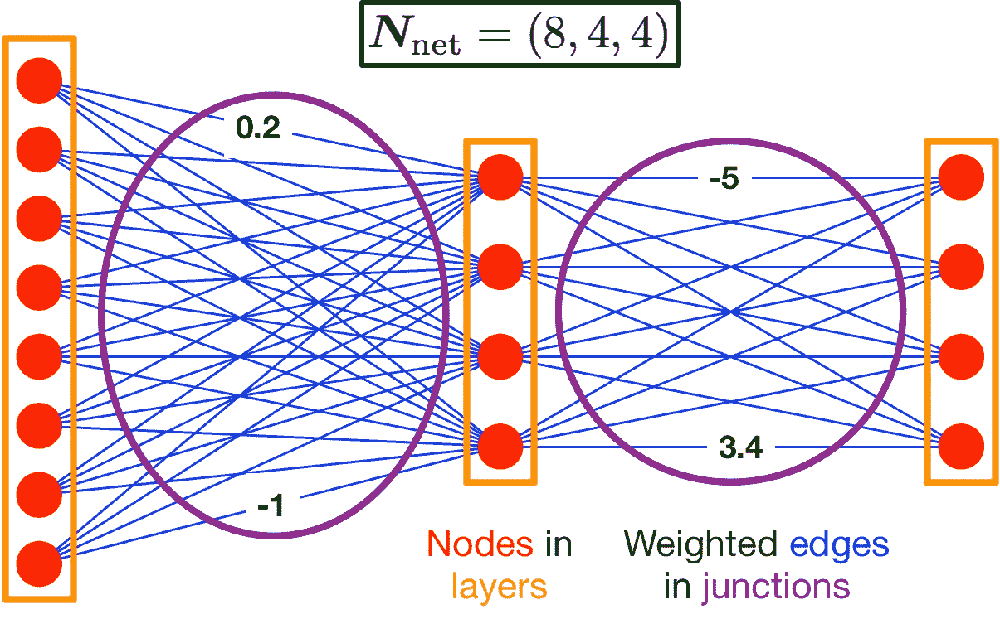
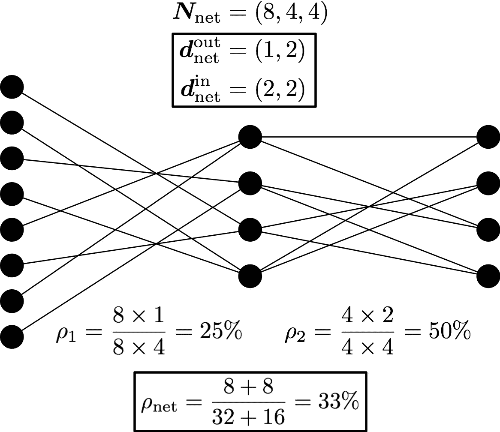
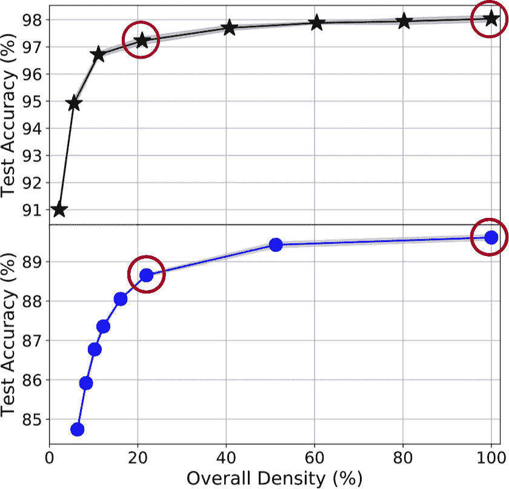
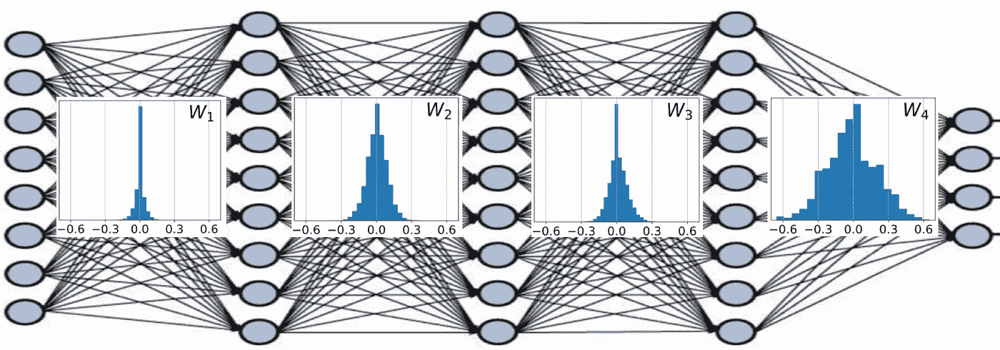
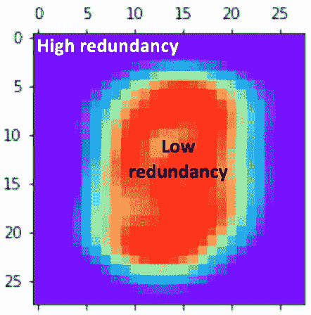
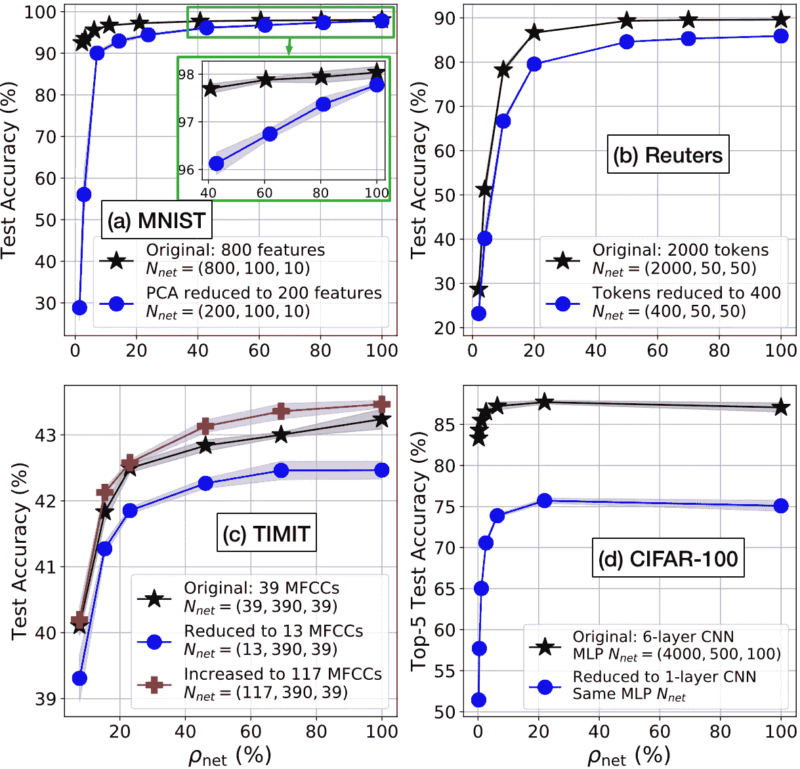
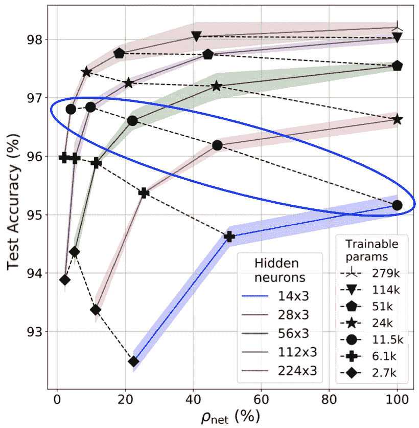
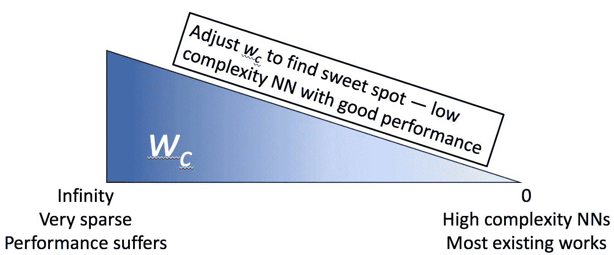

# 降低神经网络复杂性的预定义稀疏度

> 原文：<https://towardsdatascience.com/pre-defined-sparsity-for-reducing-complexity-in-neural-networks-55b0e85a1b54?source=collection_archive---------16----------------------->

## [预定义稀疏度](https://towardsdatascience.com/tagged/predefined-sparsity)

神经网络现在非常流行。它们使深度学习成为可能，这为语音识别和无人驾驶汽车等智能系统提供了动力。这些酷的最终结果并没有真正反映大多数现代神经网络的血淋淋的复杂性，这些网络有数百万个参数需要被*训练*以使系统变得智能。训练需要时间和大量的计算资源，而这些资源通常会转化为金钱。这在富人和穷人之间形成了一个障碍，富人是拥有大量计算能力的大型科技公司，穷人是像我这样的博士生，他们负担不起在几天内培训几十个网络的费用。嗯，研究通常是出于需要。

> 我的博士工作试图以最小的性能下降来降低神经网络的复杂性。这是通过使用**预定义稀疏度**来完成的，从一开始，即在训练之前，就以低复杂度网络开始。

本文将解释和描述预定义的稀疏性。也鼓励你参考我最近的[论文](https://ieeexplore.ieee.org/document/8689061)了解更多细节:

# 基本概念

神经网络由*节点*(或神经元)组成，这些节点被分组到*层*中，并使用*加权边*填充层之间的*结点*进行连接。本文的大部分内容将涉及多层感知器(MLPs)，而我正在进行的工作是扩展到卷积神经网络(CNN)。如图所示，如果一个层中的每个节点都连接到其相邻层中的每个节点，则 MLP 是*全连接的* *(FC)* 。

A fully connected MLP with neuronal configuration ***N***net = (8,4,4) denoting the number of neurons in each layer. Each edge has an associated weight value, only a few of them are shown for clarity.

文献中的几种复杂性降低技术训练 FC 网络，然后删除它的一些权重，以获得用于测试阶段的更简单的网络。相比之下，我的预定义稀疏性工作中的“前”来自于这样一个事实:稀疏连接模式在训练之前是固定的。因此，对于训练和推断都获得了复杂度降低，并且可以通过查看稀疏网络相对于 FC 的权重密度来量化复杂度降低。例如，下面的网络在交叉点 1 的 *ρ₁* = 25%密度，在交叉点 2 的 *ρ₂* = 50%，在整个网络中 *ρ* net = 33% *总密度*。这意味着 FC 网络将具有 48 个权重，而预定义的稀疏网络具有 16 个权重。

请注意，特定层中的每个节点都有相同数量的向右连接(出度 *dout* ) —第一个结点为 1，第二个结点为 2，并且两个结点都有相同数量的来自左侧的连接(入度 *din* ) — 2。这意味着稀疏连接模式是*结构化的*，而不是随机分配权重，冒着让一些节点完全断开的风险。事实上，我的结果表明结构化稀疏比随机稀疏表现更好。

# 有用吗？如果是，为什么？它有什么独特之处？

我用来测试我的工作的分类数据集是 [MNIST](http://yann.lecun.com/exdb/mnist/) 手写数字，路透社 [RCV1](http://www.jmlr.org/papers/volume5/lewis04a/lewis04a.pdf) 新闻文章， [TIMIT](https://catalog.ldc.upenn.edu/LDC93S1) 语音音素识别，以及 [CIFAR](https://www.cs.toronto.edu/~kriz/cifar.html) -10，-100 图像识别。预定义的稀疏度给出了有希望的结果，如下所示。

旁边的结果是 MNIST(上)和路透社(下)。x 轴是总密度，因此最右边 100%的圆圈点是 FC 网络。y 轴是测试准确度，这是神经网络常用的性能指标。请注意，20%密度点的精度仅比 FC 低 1%左右。换句话说，权重的数量可以减少 5 倍，而性能下降很少，这正是我的研究旨在实现的目标。

现在让我们来解决一个更大的问题:为什么预定义的稀疏性有效。这不可能是一种魔法，它使我们能够从一开始就将 FC 网络的重量减少 80%，同时几乎没有性能损失(补充说明:深度学习中的许多东西看起来确实像魔法，但电视刚推出时也是如此)。为了理解这一点，我在对一个全连接网络进行训练直至其收敛后，绘制了该网络不同连接点的权值直方图。请注意*大多数权重都接近 0* 。这表明一个网络可能不需要太多的权重就能变好。

让我们暂时考虑一下*正则化*的标准技术。这对网络的权重施加了惩罚，使得它们在训练期间受到限制。预定义的稀疏度也施加约束，除了它对权重的数量施加约束，并且在训练之前施加约束。另一种流行的技术——*辍学*——也在训练期间删除连接。然而，它在不同的随机配置中这样做，并在组合它们进行测试之前训练所有这些候选网络。相比之下，预定义的稀疏度只在一个网络上训练和测试，这个网络恰好具有少得多的权重。

# 表征预定义的稀疏性

预定义的稀疏连接模式——哪些节点连接到哪些节点——是要在训练之前设置的*超参数*。我的研究发现了几个趋势，作为选择这个超参数的指南。

> 首先，预定义的稀疏性利用了数据集中的冗余。

首先，大多数机器学习数据集都有冗余。以经典的 MNIST 为例，每幅图像有 28×28 = 784 个像素。做一个[主成分分析](https://en.wikipedia.org/wiki/Principal_component_analysis)表明只有中心像素是有趣特征集中的地方，这并不奇怪。这意味着，通过考虑，比如说，每幅图像中心附近的 200 个承载最多信息的像素，可以获得修改的*减少冗余的* MNIST 数据集。

下图比较了原始数据集(黑色)的预定义稀疏性与增加(红色)或减少(蓝色)冗余的相同数据集的修改版本的性能。请注意，稀疏网络对于减少冗余的情况并不那么有效，即蓝线在密度减少的情况下向左侧下降。

Tokens for Reuters and MFCCs for TIMIT serve as features. For CIFAR, the depth of the pre-processing CNN before the MLP serves as redundancy.

> 其次，后面的连接需要更高的密度。

这是我们之前在重量直方图中看到的。与 *W* 4 相比，更早的连接( *W* 1、 *W* 2、 *W* 3)在量值上具有更多接近 0 的权重，这表明稀疏连接模式应该尝试在更晚的连接中具有更多权重，在更早的连接中具有更少权重。实验结果证实了这一点，为了简洁起见，我没有在这里展示。

> 第三，“大而稀疏”的网络比具有相同数量参数的“小而密集”的网络表现更好。

之前，当我提到“一个网络可能不需要太多权重就能变好”时，您可能会想，如果我们从一个小型 FC 网络开始，即拥有较少节点，会发生什么情况？答案是，它的性能将不如预定义的具有更多节点和相同数量权重的稀疏网络。这表明，小网络不是解决方案，最好有大的传统网络，并消除重量。

下图显示了在 MNIST 进行的 4 结点网络培训。根据输入要素和输出标注的数量，输入和输出图层分别具有 784 个和 10 个结点。3 个隐藏层具有相同的节点数 *x* ，这是可变的。这些预定义稀疏网络的总密度被设置为使得对于不同的 *x* 值，不同的网络具有相同数量的权重。例如， *x* =14 的 FC 网络与 *x* =28 的 50%密集网络、 *x* =56 的 22%密集网络和 *x* =112 的 10%密集网络具有相同的权重数(大约 11000)。这些是蓝色椭圆内的点。请注意 *x* =112 的情况如何在这些情况中表现最佳。然而，这种趋势在密度非常低的情况下失败了(意味着密度为 4%且 *x* =224 的网络表现稍差)，然而，一般来说，在参数数量相同的情况下，“大而稀疏”的网络比“小而密集”的网络表现更好。

Each line with a single color denotes a particular value of *x*, i.e. a particular network architecture. The shading denotes 90% confidence intervals, since test accuracies are not exactly the same across different runs. Each marker of a certain shape denotes a particular number of total weights (i.e. trainable parameters) in the network.

# 预定义稀疏性的应用和扩展

我们的一些[前期工作](https://hal.usc.edu/publications.html)详细介绍了一种硬件架构，该架构利用预定义稀疏性减少的存储和计算复杂性来训练和测试 FPGAs 上的网络。从机器学习的硬件加速的角度来看，这是有前途的。

我个人的努力已经转向模型搜索领域。模型搜索，包括[神经结构搜索(NAS)](https://en.wikipedia.org/wiki/Neural_architecture_search) 和超参数搜索，基本上试图自动发现一个给定问题的好的神经网络。虽然“好”通常指的是高精度，但这种网络通常非常复杂，有几十层。我目前的研究集中在低复杂度网络的**模型搜索，它也表现良好**。换句话说，这是一个优化问题，目标 *f* 为:

fp and fc are functions to measure the performance and complexity of a network. wc denotes the amount of importance given to minimizing complexity. Its effect is shown below.

这个领域还扩展了低复杂度的技术来考虑 CNN。例如，可以将滤波器核预定义为稀疏的，或者可以增加步长以减少训练时间。这些细节将在另一篇研究文章中介绍。

伙计们，现在就到这里吧！如果你对预定义稀疏度及其应用感兴趣，可以在这里找到代码[。为了直观地了解我在神经网络方面的研究，请看这个](https://github.com/souryadey/predefinedsparse-nnets)[视频](https://www.youtube.com/watch?v=jYymU_VFWnM)。

> Sourya Dey 是南加州大学的博士生。他的研究涉及探索深度学习中的复杂性降低。你可以在他的[网站](https://souryadey.github.io/)上了解更多关于他的信息。