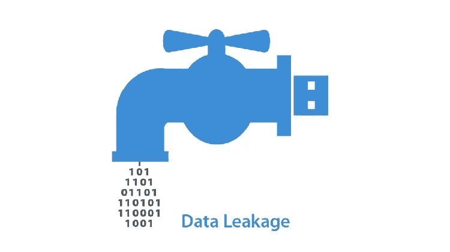
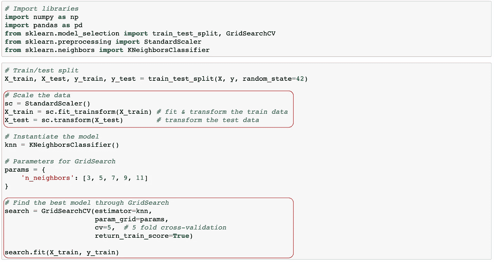
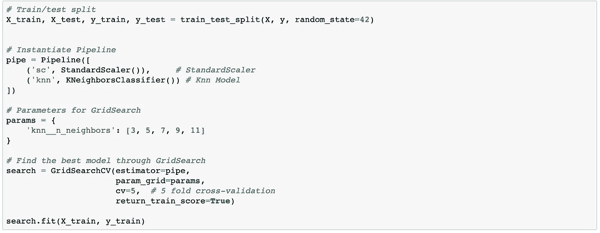
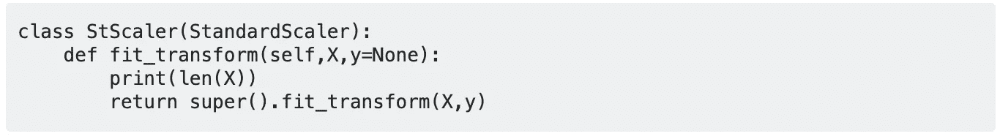
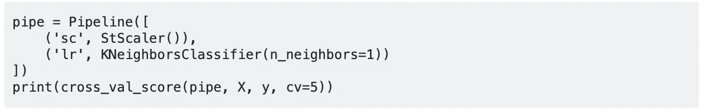
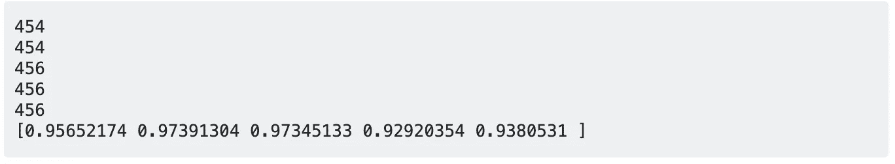

# 使用管道预处理数据，以防止交叉验证期间的数据泄漏。

> 原文：<https://towardsdatascience.com/pre-process-data-with-pipeline-to-prevent-data-leakage-during-cross-validation-e3442cca7fdc?source=collection_archive---------7----------------------->

image source: [http://www.securitymea.com/2018/04/25/data-leakage-has-gone-up-by-four-times/](http://www.securitymea.com/2018/04/25/data-leakage-has-gone-up-by-four-times/)

在机器学习中， **K 重交叉验证**是一种常用的验证技术，用于评估统计模型的结果如何推广到一个未知的数据集。它通常用于估计模型的预测能力。今天我想讨论一下使用 [**StandardScaler**](https://scikit-learn.org/stable/modules/generated/sklearn.preprocessing.StandardScaler.html) 等数据预处理器进行交叉验证时的一个常见错误。

## 错误

让我们通过检查下面的代码来识别错误。我用两个红框突出了要讨论的部分。

在第一个红色框中，使用**标准缩放器**对训练集进行拟合和转换，对测试集进行转换(不拟合)。这似乎是正确的，因为训练集和测试集都是由**标准定标器**仅使用来自训练集的信息进行标准化的(测试集是不可见的)。

第二个红框突出显示了由 [**GridSearchCV**](https://scikit-learn.org/stable/modules/generated/sklearn.model_selection.GridSearchCV.html) 执行的 5 重交叉验证，以在拟合数据时基于标准化的训练集选择最佳模型。问题来了，但是让我先后退一步，简单回顾一下 **GridSearchCV** 是如何执行交叉验证的。 **GridSearchCV** 将训练集分为内部训练集和验证集。对于 5 重交叉验证，内部训练集与验证集的数据比为 4: 1。该过程重复四次，从而覆盖整个列车组(见下图)。

[https://scikit-learn.org/stable/modules/cross_validation.html](https://scikit-learn.org/stable/modules/cross_validation.html)

现在让我分四步来讨论这个问题:

1.  交叉验证的目的是估计预测能力，因此验证集应被视为临时的不可见测试集。
2.  **标准刻度**不应与临时测试装置相匹配。然而，因为我们给 **GridSearchCV** 配备了一个预处理过的列车组，不幸的是，临时测试组配备了**标准刻度**，因此泄露了。
3.  临时测试集的方差被人为地去除，因此得到的交叉验证分数是有偏差的。
4.  **GridSearchCV** 根据交叉验证分数决定模型参数，可能无法找到减轻过拟合的最佳模型。

我从我在大会上学习的数据科学沉浸式项目的顶点项目中注意到了这个问题的重要性。该项目旨在使用 Kaggle 提供的经典[威斯康星大学乳腺癌细胞(诊断)数据集建立分类模型，对乳腺癌细胞进行分类。该项目的第一部分是复制 1994 年由威斯康星大学教授 Olvi L. Mangasarian、W. Nick Street 和 William H. Wolberg 出版的《通过线性规划进行乳腺癌诊断和预后》中讨论的乳腺癌诊断模型。因为数据集很小(即 569 个样本)，所以模型的预测能力仅基于交叉验证分数进行估计(而不是分成训练集、开发集和测试集三部分)。](https://archive.ics.uci.edu/ml/datasets/Breast+Cancer+Wisconsin+(Diagnostic))

## 解决方案

幸运的是，有一个简单的解决方案。通过简单地将预处理器和估计器放入**流水线**，我们可以避免 **GridSearchCV** 的这种不希望的结果。参见下面的代码:

为了演示 **Pipeline** 如何正确地解决问题(fit _ transform only the inner train set with**standard scaler**)，我想引用 Shihab Shahriar(经他允许)对我在 Stackoverflow.com 上发布的问题的惊人回应。通过使用 **cross_val_score** 仅查看 **GridSearchCV** 的交叉验证部分，进一步简化了响应。该演示使用了乳腺癌数据集(569 个样本)。

> 1.子类 **StandardScaler** 打印发送给 **fit_transform** 方法的数据集的大小。

> 2.将类放到管道中，并通过 **cross_val_score** 进行 5 重交叉验证。

> 3.输出显示，只有 80%的数据集(569 * 80%)符合 cross_validation_score 并已转换。

我要特别感谢 Shihab，他的解决方案让读者受益匪浅。我在 Stackoverflows.com 上发布的最初的问题集中在交叉验证期间**管道**是否与预处理程序一起正常工作。Shihab 不仅给出了解决方案，还讨论了不同估计器对预处理器输出的敏感性，这也可能回答您的一些其他问题。如果你感兴趣，点击[此处](https://stackoverflow.com/questions/57651455/are-the-k-fold-cross-validation-scores-from-scikit-learns-cross-val-score-and)查看整个讨论。

## 结论

这篇博客文章的要点是，每当需要数据预处理程序如**标准缩放器**和 **PCA** (即主成分分析)来构建机器学习模型时，确保使用**管道**来进行模型调整的交叉验证。同样，我们的最终目标是建立一个机器学习模型，它将推广到一个看不见的数据集。因此，我认为在交叉验证过程中防止数据泄漏确实很重要。希望这个帖子有帮助~。