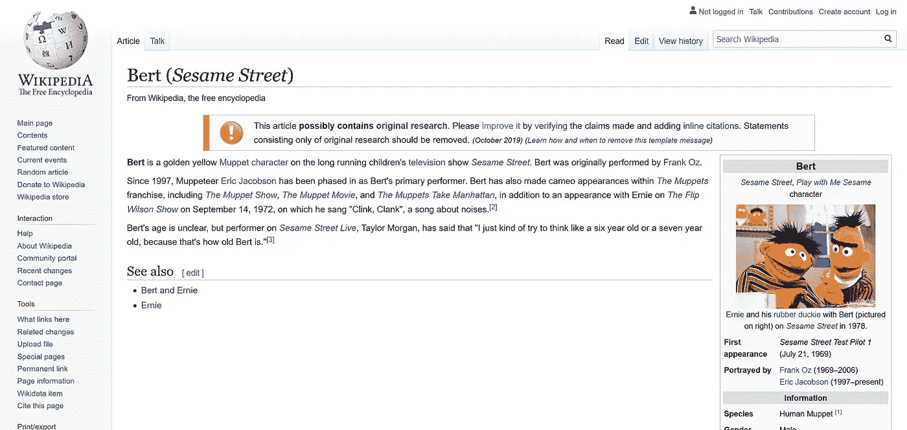

# 为 NLP 模型训练预处理 Wikipedia 转储—书面报告

> 原文：<https://towardsdatascience.com/pre-processing-a-wikipedia-dump-for-nlp-model-training-a-write-up-3b9176fdf67?source=collection_archive---------18----------------------->

## 下载、提取、清理和预处理 NLP 模型的维基百科转储(例如，像 BERT、RoBERTa 等的变压器)。)培训

[Wikipedia entry for Bert](https://www.wikiwand.com/en/Bert_(Sesame_Street)) (from Sesame Street)

[**Wikipedia dumps**](https://dumps.wikimedia.org/)**在现代 NLP 研究中被频繁用于模型训练，尤其是与**变形金刚**如 BERT、RoBERTa、XLNet、XLM 等。因此，对于任何有志于掌握这些模型的 NLP 研究人员来说，这篇文章展示了下载、提取、清理和预处理维基百科转储所涉及的一切(和代码)。**

# **📥下载维基百科转储**

**维基百科转储以多种语言的多种格式免费提供。对于英语维基百科，最新转储的所有可用格式的完整列表可以在[这里](https://dumps.wikimedia.org/enwiki/latest/)找到。**

**因为我们主要对文本数据感兴趣，所以为了本文的目的，我们将使用下面的代码下载这样一个压缩 XML 格式的转储(只包含页面和文章):**

**Simple bash script to download the latest Wikipedia dump in the chosen language**

**例如，要下载最新的英语维基百科转储，只需在终端中运行以下命令:`./download_wiki_dump.sh en`**

# **🗜️提取和清理维基百科转储**

**我们刚刚下载的维基百科转储还不能进行预处理(句子标记和每行一句)。首先，我们需要提取并清理转储，这可以通过使用下面的代码使用 [**WikiExtractor** ，](https://github.com/attardi/wikiextractor/)轻松完成:**

**Simple bash script to extract and clean a Wikipedia dump**

**例如，要提取并清理我们刚刚下载的 Wikipedia 转储，只需在您的终端中运行以下命令:`./extract_and_clean_wiki_dump.shenwiki-latest-pages-articles.xml.bz2`**

# **⚙️预处理维基百科转储**

**既然我们已经成功地下载、提取和清理了维基百科转储，我们可以开始预处理它了。实际上，这意味着对文章进行句子标记，以及将它们每行一句地写到一个文本文件中，这可以使用微软速度惊人的[**bling fire tokenizer**](https://github.com/microsoft/BlingFire)来完成，使用下面的代码:**

**例如，要预处理我们刚刚提取和清理的 Wikipedia 转储，只需在您的终端中运行以下命令:`python3 preprocess_wiki_dump.pyenwiki-latest-pages-articles.txt`**

****就这样，大功告成！**🙌现在，您可以使用自己新创建的维基百科语料库，亲自尝试 NLP 中最新最棒的内容。🤗**