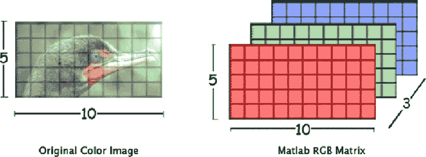
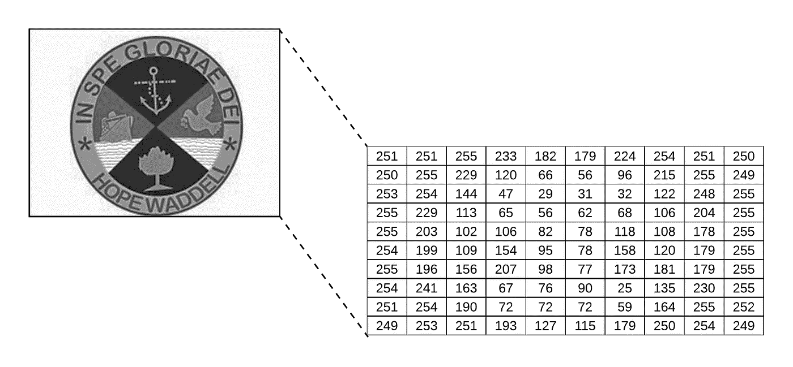
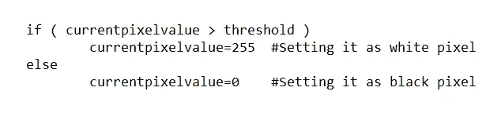
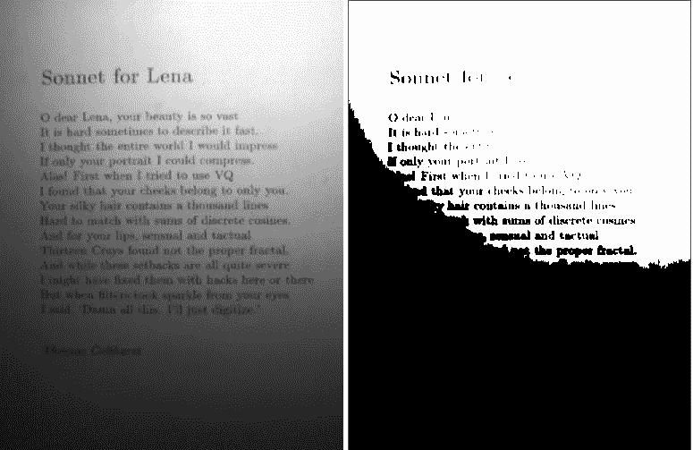
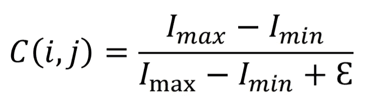
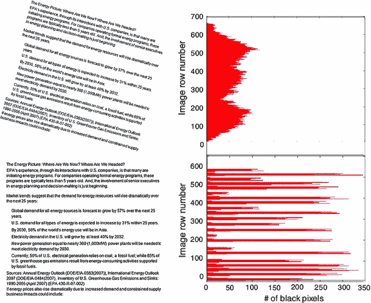
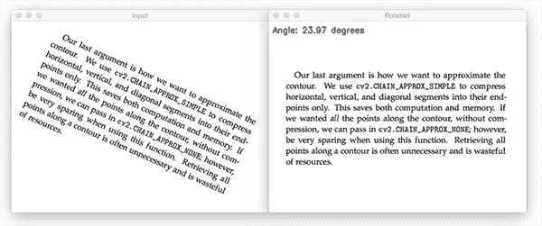
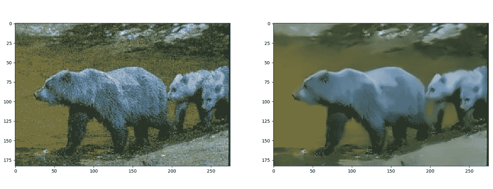
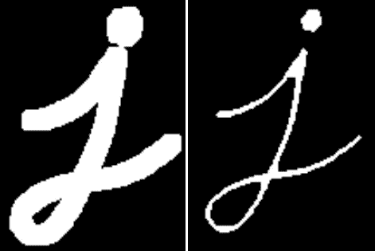

# OCR 中的预处理！！！

> 原文：<https://towardsdatascience.com/pre-processing-in-ocr-fc231c6035a7?source=collection_archive---------0----------------------->

## OCR 系统最广泛使用的预处理技术的基本解释。

欢迎来到关于 OCR 系统工作的**系列第二部分** 。在 [*之前的文章*](https://medium.com/@susmithreddyvedere/what-is-ocr-7d46dc419eb9) 中，我们简要讨论了 OCR 系统的不同阶段。

在 OCR 的所有阶段中， ***预处理*** 和 ***分割*** 是最重要的阶段，因为 OCR 系统的准确性很大程度上取决于*预处理*和*分割*的执行情况。因此，在这里我们将学习一些最基本和最常用的图像预处理技术。

## 我们走吧…

*预处理*阶段的主要目的是 ***使 OCR 系统尽可能容易地*** 从背景中辨别出字符/单词。

一些最基本和最重要的***预处理*** 技术有

**1)二值化**
**2)** **倾斜校正**
**3)** **去噪**
**4)** **细化和骨架化**

在讨论这些技术之前，让我们先了解一下 OCR 系统是如何理解图像的。对于 OCR 系统，*图像*是多维数组(如果图像是灰度(或)二进制，则为 2D 数组，如果图像是彩色的，则为 3D 数组)。矩阵中的每个单元称为一个像素，它可以存储 8 位整数，这意味着像素范围是 0-255。



Internal Representation of RGB image with Red, Green and Blue Channels. **Source: left image from** [**semantics scholar**](https://www.semanticscholar.org/paper/Content-Based-Image-Retrieval-using-Color-Brunda-Chaitra/04ecb35b02e6060916bf05d5f56a925eff0e332e)**, right image from** [**researchgate**](https://www.researchgate.net/figure/A-three-dimensional-RGB-matrix-Each-layer-of-the-matrix-is-a-two-dimensional-matrix_fig6_267210444)**.**



Internal Representation of Grayscale image. It has only one channel. **Source:** [**ekababisong.org**](https://ekababisong.org/gcp-ml-seminar/cnn/)

让我们逐一检查上面提到的每一种预处理技术

1.  ***二值化:*** 通俗地说*二值化*就是将彩色图像转换成只由黑白像素组成的图像(黑色像素值=0，白色像素值=255)。作为一个基本规则，这可以通过固定一个*阈值*来实现(通常阈值=127，因为它正好是像素范围 0–255 的一半)。如果像素值大于阈值，则认为是白色像素，否则认为是黑色像素。



Binarization conditions. **Source: Image by author**

但是这种策略并不总是给我们想要的结果。在图像中光照条件不均匀的情况下，这种方法会失败。



Binarization using a threshold on the image captured under non-uniform lighting. **Source: left image from this** [**post**](https://www.researchgate.net/post/How_to_have_uniform_intensity_on_non-uniform_illuminated_image) **and right image binarised by author.**

所以，二值化的关键部分是确定 ***阈值*** 。这可以通过使用各种技术来完成。

→ *局部最大最小值法*:



Imax= Maximum pixel value in the image, Imin= Minimum pixel value in the image, E = Constant value **Source: Reference [2]**

*C(i，j)* 是图像中局部 ***定义尺寸*** 的*阈值*(如 10x10 尺寸的零件)。使用这种策略，我们将为图像的不同部分设置不同的阈值，这取决于周围的光照条件，但是过渡并不平滑。

→ *Otsu 的二值化*:该方法考虑到整个图像的各种特征(如光照条件、对比度、锐度等)，为整个图像给出一个*阈值，该阈值用于二值化图像。
这可以通过以下方式使用 OpenCV python 来实现:*

```
ret, imgf = cv2.threshold(img, 0, 255,cv2.THRESH_BINARY,cv2.THRESH_OTSU) #imgf contains Binary image
```

-> *自适应阈值处理*:这种方法根据图像的局部和邻居的特征，为图像的一小部分给出一个阈值，也就是说，对于整个图像没有单一的固定阈值，但是图像的每一小部分根据局部都有不同的阈值，并且还提供平滑过渡。

```
imgf = cv2.adaptiveThreshold(img,255,cv2.ADAPTIVE_THRESH_GAUSSIAN_C,cv2.THRESH_BINARY,11,2) #imgf contains Binary image
```

2. ***歪斜校正:*** 扫描文件时，有时可能会出现轻微歪斜(图像与水平面成一定角度)。从扫描图像中提取信息时，检测&校正倾斜是至关重要的。
多种技术用于倾斜校正。

→投影轮廓法
→霍夫变换法
→背线法
→扫描线法

然而，*投影轮廓*方法是确定文件倾斜的最简单、最容易和最广泛使用的方法。

在这个方法中，首先，我们将二进制图像，然后

*   将其水平投影(取图像矩阵各行的像素总和)以获得图像高度的像素直方图，即每行的前景像素计数。
*   现在，图像以各种角度旋转(以称为 *Delta* 的小角度间隔)，并且将计算峰值之间的差异(*方差*也可以用作度量之一)。找到峰值之间的**最大**差(或*方差*)的角度，该对应角度将是图像的*倾斜角度*。
*   找到歪斜角后，我们可以通过在歪斜的 ***相反方向*** 旋转图像一个等于歪斜角的角度来校正歪斜。



Correcting skew using the Projection Profile method. **Source: Reference[1]**

```
import sys
import matplotlib.pyplot as plt
import numpy as np
from PIL import Image as im
from scipy.ndimage import interpolation as interinput_file = sys.argv[1]img = im.open(input_file)# convert to binary
wd, ht = img.size
pix = np.array(img.convert('1').getdata(), np.uint8)
bin_img = 1 - (pix.reshape((ht, wd)) / 255.0)
plt.imshow(bin_img, cmap='gray')
plt.savefig('binary.png')def find_score(arr, angle):
    data = inter.rotate(arr, angle, reshape=False, order=0)
    hist = np.sum(data, axis=1)
    score = np.sum((hist[1:] - hist[:-1]) ** 2)
    return hist, scoredelta = 1
limit = 5
angles = np.arange(-limit, limit+delta, delta)
scores = []
for angle in angles:
    hist, score = find_score(bin_img, angle)
    scores.append(score)best_score = max(scores)
best_angle = angles[scores.index(best_score)]
print('Best angle: {}'.formate(best_angle))# correct skew
data = inter.rotate(bin_img, best_angle, reshape=False, order=0)
img = im.fromarray((255 * data).astype("uint8")).convert("RGB")
img.save('skew_corrected.png')
```



Skew Correction. **Source:** [**pyimagesearch.com**](https://www.pyimagesearch.com/) **by** [**Adrian Rosebrock**](https://www.pyimagesearch.com/author/adrian/)

3. ***噪声去除:****噪声去除*阶段的主要目的是通过去除比图像其余部分具有更高亮度的小点/小块来平滑图像。可以对*彩色*和*二进制图像*进行噪声去除。
使用 OpenCV*fastNlMeansDenoisingColored*函数*进行去噪的一种方法。*

```
import numpy as np 
import cv2 
from matplotlib import pyplot as plt 
# Reading image from folder where it is stored 
img = cv2.imread('bear.png') 
# denoising of image saving it into dst image 
dst = cv2.fastNlMeansDenoisingColored(img, None, 10, 10, 7, 15) 
# Plotting of source and destination image 
plt.subplot(121), plt.imshow(img) 
plt.subplot(122), plt.imshow(dst) 
plt.show()
```



Smoothening and Denoising of image. **Source: Reference [4]**

更多关于*去噪&图像平滑*的技巧可以在 [***这篇***](/image-filters-in-python-26ee938e57d2) 的精彩文章中找到

4. ***细化和骨架化*** :这是一个可选的预处理任务，取决于使用 OCR 的上下文。
→如果我们对打印文本使用 OCR 系统，则无需执行此任务，因为打印文本始终具有统一的笔画宽度。
→如果我们使用 OCR 系统处理手写文本，则必须执行此任务*，因为不同的书写者有不同的书写风格，因此笔画宽度也不同*。所以为了使笔画的宽度一致，我们必须执行*细化和*。

这可以通过以下方式使用 OpenCV 来实现

```
import cv2
import numpy as npimg = cv2.imread('j.png',0)
kernel = np.ones((5,5),np.uint8)
erosion = cv2.erode(img,kernel,iterations = 1)
```

在上面的代码中，图像的*细化*取决于内核大小和迭代次数。



Before and After Thinning and Skeletonization. **Source:** [**datacamp**](https://campus.datacamp.com/courses/image-processing-in-python/filters-contrast-transformation-and-morphology?ex=13)

在本文中，我们看到了一些基本的和最广泛使用的 ***预处理*** 技术，这让我们对 OCR 系统内部发生的事情有了一个基本的了解。下图是 ***预处理*** 工作流程的一个例子。


**Source: Reference [5]**

我希望你已经了解了在 OCR 中 ***预处理*** 是如何执行的。

# 延伸阅读:

在[***part-III***](https://medium.com/@susmithreddyvedere/segmentation-in-ocr-10de176cf373)中，我们将看到 OCR 系统所使用的*分割技术。*

*快乐学习！！！！*

*欢迎任何疑问、建议和更正。😃*

# *参考资料:*

*[1] Shafii，m .，Sid-Ahmed，m .基于轴平行包围盒的倾斜检测和校正。*伊达尔* **18，**59–71(2015)。[https://doi.org/10.1007/s10032-014-0230-y](https://doi.org/10.1007/s10032-014-0230-y)*

*[2] Jyotsna，S. Chauhan，E. Sharma 和 A. Doegar，“退化文档图像的二值化技术——综述”， *2016 年第五届可靠性、信息通信技术和优化国际会议(趋势和未来方向)(I rito)*，诺伊达，2016，第 163–166 页，doi:10.11109/I rito . 20136106*

*[3] A. Papandreou 和 B. Gatos，“一种基于垂直投影的新型倾斜检测技术”， *2011 年国际文档分析与识别会议*，北京，2011，第 384–388 页，doi: 10.1109/ICDAR.2011.85*

*[4] K. Lin，T. H. Li，S. Liu 和 G. Li，“使用噪声域适应和注意力生成对抗网络的真实照片去噪”， *2019 年 IEEE/CVF 计算机视觉和模式识别研讨会会议(CVPRW)* ，美国加利福尼亚州长滩，2019 年，第 1717-1721 页，doi: 10.1109/CVPRW.2019.00221*

*[5] Choudhary，Amit & Rishi，Rahul & Savita，Ahlawat。(2013).一种新的脱机手写草书字符分割方法。计算机科学。17.88–95.10.1016 年 5 月 13 日*