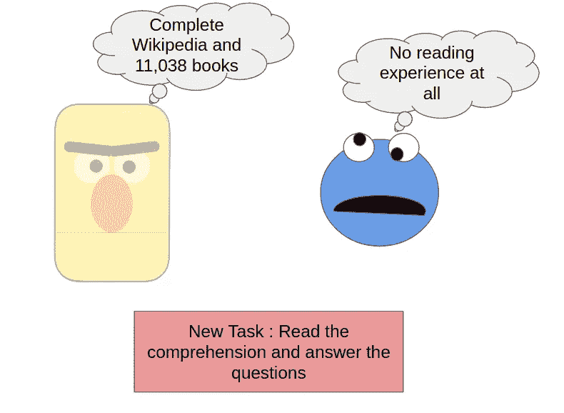
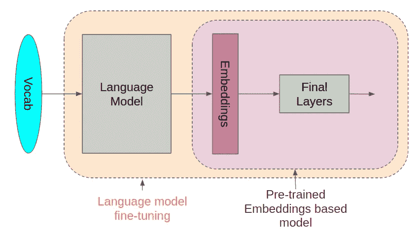
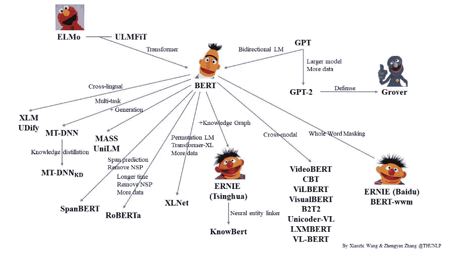

# 预先训练的语言模型:简化

> 原文：<https://towardsdatascience.com/pre-trained-language-models-simplified-b8ec80c62217?source=collection_archive---------18----------------------->

## NLP 世界的芝麻街

## 什么是预训练语言模型？

预先训练的语言模型背后的直觉是创建一个黑盒，让**理解**该语言，然后可以要求它用该语言做任何特定的任务。这个想法是创造一个相当于“博学”的人的机器。

语言模型首先被输入大量未标注的数据(例如，完整的维基百科转储)。这让模型学习各种单词的用法以及语言的一般写法。该模型现在被转移到 NLP 任务，在那里它被馈送给另一个更小的特定于任务的数据集，该数据集用于微调和创建能够执行前述任务的最终模型。

## 为什么它们比以任务为中心的模型更好？

一句话:*他们更好读！！*仅在特定于任务的数据集上训练的模型需要使用相对较小的数据集来理解语言和任务。另一方面，语言模型已经理解该语言，因为它在预训练期间已经“读取”了大量的语言转储。因此，语言模型可以直接微调自身以匹配所需的任务，并且比现有的 SOTA 执行得更好。

## 嵌入与微调

NLP 中的每个单词都需要用数学表示，以便让机器做进一步的处理。你可以通过我之前关于分布式向量表示的博客获得更多的直觉…

 [## 分布式矢量表示:简化

### 可以说是机器学习中最基本的特征表示方法

towardsdatascience.com](/distributed-vector-representation-simplified-55bd2965333e) 

已经提出了许多不同的算法来创建这些嵌入，通过在单独的较大数据集上预先训练模型来捕捉语言的本质。例如，Word2Vec 嵌入获得了难以置信的流行，这些嵌入直接用于 NLP 中的许多任务。

然而，这些单词表征是在广义的上下文中学习的，并不代表特定任务的信息。这就是语言模型的微调部分要考虑的地方。直接使用预先训练的嵌入可以减小整个模型的大小，但是迫使我们只能使用一般化的单词表示。另一方面，语言模型微调允许用户通过在特定于任务的数据集上进行训练来微调这些单词嵌入/表示。

例如，在广义的上下文中，单词“当前”的表示可能与“新闻”和“电”都有良好的关系。然而，对于涉及电路的特定任务，允许模型微调单词表示，使得“电流”和“电”更好地匹配，可以帮助提高模型性能。

## 伯特

BERT(变形金刚的双向编码器表示)是由 Google 在去年提出的，它能够单枪匹马地在 11 个独立的 NLP 任务上实现 SOTA 性能！！从那以后，它成为了多种语言模型的来源。

该模型的成功主要归功于文中提出的训练方法。这两个训练协议，即“掩蔽 LM”和“NSP:下一句预测”(后来被改进为“SOP:句序预测”)，帮助 BERT 从可用的庞大语言语料库中学习。

“屏蔽 LM”任务是通过在每个句子中随机屏蔽 15%的单词并训练模型来预测它们来实现的。“SOP”任务是具有两个句子输入的分类任务，并且该模型被期望识别这两个句子之间的原始顺序，这增加了它的文档级理解。这些训练任务产生的影响和 BERT 的内部工作需要更详细的分析，我现在不打算深入讨论。

## 下一步是什么？

虽然语言模型的不同变体开始主导各种 NLP 任务，但每个人都开始意识到两个重要的事实。第一，尽管最初的伯特模型有正确的想法，但它缺乏训练，因此具有难以置信的未开发的潜力。第二，像 BERT 这样的预训练语言模型的巨大规模是这些模型未来研究和部署的一大障碍。看来这两个主要问题需要在这个领域向前发展之前得到回答。

*这个博客是努力创建机器学习领域简化介绍的一部分。点击此处查看完整系列*

 [## 机器学习:简化

### 在你一头扎进去之前就知道了

towardsdatascience.com](/machine-learning-simplified-1fe22fec0fac) 

*或者干脆阅读系列的下一篇博客*

 [## 卷积核的类型:简化

### 对迷人的 CNN 层的不同变化的直观介绍

towardsdatascience.com](/types-of-convolution-kernels-simplified-f040cb307c37) 

## 参考

*[1]瓦斯瓦尼、阿希什等，“你所需要的只是关注。”神经信息处理系统进展。2017.
【2】Devlin，Jacob 等《Bert:语言理解的深度双向变换器预训练》。arXiv 预印本 arXiv:1810.04805 (2018)。
[3]彼得斯、马修·e 等，“深度语境化的词语表征”arXiv 预印本 arXiv:1802.05365 (2018)。
[4] Mikolov，Tomas 等，“单词和短语的分布式表示及其组合性”神经信息处理系统进展。2013.
[5]刘，，等.“Roberta:一种鲁棒优化的 bert 预训练方法”arXiv 预印本 arXiv:1907.11692 (2019)。*