# 预训练单词嵌入还是嵌入层？—进退两难

> 原文：<https://towardsdatascience.com/pre-trained-word-embeddings-or-embedding-layer-a-dilemma-8406959fd76c?source=collection_archive---------5----------------------->

## 预训练单词嵌入和嵌入层对语义 NLP 任务绩效影响的比较

当单词嵌入在近十年前变得可用时，它们永远地改变了自然语言处理(NLP)。正如 Ronan Colobert 等人在他们 2008 年著名的 [JMLR 论文](http://www.jmlr.org/papers/volume12/collobert11a/collobert11a.pdf)中所说，他们“几乎从零开始”重新开发了 NLP。几年后，在 2013 年，随着 [Mikolov 等人(2013)](https://arxiv.org/pdf/1301.3781.pdf) 的 *word2vec* 库的发布，它们迅速成为文本数据矢量化的主导方法。基于传统矢量化方法(如 LSI 和 TF-IDF)已经得到充分研究的 NLP 模型正在接受单词嵌入的测试，在大多数情况下，单词嵌入处于领先地位。此后，开发了许多嵌入方法。此外，主要的深度学习(DL)包包含一个学习特定任务嵌入的嵌入层。

虽然我找到了一些比较不同类型的预训练单词嵌入的性能的研究，但我找不到任何将预训练单词嵌入的性能与嵌入层的性能进行比较的综合研究。然而，当我开始为 NLP 实现一个新的 DL 模型时，这是我问自己的第一个问题。为了回答这个问题，我进行了几个实验，以便比较预训练的单词嵌入和嵌入层对 DL 模型在两个语义任务(即情感分析和问题分类)上的性能的影响。但是首先，让我们回顾一下单词嵌入背后的基本思想，并简要回顾一下它们的历史。

# 根据一个人交的朋友来判断这个人

为什么单词嵌入比传统的单词向量更好，这超出了本文的范围。然而，它们是基于 20 世纪 50 年代发明的丰富的语言学理论，叫做分布假设。该理论通过观察上下文来定义一个词的语义。

> “从一个人交的朋友，你就可以知道这个人是谁。”约翰·r·弗斯(20 世纪语言学的领军人物)

林(1998 )用一个很少见的专有名词 T *ezgüino* 来说明这个概念，很多人都不熟悉。然而，只要我们在上下文中看到它，就很容易推断出来:“桌子上有一瓶 T *ezgüino* 。Tezgü ino 让你醉了。换句话说，即使你不知道*tez guino*的意思，它的上下文也阐明了它的意思。

# 单词嵌入简史

传统上，提出了许多基于统计和规则的模型，试图对分布语义进行建模。主要地，为语料库中出现的所有单词创建共现矩阵，然后使用诸如 LSA 的方法将该矩阵投影到小得多的空间中。传统模型的详细讨论超出了本文的范围，但是，它可以为单词和短语的语义以及无监督单词向量的底层概念提供有价值的见解。相关工作见 [Mitchell 和 Lapata (2008)](https://pdfs.semanticscholar.org/52c5/ec55ff599ead59c8021ba2b5252e3289dee2.pdf) ， [Katrin Erk (2010](https://www.aclweb.org/anthology/W10-2803) )，以及 [Katz 和 Giesbrecht (2006](http://delivery.acm.org/10.1145/1620000/1613696/p12-katz.pdf?ip=213.61.96.186&id=1613696&acc=OPEN&key=4D4702B0C3E38B35%2E4D4702B0C3E38B35%2E4D4702B0C3E38B35%2E6D218144511F3437&__acm__=1559130616_31bf511ab441093332e2af8242853d8d) )。

直到 2003 年，Yoshua Bengio et al. (2003) 研究了学习半监督单词嵌入的想法。在他们的工作中，作者提出了一种神经网络，它学习单词序列的概率函数(语言模型的主要目标)，同时学习每个单词的分布表示。他们将输入的权重作为单词嵌入引入神经网络的隐藏层。然而，主要由于 Softmax 输出层，他们的模型在计算上是昂贵的，并且远离实际。该模型的目标是学习一个函数，该函数在给定观察到的单词序列的情况下预测良好的条件概率分布:

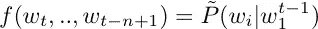

网络的架构如下所示:

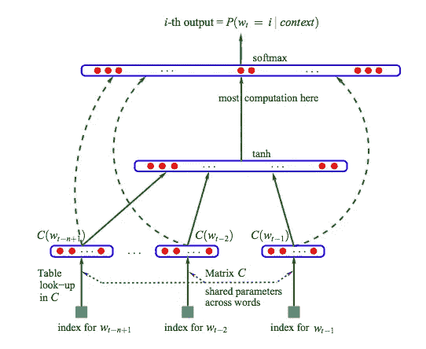

Figure from [Bengio et al. 2003](http://www.jmlr.org/papers/volume3/bengio03a/bengio03a.pdf). The proposed architecture for learning word representations.

其中 *C(i)* 是词汇表中 i^th 单词的表示。输出层会计算每个单词在整个词汇表中的条件概率分布，这导致模型不切实际:

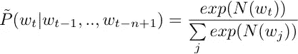

其中 *N* 是 Softmax 层之前的网络。这个模型的计算复杂性问题由 [Collobert 等人(2008)](http://www.jmlr.org/papers/volume12/collobert11a/collobert11a.pdf) 提出，他们提出了一个使用不同目标函数的卷积神经网络。与 Bengio 等人(2003) 不同，他们主要关心的不是语言建模，而是学习好的单词嵌入。因此，他们有更多的自由来达到这个目标。他们受益于正在学习的单词前后的上下文。尽管该模型产生了(第一个)无监督的单词嵌入，其结合了语义和句法信息，但是它仍然是计算昂贵的。由于之前模型的高计算成本，直到 2013 年 [Mikolov 等人(2013)](https://arxiv.org/pdf/1301.3781.pdf) 提出了他们简单而有效的模型，普及了单词嵌入，并开始渗透到 NLP 中。

他们提出了两种计算单词嵌入的架构:连续词袋(CBOW)和跳格(SG)模型。下图说明了 CBOW 模型，其中使用上下文( *w_{i-2}，w_{i-1}，w_{i+1}，w_{i+2}* )来预测目标单词( *w_i* ):

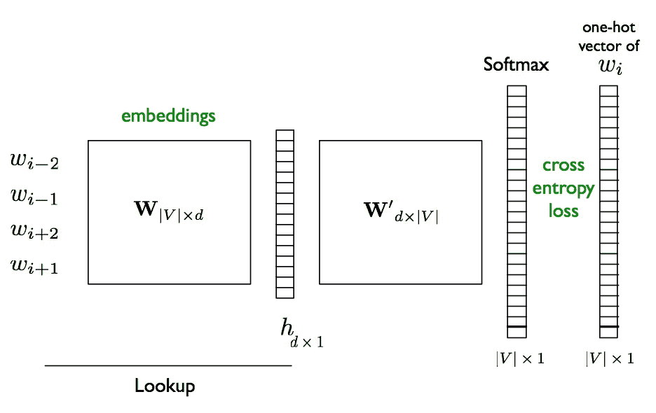

The architecture of CBOW word embedding model

另一方面，SG 模型试图从给定的单词中预测上下文。如上所述， [Mikolov 等人(2013)](https://arxiv.org/pdf/1301.3781.pdf) 的 CBOW 模型与之前的工作相比具有更简单的架构，从而降低了该模型的计算成本。这个模型的实现( *word2vec* )促进了跨 NLP 不同领域的单词嵌入的广泛实验。显示使用单词嵌入的实验导致了大多数 NLP 任务的改善([巴隆尼等人(2014)](https://www.aclweb.org/anthology/P14-1023) 、[米科洛夫等人(2013)](https://papers.nips.cc/paper/5021-distributed-representations-of-words-and-phrases-and-their-compositionality.pdf) 和[亚兹达尼和波佩斯库-贝利(2013)](http://publications.idiap.ch/index.php/publications/show/2638) )。在过去的几年中，提出了许多其他嵌入方法，如手套、ELMO 和[多义词嵌入](https://www.aclweb.org/anthology/P18-1001)，以及许多其他模型。

# 那么…嵌入层还是预先训练的单词嵌入？

今天，我们可以通过高效的工具，如 *fastText* 立即创建特定于语料库的单词嵌入。我们也可以在我们的网络中使用一个嵌入层来训练关于手边问题的嵌入。

## **然而，每当我必须为一个特定的 NLP 任务建立一个新的模型时，我首先想到的问题之一是我是否应该使用预先训练的单词嵌入或嵌入层。**

虽然类似于人工智能中的大多数问题，这个问题可能没有在每个场景中都适用的普遍正确的答案，但在这里，我试图根据经验回答这个问题。

我研究了上述两种嵌入对两种语义 NLP 任务绩效的影响。即**情感分析**和**问题分类**并提供预训练单词嵌入和嵌入层之间的比较。

## 模型架构

我创建了一个具有两个卷积层的 CNN，并在下面的实验中使用了这个架构。对于预训练的嵌入实验，我用预训练的嵌入替换这一层的参数，维护索引并冻结这一层，防止它在梯度下降的过程中被更新。

## 超参数

为了能够仅控制嵌入类型，我修正了以下超参数，并使用完全相同的超参数进行实验:

## 数据

情感分析:IMDB 数据集
问题分类:TREC 数据集

## 预训练向量

1.  GloVe ( [glove.42B.300d](https://nlp.stanford.edu/projects/glove/) ):在 42B 令牌通用抓取语料库上训练的 300 维向量
2.  fast text WIKI([WIKI-news-300d-1M](https://fasttext.cc/docs/en/english-vectors.html)):在 16B 令牌维基百科 2017 转储上训练的 300 维向量

## 估价

我用(I)训练损失，(ii)混淆矩阵，(iii)精确度(宏观平均)，回忆(宏观平均)和不同类型嵌入的 F1 分数来说明我的发现。

## 任务 1:情感分析

情感分析(也称为极性检测和观点挖掘)，是指识别给定文本的极性或情感。情感通常用积极、消极和中性的标签来量化。我正在用来自 *torchtext.datasets* 的 IMDB 数据集进行实验，其中情感用 0 和 1 表示。下图显示了不同模型的训练损失和混淆矩阵结果。

**嵌入层**

Confusion Matrix and Training Loss for the Model with an Embedding Layer

**预训练单词嵌入**

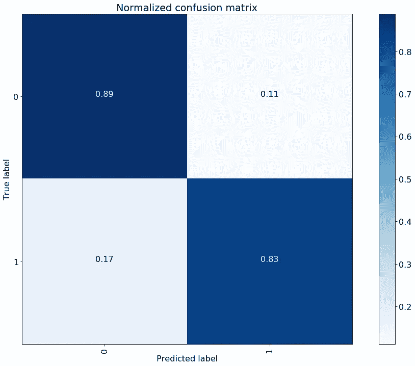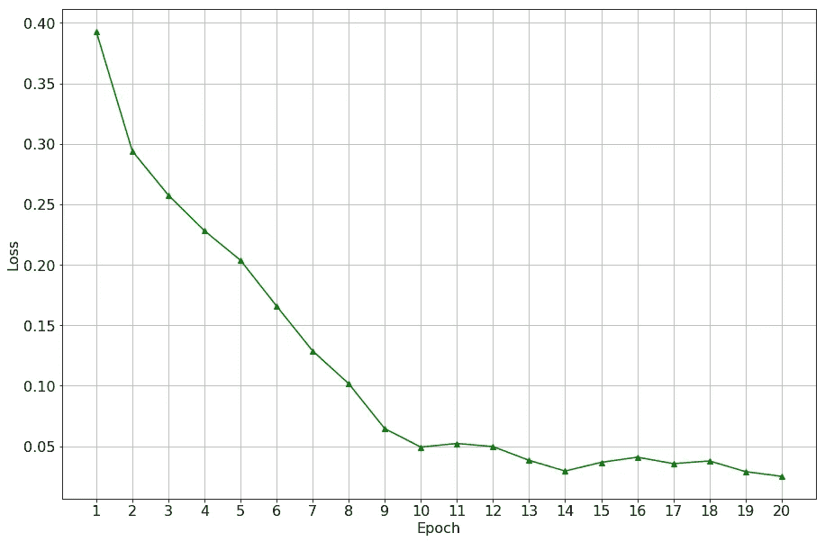

Confusion Matrix and Training Loss for the Model with Pre-trained IMDB vectors

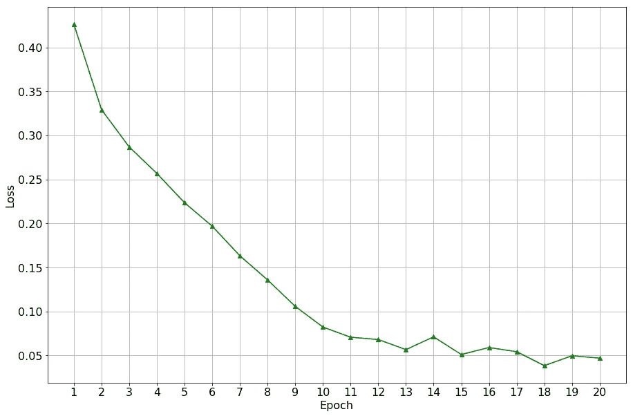

Confusion Matrix and Training Loss for the Model with Pre-trained Glove vectors

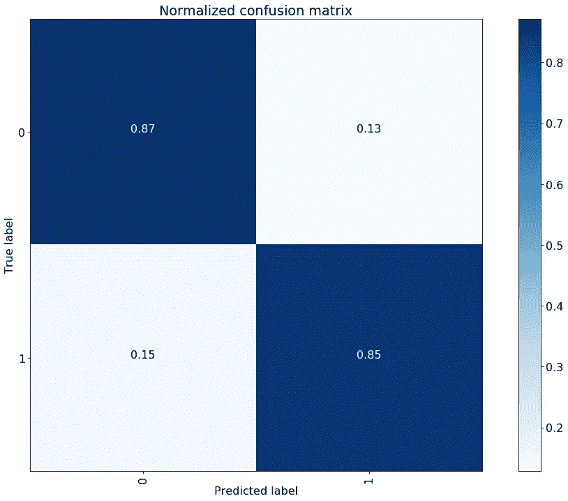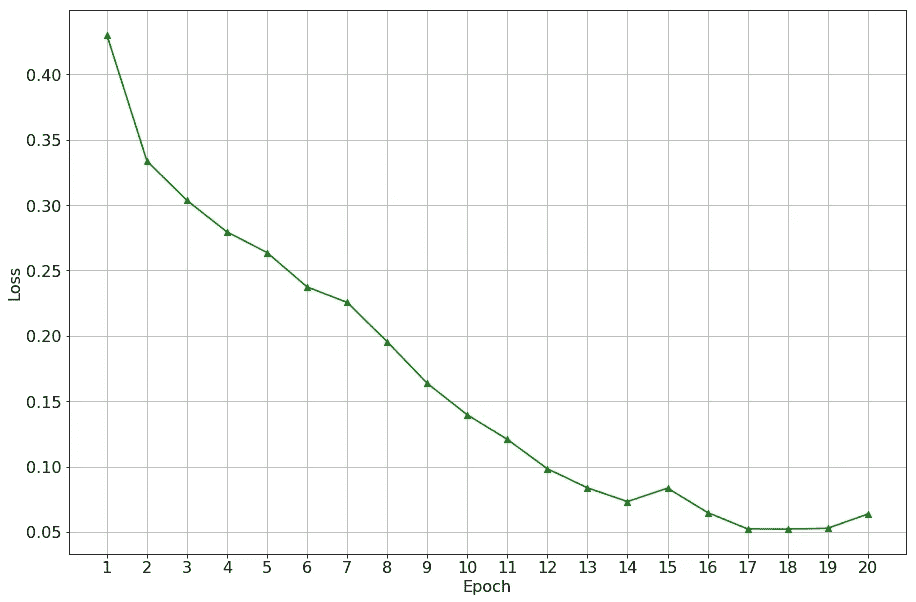

Confusion Matrix and Training Loss for the Model with Pre-trained WIKI vectors

如上所述，**与基于嵌入层的模型相比，所有三个预训练的基于嵌入的模型的训练损失衰减得更快。**此外，对于类别 1，预训练的基于嵌入的模型的精度始终较高。总精确度和召回率，以及 F1 分数如表 1 所示。如所见，预训练的基于嵌入的模型始终优于基于嵌入层的模型，尽管差距很小。

Table 1\. The overall precision, recall, and F1 score for Sentiment Analysis task

## 任务 2:问题分类

问题分类的任务是给问题分配一个语义类别标签，以便更容易找到问题的答案。我使用了来自 *torchtext.datasets* 的 TREC 数据集，该数据集包括来自 6 个 TREC 类的问题，即缩写、实体、描述、位置和数值。

下图说明了不同模型的训练损失以及测试集在混淆矩阵方面的性能:

**嵌入层**

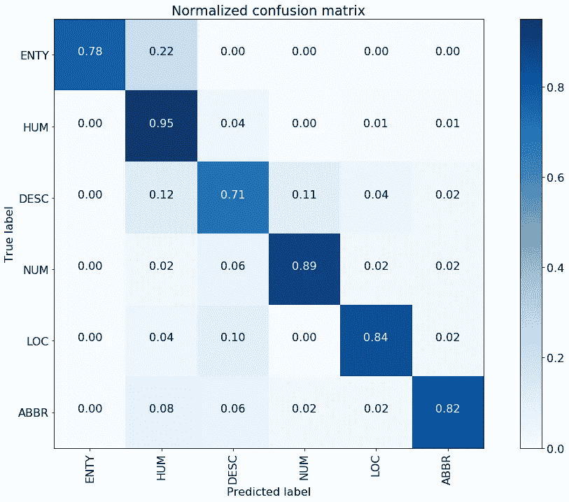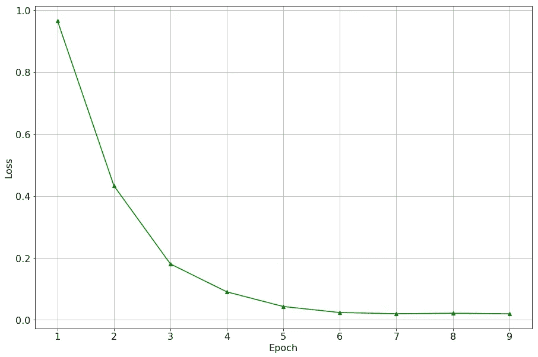

**预训练单词嵌入**

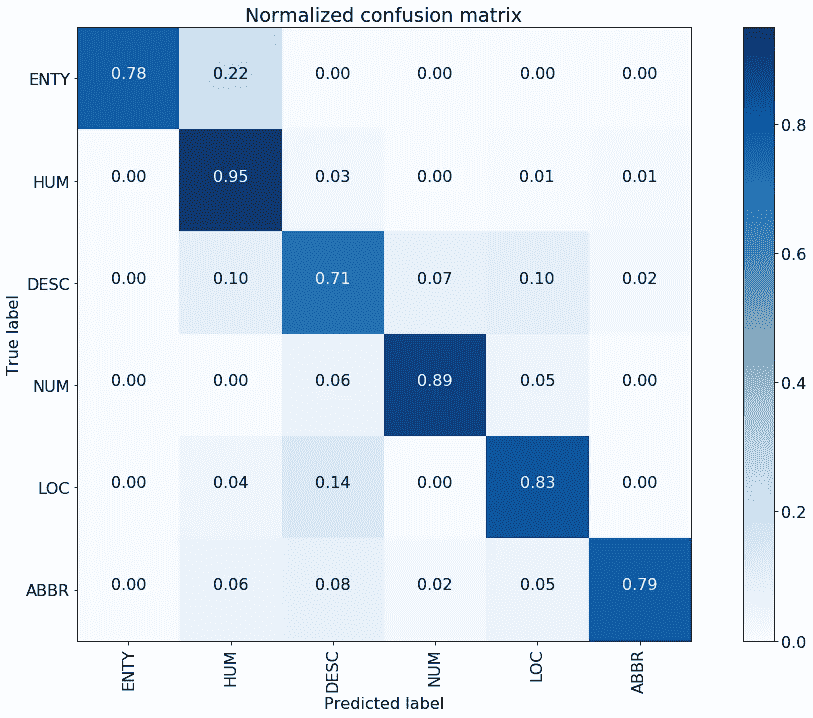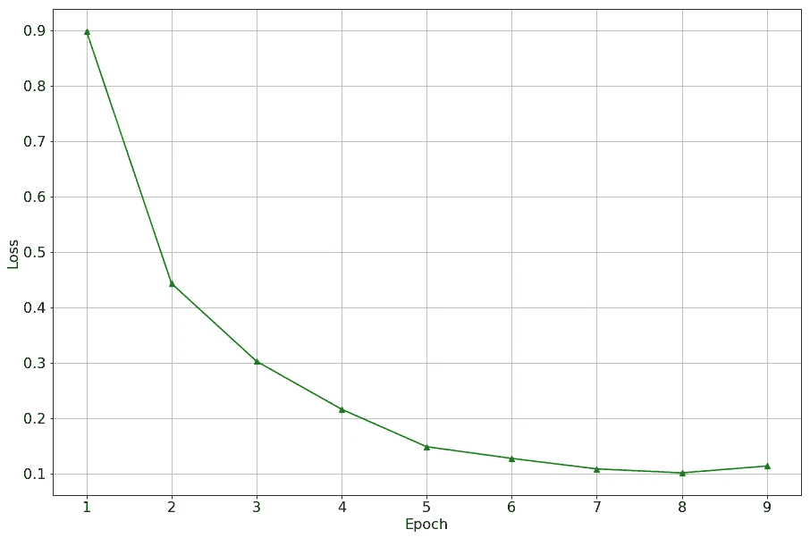

Confusion Matrix and Training Loss for the Model with Pre-trained TREC vectors

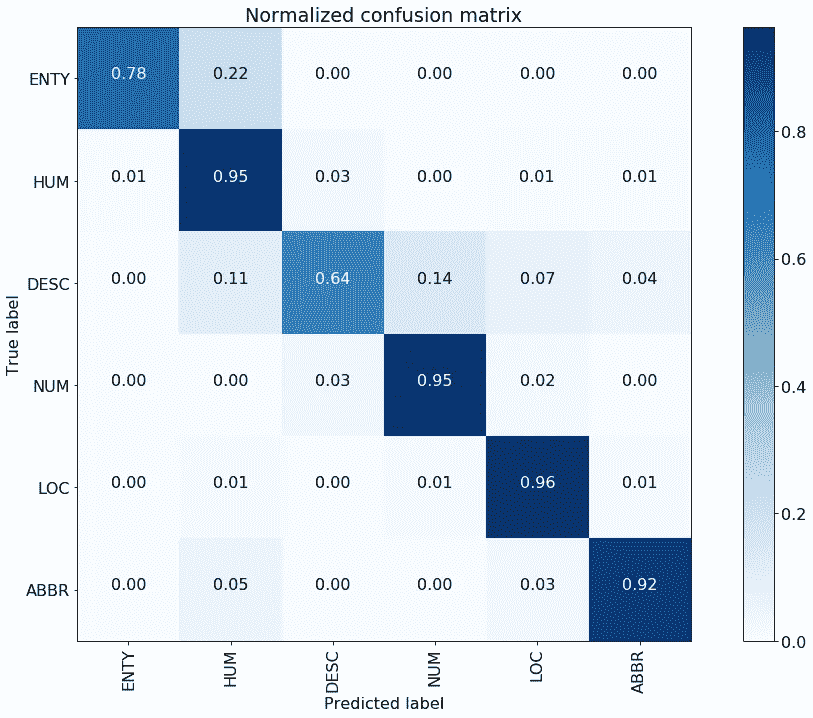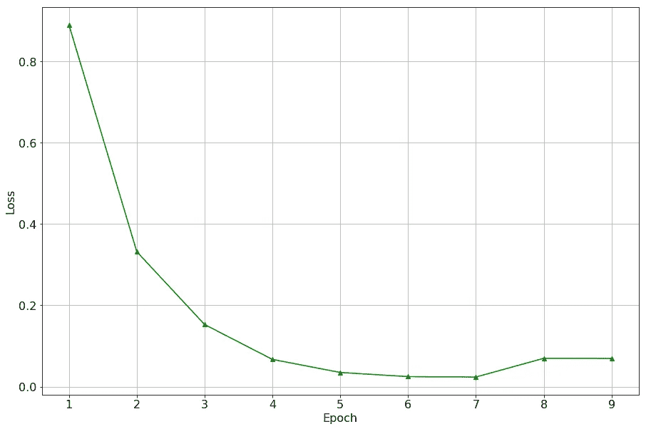

Confusion Matrix and Training Loss for the Model with Pre-trained Glove vectors

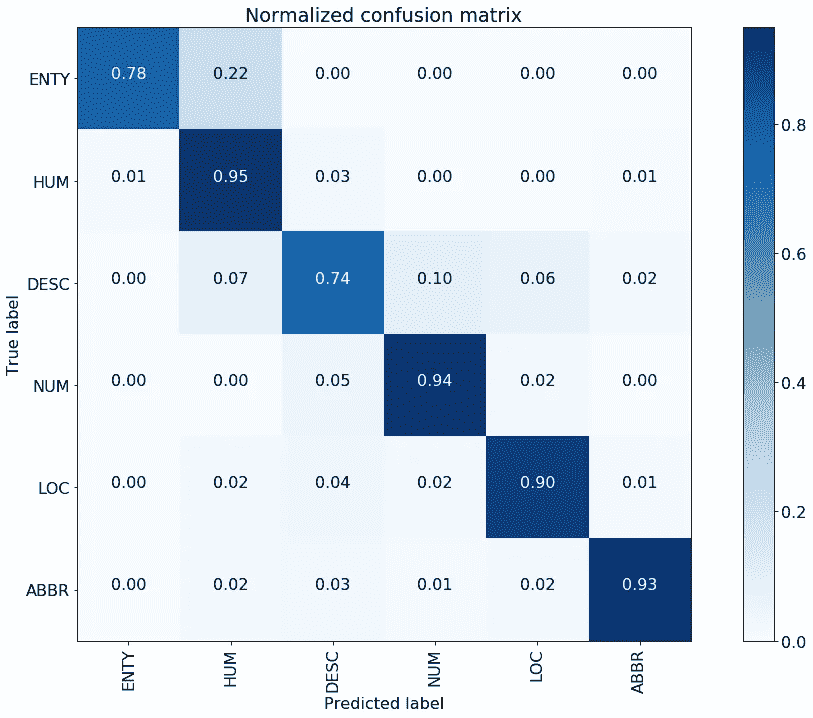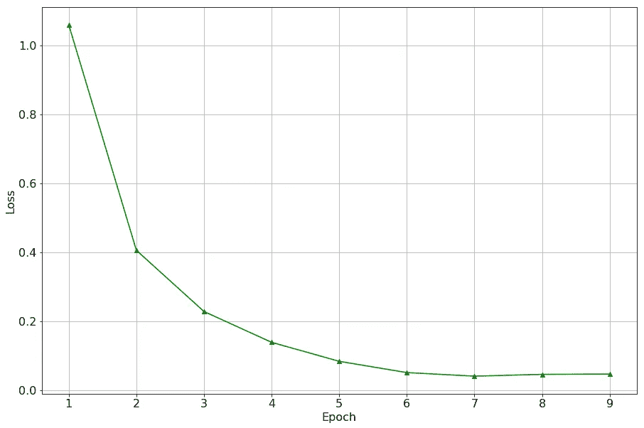

Confusion Matrix and Training Loss for the Model with Pre-trained WIKI vectors

基于嵌入层的模型和预训练的基于嵌入的模型的训练损失衰减相对较快并且没有太多波动。没有观察到训练损失之间的显著差异。另一方面，除了在 TREC 问题数据集上训练的嵌入之外，所有基于预训练嵌入的模型的总体精度、召回率和 F1 分数都有所提高。这是意料之中的，因为 TREC 是一个包含简短问题的小数据集，因此，在该数据集上训练的向量可能不会携带太多语义信息。对于其他预训练的基于嵌入的模型，即 Glove 4B 和 fastText WIKI，几个类的性能都有相当大的提高。例如，在 ABBR，正确分类实例的百分比从 82%增加到 92-93%。或 LOC，其中正确分类的实例的百分比从 84%增加到 90-96%。下表列出了不同模型的总体精度、召回率和 F1 值。

# 在家上课

查看 IMDB 情感分析任务的结果，**似乎预先训练的单词嵌入导致更快的训练和更低的最终训练损失。**可以解释为，与通过嵌入层从训练数据中提取的语义信号相比，该模型可以从预训练的嵌入中提取更多的语义信号。

我们从 TREC 问题分类任务**的结果中看到，在小语料库上训练的** **向量将比嵌入层具有更差的性能。然而，就精确度和召回率而言，在大型语料库上训练的向量以相当大的优势击败了嵌入层。**

**一致** **对于两个任务，当我们使用预训练的单词嵌入(在足够大的语料库上训练)**时， **精度和召回率提高。然而，对于情感分析任务，这种改善很小，而对于句子分类任务，这种改善要大得多。**

这可能意味着**对于解决** **语义 NLP 任务，当手头的训练集足够大时**(如情感分析实验中的情况)**，最好使用预训练的单词嵌入**。尽管如此，出于任何原因，**你仍然可以使用一个嵌入层，并期待可比较的结果。然而，训练集很小，上述实验强烈鼓励使用预先训练的单词嵌入。**

# 最终注释

与可根据实数值直接获得并因此可由机器学习模型直接解释的图像数据不同，文本数据需要被转换成一种表示，使得每个单词所承载的广泛知识的至少一部分可被带入这种表示。只有到那时，我们才能期望拥有在某种程度上理解人类语言的智能模型。学习词语的语义表征有着相对悠久的历史，并且一直是语言学和自然语言处理的核心研究课题。单词嵌入提供了一种表示单词的有效方式，然而，它们当前的能力在捕获每个单词所承载的语义、句法和搭配信息方面是有限的。这意味着在我们能够开发出能够理解和生成文本级别的自然语言的智能系统之前，在表示文本数据方面仍有很大的改进空间。