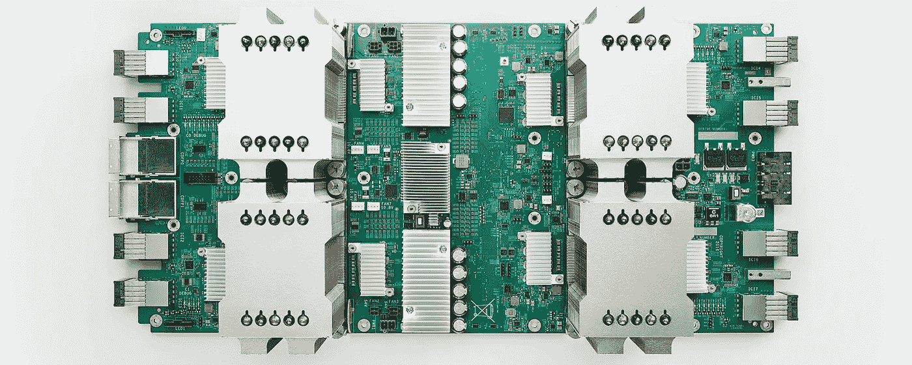

# 用云 TPU 从头开始预训练伯特

> 原文：<https://towardsdatascience.com/pre-training-bert-from-scratch-with-cloud-tpu-6e2f71028379?source=collection_archive---------1----------------------->



Google Cloud TPUv2

在这个实验中，我们将使用谷歌云基础设施对任意文本数据预先训练一个最先进的自然语言理解模型 [BERT](https://arxiv.org/abs/1810.04805) 。

本指南涵盖程序的所有阶段，包括:

1.  设置培训环境
2.  下载原始文本数据
3.  预处理文本数据
4.  学习新词汇
5.  创建分片的预训练数据
6.  为数据和模型设置 GCS 存储
7.  在云 TPU 上训练模型

# 几个问题

## 这本指南有什么用？

有了这个指南，你将能够在任意文本数据上训练一个 BERT 模型。如果您的语言或用例的预训练模型在开源中不可用，这将非常有用。

## 这本指南是给谁的？

本指南面向那些对 BERT 技术感到兴奋，但对现有的
开源模型的性能不满意的 NLP 研究人员。

## 我如何开始？

对于训练数据和模型的持久存储，您将需要一个 Google 云存储桶。请按照[谷歌云 TPU 快速入门](https://cloud.google.com/tpu/docs/quickstart)创建一个 GCP 帐户和 GCS 桶。新的谷歌云用户可以获得 300 美元的免费积分来开始使用任何 GCP 产品。

出于演示目的，本教程的步骤 1-5 可以在没有 GCS 铲斗的情况下运行。但是，在这种情况下，您将无法训练该模型。

## 需要什么？

在 TPUv2 上对基于 BERT 的模型进行预训练需要大约 54 个小时。Google Colab 不是为执行这种长时间运行的作业而设计的，大约每 8 小时就会中断一次训练过程。对于不间断的训练，考虑使用付费的可抢占的 TPUv2 实例。

也就是说，在撰写本文时(2019 年 5 月 9 日)，使用 Colab TPU，可以从零开始预先训练 BERT 模型，而将所述模型和数据存储在 GCS 中的成本可以忽略不计(约 1 美元)。

## 我如何跟随指南？

下面的代码是 Python 和 Bash 的结合。
它被设计为在 Colab Jupyter 环境中运行。
因此，在那里运行它是最方便的。

但是，除了实际的培训部分，本指南的所有步骤都可以在单独的机器上运行。如果您的数据集太大
(或太私有)而无法在 Colab 环境中进行预处理，这可能会很有用。

## 好吧，给我看看代码。

[给你。](https://colab.research.google.com/drive/1nVn6AFpQSzXBt8_ywfx6XR8ZfQXlKGAz)

## 我需要修改代码吗？

您真正需要设置的唯一参数是您的 GCS BUCKET_NAME。其他一切都有默认值，这应该适用于大多数用例。

现在，让我们进入正题。

# 步骤 1:设置培训环境

首先，我们得到了训练模型所需的包。Jupyter 环境允许使用感叹号“！”直接从笔记本上执行 bash 命令，像这样:

```
!pip install sentencepiece
!git clone [https://github.com/google-research/bert](https://github.com/google-research/bert)
```

在整个实验中，我将利用这种方法来使用其他几个 bash 命令。
现在，让我们导入包并在 Google Cloud 中授权我们自己。

Setting up BERT training environment

# 步骤 2:获取数据

我们继续获取文本数据的语料库。在这个实验中，我们将使用[open 字幕](http://www.opensubtitles.org/)数据集，该数据集可用于 65 种语言[这里是](http://opus.nlpl.eu/OpenSubtitles-v2016.php)。

与更常用的文本数据集(如维基百科)不同，它不需要任何复杂的预处理。它还预先格式化为每行一个句子，这是进一步处理步骤的要求。

通过设置相应的语言代码，您可以随意使用您的语言的数据集。

Download OPUS data

出于演示的目的，默认情况下，我们将只使用整个语料库的一小部分。

训练真实模型时，请确保取消选中 DEMO_MODE 复选框，以使用 100 倍大的数据集。

请放心，100 米的线完全足以训练一个相当好的 BERT-base 模型。

Truncate dataset

# 步骤 3:预处理文本

我们下载的原始文本数据包含标点符号、大写字母和非 UTF 符号，我们将在继续之前删除它们。在推理过程中，我们将对新数据应用同样的过程。

如果您的用例需要不同的预处理(例如，如果在推断过程中需要大写字母或标点符号)，请随意修改下面的函数以满足您的需求。

Define preprocessing routine

现在让我们预处理整个数据集。

Apply preprocessing

# 第四步:积累词汇

下一步，我们将学习一个新的词汇来表示我们的数据集。

BERT 论文使用了一个 WordPiece tokenizer，这在 opensource 中是没有的。相反，我们将在单字模式下使用[句子片断](https://github.com/google/sentencepiece)标记器。虽然它不能直接与 BERT 兼容，但只要稍加修改，我们就能让它工作。

SentencePiece 需要相当多的 RAM，所以在 Colab 的完整数据集上运行它会使内核崩溃。为了避免这种情况，我们将随机对数据集的一部分进行二次抽样，以构建词汇表。另一种选择是使用内存更大的机器来完成这一步——这取决于您。

另外，缺省情况下，SentencePiece 将 BOS 和 EOS 控制符号添加到词汇表中。我们通过将它们的索引设置为-1 来显式禁用它们。

VOC_SIZE 的典型值介于 32000 和 128000 之间。我们保留 NUM_PLACEHOLDERS 标记，以防在预训练阶段结束后，有人想要更新词汇表和微调模型。

Learn SentencePiece vocabulary

现在，让我们看看如何让句子片段为 BERT 模型工作。

下面是一个句子，使用了来自官方[回购](https://github.com/google-research/bert)的
预训英语[伯特基础](https://storage.googleapis.com/bert_models/2018_10_18/uncased_L-12_H-768_A-12.zip)模型的词块词汇。

```
>>> wordpiece.tokenize("Colorless geothermal substations are generating furiously")

['color',
 '##less',
 'geo',
 '##thermal',
 'sub',
 '##station',
 '##s',
 'are',
 'generating',
 'furiously']
```

正如我们所看到的，单词块标记器将出现在单词中间的子单词添加到带有“##”的单词前面。出现在单词开头的子单词不变。如果子词同时出现在单词的开头和中间，则两个版本(带和不带' ## ')都被添加到词汇表中。

SentencePiece 创建了两个文件:tokenizer.model 和 tokenizer.vocab，我们来看看学过的词汇:

Read the learned SentencePiece vocabulary

这给出了:

```
Learnt vocab size: 31743 
Sample tokens: ['▁cafe', '▁slippery', 'xious', '▁resonate', '▁terrier', '▁feat', '▁frequencies', 'ainty', '▁punning', 'modern']
```

正如我们所观察到的，句子成分与单词成分正好相反。来自[文档](https://github.com/google/sentencepiece/blob/master/README.md):

句子片断首先用元符号“▁”(u+2581)转义空格，如下所示:

`Hello▁World`。

然后，该文本被分割成小块，例如:

`[Hello] [▁Wor] [ld] [.]`

出现在空格之后的子词(也是大多数单词开始的地方)被加上'▁'，而其他的则保持不变。这不包括只出现在句首而不在其他地方的子词。然而，这些情况应该非常罕见。

因此，为了获得一个类似于 WordPiece 的词汇表，我们需要执行一个简单的转换，从包含“▁”的标记中删除它，并将“##”添加到不包含它的标记中。

我们还添加了一些特殊的控制符号，这些符号是 BERT 体系结构所需要的。按照惯例，我们把它们放在词汇表的开头。

此外，我们将一些占位符标记添加到词汇表中。
如果希望用新的
任务特定的令牌更新预训练的模型，这些是有用的。在这种情况下，占位符标记会被新的真实标记替换，预训练数据会重新生成，并且模型会根据新数据进行微调。

Convert the vocabulary to use for BERT

最后，我们将获得的词汇写入文件。

Dump vocabulary to file

现在让我们看看新词汇在实践中是如何工作的:

```
>>> testcase = "Colorless geothermal substations are generating furiously"
>>> bert_tokenizer = tokenization.FullTokenizer(VOC_FNAME)
>>> bert_tokenizer.tokenize(testcase)['color',  
 '##less',  
 'geo',  
 '##ther',  
 '##mal',  
 'sub',  
 '##station',  
 '##s',  
 'are',  
 'generat',  
 '##ing',  
 'furious',  
 '##ly']
```

看起来不错！

# 步骤 5:生成训练前数据

有了这些词汇，我们就可以为 BERT 模型生成预训练数据了。
由于我们的数据集可能相当大，我们将把它分成若干片段:

Split the dataset

现在，对于每个碎片，我们需要从 BERT repo 中调用*create _ pre training _ data . py*脚本。为此，我们将使用 *xargs* 命令。

在开始生成之前，我们需要设置一些参数传递给脚本。你可以在[自述](https://github.com/google-research/bert/blob/master/README.md)中找到更多关于它们的含义。

Define parameters for pre-training data

根据数据集的大小，运行此操作可能需要相当长的时间。

Create pre-training data

# 步骤 6:设置持久存储

为了保护我们来之不易的资产，我们将把它们保存到谷歌云存储中。假设您已经创建了 GCS bucket，这应该很容易。

我们将在 GCS 中创建两个目录，一个用于数据，一个用于模型。在模型目录中，我们将放入模型词汇表和配置文件。

**在继续之前，请在此配置 BUCKET_NAME 变量，否则您将无法训练模型。**

Configure GCS bucket name

下面是 BERT-base 的超参数配置示例。更改风险自担！

Configure BERT hyperparameters and save to disk

现在，我们准备将我们的资产推向 GCS

Upload assets to GCS

# 步骤 7:训练模型

我们几乎准备好开始训练我们的模型。

请注意，前面步骤中的一些参数在此处重复，以便方便地重新开始训练程序。

确保参数设置在整个实验中完全相同。

Configure training run

准备训练运行配置，构建估计器和
输入函数，启动低音加农炮。

Build estimator model and input function

执行！

Execute BERT training procedure

使用 100 万步
的默认参数训练模型需要大约 54 小时的运行时间。万一内核因为某种原因重启，你可以从最近的检查点继续训练。

这就结束了在云 TPU 上从头开始预训练 BERT 的指南。

# 后续步骤

好了，我们已经训练好了模型，现在做什么？

这是一个全新讨论的话题。你可以做几件事:

1.  [将预训练模型用作通用 NLU 模块](https://medium.com/@gaphex/building-a-search-engine-with-bert-and-tensorflow-c6fdc0186c8a)
2.  [针对某些特定的分类任务对模型进行微调](https://medium.com/@gaphex/fine-tuning-bert-with-keras-and-tf-module-ed24ea91cff2)
3.  使用 BERT 作为构建块创建另一个 DL 模型
4.  ???

真正有趣的事情还在后面，所以保持清醒。与此同时，查看令人敬畏的 [bert-as-a-service](https://github.com/hanxiao/bert-as-service) 项目，并开始在生产中为您新培训的模型提供服务。

继续学习！

## 本系列中的其他指南

1.  [用云 TPU 从头开始预训练 BERT](/pre-training-bert-from-scratch-with-cloud-tpu-6e2f71028379)【你在这里】
2.  [用 BERT 和 Tensorflow 构建搜索引擎](/building-a-search-engine-with-bert-and-tensorflow-c6fdc0186c8a)
3.  [用 Keras 和 tf 微调 BERT。模块](/fine-tuning-bert-with-keras-and-tf-module-ed24ea91cff2)
4.  [使用 BERT 和表征学习改进句子嵌入](/improving-sentence-embeddings-with-bert-and-representation-learning-dfba6b444f6b)