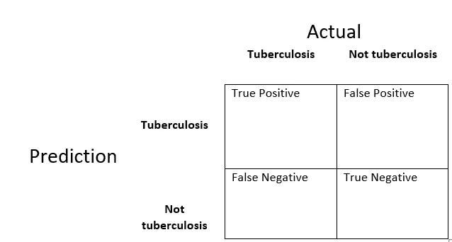
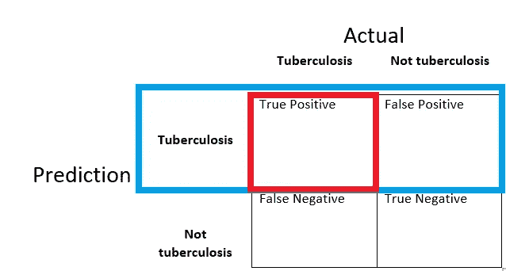
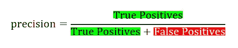
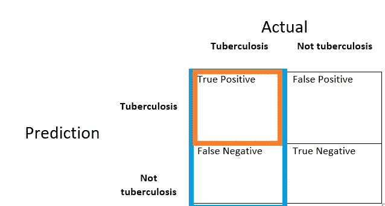
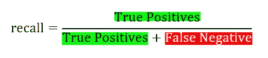
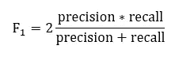

# 精确度和召回率

> 原文：<https://towardsdatascience.com/precision-and-recall-1af0a478fc7e?source=collection_archive---------20----------------------->

Photo by [Hush Naidoo](https://unsplash.com/@hush52?utm_source=medium&utm_medium=referral) on [Unsplash](https://unsplash.com?utm_source=medium&utm_medium=referral)

假设我想建立一个系统来判断一个人是否患有肺结核。我们收集了包括 50，000 幅图像的数据集。这些图像中有 49.950 个是反面例子，其余的是正面例子。

在我们的数据集中，只有 50 人患有肺结核，而我们有 50，000 张图像。(50/50.000)** 100*= 0.1*%*都是肺结核。我们称之为**不平衡数据集**。即使没有构建深度学习算法，通过一个简单的语句，也可以达到大约%99 的准确率。也就是说，你希望你的算法预测某人是结核病，而我们不知道我们的算法是否能正确预测某人是否是结核病。我们只知道准确性，仅此而已！在这种情况下，您可以使用精度和召回评估指标。别担心，我也会提到 F1 的分数。

# 深入研究指标之前的一些关键词

正的；
实际:肺结核|预测:肺结核

**T**rue**N**negative；
实际:非肺结核|预测:非肺结核

阳性:实际:非结核病，预测:非结核病

阴性:实际:不是肺结核，预测:不是肺结核

Confusion Matrix

# 精确

我们预测的肺结核患者中有多少是真正的肺结核？让我们看看混淆矩阵，看看我们的算法在哪里说某人是结核病(蓝色矩形)，什么是实际的(红色矩形)。

Precision

我们可以像上面这样写下来。

# 回忆

我们正确预测了多少肺结核患者？让我们看看混淆矩阵，看看我们的算法在哪里正确地检测到患有结核病的人(橙色矩形)和所有实际患有结核病的人(蓝色矩形)。

Recall

# F1 分数

要说某人是不是肺结核，我们要确保我们的算法做得非常好。判断算法是否有效的一个方法是，我们可以看看精度和召回率。在精确度和召回率之间有一个权衡。

你有 5 种算法，每一种都有不同精度和召回率。我们如何判断哪种算法更好？在这种情况下，F1 分数开始起作用。所以我们可以用 F1 的分数来决定，是哪个算法在做。

F1 score

感谢您的阅读！我希望你喜欢它。请关注即将推出的 Python 和深度学习部分。别忘了关注我的 [GitHub](https://github.com/halilibrahim95/) 。