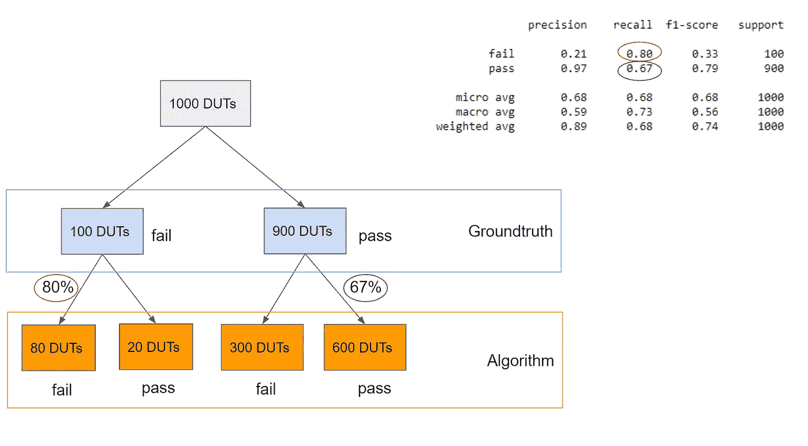

# 制造业中的精确度和召回率:案例研究

> 原文：<https://towardsdatascience.com/precision-and-recall-in-manufacturing-a-case-study-4cbb4c352bcd?source=collection_archive---------19----------------------->


[A Fully Automated Assembly Line](https://www.freepik.com/free-vector/factory-robotized-production-line-cartoon_4393617.htm)

任何即将开始机器学习项目的组织都会很快遇到定义适当的评估指标的问题。不幸的是(或者幸运的是，取决于你的观点)，有大量的度量标准；从常见的准确度、精确度、召回率、f1 分数到不太为人所知的马修斯相关系数。

> 选择正确的评估指标与选择正确的算法同样重要。

我参加过太多会议，在这些会议上，这种度量标准成为每个人困惑的来源。在本文中，我想讨论其中的两个:精确度和召回率，使用制造业的一个案例研究。

# **自动测试设备**

除非你在制造业工作过，否则你很可能不熟悉[自动测试设备](https://en.wikipedia.org/wiki/Automatichttps://en.wikipedia.org/wiki/Automatic_test_equipment_test_equipment)。但即便如此，你也可能间接受益于它们。不相信我？如果你正在电子设备上阅读这篇文章，那就是了；该设备很可能已经在工厂中由这样的设备进行了自动测试，如下图所示。这台机器确保你的设备可以安全使用。


A sample circuit board tester machine

然而在现实中，并不是工厂生产线上的所有测试都是自动完成的。案例研究是这样的:假设我们正在开始一个新的概念验证实验，来自动化生产线上的一个测试系统。这种新的自动测试设备的工作是检查产品，通常被称为被测设备(DUT)，并决定它是通过(质量良好)还是失败(有缺陷)。在这种情况下，我们假设自动测试设备已经装载了某种算法。

# **算法要求**

让我们假设我们的算法有以下要求。

1.  让不良 dut 进入下一个生产线的成本很高，例如，我们不能容忍逃亡者。我们希望避免任何受伤的 DUT 成为下游的退货授权。*约束:最小化风险。*
2.  尽管如此，我们也不希望算法在每个 DUT 都失败。这是因为任何失败的 DUT 通常将由人类技术人员手动重新检查。为了使算法成功，它必须减少人工检查的次数。*目标:储蓄最大化。*

因此，我们收集了 1000 个样本 dut(900 个好的，100 个坏的)。然后，我们用设备的算法对所有 1000 个 dut 进行分类。为了衡量后者的性能，我们使用 python scikit-learn 的[分类报告](https://scikit-learn.org/stable/modules/generated/sklearn.metrics.classification_report.html)。

```
**from** **sklearn.metrics** **import** classification_report# 'labels' is an array of 1000 groundtruth labels
# 'preds' is an array of 1000 outputs from the algorithm  
print(classification_report(labels, preds, target_names=["fail", "pass"]))
```


Sample Classification Report from Scikit-Learn

那么，我们该如何解读这份报告呢？要记住的关键是，召回率和精确度都衡量**条件精确度。**它们的区别在于衡量绩效的条件。这种说法现在可能没有意义，但希望在阅读完本文的其余部分后，您可以再次重温这一点。

# 回忆:以基础事实标签为条件

请记住，在实验的最开始，我们选择了 1000 个 dut，其中 900 个是好的(通过)，100 个是差的(失败)。我们可以计算每个标签的召回，例如一次**召回合格的**和一次**召回不合格的**。

**召回通过**回答了这个问题:在我测试过的 900 个良好/通过 dut 中，有多少被算法准确分类？在我们的报告示例中，我们看到 pass 的召回率是 0.67(或 67%)。这意味着 900 个通过测试的 dut 中有 67%也被正确分类为通过。



Visualizing Recall with a Tree

同样的逻辑可以通过遍历上面的决策树来解释。在根部，我们有一个装有 1000 个 dut 的盒子。然后，盒子被分成 2 个子节点(一个盒子用于 100 个坏的/失败的 dut，另一个盒子用于 900 个通过的 dut)。这种分裂对应于地面真相标签。我们可以进一步将 900 个通过的 dut 分成两个框，一个框用于算法标记为失败的 dut(300 个 dut)，另一个框用于被认为通过的 dut(600 个 dut)。我们看到，对于通过测试的 dut 子集，该算法的精确度仅为 600 / 900 ~= 0.67 或 67%。

**召回失败**查看树的另一边，回答这个问题:在 100 个失败的 dut 中，算法设法捕获了多少个？在这种情况下，只有 80 / 100 = 0.8 或其中的 80%被正确分类。

我们可以使用召回来量化我们在多大程度上满足了前面列出的两个产品要求。

1.  最小化逃脱者的风险相当于**最大化失败召回**。
2.  最大化节省等同于**最大化通过**的召回。

# **精度**:以算法标签为条件

现在假设我们已经在生产中部署了该算法。最有可能的是，我们的客户( [OEM](https://en.wikipedia.org/wiki/Original_equipment_manufacturer) / [CM](https://en.wikipedia.org/wiki/Contract_manufacturer) )会开始询问他们是否可以信任这个新系统。精确可以用来回答这样的问题。


Visualizing Precision with Recall

**通过精度**回答了这个问题:如果算法通过了 DUT，我们能在多大程度上信任这个决定？换句话说，从常客的角度来看，如果算法通过了 620 个 dut，其中有多少是真正好的？在我们的例子中，600/620 ~= 0.97 或 97%的时间判断是正确的。

同样，我们可以通过遍历树得到相同的数字。唯一的区别是，我们根据算法的判断而不是地面真实标签来分割根节点(1000 个 dut)。

通过使用相同的方法，我们得到了失败的**精度为 80 / 380 ~= 21%。这意味着，当算法说 DUT 是坏的，只有 21%的时间是正确的。**

这告诉我们，这种算法在识别好的 dut(通过)方面是有用的，但在识别坏的 dut(失败)方面不是有用的。

# **结论**

总之，我们需要在以下方面改进算法:

1.  改进**召回故障**以防止逃逸
2.  提高对通行证的**召回，以增加成本节约，从而缩短投资回收期(如果我们要向客户销售该产品，我们最好确保投资回报的计算是合理的)。**
3.  保持/提高**通过**的精度，这样我们可以确保模型在通过 DUT 时非常自信

我们关于精度和召回率的讨论到此结束。请记住，这 4 个数字不是独立的，即增加一个数字会减少其他数字(根据贝叶斯法则，查看附录以了解精确度与回忆的关系)。因此，简单地偏置算法的决策边界是行不通的。人们可以尝试摆弄算法的超参数，或者尝试一种完全不同的架构。这最好留给另一个讨论话题。

因此，我希望这个小案例研究能让我们从制造分析的角度更好地了解每个指标所传达的信息。

# 附录:用贝叶斯法则连接精确度和召回率

用条件概率定义召回率和精确度


应用贝叶斯规则找出特定类别(失败)的召回率和精确度之间的关系


替换案例研究中的值来证明等号。

