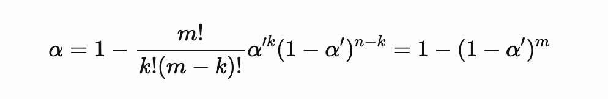
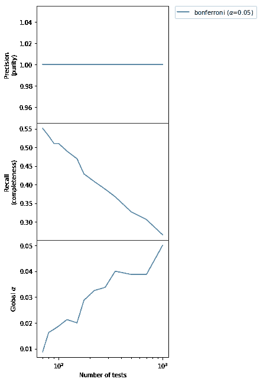
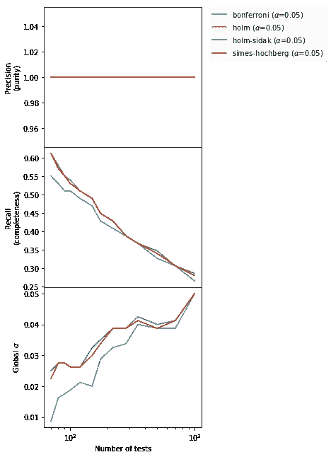
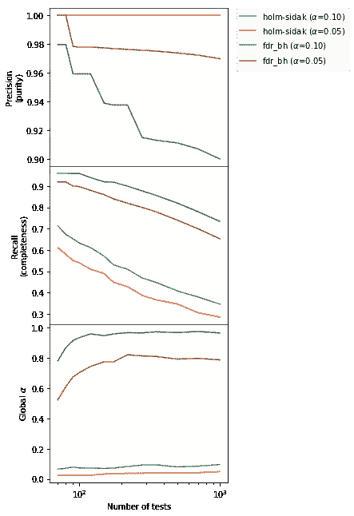
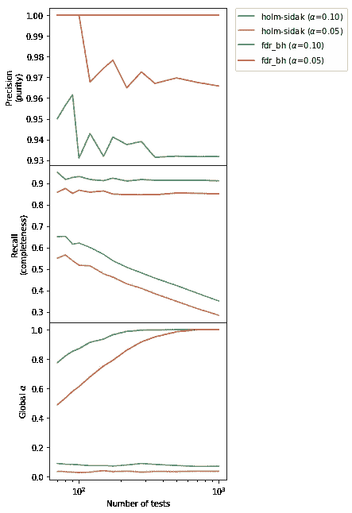

# 精确度和召回率的权衡和多重假设检验

> 原文：<https://towardsdatascience.com/precision-and-recall-trade-off-and-multiple-hypothesis-testing-family-wise-error-rate-vs-false-71a85057ca2b?source=collection_archive---------13----------------------->

## [现实世界中的数据科学](https://medium.com/towards-data-science/data-science-in-the-real-world/home)

## 家族错误率(FWE)与错误发现率(FDR)

在我之前作为天体物理学家的工作中，我致力于探测释放出惊人能量的大恒星 (GRBs)的[爆炸。我们的自动分析管道到处搜寻伽玛暴，因为无法预测何时何地会发生这样的爆炸。这提出了一个重要的挑战，与我们检测过程的统计性质有关:多重假设检验。](https://en.wikipedia.org/wiki/Gamma-ray_burst)


**Left**: a map of the sky in [Gamma-Rays](https://en.wikipedia.org/wiki/Gamma_ray) showing the position of the stellar explosions (GRBs) detected by the [Fermi Space Telescope](https://fermi.gsfc.nasa.gov/). The map is in [Galactic coordinates](https://en.wikipedia.org/wiki/Galactic_coordinate_system), and the bright stripe going across the map from left to right corresponds to the cosmic dust contained in the [Galactic plane](https://en.wikipedia.org/wiki/Galactic_plane) of our Milky Way galaxy and glowing in gamma-rays. **Right**: an animation of our current picture of how a GRB might look like if seen up close. **Credits**: NASA (reproduced according to [NASA Media Usage guidelines](https://www.nasa.gov/multimedia/guidelines/index.html) from [https://nasa.tumblr.com/post/176492220069/gamma-ray-bursts-black-hole-birth-announcements](https://nasa.tumblr.com/post/176492220069/gamma-ray-bursts-black-hole-birth-announcements)).

在我目前作为数据科学家的工作中也可以发现同样的挑战，例如在多个数据集中搜索异常或执行许多 A/B 测试时。

让我们从基础开始，说明多重测试意味着什么。

> 注意:这篇文章在我的 [GitHub 库](https://github.com/giacomov/giacomov.github.io/tree/master/notebooks)中作为一个可运行的 Jupyter 笔记本提供。我在整篇文章中使用的函数和类可以在文章结尾的代码单元中找到。

在这篇文章中，我假设大家熟悉一些概念，特别是[统计检验、零假设与替代假设、p 值、I 型错误和 II 型错误](https://en.wikipedia.org/wiki/Statistical_hypothesis_testing)。

粗略地说，统计检验能够拒绝或不拒绝具有给定的 I 型错误概率α(假阳性的概率)和 II 型错误概率β(假阴性的概率)的零假设。

# 我们的玩具问题

让我们考虑确定两个总体是否具有相同平均值的问题。零假设是平均值是相同的，另一个假设是平均值不相同。

请注意，您可以用任何其他可以通过统计测试回答的问题来代替这个问题，这里的所有讨论仍然成立(但是当然您需要重新编写代码)。

# 简单的例子:一个测试

最适合手头问题的测试是[学生的 T-test](http://195.134.76.37/applets/AppletTtest/Appl_Ttest2.html) 。让我们编写一个计算 p 值的函数和一个根据 p 值决定是否拒绝空值的函数:

```
# Let's write so that w1 and w2 can be lists of n
# datasets, from 1 to as much as needed

**def** apply_ttest(w1, w2):

    ts, pvalues = scipy.stats.ttest_ind(w1, w2, axis=1)

    # np.squeeze is necessary so we can use this
    # function both for single and for multiple tests

    **return** np.squeeze(pvalues)

**def** null_hyp_status(pvalue, alpha):

    # We write it using np.all so we can use the same function
    # for both single and multiple tests

    **return** np.all(pvalue > alpha)
```

我们现在生成一个合成数据集，将零假设设置为真，然后进行测试。我们将使用类型 I 错误概率α=0.05:

```
# Let's get a dataset with 1 group and
# the null hypothesis is true

w1, w2, ground_truth = generate_dataset(n_datasets=1, 
                             n_null_true=1)
# Let's now apply the test
alpha = 0.05
pvalue = apply_ttest(w1, w2)

**if** null_hyp_status(pvalue, alpha) **is** True:

    **print**("We do not reject the null hyp.")

**else**:

    **print**("We reject the null hyp.")

> We do **not** reject the null hyp.
```

测试如预期的那样工作，没有拒绝零假设(我们知道这是真的)。让我们验证测试的性能是名义上的，也就是说，通过重复相同实验的大量独立实现，我们偶然拒绝了名义 I 型错误概率为α的零假设:

```
# Let's perform 5000 independent simulations
type_I_error_p = measure_rejection_prob(5000, 
                                        apply_ttest, 
                                        null_hyp_status,
                                        alpha, 
                                        n_datasets=1,
                                        n_null_true=1)

**print**("\nMeasured chance probability of rejecting the "
      "null: %.3f (should be %.3f)" % (type_I_error_p, alpha))

> 5000 out of 5000 completed (fraction of rejections so far: 0.05)
> Measured chance probability of rejecting the null: 0.05 (should be 0.050)
```

好了，果然有效。当然，如果你运行它，你可能会得到一个稍微不同的值，因为生成过程是随机的，但是它应该接近 0.05。

# 多重测试

现在让我们假设我们有 *m* 对群体，我们想要找出是否一对或多对群体之间有显著差异。

这里的零假设是“在所有对中，两个群体具有相同的平均值”，另一个是“至少有一个*对中两个群体的平均值不同。”*

我们能不能只对每一对分别进行测试，看看是否至少有一对被拒绝？(剧透:答案是否定的！还有，我们忽略一个事实，就是还有其他针对这种情况设计的测试)。让我们看看:

```
# Generate m=50 pairs of populations, all with the same
# average between the populations (the null hypothesis is true)
w1, w2, _ = generate_dataset(n_datasets=50, n_null_true=50)
pvalues = apply_ttest(w1, w2)

**if** null_hyp_status(pvalues, alpha) **is** True:

    **print**("We do not reject the null hyp.")

**else**:

    **print**("We reject the null hyp.")

> We reject the null hyp.
```

起初，这个结果可能会令人惊讶。毕竟我们知道零假设是真的！

然而，如果你还记得类型 I 错误概率的定义，通过固定α=0.05，我们设置了测试，这样它将错误地以 5%的概率拒绝空值。因此，通过重复测试 50 次(每对一次)，我们每次都有 5%的机会出现 I 型错误。因此，*至少有一次*拒绝的概率由[二项式分布](https://en.wikipedia.org/wiki/Binomial_distribution)给出:

```
# probability of having one or more rejections in 50 trials
m = 50
binomial_distr = scipy.stats.binom(m, alpha)

# NOTE: the .sf method gives the probability of obtaining > 1,
# while we need >= 1, so we add the pmf at 1
prob = binomial_distr.sf(1) + binomial_distr.pmf(1)

**print**("The prob. of >= 1 false positives in %i "
      "trials is %.3f" % (m, prob))

> The prob. of >= 1 false positives **in** 50 trials **is** 0.923
```

在我们的设置中有超过 90%的机会得到至少一个假阳性。在同一个问题中多次测试一个假设被称为“多重测试”，需要更多的思考。

# 邦费罗尼/西达克校正

Bonferroni (1936)对这种情况引入了一个简单的修正。处方是用修正的 I 型错误概率代替复合试验中的每一个独立试验的α，该概率由西达克公式α′=1−(1−α)^(1/*m*给出(对于大的*m*通常近似为α′=α/m)

> 有时，在文献中，校正α′=α/m 被称为“邦费罗尼校正”，而校正α′=1−(1−α)^(1/m 被称为“西达克校正”在这里，我们将使用后一种表述方式，但是可以互换使用这个名称，因为在所有实际应用中，这种差异非常小

西达克公式的理由可以很容易地推导出来，它是我们刚刚在二项分布中发现的观察的直接结果。在概率为α’的 *m* 次试验中获得 1 次或多次成功的概率α由 1b(*m*，*p*=α’，k=0)给出，其中 B( *m* ，*p*=α’，k=0)是由二项式分布给出的获得 0 次成功的概率。

我们有:



在这里，我们刚刚替换了 k = 0。通过求解α’,我们获得了需要在每个 *m* 测试中使用的 I 型误差概率，以获得α的全局 I 型误差概率，这就是 Bonferroni/Sidak 校正。

> 注意:我们假设独立测试。如果不同的测试之间存在相关性，这里介绍的方法可能适用，也可能不适用，您需要仔细查看相关的论文。

让我们看看这是否能解决我们的问题。我们只需要改变用于决定是否拒绝空值的标准。不需要改变 p 值的计算:

```
# Test if any of the pvalues is lower than alpha',
# if the answer yes, the null hyp. is deemed False

**def** null_hyp_status_bonferroni(pvalues, alpha):

    # Number of tests
    m = pvalues.shape[0]

    # Bonferroni/Sidak correction
    alpha_prime = 1 - (1-alpha)**(1.0/m)

    # Test whether *all* null hypothesis in the subtests are
    # true or not
    **return** np.all(pvalues > alpha_prime)

w1, w2, _ = generate_dataset(n_datasets=50, n_null_true=50)
pvalues = apply_ttest(w1, w2)

**if** null_hyp_status_bonferroni(pvalues, alpha) **is** True:

    **print**("We do not reject the null hyp.")

**else**:

    **print**("We reject the null hyp.")

> We do **not** reject the null hyp.
```

看起来好多了。为了确保这一点，让我们生成许多合成数据集，看看我们的 Bonferroni 校正测试是否提供了名义 I 型错误概率α=0.05。

```
# Let's do again 5000 realization of datasets with 50
# pairs where the null is true for all pairs,
# and study the performance of the new procedure

type_I_error_p = measure_rejection_prob(5000, 
                                        apply_ttest, 
                                        null_hyp_status_bonferroni,
                                        alpha, 
                                        n_datasets=50,
                                        n_null_true=50)

**print**("\nMeasured chance probability of rejecting the "
      "null: %.3f (should be %.3f)" % (type_I_error_p, alpha))

> 5000 out of 5000 completed (fraction of rejections so far: 0.05)
> Measured chance probability of rejecting the null: 0.047 (should be 0.050)
```

成功了。第一类错误概率确实非常接近名义上的 5%。

# 类 Bonferroni 修正的问题:全局与局部假说

到目前为止，我们一直在处理这个问题的“全局”零假设“是否存在两个群体的平均值不同的配对？”无效假设是*所有*对在群体之间具有相同的平均值，或者是*至少有一个*不具有相同的平均值。

然而，我们经常对另一个问题感兴趣:“找出平均值不同的所有配对*”。或者，“找到*所有*恒星爆炸”，就像我的天体物理学问题一样。在第二种情况下，每一对都有自己的无效假设和替代假设，我们感兴趣的是有多少无效假设被拒绝。*

*很明显，Bonferroni 校正将仍然保证偶然拒绝一个或多个零值的*全局*αI 型误差概率，但是它为了这样做而惩罚所有测试，因为每个测试的α由 Sidak 公式和 1−(1−α)^(1/ *m* ) < α给定，用于 *m* > 1。*

*此外，随着 *m* 的增长，全局无效假设仍然以相同的 I 型错误概率进行测试，但是 *m* 无效假设中的每一个都得到越来越严格的测试，并且随着 *m* →∞我们有α′→0，因此很难找到与无效假设的任何偏差。换句话说，“看的越多，发现的越少。”*

*让我们通过考虑一个单一测试的类型 II 错误来说明这一点，即*而不是*在我们应该拒绝空值时拒绝空值的概率。首先，让我们生成并测试一个空值为假的对:*

```
*# Let's get a dataset with 1 group and
# the null hypothesis is False

w1, w2, ground_truth = generate_dataset(n_datasets=1, n_null_true=0)

# Let's now apply the test
alpha = 0.05
pvalue = apply_ttest(w1, w2)

**if** null_hyp_status(pvalue, alpha) **is** True:

    **print**("We do not reject the null hyp.")

**else**:

    **print**("We reject the null hyp.")

> We reject the null hyp.*
```

*我们已经正确地拒绝了无效假设。现在让我们看看，在多次重复相同的实验后，我们有多少次未能拒绝空值，即使它是假的(类型 II 错误概率):*

```
*type_II_error_p = 1 - measure_rejection_prob(5000, 
                                             apply_ttest, 
                                             null_hyp_status,
                                             alpha, 
                                             n_datasets=1,
                                             n_null_true=0)
**print**("\nMeasured chance probability of *not* rejecting the "
      "null: %.3f" % (type_II_error_p))

> 5000 out of 5000 completed (fraction of rejections so far: 0.94)
> Measured chance probability of ***not*** rejecting the null: 0.062*
```

*因此，对于一个测试，我们有大约 6% (β=0.06)的概率*而不是*拒绝空值，即使它是假的(当然，β取决于α，以及效果的大小——在这种情况下，是两个平均值之间的差异)。*

*现在，让我们看看如果对 50 对进行 Bonferroni 校正测试会发生什么，其中只有一对的零假设为假:*

```
*type_II_error_p = 1 - measure_rejection_prob(5000, 
                                             apply_ttest, 
                                             null_hyp_status_bonferroni,
                                             alpha, 
                                             n_datasets=50,
                                             n_null_true=49)

**print**("\nMeasured chance probability of *not* rejecting the "
      "null: %.3f" % (type_II_error_p))

> 5000 out of 5000 completed (fraction of rejections so far: 0.59)
> Measured chance probability of ***not*** rejecting the null: 0.410*
```

*现在我们有 41%的概率*没有*在我们应该拒绝 null 的时候拒绝它。很明显，我们已经失去了很多敏感性，因为一对样本中的差异被 50 对样本所掩盖。*

*从某种程度上来说，这是不可避免的，也是我们不知道具体去哪里寻找所付出的代价。*

*然而，当试图测试所有的*局部*无效假设而不是*全局*无效假设时，事情会很快失控。为了得到一个概念，让我们制作几个越来越大的数据集，每个数据集有 50 个假零假设，并看看类型 II 误差如何作为配对/测试数量 *m* 的函数而变化:*

> *注意:从现在开始，我们将重复使用[精度和](https://en.wikipedia.org/wiki/Precision_and_recall)召回的概念。前者描述了所有检测中正确“检测”(即拒绝零假设)的比例，即描述了我们程序的输出样品的纯度。后者描述了空 hyp 的分数。我们已经拒绝了我们应该拒绝的(例如，我们输出样本的完整性)。*

```
*# Test the Bonferroni method with alpha=0.05
methods = [('bonferroni', 0.05)]

# Number of pairs per dataset
ms = np.array([70, 80, 90, 100, 120, 150, 175, 220, 280, 350, 500, 700, 1000])
**print**("Generating %s datasets" % len(ms))

# Pairs with a false null hypothesis for each dataset
n_false = 50

(selections, 
 false_positives, 
 false_negatives, 
 global_typeI) = characterize_methods(apply_ttest, 
                                      methods, 
                                      ms, 
                                      [n_false] * ms.shape[0], 
                                      niter=800,
                                      plot=True)

> Generating 13 datasets
> Method bonferroni **with** alpha 0.05.............completed*
```

**

*我们可以看到，输出样本的纯度恒定为 1.0，但完整性很小，并且随着测试次数的增加，其下降速度也很快。换句话说，随着 *m* 的增加，我们检测到的异常越来越少，但是我们检测到的异常总是正确的。检测*任何*假阳性的 I 类错误概率总是低于声明的α水平，尽管对于小的 *m* 来说非常保守。我们能做得更好吗？*

*答案是，幸运的是，是的！*

# *霍尔姆-西达克方法*

*对 vanilla Bonferroni/Sidak 方法提出了几个修正。你可以在这里找到他们描述的。不去探究它们中每一个的细节(参见维基百科页面)，让我们来测试它们:*

```
*# Test different Bonferroni-like methods with alpha=0.05

methods = [('bonferroni', 0.05), 
           ('holm', 0.05), 
           ('holm-sidak', 0.05),
           ('simes-hochberg', 0.05)]

# Number of pairs per dataset
ms = np.array([70, 80, 90, 100, 120, 150, 175, 220, 280, 350, 500, 700, 1000])
**print**("Generating %s datasets" % len(ms))

# Pairs with a false null hypothesis for each dataset
n_false = 50
(selections, 
 false_positives, 
 false_negatives, 
 global_typeI) = characterize_methods(apply_ttest, 
                                      methods, 
                                      ms, 
                                      [n_false] * ms.shape[0], 
                                      niter=800,
                                      plot=True)

> Generating 13 datasets
> Method bonferroni **with** alpha 0.05.............completed
> Method holm **with** alpha 0.05.............completed
> Method holm-sidak **with** alpha 0.05.............completed
> Method simes-hochberg **with** alpha 0.05.............completed*
```

**

*新方法保持了 vanilla Bonferroni 的绝对纯度和低于或等于标称值的 I 型误差，但稍微提高了完整性。但是，我们可以做得比这好得多！让我们看看怎么做。*

# *错误发现率与家庭错误率*

*到目前为止，我们对多重假设检验问题的解决方案一直试图将家族错误率(FWER)控制在可控范围内，即在整个 *m* 检验集中出现的 I 类错误率(在上面的图中我们称之为全局α)。*

*然而，在我们期望几个“检测”(即几个错误的零假设)的情况下，我们可以稍微牺牲我们对完全纯度的渴望，并且决定我们可以接受受控数量的假阳性，如果这有助于提高完整性的话。对于数据科学从业者来说，这是一个非常熟悉的想法:我们可以用一些精确度来换取更多的召回。换句话说，我们可以接受在检测的输出样本中有一定数量的“冒名顶替者”。这是罗斯福背后的理念。*

*[Benjamini 和 Holdberg (1995)](https://www.jstor.org/stable/2346101?seq=1#page_scan_tab_contents) 提出了一种方法。这里，α不再代表 I 型误差概率，而是控制输出样本的纯度(即直接影响精度，而不是像我们以前的方法那样影响全局α)。(预期)精度保证为>1α。*

*如前所述，我们参考该文件了解详情。这里我想说明一下与我们以前的方法的不同之处。让我们使用和以前一样的程序。为了简单起见，根据前面的图(“holm-sidak”)，让我们在类似 Bonferroni 的方法中只考虑我们问题的最佳方法:*

```
*# Let's use two values of alpha per method to illustrate
# what they affect
methods = [('holm-sidak', 0.1), 
           ('holm-sidak', 0.05), 
           ('fdr_bh', 0.1), 
           ('fdr_bh', 0.05)]

# Number of tests
ms = np.array([70, 80, 90, 100, 120, 150, 175, 220, 280, 350, 500, 700, 1000])

# False null hypothesis that we are going to generate

n_false = 50
(selections, 
 false_positives, 
 false_negatives, 
 global_typeI) = characterize_methods(apply_ttest, 
                                      methods, 
                                      ms, 
                                      [n_false] * ms.shape[0], 
                                      niter=800,
                                      plot=True)

> Method holm-sidak **with** alpha 0.10.............completed
> Method holm-sidak **with** alpha 0.05.............completed
> Method fdr_bh **with** alpha 0.10.............completed
> Method fdr_bh **with** alpha 0.05.............completed*
```

**

*我们可以立即看到，BH 方法通过牺牲一定数量的精确度(“纯度”)来提供更大的召回(“完整性”，第二个面板)。事实上，正如承诺的那样，精度大于 1α。在 BH 方法中，从α=0.01 到α=0.05 增加了预期的纯度，但降低了完整性。此外，BH 方法的全局α(下图)很大，接近 1，这意味着在任何实验中，获得一个或多个假阳性的概率都很高。这是增加完整性的代价，我们几乎获得了 2 倍的收益，特别是对于大量甚至非常大量的测试 *m* 关于类似 Bonferroni 的方法。*

*现在，我们了解了 FWER 控制方法和 FDR 控制方法之间的关键区别:前者对 FWER 设置了上限α(“全局”α，下图)，而后者对精度设置了下限 1α(“纯度”，上图)。*

*到目前为止，我们已经研究了假零假设数不变而检验数增加的情况。当错误假设的数量随着测试次数的增加而增加时会发生什么？例如，当我们将搜索扩展到参数空间的先前未探索的部分时，当我们期望错误的零假设/异常(或恒星爆炸，如在我们的天文学例子中)具有与先前相同的密度时，这种情况就会发生。*

```
*# This time we have 30% of false hypothesis for each m
(selections, 
 false_positives, 
 false_negatives, 
 global_typeI) = characterize_methods(apply_ttest, 
                                      methods, 
                                      ms, 
                                      np.ceil(0.3 * ms).astype(int), 
                                      niter=800)

> Method holm-sidak **with** alpha 0.10.............completed
> Method holm-sidak **with** alpha 0.05.............completed
> Method fdr_bh **with** alpha 0.10.............completed
> Method fdr_bh **with** alpha 0.05.............completed*
```

**

*结果与之前相似，但是现在 BH 方法的完整性(回忆)基本上是恒定的(中间的图)，独立于 *m* 。*

# *结论*

*我们已经用多重假设检验和两种非常不同的处理方法说明了这个问题。*

*   *控制 FWER 的方法(如 Bonferroni 校正)以牺牲召回率(“完整性”和灵敏度)为代价最大化了精确度(“纯度”)。当预期的假零假设、异常或检测的数量很少，并且为假阳性付出的代价很高时，它们是合适的，因此纯度比完整性更重要。例如，当第一次寻找新效应/新物理时，它们是非常合适的，因为假零假设的预期数量最多是一个，而全局零假设真的很重要。在这种情况下，即使是一个错误的主张，当然也是非常重要的。然而，使用 FWER 会引入显著的 [Malmquist 偏差](https://en.wikipedia.org/wiki/Malmquist_bias)，在这种情况下只能看到非常强的影响。*
*   *控制 FDR 的方法(如 Benjamini-hoch Berg)通过允许受控数量的假阳性混入(即以受控的方式牺牲精度)而相对于 FWER 控制方法显著提高了完整性(召回)。当我们预期会有几个错误的零假设、异常或检测，并且我们可以承受一些错误的声明时，它们是合适的。*

*注:在这个说明性的例子中，我们对所有错误的零假设使用了一个单一的效应大小。这种情况几乎从未出现过，因此效应大小的分布(在我们的 t 检验示例中，两个群体的平均值之间的差异大小，或者在我们的天体物理学示例中，恒星爆炸的亮度)将明显影响异常/探测的数量。然而，这里提出的一般思想仍然成立。使用 FDR 代替 FWER 允许检测更多和更小的效应大小(增加灵敏度/召回),代价是一些假阳性。*

# *密码*

```
***import** numpy **as** np
**import** pandas **as** pd
**import** scipy.stats
**import** matplotlib.pyplot **as** plt
**import** sys
**import** multiprocessing
**import** itertools
**import** functools
**from** statsmodels.stats.multitest **import** multipletests
#Let's set the random seed so the results of the notebook
# are always the same at every run
np.random.seed(0)
%matplotlib inline
**def** generate_dataset(n_datasets, n_null_true, n_samples=100, seed=0):

    # This is to make the results predictable
    np.random.seed(seed)

    n_null_false = n_datasets - n_null_true

    w1 = []
    w2 = []
    null_status = []

    **for** i **in** range(n_null_true):

        wn_1 = np.random.normal(loc=90, scale=10, size=n_samples)
        wn_2 = np.random.normal(loc=90, scale=10, size=n_samples)

        w1.append(wn_1)
        w2.append(wn_2)

        null_status.append(True)

    **for** i **in** range(n_null_false):

        wn_1 = np.random.normal(loc=95, scale=10, size=n_samples)
        wn_2 = np.random.normal(loc=90, scale=10, size=n_samples)

        w1.append(wn_1)
        w2.append(wn_2)
        null_status.append(False)

    **return** w1, w2, np.array(null_status)

**def** worker_function(i, generate_dataset_kw, test, null_hyp_status):

    generate_dataset_kw['seed'] = (i+1) * 1000
    w1, w2, _ = generate_dataset(**generate_dataset_kw)
    pvalue = test(w1, w2)
    **return** null_hyp_status(pvalue, alpha) 

**def** measure_rejection_prob(n_iter, test, null_hyp_status, 
                           alpha, **generate_dataset_kw):       

    n_rejected = 0

    worker = functools.partial(worker_function, generate_dataset_kw=generate_dataset_kw,
                              test=test, null_hyp_status=null_hyp_status)

    pool = multiprocessing.Pool()

    **try**:

        **for** i, res **in** enumerate(pool.imap(worker, range(n_iter), chunksize=100)):
            **if** **not** res:
                n_rejected += 1
            **if** (i+1) % 100 == 0:
                sys.stderr.write("\r%i out of %i completed (fraction of "
                                 "rejections so far: %.2f)" % (i+1, n_iter, 
                                                               n_rejected / float(i+1)))
        sys.stderr.write("\n")
        sys.stderr.flush()

    **except**:

        **raise**

    **finally**:

        pool.close()
        pool.join()

    **return** n_rejected / float(n_iter)

**def** worker_function2(i, generate_dataset_kw, test, method, alpha):

    generate_dataset_kw['seed'] = (i+1) * 1000
    w1, w2, null_hyp = generate_dataset(**generate_dataset_kw)
    pvalues = test(w1, w2)

    reject, _, _, _ = multipletests(pvalues, alpha, 
                                    method=method, 
                                    is_sorted=False, 
                                    returnsorted=False)

    # False positives: I rejected when I shouldn't have
    n_false_pos = np.sum((reject == True) & (null_hyp==True))

    # False negatives: I didn't reject when I should have
    n_false_neg = np.sum((reject == False) & (null_hyp==False))

    **return** np.sum(reject), n_false_pos, n_false_neg
**def** measure_detections(n_iter, test, method, 
                       alpha, **generate_dataset_kw):       

    n_false_pos = []
    n_false_neg = []
    n_selected = []

    worker = functools.partial(worker_function2, generate_dataset_kw=generate_dataset_kw,
                              test=test, method=method, alpha=alpha)

    pool = multiprocessing.Pool()

    **try**:
        **for** i, (s, fp, fn) **in** enumerate(pool.imap(worker, 
                                                  range(n_iter), 
                                                  chunksize=100)):

            n_selected.append(s)
            n_false_pos.append(fp)
            n_false_neg.append(fn)
    **except**:

        **raise**

    **finally**:

        pool.close()
        pool.join()

    global_typeI = np.sum(np.array(n_false_pos) > 0) / float(n_iter)

    **return** (np.average(n_selected), 
            np.average(n_false_pos), 
            np.average(n_false_neg), 
            global_typeI)
**def** characterize_methods(test, methods, ms, n_false, niter=800, plot=True):

    selections = {}
    false_positives = {}
    false_negatives = {}
    global_typeI = {}

    **for** method, alpha **in** methods:

        # Clear output
        sys.stderr.write("Method %s with alpha %.2f" % (method, alpha))
        s = np.zeros(len(ms), int)
        fp = np.zeros_like(s)
        fn = np.zeros_like(s)
        gtI = np.zeros(s.shape[0], float)
        **for** i, (m, nf) **in** enumerate(zip(ms, n_false)):
            s[i], fp[i], fn[i], gtI[i] = measure_detections(niter, 
                                                test, 
                                                method,
                                                alpha, 
                                                n_datasets=m,
                                                n_null_true=m - nf)
            sys.stderr.write(".")

        selections[(method, alpha)] = s
        false_positives[(method, alpha)] = fp
        false_negatives[(method, alpha)] = fn
        global_typeI[(method, alpha)] = gtI

        sys.stderr.write("completed\n")

    **if** plot:

        fig, subs = plt.subplots(3, 1, sharex=True, 
                             figsize=(4,10), 
                             gridspec_kw={'hspace': 0.0, 'top': 0.95})
        **for** key **in** methods:
            true_positives = selections[key] - false_positives[key]
            precision = true_positives.astype(float) / selections[key]
            recall = true_positives / (true_positives + false_negatives[key]).astype(float)

            label = r"%s ($\alpha$=%.2f)" % (key[0], key[1])

            _ = subs[0].plot(ms, precision, label=label)
            _ = subs[1].plot(ms, recall, label=label)
            _ = subs[2].plot(ms, global_typeI[key], label=label)

        subs[0].set_ylabel("Precision\n(purity)")
        subs[1].set_ylabel("Recall\n(completeness)")
        subs[2].set_ylabel(r"Global $\alpha$")
        subs[2].set_xlabel("Number of tests")
        subs[2].set_xscale("log")

        plt.axes(subs[0])
        plt.legend(bbox_to_anchor=(1.05, 1), loc=2, borderaxespad=0.)

    **return** selections, false_positives, false_negatives, global_typeI*
```