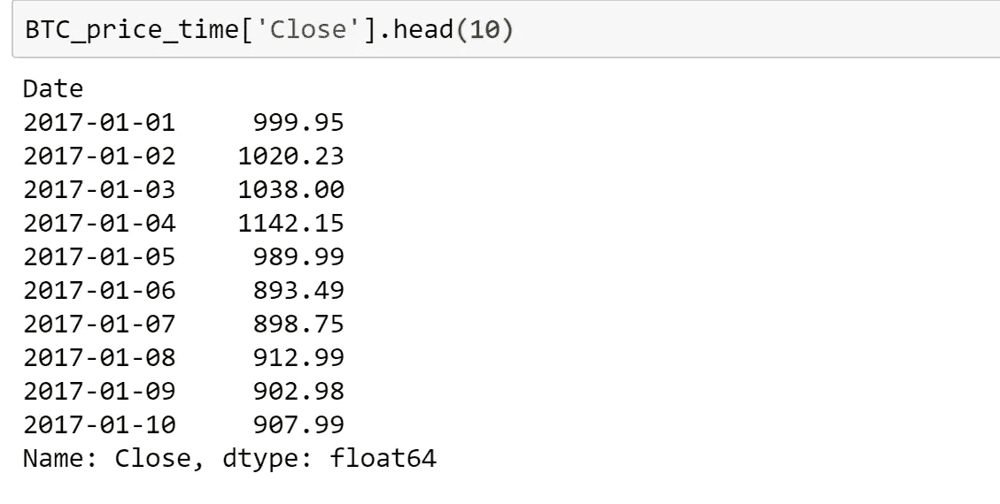
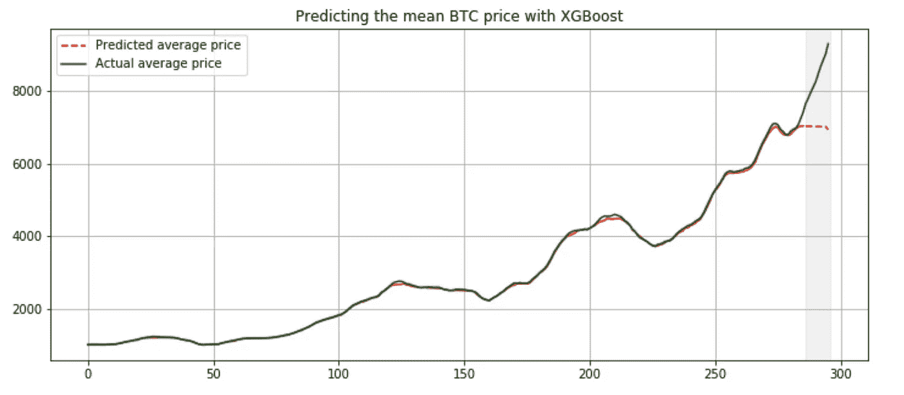

# 使用签名时间序列模型预测比特币价格

> 原文：<https://towardsdatascience.com/predict-bitcoin-prices-by-using-signature-time-series-modelling-cf3100a882cc?source=collection_archive---------13----------------------->


[Pixabay](https://pixabay.com/illustrations/bitcoin-blockchain-currency-3396302/)

## 操纵数据流的新方法

# **路径签名简介**

首先，我想简单介绍一下签名方法。根据维基百科，粗糙路径是平滑路径概念的概括，允许构建由经典不规则信号驱动的受控微分方程的鲁棒解理论，例如，维纳过程。这个理论是由特里·莱昂斯在 20 世纪 90 年代提出的。数学的目的是有效地描述一条平滑但可能高度振荡的多维路径 X。

签名是从路的幺半群(在级联下)到自由张量代数的群状元素的同态。它提供了路径 x 的分级总结。这里是签名变换的正式数学定义，来自[《机器学习中的签名方法入门》。](https://arxiv.org/abs/1603.03788)

为了一条路


如下定义路径的签名


在哪里


长话短说，签名是将路径转换成封装路径摘要的序列。

这些路径的分级总结或特征是粗略路径定义的核心；在本地，它们消除了查看路径的精细结构的需要。泰勒定理解释了任何光滑函数如何局部地表示为某些特殊函数(基于该点的单项式)的线性组合。


Taylor expansion of a function f(x,y)

坐标迭代积分(签名项)形成了更微妙的特征代数，可以以类似的方式描述流或路径；它们允许定义粗糙路径，并为路径上的连续函数形成自然的线性“基础”。


Expansion to signature

使用签名作为路径函数的基础有很多好处。首先，签名特征对于粗糙路径更鲁棒。第二，虽然路径的签名是无限长的序列，但我们可以使用它的截断版本作为基础来近似连续函数，而不会丢失太多信息。


An approximation of a function f(X) with level 1 truncated signature features

此外，签名功能是可扩展的。举例来说，如果我们想将未来原油价格建模为历史原油价格的函数。

1.  我们可以用过去的油价作为特征。我们使用的价格越多，关于其行为的信息就越多，模型就越精确，但计算成本也更高。也就是说，1000 个历史价格导致 1000 个特征，100 万个历史价格导致 100 万个特征。
2.  或者，我们可以从过去的油价构建一条路径，并使用该路径的截断签名作为特征。即使我们对路径使用更多的过去价格，特征的数量也是一样的。例如，假设 X 是 2 维的路径，X 的 2 级截断签名只包括 7 个元素。也就是说，使用 1，000 个过去的价格或 1，000，000 个过去的价格将给我们 7 个特征。这将有助于计算时间(如果我们考虑到计算路径签名所花费的时间)，并潜在地给我们关于数据的洞察力(一个签名特征可能是重要的)。然而，我们需要小心使用太低水平的截断，这可能导致拟合不足。


A level 2 truncated signature of a path X with dimension 2

如果你想了解更多关于签名背后的数学知识，我推荐你去阅读

*   [粗糙路径、签名和流上函数的建模](https://arxiv.org/abs/1405.4537)
*   [机器学习中的签名方法入门](https://arxiv.org/abs/1603.03788)

以下是签名功能的应用示例

*   [从金融数据流的签名中提取信息](https://arxiv.org/abs/1307.7244)
*   [用于在线字符识别的稀疏签名阵列](https://arxiv.org/pdf/1308.0371.pdf)
*   [签名方法在 CEQUEL 临床试验模式识别中的应用](https://arxiv.org/pdf/1606.02074.pdf)
*   [QuantStart —应用于量化金融的粗糙路径理论和签名](https://www.quantstart.com/articles/rough-path-theory-and-signatures-applied-to-quantitative-finance-part-1)
*   [使用签名支付的衍生品定价](https://arxiv.org/abs/1809.09466)

# **我们想在这里做什么**

最近，我们看到了加密货币交易的显著增长，其中最受欢迎的货币比特币在 2017 年底达到了近 20，000 美元/BTC 的峰值，而在 2018 年 11 月则暴跌至约 3000 美元/BTC。数字货币在金融市场上相当新，我们可以说它的行为几乎是不可预测的。知道了签名可以捕获路径的有意义的属性，并且可以用作线性基来近似路径的连续函数，作者想要探索当我们使用它来预测比特币价格时，这种有前途的方法会如何表现。我们将该结果与当前最先进的机器学习算法 XGBoost 算法进行比较。

我们将使用每日比特币兑换来自 https://www.cryptodatadownload.com/的价格数据。我们将使用美国最大的加密货币交易平台之一 Gemini 的数据。我们的目标是使用 30 天的窗口来预测未来 10 天的平均价格。对于签名方法，我们将使用 30 天价格的截断签名作为特征+ Lasso 线性回归，而对于 XGBoost，我们将使用 30 天价格作为特征。

# **数据预处理**

我们使用熊猫来探索数据集。


我们需要删除数据帧的第一行，反转数据帧并使用日期作为索引。


所以现在我们已经准备好处理数据帧了。让我们先画出收盘价来形象化价格。

```
#Plot to visualise data
import matplotlib.pyplot as pltax = BTC_price.plot(y= 'Close', figsize=(12,6), legend=True, grid=True, use_index=True)
plt.show()
```


我们可能会对几个有趣的时期感兴趣，2017 年 10 月的繁荣以及 2018 年 1 月和 2018 年 10 月的崩溃。首先，我们将使用 2017 年 1 月至 2017 年 11 月的数据，看看该模型是否可以预测繁荣期。

```
#select duration
initial_date = '2017-01-01'
finish_date = '2017-12-01'BTC_price_time = BTC_price[initial_date:finish_date]
```

# **从数据帧创建特征**

接下来，我们将为我们的机器学习算法构建特征。首先，我们将编写一个函数，该函数产生一个大小为 h 的历史价格窗口和下一个未来 f 价格的平均值。

我们将用长度为 10 的收盘价序列来测试我们的函数

```
BTC_price_time['Close'].head(10)
```



```
GetWindow(BTC_price_time.loc[:,'Close'].head(10), h_window = 5, f_window =2)
```

我们得到一个包含大小为 5 的滚动窗口的数据帧，如下所示。


```
GetNextMean(BTC_price_time.loc[:,'Close'].head(10), h_window = 5, f_window =2)
```

GetNextMean 为我们提供了一个数据帧，其中包含从第 6 个价格开始的 2 个连续价格的平均值。比如 896.12 = (893.49+898.75)/2。


除了价格窗口，我们还为特性添加了时间列。

# **标志性特征**

现在，让我们构建签名特征。如上所述，签名是连续路径的迭代积分形式，但我们只有离散的数据点。有多种方法可以将离散的数据点转换成连续的路径。举个例子，

*   分段线性插值
*   矩形线性插值

下面是从[一本关于机器学习中签名方法的初级读本中得到的每个转换的插图。](https://arxiv.org/abs/1603.03788)对于两个长度为 4 的一维序列，


然而，还有另一种有趣的变换，即超前-滞后变换，它将一维路径变换为二维路径。


这里，我们将在离散数据点上使用这种超前-滞后变换，并将该路径的特征用于我们的特征。

我们用一个序列(1，1)，(2，4)，(3，2)，(4，6)进行测试。


接下来，是时候计算路径的截断签名了！我们足够幸运，不用写函数来计算迭代积分。显然，有一个包 ESig 将为我们做(肮脏的)工作，尽管它仍处于开发的活跃阶段。

```
pip install esig
import esig.tosig as ts
```

下面是 ts.stream2sig(…)的文档。
stream 2 SIG(array(no _ of _ ticks x signal _ dimension)，signature_degree)读取一个 2 维 numpy 浮点数组“流空间中的数据”，并返回一个 numpy 向量，其中包含到给定 signature_degree 为止的向量系列的签名。

我们将使用这个函数来计算路径的签名(Time_lead，Price_lead，Price_lag)。

# 获取功能

现在，我们准备计算正常特征和签名特征。为简单起见，我们将只使用比特币的接近价格。以下代码所做的是获得带有时间列的正常窗口特征，获得预测目标，即未来价格的平均值，并计算签名特征。对于签名特征，我们使用 ESig 包来寻找路径的 2 级截断签名(time_lead，price_lead，price_lag)。

我们可以检查结果特征。

```
y.head()
```


```
pd.DataFrame(X_window).head()
```


```
pd.DataFrame(X_sig).head()
```


# 火车模型

我们将 X_sig，y 分成模型的训练集和测试集，我们将预测 10 个未来价格。

首先，我们将在具有签名特征的套索线性回归上训练我们的模型。我们使用时间序列分割测试交叉验证和 gridsearchCV 来调整超参数 alpha。

这是错误


时间序列预测不可或缺的一部分是将结果可视化。

```
PlotResult(y_train, y_test, y_train_predict, y_test_predict, test_len, 'Lasso + Signature features')
```


该模型可以预测未来将出现一次繁荣，其精确度在 15%左右。注意，这里我们只使用 2 级截断签名特征。从理论上讲，如果我们增加截断的级别，我们希望模型会更准确，因为我们有更多的信息

现在我们将尝试我们的 XGBoost 模型。我们还使用时间序列分割交叉验证和 GridsearchCV 来调整超参数。


我们观察到训练集的平均绝对误差非常低，这是过度拟合的标志，并且测试集的值与签名方法大致相同。让我们把图表形象化

```
PlotResult(y_train, y_test, y_train_predict, y_test_predict, test_len, 'XGBoost')
```



我们可以看到，该模型根本不能预测繁荣期，它猜测平均未来价格是稳定的。出现这种情况的一个可能原因是该模型以前没有经历过如此急剧的增长。

# 与他人进行一段时间的实验

我们将使用 2018 年 1 月至 2018 年 12 月的一段时间来测试该模型是否可以预测崩溃。我们测试了价格相当稳定的持续时间。

```
#select duration
initial_date = '2018-01-01'
finish_date = '2018-11-01'
```

以下是签名功能的结果。


我们收到了一个收敛警告，说模型不收敛，结果图形很奇怪。请注意，这里我们只使用截断的签名级别 2，它只有 12 个特征，因此它们可能无法捕获有关路径的重要信息。


我们用截断的签名级别 3 进行实验。


该模型在术语或误差方面表现较差，但是我们可以从图中看到，它具有比 2 级截断签名特征更真实的路径。


另一方面，这是 XGBoost 算法的结果。


该模型做得非常好，做出了误差高达 0.5%的预测。


现在，让我们挑战这些模型是否能够预测 2018 年 12 月的崩盘。

我们使用了 3 级截断签名功能，以下是结果。


与 XGBoost 模型相比


很明显，没有一个模型能提前预测到撞车。在这里，我们可能会达到只使用历史价格的极限。在现实世界中，有许多因素会影响加密货币的价格，如新闻、其他金融产品的吸引力。然而，像这样的技术分析可以让我们快速了解数据。

# 结论

我们已经学会了如何使用签名特征来建模时间序列，并将其与 XGBoost 算法进行比较，XGBoost 算法是目前最先进的算法。XBGoost 在价格稳定时期表现非常出色，但在繁荣或萧条时，它无法给我们提供太多信息。另一方面，签名方法在价格稳定时期表现良好，但可能会提供一些关于重大变化的信息。尽管如此，作者选择的数据集可能会有偏差，因为我们事先知道什么时候是繁荣期，什么时候是萧条期。总之，这种方法很新，仍然需要证明自己，我鼓励读者尝试一下。

***注来自《走向数据科学》的编辑:*** *虽然我们允许独立作者根据我们的* [*规则和指导方针*](/questions-96667b06af5) *发表文章，但我们不认可每个作者的贡献。你不应该在没有寻求专业建议的情况下依赖一个作者的作品。详见我们的* [*读者术语*](/readers-terms-b5d780a700a4) *。*