# 使用 PySpark 机器学习预测客户流失

> 原文：<https://towardsdatascience.com/predict-customer-churn-using-pyspark-machine-learning-519e866449b5?source=collection_archive---------16----------------------->


Source: Globallinker

预测客户流失是数据科学家目前面临的一个具有挑战性的常见问题。预测特定客户面临高风险的能力，同时还有时间做些什么，这对于每个面向客户的企业来说都是一个巨大的额外潜在收入来源。

在这篇文章中，我将指导你创建一个能够预测客户流失的机器学习解决方案。这个解决方案将通过[阿帕奇火花](https://spark.apache.org/)实现。Apache Spark 是一个流行的分布式数据处理引擎，可以以多种方式部署，为 Java、Scala、Python 和 r 提供原生绑定。它提供了一系列库，包括 Spark SQL、Spark Streaming、用于机器学习的 MLlib 和用于图形处理的 GraphX。对于这个项目，我们将重点关注机器学习库 MLlib。我们将使用 Python API for Spark，称为 PySpark。

如果您阅读这篇文章，您将学会如何:

*   将大型数据集加载到 Spark 中，并使用 Spark SQL 和 Spark Dataframes 操纵它们，以设计相关功能来预测客户流失，
*   使用 Spark ML 中的机器学习 API 来构建和调整模型。

# 介绍

想象一下，你正在一个类似于 Spotify 的流行数字音乐服务的数据团队工作。姑且称之为 Sparkify 吧。用户每天播放他们喜欢的歌曲，要么使用在歌曲之间放置广告的免费层，要么使用付费订阅模式，他们免费播放音乐，但按月支付固定费用。用户可以随时升级、降级和取消服务。每当用户与该服务交互时，如播放歌曲、注销或竖起大拇指喜欢一首歌，它都会生成数据。所有这些数据都包含了让用户满意和帮助企业发展的关键见解。我们数据团队的工作是预测哪些用户面临取消账户的风险。如果我们能够在这些用户离开之前准确地识别他们，我们的企业就可以为他们提供折扣和激励，从而潜在地为我们的企业节省数百万美元的收入。

# 导入库并设置 Spark

我使用 IBM Watson Studio(默认 Spark Python 3.6 XS，一个驱动程序，两个执行程序，Spark 2.3 版)来完成这个项目。与 PySpark 数据帧的交互不如与 pandas 数据帧的交互方便。这就是为什么我建议安装并导入`pixiedust`:

```
!pip install --upgrade pixiedust
import pixiedust
```

`pixiedust`是一个开源的 Python 助手库，作为 Jupyter 笔记本的附加组件，极大地改善了我们与 PySpark 数据帧的交互方式。

```
import numpy as np
import pandas as pd
%matplotlib inline
import matplotlib.pyplot as plt
import datetime

from sklearn.metrics import f1_score, recall_score, precision_score
from pyspark.sql import SparkSession
import pyspark.sql.functions as F
from pyspark.sql.types import IntegerType, DoubleType, DateType, FloatType
from pyspark.ml.feature import VectorAssembler, MinMaxScaler
from pyspark.ml import Pipeline
from pyspark.ml.evaluation import BinaryClassificationEvaluator
from pyspark.ml.tuning import ParamGridBuilder, CrossValidator
from pyspark.ml.classification import LogisticRegression, DecisionTreeClassifier, GBTClassifier, LinearSVC 
```

创建 Spark 会话并读取 Sparkify 数据集:

```
# create a Spark session
spark = SparkSession \
    .builder \
    .appName("Sparkify") \
    .getOrCreate()# read in dataset
df = spark.read.json('medium-sparkify-event-data.json')
```

`pixiedust`现在派上了用场，我们可以显示数据帧的第一个条目。

```
display(df)
```

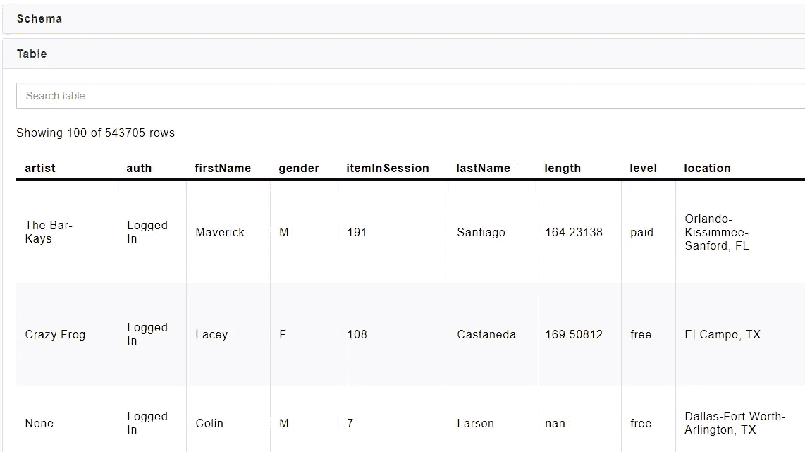

Figure 1

浏览一下模式:

```
df.printSchema()
```

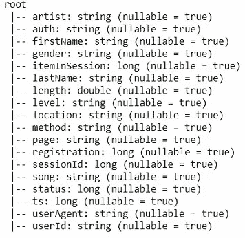

Figure 2

该数据集包含有关用户如何与流媒体平台交互、他们听了哪些歌曲、他们访问了哪个页面、他们的帐户状态等信息。任何用户交互都存储有 UNIX 时间戳，这使得分析用户行为随时间的变化成为可能。我们将在以后的特征工程过程中利用这些信息。

# 探索性数据分析

接下来，我们将通过在 PySpark 中进行基本操作来执行 EDA。

为了了解用户如何与音乐服务交互，我们可能想看看他们查看最多的页面。

```
df.groupBy('page').count().sort(F.desc('count')).show()
```

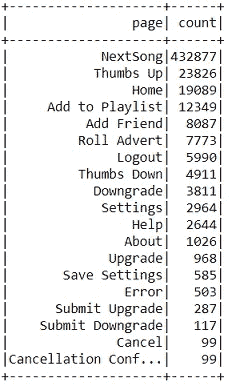

Figure 3

我们可以清楚地看到，“NextSong”是最受欢迎的页面视图，这对于音乐服务来说非常有意义。然而，还有许多其他页面视图对于从该原始数据集中设计相关要素也很重要。我们使用“取消确认”页面，计算 99 次访问，来创建机器学习模型的标签。

```
flag_cancellation_event = F.udf(lambda x: 1 if x == 'Cancellation Confirmation' else 0, IntegerType())
df = df.withColumn('label', flag_cancellation_event('page'))
```

基于 UNIX 时间戳 *ts* ，我们可以按小时计算统计数据。

```
get_hour = F.udf(lambda x: datetime.datetime.fromtimestamp(x / 1000.0).hour, IntegerType())
df = df.withColumn('hour', get_hour(df.ts))
```

由于 matplotlib 不支持 PySpark 数据帧，我们将其转换回 pandas 数据帧，并按小时绘制用户活动。

```
*# Count the events per hour*
songs_by_hour = df.groupBy('hour').count().orderBy(df.hour)
songs_by_hour_pd = songs_by_hour.toPandas()
songs_by_hour_pd.hour = pd.to_numeric(songs_by_hour_pd.hour)*# Plot the events per hour aggregation*
plt.scatter(songs_by_hour_pd['hour'], songs_by_hour_pd['count'])
plt.xlim(-1, 24)
plt.ylim(0, 1.2 * max(songs_by_hour_pd['count']))
plt.xlabel('Hour')
plt.ylabel('Events');
```

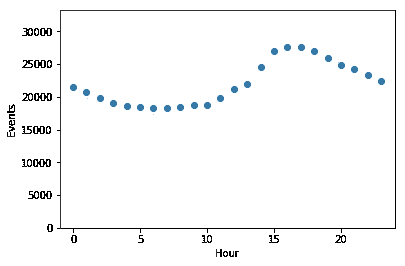

Figure 4

# 特征工程

特征工程在大数据分析中发挥着关键作用。没有数据，机器学习和数据挖掘算法就无法工作。如果只有很少的特征来表示底层的数据对象，那么就很难实现什么，并且这些算法的结果的质量很大程度上取决于可用特征的质量。
因此，我们开始构建我们发现有希望训练模型的特征。

为此，我们从头开始创建一个新的 py spark data frame*feature _ df*，每行代表一个用户。我们将从数据帧 *df* 中创建特征，并将它们依次连接到数据帧 *feature_df 中。*

基于 *df* 中的*标签*列，我们可以将被搅动的用户与其他人分开。

```
churned_collect = df.where(df.label==1).select('userId').collect()
churned_users = set([int(row.userId) for row in churned_collect])all_collect = df.select('userId').collect()
all_users = set([int(row.userId) for row in all_collect])feature_df = spark.createDataFrame(all_users, IntegerType()).withColumnRenamed('value', 'userId')
```

## 编码标签

```
*# Create label column*
create_churn = F.udf(lambda x: 1 if x in churned_users else 0, IntegerType())
feature_df = feature_df.withColumn('label', create_churn('userId'))
```

## 将性别和帐户级别编码为特征

```
*# Create binary gender column*
convert_gender = F.udf(lambda x: 1 if x == 'M' else 0, IntegerType())
df = df.withColumn('GenderBinary', convert_gender('Gender'))*# Add gender as feature*
feature_df = feature_df.join(df.select(['userId', 'GenderBinary']), 'userId') \
    .dropDuplicates(subset=['userId']) \
    .sort('userId')convert_level = F.udf(lambda x: 1 if x == 'free' else 0, IntegerType())
df = df.withColumn('LevelBinary', convert_level('Level'))*# Add customer level as feature*
feature_df = feature_df.join(df.select(['userId', 'ts', 'LevelBinary']), 'userId') \
    .sort(F.desc('ts')) \
    .dropDuplicates(subset=['userId']) \
    .drop('ts')
```

## 将页面视图编码为功能

每次用户与平台交互时，它都会生成数据。这意味着我们确切地知道每个用户在数据提取期间经历了什么。我的方法是将页面分成几类:

*   中性页面:“取消”、“主页”、“注销”、“保存设置”、“关于”、“设置”
*   负面页面:“拇指朝下”、“滚动广告”、“帮助”、“错误”
*   正面页面:“添加到播放列表”、“添加朋友”、“下一首歌”、“竖起大拇指”
*   降级页面:“提交降级”、“降级”
*   升级页面:“提交升级”、“升级”

这种方法背后的原因是，我们可以计算用户与正面页面进行交互的频率。我们可以为每个页面分别做这件事，但这会导致一个更高的特征空间。

让我们把它写成代码:

```
*# Create a dictonary which maps page views and PySpark dataframes* 
pages = {}
pages['neutralPages'] = df.filter((df.page == 'Cancel') | (df.page == 'Home') | (df.page == 'Logout') \
    | (df.page == 'Save Settings') | (df.page == 'About') | (df.page == 'Settings'))
pages['negativePages'] = df.filter((df.page == 'Thumbs Down') | (df.page == 'Roll Advert') | (df.page == 'Help') \
    | (df.page == 'Error'))
pages['positivePages'] = df.filter((df.page == 'Add to Playlist') | (df.page == 'Add Friend') | (df.page == 'NextSong') \
    | (df.page == 'Thumbs Up'))
pages['downgradePages'] = df.filter((df.page == 'Submit Downgrade') | (df.page == 'Downgrade'))
pages['upgradePages'] = df.filter((df.page == 'Upgrade') | (df.page == 'Submit Upgrade'))*# Loop through page views and aggregate the counts by user*
for key, value in pages.items():
    value_df = value.select('userId') \
        .groupBy('userId') \
        .agg({'userId':'count'}) \
        .withColumnRenamed('count(userId)', key)

    *# Add page view aggregations as features*
    feature_df = feature_df.join(value_df, 'userId', 'left').sort('userId') \
        .fillna({key:'0'})
```

接下来，我们将计算用户与平台互动的天数:

```
*# Create dataframe with users and date counts*
dateCount_df = df.select('userId', 'date') \
    .groupby('userId') \
    .agg(F.countDistinct('date')) \
    .withColumnRenamed('count(DISTINCT date)', 'dateCount')

*# Add date count as feature*
feature_df = feature_df.join(dateCount_df, 'userId', 'left').sort('userId') \
        .fillna({'dateCount':'1'})
```

这些页面视图特征是计算出现次数的绝对值。然而，如果一些用户在数据提取结束时注册，而另一些用户从一开始就使用该平台，这可能会导致误导性的结果。为此，我们将通过在特定于用户的时间窗口内划分汇总结果，获得计数/天，从而使汇总结果具有可比性。我在这里跳过代码，完整的代码可以在 [GitHub](https://github.com/scientist94/Udacity_DSND_Spark) 上找到。

## 将一段时间内的用户活动编码为特征

另一个有希望的特性是用户交互如何随时间变化。首先，我们计算每天的用户交互次数。其次，我们使用 numpy.polyfit 为每个用户拟合一个线性回归模型。我们将获取这些线的斜率，移除异常值，并将缩放后的斜率作为特征插入分类算法中。

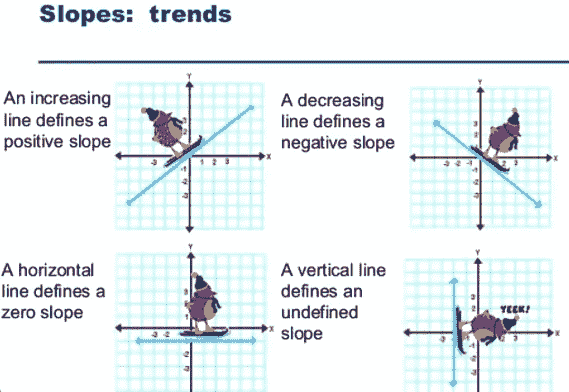

Figure 5

```
*# Create dataframe with users and their activity per day*
activity_df = df.select('userId', 'date') \
    .groupby('userID', 'date') \
    .count()*# initialize slopes*
slopes = []
for user in all_users:
    *# Create pandas dataframe for slope calculation*
    activity_pandas = activity_df.filter(activity_df['userID'] == user).sort(F.asc('date')).toPandas()
    if activity_pandas.shape[0]==1:
        slopes.append(0)
        continue
    *# Fit a line through the user activity counts and retrieve its slope*
    slope = np.polyfit(activity_pandas.index, activity_pandas['count'], 1)[0]
    slopes.append(slope)
```

## 特征缩放，将列合并为一个特征向量

作为特征工程过程的最后一步，我们将迭代创建的特征，并使用 MinMaxScaler 缩放它们。然后，我们将这些特征放入一个向量中，这样我们就可以将它插入 pyspark.ml 算法中。

```
*# UDF for converting column type from vector to double type*
unlist = F.udf(lambda x: round(float(list(x)[0]),3), DoubleType())

*# Iterate over columns to be scaled*
for i in ['neutralPagesNormalized', 'negativePagesNormalized', 'positivePagesNormalized', 'downgradePagesNormalized', 'upgradePagesNormalized', 'dateCountNormalized', 'hourAvg', 'UserActiveTime', 'Slope']:
    *# VectorAssembler Transformation - Convert column to vector type*
    assembler = VectorAssembler(inputCols=[i],outputCol=i+"_Vect")

    *# MinMaxScaler Transformation*
    scaler = MinMaxScaler(inputCol=i+"_Vect", outputCol=i+"_Scaled")

    *# Pipeline of VectorAssembler and MinMaxScaler*
    pipeline = Pipeline(stages=[assembler, scaler])

    *# Fitting pipeline on dataframe*
    feature_df = pipeline.fit(feature_df).transform(feature_df) \
        .withColumn(i+"_Scaled", unlist(i+"_Scaled")).drop(i+"_Vect")

*# Merge columns to one feature vector*
assembler = VectorAssembler(inputCols=['neutralPagesNormalized_Scaled', 'negativePagesNormalized_Scaled', 'positivePagesNormalized_Scaled',                                   'downgradePagesNormalized_Scaled', 'upgradePagesNormalized_Scaled', 'dateCountNormalized_Scaled',                                   'hourAvg_Scaled', 'UserActiveTime_Scaled', 'Slope_Scaled', 'LevelBinary', 'GenderBinary'], outputCol='features')
feature_df = assembler.transform(feature_df)
```

遵循 *feature_df 的模式:*

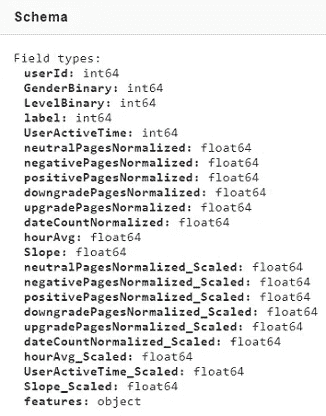

Figure 6

*特征*列保存每个用户的组合特征向量:

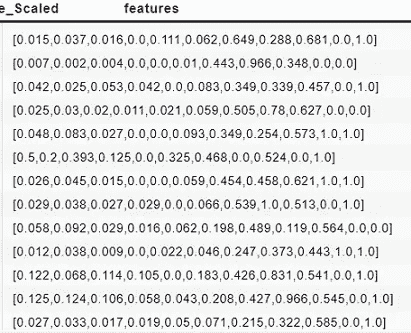

Figure 7

# 机器学习建模

创建特征后，我们可以继续将整个数据集分为训练和测试两部分。我们将测试几种用于分类任务的常见机器学习方法。将评估模型的准确性，并相应地调整参数。根据 F1 分数、精确度和召回率，我们将确定获胜的型号。

将特性数据框架分为训练和测试，并检查类别不平衡。

```
train, test = feature_df.randomSplit([0.7, 0.3], seed = 42)plt.hist(feature_df.toPandas()['label'])
plt.show()
```


Figure 8

检查数据中潜在的阶级不平衡是至关重要的。这在实践中是非常普遍的，并且许多分类学习算法对于不常见的类具有低的预测准确度。

## 机器学习超参数调整和评估

Spark 的 MLlib 支持`[CrossValidator](https://spark.apache.org/docs/latest/api/python/pyspark.ml.html#pyspark.ml.tuning.CrossValidator)`等模型选择的工具。这需要满足以下条件:

*   估计器:算法还是流水线
*   参数集:要搜索的参数网格
*   Evaluator:度量模型在测试数据集上的表现的指标。

将为每个分类器专门设置估计器和参数。

为了评测，我们取支持“areaUnderROC”和“areaUnderPR”的`[BinaryClassificationEvaluator](https://spark.apache.org/docs/latest/api/python/pyspark.ml.html#pyspark.ml.tuning.BinaryClassificationEvaluator)` [](https://spark.apache.org/docs/latest/api/python/pyspark.ml.html#pyspark.ml.tuning.BinaryClassificationEvaluator)。由于我们在数据中有一个等级不平衡，我们采用“areaUnderPR”作为我们的评估指标，因为 PR 曲线在这种情况下提供了更多信息(参见[http://pages.cs.wisc.edu/~jdavis/davisgoadrichcamera2.pdf](http://pages.cs.wisc.edu/~jdavis/davisgoadrichcamera2.pdf))。

由于 pyspark.ml.evaluation 中的类`BinaryClassificationEvaluator`只提供了“areaUnderPR”和“areaUnderROC”这两个指标，我们将使用`sklearn`来计算 F1 分数、精确度和召回率。

```
evaluator = BinaryClassificationEvaluator(metricName = 'areaUnderPR')
```

**逻辑回归**

逻辑回归基本上是一种线性回归模型，它解释了因变量与一个或多个名义变量、序数变量、区间变量或比率级自变量之间的关系，唯一的区别是，线性回归的输出是一个具有实际意义(标签)的数字，而逻辑回归的输出是一个代表事件发生概率(即客户删除其账户的概率)的数字。

在实例化逻辑回归对象之前，我们计算一个平衡比率来说明类的不平衡。我们使用`weightCol`参数根据预先计算的比率对训练实例进行过采样/欠采样。我们想要“欠采样”负类和“过采样”正类。逻辑损失目标函数应该用较低的权重处理负类(标签== 0)。

```
*# Calculate a balancing ratio to account for the class imbalance*
balancing_ratio = train.filter(train['label']==0).count()/train.count()
train=train.withColumn("classWeights", F.when(train.label == 1,balancing_ratio).otherwise(1-balancing_ratio))

*# Create a logistic regression object*
lr = LogisticRegression(featuresCol = 'features', labelCol = 'label', weightCol="classWeights")
```

对于逻辑回归，pyspark.ml 支持在训练集上从模型的中提取一个`[trainingSummary](https://spark.apache.org/docs/2.1.0/api/python/pyspark.ml.html#pyspark.ml.classification.LogisticRegressionSummary)` [。这不适用于拟合的`CrossValidator`对象，这就是为什么我们从没有参数调整的拟合模型中取出它。](https://spark.apache.org/docs/2.1.0/api/python/pyspark.ml.html#pyspark.ml.classification.LogisticRegressionSummary)

```
lrModel = lr.fit(train)
trainingSummary = lrModel.summary
```

我们可以使用它来绘制阈值-召回曲线，阈值-精度曲线，召回-精度曲线和阈值-F-测量曲线，以检查我们的模型如何执行。此阈值是一个预测阈值，它根据模型输出的概率确定预测的类别。模型优化包括调整该阈值。

```
*# Plot the threshold-recall curve*
tr = trainingSummary.recallByThreshold.toPandas()
plt.plot(tr['threshold'], tr['recall'])
plt.xlabel('Threshold')
plt.ylabel('Recall')
plt.show()
```

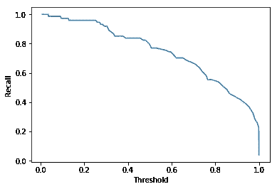

Figure 9

```
*# Plot the threshold-precision curve*
tp = trainingSummary.precisionByThreshold.toPandas()
plt.plot(tp['threshold'], tp['precision'])
plt.xlabel('Threshold')
plt.ylabel('Precision')
plt.show()
```

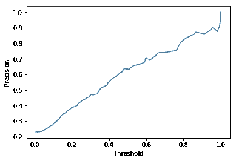

Figure 10

```
*# Plot the recall-precision curve*
pr = trainingSummary.pr.toPandas()
plt.plot(pr['recall'], pr['precision'])
plt.xlabel('Recall')
plt.ylabel('Precision')
plt.show()
```

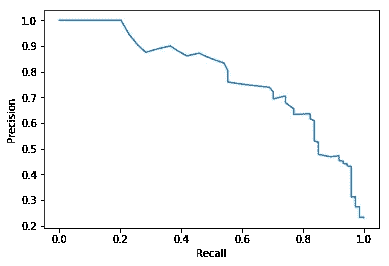

Figure 11

```
*# Plot the threshold-F-Measure curve*
fm = trainingSummary.fMeasureByThreshold.toPandas()
plt.plot(fm['threshold'], fm['F-Measure'])
plt.xlabel('Threshold')
plt.ylabel('F-1 Score')
plt.show()
```

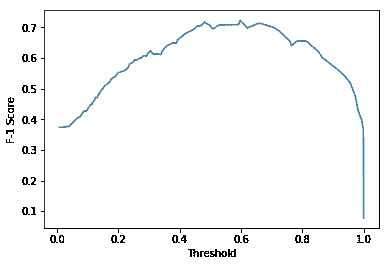

Figure 12

随着我们提高预测阈值，召回率开始下降，而精确度分数提高。常见的做法是将相互竞争的指标可视化。

让我们使用交叉验证来调整我们的逻辑回归模型:

```
*# Create ParamGrid for Cross Validation*
paramGrid = (ParamGridBuilder()
             .addGrid(lr.regParam, [0.01, 0.5, 2.0])
             .addGrid(lr.elasticNetParam, [0.0, 0.5, 1.0])
             .addGrid(lr.maxIter, [1, 5, 10])
             .build())

cv = CrossValidator(estimator=lr, estimatorParamMaps=paramGrid, evaluator=evaluator, numFolds=5)

*# Run cross validations*
cvModel = cv.fit(train)
predictions = cvModel.transform(test)
predictions_pandas = predictions.toPandas()
print('Test Area Under PR: ', evaluator.evaluate(predictions))*# Calculate and print f1, recall and precision scores*
f1 = f1_score(predictions_pandas.label, predictions_pandas.prediction)
recall = recall_score(predictions_pandas.label, predictions_pandas.prediction)
precision = precision_score(predictions_pandas.label, predictions_pandas.prediction)

print('F1-Score: {}, Recall: {}, Precision: {}'.format(f1, recall, precision))
```

参数调整后，逻辑回归显示以下性能:

*   f1-得分:0.66
*   回忆:0.84
*   精度:0.54

## 梯度增强树分类器

梯度推进树是一种使用决策树集成的流行分类方法。对于类不平衡的数据，提升算法通常是很好的选择。PySpark 的 MLlib 支持它，所以让我们在我们的数据集上尝试一下:

```
gbt = GBTClassifier()*# Create ParamGrid for Cross Validation*
paramGrid = (ParamGridBuilder()
             .addGrid(gbt.maxDepth, [2, 4, 6])
             .addGrid(gbt.maxBins, [20, 60])
             .addGrid(gbt.maxIter, [10, 20])
             .build())
cv = CrossValidator(estimator=gbt, estimatorParamMaps=paramGrid, evaluator=evaluator, numFolds=5)

*# Run cross validations*
cvModel = cv.fit(train)
predictions = cvModel.transform(test)
predictions_pandas = predictions.toPandas()
print('Test Area Under PR: ', evaluator.evaluate(predictions))*# Calculate and print f1, recall and precision scores*
f1 = f1_score(predictions_pandas.label, predictions_pandas.prediction)
recall = recall_score(predictions_pandas.label, predictions_pandas.prediction)
precision = precision_score(predictions_pandas.label, predictions_pandas.prediction)

print('F1-Score: {}, Recall: {}, Precision: {}'.format(f1, recall, precision))
```

参数调整后，梯度增强树分类器显示出以下性能:

*   f1-得分:0.58
*   回忆:0.56
*   精度:0.61

## 决策树分类器

决策树是一种流行的分类和回归方法。

```
dt = DecisionTreeClassifier(featuresCol = 'features', labelCol = 'label')*# Create ParamGrid for Cross Validation*
paramGrid = (ParamGridBuilder()
             .addGrid(dt.maxDepth, [2, 4, 6])
             .addGrid(dt.maxBins, [20, 60])
             .addGrid(dt.impurity, ['gini', 'entropy'])
             .build())
cv = CrossValidator(estimator=dt, estimatorParamMaps=paramGrid, evaluator=evaluator, numFolds=5)

*# Run cross validations*
cvModel = cv.fit(train)
predictions = cvModel.transform(test)
predictions_pandas = predictions.toPandas()
print('Test Area Under PR: ', evaluator.evaluate(predictions))*# Calculate and print f1, recall and precision scores*
f1 = f1_score(predictions_pandas.label, predictions_pandas.prediction)
recall = recall_score(predictions_pandas.label, predictions_pandas.prediction)
precision = precision_score(predictions_pandas.label, predictions_pandas.prediction)

print('F1-Score: {}, Recall: {}, Precision: {}'.format(f1, recall, precision))
```

参数调整后，决策树分类器表现出以下性能:

*   f1-得分:0.56
*   回忆:0.60
*   精度:0.52

## 结论

该项目的目标是利用 Apache Spark 的分析引擎进行大规模数据处理的能力，来检测即将停止使用 Sparkify 音乐流媒体服务的客户。

我们应用了数据科学流程的典型步骤，如了解数据、数据准备、建模和评估。

逻辑回归模型显示出最高的性能(F1-得分:0.66，回忆:0.84，精度:0.54)。我们能够召回 84%的流失客户，并为他们提供特别优惠，防止他们删除 Sparkify 账户。然而，我们需要考虑 54%的中等精度分数。这意味着，在所有将获得特别优惠的顾客中，46%的顾客实际上对服务感到满意，不需要任何特殊待遇。

这篇文章的源代码可以在 [GitHub](https://github.com/scientist94/Udacity_DSND_Spark) 上找到。我期待听到任何反馈或问题。