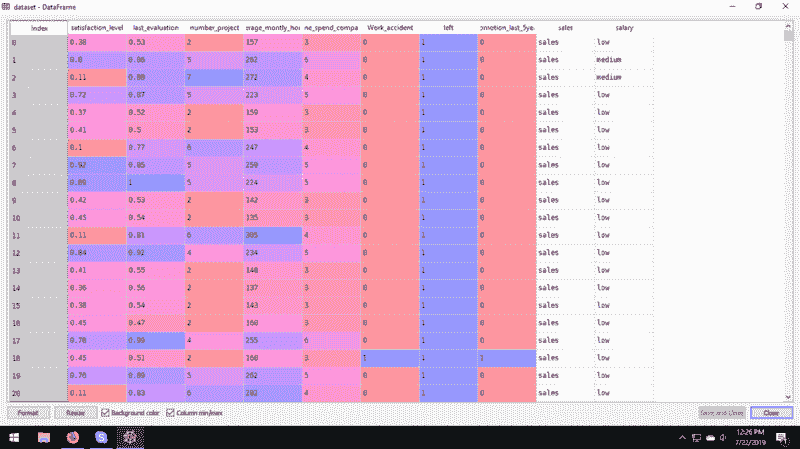
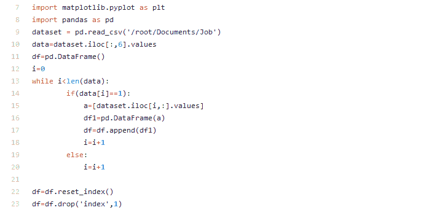
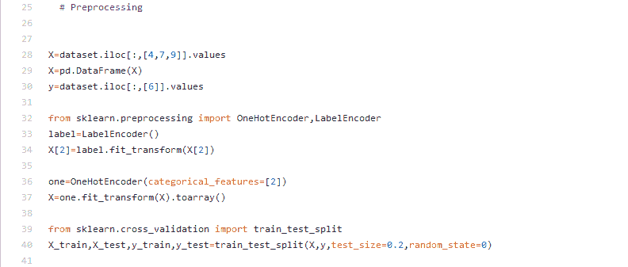
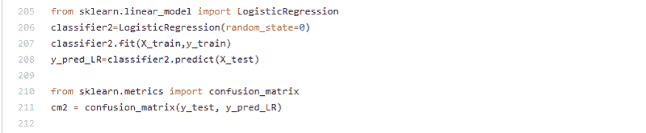
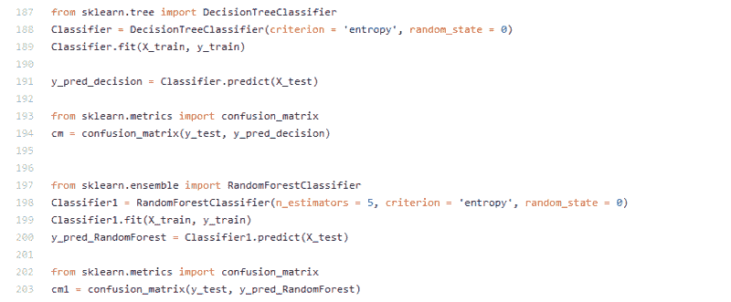
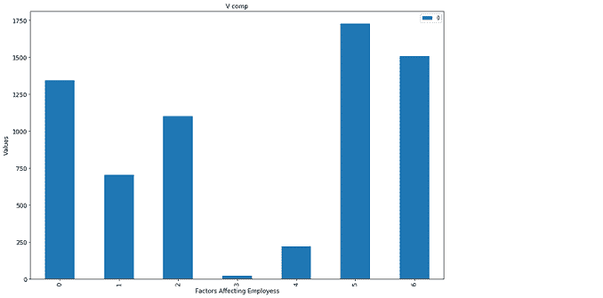

# 预测员工保留率

> 原文：<https://towardsdatascience.com/predict-employee-retention-901bfb2c8db5?source=collection_archive---------14----------------------->

Photo by [Mario Gogh](https://unsplash.com/@mariogogh?utm_source=medium&utm_medium=referral) on [Unsplash](https://unsplash.com?utm_source=medium&utm_medium=referral)

# 介绍

我们知道，大公司有超过 1000 名员工为他们工作，所以照顾每个员工的需求和满意度是一项具有挑战性的任务，它导致有价值和有才华的员工离开公司，而没有给出适当的理由。

如今，员工流失是许多公司面临的一个主要问题。优秀的人才是稀缺的，难以留住的，而且需求量很大。鉴于快乐的员工和快乐的客户之间众所周知的直接关系，了解员工不满的驱动因素变得至关重要。

这个职位强调预测一个员工在一个组织中的保留，例如该员工是否会离开公司或继续留在公司。它使用以前为该公司工作的员工的数据，通过找到一种模式，以是或否的形式预测保留率。

我们正在使用的参数，如工资、在公司的工作年限、晋升、工作时间、工伤事故、财务背景等。通过这篇论文，一个组织可以选择它的策略来阻止优秀的代表离开组织。数据有 14999 个例子(样本)。下面是每一种的功能和定义:

*   satisfaction_level:满意度{ 0–1 }。
*   last_evaluationTime:自上次绩效评估以来的时间(以年为单位)。
*   number_project:工作时完成的项目数。
*   average_montly_hours:工作场所的平均月小时数。
*   time_spend_company:在公司工作的年数。
*   Work_accident:员工是否发生了工作场所事故。
*   left:员工是否离开了工作场所{0，1}。
*   promotion_last_5years:员工在过去五年中是否获得晋升。
*   销售:员工工作的部门。
*   工资:工资的相对水平{低、中、高}。

创建这篇文章的源代码可以在[这里](https://github.com/ilamaheshwari/Predict_Employee_Retention)找到。

Data Set

将数据加载到数据框中并分离结果列。

[FinalCode.py](https://github.com/ilamaheshwari/Predict_Employee_Retention/blob/master/FinalCode.py) hosted by GitHub

# 数据预处理

数据集将“salary”和“sales”列作为分类数据，因此我们必须执行 OneHotEncoding & LabelEncoding 来将此数据转换为数字形式，并创建虚拟特征。我们必须删除第一个特征，以避免某些学习算法可能会遇到的线性依赖性。

之后，我们将把数据分成训练和测试数据集。

Preprocessing

# 回归模型

因为我们想要“是”或“否”形式的结果，例如员工是否会离开公司，所以最合适的回归模型是该数据集的逻辑回归。逻辑回归是一种分类算法，用于将观察值分配给一组离散的类。分类问题的一些例子是电子邮件垃圾邮件或非垃圾邮件、在线交易欺诈或非欺诈、恶性肿瘤或良性肿瘤。

为了计算我们的模型生成的结果的准确性，我们将使用混淆矩阵作为评估参数。

Logistic Regression

# 分类器

决策树是一种类似流程图的树结构，其中内部节点代表特征(或属性)，分支代表决策规则，每个叶节点代表结果。决策树中最顶端的节点称为根节点。它学习根据属性值进行分区。它以递归的方式对树进行分区，称为递归分区。

随机森林是一种监督学习算法。森林是由树木组成的。据说树越多，森林就越健壮。随机森林在随机选择的数据样本上创建决策树，从每棵树获得预测，并通过投票选择最佳解决方案。它还提供了一个很好的特性重要性指标。

在我们的数据集中，我们将使用这两个分类器以是和否的形式对结果进行分类。

Decision Tree and Random Forest Classifier

# 结论

Factors affecting the employment

在上面的图表中，x 轴上从 0 到 6 的数字代表较高的项目，较低的销售级别，较高的时间，促销，工作事故，或非工作事故，无事故。以上每一项都是影响就业的因素，用 HigherTime 表示，有四年以上工作经验但仍未得到任何晋升的员工是 1750 人，这是一个很大的数字，用 LowerSalary 表示即使他们的评估分数高于 3，工资水平也很低的员工是 750 人。

因此，在评估该数据集后，我们了解到较低的工资水平，即使员工工作超过 4 年也没有晋升是员工离开组织的两个主要原因。