# 从赛季表现预测花样滑冰世锦赛排名

> 原文：<https://towardsdatascience.com/predict-figure-skating-world-championship-ranking-from-season-performances-7461dc5c0722?source=collection_archive---------38----------------------->

## 体育分析

## 第五部分:序贯多因素模型

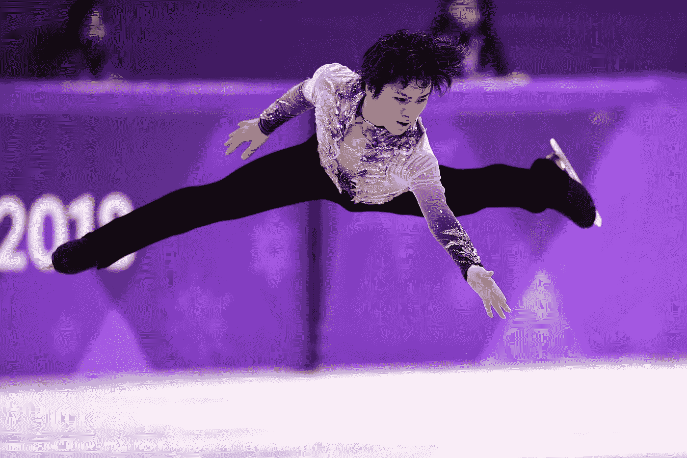

*   *要看我为这个项目写的代码，可以看看它的 Github* [*回购*](https://github.com/dknguyengit/skate_predict)
*   *对于项目的其他部分:* [*第一部分*](/predicting-figure-skating-championship-ranking-from-season-performances-fc704fa7971a?source=friends_link&sk=7e6b2992c6dd5e6e7e1803c574b4236d)*[*第二部分*](/predicting-figure-skating-world-championship-ranking-from-season-performances-part-2-hybrid-7d296747b15?source=friends_link&sk=86881d127654ece260be2e3029dfbad2)*[*第三部分*](/predict-figure-skating-world-championship-ranking-from-season-performances-8af099351e9c?source=friends_link&sk=48c2971de1a7aa77352eb96eec77f249)*[*第四部分*](https://medium.com/@seismatica/predict-figure-skating-world-championship-ranking-from-season-performances-a4771f2460d2?source=friends_link&sk=61ecc86c4340e2e3095720cae80c0e70) *，第五部分* [*第六部分*](https://medium.com/@seismatica/predict-figure-skating-world-championship-ranking-from-season-performances-d97bfbd37807)***

# **背景**

**在项目的前几部分，我试图根据运动员在该赛季前几场比赛中获得的分数来预测一年一度的世界花样滑冰锦标赛的排名。主要策略是将**滑手效应**(每个滑手的内在能力)与**事件效应**(一个事件对滑手表现的影响)分开，以便建立更准确的排名。**

**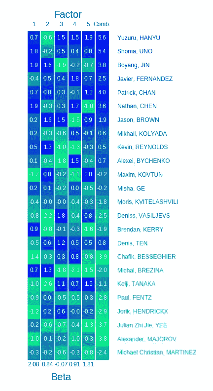**

****First 4 columns:** normalized scores in each factor. **Last column:** combined score from logistic regression model. **Heatmap color:** rank of a skater in each factor. **Text color:** rank of a skater in the world championship**

**具体来说，在项目的[第三部分](/predict-figure-skating-world-championship-ranking-from-season-performances-8af099351e9c?source=friends_link&sk=48c2971de1a7aa77352eb96eec77f249)中，每个滑手都由多个潜在因素代表(见附图中的前 4 列)。然后，在第四部分的[中，使用逻辑回归模型来组合每个选手的潜在分数，并根据这些组合分数对选手进行排名(图表中的最后一列)。该模型使用双重交叉验证进行评估:它在 5 个季节进行训练，并在另外 5 个季节进行评估。](https://medium.com/@seismatica/predict-figure-skating-world-championship-ranking-from-season-performances-a4771f2460d2?source=friends_link&sk=61ecc86c4340e2e3095720cae80c0e70)**

# **问题**

**使用多因素模型来学习运动员的潜在得分，使用逻辑回归模型来预测运动员的排名，我们试图通过以下方式改进这两个模型:**

*   **增加潜在因素的数量**
*   **提前停止多因子模型的梯度下降算法**
*   **提前停止逻辑回归模型的梯度上升算法**

**后两种[提前停止](https://en.wikipedia.org/wiki/Early_stopping)策略旨在防止模型过度拟合赛季得分(对于多因素模型)或世界锦标赛排名(对于逻辑算法模型)，以便他们可以很好地预测他们没有训练过的赛季。**

**然而，当我们检查这两个模型的哪个停止迭代对验证集中的肯德尔τ的改善最大时，得到了一个奇怪的结果(与基线模型相比):**

**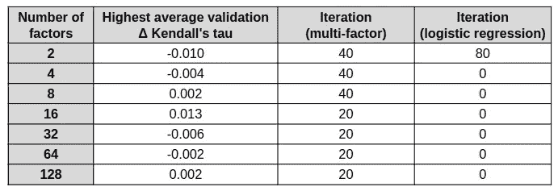**

**从上表可以看出，对于大多数因素(除了 2)，当逻辑回归运行 0 次迭代时，Kendall 的改善最大。这意味着使用逻辑回归比根本不使用它更糟糕！**

# **潜在分数的问题**

**为什么逻辑回归在合并潜在得分方面做得如此糟糕？我的假设是，在 [part 3](/predict-figure-skating-world-championship-ranking-from-season-performances-8af099351e9c?source=friends_link&sk=48c2971de1a7aa77352eb96eec77f249) 中学到的潜在分数本来就不好。更具体地说，它们完全是任意的，并没有真正抓住每个选手的潜在能力。**

**要了解原因，让我们重温一下多因素模型的公式(如[第 3 部分](/predict-figure-skating-world-championship-ranking-from-season-performances-8af099351e9c)所述):**

**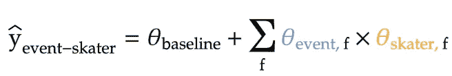**

*   **`ŷ_event-skater`:给定运动员在给定项目中的预测得分**
*   **存在于每个项目和每个运动员身上的潜在因素**
*   **`θ_event,f`:给定事件的潜在因素得分**
*   **`θ_skater,f`:给定选手的潜在因素得分**

**从上面的公式中，我们看到，学习潜在得分只是为了尽可能地逼近赛季得分，而不是其他。因此:**

*   **如果两个因素互换，预测的分数——因此模型性能(RMSE)——将保持完全相同，但这些因素现在与它们之前完全相反。**
*   **作为一个推论，没有一个因素会比其他因素更重要，他们的产品和相应的事件得分在每个赛季得分中的贡献大致相同。**
*   **这似乎不符合我们对滑冰者的合理直觉:可能有一些因素比其他因素更重要，对滑冰者赢得的赛季分数贡献更大。**

**当绘制两个不同季节(2005 年和 2017 年)的 2 因素模型的潜在得分时，可以证明潜在因素模型的这些弱点。此外，对于每个季节，梯度下降开始时的潜在得分用两个不同的随机种子(42 和 24)初始化:**

**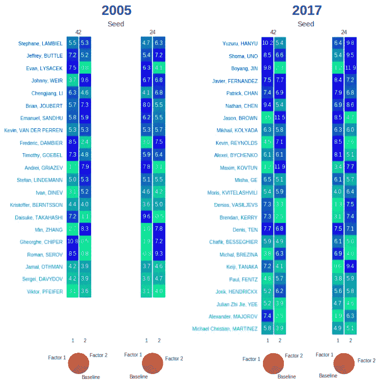**

****Heatmap color:** Ranking of skater by each individual factor. **Text color:** rank of a skater in the world championship**

**从上图可以看出:**

*   **即使只是在初始化梯度下降时改变种子，我们最终会在两个因素(白色部分)中的每一个上得到非常不同的潜在选手分数。事实上，潜在得分似乎在很大程度上互换了，因为当使用不同的种子时，每个单独因素产生的排名似乎交换了位置。**
*   **这也可以在代表每个因素(以及基线得分)对赛季得分的平均贡献的饼图中看到:一个种子显示因素 1 的贡献大于因素 2，而另一个种子显示相反。然而，与之前的猜测一致，这两个因素的影响大致相同。**
*   **更糟糕的是，即使是同一个因素，该因素在不同季节的得分和排名也几乎没有相似之处。因此，很难证明将不同季节的差异矩阵堆叠在一起来训练第 4 部分中的逻辑回归模型是合理的，因为这样做，我们假设相同的因子代表不同季节的相同事物。**

**因此，我们需要彻底检查潜在因素模型，使一些因素优先于其他因素，并确保同一因素在不同季节之间保持一致。**

# **依次训练潜在因素**

**对当前潜在因素模型的一个明显的修正是只更新一个因素的潜在得分，直到 RMSE 达到稳定状态。然后，我们开始更新下一个因子，以此类推，希望 RMSE 进一步减小。**

**这可以通过修改多因子模型的梯度下降算法来完成，以便它一次更新一个因子。然而，实现这一点的更方便的方法是:**

**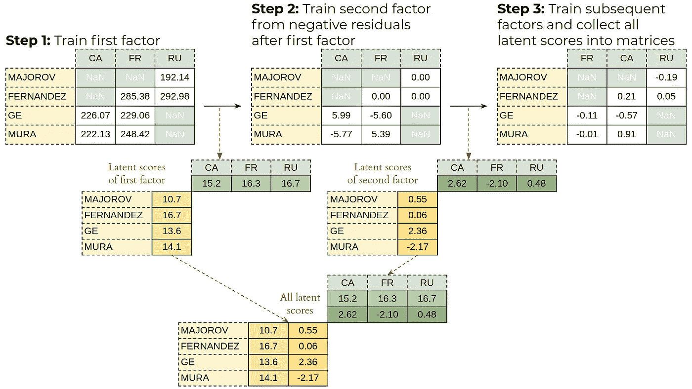**

*   ****第一步:**在赛季得分上训练单因素模型，得到第一因素的潜在事件和潜在得分(关于实现单因素模型的更多细节，参见[第二部分](/predicting-figure-skating-world-championship-ranking-from-season-performances-part-2-hybrid-7d296747b15?source=friends_link&sk=86881d127654ece260be2e3029dfbad2))。**
*   ****第二步:**在第一步后的**负残差**上训练另一个单因素模型，得到第二个因素的潜在得分。使用负残差(而不仅仅是残差),因为在这个项目中，我们将残差定义为预测得分-真实得分。因此，它的负值:真实得分-预测得分，表示第一个因素没有考虑的赛季得分的剩余部分。**
*   ****第三步:**我们可以对任意多的因素重复第二步，并简单地将所有单个因素收集到潜在选手分数的矩阵中。换句话说，这些步骤的输出将与多因素模型相同，但在这种情况下，因素是按顺序学习的。**

## **编码顺序多因素模型**

**鉴于我们已经在[第 2 部分](/predicting-figure-skating-world-championship-ranking-from-season-performances-part-2-hybrid-7d296747b15?source=friends_link&sk=86881d127654ece260be2e3029dfbad2)中浏览了单因子模型的梯度下降算法的代码，下面的代码块显示了如何简单地修改现有代码以按顺序训练多个因子。**

```
**# Transform long score table to pivot form
season_pivot = pd.pivot_table(sample_season_scores[['name', 'event', 'score']], values='score', index='name', columns='event')# Convert pivot table to numpy array
true_scores = season_pivot.values# Store skater and event names to retrieve later
skater_names = list(season_pivot.index)
event_names = list(season_pivot.columns)# Create lists to store scores of individual  
multi_skater_scores = []
multi_event_scores = []
multi_baselines = []# Run gradient descent algorithm
alpha = 0.0005
n_factors = 2
init_seed = 42**for n in range(n_factors):**
    # 1\. Initialize baseline, event, and skater scores
    random_state = np.random.RandomState(seed=init_seed**+n**)
    baseline = random_state.random_sample()
    skater_scores = random_state.random_sample((len(skater_names), 1))
    event_scores = random_state.random_sample((1, len(event_names)))

    # Run gradient descent
    for i in range(1000):
        # 2a. Calculate gradients
        predicted_scores = skater_scores @ event_scores + baseline
        residuals = predicted_scores - true_scores baseline_gradient = np.nansum(residuals)
        event_gradients = np.nansum(residuals * skater_scores, axis=0, keepdims=True)
        skater_gradients = np.nansum(residuals * event_scores, axis=1, keepdims=True) ### 2b. Update latent scores using gradients
        baseline = baseline - alpha * baseline_gradient
        event_scores = event_scores - alpha * event_gradients
        skater_scores = skater_scores - alpha * skater_gradients

    # Store result for each factor 
    multi_skater_scores.append(skater_scores.ravel())
    multi_event_scores.append(event_scores.ravel())
    multi_baselines.append(baseline)

    # Reset true score matrix as negative residual
 **final_residuals = skater_scores @ event_scores + baseline - true_scores    
    true_scores = -final_residuals**# Create latent score matrices with previously-stored name
multi_skater_scores = pd.DataFrame(multi_skater_scores).T
multi_skater_scores.index = skater_namesmulti_event_scores = pd.DataFrame(multi_event_scores).T
multi_event_scores.index = event_names**
```

**主要修改以粗体突出显示，包括:**

*   **将梯度下降算法包含在一个`for`循环中——`for n in range(n_factors)`——以便它可以对多个因子重复。**
*   **这伴随着每个循环/因子末尾附近的代码块，其中用于训练下一个因子的`true_scores`矩阵被设置为前一个因子的负残差矩阵。请注意，我们需要在每次梯度下降后计算一个`final_residual`矩阵:这将使用潜在得分的最新值更新残差，然后将其交给下一个因子。**
*   **最后，在实现该算法时，我注意到，如果使用新的种子来初始化每个后续因子的梯度下降，模型的 RMSE 将下降得更多。也许一个新的种子阻止了下一个因子达到与前一个因子相同的局部最小值。在任何情况下，种子现在都与代表每个因子的数字`n`联系在一起，为了灵活起见，它被添加到用户指定的种子数字:`random_state = np.random.RandomState(seed=init_seed+n)`之上。**

## **双因素示例的结果**

**让我们回顾一下前面两个不同季节的双因素例子，每个季节有两种不同的种子。不同的是，现在我们依次训练两个潜在因素，而不是像以前一样同时训练。**

**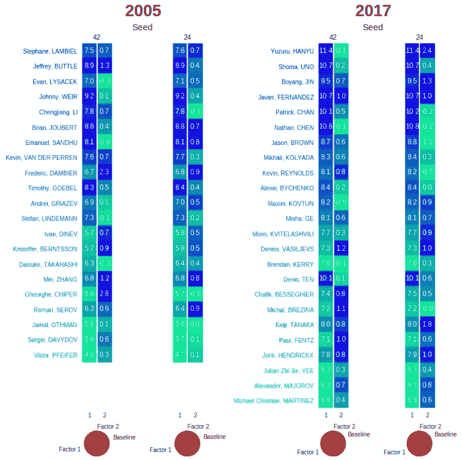**

****White text:** latent score in each factor. **Heatmap color:** Ranking of skater by each individual factor. **Pie chart:** average contribution of each factor, along with the baseline score, in season scores**

**从上面显示的结果，我们可以看到:**

*   **在初始化模型时改变种子的效果对最终的潜在分数的影响要小得多，因为分数即使在不同的种子数目开始时也保持相对稳定。**
*   **第一个因素现在比第二个因素对赛季得分的贡献大得多。事实上，第二个因素的贡献是如此之小(<0.1%) that it did not even show up in the pie charts at the bottom of the diagram. The first factor also has much better predicted ranking than the second, as evidenced by its “smoother” rank colors. This indicates that there is a clear hierarchy in which some factors are more important than others.**
*   **Furthermore, this hierarchy consistently holds across different seasons, as evidenced by the relative contribution of the first factor in each pie chart between the 2005 and 2017 seasons. Within each factor, the ranking produced between the seasons also match quite closely (at least for the first factor). This then allows us to stack different seasons together to train the logistic regression model.**

**These results confirm that we should learn the latent factors sequentially. However, once these factors are learned, we can use logistic regression to combine them and rank the skaters exactly as before (see [第 4 部分](https://medium.com/@seismatica/predict-figure-skating-world-championship-ranking-from-season-performances-a4771f2460d2?source=friends_link&sk=61ecc86c4340e2e3095720cae80c0e70)关于如何做到这一点)。**

## **结果**

**为了更清楚地显示顺序多因素模型是如何工作的，我们可以在梯度下降的迭代中监控其性能。每个因素训练 1000 次迭代，每 100 次迭代的结果显示在下面熟悉的动画仪表盘中(针对 2017 赛季的男滑手):**

**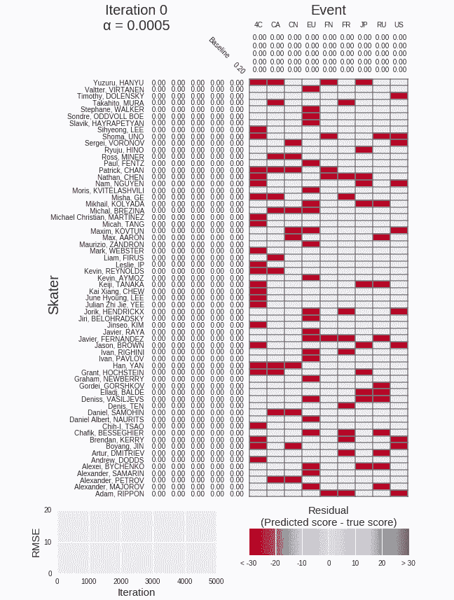**

**上面的仪表板清楚地显示了一个因素完成训练的时间，之后剩下的赛季分数用于训练下一个因素。RMSE 下降的明显“步骤”以及当一个新的因素开始训练时热图中残差的突然减少都证明了这一点。**

# **改进序贯多因素模型**

**为了改进顺序多因素模型，使其能够更好地对运动员进行排名——当与逻辑回归模型结合时——我们对第 4 部分中的原始多因素模型使用相同的策略:增加因素的数量，并提前停止。**

## **增加因子的数量**

**使用相同的 2 折交叉验证计划，我们在不同数量的因子(在α=0.005 和 1000 次迭代)下训练顺序多因子模型，然后在潜在得分上训练逻辑回归模型(也在α=0.005 和 1000 次迭代)。对于每个因素的数量，我们然后从基线模型获得肯德尔τ的平均训练和验证改进。**

**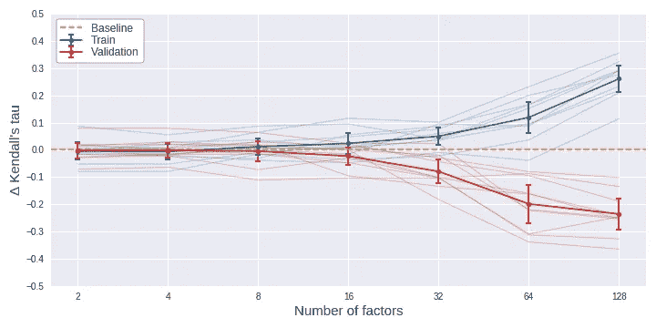**

****Bold lines:** average improvement in Kendall’s tau across 10 years. **Lighter lines:** improvement in Kendall’s tau for each year**

**因子数增加 2 倍(从 2 一直到 128 个因子)的结果如上图所示。从这个图表中，我们可以看到:**

*   **与来自原始多因素模型的[结果](https://github.com/dknguyengit/skate_predict/blob/master/viz/factors_vs_dtau_simul_svd.png?raw=true)相似，序列模型仍然可以在更高数量的因素下过度拟合训练数据，这由训练集中的高 Kendall tau 改进所证明，但与验证集中的基线模型相比，Kendall tau 差得多。**
*   **然而，在验证集中，顺序多因子模型的表现略好于原始模型，尤其是在因子数量较少的情况下。这是有意义的，因为顺序模型首先训练最重要的因素，所以即使结合这些因素中的几个也可能提供一个体面的排名。当然，排名准确性仍然没有明显好于季节平均值的基线模型(水平线为零)，这由验证集中 Kendall 的 tau 改进的置信区间所证明。**
*   **然而，这些置信区间比原始多因素模型的置信区间相对更窄。这表明，按顺序训练潜在因素是一个很好的选择:这些因素的排名在不同季节之间不太不稳定，这可能是由于这些因素在不同季节之间的一致性，如前所述。**

## **提前停止**

**与第 4 部分类似，我们可以提前停止序列多因素模型的梯度下降，以及随后的逻辑回归模型的梯度上升。通过阻止这些算法完全收敛，我们可能不会获得最佳的训练性能，但希望这些模型不会过度适应训练数据，并更好地进行概括。**

**因此，我们可以改变两个模型的 3 个超参数:**

1.  **因素数量**
2.  **多因素模型梯度下降的停止迭代**
3.  **logistic 回归模型梯度上升的停止迭代**

**对于这 3 个超参数的每个组合，我们记录其平均训练和肯德尔τ与基线模型相比的验证改进。这些结果绘制如下:**

*   **多因子模型，停止迭代次数从 0 到 100(每个因子)，间隔 5 次迭代**
*   **停止迭代从 0 到 100，间隔 5 次迭代的逻辑回归模型**
*   **因子数量以 2 的倍数增加，从 2 到 128 个因子**

**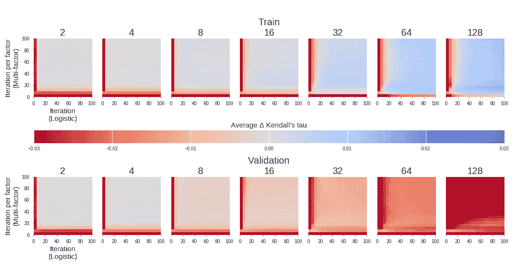**

**上述结果在很大程度上反映了原始多因素模型的结果，即:**

*   **因子数量加倍的效果在提高训练集中的 Kendall tau 方面最为显著，但遗憾的是，也恶化了验证集中的 Kendall tau——这是反映早期观察的过度拟合的经典案例。**
*   **对于涉及早期停止的其他两个超参数，我们看到，在两个模型的迭代次数都很低的情况下，虽然训练性能可以理解地乏善可陈，但验证性能是最不令人担忧的。这可以从验证集(底行)的每个方块左下角的亮淡色点看出。换句话说，很早就停止这两个模型可以极大地帮助减少模型过度拟合。**
*   **与原始的多因素模型相比，对来自序列模型的潜在分数运行逻辑回归，即使只是几次迭代，也比不运行所有的要好得多。这可以通过底部行的每个方块中的垂直红线看出，这意味着如果我们不运行逻辑回归，即运行 0 次迭代，则肯德尔τ的有效性非常低。**

**对于每一个因子，我们注意到与基线模型相比，两个模型在验证集中的肯德尔τ值的改善最大的停止迭代时，也可以看出这一点:**

**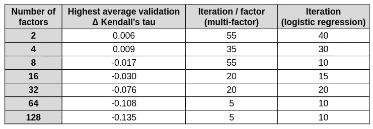**

**从上表中，我们可以看到，在 4 个因素下，顺序多因素模型的每个因素迭代 35 次，之后的逻辑回归模型迭代 30 次，相对于其他超参数组合，预测排名在验证集中具有最高的平均肯德尔τ。然而，请注意，与季节平均值的基线模型相比，这仅仅是 0.009 的微小改进。**

**对女性滑冰运动员重复同样的分析，我们看到 3 个模型超参数的相互作用基本相同:**

**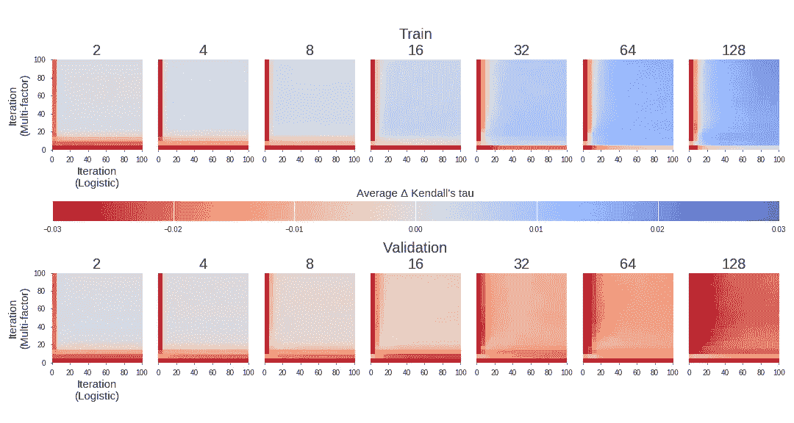**

**然而，对于女性速滑运动员，超参数的最佳组合是 2 个因子，顺序模型的每个因子 65 次迭代，逻辑回归模型的 5 次迭代。这导致肯德尔τ的平均改善比验证集中的基线模型稍高 0.015。**

**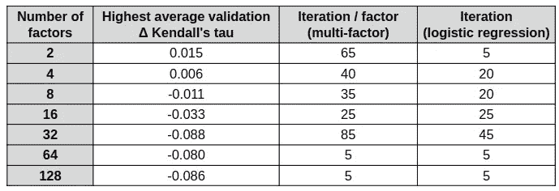**

# **决赛成绩**

**使用上面这些微调的超参数，我们可以从 2017 赛季的男子滑冰运动员的逻辑回归中找到模型系数和综合得分:**

**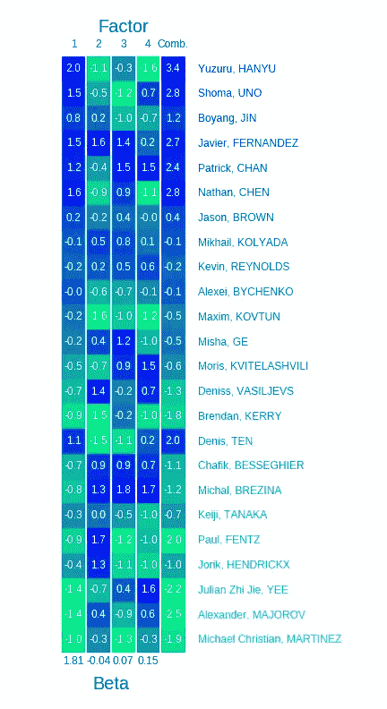**

****First 4 columns:** normalized scores in each factor. **Last column:** combined score from logistic regression model. **Heatmap color:** rank of a skater in each factor. **Text color:** rank of a skater in the world championship**

*   **如前所述，序列模型的第一个因素是最重要的，不仅在于它对赛季得分的贡献，还在于预测世界冠军排名(见随附的热图)。因此，与其他因素相比，它的模型系数高得多(至少高 10 倍)也就不足为奇了。**
*   **然而，这意味着结合潜在的分数可能不会比仅仅通过第一个因素对运动员进行排名产生更多的改进，这正是在第二部分中讨论的单因素模型的策略。**
*   **事实上，在这个例子中，仅通过第一个因素对溜冰者进行排名，在 276 对中就产生了 241 对正确的对，对应于 0.746 的肯德尔τ。相比之下，根据运动员的综合得分对他们进行排名只会产生多一对正确的选手，肯德尔的τ值为 0.754。从随附热图的第一列和最后一列之间非常相似的等级颜色可以看出这一点。**

**因此，当汇总所有季节时，我们可以看到多因素模型仅略微改进了在[第 2 部分](/predicting-figure-skating-world-championship-ranking-from-season-performances-part-2-hybrid-7d296747b15?source=friends_link&sk=86881d127654ece260be2e3029dfbad2)中开发的提前停止单因素模型:**

**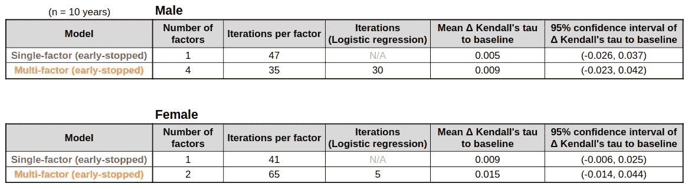**

**即便如此，多因素模型仍然无法超越季节平均值的基线模型，因为其肯德尔τ改进的 95%置信区间(在验证集上)仍然包含零水平线。此外，由于我们已经使用了所有 10 个赛季的世界冠军排名来调整模型的超参数，上述结果很可能过于乐观。**

**因此，在[接下来的](https://medium.com/@seismatica/predict-figure-skating-world-championship-ranking-from-season-performances-d97bfbd37807?source=friends_link&sk=2f7deacde0e597d10fe5761b611bce12)和项目的最后一部分，我会尝试将所有现有的模型合并成一个，看看最后的努力是否能提高预测的排名。然后，我将使用尚未分析的剩余 4 个赛季对项目开始以来开发的所有排名模型进行基准测试。**

# **资源**

**正如在第三部分末尾所讨论的，寻找事件和运动员的潜在得分无非是将赛季得分的事件-运动员矩阵分解成运动员特定矩阵和事件特定矩阵，然后它们可以相乘以近似原始赛季得分矩阵。**

**事实上，用于训练多因素模型的梯度下降算法几乎与网飞挑战赛中用于向用户推荐电影的著名的 [FunkSVD](https://sifter.org/~simon/journal/20061211.html) 矩阵分解算法相同(基于他们对每部电影留下的评级)。在这种情况下，用户=选手，电影=事件，评分=赛季得分。**

**然而，我一点也不知道原来的芬克先生也是一次训练一个人的潜在特征！事实上，在他的博客文章的结尾，他的模型的 RMSE 图与我的动画仪表板中的台阶状形状相同。我想我应该从一开始就更仔细地阅读他的文章。**

**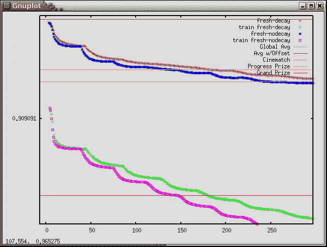**

**RMSE plot from the original FunkSVD**