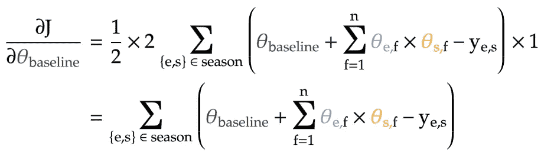
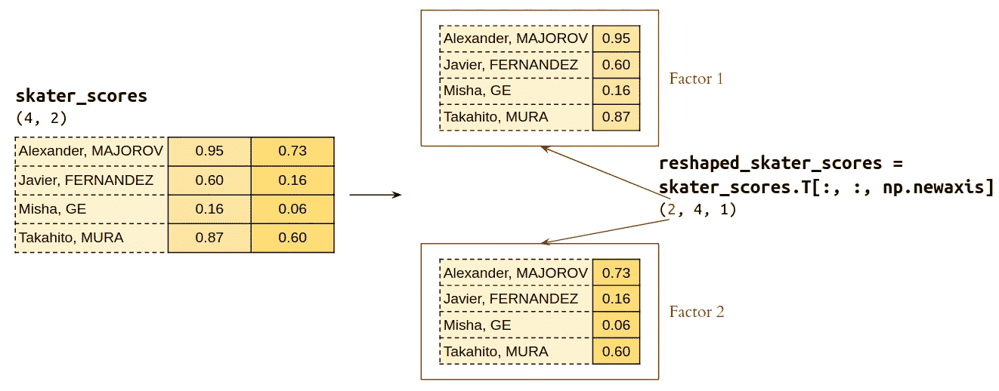

# 从赛季表现预测花样滑冰世锦赛排名

> 原文：<https://towardsdatascience.com/predict-figure-skating-world-championship-ranking-from-season-performances-8af099351e9c?source=collection_archive---------24----------------------->

## 体育分析

## 第 3 部分:多因素模型


*   *要看我为这个项目写的代码，可以看看它的 Github* [*回购*](https://github.com/dknguyengit/skate_predict)
*   *对于项目的其他部分:* [*第一部分*](/predicting-figure-skating-championship-ranking-from-season-performances-fc704fa7971a?source=friends_link&sk=7e6b2992c6dd5e6e7e1803c574b4236d)*[*第二部分*](/predicting-figure-skating-world-championship-ranking-from-season-performances-part-2-hybrid-7d296747b15?source=friends_link&sk=86881d127654ece260be2e3029dfbad2)*[*第三部分*](https://medium.com/@seismatica/predict-figure-skating-world-championship-ranking-from-season-performances-a4771f2460d2?source=friends_link&sk=61ecc86c4340e2e3095720cae80c0e70)*[*第五部分*](https://medium.com/@seismatica/predict-figure-skating-world-championship-ranking-from-season-performances-7461dc5c0722?source=friends_link&sk=fcf7e410d33925363d0bbbcf59130ade)*[*第六部分*](https://medium.com/@seismatica/predict-figure-skating-world-championship-ranking-from-season-performances-d97bfbd37807)****

# **背景**

**在项目的前几部分，我试图根据运动员在该赛季前几场比赛中获得的分数来预测一年一度的世界花样滑冰锦标赛的排名。主要策略是将**滑手效应**(每个滑手的内在能力)与**事件效应**(一个事件对滑手表现的影响)分开，以便建立更准确的排名。**

**针对这个排名问题提出了几个模型，其中一对运动员的赛季得分可以近似为:**

*   **一个**基线得分**，它在所有赛季得分中保持不变**
*   **潜在的**事件分数**，该分数在所有参加该事件的选手中是不变的**
*   **一个潜在的**滑冰者分数**，该分数在该滑冰者参加的所有比赛中都是不变的**

**这些潜在得分可以相加在一起(**加法模型**)，或者相乘在一起(**乘法模型**，或者两者的组合(**混合模型**):**

****

*   **正如项目第一部分所讨论的，前两个模型可以重写为简单的线性模型，模型系数就是潜在得分本身。因此，通过求解线性回归的[正规方程](https://en.wikipedia.org/wiki/Linear_least_squares#Derivation_of_the_normal_equations)可以很容易地找到它们**
*   **相比之下，没有封闭形式的解决方案来学习混合模型的潜在分数。然而，这些分数可以通过应用梯度下降来最小化预测分数和该赛季的真实分数之间的平方差来找到。项目的[第二部分](/predicting-figure-skating-world-championship-ranking-from-season-performances-part-2-hybrid-7d296747b15?source=friends_link&sk=86881d127654ece260be2e3029dfbad2)更详细地讨论了混合模型的梯度下降算法。**
*   **最后，一旦学习了每个模型的潜在分数，模型的预测排名就只是潜在溜冰者分数的排名，从最高到最低。**

# **问题**

**来自所有 3 个先前模型的预测排名与基于他们的**赛季平均成绩**的简单排名的基线模型相比较。用于评估这些模型的指标是[肯德尔排名相关系数](https://en.wikipedia.org/wiki/Kendall_rank_correlation_coefficient) —也称为**肯德尔的τ**—相对于实际的世界锦标赛排名:如果模型的预测排名具有更接近 1 的肯德尔τ，则模型更好，这意味着预测排名与当年世界锦标赛的实际排名更相关。你可以查看这个项目的第一部分[来了解 Kendall 的 tau 是如何工作的，包括如何计算一个玩具的例子。](/predicting-figure-skating-championship-ranking-from-season-performances-fc704fa7971a?source=friends_link&sk=7e6b2992c6dd5e6e7e1803c574b4236d)**

****

**从以上关于在训练集中选择的 10 年(14 年中的 10 年)中的这三个模型的报告来看，所有模型都比赛季平均值的基线模型更好地逼近赛季得分，这由它们与基线模型相比平均更低的[均方根误差](https://en.wikipedia.org/wiki/Root-mean-square_deviation) (RMSE)来证明。**

**然而，在更重要的 Kendallτ度量中，遗憾的是，与基线模型相比，这些模型没有提供该度量的任何显著增加，因为对于男性和女性溜冰者，它们与基线之间的 Kendallτ差异的 95%置信区间包含零。**

**为了改进这些模型，我尝试了几种策略来防止模型过度适应赛季分数，这可能会很吵，可能不会反映运动员的真实能力(也许他们在比赛当天早些时候食物中毒)。因此，这可能会更好地捕捉运动员的真实能力，并为世界锦标赛更准确地排名。**

**这些策略包括[岭回归](https://en.wikipedia.org/wiki/Tikhonov_regularization)和[提前停止](https://en.wikipedia.org/wiki/Early_stopping)，这是减少机器学习中模型过度拟合的两种最流行的策略。然而，这两种策略都未能显著提高模型的肯德尔τ值。因此，如果我们想更好地预测运动员在世界锦标赛中的排名，就需要一种新的模型。**

# **多因素模型**

**为了开发这个新模型，让我们重新回顾一下在项目的前一部分中开发的混合模型:**

****

*   **`ŷ_event-skater`:给定运动员在给定项目中的预测得分**
*   **`θ_baseline`:基线得分(整个赛季得分不变)**
*   **`θ_event`:该项目潜在得分(运动员之间不变)**
*   **`θ_skater`:溜冰者潜在得分(跨事件恒定)**

**在上面的公式中，我们可以看到，每个项目都用一个单独的潜在得分(`θ_event`)来表示，每个滑手也用一个单独的潜在得分(`θ_skater`)来表示。**

**但是，如果不是单一的潜在分数，而是每个滑手都用多个潜在因素来表示呢？例如，他有多喜欢在早上滑冰，或者她有多习惯在高海拔地区比赛。类似地，每个事件可以用相同的因素来表示:事件发生在早上多早，或者发生在什么高度。**

**因此，一个运动员和一个事件之间的每个对应因素可以相乘，然后将这些乘积的总和加到基线得分上，以预测该季节中该运动员-事件对的真实得分:**

****

*   **`ŷ_event-skater`:给定事件中给定选手的预测得分**
*   **`f`:存在于每个项目和每个滑手身上的潜在因素**
*   **`θ_event,f`:给定事件潜在因素得分**
*   **`θ_skater,f`:给定选手潜在因素得分**

## **寻找潜在因素**

**与前面的模型类似，多因素模型中的潜在因素可以通过最小化赛季期间真实得分和预测得分之间的平方差之和来找到(从这里开始称为**残差**):**

****

*   **`J`:模型的目标函数。继续以 2017 赛季的男子滑冰运动员为例，这将是 1 个基线分数、9 个项目中每个项目的所有`n`潜在因素(以蓝色突出显示)以及 62 名滑冰运动员中每个项目的所有`n`潜在因素(以黄色突出显示)的函数。**
*   **`ŷ_e,s`:多因素模型预测的一对运动员的得分**
*   **`y_e,s`:在赛季中记录事件-溜冰者对的真实分数**
*   **`θ_baseline`:基线得分**
*   **`θ_e,f`:事件`e`的潜在因素`f`的得分**
*   **`θ_s,f`:滑手`s`潜在因素`f`的得分**

# **梯度下降算法**

**尽管多因素模型中的潜在分数激增——最后的双倍总和看起来确实很可怕——让我们保持冷静，继续梯度下降。首先，让我们对潜在得分的目标函数进行微分，以获得它们的梯度。**

## **寻找渐变**

**类似于混合模型，基线得分的**梯度就是赛季中所有项目-运动员对的残差之和:****

****

**接下来，我们来算出给定事件 `**i**` ( `θ_ei,k`)的某因子 `**k**` **的**梯度:******

****

*   **当取这个梯度时，所有与这个事件无关的残差平方都将消失。剩下的就是那些涉及到参加这个项目的滑手。因此，只有这些平方残差的导数才有效。**
*   **当对参加这个项目的每个溜冰者`s`求导时，基本的[链式法则](https://en.wikipedia.org/wiki/Chain_rule)起作用:外部求导返回这个项目中那个溜冰者的余数。然后，我们对残差本身进行内部求导，这将使基线、真实分数和其他所有潜在因素的分数(不是 T1)消失。剩下的是那个滑冰运动员(`θ_s,k`)的潜在因素`k`的单个分数，因为它之前被乘以了这个非常事件(`θ_ei,k`)的因素`k`的相应分数。**
*   **因此，对于参加这个事件的每个溜冰者`s`，我们将把外部导数——那个溜冰者在事件`i`中的残差——乘以内部导数——他拥有的潜在因素`k`的分数。将所有参加本次活动的滑冰运动员的这些产品相加，最终将得出事件`i`的因子`k`的梯度。**
*   **这个梯度公式的巧妙之处在于，外导数中的残差不依赖于我们感兴趣的因子`k`。因此，可以多次重复使用该残差，以找到该事件的所有其他因素的梯度(通过将其乘以不同的内部导数)。这将在我们编写梯度下降算法的时候用到。**

**同样，给定滑手 `**j**`的随机因子 `**k**` **的**梯度就是上面事件梯度的滑手类似物:******

****

**与前一个公式相比，该公式的主要区别在于:**

1.  **我们正在总结这位选手参加的所有项目**
2.  **内部导数是每个事件(`θ_e,k`)的潜在因素`k`的相应分数**

**但是，请注意，外部导数中的残差仍然独立于`k`，并且可以被重新用于找到该溜冰者的所有其他因素的梯度(除了`k`)。**

## **更新潜在得分**

**一旦计算出每个项目和每个运动员的所有因素的梯度，我们就可以更新这些因素的潜在得分:**

****

*   **类似于混合模型的梯度下降，更新步骤中学习率α的存在将控制梯度下降的速度并帮助其更好地收敛(如果选择了合适的学习率)。**
*   **请注意，每个因素的更新步骤是独立于所有其他因素完成的。这也将帮助我们实现多因子模型梯度下降的 Python 代码。**

## **摘要**

**给定上述梯度公式和更新规则，多因子模型的梯度下降可总结为:**

****

**Gradient descent algorithm for multi-factor model**

**通过以上总结，可以看出:**

*   **一旦计算了每个事件-滑冰运动员对的残差(步骤 2a)，它可以用于独立于每个其他潜在因素单独计算每个潜在因素`k`的梯度(步骤 2c-i)。换句话说，这就好像每个项目和每个滑手只有一个单一的潜在得分，它们的梯度计算方法与单因素混合模型完全相同。之后，残差被重新用于计算下一个潜在因子的梯度(使用完全相同的方法)。**
*   **此外，每个因子`k`的更新步骤也独立于所有其他因子(步骤 2c-ii)。因此，我们可以逐个更新每个潜在因素的分数，直到我们完成步骤 2 的一次迭代。**

**换句话说，多因素模型的梯度下降算法实际上与单因素混合模型的算法相同，只是一旦计算出每个项目-运动员对的残差，我们需要计算梯度并逐个更新每个潜在因素的分数(通过重用残差)。**

# **多因素模型编码**

**让我们使用与混合模型相同的玩具示例，一个`season_scores`熊猫数据框架，包含 4 名滑冰运动员(MAJOROV，FERNANDEZ，GE，MURA)的 7 个赛季成绩和不同国家(CA，FR，RU)的 3 项赛事:**

****

**类似于混合模型，我们首先将该数据框从长格式转换为数据透视表格式，运动员作为行，事件作为列，条目是每个事件-运动员对的分数。注意，不是所有的滑手都参加所有的项目，所以数据透视表中有缺失值，用`NaN`(不是数字)表示。**

```
**season_pivot = pd.pivot_table(season_scores[['name', 'event', 'score']], values='score', index='name', columns='event')**
```

****

**然后，我们将熊猫数据透视表转换成一个 4×3 的 numpy 矩阵`true_scores`，这样我们可以更容易地操作它。这实际上将删除所有的行和列名称，所以让我们存储运动员名称(行)和事件名称(列)，这样我们在运行梯度下降后仍然可以识别它们。**

```
**skater_names = list(season_pivot.index) 
# ['Alexander, MAJOROV', 'Javier, FERNANDEZ', 'Misha, GE', 'Takahito, MURA']event_names = list(season_pivot.columns) 
# ['CA', 'FR', 'RU']true_scores = season_pivot.values
# array([[   nan,    nan, 192.14],
#        [   nan, 285.38, 292.98],
#        [226.07, 229.06,    nan],
#        [222.13, 248.42,    nan]])**
```

## **第一步:初始化基线、潜在项目和潜在选手得分**

**对于基线分数，类似于混合模型，我们可以只使用一个`[RandomState](https://docs.scipy.org/doc/numpy-1.15.0/reference/generated/numpy.random.RandomState.html)`对象的`[random_sample](https://docs.scipy.org/doc/numpy-1.15.0/reference/generated/numpy.random.RandomState.random_sample.html#numpy.random.RandomState.random_sample)`方法(带有特定的种子)来返回一个介于 0 和 1 之间的随机数。**

```
**random_state = np.random.RandomState(seed=42)
baseline = random_state.random_sample() # 0.37**
```

**对于这个玩具的例子，让我们假设对于每个事件和每个溜冰者，我们有 2 个潜在的因素。因此，我们可以将 4 个溜冰者的所有潜在分数初始化为 4×2 矩阵。类似地，我们可以将 3 个事件的所有潜在得分初始化为 2×3 矩阵。**

```
**skater_scores = random_state.random_sample((4, 2))
# array([[0.95071431, 0.73199394],
#        [0.59865848, 0.15601864],
#        [0.15599452, 0.05808361],
#        [0.86617615, 0.60111501]])event_scores = random_state.random_sample((2, 3))
# array([[0.70807258, 0.02058449, 0.96990985],
#        [0.83244264, 0.21233911, 0.18182497]])**
```

## **步骤 2a:计算每对运动员的残差**

**以矩阵形式初始化这些潜在得分的原因是，通过将这些向量相乘(使用矩阵乘法运算符`@`)并在此基础上添加基线，可以一次性计算出每对运动员的预测得分:**

```
**predicted_scores = skater_scores @ event_scores + baseline
# array([[1.65705782, 0.54954103, 1.42974207],
#        [0.92831034, 0.41999206, 0.98355296],
#        [0.53334684, 0.39008461, 0.53640179],
#        [1.48824946, 0.52001014, 1.32395061]])**
```

**为了更清楚地说明这一点，下面的图表显示了两个潜在矩阵(大小分别为 4×2 和 2×3)与添加在顶部的基线相乘，以形成每对运动员的 4×3 预测得分矩阵。**

****

****Dotted line:** implied indices of skaters and events, even though they don’t exist in numpy arrays**

**用红色突出显示的是如何通过此操作计算出一对运动员(CA-MAJOROV)的预测得分。请注意，两个潜在得分矩阵的乘法运算是如何自动对一对运动员的所有因素进行求和的，方法是在各自的潜在得分矩阵中取该运动员的相应行和该项目的相应列的点积。**

**一旦计算出每对运动员的预测得分，寻找残差就像从预测得分矩阵中减去真实得分的 numpy 数据透视表一样简单:**

```
**residuals = predicted_scores - true_scores**
```

**回想一下，我们的`true_scores` numpy 矩阵包含赛季中不存在的事件-运动员配对的`NaN`值。因此，当计算残差时，那些对的对应残差也是`NaN`。**

****

## **步骤 2b:计算基线得分的梯度并更新它**

**就基线分数而言，混合模型的梯度没有任何变化，它只是所有残差的总和，并使用该梯度更新分数。**

****

**因此，为了计算基线梯度(`baseline_gradient`)，我们使用相同的`[np.nansum](https://docs.scipy.org/doc/numpy/reference/generated/numpy.nansum.html)`函数对原因中现有的事件-溜冰者对的残差求和，同时忽略不存在的对，它们是`residuals`矩阵中的`NaN`。最后，基线分数通过减去其梯度乘以学习率`alpha`来更新。**

```
**alpha = 0.0005
baseline_gradient = np.nansum(residuals)
baseline = baseline - alpha * baseline_gradient**
```

## **步骤 2c:对于每个因子 k，计算其在每个项目和每个选手中的梯度，并通过相应的梯度更新每个分数**

**下面是整个步骤的代码:**

```
**# For each factor k
for k in range(2):
    # Extract latent scores for that factor
    skater_scores_k = skater_scores[:, [k]]
    event_scores_k = event_scores[[k], :] # Step 2c-i: Find gradients of factor k for all skaters & events
    event_gradients_k = np.nansum(residuals * skater_scores_k, axis=0, keepdims=True)
    skater_gradients_k = np.nansum(residuals * event_scores_k, axis=1, keepdims=True) # Step 2c-ii: Update scores of factor k for all skaters & events
    event_scores[[k], :] = event_scores_k - alpha * event_gradients_k
    skater_scores[:, [k]] = skater_scores_k - alpha * skater_gradients_k**
```

**正如前面在梯度下降推导中提到的，一旦计算了残差(步骤 2a)，我们就将每个因素视为完全独立于所有其他因素。因此，我们可以计算梯度，并通过循环`for k in range(2)`(在我们的玩具示例中，因子数为 2)逐个更新每个潜在因子的分数:第一个因子将有`k=0`，而第二个有`k=1`。**

**让我们先来看看第一个因素(`k=0`)的步骤:**

*   **首先，我们提取该因素的潜在得分。这将是事件(`event_scores[[0], :]`)的潜在矩阵中的第一行，以及溜冰者(`skater_scores[:, [0]]`)的潜在矩阵中的第一列。使用这些有趣的方括号`0`的原因是，我们希望将第一个因素的潜在分数保存为跨事件的大小为(1，3)的行向量和跨溜冰者的大小为(4，1)的列向量。如果没有这些括号，numpy 只会将这些切片折叠成一维数组。**

****

*   **对于所有事件(`event_scores_k`)和所有溜冰者(`skater_scores_k`)的第一因素的这些提取的分数，问题现在简化为混合模型的单因素问题。因此，计算该因子中所有分数的梯度与混合模型完全相同:**

```
**event_gradients_k = np.nansum(residuals * skater_scores_k, axis=0, keepdims=True)
skater_gradients_k = np.nansum(residuals * event_scores_k, axis=1, keepdims=True)**
```

**我不会对这一步做太多的详细说明，因为它在项目的第 2 部分中有完整的解释，包括`np.nansum` : `axis`的参数，它控制梯度的求和方向(跨运动员或跨事件)，以及`keepdims`，它防止 numpy 将梯度折叠为 1-D，并为后面的更新步骤保持它们的行/列向量形式。简而言之，我将在下面的图表中总结这些操作，首先计算所有事件中的梯度(第一个潜在因素):**

****

****Highlighted in red:** relevant values for an example event (RU). **Dotted arrows:** numpy broadcasting of latent skater scores (for the first factor)**

**然后，为了计算所有溜冰者的梯度(第一潜在因素):**

****

****Highlighted in red:** relevant values for an example skater (Takahito, MURA). **Dotted arrows:** numpy broadcasting of latent event scores (for the first factor)**

*   **一旦计算出第一个潜在因素的梯度，就可以用它们来更新所有运动员和项目中该因素的得分。**

```
**event_scores[[0], :] = event_scores_k - alpha * event_gradients_k
skater_scores[:, [0]] = skater_scores_k - alpha * skater_gradients_k**
```

****

**一旦第一个因素的潜在得分被更新，循环就移动到第二个因素(`k=1`)并重复同样的事情:计算所有事件和运动员中该因素的梯度(使用来自步骤 2a 的相同的`residuals`矩阵)，并使用这些梯度更新潜在得分。以下是提取的单因素向量，将在`k=1`时处理:**

****

**最后，整个步骤 2 重复多次，在计算残差、寻找梯度和更新潜在得分之间移动，直到每个循环之后的 RMSE`np.sqrt(np.nanmean(residuals**2))`已经稳定。经过 1000 次迭代后，这个玩具示例的多因子模型的 RMSE 达到了惊人的 0.004(相比之下，第 2 部分中的单因子混合模型为 4.30)，迭代与迭代之间的差异为 1e-5。**

**事实上，当将潜在选手和事件矩阵相乘以获得赛季期间的最终预测分数时，模型的 RMSE 如此之低一点也不奇怪，因为预测分数(左)实际上与真实分数(右)相同:**

****

**Predicted season scores after 1000 iterations of gradient descent vs. true scores**

**最后，可以在 pandas `DataFrame`中检索所有选手的 2 个因素的潜在分数，将先前存储的选手姓名作为行索引添加回来，并将因素(`0`和`1`)作为列:**

```
**pd.DataFrame(skater_scores, index=skater_names)
#                             0         1
# Alexander, MAJOROV  10.226857  3.122723
# Javier, FERNANDEZ   16.009246  4.594796
# Misha, GE           11.919684  7.280747
# Takahito, MURA      14.059611  3.020423**
```

**算法管用！然而，当我将它应用于真实数据时，它需要相当长的时间才能运行，尤其是当涉及到许多因素时。当然，我也记录了一系列中间值，但是让我们看看如何使梯度下降更快，这样迭代模型就不那么痛苦了。**

# **用数字广播优化梯度下降**

**如前所述，多因素模型的梯度下降与单因素模型的梯度下降相同，但逐个应用于每个因素。这是算法的“幼稚”实现，因为我们只是按照数学告诉我们的方式编码。**

**然而，我们可以计算梯度并同时更新所有潜在因素的*分数，而不是通过步骤 2c 中昂贵的`for`循环逐一处理这些因素。通过再次利用 numpy 的广播，这是可能的，这一次有一个额外的因素维度(而不仅仅是运动员和事件)。步骤 2c 的修改版本的代码如下:***

```
**# 2c-i: Calculate gradients for all factors
# Reshape matrices
reshaped_residuals = residuals[np.newaxis, :, :]
reshaped_event_scores = event_scores[:, np.newaxis, :]
reshaped_skater_scores = skater_scores.T[:, :, np.newaxis]# Calculate gradients
event_gradients = np.nansum(residuals * reshaped_skater_scores, axis=1)
skater_gradients = np.nansum(residuals * reshaped_event_scores, axis=2).T# 2c-ii: Update latent scores for all factors
event_scores = event_scores - alpha * event_gradients
skater_scores = skater_scores - alpha * skater_gradients**
```

**带`np.newaxis`的矩阵有哪些诡异的索引？为什么在幼稚的实现中是`keepdims=False`而不是`True`？请阅读下面的内容，看看它们是如何工作的。**

## **重塑矩阵**

**回想一下，我们已经为所有事件和运动员初始化了潜在得分矩阵，它们分别是大小为(2，3)的 numpy 数组`event_scores`和大小为(4，3)的`skater_scores`。从步骤 2a 中，我们还得到大小为(4，3)的残差矩阵(`residuals`)，其中每行代表一名运动员，每列代表一个事件。所有矩阵如下图所示:**

****

**在上面的潜在矩阵中，这两个因素粘在一起。然而，梯度下降算法规定它们应该被分别对待。因此，我们需要找到一种方法来分离每个潜在矩阵中的两个因素。具体来说，对于事件，我们需要 2 个大小为 1×3 的行向量，对于溜冰者，我们需要 2 个大小为 4×1 的列向量，每个向量代表一个因素。**

**这些潜在矩阵是如何被重塑的:**

```
**reshaped_event_scores = event_scores[:, np.newaxis, :]**
```

**回想一下事件的潜在矩阵(`event_scores`)是一个大小为(2，3)的二维 numpy 数组。因此，`event_scores[:, np.newaxis, :]`仍将保留原始尺寸——通过`:`——同时通过`[np.newaxis](https://docs.scipy.org/doc/numpy/reference/constants.html?highlight=newaxis#numpy.newaxis)`在原始轴之间添加一个新轴。这会产生一个大小为(2，1，3)的三维数组。您可以将此视为(1，3)数组的两个不同层，每层代表所有事件中的一个因素(下面以红色突出显示):**

****

```
**reshaped_skater_scores = skater_scores.T[:, :, np.newaxis]**
```

**我们可以对 skater 的潜在矩阵做同样的事情，它最初是一个大小为(4，2)的二维 numpy 数组。然而，我们想把它做成(4，1)数组的两个不同层，每层代表所有溜冰者的一个因素。为此，我们使用`skater_scores.T[:, :, np.newaxis]`:由于`skater_scores.T`的大小为(2，4)，所以在末尾添加新轴后，三维数组的大小将为(2，4，1)。潜在选手分数的两个层次如下所示(红色):**

****

```
**reshaped_residuals = residuals[np.newaxis, :, :]**
```

**最后，残差矩阵最初是一个大小为(4，3)的二维数组，由于前面添加了新的轴，它被重新整形为`residuals[np.newaxis, :, :]`，这是一个大小为(1，4，3)的三维数组。你可以认为残差矩阵本质上和以前一样，但是现在存在于三维平面层中。**

****

## **步骤 2c-i:计算所有因子的梯度**

**一旦我们知道如何重塑各种矩阵，我们就可以开始计算梯度，不仅包括所有项目和运动员，还包括所有因素。**

```
**event_gradients = np.nansum(reshaped_residuals * reshaped_skater_scores, axis=1)**
```

*   **`reshaped_residuals * reshaped_skater_scores`:对于残差(1，4，3)和潜在选手得分(2，4，1)的整形三维数组，当我们将它们相乘时，两者都由 numpy 广播。先前平放在 3-D 平面中的剩余矩阵将被复制到另一层以形成(2，4，3)矩阵。同时，在重新整形的潜在运动员矩阵的每一层中的潜在运动员分数将被水平复制三次，以形成(2，4，3)矩阵:**

****

****Dotted arrows:** numpy broadcasting of latent skater scores (for both factors)**

*   **广播完成后，请注意，每一层现在又变成了寻找单一因素的梯度，而与其他因素无关。因此，所有因素的每个事件的梯度将只是熟悉的`np.nansum(reshaped_residuals * reshaped_skater_scores, axis=1)`:`axis=1`参数是对参加每个事件的运动员进行求和，而`keepdims=False`参数将求和的结果折叠回所有事件梯度的大小为(2，3)的二维数组:**

****

```
**skater_gradients = np.nansum(reshaped_residuals * reshaped_event_scores, axis=2).T**
```

*   **同样的事情也可以一次找到所有因素的潜在选手分数的梯度。然而，这一次，重塑的残差(1，4，3)和事件潜在矩阵(2，1，3)的 3d 阵列相乘在一起，并且两者都将被广播:`reshaped_residuals`矩阵将再次被复制到另一层以形成(2，4，3)矩阵。同时，在`reshaped_event_scores`矩阵的每一层中的潜在事件分数将被水平复制四次，也形成(2，4，3)矩阵:**

****

****Dotted arrows:** numpy broadcasting of latent skater scores (for both factors)**

*   **一旦这两个矩阵相乘，将对每个运动员参加的所有事件(`axis=2`)求和，以得到运动员梯度，而`keepdims=False`参数将运动员梯度折叠回大小为(2，4)的二维数组。然而，我们知道矩阵的潜在矩阵大小为(4，2)，所以我们必须在使用它更新分数之前转置溜冰者梯度矩阵(`.T`):**

****

## **步骤 2c-ii:更新所有因素的潜在得分**

**一旦针对所有因素一次性计算出梯度，就以学习率`alpha`从相同形状的事件和溜冰者潜在得分矩阵中减去这些二维梯度阵列。**

```
**alpha = 0.0005
event_scores = event_scores - alpha * event_gradients
skater_scores = skater_scores - alpha * skater_gradients**
```

****

**优化的梯度下降算法——使用 numpy 的广播来计算梯度并一次更新所有因素的潜在得分——在下面完整呈现(针对 4 名运动员、3 个项目和 2 个潜在因素):**

```
**# Step 1: Initialize baseline score, and scores of all factors
random_state = np.random.RandomState(seed=42)
baseline = random_state.random_sample()
skater_scores = random_state.random_sample((4, 2))
event_scores = random_state.random_sample((2, 3))# Step 2: Repeat until convergence
for i in range(1000):
    # a. Calculate residual for every event-skater pair
    predicted_scores = skater_scores @ event_scores + baseline
    residuals = predicted_scores - true_scores

    # b. Calculate baseline gradient and update baseline score
    baseline_gradient = np.nansum(residuals)
    baseline = baseline - alpha * baseline_gradient

    # c. Calculate gradient and update latent scores for all factors
    # Reshape matrices
    reshaped_residuals = residuals[np.newaxis, :, :]
    reshaped_event_scores = event_scores[:, np.newaxis, :]
    reshaped_skater_scores = skater_scores.T[:, :, np.newaxis]

    # c-i: Calculate gradients for all factors
    event_gradients = np.nansum(residuals * reshaped_skater_scores, axis=1)
    skater_gradients = np.nansum(residuals * reshaped_event_scores, axis=2).T

    # c-ii: Update latent scores for all factors
    event_scores = event_scores - alpha * event_gradients
    skater_scores = skater_scores - alpha * skater_gradients**
```

# **用矩阵乘法优化梯度下降**

**上述使用 numpy 广播的实现是可行的。然而，它看起来很笨拙，特别是在计算梯度时要跟上所有的三维矩阵。**

**这里有一个简单得多的方法来同时计算两个因子的相同梯度，但只需乘以二维矩阵:**

*   **为了找到所有因素的所有事件梯度，我们只需要将溜冰者潜在矩阵的(2，4)转置与(4，3)残差矩阵相乘。请注意矩阵的方向如何对齐，从而为事件梯度矩阵提供完美的(2，3)形状。**

****

*   **类似地，为了找到跨所有因素的所有溜冰者梯度，我们将形状(4，3)的残差乘以事件潜在矩阵的(3，2)转置。这给出了溜冰者梯度矩阵的(4，2)的正确形状。**

****

**但是，请注意，为了实现这一点，numpy 的矩阵乘法运算需要忽略残差矩阵中的`NaN`值。遗憾的是，事实并非如此——没有所谓的`np.nanmatmul`。然而，我们总是可以使用`[np.nan_to_num](https://docs.scipy.org/doc/numpy/reference/generated/numpy.nan_to_num.html)`将 NaN 值替换为零，然后像往常一样继续矩阵乘法:**

```
**residuals = np.nan_to_num(residuals)
event_gradients = skater_scores.T @ residuals
skater_gradients = residuals @ event_scores.T**
```

**一旦计算出梯度，它们就被用于分别更新各自的潜在得分矩阵。**

# **3 种实现之间的比较**

**让我们看看这些梯度下降算法的优化版本是否胜过使用`for`循环的逐因子天真实现。**

## **时间复杂度**

**使用 Jupyter 笔记本的`[%timeit](https://ipython.readthedocs.io/en/stable/interactive/magics.html#magic-timeit)`魔法功能，我测量了在这个玩具示例(4 个溜冰者，3 个事件)上运行一次梯度下降迭代所需的时间。我还改变了因素的数量，并测量了两种实现的相应时间，以查看当因素的数量增加时，它们的时间效率如何。**

****

**结果可以在附图中看到:**

*   **在只有一个潜在因素的情况下，所有 3 种实施方式运行一次梯度下降迭代需要大约相同的时间(100 μs 左右)。**
*   **随着因子数量的增加，简单实现完成一次迭代所需的时间也线性增加。这是有意义的，因为步骤 2c 中的`for`循环本质上只是从一个因素移动到下一个因素。**
*   **相比之下，当因子数量增加时，广播实现比原始实现快得多:在只有 10 个因子的情况下，它已经快了近 10 倍，而在因子数量较多的情况下，它始终快 100 倍—请注意上图中以 10 为基数的对数标度绘制了运行时间。**
*   **更好的是用矩阵乘法实现，比广播的快两倍。这些优化版本快得多的原因可能源于它们高效的`np.nansum`和`np.matmul`操作，而不是简单实现中较慢的`for`循环。**

## **空间复杂性**

**然而，这些优化方法的一个潜在缺点是增加了空间复杂度:例如，从广播到更大的 3-D 矩阵。我们可以通过绘制一个接一个地运行每个实现时消耗的内存量来验证这一点。我们仍然使用 4 个溜冰者和 3 个事件的玩具例子，但是因素的数量被提升到 100，000 个因素的最坏情况。**

****

**从上面使用的内存随时间变化的图表(使用 [memory_profiler](https://pypi.org/project/memory-profiler/) 包)中，我们可以看到:**

*   **在两个实现运行的近 6.7 秒中，原始版本运行了前 6.5 秒，广播版本运行了接下来的 0.15 秒，而矩阵乘法版本只运行了最后的 0.02 秒。这与我们之前发现的时间基准是一致的。**
*   **简单的实现在运行期间只消耗了 10[MiB](https://en.wikipedia.org/wiki/Mebibyte)内存(1 MiB = 1.024 兆字节)。有趣的是，一个行分析器揭示了在 100，000 个因子上的`for`循环实际上不消耗任何内存！这可能是因为对于每个因素，我们最多只能用一个非常小的 4×3 的矩阵来计算它的梯度。**
*   **相比之下，广播实现消耗了大约 30 MiB 的内存，考虑到其 3-D 矩阵，这并不像预期的那样糟糕。然而，矩阵乘法版本只消耗了一半，大约 15 兆字节。**

**简而言之，与其他两种方法相比，使用矩阵乘法的梯度下降的实现在可读性、速度和/或存储器使用方面提供了显著的改进。因此，最终选择寻找多因素模型的潜在分数。**

# **多因素模型的结果**

**当我们将上面选择的梯度下降算法应用于 2017 赛季男性滑冰运动员的熟悉示例时，我们可以在算法的迭代中再次跟踪模型的残差和 RMSE。对于梯度下降的前 150 次迭代，它们显示在下面的动画仪表板中:**

****

*   **随着梯度下降的迭代次数越来越多，每个项目-选手对的残差显著减少，正如残差热图末尾的灰色海洋所证明的那样(与项目第 2 部分中单因素模型的[和](https://raw.githubusercontent.com/dknguyengit/skate_predict/master/viz/batch_anim_cropped.gif)相比)。**
*   **150 次迭代后 2.41 的非常低的模型 RMSE 证实了这一点。这比以前的模型(平均 8.84，乘法 8.88，混合 8.86)小三倍以上，比季节平均基线模型(10.3)小四倍以上。换句话说，多因素模型在估算赛季得分方面做得非常出色。**
*   **事实上，如果我们让算法真正收敛，在 1000 次迭代之后，它实现了实际上不存在的 0.03 的 RMSE，迭代与迭代之间的差异为 1e-4。然而，这并不令人惊讶，因为这是一个比以前更复杂的模型，有更多的参数要调整，以最好地逼近赛季得分。**

# **使用个人因素对滑冰运动员进行排名**

**尽管多因素模型可以很好地逼近赛季得分，但它有一个主要的弱点:不是用一个单一的得分来给运动员排名(从最高到最低)，而是每个运动员现在有多个潜在得分，每个因素一个。这就引出了一个问题:**我们应该根据哪个分数来给运动员排名？****

**在 5 个潜在因素中，当我们分别使用每个因素的分数对运动员进行排名时，我们看到:**

****

**Predicted rankings from each individual factor. **In parentheses:** Kendall’s tau of each predicted ranking to the world championship ranking**

*   **由这 5 个因素产生的排名似乎并没有以任何方式相互关联，因为连接两个相邻排名的线是极其混乱的:一个运动员可能在一个因素中的分数排名接近顶部，而在另一个因素中的分数排名接近底部。**

****

*   **这也可以通过绘制 Kendall tau 来看出，Kendall tau 测量不同因素的任何两个排名之间的成对相关性(见随附的热图):任何两个因素的预测排名之间的最高 Kendall tau 相关性在因素 1 和 5 之间只有微不足道的 0.37。**
*   **更糟糕的是，每个因素单独产生的排名都不能很好地预测世界冠军的最终排名，第一个因素的最高肯德尔τ只有 0.45。这甚至远远低于季节平均值的基线模型(0.695)，更不用说我们以前建立的模型(加法和乘法模型为 0.732，混合模型为 0.724)。**

**因此，没有一个因素——单独使用——可以体面地给滑冰运动员排名世界冠军！相反，我们必须找到一种方法来结合不同因素的潜在得分，从而更准确地给运动员排名。在项目的下一部分的[中，我将讨论我们如何做到这一点。](https://medium.com/@seismatica/predict-figure-skating-world-championship-ranking-from-season-performances-a4771f2460d2?source=friends_link&sk=61ecc86c4340e2e3095720cae80c0e70)**

# **资源**

**在多因素模型中，滑手的潜在得分存储在大小滑手数×因素数的矩阵`skater_scores`中，而项目的潜在得分存储在大小因素数×项目数的矩阵`event_skaters`中。因此，多因素模型可以被视为将大小为运动员数量×事件数量的赛季得分矩阵分解为这两个潜在矩阵，使得它们在基线得分之上的乘积——`skater_scores @ event_scores + baseline`——很好地逼近赛季得分的原始矩阵。**

**事实上，项目的这一部分使用的梯度下降算法几乎与网飞挑战赛中用于向用户推荐电影的著名的 [FunkSVD](https://sifter.org/~simon/journal/20061211.html) 矩阵分解算法相同:通过将评级矩阵分解为特定于用户和特定于电影的潜在矩阵，我们可以使用这些潜在得分的乘积来预测用户尚未看过的电影的排名。那么，多因素模型本质上是 FunkSVD，用户=溜冰者，电影=事件，评级=赛季得分。**

**但是，这两种情况的主要区别在于:**

*   **对于这个问题，我们对预测一个运动员在过去一个赛季的比赛中可能会得多少分不感兴趣，而是预测他在未来的世界锦标赛中会排名多高。**
*   **为了简单和小的训练数据，在这个项目中使用的梯度下降是批量梯度下降，其中整个训练数据用于在每次迭代中更新所有潜在得分。相比之下，FunkSVD 通常通过随机梯度下降来完成:每次迭代一次只选取一个评级，以更新与该评级相关的用户和电影的潜在得分。这可能比这里给出的优化实现还要快。**
*   **与多因素模型不同，原始的 FunkSVD 公式不包括基线项。相比之下，该公式的其他变体不仅包括通用基线项，还包括特定项目和运动员的基线项。您可以查看这篇文章中关于 FunkSVD 和推荐系统中常见的其他矩阵分解方法的可读性很强的介绍。**