# 从赛季表现预测花样滑冰世锦赛排名

> 原文：<https://towardsdatascience.com/predict-figure-skating-world-championship-ranking-from-season-performances-d97bfbd37807?source=collection_archive---------27----------------------->

## 体育分析

## 第 6 部分:组合排名模型和最终基准

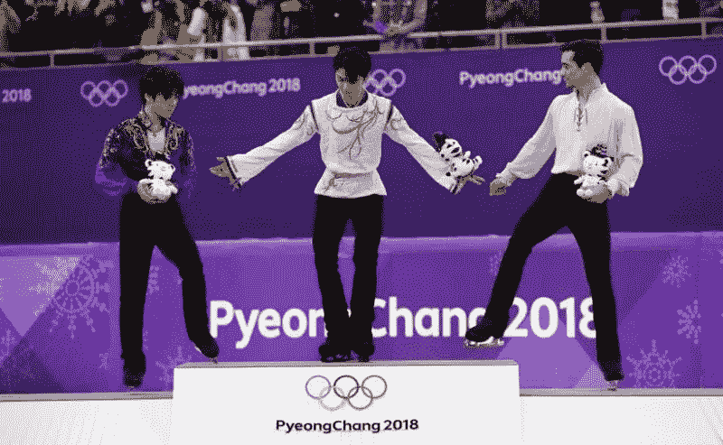

*   *要看我为这个项目写的代码，可以看看它的 Github* [*回购*](https://github.com/dknguyengit/skate_predict)
*   *对于项目的其他部分:* [*第 1 部分*](/predicting-figure-skating-championship-ranking-from-season-performances-fc704fa7971a?source=friends_link&sk=7e6b2992c6dd5e6e7e1803c574b4236d)*[*第 2 部分*](/predicting-figure-skating-world-championship-ranking-from-season-performances-part-2-hybrid-7d296747b15?source=friends_link&sk=86881d127654ece260be2e3029dfbad2)*[*第 3 部分*](/predict-figure-skating-world-championship-ranking-from-season-performances-8af099351e9c?source=friends_link&sk=48c2971de1a7aa77352eb96eec77f249)*[*第 4 部分*](https://medium.com/@seismatica/predict-figure-skating-world-championship-ranking-from-season-performances-a4771f2460d2?source=friends_link&sk=61ecc86c4340e2e3095720cae80c0e70)*[*第 5 部分*](https://medium.com/@seismatica/predict-figure-skating-world-championship-ranking-from-season-performances-7461dc5c0722?source=friends_link&sk=fcf7e410d33925363d0bbbcf59130ade) *，第 6 部分*****

# **背景**

**在项目的前几部分，我试图根据运动员在该赛季前几场比赛中获得的分数来预测一年一度的世界花样滑冰锦标赛中的排名。主要策略是将**溜冰者效应**(每个溜冰者的内在能力)与**事件效应**(一个事件对一个溜冰者表现的影响)分开，这样可以建立一个更准确的排名。**

**为此，在项目的前几部分使用了几种模型:**

**[**第一部分**](/predicting-figure-skating-championship-ranking-from-season-performances-fc704fa7971a?source=friends_link&sk=7e6b2992c6dd5e6e7e1803c574b4236d) **:加性和乘性模型**，可以表述为简单的线性模型，试图逼近所有的赛季得分。线性模型的回归系数包括每个溜冰者的潜在分数，然后根据这些潜在分数对溜冰者进行排名(从最高到最低)。**

**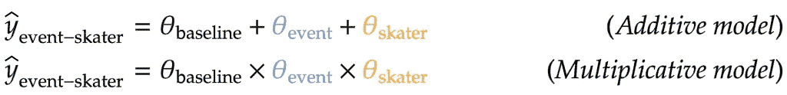**

*   **给定事件中给定运动员的近似分数**
*   **`θ_baseline`:基线得分(整个赛季得分不变)**
*   **`θ_event`:该项目潜在得分(运动员之间不变)**
*   **`θ_skater`:溜冰者潜在得分(跨事件恒定)**

**[**Part 2**](/predicting-figure-skating-world-championship-ranking-from-season-performances-part-2-hybrid-7d296747b15?source=friends_link&sk=86881d127654ece260be2e3029dfbad2) **:混合模型**，是 part 1 中加法和乘法模型的交叉。学习潜在分数没有封闭形式的解决方案，但是可以使用梯度下降增量学习。每个溜冰者的潜在分数可以再次被用来给他们排名。**

**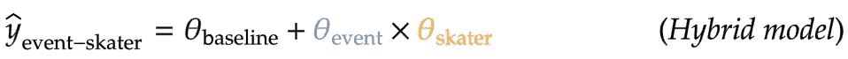**

**[**第三部分**](/predict-figure-skating-world-championship-ranking-from-season-performances-8af099351e9c?source=friends_link&sk=48c2971de1a7aa77352eb96eec77f249) **:多因素模型**，它只是混合模型的一个扩展。不是每个溜冰者(和事件)有一个单一的潜在分数，每个溜冰者将有跨越不同因素的多个潜在分数，这可以再次使用梯度下降来学习。**

**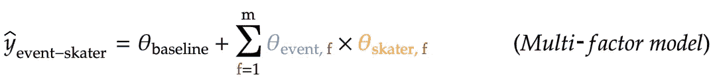**

*   **`f`:存在于每个项目和每个选手身上的潜在因素**
*   **`m`:多因子模型中的因子总数**
*   **`θ_event,f`:给定事件的潜在因素得分**
*   **给定选手的潜在因素的分数**

**[**第四部分**](https://medium.com/@seismatica/predict-figure-skating-world-championship-ranking-from-season-performances-a4771f2460d2?source=friends_link&sk=61ecc86c4340e2e3095720cae80c0e70) **: logistic 回归模型**，用于组合第三部分中跨因素的潜在得分。模型的预测因子是各因子中的分数差，模型的响应是世界锦标赛中每对有序选手的状态。换句话说，冠军排名本身被直接用于学习如何从多因素模型中组合潜在分数，然后这些组合分数被用于对滑手进行排名。**

**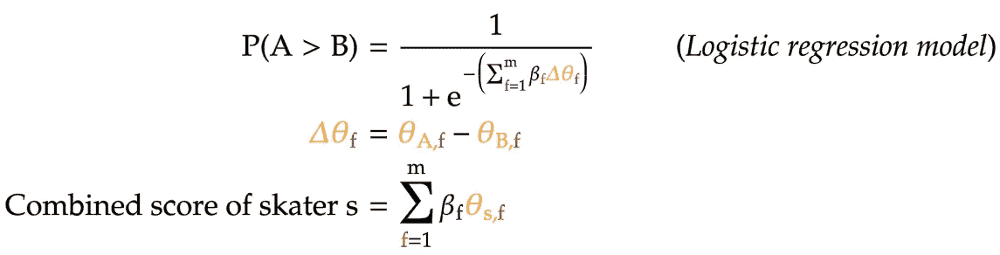**

*   **`P(A > B)`:在世界锦标赛的一对有序选手中，第一名选手(A)超过第二名选手(B)的预测概率**
*   **`β_f`:潜在因素得分差异的线性系数`f`**
*   **`Δθ_f`:2 名选手在`f`因子上的得分差异**
*   **`Δθ_A,f`:A 滑手`f`因素的潜在得分**
*   **`Δθ_B,f`:运动员 B 中`f`因素的潜在得分**

**[**第五部分**](https://medium.com/@seismatica/predict-figure-skating-world-championship-ranking-from-season-performances-7461dc5c0722?source=friends_link&sk=fcf7e410d33925363d0bbbcf59130ade) **:序贯多因素模型**，是第三部分多因素模型的修改版:不是一次性学习所有潜在因素的分数，而是一次学习一个。事实证明，这只不过是训练第 2 部分中概述的单因素模型，然后在学习第一个因素后，在负残差上训练另一个单因素模型，以此类推。**

**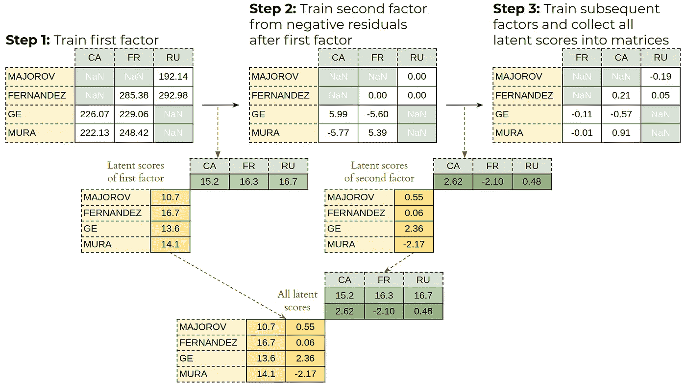**

**Training the sequential multi-factor model**

**然后使用逻辑回归将得到的多因素潜在得分结合起来，与第 4 部分相同。最后，在第三部分中发现序列多因素模型比原始多因素模型更好地预测了运动员的排名。**

# **问题**

**使用[肯德尔的 tau](https://en.wikipedia.org/wiki/Kendall_rank_correlation_coefficient) 排名指标评估每种方法的预测排名，该指标衡量预测排名与实际世界锦标赛排名的相关程度。对于在训练集中选择的 10 个赛季中的每一个赛季，我们计算每个排名模型和赛季平均值的基线模型之间的肯德尔τ的差异，即简单地通过他们的赛季平均分数对运动员进行排名。**

**此外，对于每种方法，我们尝试了不同的策略来提高他们的预测排名，例如 [L2 惩罚](https://en.wikipedia.org/wiki/Tikhonov_regularization)或[提前停止](https://en.wikipedia.org/wiki/Early_stopping)。这些策略旨在防止模型过度拟合赛季得分，以及逻辑回归模型过度拟合世界锦标赛排名，以便他们可以为未来赛季更好地排名运动员。**

**与基线模型相比，每种方法的肯德尔τ(超过 10 个赛季)的平均差异记录如下。注意，逻辑回归模型直接用世界冠军来学习如何组合潜在因素。因此，它不应该在训练的同一季节进行评估，而应该在新的季节进行评估。因此，使用了[双重交叉验证](https://en.wikipedia.org/wiki/Cross-validation_(statistics)#k-fold_cross-validation):在 5 个季节训练模型，在另外 5 个季节评估模型。**

**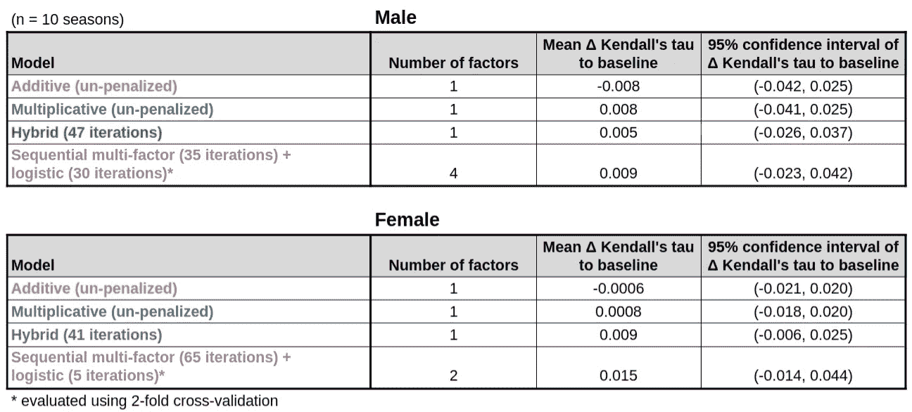**

**从上表中，我们看到:**

*   **对于简单的线性模型(加法和乘法)，未惩罚的版本比惩罚的版本提供了更好的排名。相比之下，对于混合和多因素+逻辑回归模型，阻止模型完全收敛会给出更好的排名。**
*   **从肯德尔τ与基线相比的平均差异(第四列)来看，随着我们从加法、乘法、混合，然后到与逻辑回归模型耦合的顺序多因子，预测排名的准确性增加。这对训练集中选择的 10 个赛季的男女选手都适用。**
*   **然而，这些排名准确性的提高是相当有限的。事实上，没有一种方法提供的排名在统计上优于季节平均值的基线模型:Kendall 的 tau 到基线模型的差异的 95%置信区间包含所有模型的零(最后一列)。**

**因此，项目最后部分的两个主要目标是:**

1.  **将不同的预测排名组合成一个最终排名，我们希望它比单独的单个排名更准确。**
2.  **评估测试集中剩余 5 个赛季的所有排名方法，这些方法之前没有进行过分析。**

**首先，让我们尝试两种不同的方法来组合我们迄今为止开发的所有方法的排名:使用 Borda 计数的无监督方法和使用逻辑回归的监督方法。**

# **无监督方法:Borda 计数**

## **理论**

**由于每种方法都预测了不同的选手排名，我们可以认为每种方法都为所有选手投了不同排名的一票(比如，选手 B >选手 A >选手 C 代表 3 名选手 A、B 和 C)。从这个角度来看，有很多方法可以将这些投票组合成最终的选手排名。它们都属于[等级投票](https://en.wikipedia.org/wiki/Ranked_voting)方法的范畴，这种方法在许多国家和州的选举中使用。**

**一种常见的排名投票方法是[博尔达计数](https://en.wikipedia.org/wiki/Borda_count)，它最早发现于 1435 年！然而，这并不令人惊讶，因为它非常简单。下面的 5 个溜冰者的玩具示例将演示它是如何工作的:**

**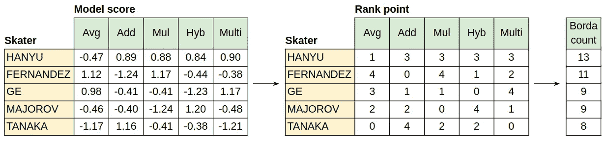**

****Avg:** season average. **Add:** additive. **Mul:** multiplicative. **Hyb:** hybrid. **Multi:** sequential multi-factor + logistic**

1.  **我们从迄今为止为 5 名选手开发的所有方法的潜在分数开始。请注意，我们还包括季节平均基线模型，因为它与我们开发的其他 4 个模型一样有效，表现也一样好。**
2.  **对于每个模型，我们给该模型中分数最低的选手 0 分，然后给分数第二低的选手 1 分，以此类推。结果，对于 5 个滑冰者，每个模型中得分最高的滑冰者将具有等级点 4。因此，等级点数简单地指示每个模型对溜冰者的等级有多高，从 0 开始向上。**
3.  **对于每一个溜冰者，我们将所有模型的排名点相加，得到该溜冰者的 Borda 计数。最后，给选手排名不过是给他们的 Borda 分数排名，从最高到最低。**
4.  **请注意，Borda 计数可以在多个溜冰者之间绑定，例如在上面玩具示例中的`GE`和`MAJOROV`之间:两者的 Borda 计数都是 9。虽然存在许多打破平局的规则，但对于这个问题，我们将通过季节平均模型的排名点打破平局-该模型中得分较高的选手是平局获胜者。在本例中，`GE`与`MAJOROV`平分秋色，因为对于季节平均模型，后者的等级点(3)比后者(2)高(参见等级点表的第一列)。**

*   **选择此平局打破规则是因为通过 Borda 计数的预测排名将在最后与季节平均值的基线模型进行比较，因此使用季节平均值打破平局确保排名准确性的任何提高都是由于 Borda 计数方法本身，而不是平局打破规则。**

**从上面的玩具例子可以看出:**

*   **尽管没有一个排名模型将`HANYU`排在第一，他仍然以最高的博尔达数 13 结束。这是因为大多数模特——5 个中的 4 个——将他排在第二位(排名点为 3)。**
*   **相比之下，即使加性车型排名`TANAKA`第一，其余车型对他的排名都很低:两个车型倒数第一，另外两个车型倒数第三。结果，他以最低的博尔达数 8 结束。**

**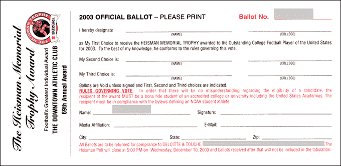**

**Ranked voting ballot for the 2003 Heisman trophy. See ranking rule for the trophy [here](https://www.heisman.com/about-the-heisman/balloting-info/).**

*   **因此，Borda count 经常被描述为基于共识的排名模型，对于要排名高的滑冰运动员，大多数模型必须将他排名高。这就是为什么它通常用于体育奖项的运动员排名，如最杰出的大学足球运动员的[海斯曼杯](https://en.wikipedia.org/wiki/Heisman_Trophy)(见附图)。**
*   **然而，Borda count 模型仅基于它们之间的共识来组合现有的排名，希望这样的组合将准确地预测最终的世界冠军排名。在机器学习的说法中，这是一种 [**无监督的方法**](https://en.wikipedia.org/wiki/Unsupervised_learning) ，因为预测的基本事实——世界冠军排名——根本没有用于训练模型。**

## **编码**

**Borda 计数模型的编码相当简单:**

**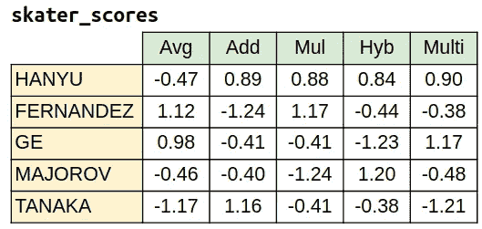**

*   **我们从熊猫数据帧`skater_scores`开始，它代表了之前所有 5 个模型的运动员分数。**
*   **然后，我们通过以下方式计算每个模型的等级点数:**

1.  **首先，使用`[DataFrame.values](https://pandas.pydata.org/pandas-docs/stable/reference/api/pandas.DataFrame.values.html)`将 skater_scores 数据帧转换成一个 numpy 数组。**
2.  **这允许我们调用数组的`[argsort](https://docs.scipy.org/doc/numpy/reference/generated/numpy.argsort.html#numpy.argsort)`方法两次，将分数转换成等级点数:**

```
**rank_points = skater_scores.values.argsort(axis=0).argsort(axis=0)**
```

**`axis=0`参数意味着排序是跨行/运动员执行的。下图突出显示了`argsort`方法是如何计算根据季节平均模型排名第一的选手的排名点(`FERNANDEZ`，排名分数为 4)与根据同一模型排名最后的选手(`TANAKA`，排名分数为 0)进行比较的。**

**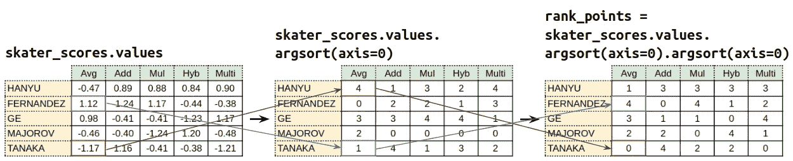**

****Blue:** skater ranked first by season average model (FERNANDEZ). **Red:** skater ranked last for season average model (TANAKA)**

*   **一旦计算出所有模型的等级点，我们就可以对 rank_points 矩阵的每一行求和，以获得每个选手的最终 Borda 分数。`axis=1`参数意味着求和是跨列/模型进行的。**

```
**borda_counts = rank_points.sum(axis=1)**
```

**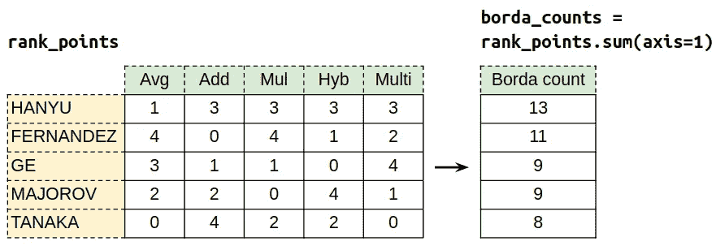**

*   **一旦 Borda 计数被计算出来，我们就把它作为一个额外的列添加回原来的 skater_scores 数据帧中。这使得我们可以对运动员/行进行排序，首先根据 Borda 计数，然后根据平均模型的分数(打破任何平局)，从最高到最低——因此有了`ascending=False`参数。**

```
**skater_scores['Borda'] = borda_counts
sorted_skater_scores = skater_scores.sort_values(by=['Borda', 'Avg'], ascending=False)**
```

**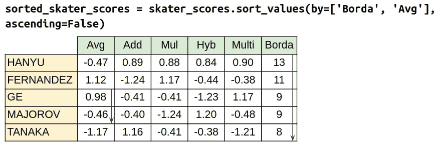**

*   **最后，从排序的 Borda 计数中获得预测的排名只不过是从前面的步骤中提取出`sorted_skater_scores`数据帧的索引。**

```
**borda_ranking = list(sorted_skater_scores.index)
# ['Yuzuru, HANYU',
#  'Javier, FERNANDEZ',
#  'Misha, GE',
#  'Alexander, MAJOROV',
#  'Keiji, TANAKA']**
```

**在我们检查 Borda count 模型的结果之前，让我们看看另一种结合现有排名的方法，但这次使用世界锦标赛排名来直接指导这样的结合。**

# **监督方法:逻辑回归**

## **理论**

**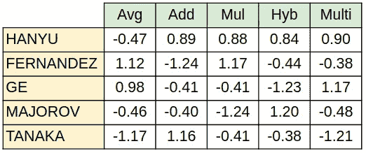**

*   **回到包含每个模型的运动员分数的矩阵，我们看到运动员在每个模型中的分数只不过是该运动员的另一个因素。**
*   **因此，组合这些因素的方式与组合第四部分和第五部分中多因素模型的潜在得分完全相同，即使用简单的逻辑回归模型:**

1.  **该模型的预测值将是一对有序的溜冰者中每个模型的分数差。这对选手是从世界锦标赛排名中产生的，这样这对选手中的第一个选手(选手 A)的排名总是高于第二个选手(选手 B)。为了一致性和易于收敛，在进行成对差异之前，每个模型的分数都朝着平均值 0 和标准偏差 1 标准化。**
2.  **每对选手的回答将是一个二元变量，它表示在世界锦标赛中选手 A 的排名是否高于选手 B:`I(A>B)`。由于所选择的惯例规定溜冰者 A 总是在溜冰者 B 之上，因此训练样本中所有对的响应都是 1。**

**对于我们的玩具例子，假设世界冠军排名是`HANYU > FERNANDEZ > TANAKA > GE > MAJOROV`。因此，我们可以从这个排序中生成 10 个有序对；对于每对选手，我们计算 5 个分数差异的预测值，每个预测值对应于该对选手中两个选手之间的一个先前的模型。注意，由于世界锦标赛排名直接用于生成有序对并计算其相应的预测器，这是一个 [**监督的**](https://en.wikipedia.org/wiki/Supervised_learning) 机器学习任务。**

**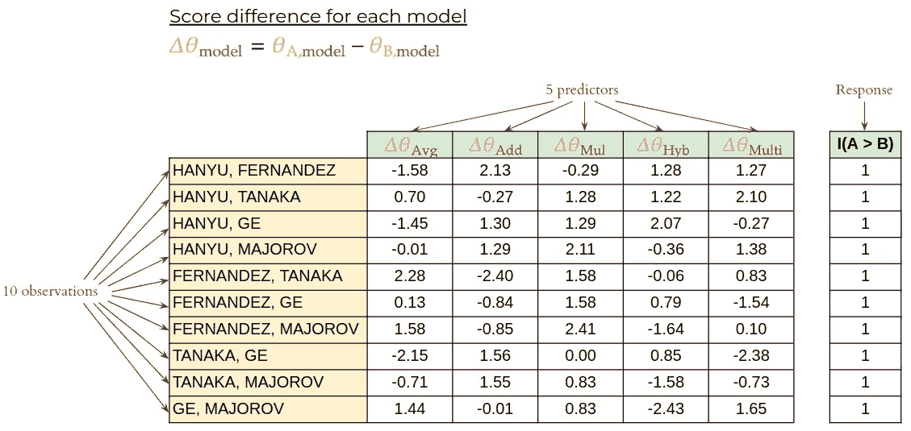**

**上述问题的逻辑回归模型与[第 4 部分](https://medium.com/@seismatica/predict-figure-skating-world-championship-ranking-from-season-performances-a4771f2460d2?source=friends_link&sk=61ecc86c4340e2e3095720cae80c0e70)中的模型完全相同，重复如下:**

**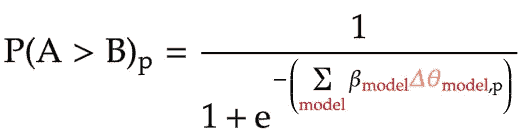**

*   **`P(A > B)_p`:在世界锦标赛中，运动员 A 在有序对`p`中的排名超过运动员 B 的预测概率(从世界锦标赛排名中提取)**
*   **`β_model`:每个先前模型的学习线性系数**
*   **`Δθ_model,p`:两人一组`p`中 2 名选手的模型得分差异**

**使用梯度下降，可以递增地学习 5 个先前模型中每一个的线性系数，直到模型的对数似然最大化。一旦学习了这些系数，它们可以用于将不同的模型分数组合成单个分数，可以根据该分数对溜冰者进行排名:**

****

*   **`β_model`:每个先前模型的学习线性系数**
*   **`θ_s,model`:溜冰者的每个模型的标准化分数`s`**

**由于世界锦标赛排名直接用于训练上述逻辑回归模型，我们再次使用双重验证来客观地评估它:我们在随机选择的 5 个赛季训练模型，并在剩余的 5 个赛季评估它。为了保持一致，为该部分选择的两个折叠与第 4 部分中选择的两个折叠相同。**

## **提前停止**

**由于这一部分中逻辑回归的梯度下降与第 4 部分中的完全相同，所以我不再赘述。但是，类似于那部分，我们可以过早地停止梯度下降算法。**

**这样做，模型不适合世界冠军的排名，因为它应该是 5 个赛季的训练(训练折叠)。然而，它的预测排名可能会更好的 5 个新赛季，它是适用的(验证折叠)。然后，我们检查在验证集中的所有 10 个季节中，逻辑回归模型在哪个迭代中具有最高的肯德尔τ(相对于基线模型)平均改善。**

**对于男子滑冰运动员，在梯度下降的第一个 2000 次迭代中，绘制了训练集和验证集的肯德尔τ相对于基线的平均改善:**

**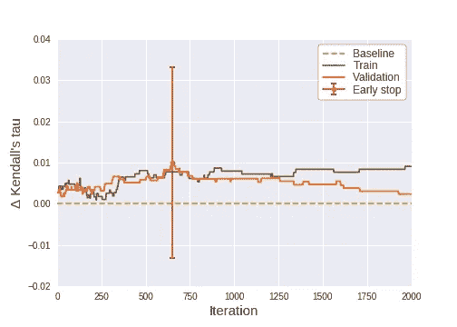**

*   **验证集的肯德尔τ的改善在梯度下降的 650 次迭代时达到峰值。此后，训练集的 Kendall tau 改进总体上继续上升，而验证集的 Kendall tau 改进急剧下降。**
*   **因此，很明显，对于男性滑冰运动员，我们应该在逻辑回归模型的 650 次迭代时停止梯度下降算法。这导致验证集的肯德尔τ值比基线模型平均提高了 0.01。**
*   **然而，这种改善是高度可变的:与基线模型相比，一些年份的 Kendall tau 有非常高的改善，而一些年份的模型表现低于基线(有关更多详细信息，请参见下面的结果部分)。**

# **训练集的结果**

## **男子滑冰运动员**

**对于 2017 赛季男子滑冰运动员的熟悉示例，我们显示了之前 5 个模型中每个模型的归一化分数，然后是 Borda 分数，最后是上述逻辑回归模型的组合分数(在梯度下降的 650 次迭代处停止)。**

**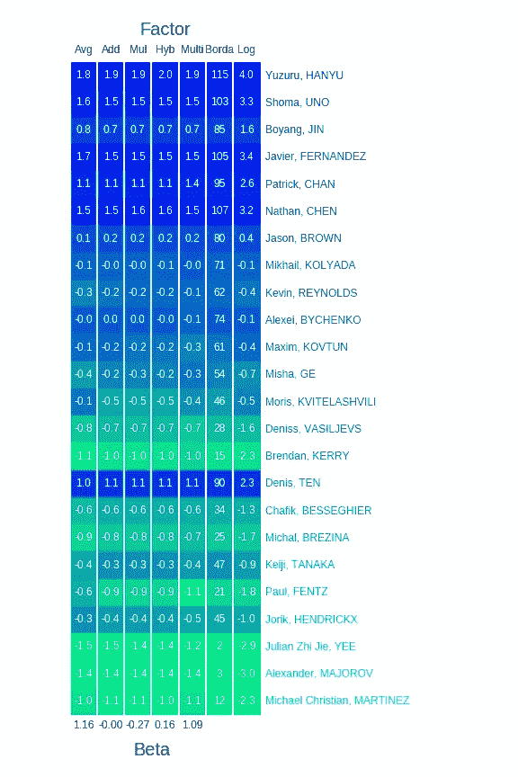**

****First 4 columns:** normalized scores in each factor. **Last 2 columns:** combined score from Borda count and logistic regression model. **Heatmap color:** rank of a skater in each model. **Text color:** rank of a skater in the world championship**

**从随附的所有 7 款车型的预测排名热图中，我们看到:**

*   **每个模型的标准化分数在之前的 5 个模型中非常相似。因此，他们的排名也非常相似，正如热图颜色显示的每个模型的选手排名所示。**
*   **因此，通过 Borda 计数的排名大部分保留了以前模型的排名，因为 Borda 计数只不过是这些模型中排名点的总和。**
*   **类似地，对于逻辑回归模型，通过跨 5 个先前模型的标准化分数的线性组合对溜冰者进行排名将给出与那些原始排名非常相似的预测排名。**
*   **有趣的是，逻辑回归模型(热图底部)的模型系数β在之前的 5 个模型中有很大不同:最大的(1.16)属于平均得分模型，最小的(-0.27)属于乘法模型。但是，请注意，这些分数在模型之间高度[共线](https://en.wikipedia.org/wiki/Multicollinearity)。因此，我们不应该试图解释模型系数，因为它们可能是高度可变的，正如在这种情况下明显证明的那样。**

**为了可视化预测排名之间的关系，我们可以为 2017 赛季并排绘制它们(下图中的底部面板)，以及我们开发的 7 个排名模型中每个模型的肯德尔 tau 到基线模型的差异(顶部面板):**

**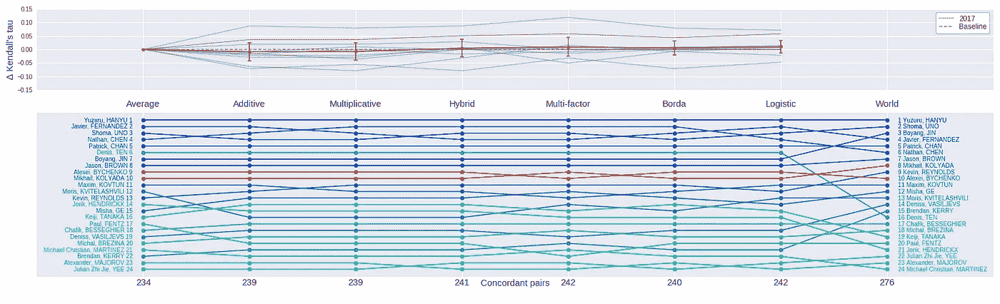**

**Each gray line in the top panel corresponds to each of the 10 seasons in the training set. Colors in bottom panel are based on the 2017 world championship ranking.**

**从上图中，我们看到:**

*   **Borda 计数确实起到了在之前的 5 个排名模型中一致认可的计数的作用。比如这 5 款中有 4 款把阿列克谢、拜琴科排在米凯尔、科里亚达之上。只有多因素模型将它们反向排列。然而，如上图中用红色突出显示的，Borda 计数将与大多数排名一致，而不是多因素模型的单独排名。**
*   **与之前的 5 个模型相比，无监督方法(Borda 计数)和有监督方法(逻辑回归)都没有在排序准确性方面提供任何显著的改进。这可以从 2017 赛季男子滑冰运动员排名时这两个型号的一致对数量中看出(在 276 对有序对中，分别为 240 对和 242 对)。**
*   **这也可以在相对于这两种方法的基线模型的平均 Kendallτ改善中看出:与季节平均值的基线模型相比，这两种方法都没有在 Kendallτ方面提供任何统计上显著的改善，正如它们在 0 处穿过水平线的 95%置信区间所证明的那样(在下表中重复)。换句话说，他们的表现和之前的 5 款车型一样平庸。**

**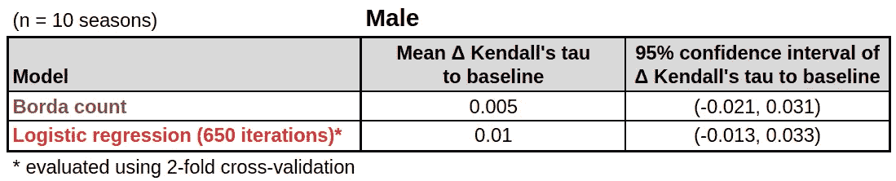**

## **说明**

**Borda 计数和逻辑回归模型的平庸表现完全说得通。这是因为它们本身只是之前五个排名的组合，这五个排名彼此非常相似。因此，如果一名选手在之前的排名中排名靠后，他的排名在 Borda 计数或逻辑回归模型中就不可能上升。**

**相比之下，我们在上面的图表中看到，滑冰运动员在世界锦标赛中可以做出令人惊讶的跳跃和排名下降。这意味着排名模型的平庸结果很大程度上是由于世界锦标赛本身的不可预测性。**

**此外，在一些赛季中，大多数预测排名的表现优于赛季平均基线模型，而在其他赛季中，它们的表现一直不佳。换句话说，仅仅因为大多数排名模型在一个季节表现良好，并不意味着在下一个季节没有什么时髦的事情发生。**

**这种季节与季节之间的高度可变性是为什么尽管大多数模型平均来说对基线模型提供了微小的改进，但是这些改进每年变化如此之大，以至于它们最终根本不具有统计显著性。这可以从所有排名模型的 Kendall 的 tau 改进在零处穿过水平线的 95%置信区间中看出。**

## **女子滑冰运动员**

**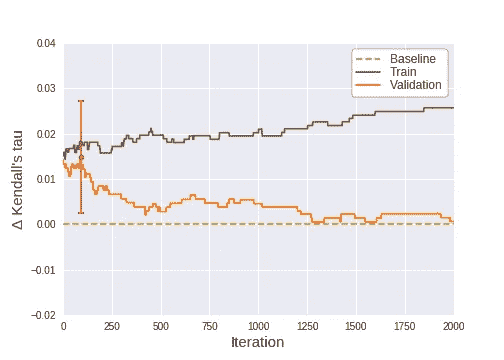**

**对于女性滑冰运动员，逻辑回归模型在 92 次迭代的验证集中对肯德尔τ的改善最大(见上图)。下表总结了无监督方法(Borda 计数)和有监督方法(逻辑回归)结合女性滑冰运动员先前排名的表现:**

**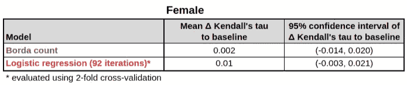**

**从上面的图和表中，我们看到逻辑回归模型(在 92 次迭代时停止)提供了非常乐观的结果，与基线模型相比，肯德尔τ的平均改善为 0.01。此外，这种改善在统计上几乎是显著的，因为其 95%的置信区间几乎高于水平线零。**

**但是，请注意，在优化排名模型时，我们已经在训练集中使用了所有 10 个赛季的世界冠军排名，例如，当选择理想的迭代来停止多因素模型或逻辑回归模型时。因此，上面发布的结果很可能在一定程度上过度适应了训练集，并且可能过于乐观。**

**因此，我们通过在测试集上对所有 7 个排名模型进行基准测试来结束项目，该测试集包括我们迄今尚未分析的 5 个赛季。这个测试集上的基准测试结果将为我们的模型提供更客观的评估。**

# **测试集的结果**

**在我们评估测试集中 5 个赛季的 7 个排名模型之前，我们使用训练集中的所有 10 个赛季来重新训练它们。我们还在通过 2 重交叉验证选择的理想迭代处停止相关模型。我们还选择了 2019 年的最新一季，以展示测试集中一季的不同预测排名。**

## **男子滑冰运动员**

**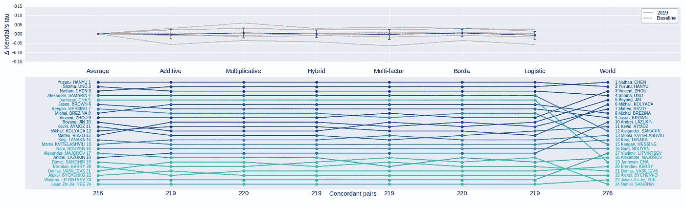**

**Each gray line in the top panel corresponds to each of the 5 seasons in the test set. Colors in bottom panel are based on the 2019 world championship ranking.**

**从上图中，我们可以看到:**

*   **2019 年的世界锦标赛比 2017 年的锦标赛更不可预测，因为所有型号在前一季的协和对数量(约 220 对)远低于后一季(约 240 对)。**
*   **对于 2019 赛季，所有车型的预测排名基本相同。此外，我们开发的所有模型都优于季节平均值的基线模型，该模型在 276 个有序对中仅预测了 216 个正确对。**
*   **然而，当在测试集中对 5 个季节进行平均时，这种改善在很大程度上是不显著的，因为对于所有模型，Kendall 的 tau 改善的 95%置信区间在零处穿过水平线。这种情况的根本原因与训练集中的原因相同:有一些赛季，如 2019 年，排名模型的表现优于基线模型，但仍有一些赛季与基线相比，他们的表现一直不佳。这种较高的季节间可变性一直是排名模型的一个持续问题，甚至可以追溯到第一部分。**

**上述结果总结在下表中。请注意，与训练集相比，大多数模型在测试集中的性能较低，这证实了我们之前对训练集性能过于乐观的怀疑。**

**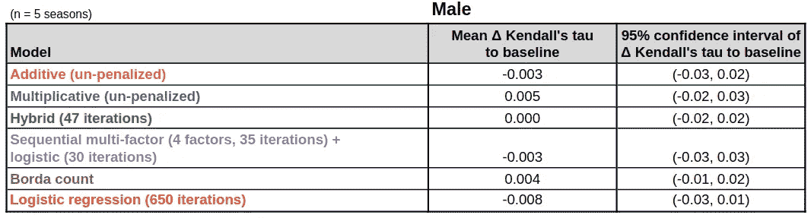**

## **女子滑冰运动员**

**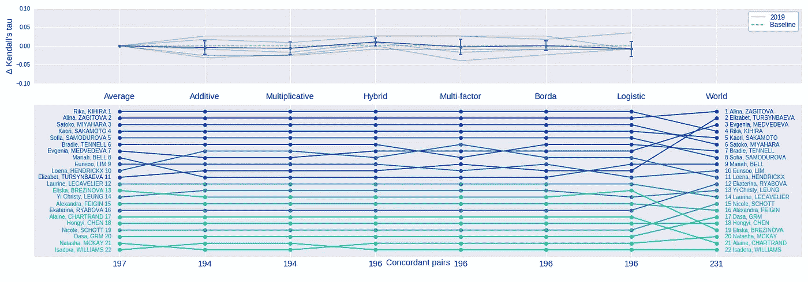**

**Each gray line in the top panel corresponds to each of the 5 seasons in the test set. Colors in bottom panel are based on the 2019 world championship ranking.**

**女性滑冰运动员的情况也好不到哪里去:大多数模特在 2019 赛季的表现都低于赛季平均水平的基线模型，这从她们相对较少的和谐对数量(在 231 对有序对中)可以看出。平均而言，除了可能的混合模型之外，他们也没有在基线模型上提供 Kendall 的显著改善，因为他们的 95%置信区间都在零处穿过水平线。这些结果总结在下表中:**

**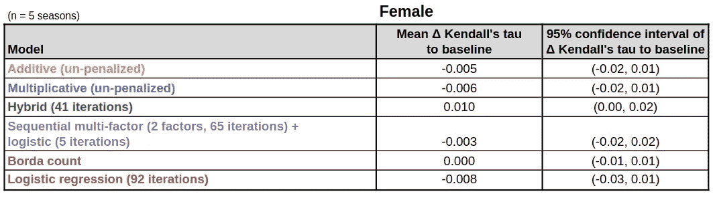**

# **结论**

**如果有一件事你应该从阅读我的项目中学到，那就是:**预测体育运动很难！**这一点在本项目开发的所有车型的不同季节表现的高度可变性中显而易见。即使是最有潜力的——多因素模型结合逻辑回归——仍然无法克服这种可变性，即使我们直接使用世界锦标赛排名来训练它。**

**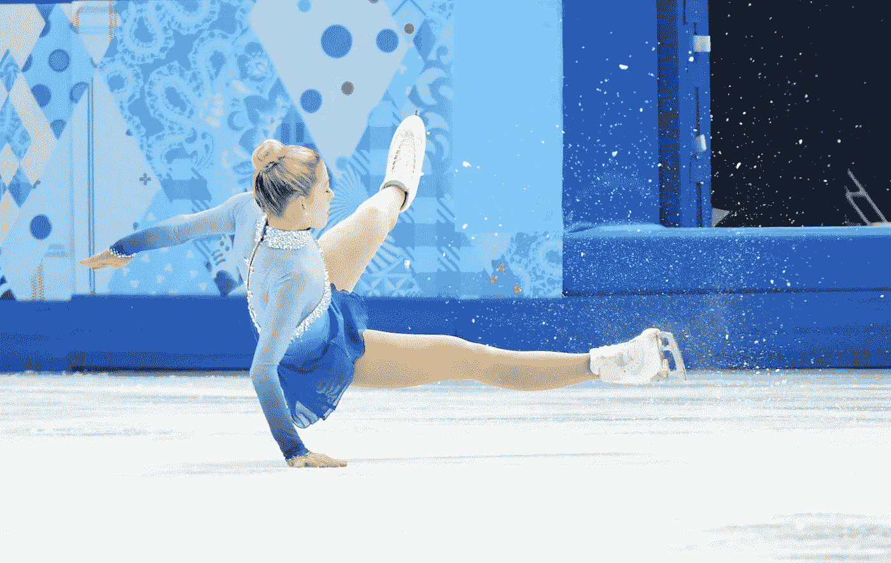**

**Ice, number one nemesis of ranking models**

**因此，模型的未来改进包括:**

*   **按顺序对待每个季节，而不是分别对待。这可以潜在地使用[贝叶斯框架](https://en.wikipedia.org/wiki/Bayesian_linear_regression)来完成:前一季的逻辑回归系数的后验被用作下一季的先验。或者，可以使用[递归神经网络](https://en.wikipedia.org/wiki/Recurrent_neural_network)，其中运动员潜在得分用作内部状态，并且当遇到新的赛季得分时被顺序更新。**
*   **使用非线性模型，例如具有非线性核的[支持向量机](https://en.wikipedia.org/wiki/Support-vector_machine)，来组合潜在因素以及模型分数。这将捕捉到不同因素之间的相互作用，我们希望每个季节都保持一致。**

**最后，这个项目在构建一个新问题(花样滑冰运动员排名)方面教会了我很多，在大多数数据科学家熟悉的任务方面:线性回归、矩阵分解、逻辑回归，甚至像 Borda 计数这样简单的事情。许多人“啊哈！”我在项目中遇到的时刻是难以形容的！**

# **资源**

**在项目的这一部分，我们使用非监督(Borda 计数)和监督方法(逻辑回归)结合了前 5 个模型的排名。这是众多排名聚合方法中的两种，这种方法在像投票理论一样古老的领域和像信息检索一样新的领域都会遇到——想想谷歌的 [PageRank](https://en.wikipedia.org/wiki/PageRank) 算法。在这篇[文章](https://academic.oup.com/bib/article/20/1/178/4091291)中可以找到对排名汇总方法的全面概述。**

**最后，感谢您通读了我的项目报告的 6 个长部分。我希望你能学到一些有用的技术来帮助你解决体育预测问题，或者简单地获得一些关于如何将普通数据科学技术应用于像这样的独特问题的见解。如果您有任何进一步的问题或反馈，请不要犹豫通过媒体与我联系！**