# 用你自己的神经网络预测癌症肿瘤的恶性程度

> 原文：<https://towardsdatascience.com/predict-malignancy-in-breast-cancer-tumors-with-your-own-neural-network-and-the-wisconsin-dataset-76271a05e941?source=collection_archive---------4----------------------->

## 在这个系列的最后一部分，我们使用我们从头编码的网络来预测乳腺癌肿瘤的恶性程度。

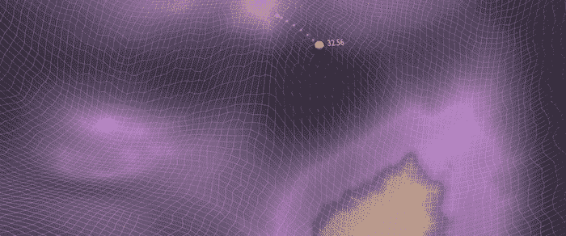

[**在本系列**](/the-keys-of-deep-learning-in-100-lines-of-code-907398c76504)的第 1 部分中，我们深入了解了**我们的神经网络**的架构。 [**在第二部**](/coding-a-2-layer-neural-network-from-scratch-in-python-4dd022d19fd2)**中，我们**用 Python 构建了它。**我们还深入了解了反向传播和梯度下降优化算法。**

**在****最终第 3 部分中，**我们将使用**威斯康星癌症数据集。我们将学会准备我们的数据，通过我们的网络运行它，并分析**结果。****

****是时候探索我们网络的损失情况了。****

****Navigating the Loss Landscape within deep learning training processes. Variations include: Std SGD, LR annealing, large LR or SGD+momentum. Loss values modified & scaled to facilitate visual contrast. Visuals by Javier Ideami@ideami.com****

# ****打开网络****

****为了打开我们的网络，**我们需要一些燃料，**我们需要**数据**。****

*   ****我们将使用与乳腺癌肿瘤检测相关的真实数据集。****
*   ****数据来自于 [**威斯康辛癌症数据集**](https://archive.ics.uci.edu/ml/machine-learning-databases/breast-cancer-wisconsin/breast-cancer-wisconsin.names) **。******
*   ****这些数据是由麦迪逊的威斯康星大学医院和威廉·h·沃尔伯格博士收集的。****
*   ****应数据所有者的要求，我们提及与数据集相关的一项研究:O. L. Mangasarian 和 W. H. Wolberg:“通过线性规划进行癌症诊断”，《暹罗新闻》，第 23 卷，第 5 期，1990 年 9 月，第 1 和 18 页。****
*   ****csv 格式的数据可以通过[链接](https://archive.ics.uci.edu/ml/machine-learning-databases/breast-cancer-wisconsin/breast-cancer-wisconsin.data)下载****
*   ****在这个 [**Github 链接**](https://github.com/javismiles/Deep-Learning-predicting-breast-cancer-tumor-malignancy) ，可以访问项目的所有代码和数据。****

****[](https://github.com/javismiles/Deep-Learning-predicting-breast-cancer-tumor-malignancy) [## javismiles/深度学习预测乳腺癌肿瘤恶性肿瘤

### 用 Python 从头开始编码的 2 层神经网络预测癌症恶性程度。…

github.com](https://github.com/javismiles/Deep-Learning-predicting-breast-cancer-tumor-malignancy) 

首先，我们将数据下载到我们的机器上。然后，我们使用 pandas 创建一个**数据帧，并查看它的第一行。**

```
**df = pd.read_csv('wisconsin-cancer-dataset.csv',header=None)**
df.head(5)
```

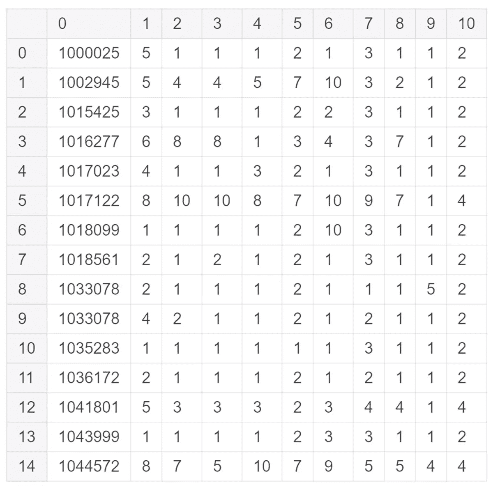

dataframe 是一种 python 数据结构，它允许我们非常容易地工作和可视化数据。

我们需要做的第一件事是理解数据的结构。我们在它的网站上找到了关于它的关键信息。

*   **共有 699 行，属于 699 名患者**
*   第一列是标识每个患者的 **ID** 。
*   下面的 **9 列是特征**，表示与检测到的肿瘤相关的不同类型的信息。它们代表与以下相关的数据:团块厚度、细胞大小的均匀性、细胞形状的均匀性、边缘粘附、单个上皮细胞大小、裸露的细胞核、平淡的染色质、正常的核仁和有丝分裂。
*   最后一列是肿瘤的类别，它有两个可能的值: **2** 表示肿瘤被发现为**良性**。 **4** 表示发现为**恶性**。
*   我们还被告知有几行包含丢失的数据。**缺失数据**在数据集中用**表示。**性格。
*   在数据集中的 699 名患者中，类别分布为:**良性:458 名(65.5%)和恶性:241 名(34.5%)**

这是有用的信息，可以让我们得出一些结论。

*   我们的目标是训练我们的神经网络，根据数据提供的特征预测肿瘤是良性还是恶性，。
*   网络的**输入将由 9 个特征**组成，9 列**表示肿瘤的不同**特征**。**
*   我们将不使用保存患者 ID 的第一列。
*   我们将**从数据集中删除任何包含丢失数据**的**行。性格)。**
*   在二进制分类的情况下，从两个类中获得较大比例的数据是有益的。我们有一个 **65%-35%的分布，**这已经足够好了。
*   良性和恶性**类**用数字 2 和 4 标识**。我们网络的最后一层通过它的 **Sigmoid** 函数输出 0 到 1 之间的值。此外，当数据设置在从 0 到 1 的范围内时，神经网络往往工作得更好。因此，我们将更改 class 列的值，对于良性情况，将值保持为 0 而不是 2，对于恶性情况，将值保持为 1 而不是 4。(我们也可以改为缩放 Sigmoid 的输出)。**

我们开始做这些改变。首先，我们将类值(在第 10 列)从 2 更改为 0，从 4 更改为 1

```
df.iloc[:,10].replace(2, 0,inplace=True)
df.iloc[:,10].replace(4, 1,inplace=True)
```

然后，我们继续删除所有包含缺失值的行(由？character)位于第 6 列，我们已将其标识为包含它们的列。

```
df = df[~df[6].isin(['?'])]
```

那个“？”字符导致 Python 将第 6 列解释为由字符串组成。其他列由整数组成。我们将整个数据帧设置为由浮点数组成。这有助于我们的网络执行复杂的计算。

```
df = df.astype(float)
```

接下来，让我们处理数据中值的范围。请注意 9 个特征中的数据是如何由超出 0 到 1 范围的数字组成的。真实的数据集通常是杂乱的，并且它们的值具有很大的范围差异:负数、列内的巨大范围差异等等。

这就是为什么**数据标准化**是深度学习过程的**特征工程**阶段中关键的第一步。

**将**数据**规格化**意味着**以一种网络更容易消化**的方式准备 it **。我们正在帮助网络更容易、更快地收敛到我们所寻求的最小值。通常，神经网络对 0 到 1 范围内的数值数据集反应良好，对平均值为 0、标准偏差为 1 的数据也反应良好。**

**特征工程和标准化**不是本文的重点，但让我们快速提及特征工程过程的这个阶段中的一些方法:

*   标准化方法的一个例子是通过对每个特征列应用**最小-最大**方法来重新调整我们的数据，使其符合 0 到 1 的范围。
    **new _ x =(x-min _ x)/(max _ x-min _ x)**
*   我们还可以应用**标准化**，它将每个特性列的值居中，设置平均值为 0，标准偏差为 1。
    **new_x = (x 均值)/std.dev**

一些数据集和场景将从这些技术中获益更多。在我们的例子中，经过一些测试后，我们决定使用 sklearn 库应用最小-最大归一化:

```
names = df.columns[0:10]
scaler = MinMaxScaler() 
**scaled_df** = scaler.fit_transform(**df**.iloc[:,0:10]) 
**scaled_df** = pd.DataFrame(**scaled_df**, columns=names)
```

让我们来看看所有这些变化之后的相同的 15 行。


*   更改后，我们有 683 行。16 个缺失数据已被删除。
*   所有的列现在都由浮点数组成，它们的值在 0 和 1 之间被规范化。(当我们稍后构建训练集时，将忽略列 0，即 id)。
*   最后一列 class 现在对良性肿瘤使用 0 值，对恶性肿瘤使用 1 值。
*   请注意，我们没有对 class 列进行规范化，因为它已经保存了 0 到 1 范围内的值，并且它的值应该保持设置为 0 或 1。
*   注意，最后一列，我们将用作目标的那一列，不需要是浮点型。它可以是整数，因为我们的输出只能是 1 或 0。(当我们训练网络时，我们将从原始的 **df** dataframe 中选取该列，该列被设置为 0 或 1)。
*   因此，我们的 **scaled_df** dataframe 包含所有规范化的列，我们将从数据集的非规范化版本 **df** dataframe 中选择 class 列。

随着我们探索更多的数据，这一过程可能会继续下去。

*   这 9 个特征都是必不可少的吗？我们要把他们都包括在培训过程中吗？
*   我们有足够的高质量数据来产生好的训练、验证和测试集吗？(稍后详细介绍)
*   研究这些数据，我们是否发现了任何有意义和有用的见解，可以帮助我们更有效地训练网络？

这些以及更多都是培训开始前进行的**功能工程流程**的一部分。

另一件有用的事情是构建图表，以不同的方式分析数据。myplotlib python 库帮助我们通过不同种类的图表来研究数据。

我们先把要研究的规格化列和 class 列结合起来，然后开始探索。

```
scaled_df[10]= df[10]scaled_df.iloc[0:13,1:11].plot.bar();
scaled_df.iloc[0:13,1:11].plot.hist(alpha=0.5)
```

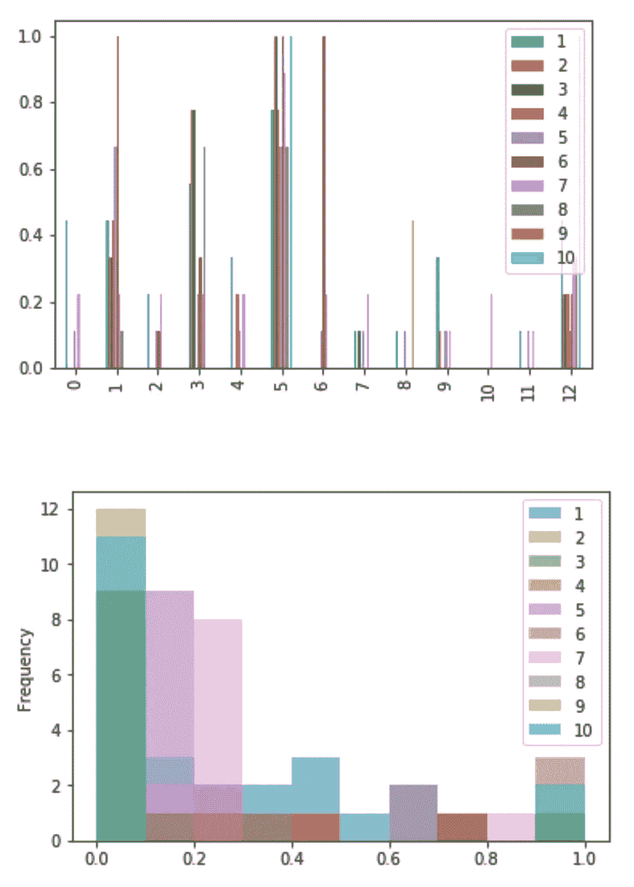

点击此链接，探索 Panda [提供的所有可视化选项](https://pandas.pydata.org/pandas-docs/stable/visualization.html)

为了加快文章的速度，在我们的例子中，我们认为 9 个特性是有用的。**我们的目标是精确预测“类”列**。

那么，**描述我们的 683 个样本和它们的输出之间的联系的函数**会有多复杂呢？

9 个特征和输出之间的关系显然是多维的和非线性的。

让我们通过网络运行数据，看看会发生什么。

在此之前，我们需要考虑一个关键话题:

*   如果我们使用 683 个样本，我们所有的样本，来创建我们的训练集，并获得良好的结果，我们将不得不面对一个关键问题。
*   **如果**网络以完全匹配训练期间使用的样本的方式设置其权重，而**未能推广到训练集**之外的新样本，该怎么办？
*   当**使用训练数据时，或者当**使用从未见过的数据时**，我们的最终目标**是否达到很高的**准确度**？显然，第二种情况。

这就是深度学习实践者通常考虑三种数据集的原因:

*   **训练集:**你用来训练网络的数据。它包含输入要素和目标标注。
*   **验证集:**一个单独的、不同的数据批次，理想情况下应该来自与训练集相同的分布。您将使用它来验证培训的质量。验证集也有目标标签。
*   **测试集**:另一批单独的数据，用于测试网络中的新相关数据，这些数据最好来自与验证集相同的分布。通常，测试集不带有目标标签。

**不同集合相对于彼此的大小**是另一个需要花些时间来描述的话题。出于我们的目的，考虑大部分数据形成了训练集，其中一小部分通常被提取(并从训练集中消除)成为验证集。

**20%** 是一个典型的数字，通常被选为构成我们验证集的数据的百分比。

要估计网络的训练质量，比较训练集和验证集的性能是很有用的:

*   如果在验证集上获得的**损失值提高，然后开始变得更差**，则网络**过度拟合**，这意味着网络已经学习了非常适合训练数据的函数，然而**没有将** **足够好地推广到验证集**。
*   过度拟合的反义词是**欠拟合**，当网络的训练性能不够好时，我们在训练集和验证集中获得的损失值都太高(例如，训练损失比验证损失更严重)。
*   理想情况下，您希望在两个数据集中获得相似的性能。
*   当我们有**过拟合**时，我们可以应用**正则化**。正则化是一种对优化算法进行更改以使网络更好地泛化的技术。正则化技术包括剔除、L1 和 L2 正则化、提前停止和数据增强技术。

总的来说，认识到验证集的成功是你真正的目标。如果网络不能很好地处理它以前没有见过的新数据，那么让网络在训练数据上表现得非常好也没有用。

因此，您真正的目标是达到一个良好的损失值，并通过验证集实现良好的准确性。

为了达到这一点，过度拟合是我们需要防止的最重要的问题之一，这就是为什么正规化如此重要。让我们快速简单地回顾一下 **4 种广泛使用的正则化技术。**

**退出**:在每一轮训练中，我们会随机关闭一些隐藏的网络单位。这可以防止网络过分强调任何特定的权重，并有助于网络更好地推广。这就好像我们通过不同的网络架构运行数据，然后平均它们的影响，这有助于防止过度拟合。

**L1 和 L2** :我们在成本函数中增加了额外的项，当权重变得太大时，这些项会惩罚网络。这些技术鼓励网络在损失值和权重比例之间找到一个好的平衡。

**过早停止:**过度适应可能是训练时间过长的结果。如果我们监控我们的验证错误，当验证错误停止改善时，我们可以停止训练过程。

**数据扩充:**通常，更多的训练数据意味着更好的网络性能，但是获取更多的数据并不总是可能的。相反，我们可以通过人为创建数据的变体来扩充现有数据。例如，在图像的情况下，我们可以应用旋转、平移、裁剪和其他技术来产生它们的新变体。

回到我们的数据。是时候挑选我们的训练集和验证集了。我们将选择 683 行中的一部分作为训练集，选择数据集的另一部分作为我们的**验证集。**

培训结束后，**我们将通过验证集再次运行流程来验证我们网络的质量**。

```
**x=scaled_df.iloc[0:500,1:10].values.transpose()
y=df.iloc[0:500,10:].values.transpose()****xval=scaled_df.iloc[501:683,1:10].values.transpose()
yval=df.iloc[501:683,10:].values.transpose()**
```

我们决定用 683 行中的 500 行来构建我们的训练集，并且我们从标准化的 **scaled_df** 数据帧中挑选它们。我们还确保删除第一列(id ),并且不包括网络的**输入 x** 中的最后一列(class)

我们使用对应于相同的 500 行的类列声明目标输出 y 。我们从原始的非规范化 **df** dataframe 中选择 class 列(因为 class 值应该保持为 0 或 1)。

然后，我们为验证集选择接下来的 183 行，并将它们存储在变量 **xval** 和 **yval** 中。

我们准备好了。我们将首先用我们的 x，y 训练集的 500 行来训练网络。**之后**，**我们将使用我们的 xval，yval 验证集**的 183 行来测试训练好的网络，以查看网络对它以前从未见过的数据的概括能力如何。

```
nn = dlnet(x,y)
nn.lr=0.01
nn.dims = [9, 15, 1]nn.gd(x, y, iter = 15000)
```

我们声明我们的网络，设置一个学习率和每层的节点数(输入有 9 个节点，因为我们使用的是 9 个特征，不算网络的一层。第一隐藏层具有 15 个隐藏单元，第二和最后一层具有单个输出节点)。

然后，我们通过几千次迭代运行梯度下降算法。让我们用几秒钟的梯度下降来感受一下网络的训练效果。

每 x 次迭代，我们显示网络的损耗值。如果训练进展顺利，**损失值将在每个周期后下降。**

```
**Cost after iteration 0: 0.673967
Cost after iteration 500: 0.388928
Cost after iteration 1000: 0.231340
Cost after iteration 1500: 0.171447
Cost after iteration 2000: 0.146433
Cost after iteration 2500: 0.133993
Cost after iteration 3000: 0.126808
Cost after iteration 3500: 0.122107
Cost after iteration 12500: 0.101980
Cost after iteration 13000: 0.101604
Cost after iteration 14500: 0.100592**
```

经过多次迭代后，我们的损失开始稳定在一个较低的水平。我们绘制了一个图表，通过迭代跟踪网络的损耗。

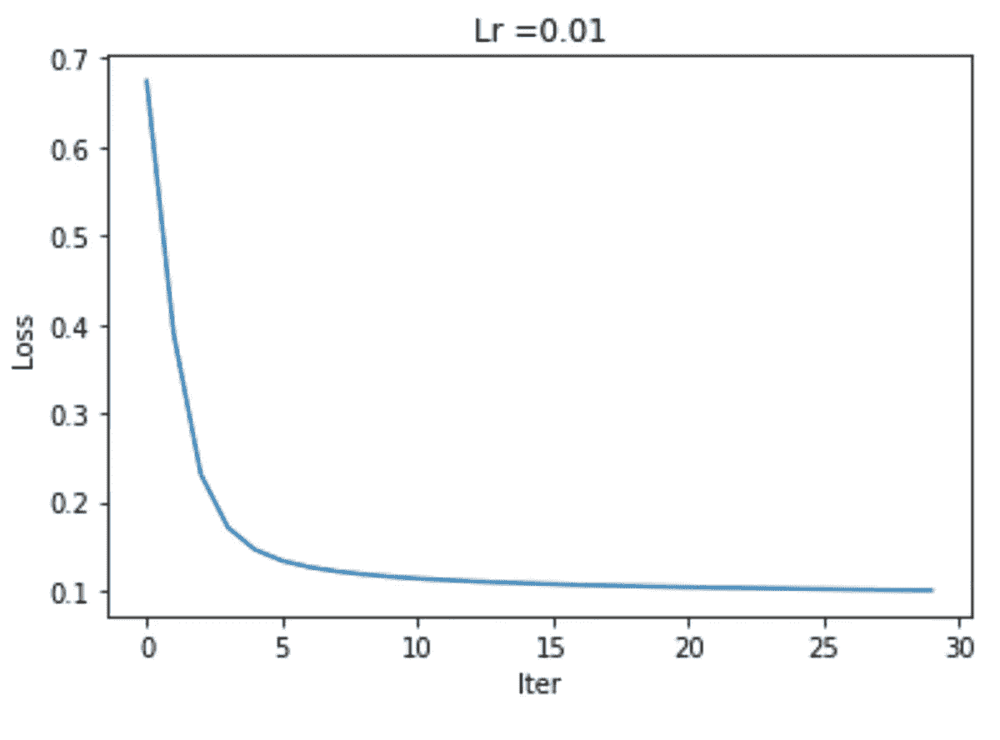

我们的网络似乎训练得相当好，达到了低损耗值(我们的预测和目标输出之间的距离很小)。但是，**有多好？**最重要的是，它有多好，不仅仅是对整个训练集，更重要的是，**对我们的验证集**？

为了找到答案，我们创建了一个新函数， **pred()** ，它通过网络运行一组输入，然后系统地将每个获得的输出与其对应的目标输出进行比较，以便**产生一个平均精度值。**

请注意下面函数是如何研究预测值是高于还是低于 0.5 的。我们正在进行二元分类，默认情况下，我们认为高于 0.5 的输出值意味着结果属于其中一个类，反之亦然。

在这种情况下，因为 1 是恶性肿瘤的类值，我们认为高于 0.5 的输出预测恶性结果，低于 0.5 则相反。**我们稍后将讨论如何、何时以及为什么要更改这个 0.5 的阈值。**

```
def pred(self,x, y):  
        self.X=x
        self.Y=y
        comp = np.zeros((1,x.shape[1]))
        pred, loss= self.forward()    

        for i in range(0, pred.shape[1]):
            if pred[0,i] > 0.5: comp[0,i] = 1
            else: comp[0,i] = 0

        print("Acc: " + str(np.sum((comp == y)/x.shape[1])))

        return comp
```

现在，我们通过调用两次 **pred** 函数，一次使用我们的训练集，另一次使用我们的验证集，来比较使用训练集和验证集时网络的准确性。

```
**pred_train = nn.pred(x, y)
pred_test = nn.pred(xval, yval)**
```

我们得到了这两个结果。

```
**Acc: 0.9620000000000003
Acc: 1.0**
```

该网络在训练集(前 500 行)上的准确率为 96%，在使用验证集(接下来的 183 行)时的准确率为 100%。

验证集上的准确率更高。这意味着网络没有过度拟合，并且**泛化得足够好**能够适应它以前从未见过的数据。

我们现在可以使用 nn.forward()函数直接比较与目标输出相关的验证集输出的前几个值:

```
nn.X,nn.Y=xval, yval 
yvalh, loss = nn.forward()
print("\ny",np.around(yval[:,0:50,], decimals=0).astype(np.int))       
print("\nyh",np.around(yvalh[:,0:50,], decimals=0).astype(np.int),"\n")
```

我们得到了

```
**y [[0 0 0 1 0 0 1 1 0 0 0 0 0 0 1 0 0 0 0 0 0 0 0 0 0 0 0 0 0 0 1 0 0 1 0 0
  0 0 0 0 0 0 0 0 0 0 0 0 0 1]]****yh [[0 0 0 1 0 0 1 1 0 0 0 0 0 0 1 0 0 0 0 0 0 0 0 0 0 0 0 0 0 0 1 0 0 1 0 0
  0 0 0 0 0 0 0 0 0 0 0 0 0 1]]**
```

两个**完全匹配**，因为我们已经在验证集上实现了 **100%的准确性**。

因此，该函数很好地学习了**以适应训练集和验证集。**

分析准确性的一个很好的方法是绘制一个混淆矩阵。首先，我们声明一个自定义绘图函数。

```
def plotCf(a,b,t):
    cf =confusion_matrix(a,b)
    plt.imshow(cf,cmap=plt.cm.Blues,interpolation='nearest')
    plt.colorbar()
    plt.title(t)
    plt.xlabel('Predicted')
    plt.ylabel('Actual')
    tick_marks = np.arange(len(set(expected))) # length of classes
    class_labels = ['0','1']
    tick_marks
    plt.xticks(tick_marks,class_labels)
    plt.yticks(tick_marks,class_labels)
    # plotting text value inside cells
    thresh = cf.max() / 2.
    for i,j in itertools.product(range(cf.shape[0]),range(cf.shape[1])):
        plt.text(j,i,format(cf[i,j],'d'),horizontalalignment='center',color='white' if cf[i,j] >thresh else 'black')
    plt.show();
```

(这个自定义的混淆矩阵函数来自[JP 创建的](https://www.kaggle.com/jprakashds/confusion-matrix-in-python-binary-class)这个公共 Kaggle)

然后，我们再次运行 pred 函数两次，并为训练集和验证集绘制混淆矩阵。

```
**nn.X,nn.Y=x, y 
target=np.around(np.squeeze(y), decimals=0).astype(np.int)
predicted=np.around(np.squeeze(nn.pred(x,y)), decimals=0).astype(np.int)
plotCf(target,predicted,'Cf Training Set')****nn.X,nn.Y=xval, yval 
target=np.around(np.squeeze(yval), decimals=0).astype(np.int)
predicted=np.around(np.squeeze(nn.pred(xval,yval)), decimals=0).astype(np.int)
plotCf(target,predicted,'Cf Validation Set')**
```

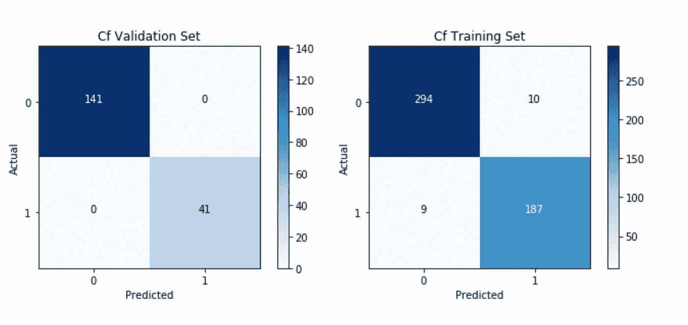

我们可以更清楚地看到，我们的验证集在其 183 个样本上具有完美的准确性。至于训练集，500 个样本中有 19 个错误。

现在，在这一点上，你可能会说，在像诊断肿瘤这样微妙的主题中，如果乙状结肠输出给出高于 0.5 的值，则将我们的预测设置为 1 并不是很好。在给出恶性肿瘤的预测之前，网络应该非常有信心。

我完全同意，那是非常正确的。这些都是你需要根据挑战的性质和你要处理的主题做出的决定。

然后，让我们创建一个名为**阈值**的新变量。它将控制我们的**置信阈值，在我们确定肿瘤是恶性肿瘤之前，网络的输出需要多接近 1。默认情况下，我们将其设置为 0.5**

```
**self.threshold=0.5**
```

外部预测函数现在被更新以使用**置信度阈值。**

```
def pred(self,x, y):  
        self.X=x
        self.Y=y
        comp = np.zeros((1,x.shape[1]))
        pred, loss= self.forward()    

        for i in range(0, pred.shape[1]):
            **if pred[0,i] > self.threshold: comp[0,i] = 1**
            else: comp[0,i] = 0

        print("Acc: " + str(np.sum((comp == y)/x.shape[1])))

        return comp
```

现在，让我们随着置信度阈值的逐渐提高来比较我们的结果。

**置信度阈值:0.5。**输出值需要高于 0.5 才能被视为恶性输出。如前所述，验证准确率为 100%，训练准确率为 96%。

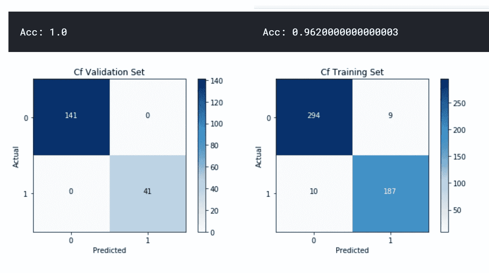

**置信度阈值:0.7。**输出值需要高于 0.7 才能被视为恶性输出。验证准确率保持在 100%，训练准确率下降到 95%。

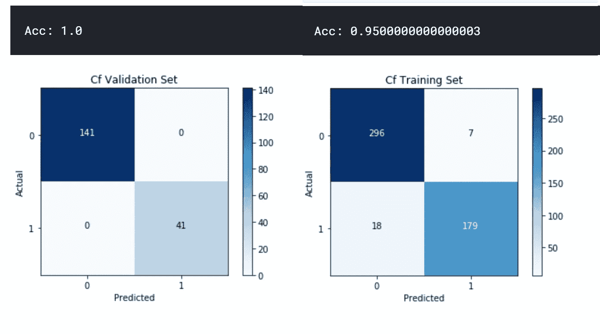

**置信度阈值:0.8。**输出值需要高于 0.8 才能被视为恶性输出。第一次验证准确率非常非常轻微地下降到 99.45%。在混淆矩阵中，我们看到 183 个样本中有 1 个没有被正确识别。训练精度下降更多，直到 94.2%

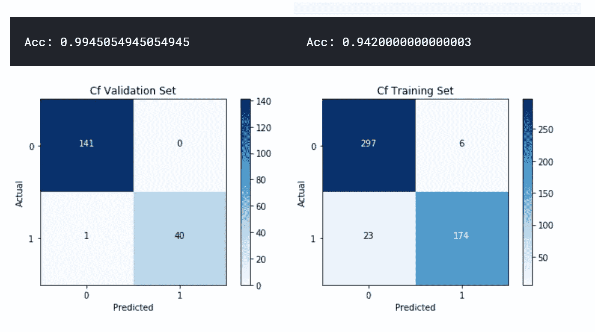

**置信度阈值:0.9。**最后，在 0.9 的情况下，输出值需要高于 0.9 才能被视为恶性输出。我们正在寻找几乎完全的信心。验证准确度稍微下降，直到 98.9%。在混淆矩阵中，我们看到 183 个样本中有 2 个没有被正确识别。训练准确率进一步下降到 92.6%。


因此，通过控制置信度阈值，我们可以适应挑战的特定需求。

如果我们想要降低与我们的训练集相关的损失值(因为我们未能识别一小部分训练样本)，我们可以尝试训练更长时间，并且还可以使用不同的学习率。

**例如**，如果我们设置学习率为 0.07，训练 65000 次迭代，我们得到:

```
**Cost after iteration 63500: 0.017076
Cost after iteration 64000: 0.016762
Cost after iteration 64500: 0.016443
Acc: 0.9980000000000003
Acc: 0.9945054945054945**
```

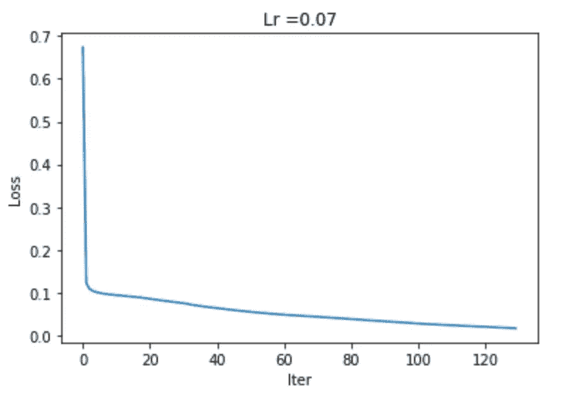

现在，将我们的置信阈值设置为 0.5，网络对两组中的每个样本都是准确的，除了每组中的一个样本。

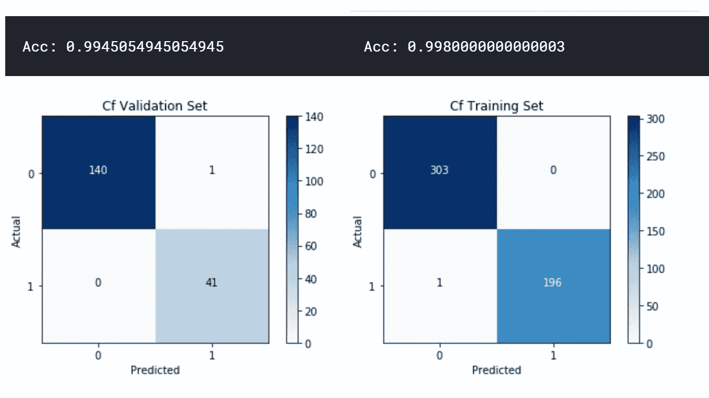

如果我们将置信度阈值提高到 0.7，性能仍然很好，只有 1 个验证样本和 2 个训练样本没有被正确预测。

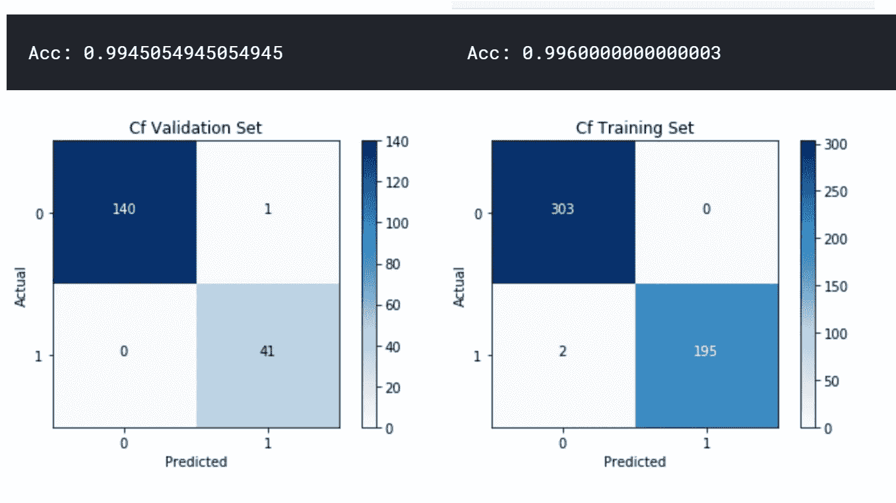

最后，如果我们真的要求很高，并且将置信度阈值设置为 0.9，则网络无法正确猜测 1 个验证样本和 10 个训练样本。

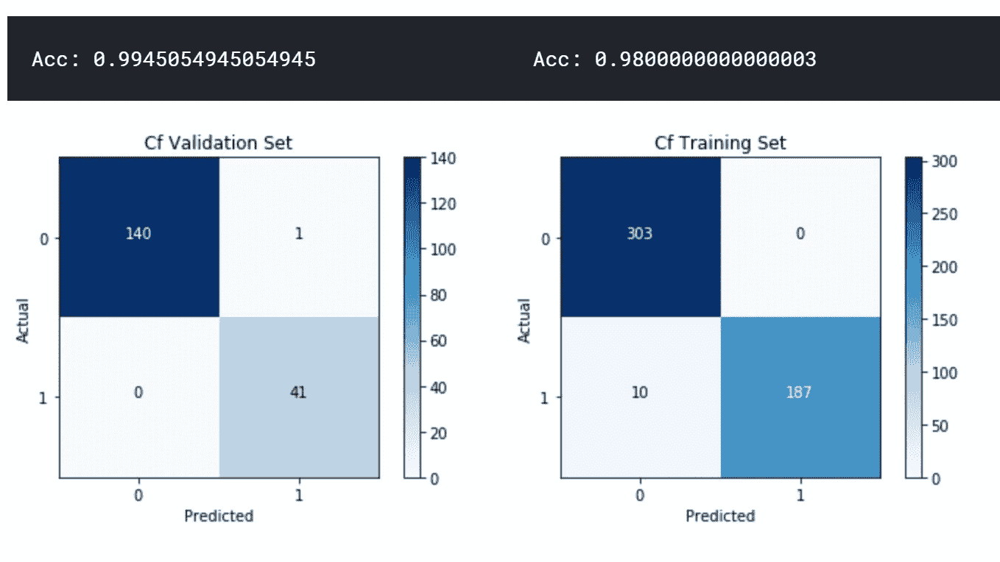

虽然我们做得很好，但考虑到我们使用的是没有正规化的基本网络，当您处理更复杂的数据时，事情通常会变得更加困难。

通常情况下，亏损局面**会变得非常复杂**，而且**更容易**陷入错误的局部最小值，或者**无法收敛**到足够好的亏损。

此外，根据网络的初始条件，我们可能会收敛到一个好的极小值，或者我们可能会在某处停滞不前，无法摆脱它。在这个阶段，再次描绘我们的初始动画是很有用的。


Navigating the Loss Landscape. Values have been modified and scaled up to facilitate visual contrast.

想象一下这样的风景，到处都是山丘和山谷，有些地方损耗很高，有些地方损耗很低。与复杂场景相关的损失函数的情况通常不一致(虽然可以使用不同的方法使其更加平滑，但这是一个完全不同的主题)。

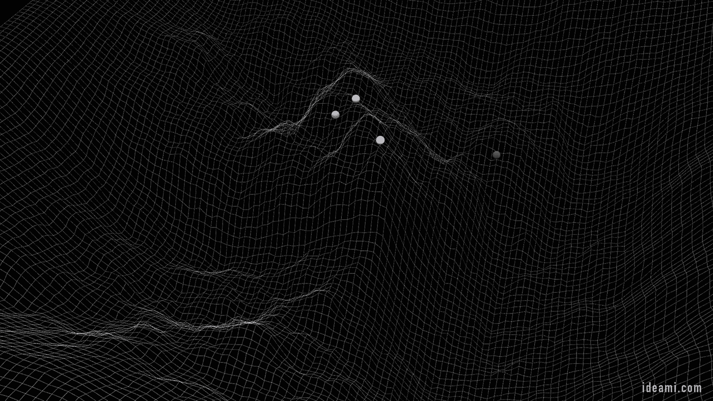

到处都是深浅不一、角度各异的**山丘和山谷**。**运行梯度下降算法时，您可以通过改变网络的损失值来改变地形**。


并且你移动的速度由**学习率控制:**

*   如果你移动得非常慢，不知何故到达了一个不够低的高原或山谷，你可能会被困在那里。
*   如果你走得太快，你可能会到达一个足够低的山谷，但穿过它，并以同样快的速度离开它。

因此，有些非常微妙的问题会对您的网络性能产生巨大影响。

*   **初始条件:**在流程开始时，你把球丢在景观的哪个部分？


*   **你移动球的速度**，学习率。

最近**在提高神经网络训练速度方面取得的许多进展**都与不同的技术有关，这些技术**动态地管理学习率**，也与以更好的方式设置初始条件的新方法有关。

**关于初始条件:**

*   记住，每一层计算前一层的权重和输入的组合(输入的**加权和**),并将该计算传递给该层的激活函数。
*   这些激活函数的形状可以加速或停止神经元的动态变化，这取决于输入范围和它们对该范围的反应方式之间的组合。
*   例如，如果 sigmoid 函数接收的值触发了接近其输出范围极值的结果，则激活函数在该范围部分的输出会变得非常平坦。如果它在一段时间内保持不变，导数，在那一点的变化率变为零或者非常小。
*   回想一下**是导数帮助我们决定下一步**的走向。因此，如果导数没有给我们提供有意义的信息，网络将很难知道从该点开始下一步的方向。
*   就好像你已经到达了风景中的一个高原，你真的不知道下一步该去哪里，你只是不停地绕着那个点转圈。
*   ReLU 也可能发生这种情况，尽管 ReLU 只有 1 个平面，而不是 2 个乙状结肠和 Tanh。 **Leaky-ReLU** 是 ReLU 的一个变种，它稍微修改了函数的那一面(平坦的那一面),试图防止渐变消失。

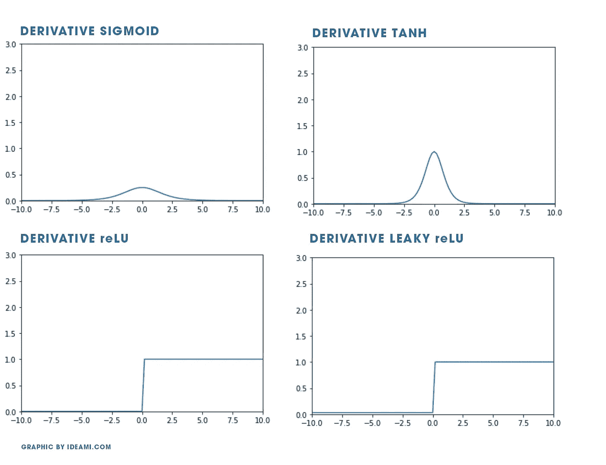

因此，**以可能的最佳方式**设置我们的权重的初始值是至关重要的，以便在训练过程开始时单元的计算产生落入我们的激活函数的最佳可能范围内的输出。

这可能会使从开始的整个**区别成为一个真正高的损失或更低的损失。**


**管理学习率**以防止训练过程太慢或太快，并**使其值适应过程和每个参数的变化条件**，是另一个复杂的挑战

谈论处理初始条件和学习率的许多方法需要几篇文章。我将简要描述其中的一些方法，让专家们了解一些应对这些挑战的方法。

*   **Xavier 初始化:**一种初始化我们的权重的方法，这样神经元就不会开始处于饱和状态(陷入输出范围的微妙部分，在那里导数无法为网络提供足够的信息来知道下一步去哪里)。
*   **学习率退火**:高学习率会推动算法绕过并错过损失景观处的良好最小值。逐渐降低学习速度可以防止这种情况。有不同的方法来实现这种减少，包括:指数衰减、阶跃衰减和 1/t 衰减。
*   **fast . ai Lr _ find()**:fast . ai 库的一种算法，为学习率寻找理想的取值范围。 **Lr_find** 通过几次迭代训练模型。它首先尝试使用一个非常低的学习速率，并在每个小批量中逐渐改变速率，直到它达到一个非常高的值。每次迭代都会记录损失，一个图表可以帮助我们将损失与学习速度进行对比。然后，我们可以决定以最有效的方式减少损失的学习率的最佳值。
*   **不同的学习率**:在我们网络的不同部分使用不同的学习率。
*   **SGDR，带重启的随机梯度下降**:每 x 次迭代重置我们的学习率。如果我们陷入其中，这可以帮助我们走出不够低的高原或局部极小值。典型的过程是从高学习率开始。然后在每一个小批量中逐渐减少。经过 x 个周期后，您将其重置回初始高值，并再次重复相同的过程。这个概念是，从高速率逐渐移动到较低的速率是有意义的，因为我们首先从景观的高点(初始高损耗值)快速向下移动，然后缓慢移动以防止绕过景观的最小值(低损耗值区域)。但是，如果我们在某个不够低的高原或山谷中停滞不前，那么每 x 次迭代就将我们的速率重新设置为一个较高的值，这将有助于我们跳出这种情况，继续探索这一领域。
*   **1 周期策略:**les lie n . Smith 提出的一种动态改变学习速率的方式，我们从一个较低的速率值开始，逐渐增加，直到达到最大值。然后，我们继续逐渐减少它，直到过程结束。最初的逐渐增加允许我们探索大面积的损失景观，增加我们到达不颠簸的低区域的机会；在循环的第二部分，我们在我们到达的低平地区安顿下来。
*   **动量**:随机梯度下降的一种变化，有助于加速通过损失景观的路径，同时保持总体方向受控。回想一下，SGD 可能很吵。动量平均化路径中的变化，使路径变得平滑，并加速向目标的移动。
*   **自适应学习率:**为网络的不同参数计算和使用不同学习率的方法。
*   **AdaGrad** ( **自适应梯度算法):**
    结合上一点，AdaGrad 是 SGD 的变体，它不是对所有参数使用单一的学习速率，而是对每个参数使用不同的速率。
*   **均方根传播** (RMSProp):像 Adagrad 一样，RMSProp 对每个参数使用不同的学习速率，并根据它们变化的平均速度来调整这些速率(这在处理嘈杂的环境时很有帮助)。
*   **亚当**:它结合了 RMSprop 和 SGDR 的一些方面与动力。像 RMSprop 一样，它使用平方梯度来缩放学习速率，并且它还使用梯度的平均值来利用动量。

如果你对这些名字都不熟悉，不要不知所措。**在它们大多数的背后是非常相同的根:反向传播和梯度下降。**

此外，在现代框架(如 fast.ai 库)中，许多这些方法都是自动为您选择的。理解它们是如何工作的是非常有用的，因为这样你就能更好地做出自己的决定，甚至研究和测试不同的变化和选择。**** 

# **理解意味着更多的选择**

**当我们理解了网络的核心，基本的反向传播算法和基本的梯度下降过程，每当我们面临艰难的挑战时，我们就有更多的选择去探索和实验。**

**因为我们了解这个过程，所以我们意识到，例如在深度学习中，**我们在损失范围内的初始位置是关键。****

**一些初始位置会很快推动球(训练过程)卡在景观的某个部分。其他人会很快把我们逼到一个很好的最小值。**

****

**当神秘函数变得更加复杂时，就是时候加入我前面提到的一些高级解决方案了。现在也是时候更深入地研究整个网络的架构，并更深入地研究不同的超参数。**

# **浏览风景**

**我们的损失状况在很大程度上受到网络架构设计以及超参数的影响，如学习率、我们的批量大小、我们使用的优化算法等。**

**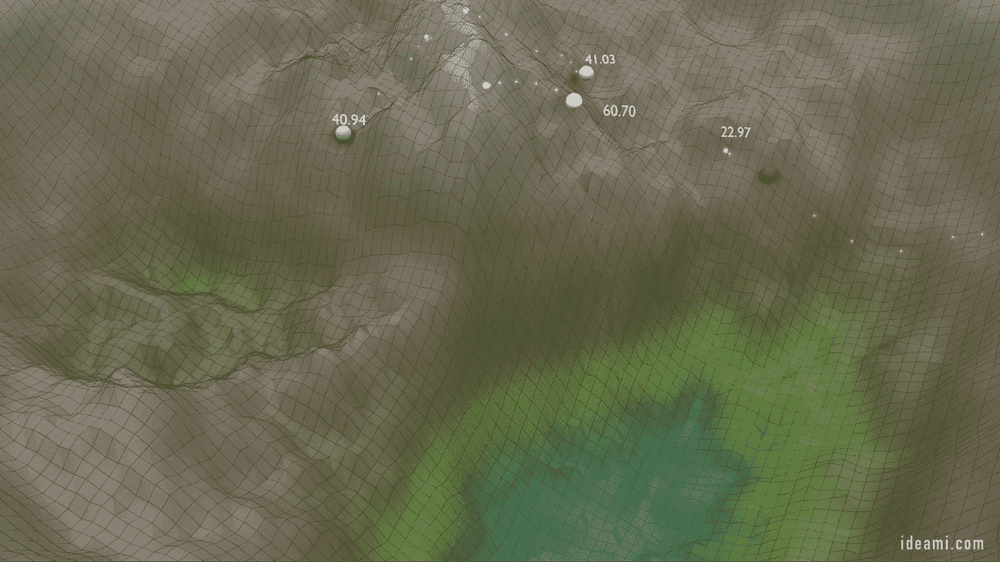******

**有关这些影响的讨论，请查看这篇论文:[李浩、、加文·泰勒、克里斯托夫·斯图德、汤姆·戈尔茨坦的《可视化神经网络的损失景观》](https://arxiv.org/abs/1712.09913)。**

**最近的研究得出了一个非常有趣的观点，即神经网络中的**跳过连接**模型如何平滑我们的损失景观，并使它变得更加简单和凸，增加我们收敛到好结果的机会。**

****

**Navigating the Loss Landscape. Values have been modified and scaled up to facilitate visual contrast.**

****跳过连接对训练非常深的网络帮助很大。**基本上，跳过连接是链接不同层的节点的额外连接，跳过中间的一个或多个非线性层。**

**当我们**用不同的架构和参数实验**时，我们**正在修改我们的损失场景**，使其更加崎岖或平滑，增加或减少局部最优解的数量。当我们优化初始化网络参数的方式时，我们正在提高我们的起点。**

**让我们继续探索新的方法来应对世界上最迷人的挑战。**

****

**Navigating the Loss Landscape. Values have been modified and scaled up to facilitate visual contrast.**

**这篇文章涵盖了基础知识，从这里开始，**前途无量**！**

****链接到本文的 3 个部分:**
[**第 1 部分**](/the-keys-of-deep-learning-in-100-lines-of-code-907398c76504) | [**第 2 部分**|](/coding-a-2-layer-neural-network-from-scratch-in-python-4dd022d19fd2)|[**第 3 部分**](/predict-malignancy-in-breast-cancer-tumors-with-your-own-neural-network-and-the-wisconsin-dataset-76271a05e941)**

**[**Github 仓库里有这个项目的所有代码**](https://github.com/javismiles/Deep-Learning-predicting-breast-cancer-tumor-malignancy)**

**[](https://github.com/javismiles/Deep-Learning-predicting-breast-cancer-tumor-malignancy) [## javismiles/深度学习预测乳腺癌肿瘤恶性肿瘤

### 用 Python 从头开始编码的 2 层神经网络预测癌症恶性程度。…

github.com](https://github.com/javismiles/Deep-Learning-predicting-breast-cancer-tumor-malignancy)**