# 用海报预测电影收入

> 原文：<https://towardsdatascience.com/predict-movie-earnings-with-posters-786e9fd82bdc?source=collection_archive---------29----------------------->

## 用电影海报确定电影的类型和收益

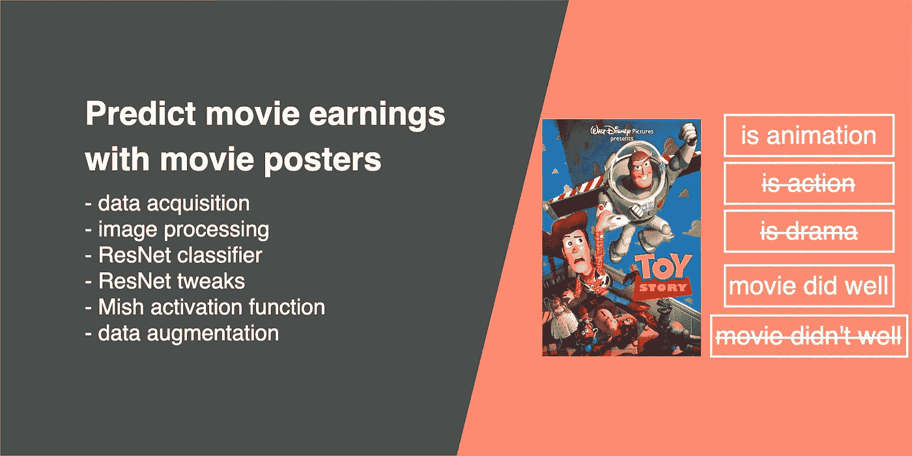

如果你有一部夏季大片或一部短片，抓住观众注意力和兴趣的最佳方式是什么？两个最突出的方法是显而易见的:海报和预告片。

电影海报传达了电影的基本信息，如片名、主题、人物、演员以及电影制作人。电影海报可以告知观众他们正在观看的电影类型，因此，如果给定一张电影海报，机器学习模型可以识别电影的类型吗？

电影海报是促销的重要来源，优秀的海报设计有利于吸引尽可能多的观众。我们想知道，如果给我们一张电影海报，我们能否预测这部电影的票房是否会很好？

在本文中，我们将探讨数据准备和使用卷积神经网络来构建机器学习模型来回答这些问题。

# 资料组

我们从电影数据库(TMDb) 中收集了 45466 个电影元数据。我们可以从 TMDb 获得各种各样的属性，但是对于这个实验，我们只对以下字段感兴趣，1)标题，2)类型，3)海报，4)受欢迎程度，5)预算，6)收入。

由于一部电影可以分为多种类型，我们将只选择每部电影的第一种类型，因此每部电影只能有一种类型。在这个实验中，我们打算预测一部电影是否会在票房上取得好成绩，我们将使用收入/预算比率，定义为如果该值大于 1，则电影正在赚钱；否则，就不是。

以下是熊猫数据框中加载的样本数据集:

# 数据分析和过滤

我们不会马上下载所有 45466 张图片。相反，我们会做一些分析，筛选出那些有数据问题的，并选择电影海报列表进行下载。

首先，我们将删除那些缺少信息的内容:

*   删除所有非字母数字字符后的空白标题
*   没有流派
*   没有海报网址
*   没有预算
*   没有收入

过滤掉不需要的数据后，有 40727 部电影。以下是各类型电影的数量分布:

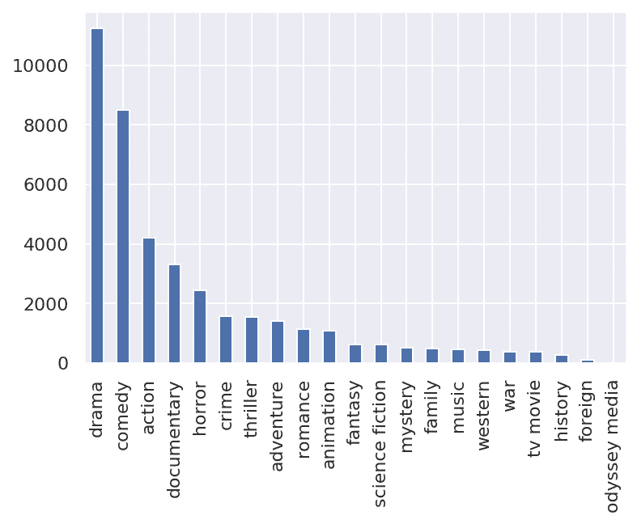

对于我们的类型预测任务，我们想要预测 10 个类别。因此，我们将选择前 10 个流派，并删除其余的。

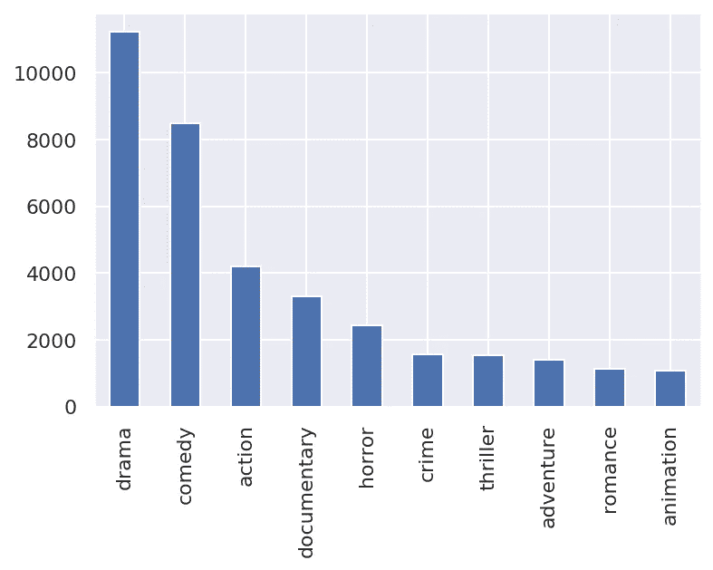

因此，我们根据受欢迎程度选择了每个类型中最受欢迎的 1000 部电影。这些是我们将要下载的电影海报，10 种类型的 10，000 张图片。

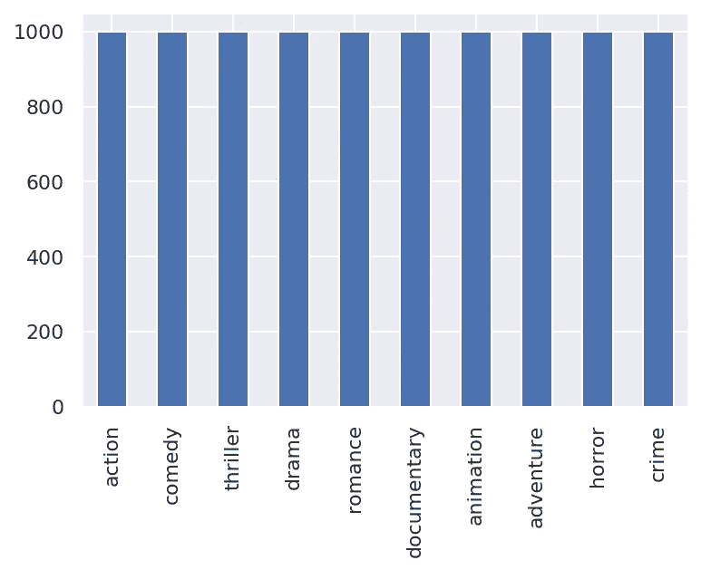

# 下载电影海报

从上面显示的数据框来看， *poster_path* 是文件的名称。为了获得玩具总动员海报的图片 URL，我们将[*http://image.tmdb.org/t/p/w185/*](http://image.tmdb.org/t/p/w185/)追加到海报 URL 以获得:[http://image . tmdb . org/t/p/w185//rhirbceo 9 lr 4 veexuwcc 2 wartg . jpg](http://image.tmdb.org/t/p/w185//rhIRbceoE9lR4veEXuwCC2wARtG.jpg)。

我们可以用请求库下载所有的图像。我建议在每次图像下载之间增加 1 秒钟的延迟。这段代码用于将图像下载并保存到相应的流派文件夹中，以预测电影的流派:

# 图像处理

为了利用预先训练的模型，我们首先需要将我们的矩形海报转换成正方形。此外，为了减少计算成本，图像尺寸被调整为 224 乘 224。我们确定了 4 种图像处理方法来满足这些要求:

*   PIL 图书馆调整大小
*   居中裁剪库调整大小
*   填料
*   随机裁剪和调整大小

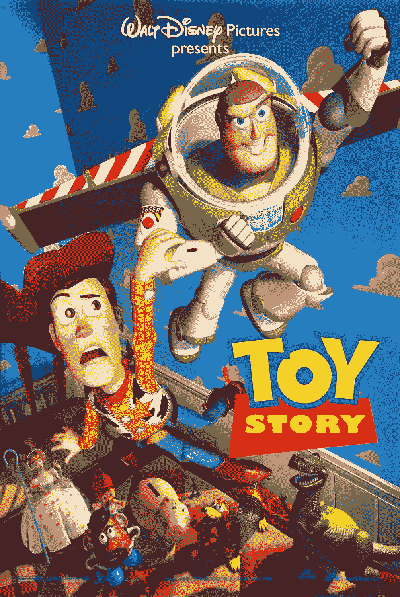

## 方法 1: PIL 图书馆调整大小

使用 PIL 图书馆调整图像大小为 224x224。

```
from PIL import Imageimage = Image.open(PATHOFIMAGE)
image = image.resize((224, 224), Image.BILINEAR)
image.save(NEWPATH)
```

调整大小后处理过的图像变形如下:

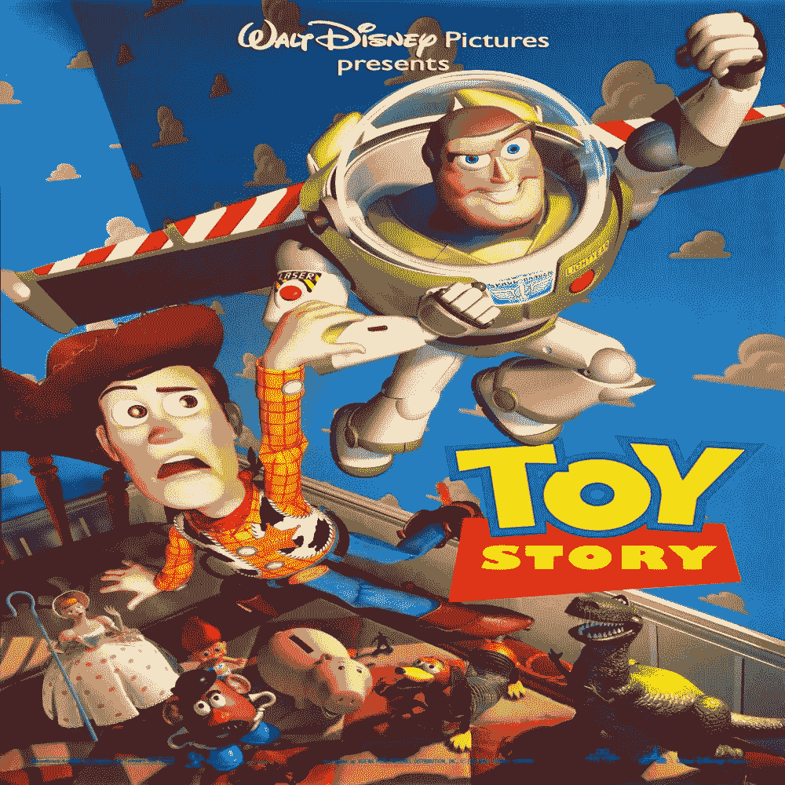

## 方法 2:居中裁剪

我们将使用 PyTorch 的火炬视觉转换图像。

```
do_transforms = transforms.Compose([
        transforms.CenterCrop(input_size),
        transforms.ToTensor(),
        transforms.Normalize([0.485, 0.456, 0.406],
                             [0.229, 0.224, 0.225])
])dataset = datasets.ImageFolder(PATH, transform=do_transforms)
```

处理后的图像导致图像的顶部和底部都被裁剪。

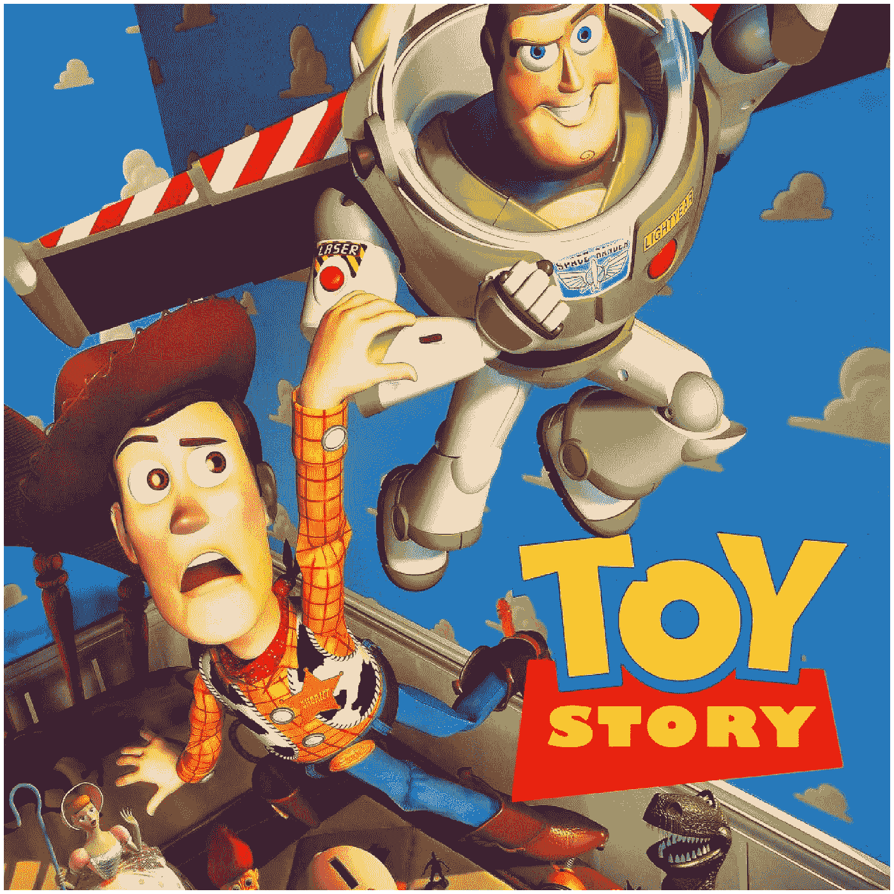

## 方法 3:填充

由于大多数电影海报都是纵向的，我们决定在左右两边添加黑色填充。这将避免原始海报图像的任何扭曲和裁剪。因为黑色填充在 RGB 中为零，所以它对我们的卷积神经网络的影响最小。

```
from skimage.transform import resizedef resize_image_to_square(img, side, pad_cval=0, dtype=np.float64):    
    h, w, ch = img.shape
    if h == w:
        padded = img.copy()
    elif h > w:
        padded = np.full((h, h, ch), pad_cval, dtype=dtype)
        l = int(h / 2 - w / 2)
        r = l + w
        padded[:, l:r, :] = img.copy()
    else:
        padded = np.full((w, w, ch), pad_cval, dtype=dtype)
        l = int(w / 2 - h / 2)
        r = l + h
        padded[l:r, :, :] = img.copy()resized_img = resize(padded, output_shape=(side, side))
    return resized_img
```

应用*填充*后的处理图像:

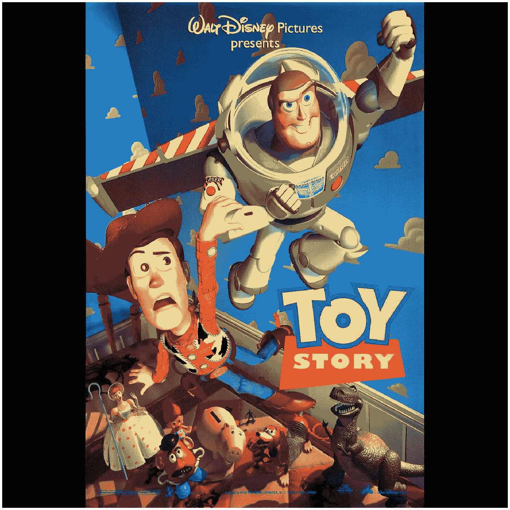

## 方法 4:随机裁剪和调整大小

我们将使用 [PyTorch 的火炬视觉](https://pytorch.org/docs/stable/torchvision/transforms.html)转换图像。

```
do_transforms = transforms.Compose([
        transforms.RandomCrop((280,280), padding=None, pad_if_needed=True, fill=0, padding_mode='constant'),
        transforms.Resize(input_size, interpolation=2),
        transforms.ToTensor(),
        transforms.Normalize([0.485, 0.456, 0.406],
                             [0.229, 0.224, 0.225])
])dataset = datasets.ImageFolder(PATH, transform=do_transforms)
```

经过*随机裁剪和*调整后的处理图像。

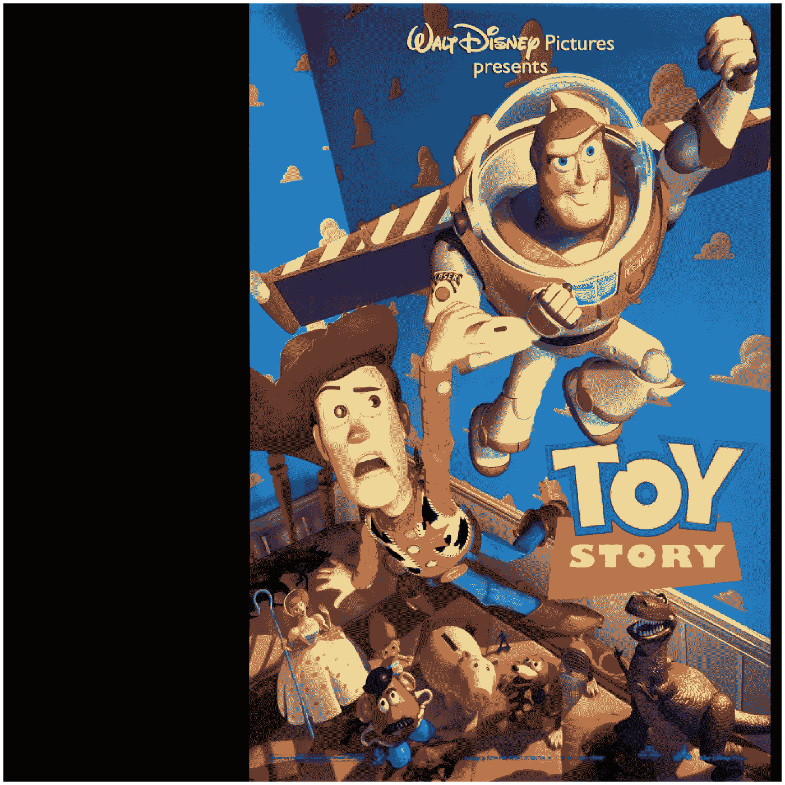

## 图像处理结果

为了测量图像处理方法的准确性，我们使用预训练的 ResNet18 来执行分类。我们将分为喜剧*和恐怖*两种类型，因为它们的海报总体上明显不同。为了确保我们的比较是公平的，我们做了以下工作:

*   用于训练的同一套电影和用于验证的同一套电影
*   设置种子编号
*   从 PyTorch 的火炬视觉载入预训练的 ResNet18

不同图像处理方法的模型精度如下:

*   PIL 图书馆的大小约为 80%
*   中心裁剪库大小调整约为 80%
*   填充率约为 85%
*   随机裁剪和调整大小约为 85%

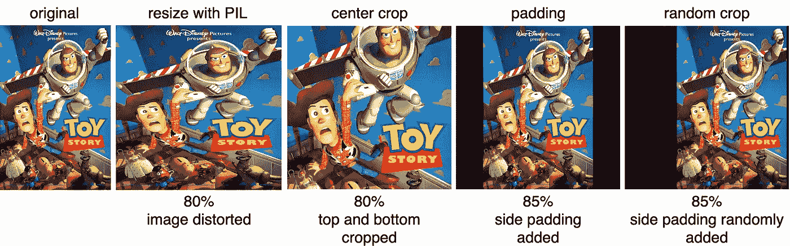

*随机裁剪和调整大小*方法在模型精度和处理速度方面表现最佳。在卷积神经网络中，图像中对象的位置无关紧要。

# 我们能通过海报来辨别电影的类型吗？

在我们的预处理步骤中，我们可以实现大约 85%的分类准确率，分为两类:*喜剧*和*恐怖*。我们选择*喜剧*和*恐怖*是因为这两种类型的海报截然不同。*喜剧*一般颜色较亮，而*恐怖*相比之下可能较暗。

以下是我们的一些测试案例，这些案例是模型看不到的:

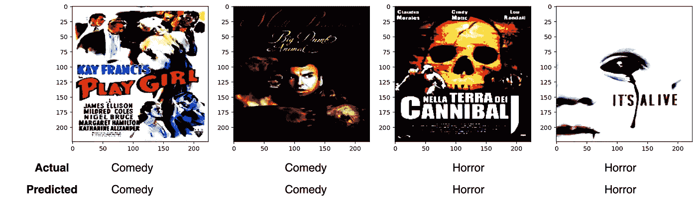

有趣的是，该模型可以学习和区分这两种类型。这位模特很可能会拿起有骷髅头图案的海报，并将海报与恐怖电影联系起来。第四张图片显示并非所有白色背景的海报都是喜剧电影，并且模型预测是正确的。

然而，由于并非所有类型都遵循电影海报设计的一般要求，这些海报可能会导致模特误读设计。随后，模型可能会将这些电影错误地分类到相反的类型中。以下是一些电影海报的例子，它们偏离了与各自类型相关的一般设计。

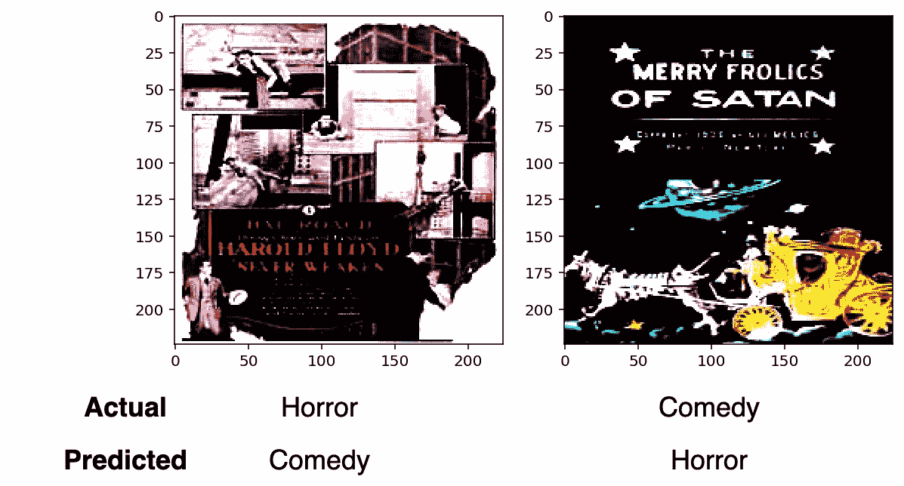

第一个图像包含许多白色区域，通常看起来令人愉快，而第二个图像包含大面积的黑色区域，这导致海报看起来很暗，尽管有卡通设计和字体。这些布局误导了模型，从而导致了错误的预测。

# 10 种类型之间的模型识别

在我们的数据集中，我们有 10 个流派；每种类型包含 1000 张电影海报。执行 80/20 分割来训练和验证模型。我们使用了 8000 张图像进行训练，2000 张图像进行验证(不用于训练)。

我们利用预训练的 ResNet18 模型的权重来训练一个模型，以根据电影的海报对电影的类型进行分类。这些是训练过程中的精确度和损耗。

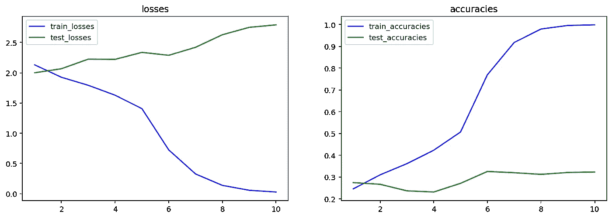

验证准确率约为 32%。我们的模型可以在训练集上学习和过拟合，但不能在验证数据集上推广。

前 3 名的准确率约为 65%。这让我们思考，是什么导致了所有的错误分类？我们如何进一步提高它的准确性？下面是一个热图，显示了前 1 名模型的所有错误分类:

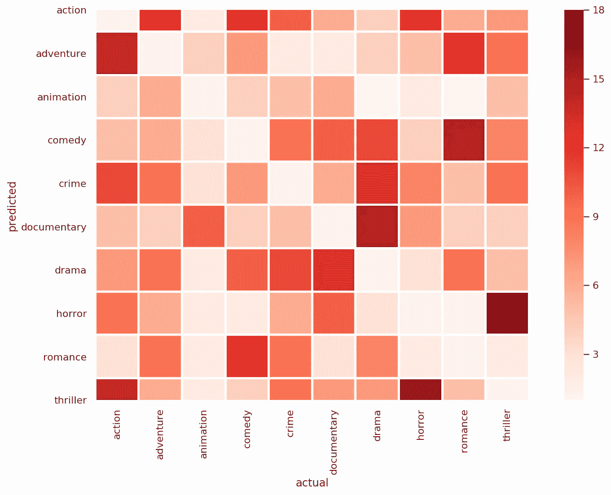

我们意识到这个模型很难区分恐怖片和惊悚片《T21》的海报。如果你仔细想想，即使对我们人类来说也是如此，我们可能无法区分恐怖片和惊悚片。

同样的结果也可以在喜剧和浪漫*中观察到，因为这两种类型的海报都采用了更轻松的基调，并且包含了人类和微笑的面孔。*

# 我们可以通过海报来判断这部电影是否会在票房上赚钱吗？

由于海报是一部电影的营销工具，我们想知道一部电影海报是否能吸引更多的观众。一个模型能识别出一种特定类型的海报在票房上是否更好吗？

在我们的实验中，我们通过电影的*收入与预算比率*来定义电影的表现。预算较高的电影需要更高的收入才能收支平衡。比例越高，电影做的越好。

我们用*收入与预算比率*创建了两个类别，“做得好”和“做得不好”。比率为 1 及以上的电影“做得好”，否则归类为“没做好”。

## 预训练结果 18

是啊！我们预先训练的 ResNet18 模型可以正确识别一部电影是否有赚钱的潜力，准确率约为 68%。

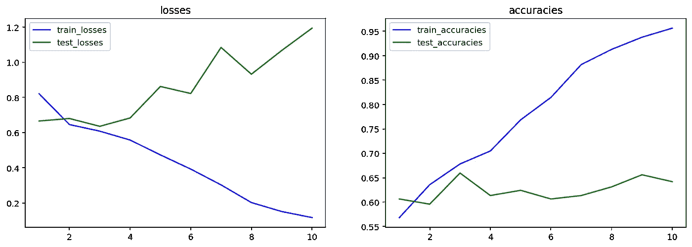

我们能做得比这更好吗？我可以换一个更深入的实验，但不会很有趣，所以这里有一些我们尝试过的其他实验。

## 卷积神经网络用于图像分类的技巧包

Tong He et al. 的一篇[论文建议通过在下采样块中接收更多信息来改善 ResNet 调整。](https://arxiv.org/abs/1812.01187)

作者使用这些调整将 ResNet50 模型 top-1 在 ImageNet 上的准确率从 75.3%提高到 79.29%

## Mish 激活函数

[Mish](https://github.com/digantamisra98/Mish) 是一个上无界、下有界、光滑、非单调的激活函数。

Mish 激活函数的正范围与最流行的激活函数 ReLu 非常相似。被限制在下面导致了正则化效应。负范围保留了小的负输入，这改善了表现性和渐变流动。阅读更多关于米什的文章，作者是迪甘塔·米斯拉。

## 数据扩充

最近，模型精度的提高归功于通过数据扩充产生了更多的数据；这显著增加了可用于训练的数据的多样性。

```
from torchvision import transformsimage_transforms = {
    # Train uses data augmentation
    'train':
    transforms.Compose([
        transforms.RandomResizedCrop(size=256, scale=(0.8, 1.0)),
        transforms.RandomRotation(degrees=15),
        transforms.ColorJitter(),
        transforms.RandomHorizontalFlip(),
        transforms.CenterCrop(size=224),
        transforms.ToTensor(),
        transforms.Normalize([0.485, 0.456, 0.406],
                             [0.229, 0.224, 0.225])
    ]),
    # Validation does not use augmentation
    'validate':
    transforms.Compose([
        transforms.Resize(size=256),
        transforms.CenterCrop(size=224),
        transforms.ToTensor(),
        transforms.Normalize([0.485, 0.456, 0.406],
                             [0.229, 0.224, 0.225])
    ]),
}
```

## 自制深宽网

这是受推荐系统的[宽&深模型的启发，通过将预训练的 ResNet 与预训练的宽 ResNet 相结合。](https://arxiv.org/abs/1606.07792)

首先，我们加载预训练的 ResNet 和预训练的 wide-ResNet，并移除最后的完全连接层以进行 ImageNet 分类。然后，我们将来自输入的 3×3 卷积、批量归一化和 ReLu 附加到两个 ResNet。最后，我们连接来自两个 ResNet 的输出，然后添加另一个 3×3 卷积和用于分类的全连接层。

# 各种实验的分类结果

以下是我们的结果:

米什可以得到 3%的改善，因为正则化效果，从而更好地概括了看不见的。我会给这个激活更多的探索在未来。

数据增强也有 3%的改进，事实上，我有点惊讶数据增强会在这个问题上有所改进。

# 结论

仅凭一张电影海报，预测一部电影的收入和受欢迎程度可能是一项艰巨的任务。这个问题甚至对分销公司和投资者来说也是如此，他们有数百名专家和分析师为他们工作，以确保他们的投资不会白费，并获得丰厚的回报。我们模型的引入和发展可能会在未来帮助这些分析师和公司做出更详细和合理的预测。

根据进一步的实验，为了获得更准确的读数，深入研究更深的 ResNet 模型可能会提高性能。然而，在我们的实验中，我们应用了 Mish 激活和来自研究论文的各种调整；因此，返回的结果是有希望的，是一条值得进一步探索的道路。

训练 AI 模型是成功的一半；值得注意的是，真实世界的数据是“肮脏的”和“未经提炼的”；这意味着并不是所有的数据都是准确和真实的。为了让机器学习发挥作用，我们必须首先很好地理解我们的数据，并理解我们的模型要成功需要什么。

[](/data-scientist-the-dirtiest-job-of-the-21st-century-7f0c8215e845) [## 数据科学家:21 世纪最肮脏的工作

### 40%的吸尘器，40%的看门人，20%的算命师。

towardsdatascience.com](/data-scientist-the-dirtiest-job-of-the-21st-century-7f0c8215e845) [](/predict-movie-earnings-with-posters-786e9fd82bdc) [## 用海报预测电影收入

### 用电影海报确定电影的类型和收益

towardsdatascience.com](/predict-movie-earnings-with-posters-786e9fd82bdc) [](https://towardsdatascience.com/@jinglesnote)[](https://jingles.substack.com/subscribe)