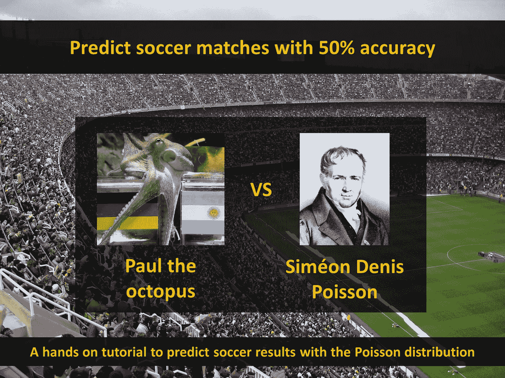
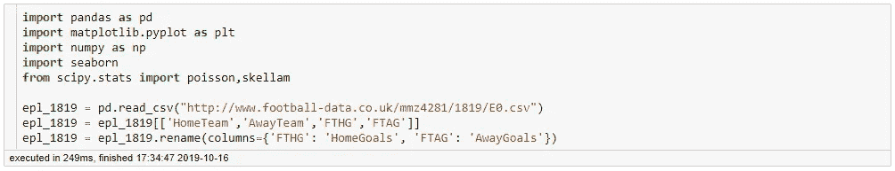
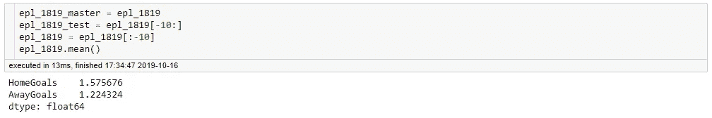
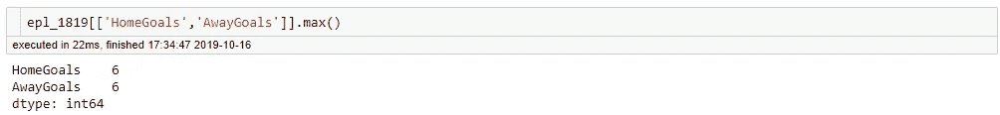
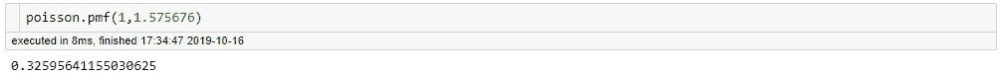
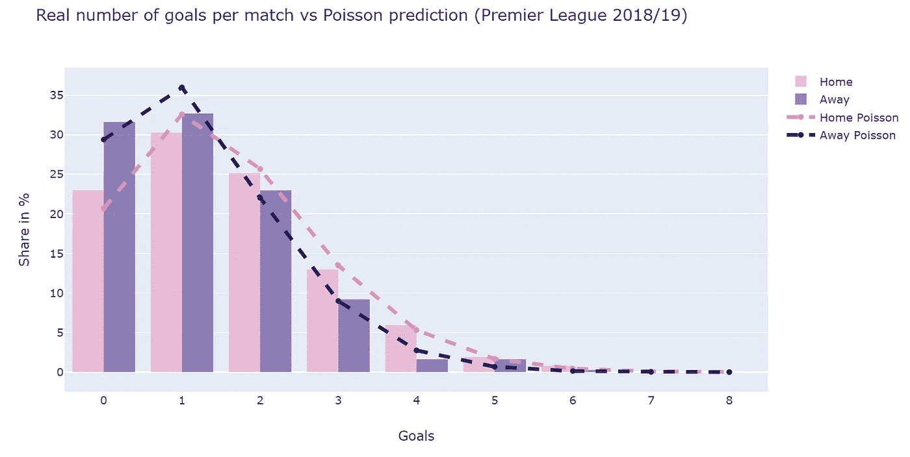
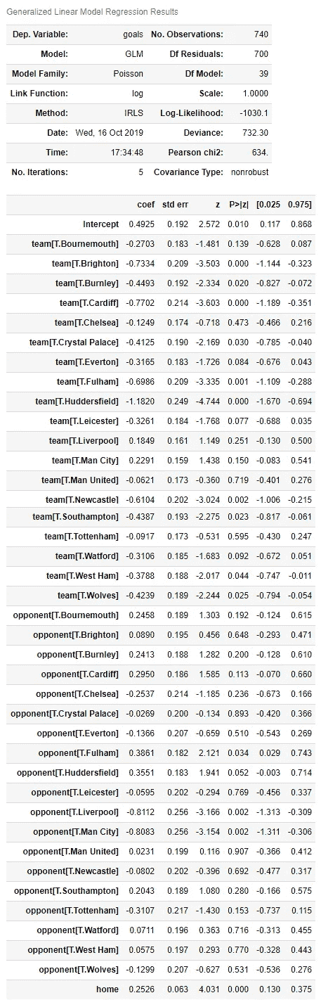
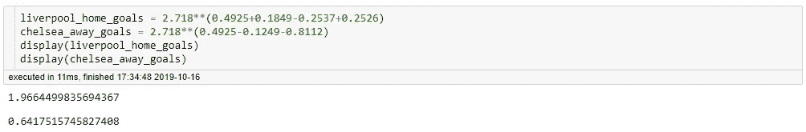
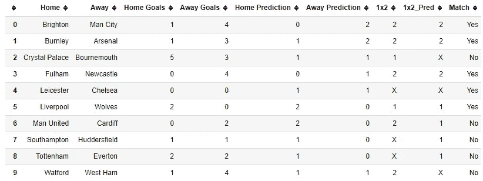
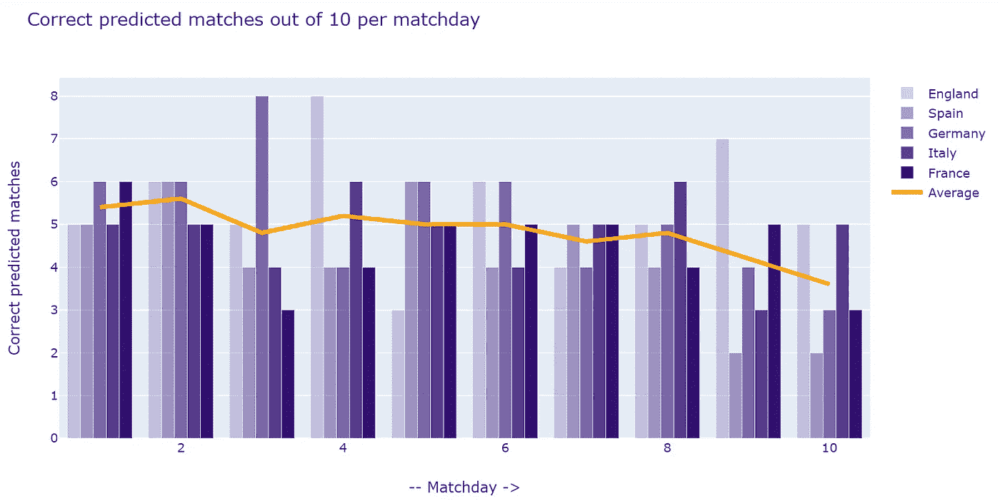

# 以 50%的准确率预测足球比赛

> 原文：<https://towardsdatascience.com/predict-soccer-matches-with-50-accuracy-a24cc8078877?source=collection_archive---------12----------------------->

## 如何在 Python 中使用泊松分布进行足球预测



> 在过去的几年里，博彩和博彩游戏变得更加流行。你可以通过电脑或智能手机随时随地下注。因此，很多人试图预测体育赛事的结果并不奇怪。足球有一个巨大的市场，你可以在足球比赛中出现的几乎每一个事件上下注，比如进球、球员、卡片、角球等等。最常见的赌注叫做 1x2。你试着预测主队会赢(1)，平局(x)还是客队会赢(2)。不信任章鱼保罗等动物的人正在寻找更复杂的统计方法。我想和你分享一个非常基本的方法。我们将更深入地了解泊松分布以及它在 Python 中的用法。关于基本的统计概念，请看这里的和这里的。在接下来的部分中，我将使用大卫·希恩在他的[精彩博客](https://dashee87.github.io/football/python/predicting-football-results-with-statistical-modelling/)中发表的部分代码。我将更深入地探讨细节，并在更广泛的样本上回顾该模型，以回答该模型有多成功的问题。一如既往，我不会包括我使用的任何代码，但你可以在 Github 上找到它。

## 获取一些数据

在我们创建模型、预测结果并检查其正确性之前，我们需要一些数据。那么让我们看看最后一个英超赛季:



20 支球队在 PL 中比赛，因此我们删除最后 10 行，并尝试预测最后一个比赛日的结果。



对于足球迷来说，这个结果并不奇怪。主队平均比客队进更多的球。



一支球队在单场比赛中的最高进球数是 6 个。基本上，我们现在已经有了泊松分布所需的所有参数。第一步，我们可以预测主队进 1 球的概率，例如:



主队进 1 球的几率是 32.6%。让我们想象一下 0 到 6 之间的目标值，以及主客场的目标值:



条形图显示了 2018/19 赛季的实际进球数量。这些线条显示了我们的泊松计算值，它们似乎非常符合实际分布。

## **预测一场英超比赛**

现在我们已经学习了泊松分布的基本概念。但是我们如何预测一场比赛的进球数呢？答案是泊松回归:



我们将关注这种回归的主要方面。观察次数为 740 次(20 支球队 37 个比赛日)。在第一行中，我们看到一个名为“Intercept”的条目。这是基准比率，所有其他估计都是相对于它的。利物浦的团队系数是 0.1849，这意味着利物浦比一般球队进更多的球。系数越低，球队平均射门次数越少。切尔西的对手系数是-0.2537。切尔西的进球数比一般球队少。系数越低，球队平均进球越少。最后一排“主场 0.2526”是主场优势的表达:主场球队平均进球多。
为了计算利物浦的预计进球数，我们使用以下公式:

```
exp(Intercept+Coefficients)
```

因此，让我们填写 a)利物浦和 b)切尔西的公式:



请注意，我们只为利物浦添加了“主场”系数(0.2526)。预测将是 2:1，所以我们预计利物浦会赢。现在，让我们将我们的预测与上一个比赛日进行比较。

## **测试最后一个比赛日**



好吧，我们预测了一半比赛日是正确的，一半比赛日是错误的。对于这样一个简单的模型，这并不坏，或者你认为呢？但我们只是预测了一场比赛，这是最后一个比赛日，一般来说不太容易预测。一些球队无法改变他们在积分榜上的位置，因此他们没有什么可失去的，这导致了他们的表现变弱。下一步，我们看看欧洲排名前五的联赛(关于欧足联系数)并挑选一个更大的样本。我们预测每个联赛的最后 10 个比赛日。

## 测试 5 个欧洲顶级联赛的最后 10 个比赛日

我们可以很容易地使用相同的代码和以前一样，并运行它为 5 而不是 1 联赛。正如我们之前所做的，我们在训练数据集中删除了最近 10 个比赛日:



在上图中，你看到了我们已经预料到的情况。最后两个比赛日的预测更糟糕。但总的来说，这条线大部分时间都在 5 点左右，这意味着特定比赛日的比赛有一半是预测正确的。总之，我们已经正确预测了 48.2%的比赛日。你可以看到标题是点击诱饵；).

## 结论

我们看到，通过使用简单的泊松回归，我们几乎可以正确预测 50%的匹配。它可以很容易地与 Python 一起使用，并允许有效的计算。它还可以快速扩展。您可以扩展代码来预测 a)其他联赛或 b)更多比赛的比赛。如果你想在这个模型上更进一步，你可以检查团队的形式，时间加权或者低估或高估结果的正确性。我希望你喜欢阅读！

[如果您喜欢中级和高级数据科学，并且还没有注册，请随时使用我的推荐链接加入社区。](https://medium.com/@droste.benedikt/membership)