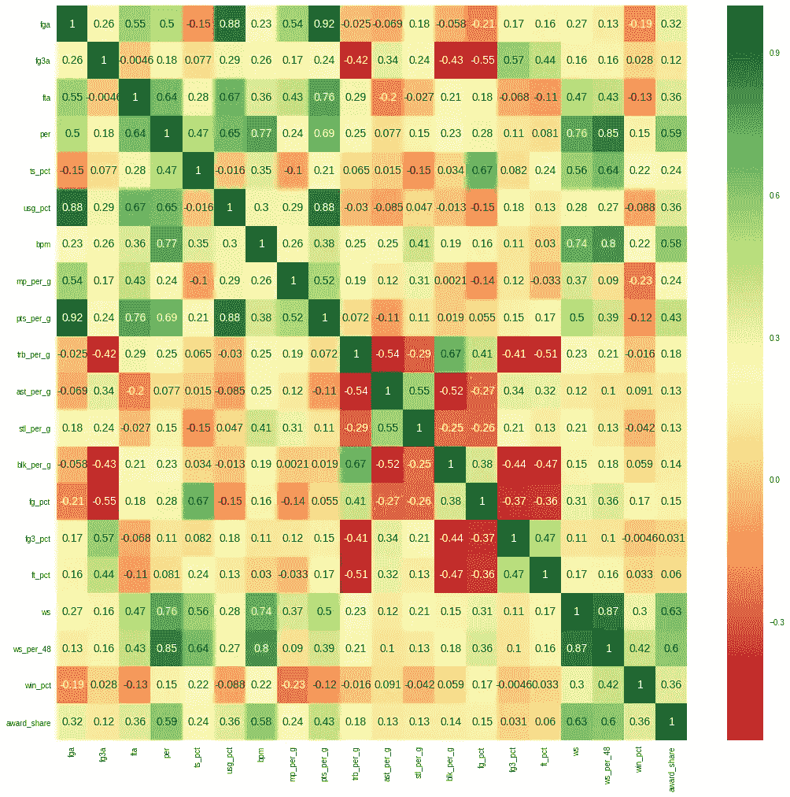

# 使用机器学习预测 2018-19 年 NBA 最有价值球员

> 原文：<https://towardsdatascience.com/predicting-2018-19-nbas-most-valuable-player-using-machine-learning-512e577032e3?source=collection_archive---------18----------------------->

## ML 模特对今年 NBA 最有价值球员有什么评价？

我们已经深入到季后赛了，但是投票结果还没有公布，这给了我一个想法去预测 MVP 的结果。


Photo by [Kenny Eliason](https://unsplash.com/@neonbrand?utm_source=medium&utm_medium=referral) on [Unsplash](https://unsplash.com?utm_source=medium&utm_medium=referral)

# 收集数据

我在 [basketball-reference](http://www.basketball-reference.com) 上找到了从 1968 年到 1969 年的每个赛季的数据，但我只使用了 1980 年到 1981 年的数据，这是媒体投票的第一个赛季，在此之前投票是由球员进行的。这是一个关于 2015-16 赛季数据的[例子](https://www.basketball-reference.com/awards/awards_2016.html#mvp::none)。

这也是第一次，也是迄今为止唯一一次，一个球员被一致投票选为 MVP(每个投票者都给他第一名的选票)。

除了上表中的数据，我还搜集了一些不可用的玩家资料，例如，BPM，PER，TS%等数据。

刮刀的代码可以在[这里](https://gist.github.com/danchyy/c80080fcfa08be61aa31a73d7cfa44fb)找到。

但是我鼓励你避免再次抓取它，因为数据已经被获取，并且可以在我的 [GitHub repo](https://github.com/danchyy/Basketball_Analytics/blob/master/Scripts/2018_19_season/mvp_predictions/mvp_votings.csv) 和 [Kaggle](https://www.kaggle.com/danchyy/nba-mvp-votings-through-history) 中找到。

# 定义问题

有了这些数据，我将定义将要解决的问题。因为这是一个排序的任务，所以没有现成的算法可以解决这个问题。我将尝试通过回归问题来简化这个问题。

我们任务的目标值将是前面表格中的 *Share* 列。这个数字总是在 0 和 1 之间，代表每个玩家在投票中赢得的点数。

由于数据的结构方式，我们基本上是在试图模拟媒体将如何投票给本赛季的球员。当然，回归对于解决这样的问题是很棒的，但是这里的问题在于数据，因为它很不平衡。在奖励份额值的直方图上，您可以看到一半以上的示例位于 0.0 和 0.2 之间，这可能会给模型带来问题。


Image by Author

# 功能和功能选择

在我开始训练和验证模型之前，我将解释我将使用什么作为特征和一些简单的特征选择过程。

*pts_per_g，ast_per_g，trb_per_g，stl_per_g，blk_per_g* 是简单的 stats。场均得分，助攻，篮板，抢断，盖帽。 *mp_per_g* 代表每场比赛的分钟数， *win_pct* 代表球队的胜率(一个赛季有 82 场比赛，所以这个值代表 games_won 除以 games_total)。

*fga，* *fg3a* ， *fta* 分别是投篮命中率，三分球命中率，罚球命中率， *fg_pct* ， *fg3_pct* ， *ft_pct* 分别代表投篮命中率，三分球命中率，罚球命中率。

现在我们来看一些高级统计数据。

*PER* 代表[玩家效率等级](https://www.basketball-reference.com/about/per.html)，基本上是所有正面和负面简单统计的计算。

*BPM* 代表[框加减](https://www.basketball-reference.com/about/bpm.html)，是评估球员素质和对球队贡献的高级统计。根据，与*相比，它需要更多的团队属性。*

*TS_PCT* 代表真实投篮命中率，计算相当简单(实际上也包含在上面的统计中)。公式如下:

```
PTS / (2 * (FGA + 0.44 * FTA)) * 100
```

*USG_PCT* 是使用率百分比的缩写，是对球员在球场上使用的团队比赛的估计。计算可以在这里找到[。](https://www.basketball-reference.com/about/glossary.html)

而且最后 *WS* 和 *WS_per_48* 代表[赢股](https://www.basketball-reference.com/about/ws.html)和每 48 分钟赢股。该统计试图将团队的成功划分到团队的个人成员身上。

# 特征选择

现在，即使在我对这些统计数据的简短描述中，您也可以看到它们是相似的，这就是为什么我继续进行几个简单的特征选择过程，以消除那些不能带来大量信息的特征。

第一个是使用互信息找出变量之间的依赖关系，这是使用 sklearn 的特征选择包完成的。

```
ws: 0.2884
per: 0.2811
ws_per_48: 0.2592
bpm: 0.2013
pts_per_g: 0.1482
usg_pct: 0.1053
win_pct: 0.0973
fta: 0.0948
ts_pct: 0.0872
fga: 0.0871
trb_per_g: 0.0695
mp_per_g: 0.0668
fg3a: 0.0355
ft_pct: 0.0311
ast_per_g: 0.0279
stl_per_g: 0.0139
fg_pct: 0.0089
blk_per_g: 0.0066
fg3_pct: 0.0000
```

然后，我使用随机森林回归，我拟合随机森林的实例，并找到该模型最重要的特征。

```
ws: 0.3911
win_pct: 0.1326
per: 0.0938
bpm: 0.0537
ws_per_48: 0.0428
fga: 0.0368
usg_pct: 0.0310
ft_pct: 0.0263
ast_per_g: 0.0253
mp_per_g: 0.0251
fg_pct: 0.0231
fta: 0.0213
pts_per_g: 0.0183
fg3_pct: 0.0159
ts_pct: 0.0155
trb_per_g: 0.0153
blk_per_g: 0.0118
stl_per_g: 0.0103
fg3a: 0.0101
```

最后，我找到了特征之间的关联矩阵。这对我帮助最大，因为我有一个很好的方法来可视化哪些特征非常相关，从而带来重复的信息，这在某些情况下对模型没有帮助。



Image by Author

在上一个图像中，您可以查看数据集中所有要素之间的相关性。之后，我去除了那些高度相关的或者基本上代表同一事物的特征，或者可以用一些标量乘法来表示的特征。

有了以上描述的几个步骤和我在上面描述的统计定义，我决定将特征简化为这些最终特征:

```
ts_pct
bpm
mp_per_g
pts_per_g
trb_per_g
ast_per_g
stl_per_g
blk_per_g
ws
win_pct
```

虽然它们之间仍然有一些关联，但我仍然决定使用这些功能，因为它们看起来最适合使用。我试着用所有的特性运行一个实验，结果导致了更慢的训练时间和更差的结果，这意味着这个特性选择是有意义的。

# 培训和验证

除了用于验证的一个季节之外，我使用所有季节的训练数据来进行交叉验证。我以这种方式训练每个模型，并平均每个赛季的结果。

我使用的指标是回归的均方误差，因为我想得到媒体投票的准确表示。但我也对结果进行了排序，并衡量了排名的准确性，我将此作为一个辅助指标。

对于回归，我使用了以下模型:

*   线性回归
*   里脊回归
*   梯度推进回归器
*   随机森林回归量
*   连续的血管反应

我以上述方式对常规和多项式特征(多项式次数为 2 和 3)进行了实验。在训练期间，我对 0 和 1 之间的数据进行了缩放和不缩放的实验，结果没有显示出太大的差异。

通过梯度推进回归器获得最佳结果，该模型保持前 6 位(一些模型具有不同的参数或不同次数的多项式)。

完整的结果可以在我的 [GitHub 库](https://github.com/danchyy/Basketball_Analytics/tree/master/Scripts/2018_19_season/mvp_predictions)上看到，它们也放在三个文件中，分别叫做 *reg_results_mse_sorted.txt，reg_results_sorted_top_1.txt，*和*reg _ results _ sorted _ top _ 5 . txt*。

# 2018-19 赛季预测

最后，以下是对这一季的预测。首先，我将展示几个回归模型的结果，这些模型在所有验证分割中均方误差最好。

## 梯度推进回归器

该模型具有 50 个估计器和 0.1 的学习率，并且特征具有二次多项式特征。


Image by Author

梯度推进回归器的其他变化也有类似的结果，哈登排在第一位。此外，markdown 到 pdf 的转换器很笨拙，而且字母之间有间隔(我在 markdown 中创建了表格并转换为 pdf，然后将该表格的截图放在这里，我承认这是一个粗略的过程)。

## 随机森林回归量

具有 50 个估计量的模型，其中特征具有仅具有交互作用的三次多项式。


Image by Author

但是对于稍微不同的参数，例如 100 个估计量和仅具有交互作用的二次多项式特征，结果稍微不同。


Image by Author

## 山脉

岭是一种正则化的线性回归。值为 10 的 Alpha 和二次多项式特征显示为最佳结果。


Image by Author

## 线性回归

现在我也使用了正态线性回归，虽然这个模型的 MSE 非常好，但是结果却很有趣。


Image by Author

由于没有正则化，该模型可能在某些特征上过度拟合，并给出了这些结果。这是德怀特·鲍威尔和德安德鲁·乔丹唯一出现在前 5 名的地方，所以它们被排除在你将在下一节看到的图表之外。

## 支持向量回归

这是用于回归的支持向量机的变体。以下是模型的结果，其中 *C=100* 和*伽马=0.001* 。


Image by Author

此外，由于所有这些模型都是回归模型，它们当然可能会超过这些值，超过最大值 1.0。这并不理想，但由于我们对排名最感兴趣，我们可以接受。

# 平均 2018-19 年预测

在下图中，您可以看到根据按 MSE 指标排序的前 50 名模型，前 10 名玩家的平均得分。


Image by Author

哈登和詹尼斯之间非常接近，但哈登略有优势。在他们之后，Jokic 占据了第三的位置，尽管他没有进入最佳模特预测的前五名。而在那之后，其他所有分数都比较接近，实际上，会比那个小很多。

# 结论

在这篇文章的最后，我想祝贺詹姆斯·哈登，2018-19 赛季 NBA 最有价值球员！哈登被我训练和测试的大多数模型预测为 MVP(包括顶级模型，具有各种不同参数的梯度推进回归器)，当一个人花一点时间看他的统计数据时，他应该是合乎逻辑的，然而詹尼斯也有一个惊人的赛季，在我看来，媒体可能会更偏向于他。

## 未来的工作

我认为这篇文章和我目前所做的所有工作只是触及了表面，我认为为了获得数据，可以进行更多的特征工程和搜集工作。

我认为，如果能够获得整个球队和整个赛季的平均数据，将会有很大收获。因为用它可以实现更好的数据标准化。此外，你可以查看谁在他们的团队中表现最突出，换句话说，谁携带他们最多(像今年的詹姆斯·哈登)。我也想这么做，但现在我不得不划清界限。

## 最后的话

我在我的 GitHub 资源库上传了完整的笔记本，它做了这篇文章中描述的所有事情，这里有一个[到它的直接链接](https://github.com/danchyy/Basketball_Analytics/blob/master/Scripts/2018_19_season/mvp_predictions/Predicting%20MVP.ipynb)。

这里还有一个[直接链接](https://github.com/danchyy/Basketball_Analytics)到我的 GitHub 知识库，里面有很多关于篮球和数据科学的东西。

我也上传了数据集到 Kaggle，这里有一个链接到 [Kaggle 数据集](https://www.kaggle.com/danchyy/nba-mvp-votings-through-history)。