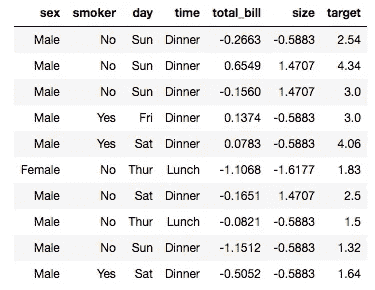
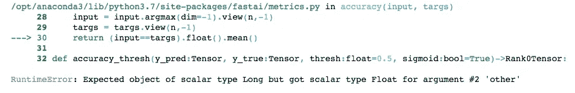
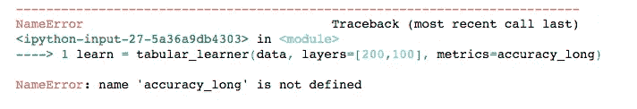
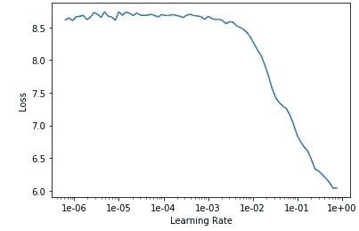

# 预测服务员的小费

> 原文：<https://towardsdatascience.com/predicting-a-waiters-tips-1990342a0d02?source=collection_archive---------20----------------------->

fast.ai《程序员实用深度学习》第四课

在 fast.ai 的[“程序员实用深度学习”](https://course.fast.ai/)第四课中，我们发现了如何使用深度学习和协同过滤来解决表格数据问题。正如我在 fast.ai 讲座上经常做的那样，我将讲座从头到尾看了一遍，然后在浏览笔记本时又看了一遍，必要时暂停一下。当我完成后，我想确保我可以用不同的数据集复制这个过程，我选择了乔·杨的 Kaggle 数据集“ [A Waiter's Tips](https://www.kaggle.com/jsphyg/tipping) ”。有了这个数据集，我们想建立一个模型来预测餐馆服务员的小费金额。

我从下载数据集并解压它开始，检查丢失的值(没有！)，然后将 tips.csv 文件上传到工作目录中的“data”文件夹。

在`from fastai.tabular import *`之后，我需要编辑笔记本以使路径指向正确的位置，因为笔记本默认路径指向讲座中使用的数据集。我的数据在‘data’文件夹中，所以我相应地设置了路径，并告诉它将数据存储在熊猫`DataFrame`中:

```
path = Path(‘data’)
df = pd.read_csv(path/’tips.csv’)
```

然后，我设置列名、因变量和预处理函数。因为我想根据其他因素来预测小费金额，所以我将`tip`设置为因变量，并且因为可以从简短的可能性列表中选择一周的`sex`、`smoker`和`day`，所以我将这些设置为“分类”变量。`total_bill`和`size`只是数字，所以它们是“连续”变量。我必须思考一分钟关于一天的`time`，虽然:“时间”感觉像是一个连续的概念，但看着数据，我看到“时间”被定义为“午餐”或“晚餐”那就绝对的。

笔记本附带了预处理函数`FillMissing`、`Categorify`和`Normalize`，我暂时保留它们。

```
dep_var = 'tip'
cat_names = ['sex', 'smoker', 'day', 'time']
cont_names = ['total_bill', 'size']
procs = [FillMissing, Categorify, Normalize]
```

(这位加州女孩惊讶地看到“吸烟者”被列为餐馆顾客的一个可能属性)

接下来，我需要为我的测试集选择一个大小。我们通常为测试集留出 20%的数据，因此由于我的数据集有 244 个元素，我将测试集设置为使用从 196 到 244 的索引范围。

```
test = TabularList.from_df(df.iloc[196:244].copy(), path=path, cat_names=cat_names, cont_names=cont_names)
```

然后是时候使用 fastai 库的 Datablock API 来创建我的`databunch`:

```
data = (TabularList.from_df(df, path=path, cat_names=cat_names,    cont_names=cont_names, procs=procs)
 .split_by_idx(list(range(196,244)))
 .label_from_df(cols=dep_var)
 .add_test(test)
 .databunch())
```

我检查出一批数据:

`data.show_batch(rows=10)`



`total_bill`和`size`经常有负值？我不认为餐馆付钱给任何顾客在那里吃饭，所以这一定是调用`Normalize`预处理的结果。我查看了[文档](https://docs.fast.ai/tabular.data.html#TabularProcessor)，没有发现`Normalize`实际上做了什么，所以我返回到[详细的课堂笔记](https://github.com/hiromis/notes/blob/master/Lesson4.md)，发现了这个:

"`Normalize`:提前做一个归一化，就是取连续变量，减去它们的均值，除以它们的标准差。"好吧，那么这就和统计学中的 z 分数一样，所以低于平均值的值为负是有道理的。

我声明我的学习器，告诉 API 它将是一个表格学习器(例如，与卷积神经网络学习器相反)，并保留讲座中使用的参数:

`learn = tabular_learner(data, layers=[200,100], metrics=accuracy)`

然后我运行`learn.fit`，得到一个错误:



看起来`accuracy`函数中的“参数#2”是`targs`，但是对我来说不清楚我需要如何修复它。我用谷歌搜索了这个错误，发现了一个关于它的[帖子](https://forums.fast.ai/t/error-pytorch-expected-object-of-scalar-type-long-but-got-scalar-type-float-for-argument-2-other/33778/3)。所以没错，`targs`是“参数#2”，我需要自己做`accuracy`函数。当我创建一个学习者时，调用了`accuracy`函数，所以我在其上创建了一个新的单元格，并定义了一个新的精度函数，称为`accuracy_long`，它与原来的`accuracy`函数相同，除了第四行的`.long()`之外:

```
def accuracy_1ong(input:Tensor, targs:Tensor)->Rank0Tensor:
    n = targs.shape[0]
    input = input.argmax(dim=-1).view(n,-1)
    targs = targs.view(n,-1).long()
    return (input==targs).float().mean()
```

…并按顺序运行两个单元。如果我们没有得到另一个错误，那就没什么意思了，对吗？



我就像“我也定义了它！看到了吗，就在上面？”

**几个小时的谷歌搜索和思考，我甚至不能定义一个函数，以后肯定会放弃编码** 仔细看看我在上面输入的内容。`accuracy_long`中的“l”是一个“1”。酷，酷。

我冷冷地盯着电脑看了很久，然后继续重新创建我的学习者并运行`learn.fit(1, 1e-2)`。看看我的准确率！这与我希望自己的准确率有很大关系，因为它们是完全相反的。🙄


由于这个数据集是预先清理过的，上面有一颗樱桃，并且被设计用来准确预测我试图用它来预测的东西，看起来我的准确率应该很高，而不是非常糟糕。所以我在想，是不是不小心把某个地方的一些逻辑颠倒了，把代码梳理了一遍。不过，我什么也没找到。

嗯。我觉得不可能是这个，但是我会尽量不把数据归一化？不，没有改善。

与第 2 课笔记本不同，第 4 课笔记本并不通过拟合几个时期的一个周期来开始学习，也不运行学习率查找器或混淆矩阵。我自己把这些放进去。

我创建并运行五个新单元:`learn.fit_one_cycle(4)`、`learn.save(‘stage-1’)`、`learn.unfreeze()`、`learn.lr_find()`和`learn.recorder.plot()`。这是学习率图表:



从图表来看，改变学习率似乎对我没有帮助。

我已经没有主意了，所以我求助于 [fast.ai 论坛](https://forums.fast.ai/t/lesson-4-tabular-dataset-with-0-accuracy/55822)。一名成员建议尝试第 6 课中使用的 RMSE(均方根误差)技术，所以我现在暂停一下，在第 6 课结束后再试一次。

查看 [GitHub](https://github.com/g0g0gadget/A-Waiter-s-Tips) 上的代码！

关于此主题的其他帖子:

第一课:[fast . ai 入门](/getting-started-with-fast-ai-350914ee65d2)

第二课:[对孕检结果进行分类](/classifying-pregnancy-test-results-99adda4bca4c)！

第二课(续):[深度学习能比鸽子表现更好吗？](/can-deep-learning-perform-better-than-pigeons-d37ef1581a2f)

第三课:[一万种行不通的方法](/10-000-ways-that-wont-work-311925525cf0)

第五课:但是泡菜去哪里了？

第六课:每个人都想成为一只猫

我是加州大学东湾分校的数学讲师，也是一名有抱负的数据科学家。在 [LinkedIn](https://linkedin.com/in/laura-langdon/) 上和我联系，或者在 [Twitter](https://twitter.com/laura_e_langdon) 上和我打招呼。