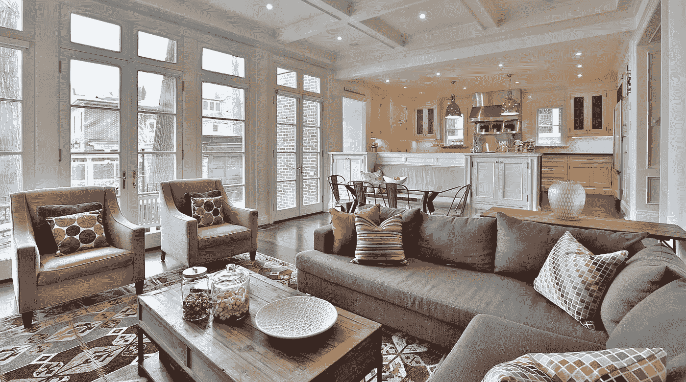
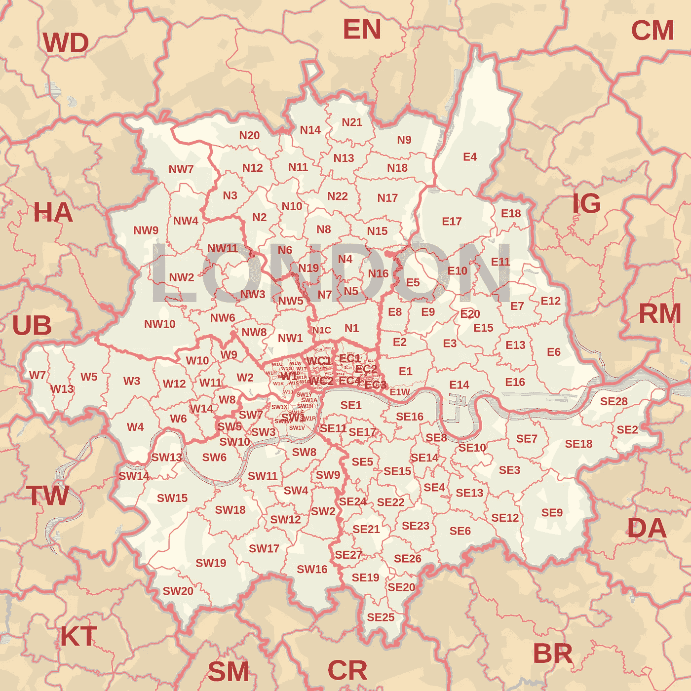
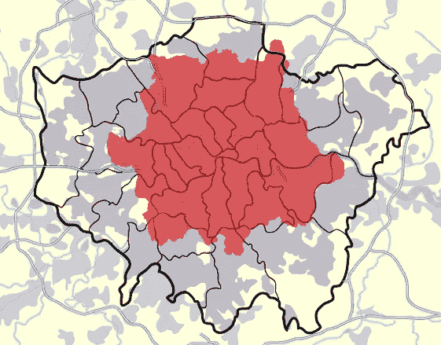
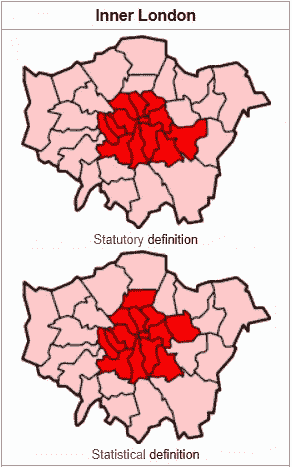
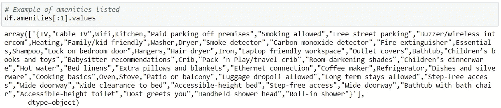

# Python 中的数据清理:Airbnb 数据清理示例

> 原文：<https://towardsdatascience.com/predicting-airbnb-prices-with-deep-learning-part-1-how-to-clean-up-airbnb-data-a5d58e299f6c?source=collection_archive---------14----------------------->

## Python 中如何处理杂乱的位置和文本数据



Source: airbnbeazy.com

# 项目背景

Airbnb 让我着迷。我之前在一家 Airbnb 物业管理公司工作了一年半，担任负责定价、收入和分析的团队主管。我发现特别有趣的一件事是如何计算出网站上的一个列表的价格。尽管“这是曼彻斯特的一套两居室”会让你走得相当远，但实际上有很多因素可以影响房源的价格。

作为利用深度学习预测 Airbnb 价格的更大项目的一部分，我发现自己被抛回了房地产数据的黑暗世界。地理空间数据可能非常复杂和混乱，用户输入的地理空间数据更是如此。这篇文章将解释我是如何为我的项目寻找和准备数据的，包括一些关于处理英国地理数据(它出奇的复杂)和从长文本字符串中提取相关信息的想法。

# 数据集

这个项目使用的数据集来自[Insideairbnb.com](https://insideairbnb.com/)，这是一个反 Airbnb 的游说团体，从全球多个城市搜集 Airbnb 房源、评论和日历数据。该数据集是在 2019 年 4 月 9 日抓取的，包含了当天该网站上所有伦敦 Airbnb 房源的信息(约 80，000)。

# 清理和准备数据

关于数据清理的全部令人兴奋的细节(披露:兴奋程度可能有所不同)，请随时查看我的 [GitHub repo](https://github.com/L-Lewis/Airbnb-neural-network-price-prediction) 。为了简洁起见，我将讨论可能感兴趣的数据预处理的三个特定领域。

## 未包含的功能(但我希望包含)

原始数据集包含 106 个要素，包括许多不同描述字段的文本列，您可以在 Airbnb 列表中填写这些字段。由于时间限制，我没有在这个模型中做任何自然语言处理(NLP ),所以所有这些功能都被删除了。然而，该模型未来发展的一个有趣途径是用 NLP 来增强它——可能用于情感分析，或寻找关键词，或某种奇特的 Word2Vec 类型的情况，寻找相似的列表描述，并使用它来帮助根据相似的列表猜测价格。

未来工作的另一个潜在方向可能包括审查。Insideairbnb.com 还抓取评论，这些评论可以与带有列表 id 的列表匹配。虽然大多数客人倾向于给大多数列表高评级，但更多细微的评级可能来自评论本身。

## 处理伦敦的地理信息(TLDR:伦敦的地图没有考虑到数据科学家)

英国的邮政编码复杂而混乱。它们可以有不同的长度，由字母和数字以不同的顺序组成。邮政编码的前半部分称为输出码或邮政编码区，指的是如下所示的区域:



London postcode districts. Source: [https://en.wikipedia.org/wiki/London_postal_district](https://en.wikipedia.org/wiki/London_postal_district)

让事情变得更复杂的是，伦敦的主要地理分区是 32 个区加上伦敦金融城(由于 12 世纪英国历史的一些怪癖，严格来说是一个公司而不是一个区)，这与邮政编码区不一致(因为这太容易了，对吗？):



London postcode districts (red), layered over London boroughs (black lines). Source: [https://en.wikipedia.org/wiki/London_postal_district](https://en.wikipedia.org/wiki/London_postal_district)

也没有什么简单的方法可以在更小的粒度上对伦敦地区进行分类。事实上，对于什么是“内伦敦”，人们甚至还没有达成一致:



What even is London? Source: [https://en.wikipedia.org/wiki/Inner_London](https://en.wikipedia.org/wiki/Inner_London)

更糟糕的是，Airbnb 允许主机在自由文本输入框中输入邮政编码，排除了邮政编码部分的任何简单分离，并允许主机写各种无意义的内容(我最喜欢的只是“不”这个词)。

最后，在抛弃了一堆关于邮政编码的正则表达式实验之后，我决定使用行政区作为地理单位。位置对于 Airbnb 房源来说非常重要，所以我对不得不使用 borough 并不十分满意。它不是在一个特别精细的层次上，也不总是能很好地表达一处房产是在伦敦市中心还是在偏远地区——这对价格有很大的影响。例如，著名的夏德摩天大楼在南华克，但杜尔威治也是如此，地铁甚至没有到达那里(免责声明:杜尔威治其实很可爱，但可能不太为伦敦的游客所知)。


Both in Southwark, but possibly with different Airbnb prices? Left: the Shard (source: [https://www.visitbritainshop.com/world/the-view-from-the-shard/](https://www.visitbritainshop.com/world/the-view-from-the-shard/)). Right: Dulwich high street (source: [https://de.wikipedia.org/wiki/Dulwich_(London)](https://de.wikipedia.org/wiki/Dulwich_(London))).

为了获得更精细的结果，我也尝试使用纬度和经度而不是行政区——但正如未来的博客文章所显示的，这并不完全成功。

## 便利设施(如此多的便利设施)

在 Insiderairbnb.com 的数据集中，设施被存储为一大块文本，下面是一个例子:



为了弄清楚各种选项是什么以及哪些列表包含这些选项，我首先制作了一个包含所有便利设施值的巨大字符串，稍微整理了一下，用逗号分隔出各个便利设施，并创建了一组结果列表(幸运的是，数据集足够小，允许这样做，但我需要一种更有效的方法来处理更大的数据集):

这里列出了所有可能拥有的便利设施:

```
 '24-hour check-in',
 'Accessible-height bed',
 'Accessible-height toilet',
 'Air conditioning',
 'Air purifier',
 'Alfresco bathtub',
 'Amazon Echo',
 'Apple TV',
 'BBQ grill',
 'Baby bath',
 'Baby monitor',
 'Babysitter recommendations',
 'Balcony',
 'Bath towel',
 'Bathroom essentials',
 'Bathtub',
 'Bathtub with bath chair',
 'Beach essentials',
 'Beach view',
 'Beachfront',
 'Bed linens',
 'Bedroom comforts',
 'Bidet',
 'Body soap',
 'Breakfast',
 'Breakfast bar',
 'Breakfast table',
 'Building staff',
 'Buzzer/wireless intercom',
 'Cable TV',
 'Carbon monoxide detector',
 'Cat(s)',
 'Ceiling fan',
 'Ceiling hoist',
 'Central air conditioning',
 'Changing table',
 "Chef's kitchen",
 'Children’s books and toys',
 'Children’s dinnerware',
 'Cleaning before checkout',
 'Coffee maker',
 'Convection oven',
 'Cooking basics',
 'Crib',
 'DVD player',
 'Day bed',
 'Dining area',
 'Disabled parking spot',
 'Dishes and silverware',
 'Dishwasher',
 'Dog(s)',
 'Doorman',
 'Double oven',
 'Dryer',
 'EV charger',
 'Electric profiling bed',
 'Elevator',
 'En suite bathroom',
 'Espresso machine',
 'Essentials',
 'Ethernet connection',
 'Exercise equipment',
 'Extra pillows and blankets',
 'Family/kid friendly',
 'Fax machine',
 'Fire extinguisher',
 'Fire pit',
 'Fireplace guards',
 'Firm mattress',
 'First aid kit',
 'Fixed grab bars for shower',
 'Fixed grab bars for toilet',
 'Flat path to front door',
 'Formal dining area',
 'Free parking on premises',
 'Free street parking',
 'Full kitchen',
 'Game console',
 'Garden or backyard',
 'Gas oven',
 'Ground floor access',
 'Gym',
 'HBO GO',
 'Hair dryer',
 'Hammock',
 'Handheld shower head',
 'Hangers',
 'Heat lamps',
 'Heated floors',
 'Heated towel rack',
 'Heating',
 'High chair',
 'High-resolution computer monitor',
 'Host greets you',
 'Hot tub',
 'Hot water',
 'Hot water kettle',
 'Indoor fireplace',
 'Internet',
 'Iron',
 'Ironing Board',
 'Jetted tub',
 'Keypad',
 'Kitchen',
 'Kitchenette',
 'Lake access',
 'Laptop friendly workspace',
 'Lock on bedroom door',
 'Lockbox',
 'Long term stays allowed',
 'Luggage dropoff allowed',
 'Memory foam mattress',
 'Microwave',
 'Mini fridge',
 'Mobile hoist',
 'Mountain view',
 'Mudroom',
 'Murphy bed',
 'Netflix',
 'Office',
 'Other',
 'Other pet(s)',
 'Outdoor kitchen',
 'Outdoor parking',
 'Outdoor seating',
 'Outlet covers',
 'Oven',
 'Pack ’n Play/travel crib',
 'Paid parking off premises',
 'Paid parking on premises',
 'Patio or balcony',
 'Pets allowed',
 'Pets live on this property',
 'Pillow-top mattress',
 'Pocket wifi',
 'Pool',
 'Pool cover',
 'Pool with pool hoist',
 'Printer',
 'Private bathroom',
 'Private entrance',
 'Private gym',
 'Private hot tub',
 'Private living room',
 'Private pool',
 'Projector and screen',
 'Propane barbeque',
 'Rain shower',
 'Refrigerator',
 'Roll-in shower',
 'Room-darkening shades',
 'Safe',
 'Safety card',
 'Sauna',
 'Security system',
 'Self check-in',
 'Shampoo',
 'Shared gym',
 'Shared hot tub',
 'Shared pool',
 'Shower chair',
 'Single level home',
 'Ski-in/Ski-out',
 'Smart TV',
 'Smart lock',
 'Smoke detector',
 'Smoking allowed',
 'Soaking tub',
 'Sound system',
 'Stair gates',
 'Stand alone steam shower',
 'Standing valet',
 'Steam oven',
 'Step-free access',
 'Stove',
 'Suitable for events',
 'Sun loungers',
 'TV',
 'Table corner guards',
 'Tennis court',
 'Terrace',
 'Toilet paper',
 'Touchless faucets',
 'Walk-in shower',
 'Warming drawer',
 'Washer',
 'Washer / Dryer',
 'Waterfront',
 'Well-lit path to entrance',
 'Wheelchair accessible',
 'Wide clearance to bed',
 'Wide clearance to shower',
 'Wide doorway',
 'Wide entryway',
 'Wide hallway clearance',
 'Wifi',
 'Window guards',
 'Wine cooler',
 'toilet',
```

在上面的列表中，有些设施比其他设施更重要(例如，阳台比传真机更容易涨价)，有些设施可能相当不常见(例如，“电动仿形床”)。基于之前的行业经验，以及对顾客认为哪些设施更重要的进一步研究，我们选择了一些更重要的设施。然后根据数据的稀疏程度从最终模型中选择这些数据。例如，如果事实证明几乎所有的房产都有/没有特定的舒适设施，那么这个特性在区分房源或解释价格差异时就没什么用了。

关于这一点的复杂代码可以在 GitHub 上找到，但这是最后一部分，我删除了超过 90%的列表中有或没有特定便利设施的列:

这些是我最终保留下来的便利设施:

*   阳台
*   被单和枕套
*   早餐
*   电视
*   咖啡机
*   基本烹饪设备
*   白色家电(特别是洗衣机、烘干机和/或洗碗机)
*   儿童友好型
*   停车
*   户外空间
*   受到主人的欢迎
*   互联网
*   允许长期停留
*   允许携带宠物
*   私人入口
*   安全或安保系统
*   自助入住

# 摘要

在这些(和许多其他)清理和预处理步骤之后，Airbnb 处于合适的形式，可以开始探索和建模，你可以在[我的下一篇关于数据探索的文章](/predicting-airbnb-prices-with-deep-learning-part-2-how-to-improve-your-nightly-price-50ea8bc2bd29)和我写的另一篇关于[建立预测模型的文章](https://medium.com/@lvlewis8/predicting-airbnb-prices-with-machine-learning-and-deep-learning-f46d44afb8a6)中了解更多信息。

如果你觉得这篇文章有趣或有帮助，请通过鼓掌和/或评论的方式让我知道，你可以关注我，以便在未来的文章中得到通知。感谢阅读！