# 探索伦敦 Airbnb 价格:哪些因素影响价格？

> 原文：<https://towardsdatascience.com/predicting-airbnb-prices-with-deep-learning-part-2-how-to-improve-your-nightly-price-50ea8bc2bd29?source=collection_archive---------11----------------------->

## 分析 Airbnb 数据有助于提高你的房源收入

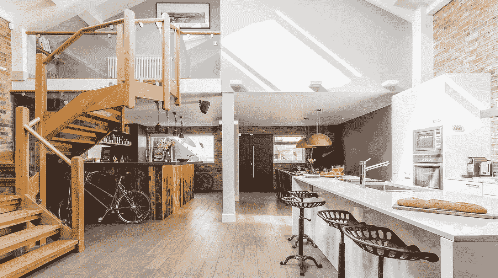

Source: plumguide.com

# 项目目标和背景

Airbnb 是一个房屋共享平台，允许房主和租户(房东)将他们的房产(房源)放在网上，这样客人就可以付费入住。房东为他们的房源设定自己的价格，尽管 Airbnb 和其他网站提供一些一般性的指导，但目前没有免费和准确的服务来帮助房东使用广泛的数据点为他们的房产定价。

在 Airbnb 上获得正确的定价非常重要，尤其是在伦敦这样竞争激烈的大城市。我最近进行了一个项目，利用机器学习和深度学习来预测伦敦 Airbnb 房产的价格。我已经在之前的一篇文章中探索了 Airbnb 数据的准备和清理，在未来的一篇文章中，我将和 T2 一起探索建模。但这篇文章是关于探索列表数据，提取有趣和有用的见解，以帮助主机最大化他们的收入。

额外背景:我之前在一家 Airbnb 物业管理公司工作了一年半，担任负责定价、收入和分析的团队主管。因此，在这个项目过程中所做的决定是由这个行业领域的专业知识决定的。

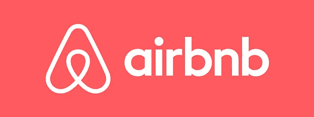

# 数据集

这个项目使用的数据集来自 Insideairbnb.com，这是一个反 Airbnb 的游说团体，从全球多个城市搜集 Airbnb 房源、评论和日历数据。该数据集是在 2019 年 4 月 9 日抓取的，包含了当天该网站上所有伦敦 Airbnb 房源的信息(约 80，000)。伦敦行政区边界的 GeoJSON 文件也从同一网站下载。

这些数据相当混乱，而且有一些局限性。主要的一点是，它只包括广告价格(有时称为“标签”价格)。标价是向潜在客人宣传的每晚总价格，而不是之前客人每晚支付的实际平均金额。主机可以将广告价格设置为任意数量，并且对 Airbnb 不太有经验的主机通常将这些价格设置为非常低(例如 0)或非常高(例如 10，000)的数量。

尽管如此，这个数据集仍然可以用作概念验证。一个更准确的版本可以使用客人支付的实际平均每晚费用的数据来构建，例如从像 AirDNA 这样的网站收集和出售更高质量的 Airbnb 数据。

# 探索数据以获得洞察力

## 位置，位置，位置

> **问题:伦敦哪些地区的 Airbnb 房产最多，哪些最贵？**

回答:威斯敏斯特(城市西部)的 Airbnb 房产最多，其次是 Tower Hamlets(城市东部)。伦敦内城区的房源明显比外城区多。

然而，价格模式略有不同。肯辛顿和切尔西(威斯敏斯特以西)是最昂贵的地区。这是一个众所周知的生活成本高的地区，有些地方的房价是世界上最高的。虽然内伦敦通常比外伦敦更贵，但也有一些更贵的房源沿着泰晤士河分散到城市的西部(那里有一些非常美丽的地区)。

伦敦市中心的房源很少(因为这里的住宅物业相对较少)，但结果是价格非常昂贵。

我是怎么发现的？我在做这个项目的时候发现了一个有趣的叫做 GeoPandas 的库。它基本上是用于地理空间数据的 Pandas，允许您将区域边界添加为矢量(或多边形或 shapefiles ),作为数据帧中的新列。如果你想看的话，产生这个的代码在我的 [GitHub repo](https://github.com/L-Lewis/Airbnb-neural-network-price-prediction) 里。

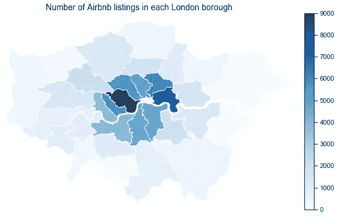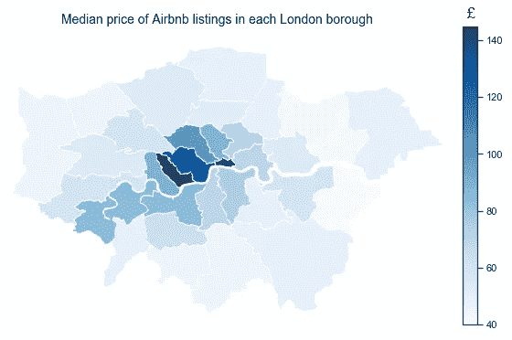

## 评估竞争

> **问题:最常见的物业和房型有哪些？**

回答:大约 70%的房产是公寓。其余的是房子或更不常见的财产类型(如“床和早餐”或“蒙古包”)。

大约 55%的房源是整栋房屋(也就是说，你自己租了整栋房子)。其余的大部分都是私人房间(也就是说，你租了一间卧室，可能还有一间浴室，但房子里还有其他人)。不到 1%是合住房间(即您与业主或其他客人合住一个房间)。

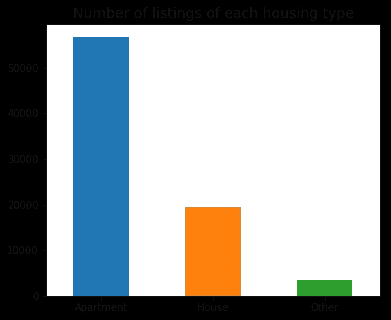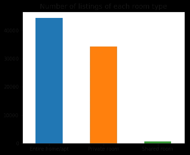

## 随着时间的变化

> **问题:房东在伦敦 Airbnb 上挂牌出售房产有多久了？**

回答:目前 Airbnb 上最古老的伦敦房源是在 2008 年 8 月首次在网站上列出的。从 2011 年起，上市数量开始大幅增加。然而，自 2015 年以来，新主机(目前在该网站上市的主机)数量的增长一直在下降，当时英国政府出台了一项法律，规定每年出租短期住宅超过 90 晚为非法。

高度的季节性是显而易见的，夏季是明显的高峰，人们在网上出售房产，以利用暑假期间游客数量的增加。

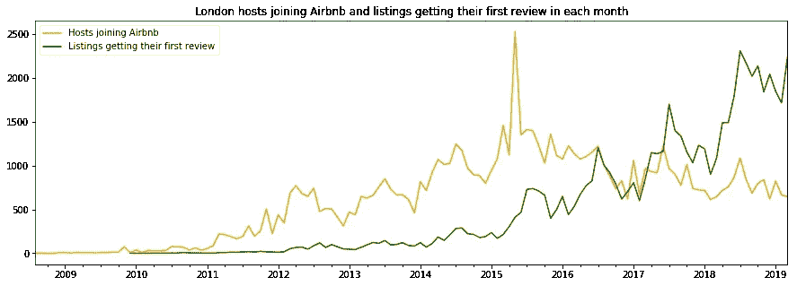

下面两张图片显示了加入网站的(当前在线)主机数量的分解时间序列，以及获得首次审核的(当前在线)列表数量。这是使用 statsmodels 库中的`seasonal_decompose` 函数完成的。它将时间序列分解为总体趋势、季节性(这在旅游业中很重要)和剩余的无法解释的残差。后者可能是由多种因素造成的。例如，2015 年加入 Airbnb 的主机数量达到高峰，这可能是对政府立法的回应，因为现有主机可能已经创建了新帐户，以便重新列出他们的属性，并绕过 90 天的限制。

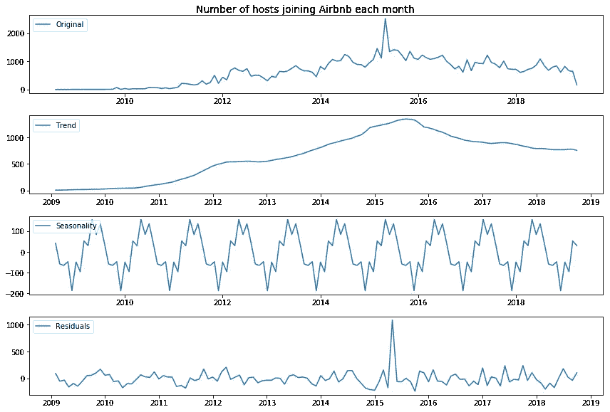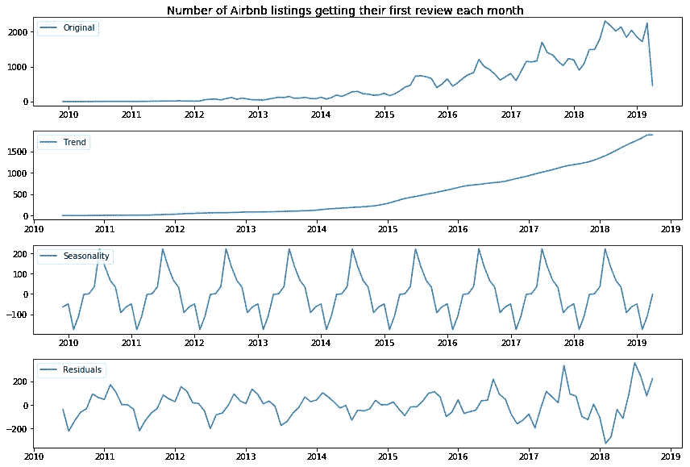

Decomposed time series

## 越多越热闹

> **问题:伦敦 Airbnb 房源的入住人数分布如何，这对价格有何影响？**

回答:最常见的物业设置是两个人睡在一个卧室的一张床上，带一个卫生间。不足为奇的是，容纳更多人的酒店会获得更高的夜间房价，大约 10 人后收益递减。

正如我在这个项目的建模部分发现的那样，价格的最大预测因素是一处房产能容纳的人数。

> 所以，可能是时候买那个沙发床了。

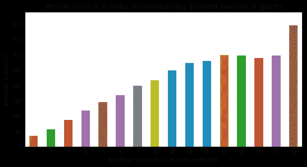

## 宾客心 Airbnb

> **问题:评论的分布是什么样的？**

回答:人们喜欢他们的航空站。对于每个审核类别(准确性、清洁度、入住、沟通、位置、价值和总体)，大多数已审核的列表都获得了该类别的 10/10 评分(或总体 95-100/100)。所以，最好确定你属于这一类。8 分或 8 分以下的评分相对较少。客人似乎对沟通、入住和准确性最为肯定。

大约四分之一的名单还没有被审查。这些大多是尚未完成入住的酒店，其中许多可能是“不活跃”的酒店，即那些虽然列在网站上，但没有任何预订日期的酒店。

## 您的客人会喜欢的便利设施(以及您的酒店可能讨厌的设施)

> **问题:哪些便利设施是常见的，哪些会提高 Airbnb 房源的价格？**

答:设施可以分为四大类:

**不常见，但拥有它的房产具有更高的中值价格:**

*   阳台
*   被单和枕套
*   咖啡机
*   基本烹饪设备
*   电梯
*   儿童友好型
*   户外空间
*   允许长期停留
*   私人入口
*   安全或安保系统
*   自助入住

**大部分房产都有，有了它的房产有更高的中位数价格:**

*   电视
*   洗衣机、烘干机和/或洗碗机

**大部分楼盘都有，有和没有的楼盘价格没有大的区别:**

*   互联网

**不常见，拥有它的房产价格中位数较低:**

*   早餐(可能因为这些是住宿加早餐，因此是单人间而不是整个家庭)
*   停车(大概是因为这些不太可能是中心物业)
*   受到主持人的问候(出人意料！)
*   允许携带宠物

由此得出的结论是，主办者可以做一些事情来尝试提高他们的列表价格。然而，并不总是存在简单的因果关系，例如，有停车位可能会提高你的价格，但有停车位的房源平均来说更便宜，因为它们不太可能位于伦敦市中心，而且位置是比停车位更重要的因素。

以下是一些重要提示:

*   **确保你拥有竞争对手也拥有的必需品**，例如互联网、电视和白色家电(洗衣机、烘干机和/或洗碗机)。
*   如果可以的话，**增加一些额外的东西，让你的房产脱颖而出，获得更高的价格**。例如，你可以买一台咖啡机，允许自助入住和长期入住，让你的酒店对儿童友好。
*   **不要养宠物**，因为宠物会给你的酒店带来额外的损耗，这可能会损害酒店的财务表现(更不用说会吓跑那些可能喜欢无烟酒店的客人)。

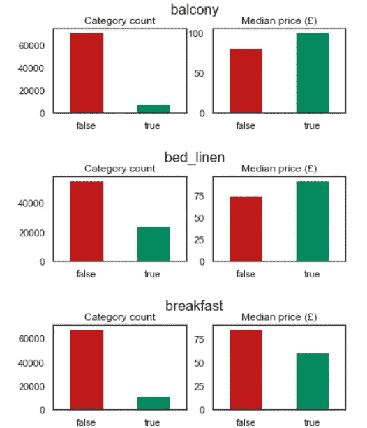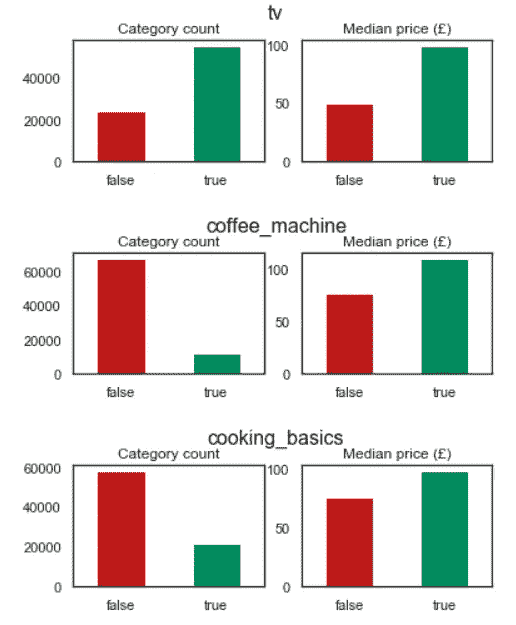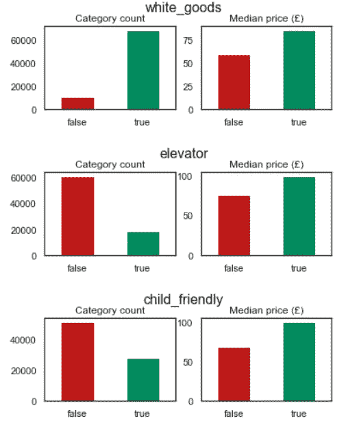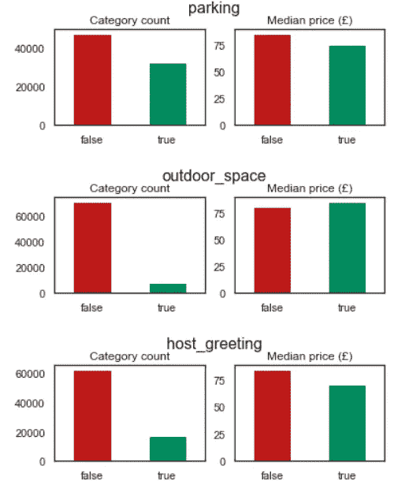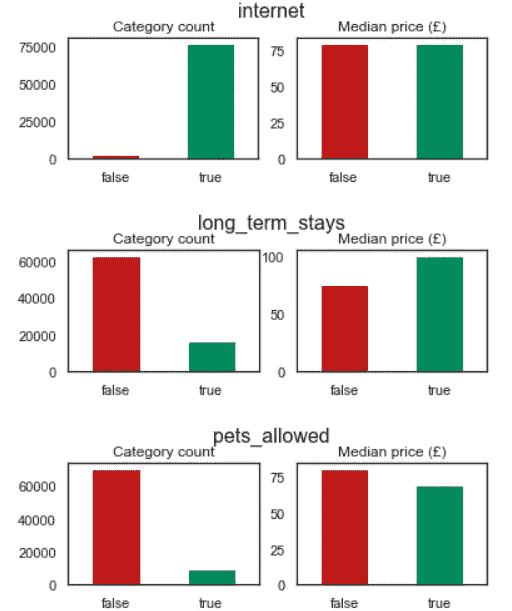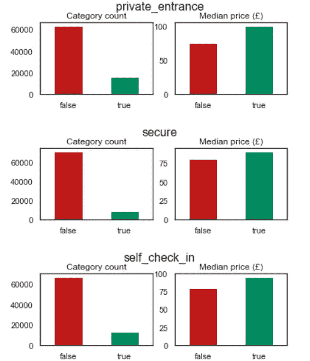

## 不值得额外的努力

> **问题:当超级主持人值得吗？而且值得被验证吗？(经常出现的两个问题)**

两个问题的答案都是:不尽然。

大约 15%的主机是超级主机。这需要满足四个标准:

1.  每年至少接待 10 次住宿
2.  快速回应客人，保持 90%或更高的回应率
3.  至少有 80%的五星评价
4.  不要取消已确认的预订

然而，这似乎并没有提高他们的 Airbnb 房源每晚的中值价格，因此它是否值得是有争议的(从纯粹的财务角度来看)。

大约 35%的主机经过验证，例如通过提供 ID 和验证您的电话号码和电子邮件地址。然而，有趣的是，尽管人们可能期望由验证过的主机所要求的额外信任会导致更高的夜间价格，但是在具有验证过的和未验证过的主机的列表的中间夜间价格之间没有可辨别的差异。

然而，除了经济原因之外，出于其他原因(比如善良的人)，这些可能仍然是值得做的事情。

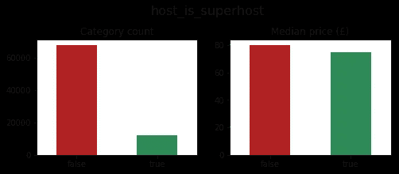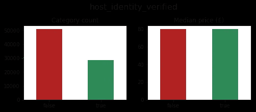

# 摘要

上面的探索性分析强调了一些有趣的趋势和模式，以及一些可以提高 Airbnb 房源价格的因素。在[的另一篇文章](https://medium.com/@lvlewis8/predicting-airbnb-prices-with-machine-learning-and-deep-learning-f46d44afb8a6)中，我将详细介绍我如何使用这些数据建立一个模型来预测 Airbnb 的价格。我希望你至少发现了一些有用的(如果你是 Airbnb 的主人)和/或有趣的(如果你像我一样是个数据迷)！

如果你觉得这篇文章有趣或有帮助，请通过鼓掌和/或评论的方式让我知道，你可以关注我，以便在未来的文章中得到通知。感谢阅读！