# 利用机器学习和位置数据预测 Airbnb 价格

> 原文：<https://towardsdatascience.com/predicting-airbnb-prices-with-machine-learning-and-location-data-5c1e033d0a5a?source=collection_archive---------2----------------------->

## 使用苏格兰爱丁堡市数据的案例研究

*关键词:Airbnb、爱丁堡、城市、数据科学、熊猫、geopandas、地理空间、foursquare、地图、matplotlib、建模、邻居、网络、numpy、foursquare API、规划、python、城市规划、数据可视化*

Photo by [Paul Fiedler](https://unsplash.com/@paulfiedler?utm_source=medium&utm_medium=referral) on [Unsplash](https://unsplash.com?utm_source=medium&utm_medium=referral)

作为 [**IBM 数据科学专业证书**](https://www.coursera.org/professional-certificates/ibm-data-science) 的一部分，我们可以尝试一下我们自己的数据科学顶点，在那里我们可以体验像数据科学家一样解决问题和回答问题的感觉。对于我的任务，**我决定做另一个项目，研究 Airbnb 价格与其决定因素之间的关系。**是的，有几个很酷的，像[劳拉·刘易斯](https://medium.com/u/afb662460a24?source=post_page-----5c1e033d0a5a--------------------------------)的[这里](/predicting-airbnb-prices-with-machine-learning-and-deep-learning-f46d44afb8a6)。如果没有阅读和理解她的(和她的代码)，我就不可能完成我的工作，所以恭喜你！然而，由于我对交通研究很感兴趣，**我添加了一点地理空间分析**，通过**研究位置特征作为可能的预测因素。**这篇文章解释了一些项目背景、数据收集、清理和预处理、建模和快速总结。

1.  [项目背景及目标](#d812)
2.  [数据](#3efa)
3.  [数据清理和探索](#fb28)
4.  [位置特征](#788c)
5.  [建立模型](#ae8c)
6.  [改进模型](#9a7d)
7.  [结论和建议](#c97f)

对于**完整笔记本**全部代码，可以在我的 Github 上查看[**回购。**](https://github.com/gracecarrillo/Coursera_Capstone/blob/gh-pages/Exploring_Edinburgh_Graciela_Carrillo.ipynb)

# 项目背景和目标

如果出于某种原因你还不知道，Airbnb 是一个短期房屋和公寓租赁的互联网市场。举例来说，它允许你在外出时出租(列出)你的房子一周，或者出租你的空卧室。Airbnb 房东面临的一个挑战是确定最佳的每夜租金价格。在许多地区，租房者(房东)都有很好的房源可供选择，他们可以根据价格、房间数量、房间类型等标准进行筛选。由于 Airbnb 是一个市场，主机可以收取的费用最终取决于市场价格。Airbnb 上的搜索体验是这样的:

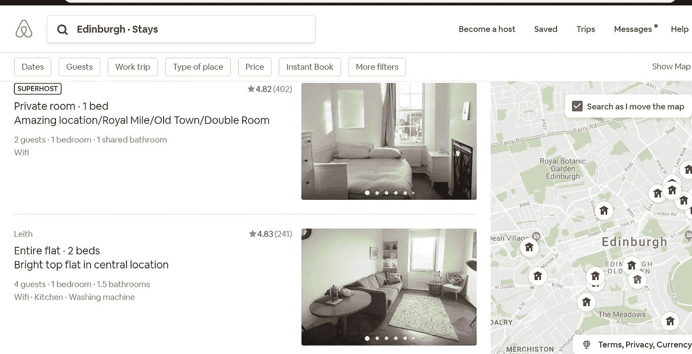

Airbnb Edinburgh home page at [https://www.airbnb.co.uk/s/Edinburgh--United-Kingdom/all?_set_bev_on_new_domain=1571135536_%2B1HjOBOK%2FivIgihM](https://www.airbnb.co.uk/s/Edinburgh--United-Kingdom/all?_set_bev_on_new_domain=1571135536_%2B1HjOBOK%2FivIgihM)

虽然 Airbnb 为主机提供了一般的指导，但没有容易获得的方法来确定出租空间的最佳价格。有第三方软件可用，但价格昂贵(关于可用软件的示例，请点击[此处](https://beyondpricing.com/))。

一种方法可以是找到一些与将要出租的地方相似的列表，平均列出的价格，并将我们的价格设置为计算出的平均价格。但是市场是动态的，所以我们希望经常更新价格，这种方法可能会变得繁琐。

另一个问题？我们可能会错过我们的列表相对于周围列表的竞争优势，比如它离杂货店、酒吧和其他额外服务有多近，或者甚至是我的照片相比有多棒。

因此，这个项目使用了几个列表功能来尝试和预测价格，并增加了一个基于空间的预测器:**房产与某些场馆**的距离。这使得该模型可以对诸如住在酒吧、酒吧或超市附近等事物进行隐性定价。

# 数据

Airbnb 不向公众发布任何数据，但 Airbnb 内部一个名为[的独立小组](http://insideairbnb.com/get-the-data.html) 从 Airbnb 网站收集并汇编了许多城市房源的公开信息。为了这个项目，我使用了他们在 2019 年 7 月 21 日在苏格兰爱丁堡市收集的数据集。它包含了当天网站上所有爱丁堡 Airbnb 房源的信息(超过 14，000 个)。

数据有一定的局限性。最值得注意的一点是，它刮的是广告价格，而不是以前的客户支付的实际价格。更精确的数据可以在像 AirDNA 这样的网站上付费获得。

数据集中的每一行都是 Airbnb 网站中特定城市的可用租赁清单(观察)。这些列描述了每个列表的不同特征(特性)。

该项目将研究的一些更重要的功能如下:

*   租赁可以容纳的客人数量
*   `bedrooms`:租金中包含的卧室数量
*   `bathrooms`:租金中包含的浴室数量
*   `beds`:租金中包含的床位数
*   `price`:每晚租金
*   `minimum_nights`:租赁期间客人可入住的最少天数
*   `maximum_nights`:租赁期间客人可入住的最大天数
*   `number_of_reviews`:之前客人留下的评论数量

为了对 Airbnb 租金价格和某些场馆附近的物业之间的空间关系进行建模，我使用了 [Foursquare API](https://developer.foursquare.com/) 来访问该市的场馆，街道网络可通过 [OpenStreepMap (OSM)](https://www.openstreetmap.org/#map=12/55.9408/-3.1835) 获得。

# 数据清理和探索

简而言之，原始数据集包含 14014 个 Airbnb 列表和 106 个功能，但我删除了一大堆功能。例如，其中一些是自由文本变量，如酒店的主机描述和所有书面评论。为了包含这些数据，我必须做一些自然语言处理，但不幸的是，我不能。所以这些功能都被删除了。此外，一些列只包含一个类别，所以它们也被删除了。大多数列表不提供体验功能，所以这也是不可能的。

一个完整的一步一步的这一节，我如何和为什么我这样做是在笔记本上的[我的 github](https://github.com/gracecarrillo/Coursera_Capstone/blob/gh-pages/Exploring_Edinburgh_Graciela_Carrillo.ipynb) 或[这份报告](https://gracecarrillo.github.io/Coursera_Capstone/#data_description)没有所有的代码。

还有一个有趣的探索性数据分析。“没有夏洛克”的发现之一是，进入市场的上市公司有明显的季节性。

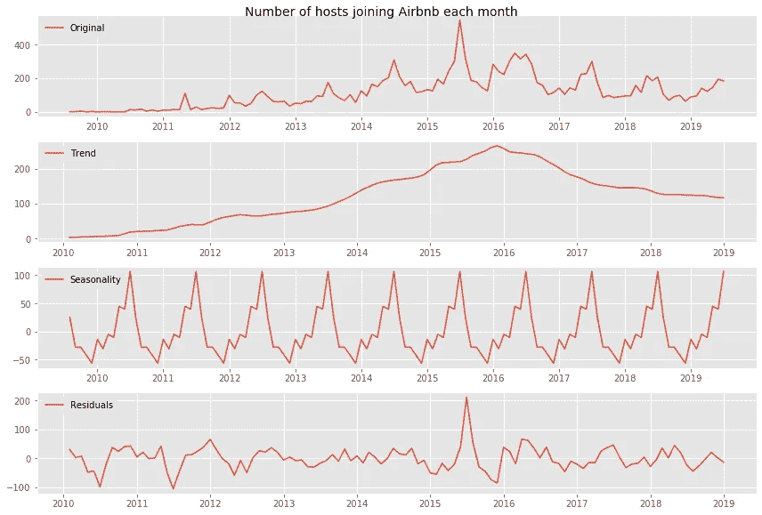

Clear seasonality in the middle of the year

每年年中(夏季)左右都有一个主机加入的高峰，最低点是每年的年初和年末。8 月，在[爱丁堡边缘艺术节](https://www.edfringe.com/)期间，房间租金价格大幅上涨。这是一个非常受欢迎的活动，由于每年参加的人数众多，许多出租的房产将被占用。爱丁堡全年有许多其他活动，主要集中在 4 月和 12 月之间。这几个月有世界级的艺术家在表演。

在这一年的其余时间里，爱丁堡作为文化之都的地位是独一无二的，不仅仅是苏格兰，还有英国。对住宿和旅游有稳定的需求，因为爱丁堡是仅次于伦敦的商业之都。

就价格随时间的变化而言，爱丁堡 Airbnb 房源的每晚平均价格在过去 10 年中略有上升。但房地产价格的高端已经增加了很多，导致平均价格比中位数有更大的增长。2010 年的平均价格为 107.33 英镑，中位数为 115.0 英镑，而 2018 年(上一个完整数据年度)的平均价格为 104.55 英镑，中位数为 79.0 英镑。基本上，昂贵的住宿业主很快发现了使用 Airbnb 的好处([主要是更少的税收和更少的责任](https://heinonline.org/HOL/Page?handle=hein.journals/jtelhtel13&div=12&g_sent=1&casa_token=&collection=journals)，但那是另一个故事了)。

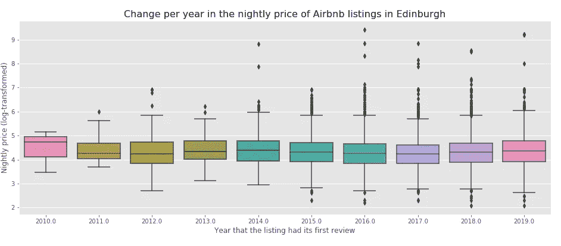

Outliers have been increasing over time

# 位置特征

**现在是酷的东西(对我来说)。**寻找住宿时，靠近某些旅游区很重要。但是，知道你将有一个杂货店或超市在一个步行距离可以加分。很多租房者喜欢这样的事实，当你有了 Airbnb 而不是酒店房间时，你可以自己做饭(并节省一些)。

因此，靠近某些场所，如餐馆、咖啡馆和商店可以帮助我们预测价格。

Airbnb 的许多房源都集中在爱丁堡的老城区，这与游客的巨大吸引力相符，尤其是在一年一度的边缘节日期间。

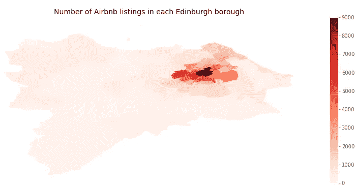

Most Airbnb listings in Edinburgh are near the Old Town area

价格的分布也反映出最贵的房源位于老城区。

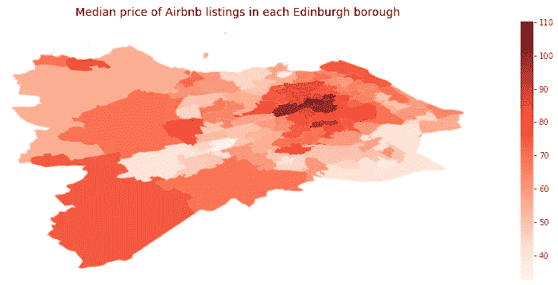

Price spatial distribution

为了获得特定场馆的信息，我使用爱丁堡街区的经纬度，通过 Foursquare 的 API 下载了每个街区的场馆列表。

纬度和经度来自 geojson 文件形式的公开的街区列表。我本来可以从原始 Airbnb 列表数据集中检索纬度和经度，但是我已经在使用这个文件，所以我决定只使用它。后来，我把它们按邻域合并。

首先，我必须加载地理数据:

`map_df`是一个[地理数据框架](http://geopandas.org/data_structures.html)。为了检索每个街区的场馆，我从[地理系列](http://geopandas.org/data_structures.html)中的点对象提取了纬度和经度或`x`和`y`。以下代码将`x`和`y`作为原始`map_df`中单独的 GeoDataFrame 列返回。

然后，我们创建 API 请求 url，发出 GET 请求，并提取我们附近的每个场馆的信息。下面这个非常有用的函数是在数据科学课程中提供给我们的。它遍历所有的街区来检索我们想要的数据:

现在，我们在每个邻域上运行上述函数，并创建一个名为`edinburgh_venues`的新数据帧。

一旦我们有了这个，我们就可以看看每个街区周围的不同场地。首先，有 182 个独特的场馆类别。不过，那里很乱。因此，我清理了检索到的数据，将这些行按邻域分组，并取每一类的平均值和出现频率。

这帮助我找到了每个街区最常见的 5 个场所:

并将其保存到熊猫数据帧中，以便查看并决定对哪些场馆感兴趣:

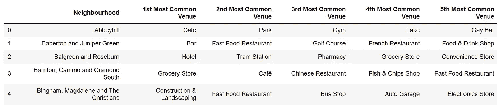

Five most common venues per neighbourhood (first five rows)

仔细查看数据，很明显最常见的场所是*酒店*、*酒吧*、*杂货店/超市*和*咖啡馆/咖啡店*，其次是*酒吧*、*汽车站*和*印度餐馆*。餐馆被分成子类别。所以我把它们归为一个大的类别:餐馆。我认为附近有酒店不太可能影响价格，因为 Airbnb 的房源应该属于不同的短期租赁类别。与酒店相比，它们提供了完全不同的好处。所以我没有考虑那一类场馆。

有了这些数据，我开始测量我们一直在谈论的离场馆的距离。我们通过分析**可达性**来做到这一点。

可达性是到达目的地的容易程度。是运输中一个非常重要的概念，有大量的文献可用。无障碍环境塑造了人们获得机会和发挥其作为人的全部潜力的能力。这就是为什么**可达性指标**被大量用作空间和交通不平等的替代指标。

为了简单起见，对于这个项目，我通过测量访问场地或从 Foursquare 下载的**兴趣点(POIs)** 来测量可访问性。*酒吧、餐馆、咖啡馆和超市/杂货店*是我们的兴趣点(441 个兴趣点的数据集)。

为了帮助进行可访问性分析， [Pandana](https://udst.github.io/pandana/introduction.html#contributing-to-pandana) 是 Python 库的首选。Pandana 是一个方便的图形库，允许将 Pandas 数据帧传递到一个网络图中，该网络图将图形级分析映射到底层 C 操作。所有这些都是说，它比传统的基于 Python 的图形要快得多。

为了开始分析，我们必须使用爱丁堡的位置数据从 OSM API 获取街道网络数据(边界框)。

运行代码后，从 OSM 下载一个有 51，553 个节点的网络。当我们将其保存到 [HDF5](https://www.pythonforthelab.com/blog/how-to-use-hdf5-files-in-python/) 时，您会注意到某些节点被排除在外。这在优化网络以使其仅包含经验证的节点时非常有用。我使用了`low_connectivity_nodes()`方法来识别那些可能没有连接到更大网络的节点，并排除它们。

最后，我们计算 poi 的可访问性:

生成的数据框如下所示:

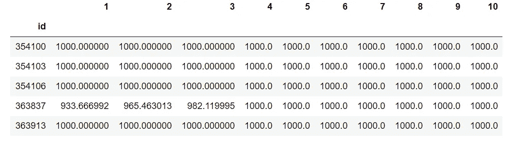

*Network distance from the node to each of the 10 POIs*

还有什么更好的方式来理解所有这些数字是关于什么的，而不是一些漂亮的可视化(没有它们，什么是地理空间分析？).首先，让我们看看到任何类型的最近 POI 的距离，因为我对场馆之间的可访问性差异不感兴趣:

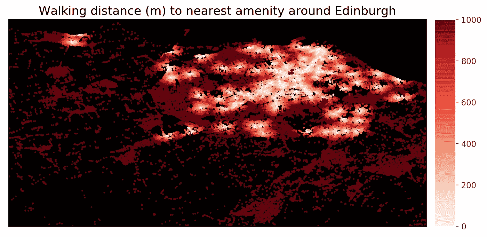

我们可以看到，在一些区域，人们必须步行 500 米以上才能到达最近的便利设施，而爱丁堡的老城区平均步行距离不到 100 米。

该地图以米为单位显示了从每个网络节点到最近的餐馆、酒吧、咖啡馆、酒吧和杂货店的步行距离。但是，一个更好的无障碍指标可能是可以使用大量的便利设施。所以我没有画最近的，而是画了第五近的便利设施的可达性:

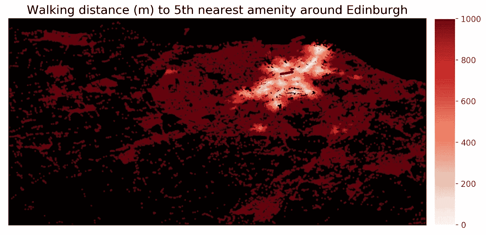

这一次更加引人注目的是，爱丁堡的老城区和市中心区域具有更好的可达性。

对于这个项目，我假设进入餐馆、商店、咖啡馆、酒吧和酒馆对 Airbnb 用户来说很重要。因此，我对所有兴趣点进行了同等加权，并使用到第五个最近场馆的距离作为可达性的复合度量。与只画出到最近地点的距离相比，这能更清楚地显示出哪些社区最适合步行。

以下代码将距离设置为第五个最近的便利设施，作为可达性的复合度量:

这就是了。已创建位置要素，然后将其添加到数据集进行建模。

# 构建模型

**这里发生了很多数据准备**，当然是在回购上。我不会涉及任何细节，但总的来说，我清理了数据，检查了多重共线性并处理了有问题的要素，对数据进行了对数转换，这有助于使`price`更正态分布，热编码分类要素，并使用`StandardScaler()`将其标准化。最后，我将数据分成训练测试。

使用了两种模型:

*   一个**空间特征价格模型** (OLS 回归)，带有来自 Scikit-Learn 库的`LinearRegression`
*   **梯度增强方法**，带有 XGBoost 库中的`XGBRegressor`

使用的评估指标是均方误差(损失)和 r 平方(准确性)。

我选择运行 Hedonic 模型回归，因为它们常用于房地产评估和房地产经济学。理想情况下，应进行[拉格朗日乘数检验](https://stats.idre.ucla.edu/other/mult-pkg/faq/general/faqhow-are-the-likelihood-ratio-wald-and-lagrange-multiplier-score-tests-different-andor-similar/)以验证因变量中是否存在空间滞后，因此空间滞后模型是估计空间 HPM 的首选模型(使用 [Pysal](https://pypi.org/project/pysal/) 进行空间回归，参见[本文](http://darribas.org/gds_scipy16/ipynb_md/08_spatial_regression.html))。然而，为了这个项目的目的，我只使用一个传统的 OLS 模型进行特征价格估计，它包括空间和位置特征，但没有考虑空间依赖性的空间滞后。

因此，第一个解释变量是列表特征(`accommodates`、`bathrooms`等)，第二组基于空间和位置特征的解释变量是`Score`，这是我们通过 Pandana 计算的到第五个最近场馆的网络距离；和`Neighbourhood`归属，如果列表属于指定的邻域，则为`1`，否则为`0`。

这是我为**空间特征价格模型**编写的代码:

和结果:

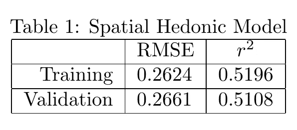

因此，这些特征解释了目标变量中大约 51%的方差。解释`mean_squared_error`值比 r 平方值更直观。作为方差的平方根， **RMSE 可以解释为未解释方差**的标准偏差，并且具有与响应变量相同单位的有用属性。但是在这种情况下，响应变量是经过对数转换的，所以解释不是以原始单位进行的，而更像是百分比偏差。RMSE 值越低表示拟合度越好。RMSE 可以很好地衡量该模型预测市场反应的准确程度。我们可以用散点图直观地看到这种关系:

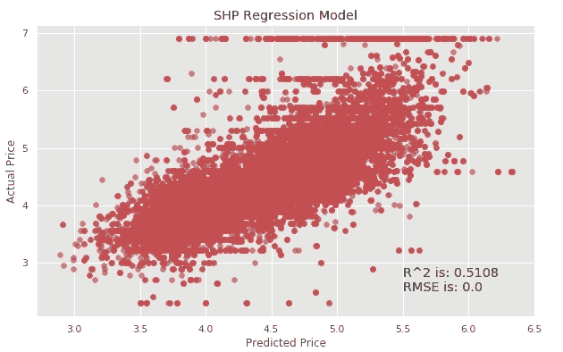

Actual vs Predicted Price for Spatial Hedonic Regression Model

我还尝试使用[山脊正则化](https://www.datacamp.com/community/tutorials/tutorial-ridge-lasso-elastic-net)来减少不太重要的特征的影响。岭正则化是缩小不太重要的特征的回归系数的过程。它采用参数α，该参数控制正则化的强度。

我通过循环几个不同的 alpha 值进行了实验，看看这如何改变结果。

这是我得到的:

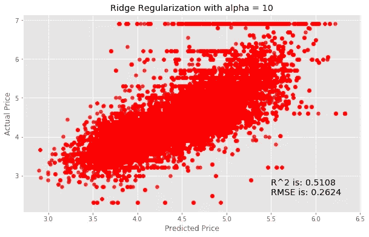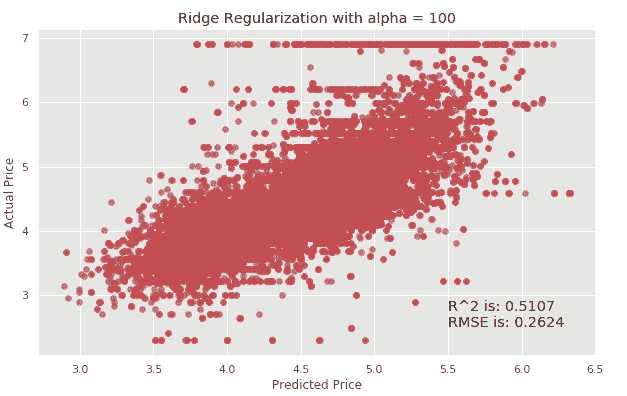

是的……没发生什么。随着 alpha 值的增加，RMSE 值和 r 值几乎相同，这意味着使用岭回归模型时，模型预测并没有显著提高。

继续讨论**梯度增强决策树模型。**

XGBoost(e**X**treme**G**radient**Boost**ing)是一个针对速度和性能而设计的梯度提升决策树的实现。是一种非常流行的算法，最近一直主导着结构化数据的应用机器学习。

与 Hedonic 回归相比，该模型预计将提供最佳的可实现准确性和特征重要性的度量。确实如此。

以下是 XGBoost 模型的代码:

结果是:

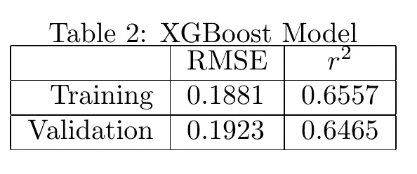

使用此模型，**这些特征解释了目标变量**中大约 65%的方差，并且具有比 SHP 回归模型更小的 RMSE。

除了其卓越的性能，使用决策树方法(如梯度提升)的好处是，它们可以从训练好的预测模型中自动提供特征重要性的估计值。有关如何在提升决策树中计算特征重要性的更多详细信息，请查看 StackOverflow 中的[答案。](https://stats.stackexchange.com/questions/162162/relative-variable-importance-for-boosting)

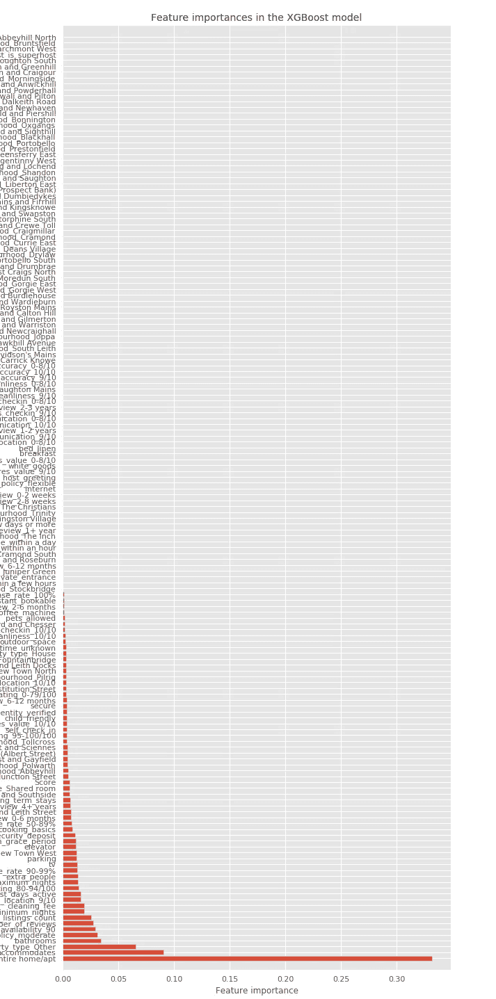

XGBoost Model Feature importance

如您所见，在这个 XGBoost 回归模型中，许多特性的特性重要性为 0。

**十大最重要的功能是:**

1.  是否出租整个公寓`room_type_Entire home/apt`
2.  酒店可容纳多少人(`accommodates`)
3.  财产的类型(`property_type_Other`)
4.  浴室的数量(`bathrooms`
5.  未来 90 天内有多少天可以预订(`availability_90`)
6.  评论的数量(`number_of_reviews`)
7.  取消政策是温和的(`cancellation_policy_moderate`)
8.  主持人还有多少其他列表(`host_listings_count`)
9.  最少住宿天数(`minimum_nights`)
10.  最大住宿天数(`maximum_nights`)

预测价格的最重要的特征是租赁的是整个公寓。好像差了很多。有道理。如果报价是整个公寓/房子，要价会更高。第二是物业容纳多少人，也有道理。当你寻找一个地方时，这是你首先要找的东西。

有趣的是，定位功能并不在前十名。与前 3 个特征相比，属于某个街区和`Score`(可达性指标)的重要性相对较低。不过，`Review_Scores_Location_9/10`差点进了前十。相当有趣。

**价格似乎受到先前租户对该位置的积极评价的影响，而不是该物业相对于主要兴趣点的实际可达性。**

这也可能是因为爱丁堡是一个适合步行的小城市，交通便利。因此，在到达主要旅游景点和设施时，位置可能不是一个主要问题。

# 改进模型

XGBoost 模型生成的 feature importances 图显示，许多评论列的重要性相对较低。所以，我放弃了。然后我再次运行模型，只是没有那些列。

结果如下:

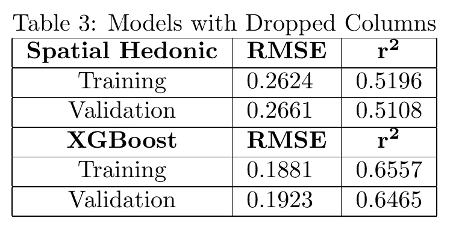

和岭回归的尝试一样，这里也没有发生什么。没有额外的回顾列，空间享乐回归和 XGBoost 的表现几乎完全相同。

# 结论和建议

如果我们要选择一个模型来预测价格，那么它应该是不带评论列的 XGBoost。它比两种空间享乐回归模型都表现得更好，与第一个 XGBoost 模型一样好，但计算成本更低。尽管如此，它只能预测 66%的价格变化。也就是说我们还有剩余的 34.44%无法解释。

一堆没有包括在内的不同变量可以解释剩余的方差。

例如，考虑到客户对列表的评论在确定价格中的重要性，更好地理解评论很可能会改进预测。人们可以使用[情绪分析](/sentiment-analysis-concept-analysis-and-applications-6c94d6f58c17)。可以为每个列表属性的每个评论分配介于-1(非常负面的情绪)和 1(非常正面的情绪)之间的分数。然后，对与该列表相关的所有评论进行平均，最终得分可以作为一个新特征包含在模型中(见[此处](https://arxiv.org/pdf/1907.12665.pdf)的示例)。

我们也可以将图像质量作为一个特征。通过使用对 Airbnb 面板数据集进行深度学习和监督学习分析的[差异差异](https://www.mailman.columbia.edu/research/population-health-methods/difference-difference-estimation)，研究人员发现，拥有经过验证的照片(由 Airbnb 的摄影师拍摄)的单位平均每年会产生额外的收入([见此处](https://poseidon01.ssrn.com/delivery.php?ID=204024105119026094069105008103096093034021070051045032025117103105027080085099113011048103001010014121023024085079004082003114107082070089028074094097015117086091125049040024103012093025001119016069070080070120120094005077005088015116003064009008121126&EXT=pdf))。

我仍然认为可访问性起着重要的作用，尽管这一次不是很清楚。我使用 OSM 步行网络进行可达性分析，但是使用[多模态图网络](https://github.com/udst/urbanaccess)会是理想的选择。这样，我就可以从整个交通网络的角度来衡量可达性，而不仅仅是从步行性的角度。也许特性的重要性在列表中会更高。

仅此而已。这是一个非常有趣的项目。

如果你设法看完了整本书，并且正在阅读这篇文章，感谢你的时间！非常感谢任何反馈。