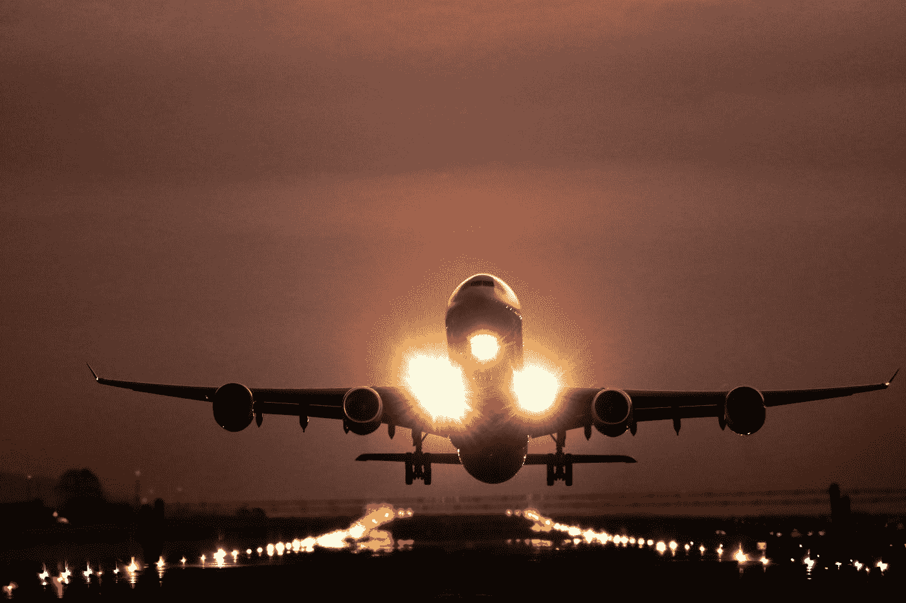
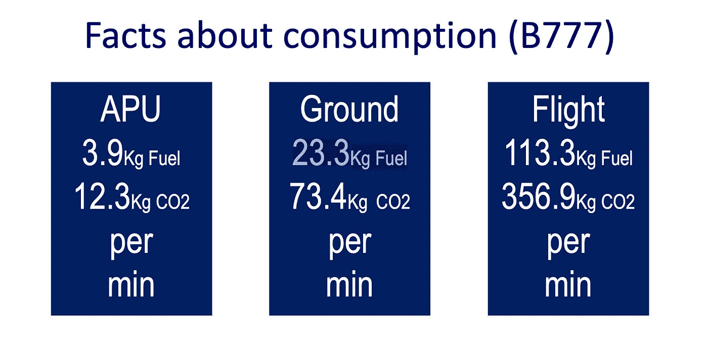
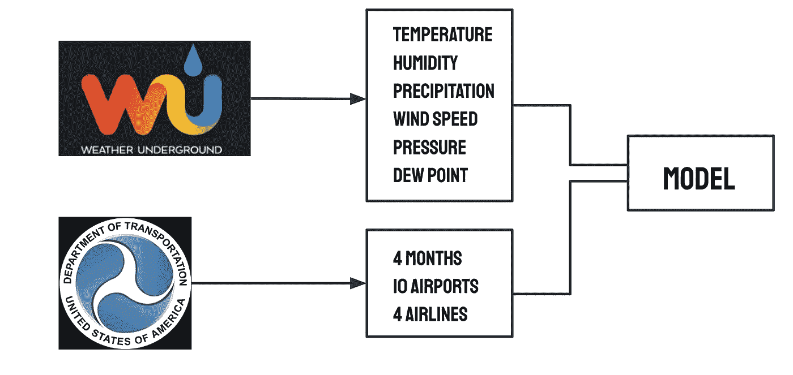
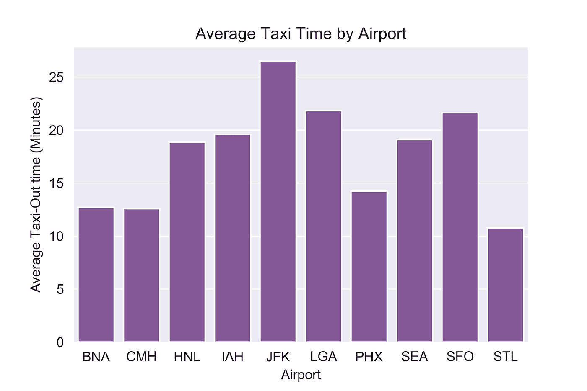
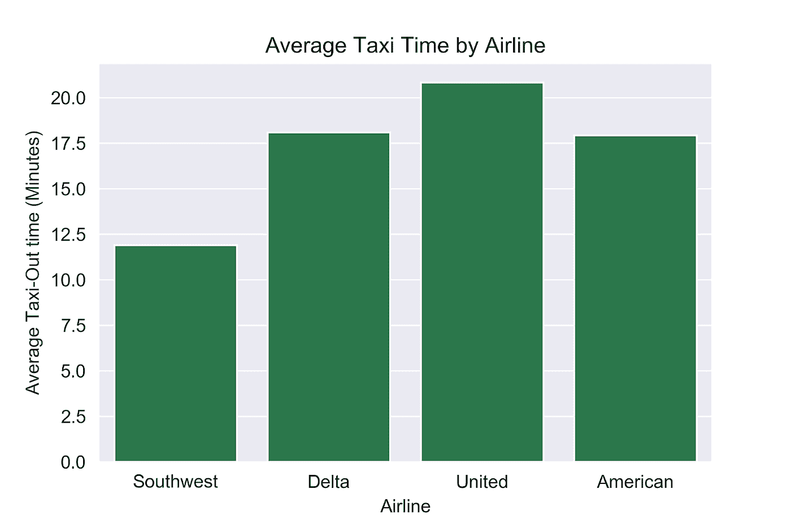
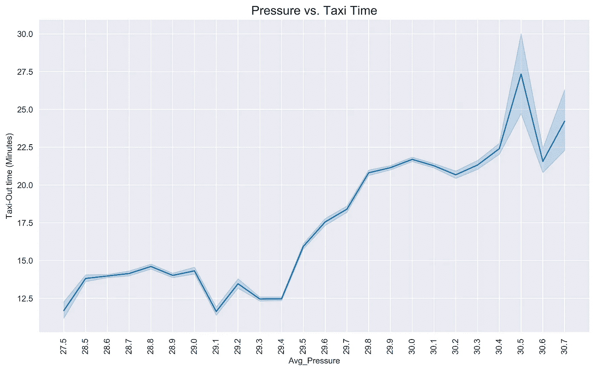
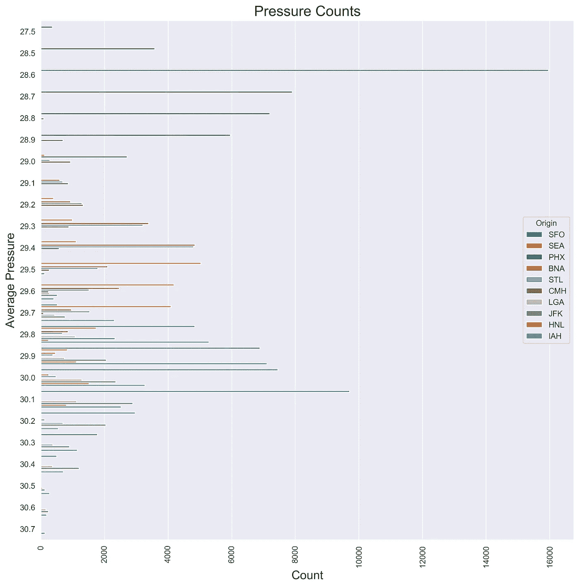
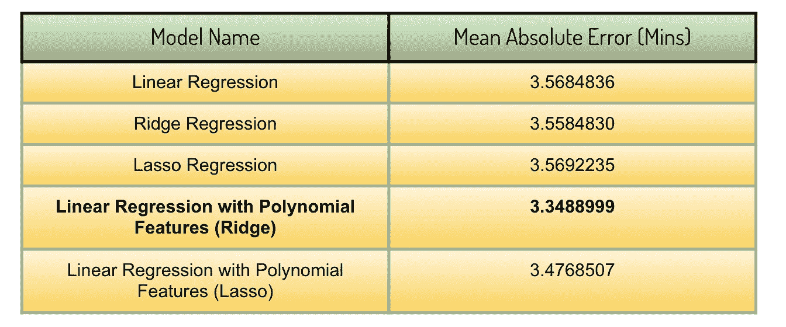
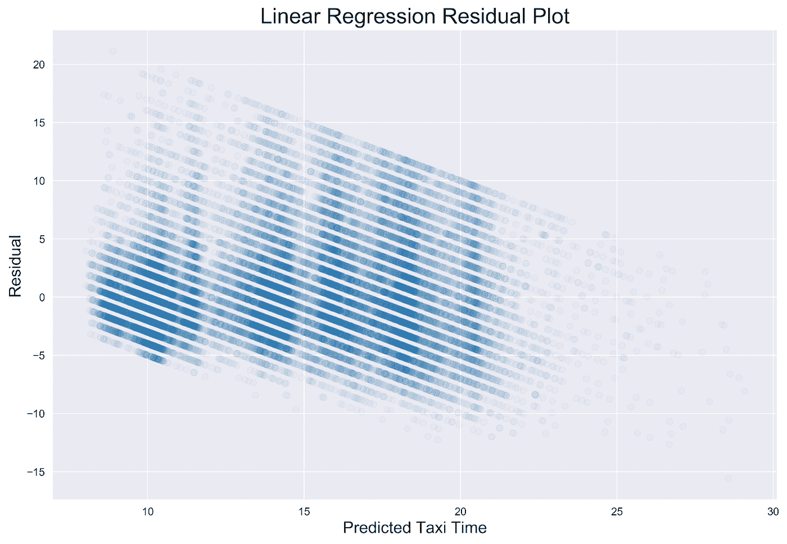
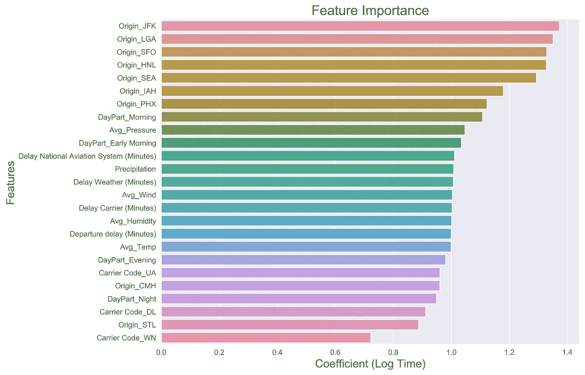

# 预测飞机滑行时间

> 原文：<https://towardsdatascience.com/predicting-aircraft-taxi-time-6c4eaa402d77?source=collection_archive---------24----------------------->

## 线性回归方法

Photo by [Josue Isai Ramos Figueroa](https://unsplash.com/@jramos10?utm_source=medium&utm_medium=referral) on [Unsplash](https://unsplash.com?utm_source=medium&utm_medium=referral)

如果你以前从一个繁忙的机场坐过飞机，很有可能你经历了一次滑行时间延迟。每个人都在飞机上，飞机甚至已经离开了登机口，然而起飞还需要相当长的时间。

## **背景**

定义滑行时间的一个简单方法是飞机在机场表面运动的时间。对于这个项目的范围，我只关注*出发滑行时间(或滑行时间)*，这是飞机离开航站楼登机口和实际从机场起飞之间的时间。典型地，整个过程由 ATC(空中交通管制)监督，飞行员被给予离开登机口、起飞等许可。

**太好了！我们定义了什么是出租车时间，但为什么它真的很重要？**

Fuel Consumption Statistics from International Civil Aviation Organization (ICAO)

快速浏览一下上面国际民航组织提供的一些信息就会发现，一架典型的波音 777 飞机仅滑行一项就要消耗 23.3 千克/分钟(或 6.15 加仑/分钟)的燃油。滑行时间平均为 15 分钟，仅仅滑行到起飞点就要消耗大约 92 加仑的燃料！

虽然不同类型的飞机会有不同的消耗率，但能够优化机场地面运动和减少滑行时间将使航空公司节省大量燃料成本，并减少二氧化碳排放，从而改善客户体验。

## **我的方法**

因为许多航班数据是基于航空公司的内部或主观数据，所以我选择比较排名前四的航空公司在滑行时间速度方面的表现，并重点关注天气模式如何影响滑行时间。所以我的目标可以浓缩成以下几个问题:

1.  不同航空公司的出租车时间不同吗？
2.  机场的天气状况对滑行时间有显著影响吗？如果有，影响有多大？
3.  是否有可能预测滑行时间以改进跑道排序？

## **数据**

对于这个项目的范围，我选择在 2018 年的 4 个不同月份(1 月、4 月、6 月、10 月)只关注 10 个机场，以尝试解释季节性。我还将我的航空公司限制在前四名(西南航空、美国航空、达美航空、联合航空)，因为它们在国内航班市场中占了很大一部分。我使用 Selenium 自动化了从运输局的航空页面下载航班统计数据的过程，并利用 BeautifulSoup 收集相应日期和机场的天气数据。

## **探索性数据分析**

快速浏览上面的柱状图可以发现，像 JFK 机场和旧金山机场这样极其繁忙的机场往往有更长的滑行时间。这是意料之中的，因为通过这些机场的航空交通量比 STL 等机场高得多，但这些初始假设通过数据验证仍然很重要。

一个有趣的观察是，西南方往往有最快的滑行时间。这是相当令人惊讶的，因为这是一个明显的区别，从其他航空公司，尽管我的研究，这是很难确定的原因。

我只考虑了西南航空公司不飞往像 JFK 这样的机场，但它仍然是最快的航空公司。

浏览一些航空论坛发现，即使是空中交通管制员也知道西南航空公司的出租车比其他航空公司快，但不知道为什么。一个可能的原因是，西南航空公司只使用波音 737，与其他航空公司使用的一些较大的飞机相比，波音 737 较小，因此更容易驾驶。这可能是在以后的项目中值得研究的东西。

## 气压

一开始令我困惑的一个显著关系是平均气压和滑行时间之间的正相关关系。

尽管我进行了研究，但我无法为压力和出租车时间之间的这种正相关找到合理的解释。然而，数据中的气压计数图显示，不同的机场往往有不同的平均气压读数，如下图所示。因此，压力和滑行时间之间的这种相关性被证明是飞机从哪个机场起飞的代理。

## **造型**

对于实际的建模，我选择坚持使用线性回归作为基线，同时在必要时使用 lasso 和 ridge 回归来提高模型性能。我使用**平均绝对误差**作为我的评估标准，因为我对我的预测与实际滑行时间的差距更感兴趣。结果如下:

如你所见，平均时间大约是 3.5 分钟。这意味着平均而言，模型的预测将与实际滑行时间相差约 3.5 分钟。此外，正则化没有产生巨大的影响，多项式特征的线性回归具有最佳性能，可能是因为这将允许航空公司和机场之间的交互。例如，一个多项式要素将是 JFK *德尔塔(机场*航空公司)，这可能是一个更好的预测德尔塔在 JFK 的出租车时间的要素，如果要素只是德尔塔。然而，即使这样也只减少了大约 10 秒的 MAE。

不过需要注意的一点是，这个模型打破了线性回归的一个假设——同方差。这可以从下面的残差图中看出:

如你所见，在上面的残差图中存在异方差。与剩余误差达到 15 分钟的较短时间相比，该模型在预测较长的滑行时间方面表现稍好。当我们考虑出租车时间的问题时，这实际上是有意义的。在短暂的滑行时间内，一个简单的差异，如飞行员驾驶的速度，可能会导致数据的差异，而我们的模型不具备处理这种情况的能力。而在更长的滑行时间里，可能有其他因素造成。比如这个数据中的一个特征就是*NAS 中的延误(分钟)*基本上是全国航空系统的延误。这种类型的延误会导致较长的滑行时间，因此，这一特征可能是模型预测较长滑行时间优于较短滑行时间的重要原因。

## 结论

从这个回归模型，我们可以得出结论，繁忙的机场和上午的航班往往有较长的滑行时间。虽然这种趋势是合理的，也是可以猜测的，但用数据来验证它是很重要的。此外，该模型能够更复杂地衡量每个机场，以确定飞机的滑行时间。

虽然西南航空公司在滑行时间指标上占主导地位的原因仍不清楚，但确定其他可能影响停机坪延误的因素是值得研究的。

**感谢您的阅读！**

项目资源库可以在这里找到[。](https://github.com/AbishekGollapudi/DataProjects/tree/master/Taxi-Time%20Regression)

## 参考

 [## 详细的统计数据

### 政府交通财务统计

www.transtats.bts.gov](https://www.transtats.bts.gov/ONTIME/Departures.aspx)  [## 加州旧金山天气历史|地下天气

### 编辑描述

www.wunderground.com](https://www.wunderground.com/history/monthly/us/ca/san-francisco/KSFO/date/2019-1)