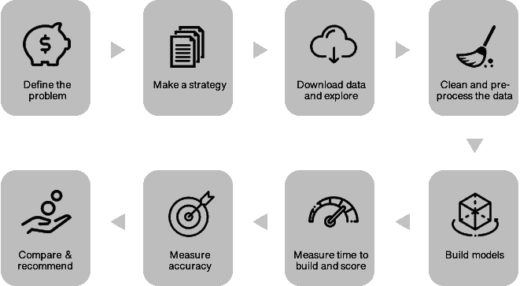
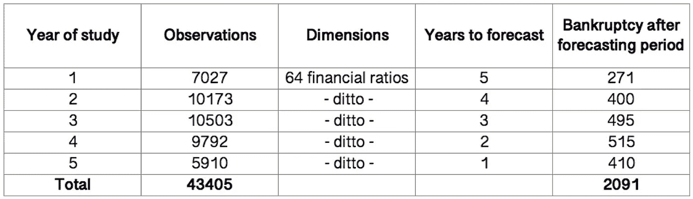
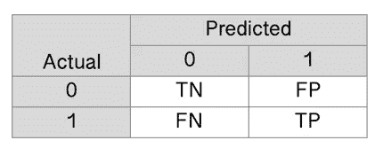
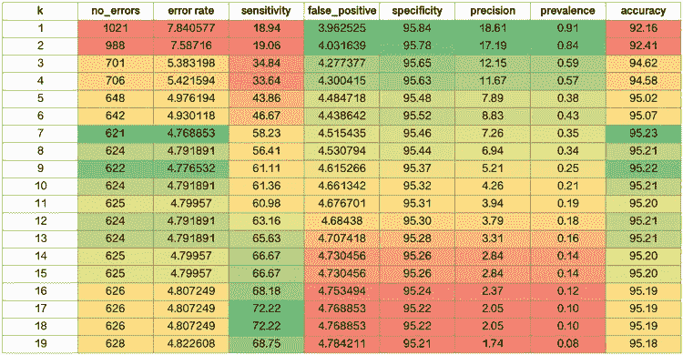
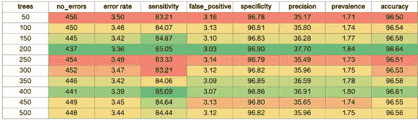
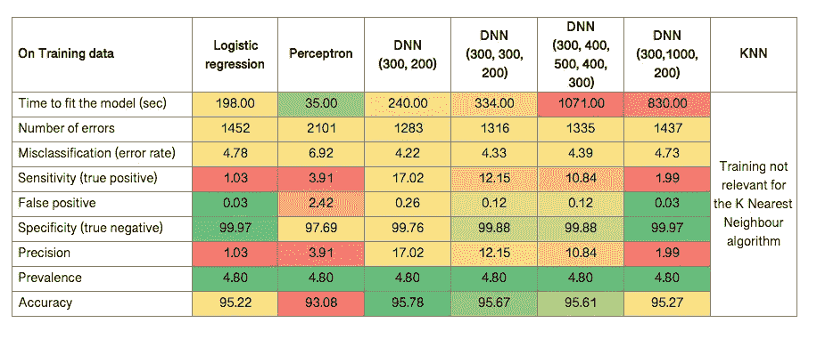
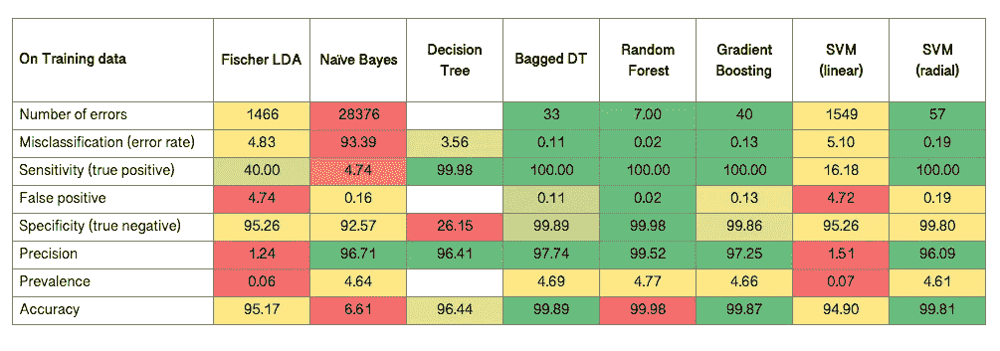
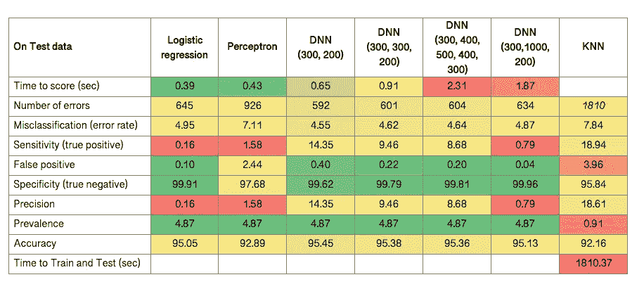
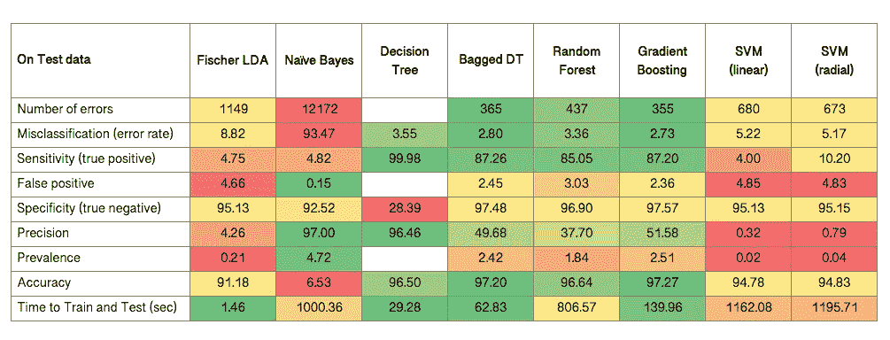
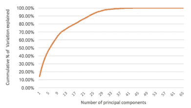

# 使用机器学习预测破产

> 原文：<https://towardsdatascience.com/predicting-bankruptcy-f4611afe8d2c?source=collection_archive---------18----------------------->

维克拉姆·迪瓦塔&迪瓦希什·迪曼

2008 年的经济危机引发了一场关于市场可持续性以及可用于预测市场可持续性的工具的讨论。为了避免未来发生这样的灾难性事件，对更好的预测模型的需求变得显而易见。公司和企业的破产在多个方面影响金融市场，因此通过监控多个变量来预测公司破产的需求变得更加重要。更好地理解破产和预测破产的能力将会影响全球贷款机构的盈利能力

作为一项分类工作，数据分析师有太多的选择。著名统计学家乔治·博克斯(George Box)曾经说过，“*所有的模型都是错的，但有些是有用的*”(维基百科，自由百科，2019)。考虑到这一点，我们承担了构建不同的监督机器学习算法的任务，并对每个模型进行了比较分析，以确定哪些模型更适合预测经济破产

我们遵循的分析流程概述如下:

## 关于数据集

本次练习使用的数据集是波兰公司在 5 年研究期内的破产状况，可从这里下载:【https://goo.gl/e2Px2y。它包含 43405 个观察值，分布在 5 个子集(每年一个)，每个观察值有 64 个财务比率。这里有一个 [URL](https://archive.ics.uci.edu/ml/datasets/Polish+companies+bankruptcy+data) ，其中提供了属性的名称(感谢 Harsha Danda 找到了这个链接)。一些公司在研究期间破产(用“1”表示)，而其他公司幸存下来(用“0”表示)。研究期间每年的总结如下。

## 性能指标

经过适当的输入和预处理后，数据以 70:30 的比例分成训练数据集和测试数据集。分类器建立在训练数据上，并且它们的性能使用训练和测试数据集的混淆矩阵来测量，如下所示:

其中 TP =真阳性的数量，
TN =真阴性的数量，
FP =假阳性的数量，
FN =假阴性的数量。

这些可用于计算以下指标:

观察次数，n = TN+FP+FN+TP
错误数= FP+FN
错误分类(错误率)= FP+FN / n
敏感度(真阳性)= TP / FN+TP
假阳性= FP / TN+FP
特异性(真阴性)= TN / TN+FP
精度= TP / FP+TP
患病率= FN+TP / n
准确度= TN+TP

由于我们感兴趣的是将公司分类为可能破产(或不破产)，上述比率可以解释如下:

错误分类(错误率):分类器出错的频率有多高？
敏感性(真阳性):当一家公司实际上“破产”时，分类器正确预测结果的频率是多少？
误报:当一家公司实际上“没有 _ 破产”时，分类器出错的频率是多少？
特异性(真阴性):假设一家公司“没有破产”，那么分类器有多准确？
精度:当分类器预测“破产”时，它的正确率是多少？
普遍性:数据集中“破产”实际上发生的频率有多高？
准确性:总体而言，分类器正确的频率如何？

## 构建模型

使用 R 和 Python 为这个练习构建了不同的机器学习算法。可以在这里找到运行代码的视频:[https://youtu.be/OWbuOza_Gao](https://youtu.be/OWbuOza_Gao)

逻辑回归
感知器作为分类器
深度神经网络分类器(具有不同的大小和深度)
Fischer 线性判别分析
K 最近邻分类器(具有不同的 K 值)
朴素贝叶斯分类器
决策树(具有不同的桶大小阈值)
袋装决策树
随机森林(具有不同的树大小)
梯度推进
支持向量机(具有不同的核)

有些算法是用不同的初始化构建的，为了找到最佳的初始化，记录了每种算法的性能。例如，对于 K-最近邻，尝试了从 1 到 19 的不同 K 值。下面以从红到绿的颜色编码显示了每个人的表现，红色表示“差”，绿色表示“好”:

我们看到，随着 k 的增加，错误率(以及准确性)降低，然后又开始增加。灵敏度随着 k 的增加而增加，而特异性随着 k 的增加而降低。

类似地，我们为随机森林尝试了不同数量的树，范围从 50–500，跳跃 50:

该模型在有 200 棵树的情况下表现最佳。

## 模型比较

我们制作了一个所有模型的对比图。基于所使用的超参数以及为测量性能而选择的度量标准，可以看出这些模型表现不同。下面给出了关于训练数据的度量的概述。

测试数据的指标概述如下:

## 一些发现

数据集有大量的“0”(没有破产的公司)，很少的“1”(破产的公司)。因此，大多数模型给出了很高的精确度，但是在预测“1”时表现很差。由于任务是预测破产，我们认为我们必须把重点放在敏感性(真正的积极)作为比较模型的相关措施。

我们发现，集成模型如梯度推进和袋装决策树在训练和测试数据集上表现最好，甚至优于神经网络算法。他们的计算速度也很快，只需几分钟就能完成训练并得分。表现最差的模型是朴素贝叶斯模型，它导致了大量的错误和较差的敏感性得分。

## 后续步骤

合理的下一步是探索为什么朴素贝叶斯表现如此之差，以及不同的打包和提升模型以进一步提高模型的性能。可以考虑的另一种方法是仅对前 30 个主要成分运行上述模型，因为它们可以解释 97%以上的数据变化，如下所示。

如果您在电脑上试用了这些模型，请与我们分享您的结果！你可以在 LinkedIn 上找到我们。

Photo by [Karol D](https://www.pexels.com/@karoldach?utm_content=attributionCopyText&utm_medium=referral&utm_source=pexels) from [Pexels](https://www.pexels.com/photo/close-up-of-coins-on-table-325154/?utm_content=attributionCopyText&utm_medium=referral&utm_source=pexels)

## 参考

英国马卡姆(2014 年 3 月 25 日)。*混淆矩阵术语简单指南*。检索 2019 年 2 月 7 日，来自数据学校:[https://www . Data School . io/simple-guide-to-focus-matrix-terminals/](https://www.dataschool.io/simple-guide-to-confusion-matrix-terminology/)

Géron，A. (2019，1 1)。*第一章。人工神经网络导论*。检索 26 2019，来自神经网络与深度学习:[https://www . oreilly . com/library/view/Neural-networks-and/9781492037354/ch01 . html](https://www.oreilly.com/library/view/neural-networks-and/9781492037354/ch01.html)

扁平图标。(2019, 1 1).*每月一包*。检索到 2019 年 2 月 7 日，来自平面图标:[https://www.flaticon.com](https://www.flaticon.com)

未知。(-, — -).*算法特点*。检索 22019 年 6 月，来自 r studio PUBS:[http://r studio-pubs-static . S3 . amazonaws . com/4239 _ fcb 292 ade 17648 b 097 a 9806 FBE 026 e 74 . html](http://rstudio-pubs-static.s3.amazonaws.com/4239_fcb292ade17648b097a9806fbe026e74.html)

郭，法律顾问(未注明)。*基于 Yelp 数据集预测餐厅的评分和受欢迎程度。*斯坦福大学经济系 CS 229 机器学习期末项目。

马切伊·zięba，S. K. (2016)。*集成提升树与合成特征生成在破产预测中的应用。*弗罗茨瓦夫科技大学，计算机科学系，运筹学系，计算机科学与管理学院，弗罗茨瓦夫。

维基百科，免费的百科全书。(2019, 2 5).*所有型号都是错的*。(T. F. Wikipedia，制作人)检索 2019 年 7 月 2 日，来自维基百科，免费百科:【https://en.wikipedia.org/wiki/All_models_are_wrongT2