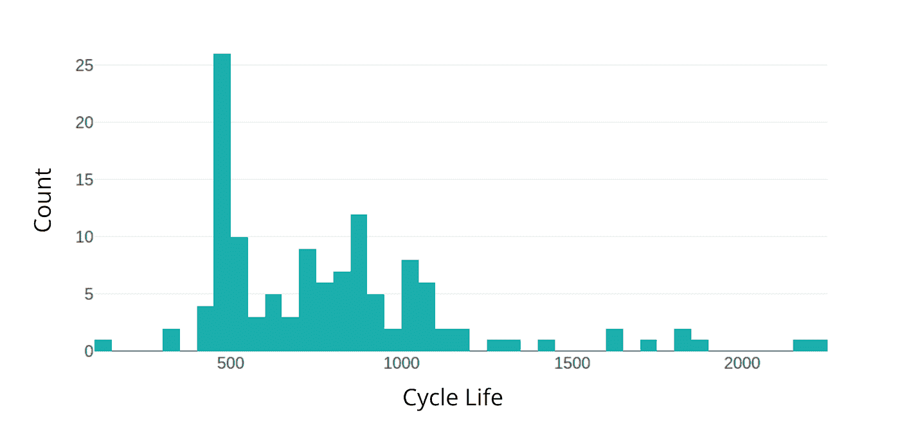
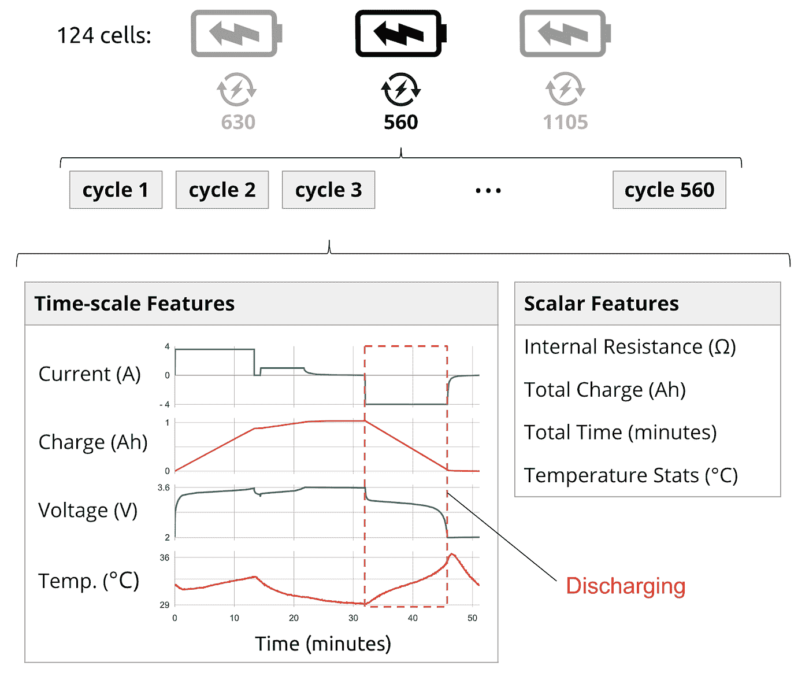
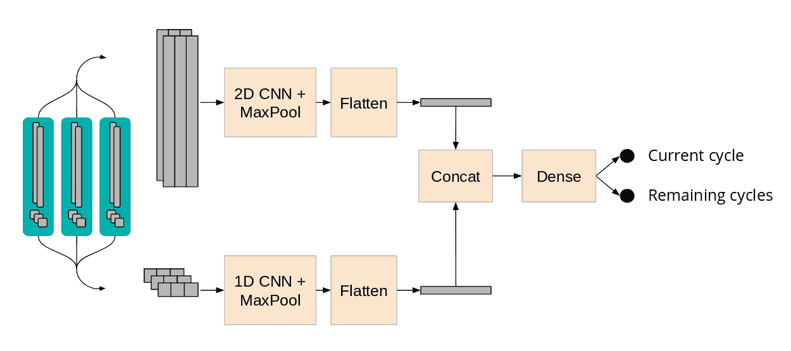
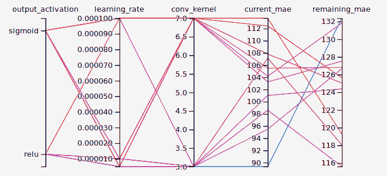
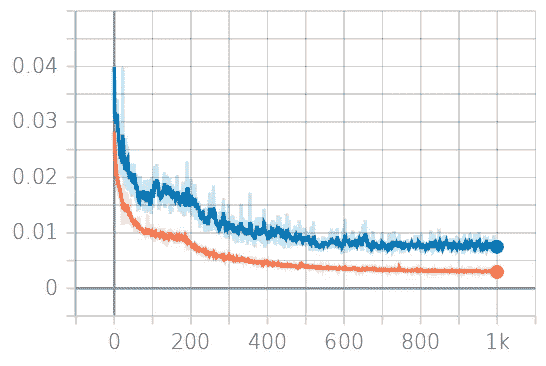
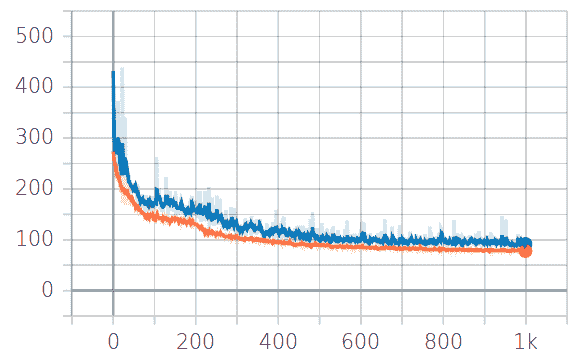
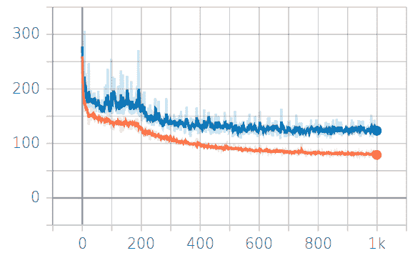
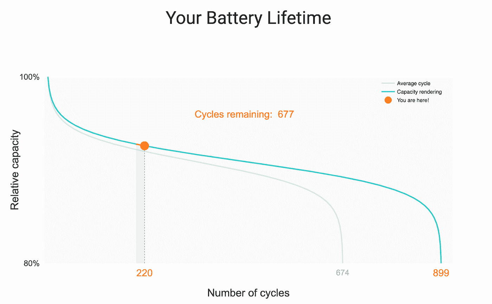

# 用细胞神经网络预测电池寿命

> 原文：<https://towardsdatascience.com/predicting-battery-lifetime-with-cnns-c5e1faeecc8f?source=collection_archive---------1----------------------->

## 使用 TensorFlow 2 分析序列数据


Photo from [Fancycrave](https://fancycrave.com/lithium-ion-batteries-for-sale-in-an-electronics-shop/)

本文由汉尼斯·克诺布洛赫、阿德姆·弗伦克和温迪·张撰写。
你可以在 GitHub 上找到这个项目的源代码:

[](https://github.com/dsr-18/long-live-the-battery) [## DSR-18/电池寿命长

### 用 TensorFlow 2 预测总电池循环寿命。我们将发表一篇描述这个项目的博客文章…

github.com](https://github.com/dsr-18/long-live-the-battery) 

锂离子电池为我们生活中的几乎所有电子设备供电，包括手机和笔记本电脑。它们是可再生能源和电动汽车的核心。多年来，公司一直试图预测电池在耗尽之前可以持续多少次充电。更好的预测将有助于更准确的质量评估和改善长期规划。

但这很难，因为每种电池的老化程度都不一样，这取决于电池的使用和制造过程中的条件。Kristen A. Severson 等人最近发表的一篇名为[容量退化前电池循环寿命的数据驱动预测](https://www.nature.com/articles/s41560-019-0356-8)的论文，声称通过“综合实验数据和人工智能”找到了解决这一问题的关键。尽管他们的结果领先于传统方法，但该团队更关注他们在电气工程领域的知识，而不是机器学习部分。

好消息是:研究人员已经公开了同类最大的数据集！虽然数据集仅限于在实验室环境下对新电池的测量，但它仍然是同类中最全面的。我们使用了更复杂的机器学习方法来建立一个更通用、更准确的模型来预测电池寿命(在这些情况下)。在这里你可以看到它的行动:[www.ion-age.org/example](http://www.ion-age.org/example)。要完全理解这个模型的作用，请继续阅读！

这篇文章从头到尾描述了我们的研究过程。此外，我们还描述了我们的工作流程和工具，为初级数据科学家的项目提供灵感。

# 我们试图预测什么？

该论文的作者专注于全新的电池，并预测了它们的寿命。这令人印象深刻，但如果你想诊断一个已经在使用的电池，你就不走运了。相反，我们希望预测任何电池的剩余循环寿命，不管是旧的还是新的。

另一个警告是预测所需的数据量。研究人员使用第一次和第一百次充电循环的数据进行预测。我们的目标是通过仅 20 个连续充电周期的测量获得准确的结果，使该模型更适用于现实世界。除此之外，了解电池的当前年龄也很有用。

这使我们得出以下问题定义:

> *在有限数量的充电周期内，给定测量值，一个电池单元经历了多少个周期，在它损坏之前将持续多少个周期？*

让我们通过步骤建立一个模型，并预测这一点！

# 了解数据

原始论文的作者组装了 124 个锂离子电池来测量来自的数据。每个电池根据许多预定策略中的一个进行充电和放电，直到电池达到其原始容量的 80%(这意味着电池对于正常使用来说已经变得太不可靠，并且被认为是“坏的”)。达到这种状态之前的循环次数(完全充电，然后完全放电)称为电池循环寿命，这是我们的目标之一。在我们的数据集中，这个数字从 150 到 2300 不等。



Cycle life of the battery cells in the dataset. Most cells lasted around 500 charging cycles before they were considered broken.

每个单元的数据以嵌套结构的形式呈现，有些特征每个周期只测量一次，有些则测量多次。在一个完整的周期中，我们对容量、温度、电压和电流进行了一千多次测量，但对电池内阻或总周期时间等其他指标只有一次标量测量。



The data consists of 124 battery cells, each has gone through a variable number of charging cycles, and for each cycle we have measurements over time and scalar measurements.

由于大部分测量是在实验控制的充电策略(因电池而异)期间进行的，因此我们将数据裁剪到放电周期(所有电池都具有可比性)。这使我们进入下一步…

# 处理数据

原始测量数据可能非常嘈杂。测量之间的距离并不总是相等的，本应单调减少的数据会意外增加，有时硬件会关闭并在随机时间点继续测量。因此，在将数据输入模型之前，我们要特别注意数据是否干净，格式是否正确。

我们去除有时间间隙、小异常值或其他不一致的周期。我们发现平滑噪声的一个特别有用的东西是 [savitzky golay 滤波器](https://docs.scipy.org/doc/scipy-0.16.1/reference/generated/scipy.signal.savgol_filter.html)。这帮助我们恢复了一些在实验中有测量问题的数据样本。

数据中的另一个问题是时间。不同的充电政策意味着一些循环比其他循环完成得更快，充电和温度的时间测量值无法进行比较。相反，我们以与原始论文相似的方式对数据进行了重新采样:

1.  以放电时的电压范围为基准，而不是时间！
    对于该电池型号，3.6V 和 2.0V 始终对应完全充电和放电。这个范围保持不变，即使时间不变。
2.  在电压上插入电荷和温度。
3.  以 1000 个等距电压步长对电荷和温度进行重新采样。

搞定了。现在所有的测量对于每个单元和周期都有相同的长度，但是我们仍然有一些 1000 步的特征，而其他的仅仅是标量。当数组特征和标量特征同时输入到我们的模型中时，我们如何避免形状不匹配？一种解决方案是在不同的入口点将数据输入到模型中，并在以后将所有的数据整合在一起。当我们详细讨论模型时，这一招会变得更加清晰。我们还需要做一件事。

为了能够检测趋势，我们将多个连续的充电周期作为输入。我们称这些周期组为窗口。整个窗口应该总是只有一个目标，但是每个周期都有一个“当前周期”和“剩余周期”值。这就是为什么我们将上一个周期的值定义为整个窗口的目标。

让我们最终进入(更)有趣的部分！

# 建立框架

在我们深入研究数据和创建酷模型之前，我们需要考虑我们的设置。我们想从头到尾使用 TensorFlow 2.0，以从集成的功能中受益，如 [tensorboard](https://www.tensorflow.org/guide/summaries_and_tensorboard) 、[数据集 API](https://www.tensorflow.org/beta/guide/data) 和[超参数调整](https://www.tensorflow.org/tensorboard/r2/hyperparameter_tuning_with_hparams)。

在选择了框架之后，我们决定了应该在什么平台上运行我们的培训工作。我们没有让自己的笔记本电脑过热，而是使用了谷歌云的人工智能平台。人工智能平台允许我们同时运行几个培训任务，轻松标记它们并监控过程。

这需要一些[设置](https://cloud.google.com/ml-engine/docs/tensorflow/getting-started-training-prediction)。这可能要花相当多的时间才能第一次做好，所以我们不会在本文中深入讨论所有的细节。这里有一个总结:

1.  创建一个帐户并在你的机器上安装 google cloud sdk
2.  将您的数据上传到谷歌云桶
3.  编写一个运行作业的中央 python 脚本(加载数据、加载模型、训练模型、保存结果)
4.  确保你的项目和文件夹结构是为 AI 平台正确设置的

现在，我们能够从命令行启动一项培训工作，并可以随时修改几乎所有内容。通过在命令后添加一个标志，我们可以调整诸如时期数、批量大小、重排、检查点保存，甚至可以轻松地在模型架构之间切换。这让我们能够快速迭代，测试不同的理论，并消耗大量(免费)积分。

# 开发模型

我们用 tf 建立了我们的模型。使用[功能 API](https://www.tensorflow.org/beta/guide/keras/functional) 的 Keras。我们在不同的入口点将数组和标量特征输入到模型中，因此在将它们组合在一起之前，我们可以对它们做不同的事情。

我们将每个窗口中的阵列特征沿着它们的短边连接起来，使它们成为具有形状(窗口大小、长度、特征数量)的 3D 矩阵。然后，我们可以使用 MaxPooling 将这个矩阵通过三个 Conv2D 层，从中提取相关信息，同时保持窗口的顺序性质。Conv2D 作用于“特征数量”维度，就好像这些是图像中颜色通道的数量。这是因为阵列特征都共享相同的电压范围，因此高度相关(就像图像中的 RGB 通道一样)。卷积后，我们将数据展平为 1D 数组。



The data entering the model is split into array features and scalar features. Both are processed separately before they’re concatenated and sent through a fully connected dense network to produce two outputs.

我们在窗口方向上以类似的方式连接标量特征，以产生具有形状(窗口大小、特征数量)的数组，然后通过具有一个 MaxPooling 的两个 Conv1D 层，最后将其展平。

我们现在有两个带有特性映射的平面阵列，我们可以很容易地将它们放在一起，并将其输入到一个完全连接的密集网络中，以产生我们的结果。

# 训练和调整模型

在我们建立了模型之后，是时候训练它了。我们编写了一个脚本，在一个简单的命令行界面中调用 GCP API，因此当您在项目的主目录中时，在云中启动培训工作变得非常容易:

```
./train.sh
```

例如，如果我们想要修改训练时期的数量和每个窗口的样本数量，我们的脚本将允许我们使用简单的标志来完成此操作:

```
./train.sh -e 70 -w 10
```

在训练期间，我们跟踪了训练(橙色)和验证(蓝色)集的三个指标:当前周期以及剩余周期的损失和平均绝对误差(MAE)。几分钟后，我们可以在 TensorBoard 中查看结果。让我们看看损失是什么样的:


Loss measured in Mean Squared Error for the first training run over 68 epochs. Orange is the train loss, blue the validation loss.

它正朝着正确的方向发展，但是我们对培训和确认损失之间的差距并不满意。为了缩小这个差距，辍学是一个流行的工具，所以我们把它添加到模型中。我们还需要调整我们的超参数，这就是为什么我们在不同的设置上使用 gridsearch。为了跟踪这些设置，我们使用了 [hparams 模块](https://www.tensorflow.org/tensorboard/r2/hyperparameter_tuning_with_hparams)，它来自 TensorFlow 2.0，可以在 tensorboard.plugins 中找到。现在我们可以比较不同的运行，并选择最佳的参数。

由于“当前”和“剩余周期”的正确预测应该总是大于零，所以我们尝试将 ReLU 作为输出层的激活函数，以在训练过程中减少模型的搜索空间。此外，我们的模型严重依赖 CNN，所以我们也尝试了不同的内核大小。最后，我们测试了两种不同的学习速率，并测量了设置的当前周期和剩余周期的 MAE。



Results of a gridsearch, displayed in TensorBoard. Each colored line represents one parameter setup.

使用我们从超参数调整中获得的最佳模型设置，并通过将训练历元数设置为 1000，我们最终得到了当前周期为 90 MAE、剩余周期为 115 MAE 的模型:



Loss measured in Mean Squared Error for the final training run over 1000 epochs, displayed with a smoothing factor of around 0.6.



Mean Absolute Error, Current Cycle for the final training run over 1000 epochs, displayed with a smoothing factor of around 0.6.



Mean Absolute Error, Remaining Cycles for the final training run over 1000 epochs, displayed with a smoothing factor of around 0.6.

它仍然不完美，但我们对我们心目中的应用程序的结果非常满意(我们终于有一些食物来庆祝了！).

# 做预测

当我们查看我们的最佳设置的训练曲线时，我们可以看到，最低的损失不是在训练结束时，而是在训练的四分之三左右。我们如何使用当时的模型进行预测？我们必须实现[检查点](https://www.tensorflow.org/beta/guide/checkpoints)，允许我们在训练期间的特定时间恢复保存的模型。

一旦我们有了一个模型，我们就可以用 TensorFlow 服务或 Flask 之类的 web 框架来服务它。当时，谷歌云平台不支持 TF2 服务，所以我们决定完全在 Flask 中构建应用程序，并将其托管在 AWS EC2 实例上。

你可以在这里再次看到结果:【www.ion-age.org/example】T2

加载随机样本文件后，您可以预览我们将要预测的数据，您会发现我们的两个线性特征和三个标量特征。点击预测按钮会生成一个图表，显示我们的两个目标:当前和剩余周期。



Screenshot from [www.ion-age.org](http://www.ion-age.org)

就是这样！这就是给定适当的测量数据，可以准确预测任何锂离子电池的年龄和预期寿命的算法所需的全部内容。

如果您有任何建议或问题，或者您发现了一个 bug，请随时留下您的评论。我们很乐意回答问题！

> 我们在柏林为期三个月的数据科学训练营[数据科学务虚会](https://datascienceretreat.com/)期间创建了这个项目。