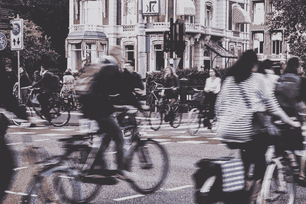
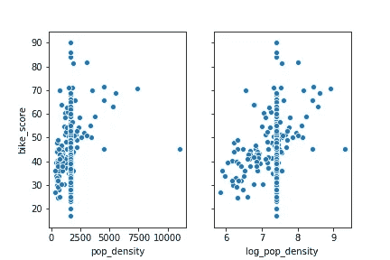
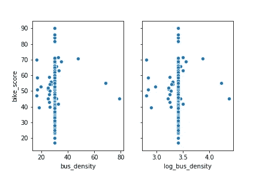
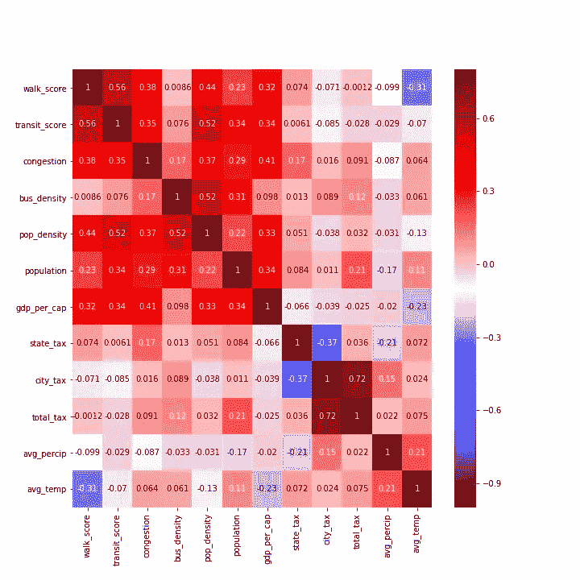
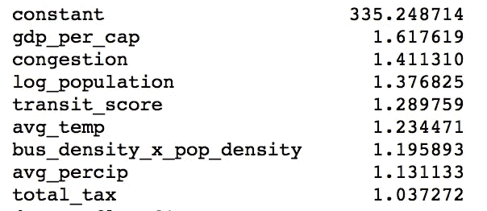

# 预测美国城市的“骑行能力”

> 原文：<https://towardsdatascience.com/predicting-bikeability-in-u-s-cities-67da4ff8376?source=collection_archive---------20----------------------->



根据联合国的统计，超过一半的世界人口居住在城市。随着全球贫困率持续下降，人们变得更加富裕，道路上的私人车辆数量激增。这两种现象意味着更严重的交通拥堵，这反过来又加剧了导致气候变化的温室气体排放。替代的“绿色”交通方式，即步行、踏板车和自行车，可以改善城市流动性并帮助城市实现减排目标，但并非所有城市都同样有利于这些方式。正是在这种背景下，我开发了一个数据科学项目，来预测美国各地城市的“可骑性”，并探索哪些城市特征决定了“可骑性”。

我使用 OLS 回归技术来预测目标值，城市自行车得分，范围从 0(糟糕的骑行条件)到 100(完美的骑行条件)。我的模型的特征包括一个城市的公共交通得分、人口、人口密度、商业密度、天气、人均 GDP 和当地税率。数据来源包括 Walk Score、美国气候数据、INRIX、城市实验室和税收基金会。

**第一部分:数据争论**

该项目开始于大多数数据科学项目:获取和清理数据！在从上述来源收集和清理数据之后，我需要将分散的信息连接起来。令人头疼的一个主要原因是同一个城市不同的命名习惯(例如，华盛顿特区和华盛顿 DC)。我对所有数据集运行了以下函数，以确保具有多种命名约定(或拼写错误)的城市在数据集之间是一致的。

```
def fix_cities(df):
    df.loc[df['city'] == 'Nashville', 'city'] = 'Nashville-Davidson'
    df.loc[df['city'] == 'Louisville', 'city'] = 'Louisville-Jefferson'
    df.loc[df['city'] == 'Lexington', 'city'] = 'Lexington-Fayette'    
    df.loc[df['city'] == 'OklahomaCity', 'city'] = 'Oklahoma City'
    df.loc[df['city'] == 'Salt LakeCity', 'city'] = 'Salt Lake City'
    df.loc[df['city'] == 'SanFrancisco', 'city'] = 'San Francisco'
    df.loc[df['city'] == 'VirginiaBeach', 'city'] = 'Virginia Beach'
    df.loc[df['city'] == 'Washington,D.C.', 'city'] = 'Washington, D.C.'
    df.loc[df['city'] == 'Washington Dc', 'city'] = 'Washington, D.C.'
    df.loc[df['city'] == 'Washington', 'city'] = 'Washington, D.C.'
    df.loc[df['city'] == 'New York', 'city'] = 'New York City'
```

接下来，由于在不同的州有一些同名的城市，我需要在城市和州的组合上连接数据帧。然而，一些数据集包括完整的州名，而其他数据集只包括两个字母的缩写。我创建了一个字典来将州名映射到州缩写。

```
states_abbrev = {'Alaska': 'AK', 'Alabama': 'AL', 'Arkansas': 'AR', 'Arizona': 'AZ','California': 'CA', 'Colorado': 'CO', 'Connecticut': 'CT','District of Columbia': 'DC','Delaware': 'DE','Florida': 'FL','Georgia': 'GA','Hawaii': 'HI','Iowa': 'IA', 'Idaho': 'ID', 'Illinois': 'IL', 'Indiana': 'IN','Kansas': 'KS', 'Kentucky': 'KY', 'Louisiana': 'LA', 'Massachusetts': 'MA','Maryland': 'MD', 'Maine': 'ME', 'Michigan': 'MI', 'Minnesota': 'MN', 'Missouri': 'MO', 'Mississippi': 'MS', 'Montana': 'MT', 'North Carolina': 'NC','North Dakota': 'ND', 'Nebraska': 'NE', 'New Hampshire': 'NH', 'New Jersey': 'NJ','New Mexico': 'NM', 'Nevada': 'NV', 'New York': 'NY', 'Ohio': 'OH',
'Oklahoma': 'OK', 'Oregon': 'OR', 'Pennsylvania': 'PA', 'Puerto Rico': 'PR','Rhode Island': 'RI', 'South Carolina': 'SC', 'South Dakota': 'SD', 'Tennessee': 'TN','Texas': 'TX', 'Utah': 'UT', 'Virginia': 'VA', 'Vermont': 'VT','Washington': 'WA', 'Wisconsin': 'WI', 'West Virginia': 'WV', 'Wyoming': 'WY'}
```

我之前已经“腌制”了每个单独的数据帧，所以我的下一步是读取每个腌制，确保城市名称和州是一致的，并按城市和州合并数据帧。当我准备开始探索性数据分析(EDA)和特性工程时，这给了我一个主数据集以备后用。

```
%pylab inline
%config InlineBackend.figure_formats = ['retina']import pandas as pd
import seaborn as snsdf = pd.read_pickle('city_traffic.pkl')
df['city'] = df['city'].str.lower()
df['state'] = df['state'].str.strip()
df['city'] = df['city'].str.strip()
fix_cities(df)files = ['city_busdensity.pkl','city_percip.pkl','city_poulations.pkl',
         'city_taxes.pkl','city_temp.pkl','city_walkscore.pkl']for file in files:
    df_pkl = pd.read_pickle(file)
    if 'city' in df_pkl.columns:
        df_pkl['city'] = df_pkl['city'].str.strip() 
        df_pkl['city'] = df_pkl['city'].str.lower() 
    if 'state_long' in df_pkl.columns:
        df_pkl['state'] = df_pkl['state_long'].map(states_abbrev) #Get state abreviation for these
    df_pkl['state'] = df_pkl['state'].str.strip()
    fix_cities(df)
    if 'state' in df_pkl.columns:
        df = pd.merge(df, df_pkl, on = ['city','state'], how = 'outer')
        print(file,'success')
    else:
        print(file, 'no state column')df.to_pickle('city_data.pkl')
```

**第二部分:EDA 和特征工程**

我加载回我的腌数据帧，并丢弃除了我的目标值(bike_score)和感兴趣的特性之外的所有内容。

```
df = pd.read_pickle('city_data.pkl')df = df[['bike_score','walk_score','transit_score',
         'congestion', 'bus_density','pop_density', 'population', 
         'gdp_per_cap',  'state_tax', 'city_tax', 'total_tax',
         'avg_percip',  'avg_temp']]
```

接下来，我创建了 pairplots 来查看我的变量的分布，以及我的数据框架内的二元关系。

```
sns.pairplot(df, height=1.2, aspect=1.5);
```

虽然大多数要素看起来呈正态分布，但人口、人口密度(“pop_density”)和商业密度(“bus_density”)是明显的例外，我想知道它们是否会受益于对数变换。

```
log_vars = ['population','pop_density','bus_density']
for v in log_vars:
    df['log_'+v] = log(df[v])
```

我绘制了这三个特征在对数变换前后的直方图。代码和图形如下所示。

```
f, axes = plt.subplots(3, 2)
f.subplots_adjust(hspace = 0.5)
sns.distplot(df.population, ax=axes[0][0], kde=False, bins='auto')
sns.distplot(df.log_population, ax=axes[0][1], kde=False, bins='auto')
sns.distplot(df.pop_density, ax=axes[1][0], kde=False, bins='auto')
sns.distplot(df.log_pop_density, ax=axes[1][1], kde=False, bins='auto')
sns.distplot(df.bus_density, ax=axes[2][0], kde=False, bins='auto')
sns.distplot(df.log_bus_density, ax=axes[2][1], kde=False, bins='auto')for i in range(0,3):
    for j in range(0,2):
        axes[i][j].set_xticks([])
        axes[i][j].set_yticks([])
```


Histograms of select features, before and after log transformation

从直方图中可以看出，在对数变换之后，总体分布看起来更为正态分布。另一方面，人口和商业密度似乎仍未呈正态分布。相反，这些要素似乎具有较大的异常值(例如，纽约市)，导致它们向右倾斜。尽管如此，经过对数变换后，变换后的密度要素和目标值之间的关系似乎更加线性，因此我决定将它们保留下来，看看它们实际上是否显著。



Bike score as a function of urban population density and log urban population density



Bike score as a function of urban business density and log urban business density

接下来，我研究了要素之间的相关性，以解释任何共线性。



Heatmap of feature correlations

```
corrs = {}
cols = list(df.iloc[:,1:].columns)
for x in cols:
    cols = [w for w in cols if w != x]
    for w in cols:
        corrs[(x, w)] = df[x].corr(df[w])
results = [(x, v.round(2)) for x, v in corrs.items() if corrs[x] > 0.5]results = sorted(results, key=lambda x: x[1], reverse=True)
results
```


Correlations for pairs of features

前三个相关性是预期的(变量的对数应该与变量本身高度相关)。Total tax 就是城市和州的税收之和，所以我选择 total_taxes 作为包含在模型中的税收特性。相关性在 0.52 和 0.56 之间的底部四对特征是值得关注的，所以我为它们创建了交互项。

```
interact = [x[0] for x in results[4:]]
interacts = []
for i in range(len(interact)):    
    col1 = interact[i][0]
    col2 = interact[i][1]
    col_interact = col1+'_x_'+col2
    interacts.append(col_interact)
    df[col_interact] = df[col1]*df[col2]
```

接下来，我检查了各种要素组合的方差膨胀因子，以确保最终要素之间的任何共线性都很低。足够幸运的是，我所有的 VIF 都低于“神奇数字”3。

```
from statsmodels.stats.outliers_influence import variance_inflation_factordf['constant'] = 1
X = df[['congestion', 'population', 'gdp_per_cap', 'walk_score_x_transit_score','total_tax', 'avg_percip', 'avg_temp', 'log_population','bus_density_x_pop_density', 'constant']]
vif = pd.Series([variance_inflation_factor(X.values, i) for i in range(X.shape[1])],index=X.columns)
vif.sort_values(ascending = False)
```



Variance inflation factors of model features

在我的数据为分析做好准备之后，我在继续进行 hpyer 参数调整和模型选择之前，对这个版本的数据帧进行了处理。

```
df.to_pickle('regression_data.pkl')
```

**第三部分:超参数调整和模型选择**

最后，我准备创建我的模型，看看哪些特征决定了一个城市的“骑行能力”!

```
from sklearn.model_selection import train_test_split
from sklearn.linear_model import LinearRegression, Lasso, LassoCV, Ridge, RidgeCV
from sklearn.metrics import r2_score 
from sklearn.preprocessing import StandardScaler, PolynomialFeatures
from sklearn.pipeline import Pipeline
from sklearn.metrics import mean_absolute_error as mae
from sklearn.model_selection import cross_val_score, cross_val_predict
from sklearn.model_selection import GridSearchCVdf = pd.read_pickle('regression_data.pkl')
```

首先，我将“y”定义为我的目标变量(bike_score)，将“X”定义为城市特征矩阵。

```
y = df['bike_score']
X = df[['constant','congestion', 'transit_score', 'gdp_per_cap','total_tax', 'avg_percip', 'avg_temp', 'log_population','bus_density_x_pop_density']]
```

接下来，我将数据分成训练集和测试集。我用 80%的数据训练我的模型，保留 20%用于测试。

```
X_train, X_test, y_train, y_test = train_test_split(X, y, test_size=0.2,random_state = 88)
```

**a .线性回归**

我首先在 5 组交叉验证数据上拟合了一个“普通”线性回归模型(这意味着我的五分之一的数据总是被保留下来评分)。我得到了所有验证折叠的平均绝对误差(MAE)接近 8。

```
lr=LinearRegression()scores = cross_val_score(lr, X_train, y_train, cv = 5, scoring='neg_mean_absolute_error')
print (np.mean(scores)*(-1))
```


**b .岭正规化**

知道我的要素之间存在大量的多重共线性后，我接下来拟合了一个岭回归，它在我的(标准化)要素上添加了多重共线性的惩罚。

```
std_scale = StandardScaler()
X_train_scaled = std_scale.fit_transform(X_train)
X_test_scaled = std_scale.transform(X_test)ridge = Ridge(random_state=88)
```

我使用 scikit learn 的 GridSearchCV 来寻找使五个交叉验证折叠的平均绝对误差最小化的 alpha 参数。

```
grid_r1 = {'alpha': np.array([100,75,50,25,10,1,0.1,0.01,0.001,0.0001,0])}
ridge_grid = GridSearchCV(ridge, grid_r1, cv=5, scoring='neg_mean_absolute_error')
ridge_grid.fit(X_train_scaled, y_train)print("tuned hpyerparameters :(best parameters)", ridge_grid.best_params_)
print("MAE score :",-1*(ridge_grid.best_score_))
```


最好的 alpha 是 100，这给出了训练集的五个折叠的平均 MAE 为 7.5——比“香草”线性回归略有改善。

**c .拉索正规化**

套索正则化会对多重共线性造成不利影响，并且仅保留系数非零的重要要素。考虑到这一点，我决定将“厨房水槽”特性加入到这个模型中。同样，我的第一步是使用 GridsearchCV 来确定最佳 alpha 参数。alpha 值为 1.0 时，MAE 值为 6.6，与岭模型相比，这已经是一个显著的改进。

```
y = df['bike_score']
XL = df.drop(['bike_score','constant'], axis=1)X_train, X_test, y_train, y_test = train_test_split(XL, y, test_size=0.2, random_state = 88)std_scale = StandardScaler()
X_train_scaled = std_scale.fit_transform(X_train)
X_test_scaled = std_scale.transform(X_test)grid_l1 = {'alpha':  np.array([100,75,50,25,10,1,0.1,0.01,0.001,0.0001,0])}
lasso = Lasso(random_state=88)
lasso_grid = GridSearchCV(lasso, grid_l1, cv=5, scoring='neg_mean_absolute_error')
lasso_grid.fit(X_train_scaled, y_train)print("tuned hpyerparameters :(best parameters) ",lasso_grid.best_params_)
print("MAE score :",-1*(lasso_grid.best_score_))
```


正如我上面提到的，lasso 正则化倾向于将几个特征系数取零，只保留一组精选的重要特征。事实上，只有步行得分、步行得分/交通得分相互作用、拥堵和平均降水量返回非零系数。我决定在最终模型中保留除 walk score 之外的所有内容(以考虑 walk_score 和 walk_score*transit_score 之间的多重共线性)。

```
coefficients = sorted(list(zip(X_test.columns, lm.coef_.round(2))), key=lambda x: x[1], reverse=True)
coefficients
```


Feature coefficients with lasso regularization

下面是我的最终模型的代码，它对训练数据中的三个重要特征(步行分数/交通分数交互、拥堵和平均降水量)进行了 alpha 1.0 的 Lasso 回归拟合。最后，我使用该模型来预测测试集中的自行车分数(还记得我放在一边的 20%的数据吗？).测试数据的平均误差(模型预测值和实际目标值之间的平均绝对误差)为 6.3，这意味着我的模型能够预测城市自行车得分，平均与实际得分相差 6.3 分。

```
y = df['bike_score']
XL2 = df[['walk_score_x_transit_score','congestion','avg_percip']]X_train, X_test, y_train, y_test = train_test_split(XL2, y, test_size=0.2, random_state = 88)std_scale = StandardScaler()
X_train_scaled = std_scale.fit_transform(X_train)
X_test_scaled = std_scale.transform(X_test)lasso = Lasso(random_state=88, alpha=1.0, fit_intercept=True)lm2 = lasso.fit(X_train_scaled, y_train)
y_pred = lm2.predict(X_test_scaled)
mae(y_pred, y_test)
```


**结果**

根据模型系数，更“适合骑自行车”的城市是那些有替代交通方式(公共交通和步行)先例、更拥堵(更有动力寻找替代私家车的方式)和更少降水(雨/雪)的城市。根据 lasso 模型，当地税率、商业密度和人口密度等特征对一个城市的“骑行能力”没有影响。

```
coefficients = sorted(list(zip(X_test.columns, lm2.coef_.round(2))), key=lambda x: x[1], reverse=True)
coefficients
```


Feature coefficients, final regression model with lasso regularization

我的模型的低 R 平方和调整后的 R 平方表明，我选择的特征不能解释一个城市骑行能力的大部分差异。下一步将收集可能解释骑行性的其他要素，例如与自行车相关的基础设施的质量和整体山地。

```
def r2_adj(X,Y,r_squared):
    adjusted_r_squared = 1 - (1-r_squared)*(len(y)-1)/(len(y)- X.shape[1]-1)
    return(adjusted_r_squared)r2 = lm2.score(X_test_scaled, y_test)
r2a = r2_adj(X_test_scaled, y_test, r2)
print('R-squared', r2.round(2), 'Adjusted r-squared', r2a.round(2))
```


一旦我能够完善模型，并通过额外的功能选择和功能工程进一步减少 MAE，未来的工作将是纳入 walkscore.com 目前不提供自行车分数的国际城市。随着全球城市化进程的加快和气候变化的威胁日益逼近，城市必须找到减少私家车拥堵和排放的方法。自行车和踏板车共享计划有助于这一努力，我希望这个项目将阐明那些决定实施这些计划的可行先决条件的因素。

*我一直在努力改进我的工作，所以欢迎提出建议！请随时在评论中提供反馈。*