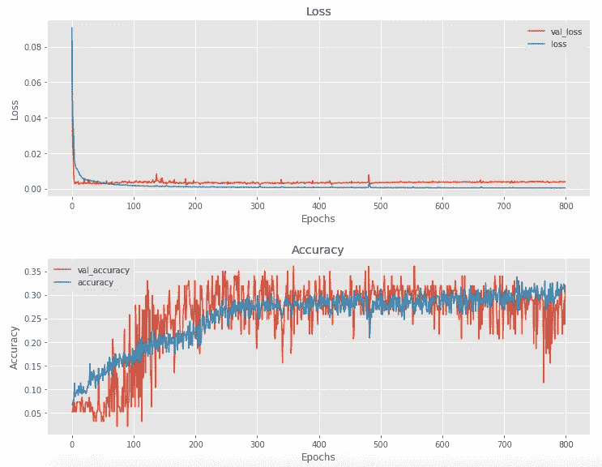
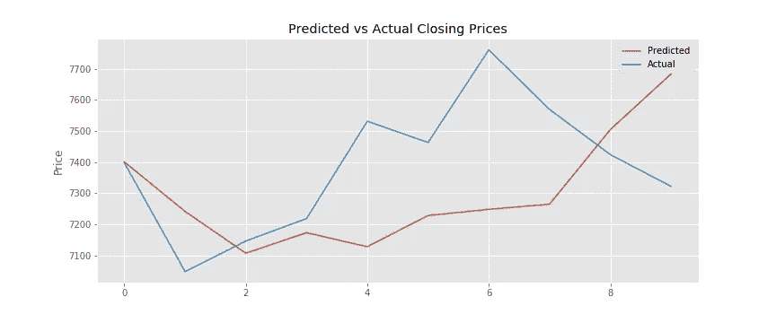
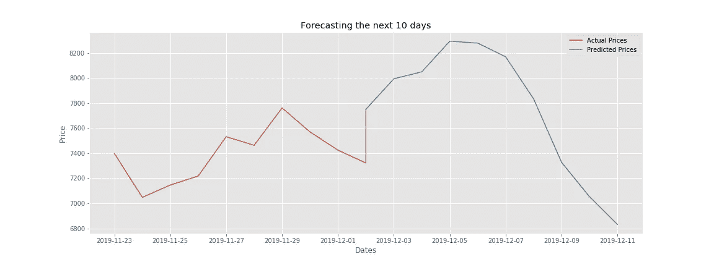

# 我尝试了深度学习模型来预测比特币价格

> 原文：<https://towardsdatascience.com/predicting-bitcoin-prices-with-deep-learning-438bc3cf9a6f?source=collection_archive---------2----------------------->

## 利用神经网络预测加密货币价格

Photo by [André François McKenzie](https://unsplash.com/@silverhousehd?utm_source=medium&utm_medium=referral) on [Unsplash](https://unsplash.com?utm_source=medium&utm_medium=referral)

*点击下方查看之前的文章使用机器学习研究比特币价格:*

 [## 我试图用机器学习来预测比特币的价格

### 利用时间序列模型预测加密货币价格

towardsdatascience.com](/predicting-prices-of-bitcoin-with-machine-learning-3e83bb4dd35f) 

不久前，我们深入研究了机器学习模型的使用，以预测比特币的未来价格。在那里，我们使用了两个时间序列模型来预测比特币价格在未来几天或几周内的走向。就训练和使模型适应比特币的历史价格数据而言，这相当简单。但是，如果除了机器学习之外还有其他方法来预测时间序列数据呢？

这个问题的答案是…

> *深度学习*

**深度学习**是机器学习的一个子集，但两者之间的关键区别在于，深度学习使用神经网络，赋予机器自我训练的能力。机器学习需要用户或工程师设置参数的算法来训练机器。换句话说，机器学习比深度学习需要更多的动手调整和修复。深度学习能够进行所有的调整和自我修复，而不需要用户/工程师的任何手动干预。他们需要调整或创建的主要东西是神经网络本身，它有自己的一套障碍。

# **但是深度学习比机器学习好吗？**

这完全取决于问题。在某些情况下，传统的机器学习模型要比复杂的神经网络好得多。我们发现的一个这样的例子是用于分类的表格数据的训练和拟合。在这种情况下，与传统分类算法的结果相比，神经网络的训练时间明显更长，但表现水平较低或相当。但是时间序列数据呢？

这正是我们今天要做的！我们将根据比特币的历史价格数据，创建并运行我们自己的、相对简单的神经网络。然后，我们将能够看到神经网络是否优于传统的 SARIMAX，甚至是我们之前实现的脸书先知时间序列模型。

当我们演练创建神经网络的过程时，我们将解释必要的概念以更好地理解代码。期望在最后看到一个 Github 链接，展示神经网络的全部源代码。

> [在这里注册一个中级会员，可以无限制地访问和支持像我这样的内容！在你的支持下，我赚了一小部分会费。谢谢！](https://marco-santos.medium.com/membership)

# 我们开始吧

首先，我们需要安装必要的库，以便创建我们的神经网络(您可能需要 [**安装 Tensorflow Keras**](https://keras.io/#installation) )。接下来我们加载包含比特币历史价格数据的 CSV 文件，可以从 [**雅虎财经**](https://finance.yahoo.com/quote/BTC-USD/history?p=BTC-USD) 下载。价格数据的另一个选项是使用金融数据 API，如 [**EOD 历史数据**](https://eodhistoricaldata.com/r/?ref=31CX3ILN) 。注册是免费的，你可以获得大量的金融数据。*披露:我通过上面的链接从任何购买中赚取一小笔佣金。*

然后，我们将做一些数据预处理，以便我们观察到的价格是“*收盘*价格，并且指数采用*日期时间*格式。最后，为了提高性能，我们将使用 *scikit-learn 的* `MinMaxScaler()`来缩放数据。

*Note: we are only selecting the last 1,000 days of Bitcoin prices because those days are the most representative of the current Cryptocurrency market.*

## 助手功能

对于下一部分，我们将需要创建一些辅助函数，这将使我们能够适当和有效地运行神经网络。

`visualize_training_results()`—绘制我们的神经网络的精确度和损失。这允许我们检查我们的神经网络的训练进度/结果。

`split_sequence()` —创建两个数组: **X** 和 **y** 。这些变量分别是我们的神经网络的*输入*和*输出*变量。*输入*是回顾的周期数，而*输出*是未来的周期数。简单地说，输入周期用于计算出导致输出周期的模式和序列。它们都可以是任何数量，但是如果输入周期的数量大于输出周期的数量可能是有益的。

`layer_maker()` —为我们的神经网络创建指定数量的隐藏层(如有必要，还可删除层)。这项功能构成了我们网络的主体。这个功能的重要性将在后面解释。

## 准备/分割数据

我们的下一步是在我们的比特币价格数据上实现我们的`split_sequence()`功能。

内*和*外*的周期数可以是我们选择的任意数。但是为了这个例子，我们将选择回顾价格历史的 **30 天**来预测下一个 **10 天**。但是，这并不意味着我们只回顾最近的 30 天来计算接下来的 10 天，总共只有 40 天。这意味着对于我们选择的 1，000 天中的每一天，前 30 天用于确定任何导致下 10 天的模式或序列。这些值用于训练神经网络，以便我们可以预测或预测从今天起未来 10 天的比特币价格。*

# 神经网络

既然我们已经准备好了数据，我们可以进入有趣的部分——构建神经网络。我们的神经网络将使用来自 **Keras** 库的简单 [**序列**](https://keras.io/models/sequential/) 模型来创建。从那里，我们将通过在我们的模型中实现 **LSTM** (长期短期记忆)层来使用一个称为**递归神经网络**的特定神经网络。

## 递归神经网络— LSTM

递归神经网络( **RNN** )是一种神经网络，长短期记忆( **LSTM** )网络是一种 RNN。我们使用 RNN，而不是普通的神经网络，如多层感知器( **MLP** )网络，因为 rnn 最适合用于序列数据，如我们的比特币历史价格数据。如果你想了解更多关于 RNNs 和 LSTMs 的信息，点击 [**这里**](https://skymind.ai/wiki/lstm) 。

# 创造我们的循环神经网络

万事俱备，我们可以开始为比特币价格数据构建神经网络了:

首先，我们实例化了**顺序**模型和一个*激活函数*，该函数贯穿神经网络中的各层。经过大量实验，最佳激活函数被证明是“ *softsign* 或“ *tanh”。*“这可能是因为这两个函数的范围都是从-1 到 1，并且比范围从 0 到 1 的激活函数更好地处理来自输入的负值和正值。

## 输入层

我们网络中的第一层将是*输入层*，只需调用`model.add()`就可以添加到网络中。在`.add()`方法中，我们有:

*   LSTM 层创造了我们的 RNN。
*   作为第一个参数的**节点数**(这里设置为 *25* )。
*   `activation`是我们之前设置为变量的激活函数。
*   `return_sequence`被设置为**真**，因此 LSTM 层之间的每个序列包含适当的尺寸。
*   `input_shape`被设定为输入和特性的数量。这样做是为了让网络知道预期的形状。

## 隐藏层

对于下一个项目，我们可以开始在神经网络中创建我们的隐藏层。为了避免多次输入`model.add()`，我们将使用我们的`layer_maker()`功能。这就创建了一个简单的“ *for* ”循环，它具有一个指定的范围，可以根据我们的需要生成任意多的层。它还可以选择添加*漏失层*，这对正则化很重要。如果你不熟悉**正则化**这个术语，只知道它是我们神经网络中防止过拟合的一种方法。**过度拟合**，简单来说，发生在一个模型在预测新的观察值时表现不佳，在我们的情况下，预测未来的比特币价格。

接下来，我们用一个没有设置为真的`return_sequence`的最终隐藏层来完成隐藏层。这样做是为了使最终隐藏层的尺寸可以顺利地传递到输出层，而不会出现错误。

## **输出图层和模型汇总**

上面代码片段中的下两项包含最后一层和我们刚刚创建的神经网络的摘要。最后一层或输出层不是 LSTM 层，而是一个正常的、密集连接的神经网络层，如果我们使用标准的非递归神经网络，就会经常使用它。该层包含我们希望预测的周期/天数作为其节点数。模型摘要显示有关创建的神经网络的基本信息。

## 编译模型

在我们继续训练我们的神经网络之前，我们必须用首选的规范来编译它:

*   `optimizer`是我们训练神经网络所需的优化算法([点击此处](https://ruder.io/optimizing-gradient-descent/index.html#gradientdescentoptimizationalgorithms)查看不同优化算法的完整概述)。
*   `loss`是我们在模型中衡量误差的方式。通常，我们希望损耗尽可能接近零(参见[此处](https://keras.io/losses/)了解不同损耗函数的更多信息)。
*   `metrics`是我们衡量模型/神经网络性能的方式([单击此处](https://keras.io/metrics/)了解有关不同指标的更多信息)。

## 尝试不同的参数

当创建神经网络模型时，为了找到最佳的参数组合，大量的实验是必要的。当谈到模型最终将如何执行时，节点和层的数量尤其重要。没有神奇的数字，两者都需要自己的理想数字，必须通过反复试验才能发现。

几乎你为任何新数据集创建的每一个神经网络都必须由它们自己唯一的一组参数组成。由于这个实验过程，我们的结果可能会因所用数据集的不同而大相径庭。

# 拟合/训练神经网络

一切准备就绪，万事俱备，我们终于可以开始拟合/训练我们的神经网络了！我们可以通过编写一行代码来实现这一点:

> `res = model.fit(X, y, epochs=800, batch_size=32, validation_split=0.1)`

一旦我们运行这个代码，我们的神经网络将开始对我们的比特币价格数据进行训练。根据我们拥有的资源，培训时间可能需要几个小时。那些硬件规格更好的公司可能会比我们获得更好的结果。同时，当 NN 在训练时，我们可以解释`model.fit()`方法中的参数:

*   `X, y`是我们分配的包含比特币历史价格数据的变量。
*   `epochs`是 NN 在整个数据集上训练的次数，包含批次数。
*   `batch_size`是模型在更新其自身参数之前将从中工作的训练集中的样本数。
*   `validation_split`是在一个时期结束时，为评估数据的损失和指标而搁置的数据集的百分比。

# 可视化我们模型的性能

一旦我们完成了模型的训练，我们就可以通过使用`visualize_training_results()`函数来可视化我们的训练结果。运行以下代码行将显示我们的模型在多个时期的性能。

> `visualize_training_results(res)`

这将为我们提供以下可视化效果…

这些可视化显示了**训练**和**验证**设置的**损失**和**准确度**。为了查看我们的 NN 是否训练良好，我们将希望看到验证和训练集的损失和准确性*随着历元数的增加而收敛*。否则，如果我们两组的损失和精确度彼此*偏离*，那么我们的神经网络可能有过度拟合的迹象。这可以通过引入一些*脱落层*，减少*历元数*，改变*层数*等方法解决。我们的神经网络训练中的这一步可能需要额外的试验和调整，以便观察训练和验证集的收敛性。

# 验证我们的神经网络

一旦训练完成，我们对损失和准确性的融合感到满意。我们需要根据实际数据测试我们的模型，看看它的表现如何。我们可以通过简单地可视化神经网络预测的比特币价格，并用比特币的实际价值来绘制它们。

Here we observe the Actual Bitcoin prices from the last 10 days and our NN’s predicted values starting from 10 days ago.

说到准确预测价格，我们的模型有好几次都不尽如人意。虽然，趋势和潜在价格目标可能提供一些价值。例如:

> 在第 0 天，您从模型的预测中观察到价格将在第 10 天达到 7，700 美元。但是，实际上，价格比第六天的价格略高。

*从这个例子中，该信息可以向比特币交易者提供潜在的投资时机和机会。*

# 使用我们的 RNN 进行预测

当我们最终对验证我们预测的比特币价值感到满意时，我们就可以进入神经网络中最有用的部分——预测比特币的未来价格！为了预测未来 10 天的比特币价格，我们所要做的就是在我们的`model.predict()`方法中输入过去 30 天的价格。

使用下面的代码，我们可以打印出未来 10 天的价格，并为这些预测绘制图表，以获得更好的可解释性。

太棒了。我们现在有了未来 10 天的比特币价格。然而，这些数字是可靠的吗？*绝对不行！就像我们以前的时间序列模型一样，这个神经网络也可以给我们未来价格的大致趋势。如果他们错了，那也是意料之中的事，因为没有人和机器能够正确预测未来。我们只能希望看到它可能去哪里，使用神经网络可能比盲目猜测更好。*

# 结束语

这个新创建的基于比特币历史价格数据的神经网络能够成功地为我们提供未来 10 天的预测。你如何处理这些信息完全取决于你 *但是你应该知道这仍然是一个相对简单的神经网络*。可以做更多的工作来提高我们的神经网络的性能，但是为了时间和简单起见，我们决定只讨论创建 r NN 的基础知识。

现在，根据你花了多少时间来训练和调整神经网络，你的结果可能会有所不同。请随意试验代码并测试不同的方法来改进神经网络。一些想法可能是将[技术指标](https://www.investopedia.com/terms/t/technicalindicator.asp)作为另一组输入变量，或者尝试不同类型的 RNN。深度学习有太多的可能性和途径可以探索，每天都有新的前景出现。所以，请留意新的发现，希望你喜欢并学到了一两件关于建立神经网络的事情！

# 资源:

 [## 马克桑 93/BTC-预报员

### 此时您不能执行该操作。您已使用另一个标签页或窗口登录。您已在另一个选项卡中注销，或者…

github.com](https://github.com/marcosan93/BTC-Forecaster)  [## 我试图用机器学习来预测比特币的价格

### 利用时间序列模型预测加密货币价格

towardsdatascience.com](/predicting-prices-of-bitcoin-with-machine-learning-3e83bb4dd35f)  [## 如何开发用于时间序列预测的 LSTM 模型

### 长短期记忆网络，简称 LSTMs，可用于时间序列预测。有很多种…

machinelearningmastery.com](https://machinelearningmastery.com/how-to-develop-lstm-models-for-time-series-forecasting/)