# 用 Python 中的逻辑回归预测癌症

> 原文：<https://towardsdatascience.com/predicting-cancer-with-logistic-regression-in-python-7b203ace16bc?source=collection_archive---------18----------------------->

## 理解数据，逻辑回归，测试数据，混淆矩阵，ROC 曲线


[Source](https://unsplash.com/photos/rmWtVQN5RzU)

# 简介:

在我的第一个[逻辑回归分析中，](/univariate-logistic-regression-example-in-python-acbefde8cc14)我们仅仅触及了表面。讨论的只是高级概念和双变量模型示例。在这一分析中，我们将着眼于更具挑战性的数据，并学习更先进的技术和解释。

# 目录:

1.数据背景

2.数据探索/清理

3.数据可视化

4.构建模型

5.测试模型

# 数据背景:

测量体内某些蛋白质的水平已经被证明可以预测癌症的发展[。医生可以进行测试来检查这些蛋白质的水平。我们有 255 名患者的样本，希望获得关于 4 种蛋白质及其与癌症生长的潜在关系的信息。](https://www.webmd.com/cancer/cea-tests#1)

**我们知道:**

*   每位患者测得的每种蛋白质的浓度。
*   每个患者是否已经被诊断患有癌症(0 =没有癌症；1=癌症)。

> **我们的目标是:**
> 
> 通过从我们样本中的蛋白质水平和癌症之间的关系中提取信息来预测未来的患者是否患有癌症。

**我们将关注的 4 种蛋白质:**

甲胎蛋白

癌胚抗原

癌抗原 125

癌抗原 50

我从 UAB 的 MBA 项目 [@](https://medium.com/u/4e564d7496d6?source=post_page-----7b203ace16bc--------------------------------) 那里得到了这套用于教育目的的数据。

# 数据探索/清理

让我们通过引入数据和导入必要的模块来开始分析。

```
%matplotlib inline
import numpy as np
import pandas as pd
import matplotlib.pyplot as plt
from sklearn.model_selection import train_test_split
import seaborn as sns
df = pd.read_excel(r"C:\Users\Andrew\Desktop\cea.xlsx")
df.head()
```

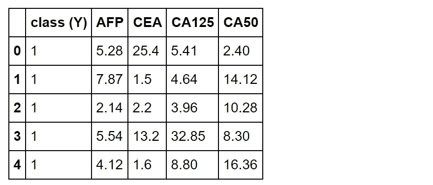

Figure 1

df.head()为我们提供了数据集的前 5 个特征。每行是一名患者，每列包含一个描述性属性。类别(Y)描述了患者是没有癌症(0)还是患有癌症(1)。接下来的 4 列是在病人血液中发现的蛋白质水平。

```
df.describe()
```


Figure 2

我们可以从*描述*方法中检索关于样本的一些基本信息。该数据集中有 255 行，具有不同的标准差和均值。值得一提的是，与平均值相比，这 4 种蛋白质都具有较低的 50%值。这意味着大多数蛋白质水平很低。这 4 种蛋白质还具有高范围，这意味着存在高值异常值。比如我们看 AFP，均值 4.58，中位数 3.86，最高值 82.26。

```
df.isnull().sum()
```

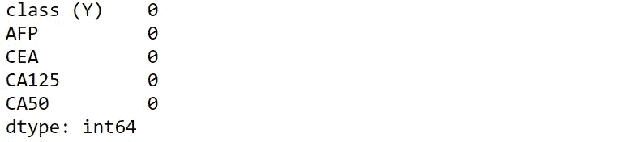

检查数据中是否有空值总是好的。这可以通过多种方式解决。幸运的是，这次我们不用担心空值。

# 数据可视化

让我们想象一下我们的每个变量，并根据我们所看到的假设可能会发生什么:

## 目标变量(Y)

```
yhist = plt.hist('class (Y)', data = df, color='g')
plt.xlabel('Diagnosis (1) vs no diagnosis (0)')
plt.ylabel('Quantity')
plt.title('Class (Y) Distribution')
```


Figure 3

这个样本中有更多的无癌患者。如图 2 所示，“类别(Y)”变量的平均值为 0.44。

# 菲律宾武装部队；法新社；甲胎蛋白；金融理财师证书

```
**#setting the axes**
axes = plt.axes()
axes.set_xlim([0,(df['AFP'].max())])**#making histogram with 20 bins**
plt.hist('AFP', data = df, bins = 20)
plt.xlabel('AFP Level')
plt.ylabel('Quantity')
plt.title('AFP Distribution')
```

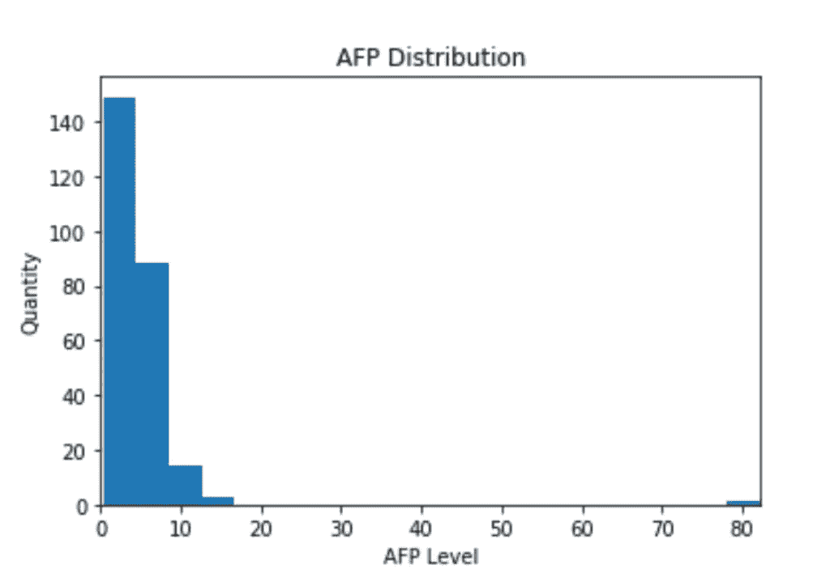

Figure 4

如前所述，甲胎蛋白水平低的患者相对较多。

```
**#color palette**
pal = sns.color_palette("Set1")**#setting variable for max level of protein in dataset**
lim = df['AFP'].max()**#setting bin size to be 20**
bins = np.linspace(0,lim,(lim/(lim*(1/20))))**#creating new column in df with bin categories per feature**
df['AFP_binned'] = pd.cut(df['AFP'], bins)**#creating a crosstab stacked bar chart variable**
chart = pd.crosstab(df['AFP_binned'],df['class (Y)'])**#normalizing chart and plotting chart**
chart.div(chart.sum(1).astype(float), axis=0).plot(kind='bar', color = pal,stacked=True)
plt.xlabel('Bins')
plt.ylabel('Quantity')
plt.title('Normalized Stacked Bar Chart: AFP vs Class(Y)')
```

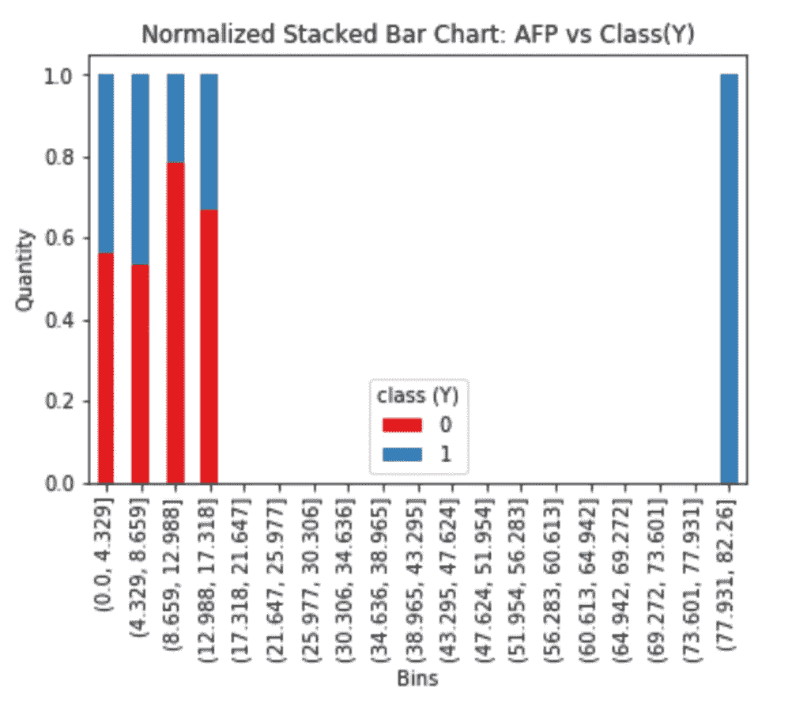

Figure 5

作为分布直方图的补充，上面的堆积条形图显示了随着 AFP 水平的增加，1 与 0 的比例。该图表与分布直方图一样，也分为 20 个区间。结合我们从上述目标变量的分布和比例中获得的知识，我们可以直观地确定从该蛋白质中可能没有获得太多的预测知识。

> 让我们一步一步来。大多数患者的 AFP 值低于 10，如图 4 中的前 2 条所示。因为大多数患者都在前两个柱中，所以图 5 中它们之间 Y 的变化比其他柱中 Y 的变化更重要。

从柱 1 到柱 2，癌症患者的比例略有增加。癌症患者的比例从第 2 栏下降到第 3 栏。bar 3 之后，剩下来分析的患者少之又少，对趋势影响不大。从这里我们可以看到，目标变量看起来基本上与 AFP 的变化无关。最显著的变化(条 1 到 2)非常轻微，之后的变化不在同一方向。

让我们看看其他蛋白质是什么样子的。

# 成本效益分析(Cost Effectiveness Analysis)

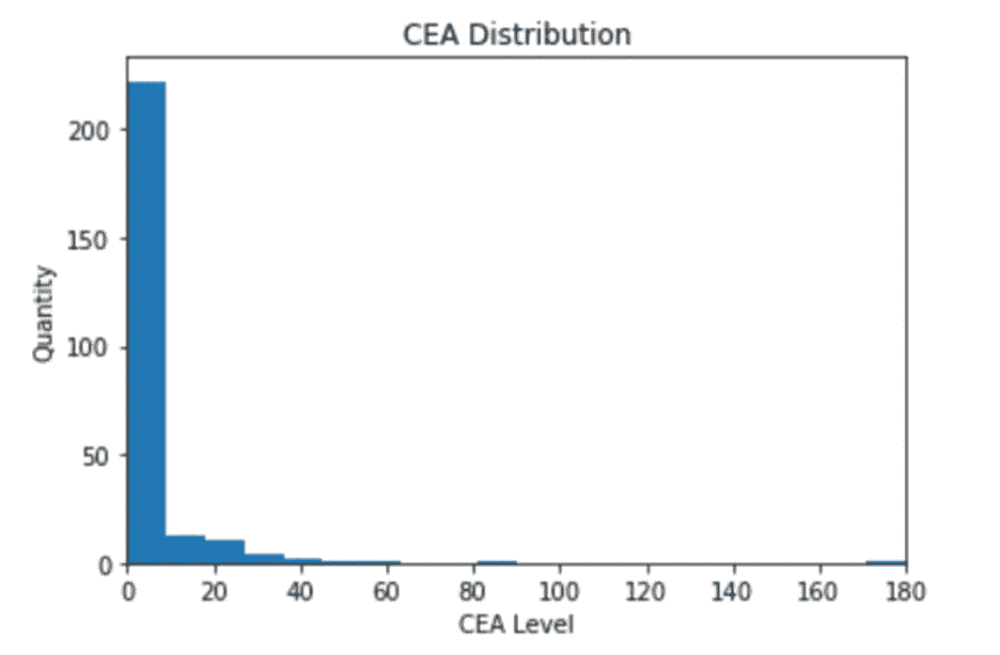

Figure 6

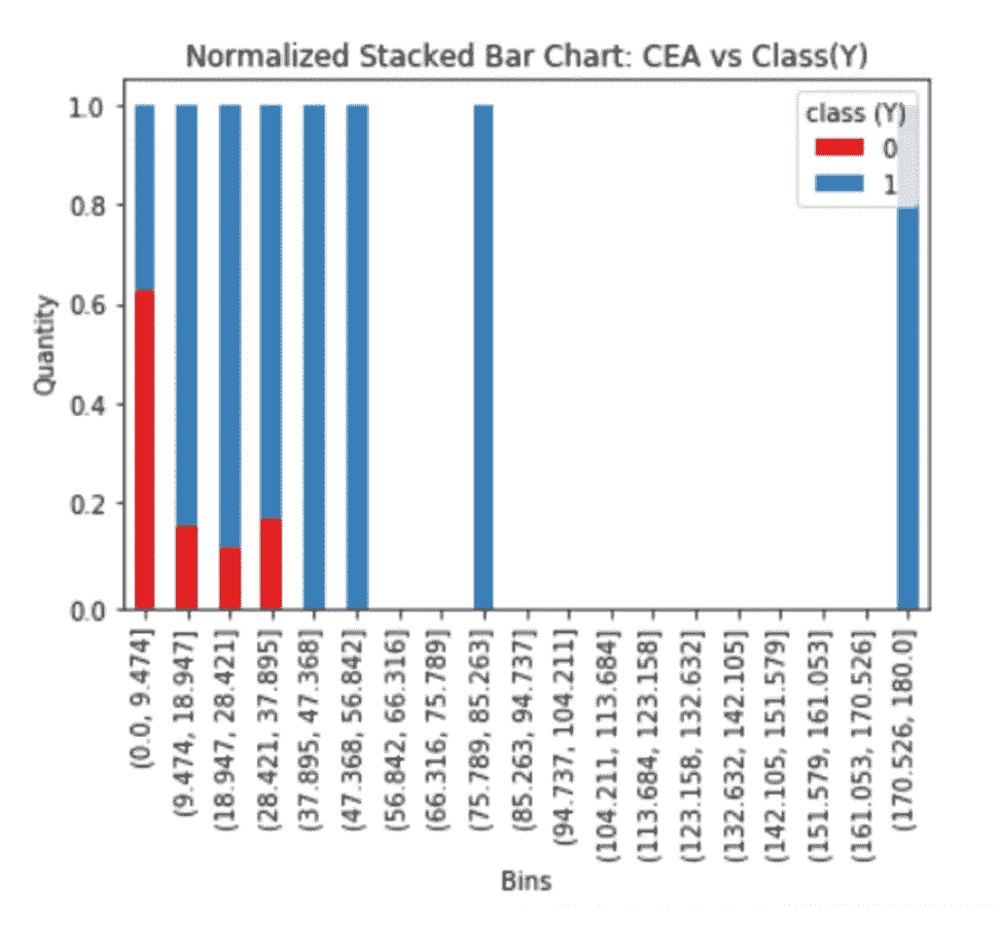

Figure 7

东航似乎有一个不同的故事。图 6 显示了与 AFP 相似的分布形状；然而，图 7 显示了癌症发病率的不同变化。就像 AFP(由于分布形状)一样，柱之间最显著的癌症变化在柱 1 和柱 2 之间。

从柱 1 到柱 2 的变化从大约 63%的非癌性变为 18%的非癌性(或者换句话说，37%的癌性变为 82%的癌性)。此外，从 bin 2 到 bin 3 的变化是相同的方向，更多的癌症。从具有 100%癌症的 bin 5 开始的异常值加强了较高 CEA 可能指示癌症的趋势。

# CA125

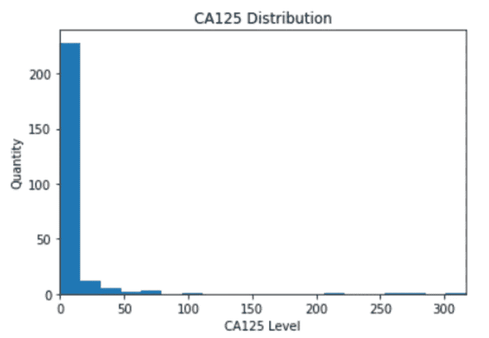

Figure 8

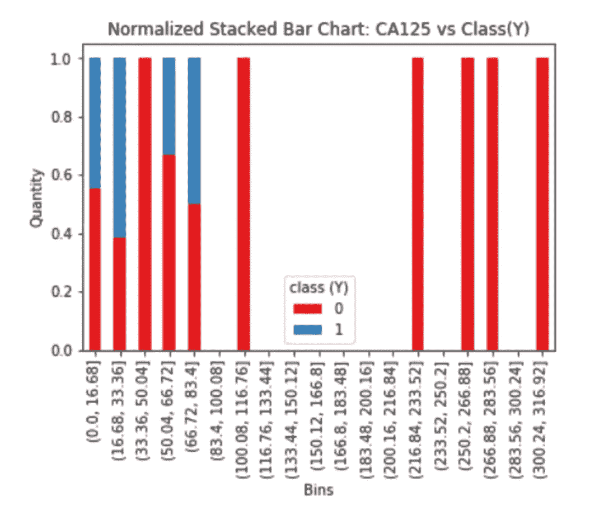

Figure 9

CA125 有点棘手。柱 1-2 表明，像癌胚抗原一样，这种蛋白的高水平可能导致癌症。然而，这一次似乎有两种趋势。随着几乎所有的后一类人群变成非癌症人群，这一趋势发生逆转。我们稍后将更详细地研究这个变量。

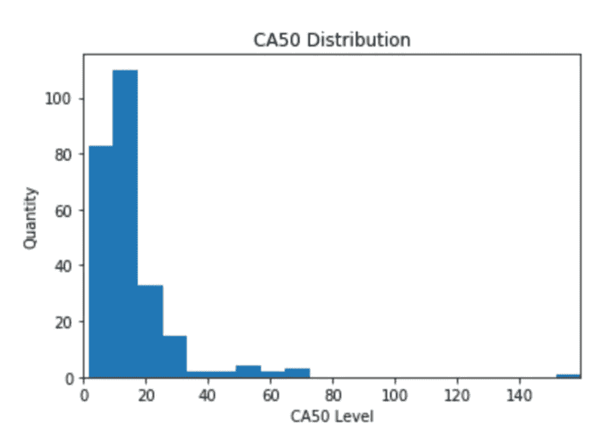

Figure 10

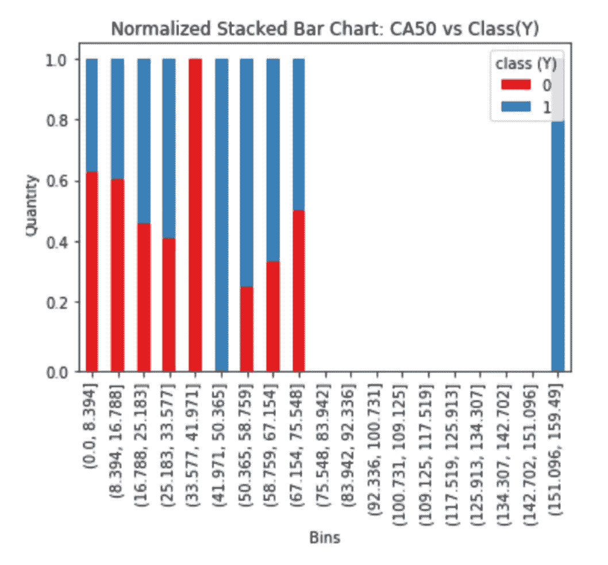

Figure 11

CA50 看起来没什么前途。前 4 个条柱似乎表明了较高癌症发病率的趋势。然而，趋势看起来在第 7-9 条中发生了逆转。CA50 水平和癌症之间的关系可能很小或可以忽略。

# 构建模型

让我们把这个模型放在一起，看看回归能告诉我们什么。

```
**#importing module**
import statsmodels.api as sm**#setting up X and y**
cols= [‘AFP’,’CEA’,’CA125',’CA50']
X= df[cols]
y = df[‘class (Y)’]**#filling in the statsmodels Logit method**
logit_model = sm.Logit(y,X)
result = logit_model.fit()
print(result.summary())
```

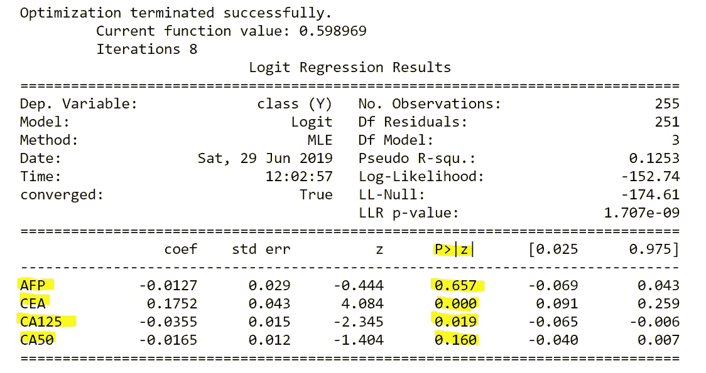

Figure 12

突出显示的值是本报告中重要的内容:我们的 4 个独立变量及其 p 值。AFP 和 CA50 的 p 值较高。如果我们的α值为 0.05，那么 AFP 和 CA50 的值太高，无法拒绝我们的无效假设(我们的无效假设是蛋白质水平对癌症发病率没有影响)。然而，CEA 和 CA125 通过了测试，并且被确定为显著的。AFP 和 CA50 都是基于我们在堆积条形图上看到的假设而被忽略的，所以这是有道理的。让我们去掉这些变量，再次进行回归分析:

```
**#deleted p values above the 0.05 alpha threshold**
cols= ['CEA','CA125']
X= df[cols]
y = df['class (Y)']
logit_model = sm.Logit(y,X)
result = logit_model.fit()
print(result.summary())
```

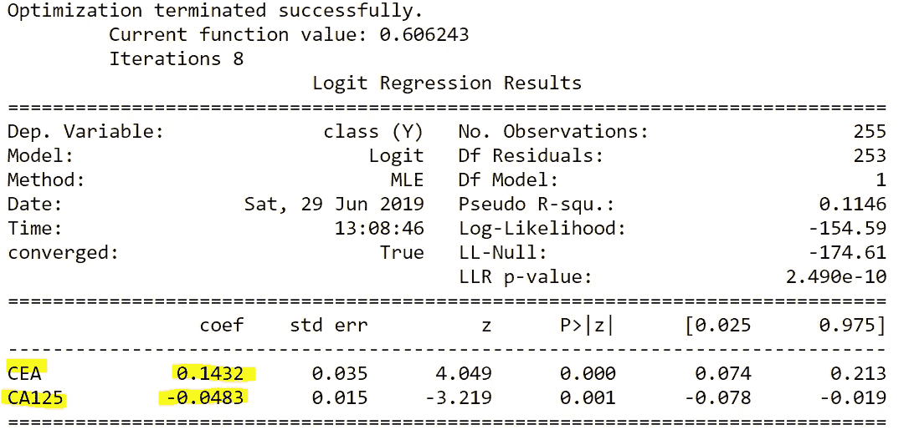

Figure 13

有了我们的最终系数，我们对每个剩余蛋白质和癌症之间的关系有了更多的了解。CEA 的阳性关系比 CA125 的阴性关系强约 3 倍。随着癌胚抗原的增加，癌症的可能性增加。随着 CA125 的增加，癌症的可能性降低。

# 测试模型

我们将把样本数据分为训练和测试，以测试我们的回归结果。

```
from sklearn.linear_model import LogisticRegression
from sklearn import metrics**#shuffling df**
df = df.sample(frac=1).reset_index(drop=True)**#redefining columns** 
cols= ['CEA','CA125']
X= df[cols]
y = df['class (Y)']**#Dividing into training(70%) and testing(30%)**
X_train, X_test, y_train, y_test = train_test_split(X, y, test_size=0.3, random_state=0)**#Running new regression on training data**
logreg = LogisticRegression()
logreg.fit(X_train, y_train)**#Calculating the accuracy of the training model on the testing data**
accuracy = logreg.score(X_test, y_test)
print('The accuracy is: ' + str(accuracy *100) + '%')
```


形象化上面计算的精确度的一个好方法是使用[混淆矩阵](https://en.wikipedia.org/wiki/Confusion_matrix)。下面是混淆矩阵的概念框架。

> 编辑:我和一个生物统计的朋友谈论我的分析，这个领域的惯例是这种疾病被认为是阳性的。我武断地将癌症设定为阴性，因为我当时并不知道这一点。


Figure 14

“迷惑”是很多人的关键词。试着一次看一行:第一行是一个好的起点。这一行告诉我们有多少实例被预测为良性的。如果我们查看这些列，我们可以看到该预测中实际值的拆分。请记住，行是预测值，列是实际值。

```
from sklearn.metrics import confusion_matrix
confusion_matrix = confusion_matrix(y_test, y_pred)
print(confusion_matrix)
```

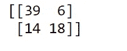

将上面的矩阵与图 14 进行匹配，了解其含义:

*   **我们模型的 39 个**猜测是**真阳性**:模型认为病人没有癌症，他们确实没有癌症。
*   我们的模型的猜测中有 18 个是**真阴性**:模型认为病人患有癌症，他们确实患有癌症。
*   **14** 我们的模型的猜测是**假阴性**:模型以为病人得了癌症，但实际上他们并没有得癌症
*   **6** 我们的模型的猜测是**假阳性**:模型认为病人没有癌症，但他们实际上患了癌症。

我们总数据的 30%给了测试组，剩下 255(.3) = 77 个被测试的实例。矩阵的和是 77。将“真实”的数字除以总数，将得到我们模型的精确度:57/77 = 74.03%。

> 请记住，在执行这个测试之前，我们随机打乱了数据。我运行了几次回归，得到了 65%到 85%的准确率。

# 受试者工作特征曲线

最后，我们将执行[接收器操作特性](https://en.wikipedia.org/wiki/Receiver_operating_characteristic) (ROC)分析，作为测试我们模型的另一种方式。该测试的两个目的是

1.  确定最佳“截止”点在哪里。
2.  通过另一个称为“曲线下面积”(AUC)的指标来确定模型的分类效果。

我们将从头开始创建我们的 ROC 曲线。以下是用于格式化新数据框架以计算 ROC、截止点和 AUC 的所有代码。

```
**#Formatting y_test and y_predicted probabilities for ROC curve**
y_pred_prob = pd.DataFrame(y_pred_prob)
y_1_prob = y_pred_prob[1]
y_test_1 = y_test.reset_index()
y_test_1 = y_test_1['class (Y)']**#Forming new df for ROC Curve and Accuracy curve**
df = pd.DataFrame({ 'y_test': y_test_1, 'model_probability': y_1_prob})
df = df.sort_values('model_probability')**#Creating 'True Positive', 'False Positive', 'True Negative' and 'False Negative' columns** 
df['tp'] = (df['y_test'] == int(0)).cumsum()
df['fp'] = (df['y_test'] == int(1)).cumsum()
total_0s = df['y_test'].sum()
total_1s = abs(total_0s - len(df))
df['total_1s'] = total_1s
df['total_0s']= total_0s
df['total_instances'] = df['total_1s'] + df['total_0s']
df['tn'] = df['total_0s'] - df['fp']
df['fn'] = df['total_1s'] - df['tp']
df['fp_rate'] = df['fp'] / df['total_0s']
df['tp_rate'] = df['tp'] / df['total_1s']**#Calculating accuracy column**
df['accuracy'] = (df['tp'] + df['tn']) / (df['total_1s'] + df['total_0s'])**#Deleting unnecessary columns**
df.reset_index(inplace = True)
del df['total_1s']
del df['total_0s']
del df['total_instances']
del df['index']
df
```

为了理解下面的数据框中发生了什么，让我们一行一行地分析它。

*   **索引**:这个数据帧是按照 model_probability 排序的，为了方便起见，我重新编制了索引。
*   **CA125 和 CEA** :蛋白质水平原始检测数据。
*   **model_probability** :该列来自我们的训练数据的逻辑模型，该模型基于输入的测试蛋白质水平输出其被分类为“1”(癌性)的概率预测。第一行是最不可能被归类为癌症的实例，其 CA125 水平高而 CEA 水平低。
*   y_test :我们用来检查模型性能的测试数据的实际分类。

> 其余的专栏仅仅基于“y_test”，而不是我们的模型的预测。把这些值想象成它们自己的混淆矩阵。这些将有助于我们确定以后的最佳分界点。

*   **tp(真阳性)**:该列从 0 开始。如果 y_test 为‘0’(良性)，则该值增加 1。它是所有潜在真阳性的累积追踪器。第一行就是一个例子。
*   **fp(假阳性)**:该列从 0 开始。如果 y_test 为‘1’(癌变)，则该值增加 1。它是所有潜在误报的累积跟踪器。第四行就是一个例子。
*   **tn(真阴性)**:该列从 32 开始(测试集中 1 的总数)。如果 y_test 为‘1’(癌变)，则该值减少 1。它是所有潜在真阴性的累积追踪器。第四行就是一个例子。
*   **fn(假阴性)**:该列从 45 开始(测试集中 0 的总数)。如果 y_test 为‘0’(良性)，则该值减少 1。它是所有潜在假阴性的累积跟踪器。第四行就是一个例子。
*   **FP _ Rate(False Positive Rate)**:这是通过获取行的误报计数并除以总的阳性数(在我们的例子中是 45)计算出来的。它让我们知道我们可以通过在该行设置分界点来分类的假阳性的数量。**我们希望尽可能降低成本。**
*   **tp_rate(真阳性率)**:也称为敏感度，计算方法是获取行的真阳性计数，然后除以阳性总数。它让我们知道我们可以通过在那一行设置分界点来分类的真阳性的数量。**我们希望尽可能地保持高水平。**
*   **准确性**:真阳性和真阴性的总和除以总实例数(在我们的例子中是 77)。我们一行一行地计算潜在的精确度，基于我们混淆矩阵的可能性。

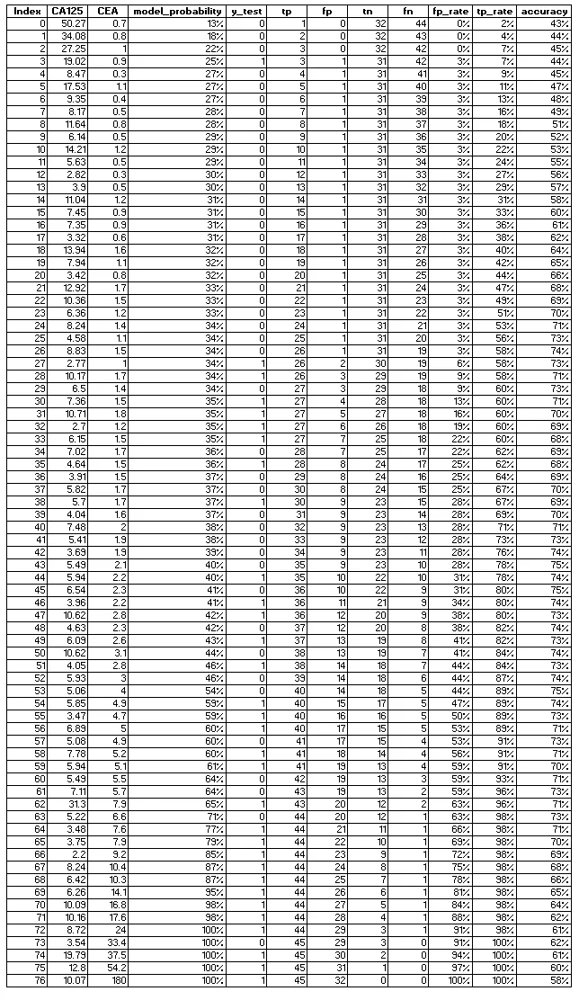

Figure 15

我粘贴了整个数据帧，因为它值得研究一段时间，并从所有移动的片段中找出意义。看完之后，试着找出最高的准确率。如果您可以找到它，您可以将其与相应的 model_probability 进行匹配，以发现我们数据的最佳分界点。

```
**#Plotting**
plt.plot(df['model_probability'],df['accuracy'], color = 'c')
plt.xlabel('Model Probability')
plt.ylabel('Accuracy')
plt.title('Optimal Cutoff')**#Arrow and Star**
plt.plot(0.535612, 0.753247, 'r*')
ax = plt.axes()
ax.arrow(0.41, 0.625, 0.1, 0.1, head_width=0.01, head_length=0.01, fc='k', ec='k')
plt.show()
```

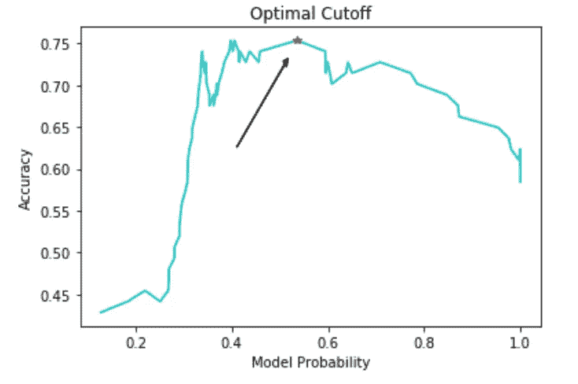

Figure 16

模型概率为 54%,其中精确度最高为 75%。这可能看起来违背直觉，但这意味着如果我们在将患者归类为癌症患者时使用 54%而不是 50%,这实际上会更准确。如果我们想最大限度地提高准确性，我们应该将阈值设置为 54%，但是，由于癌症的极端性质，将阈值降低到 50%以下可能是明智的，以确保无论如何都可以检查出可能患有癌症的患者。换句话说，当涉及到癌症时，假阳性比假阴性更重要！

最后，让我们绘制 ROC 曲线并找出 AUC:

```
**#Calculating AUC**
AUC = 1-(np.trapz(df[‘fp_rate’], df[‘tp_rate’]))**#Plotting ROC/AUC graph**
plt.plot(df[‘fp_rate’], df[‘tp_rate’], color = ‘k’, label=’ROC Curve (AUC = %0.2f)’ % AUC)**#Plotting AUC=0.5 red line**
plt.plot([0, 1], [0, 1],’r — ‘)
plt.xlabel(‘False Positive Rate’)
plt.ylabel(‘True Positive Rate (Sensitivity)’)
plt.title(‘Receiver operating characteristic’)
plt.legend(loc=”lower right”)
```

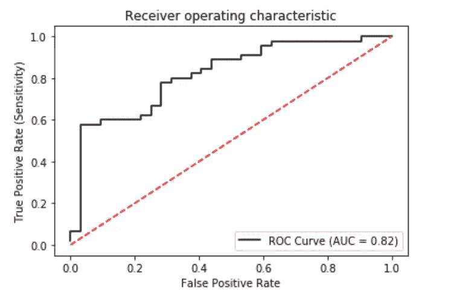

Figure 17

黑色的 ROC 曲线显示了我们的测试数据的真阳性率和假阳性率之间的权衡。穿过图表中心的红色虚线是为了提供一种最坏可能模型看起来像 ROC 曲线的感觉。

> ROC 线越靠近左上方，我们的模型越有预测性。它越像红色虚线，预测性就越低。

这就是曲线下面积(AUC)的由来。AUC，顾名思义，是 ROC 曲线下的空间面积。直观上，这个值越接近 1，我们的分类模型就越好。虚线的 AUC 是 0.5。完美模型的 AUC 应该是 1。我们的 AUC 为 0.82，相当不错。

**如果您觉得这很有帮助，请订阅。**

我的其他文章，如果你想了解更多:

## 点击了解多项式回归

## 点击了解有关 rsquared [的信息:](/r-squared-recipe-5814995fa39a)