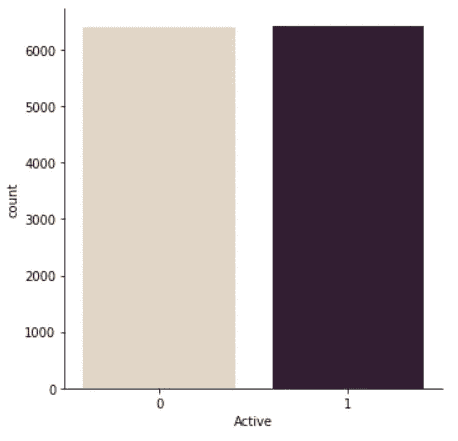

# 用逻辑回归、knn、梯度推进和分子指纹法预测环境致癌物

> 原文：<https://towardsdatascience.com/predicting-carcinogens-with-logistic-regression-knn-gradient-boosting-and-molecular-e7952294a08c?source=collection_archive---------42----------------------->

## 平衡不平衡的数据，探索准确性度量，以及化学信息学导论

# 导言和背景

## **Tox 21 是什么？**

T21 世纪毒理学计划(Tox21)是几个联邦机构之间的独特合作，旨在开发快速测试物质是否对人类健康产生不利影响的新方法。Tox21 中检测的物质包括各种产品，如:商业化学品、杀虫剂、食品添加剂/污染物和医用化合物。

## 为什么是 p53 蛋白？

p53 基因编码一种同名的蛋白质，被称为肿瘤抑制蛋白。当细胞经历 DNA 损伤时，p53 蛋白在细胞中表达，这可以将正常细胞转化为癌细胞。为了抵消这种影响，p53 可以导致生长停滞、修复 DNA 或开始细胞死亡过程。因此，当 DNA 损伤发生时，p53 表达显著增加。这种蛋白质表达的增加是不规则细胞健康的良好指标。Tox21 数据是通过测试在 p53 细胞机制控制下产生荧光报告基因产物的细胞系产生的。通过测量针对各种化合物的报告基因产物的水平，研究人员能够确定化合物是否是 p53 途径的激动剂(激活剂)。

## 使用分子指纹预测激动剂

指纹是一种将分子结构和性质表示为二进制位串(0 和 1)的方法。这种表示最初被开发并应用于搜索具有特定子结构的分子的数据库，但它也可以应用于机器学习。哈希函数是一个随机数生成器，应用于分子的每个特征，例如存在的键和分子的类型，这意味着它们充当函数的种子。

下图说明了如何通过生成分子指纹来评估两个分子的相似性(使用 Tanimoto 指数)。每个分子首先应用哈希函数，然后根据特征生成指纹。下图中的指纹生成器查看某个焊接距离半径以及该距离内的特征。

[1]

**指纹的种类**

这个项目将使用四种不同类型的指纹，并比较它们的预测能力。

*   **摩根圆形指纹—** 该指纹属于扩展连接指纹(ECFPs)家族，使用摩根算法生成[2，3]。这些指纹通过圆形原子邻域(键半径)来表示分子结构和亚结构的存在。另一个重要的特征是它们能够确定分子功能性的存在与否，这可以在对分子进行分类时进一步帮助区分。

*   **类似日光的指纹** —该指纹生成器(使用 RDKit)生成的指纹与使用日光指纹算法生成的指纹相似。一个过于简单的解释:该算法沿着分子内的路径(拓扑路径)散列键[4][5]。下图显示了如何识别和描述焊接路径。

[6]

*   **原子对指纹** —顾名思义，原子对指纹是使用原子对(作为特征)及其拓扑距离构建的。通过首先识别重原子和它们之间的最短距离，生成如下所示的原子对指纹。一对原子中的单个原子的特征(如键的数量)被编码。然后，这些编码特征被转换成位串，并表示为一个数字。然后，这个串联的整数串被传递给哈希函数，哈希函数将其赋值为 1 或 0。

[7]

*   **拓扑扭转指纹—** 是通过识别四个非氢原子的键路径而产生的 2D 结构指纹。然后这些四路碎片有了它们的特征，比如计算出的每个原子的 **π** 电子数、原子类型和非氢分支数。每个原子由 8 位来表征，这 4 个原子将它们的位存储在 32 位数组中。

# 准备数据

Tox21 数据已经标记了活动(1)和非活动(0)状态，因此除了加载、格式化列名和为每个分子生成 mol 文件(这些文件通常被归类为包含分子数据信息、原子、键、坐标和连接信息的数据文件)之外，在此步骤中实际上没有太多事情要做。

要继续操作，请编辑数据在机器上的路径。我们加载一个 sdf 文件——它是一个*结构数据文件*,包含化合物的相关数据。我们实际上不需要这些细节，因为它们不会增加 p53 激动剂的分类，因此我们放弃了它们。例如,“公式列”没有给我们任何有用的信息，因为它是经验公式，不包含 SMILES 字符串提供的有价值的结构信息。我们确实需要分子的摩尔表示，所以我们生成了它们。

我们还应该确保数据中没有任何重复。特别是这个数据集，总共有 8629 条记录，只有 6826 条唯一记录，这意味着大约 20%的数据是重复的，需要丢弃。

**指纹生成**

这是一个使用摩根算法生成指纹的例子。为“mol”列中的每种化合物生成指纹，半径为 2，位长为 2048。还为每个 mol 生成具有相同参数的列表。然后，for 循环遍历该列表，创建一个 numpy 数组，并在名称中添加一个由“np”表示的新列表。当运行分类器时，这些列表将成为我们的 x 变量。

设置 x 和 y 变量:

## 抽样:班级平衡吗？

当分类标签(在我们的例子中:活动= 1；inactive = 0)是成比例偏斜的，偏差被引入到模型中。例如，如果数据集包含 95%的活性标记，那么模型可能将非活性分子分类为活性分子，简单地说，准确度将反映类别分布。确定阶级不平衡是否是直接的——计算标签的分布。一旦我们确定了少数民族在我们的数据集中有多普遍，我们就可以继续平衡它。

上面的计数图显示了我们的数据中存在不成比例的类分布，比例为 15:1(非活动与活动),这意味着大约 93.84%的类是非活动的。

## 阶级平衡的方法

有两种方法可以平衡数据:过采样和欠采样。过采样通过使用多种算法之一生成合成数据点来实现平衡。我们今天要用的是 SMOTE(合成少数过采样技术)算法的一个变种。SMOTE 的工作原理是搜索给定点数据的 k-最近邻，然后沿着邻点之间的线生成数据点。由于这些点落在真实数据点之间的线上，所以存在一些相关性，这就是为什么我们将使用 ADASYN 算法(自适应合成)。ADASYN 的工作方式基本上与 SMOTE 相同，但是它向点添加随机生成的小值，以增加方差并模拟更真实的数据。

*   **注意** —我选择不使用欠采样，因为它通过从多数类中移除数据点来平衡类，因此有数据损失，可能影响分类器的区分能力。

[9]

## 应用 ADASYN 算法:

在这里，我们将 ADASYN 算法应用于每个 x 变量，这将最终导致每个指纹的不同少数类计数，但范围很窄，计数的变化很小，所以这不会造成问题。

我们可以绘制一个重新采样的分布图来直观地表示类别平衡:

## 创建培训、测试和验证测试集

为了训练、测试和再次测试，我们需要创建三个独立的数据分区。训练数据将用于训练我们的模型——本质上，模型将使用该数据来学习哪些指纹(2048 位模式)可能属于 p53 激动剂。测试集将用于评估我们模型的准确性，最后一个验证集将用作无偏数据集来测试我们模型的预测能力。

我们的数据将被分成 85/15 训练/测试集，然后训练数据将被进一步分成 85/15 训练/验证集。

# 逻辑回归

逻辑回归算法根据分类反应(结果)变量与预测特征的关系，将其分类为 1 到 0。相反，线性回归输出的响应变量是连续的，可以是任何实数。最重要的是，线性回归不输出概率，而是拟合最佳超平面。因此，逻辑回归是像我们这样的二元分类问题的自然选择。

## 交叉验证和模型拟合

交叉验证是一种统计技术，用于降低数据过度拟合的风险。当分类器记忆数据并拟合噪声和误差而不是变量之间的潜在关系时，发生过拟合。如果模型过于复杂，并且用于训练的数据有限，就会出现这种情况。我们的模型似乎没有这两个限制，但无论如何，执行交叉验证是一个好的实践。

上面的图片展示了一个模型是如何“记忆”和拟合数据的。下图显示了交叉验证是如何创建 10 个折叠的，每个折叠都被分成测试集和训练集以适应模型，然后对每个折叠的误差进行平均。

Over-fitting [(source)](https://www.wikiwand.com/en/Overfitting) | cross validation [(source)](/cross-validation-explained-evaluating-estimator-performance-e51e5430ff85)

以下代码行显示了如何执行逻辑回归，获得每个折叠的交叉验证分数(只需对训练数据进行一次迭代，以使用选择的分类器估计分数)。然后，我们在执行 k-fold (10)交叉验证的同时，对 1000 次迭代的逻辑回归进行建模。

对于其余的指纹，我们可以简单地编写一个函数来模拟数据:

## 模型度量和预测

**测试集预测和混淆矩阵**

混淆矩阵是描述训练模型对测试数据的性能的表格。矩阵由四个象限组成:

*   **真阳性(TP):** 这些是预测为阳性(活性 p53 激动剂)并且实际上是阳性的化合物。
*   **真阴性(TN):** 这些化合物被预测是无活性的，实际上是无活性的。
*   **假阳性(FP):** 预测化合物有活性但实际上没有活性的情况(I 型错误)。
*   **假阴性(FN):** 预测化合物无活性但实际上有活性的情况(II 型错误)

我们可以绘制测试集和验证集预测的混淆矩阵以及准确性，准确性通过(TP+TN)/总案例来确定。左边的混淆矩阵是测试集预测的混淆矩阵，右边的是验证集的混淆矩阵。

# k-最近邻

k-最近邻算法(knn)取一个数据点并查看 k 个最近的数据点(k =7 意味着 7 个最近的)，然后根据 k 个最近点的多数标签将该数据点标记为 0 或 1。例如，如果给定一个 k=7 的数据点，并且最接近的点恰好是五个 0 和两个 1，那么该点将被分类为 0(无效)。

Knn 在处理较少的特征时表现最佳，从而降低了过度拟合的可能性。正常情况下，我们必须执行 PCA 或其他形式的降维，然而，由于我们使用的是单一的预测特征，我们不需要这样做。

knn

## 网格搜索和模型拟合

通过交叉验证执行网格搜索，为我们的数据确定最佳邻居数量。我们将测试 9 个候选数字(3、5、7、9、11、13、15、17、19)，并执行 5 重交叉验证。然而，这可能需要一段时间，因为 9 个邻居 x 每个邻居的 5 倍验证等于 45 次拟合。k 倍可以减少，这样我们就可以保持一个体面的邻居范围来尝试。

**注意:将“n_jobs”设置为-1——这允许在最大 CPU 使用率下进行并行处理**

网格搜索建议使用的最佳邻居数量为 3。

为了测试 k 个邻居数的范围，我们可以用不同的 k 值来拟合不同的指纹数据。使用原子对训练数据，我测试了 k = 3，5，7，9，这按顺序产生了以下准确度分数:

0.846
0.846
0.815
0.785

看起来 3 和 5 有相同的分数，但是 3 可能是因为计算时间较少而被选中的。最后，用 k=3 训练模型，首先计算测试数据的准确度，然后计算验证数据的准确度

# **梯度增强**

到目前为止，我们已经为每个分类器的训练数据拟合了单个模型。梯度增强将许多单独的模型结合起来，创建一个精确的模型，这就是所谓的集合。增强是用于创建合奏的方法。它通过将数据与初始模型拟合来工作，然后建立后续模型，该模型用于准确预测初始模型未正确分类的标签。本质上，每个后续模型都致力于最小化前一个模型的预测误差，这导致预测误差的总体降低。因此，最终模型做出的预测是所有先前模型计算的预测的加权和的结果。

By Alex Rogozhnikov [(source)](http://arogozhnikov.github.io/2016/06/24/gradient_boosting_explained.html)

## 网格搜索和模型训练，以及度量

像我们之前做的那样，执行网格搜索来调整参数:

检查测试和验证数据的准确性

# AUC 值和 F1 分数

## 罗马纪元

曲线下面积(AUC)值是评估模型在二元分类任务上的性能的另一种度量，并且是最广泛使用的评估指标之一。计算 AUC 需要给定模型的两个属性——敏感性和特异性。敏感度是正确分类的阳性数据点与所有分类为阳性的数据点的比例。敏感度是被正确分类为阴性的数据点与被分类为阴性的所有数据点的比例。

1.  一个模型的灵敏度:**真阳性/(假阴性+真阳性)。**
2.  模型的特异性:**真阴性/(假阳性+真阴性)**

当真阳性率相对于假阳性率作图时，可以计算该曲线的 AUC，并从本质上对模型区分两类的能力进行评分。较高的 AUC 意味着归类为 p53 激动剂的分子确实更有可能是激动剂。

## f1-分数

模型的 f1 分数是使用回忆(像敏感度一样计算)和精确度计算的，它是以下各项的比率:

*   真阳性/(假阳性+真阳性)

F1 分数可通过以下方式获得:

F1 分数在模型召回率(较少的预测点被证明是假阴性)和精确度(较少的预测点被证明是假阳性)之间找到了平衡。

# **结果和结论**

下表显示了使用四个指纹时每个分类器的预测能力。包括的指标有训练、测试和验证数据集的准确度分数、验证数据的 AUC 分数以及验证数据的 f1 分数。对于每个指纹和分类器，最高分以绿色突出显示。

## 哪个是最好的分类器？

就验证准确性而言，逻辑回归得分一直最高。接下来，当评估 AUC(可以说是最重要的指标)时，梯度增强产生了最高的分数，但是逻辑回归具有最高的平均分数。最后，最高的个体和平均 f1 分数属于逻辑回归，表明它产生的模型在精度和稳健性之间达到了最大的平衡。

**赢家:逻辑回归**

## 哪个指纹最好？

文献表明，尽管拓扑扭曲可能不如日光样指纹和摩根指纹那样受欢迎，但与其他指纹相比，它们表现出更高的性能[8]。

结果显示，日光样指纹在逻辑回归和 knn 中都具有最高的 AUC 得分——当使用梯度增强时，原子对指纹得分仅略微高一些。然而，当考虑梯度增强时，原子对指纹在验证准确性、AUC 和 F1 分数方面超过了日光样指纹。

**获胜者:日光般的指纹**

## 可能的问题

由于相似的分子亚结构，指纹中有时会发生图案之间的意外碰撞。当相同的位由多个模式设置时，会发生这种情况(将两个相似结构的特定特征散列为相同的位)。例如，拓扑扭转指纹产生了八个相同的指纹，这可以通过增加位长(从 2048 到 4096)来避免。

## 参考

[1] Lo，Y.-C .，Rensi，S. E .，Torng，w .，& Altman，R. B. (2018 年)。化学信息学和药物发现中的机器学习。今日药物发现，23(8)，1538–1546。https://doi.org/10.1016/j.drudis.2018.05.010

[2] Morgan，H. L.《化学结构的独特机器描述的产生——化学文摘服务处开发的一种技术》。化学博士。医生。1965, 5: 107–112.

[3]罗杰斯，d；扩展连接指纹。化学博士。Inf。模型。2010, 50(5): 742–754.

[4]https://www.rdkit.org/docs/GettingStartedInPython.html

[5][https://www . daylight . com/day html/doc/theory/theory . finger . html](https://www.daylight.com/dayhtml/doc/theory/theory.finger.html)

[6][https://docs . eyes open . com/toolkits/python/graphsimtk/fingerprint . html](https://docs.eyesopen.com/toolkits/python/graphsimtk/fingerprint.html)

[7] Jelínek，j .，koda，p .，& Hoksza，D. (2017 年)。利用氨基酸结构邻域知识库预测蛋白质相互作用位点。BMC 生物信息学，18(S15)。[https://doi.org/10.1186/s12859-017-1921-4](https://doi.org/10.1186/s12859-017-1921-4)

[8]斯柯达公司和霍克斯扎公司(2015 年)。*拓扑挠指纹探索。2015 年 IEEE 生物信息学和生物医学国际会议(BIBM)。doi:10.1109/bibm。58606.88868688666*

[9] Lee，h .，Kim，j .，& Kim，S. (2017 年)。基于高斯的 SMOTE 算法求解偏斜类分布。国际模糊逻辑和智能系统杂志，17(4)，229–234。[https://doi.org/10.5391/ijfis.2017.17.4.229](https://doi.org/10.5391/ijfis.2017.17.4.229)