# 预测网站的点击率

> 原文：<https://towardsdatascience.com/predicting-click-through-rate-for-a-website-7cd2a892d26e?source=collection_archive---------4----------------------->

## 这是一个二元分类项目，根据给定的特征预测用户是否会在网站上申请。

# 介绍

想象一个用户访问一个网站，并执行工作搜索。从显示的结果集合中，用户点击他/她感兴趣的某些结果，并且在检查工作描述之后，她进一步点击其中的应用按钮以进入应用页面。申请率被定义为申请的分数(在访问职位描述页面后)，目标是使用下一节中描述的数据集来预测此指标。

这篇文章将为任何机器学习新手提供完整的指南。我的目标是为您提供一个应用机器学习的端到端蓝图，同时尽可能保持它的可操作性和简洁。

# 蓝图

1.  **数据收集**
2.  **探索性数据分析** —首先，“了解”数据。这一步应该快速、高效、果断。
3.  **数据清理**——然后，清理你的数据以避免许多常见的陷阱。更好的数据胜过更好的算法。
4.  **功能工程** —接下来，通过创建新功能来帮助您的算法“专注于”重要的东西。
5.  **算法选择** —选择最佳、最合适的算法，不浪费您的时间
6.  **模型训练和调优** —最后，训练你的模型。一旦你完成了前 5 步，这一步就相当公式化了
7.  **洞察力** —最终将推动业务发展的最终结果

# 数据收集和问题描述

你可以从[这里](https://github.com/animeshgoyal9/Data_Challenge_2)下载数据。

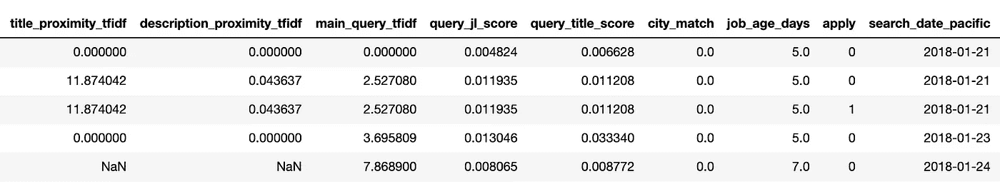

Dataset

数据集中的每一行都对应于一个职务列表的用户视图。它有 10 列，如下所述。
1。职位接近度 tf idf:衡量查询和职位的接近度。
2。描述接近度 tf idf:衡量查询和工作描述的接近度。
3。主查询 tf idf:与用户查询与职位名称和职位描述的接近程度相关的分数。
4。查询 jl 得分:衡量查询和职务列表对的流行程度。
5。查询职称得分:衡量查询和职称对的受欢迎程度。
6。城市匹配:指明职务列表是否与用户(或用户指定的)位置匹配。7。职务年龄天数:指明已发布职务列表的年龄。8。申请:指明用户是否已申请此职务列表。9。太平洋搜索日期:活动日期。10。类别 id:单击的职位的类别 ID。

这个问题有两个部分。

1.  我们必须只关注前 7 列，并使用这些功能来预测有多少用户申请该网站。
2.  我们必须考虑将最后一列添加到特征集(“类 id”)，并检查分类性能是否提高。

# 探索性数据分析

探索性分析的目的是**“了解”**数据集。预先这样做将使项目的其余部分更加顺利，主要有三个方面:

1.  您将获得关于数据清理的有价值的提示(这将决定您的模型的成败)。
2.  你会想到特征工程的想法(可以让你的模型从好变得更好)。
3.  您将获得对数据集的“感觉”，这将有助于您交流结果并产生更大的影响。

但是，机器学习的探索性分析应该是**快速、高效、果断** …而不是冗长！

不要跳过这一步，但也不要在这一步上卡住。

你看，有无限可能的图、图表和表格，但是你只需要一把**的**来“了解”足够好的数据来使用它。

在这一步中，我们将向您展示为您的投资带来最大收益的可视化效果。

## 从基础开始

首先，您需要回答一组关于数据集的基本问题:

*   我有多少观察值？
*   有多少功能？
*   我的要素的数据类型是什么？它们是数字吗？绝对的？
*   我有目标变量吗？

该数据集总共包含 1200890 个观察值，其中 789586 个观察值是在 2018 年 1 月 21 日至 2018 年 1 月 26 日之间收集的，而其余的观察值是在 2018 年 1 月 27 日收集的。总共有 9 个特性和 1 个目标变量(“应用”)。没有明确的特征。

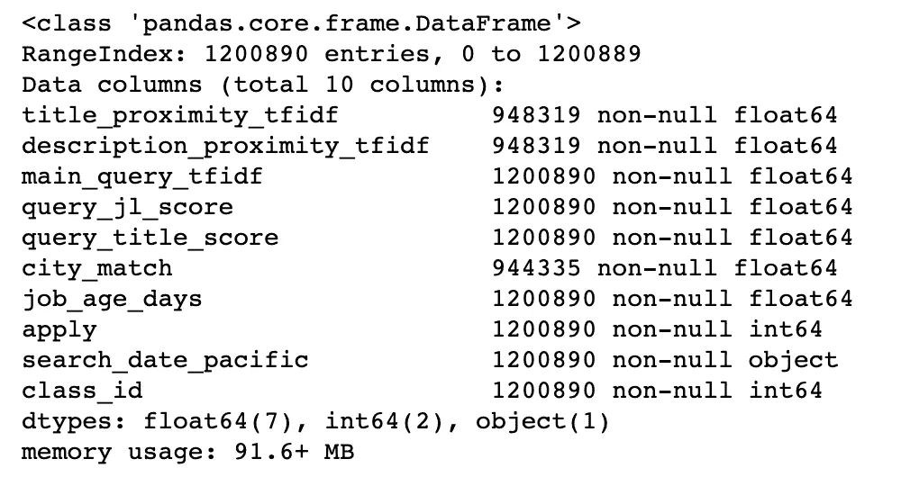

Dataset info

## 缺少值

接下来，我们可以检查数据集中有多少缺失值。从上表可以清楚地看出，标题邻近 tfidf、描述邻近 tfidf 和城市匹配包含空值。

## 类别分布

由于该数据集是关于有多少访问网站的客户点击应用，它可能不是很多，我们可以假设这将是一个不平衡的数据。让我们看看我们是否正确。

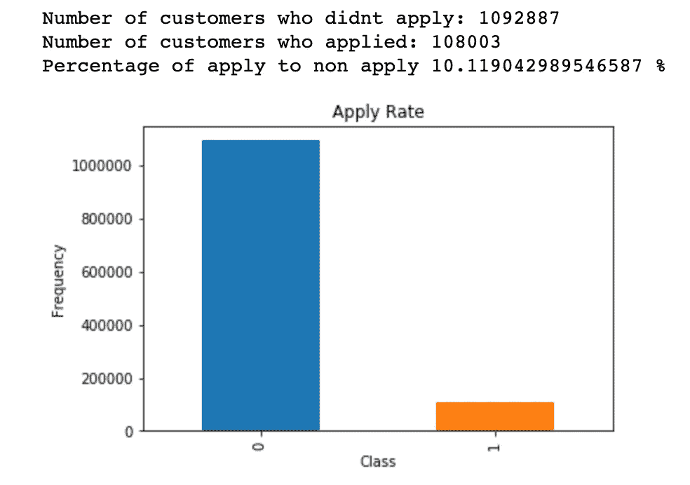

Data Distribution (1 = Apply, 0 = Not Apply)

我们可以看到，这种分布确实是不平衡的。为了处理这种情况，有各种技术，如欠采样、过采样、SMOTE，使用 AUC 等指标。但这些将在以后讨论。

## 数据描述

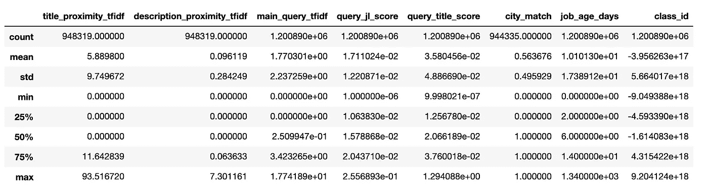

Data Description

以下是该表中的观察结果:

1.  大多数预测值的 75%瓦片和最大值之间存在显著差异。
2.  ' title_proximity_tfidf '，' description_proximity_tfidf '，' main_query_tfidf '，' query_jl_score '，' query_title_score '，' job_age_days '的中值低于平均值
3.  因此，观察值 1 和 2 表明数据中存在大量异常值

## 相互关系

相关性允许您查看数字特征和其他数字特征之间的*关系。*

相关性是一个介于-1 和 1 之间的值，表示两个要素协调移动的程度。你不需要记住数学来计算它们。只要知道以下直觉:

1.  **正**相关意味着随着一个特征的增加，另一个特征也增加。例如孩子的年龄和身高。
2.  **负**相关性意味着一个特征增加，另一个特征减少。例如花在学习上的时间和参加的聚会。
3.  接近-1 或 1 的相关性表示**强关系**。
4.  那些接近 0 的表示弱关系。
5.  0 表示**没有关系**

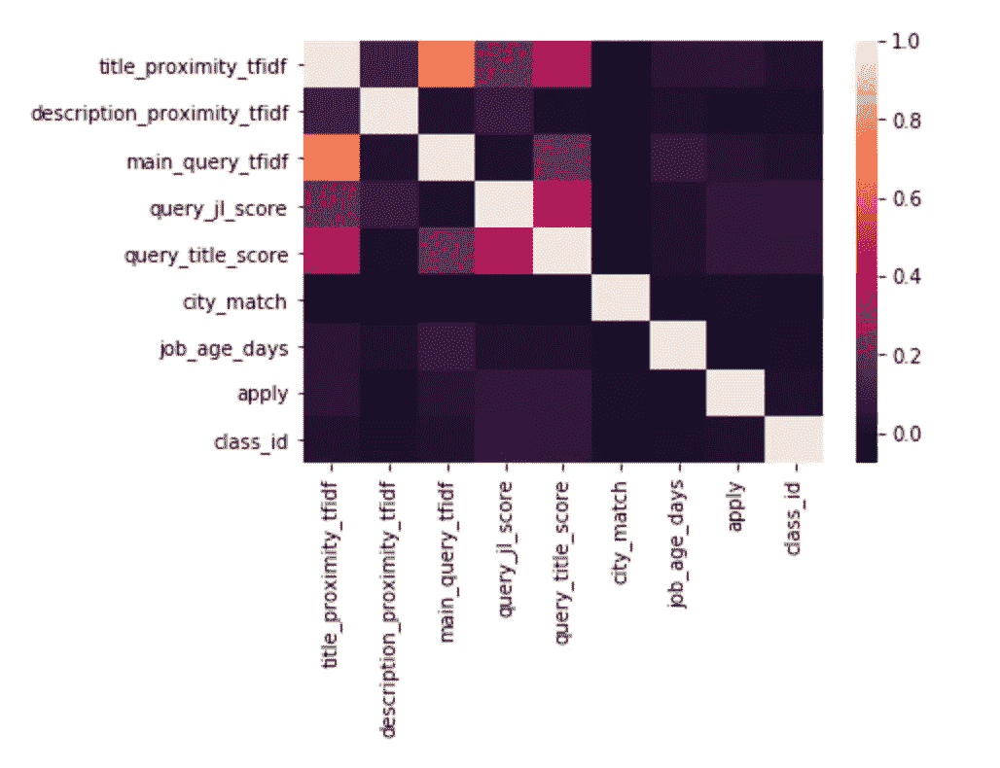

Correlation between variables

大多数特征彼此之间并不高度相关。仅有的两个具有某种相关性的特征是主查询 tfidf 和标题接近度 tfidf(大约 0.8)。

## 极端值

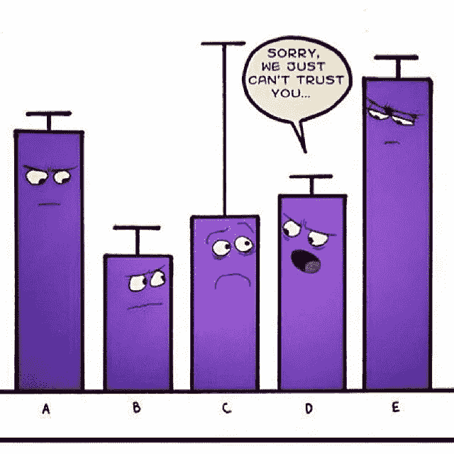

Outliers

探索性数据分析中最重要的步骤之一是异常值检测和处理。机器学习算法对数据点的范围和分布非常敏感。数据异常值会欺骗训练过程，导致训练时间更长，模型更不准确。离群值被定义为与剩余数据显著不同的样本。这些点位于分布的整体模式之外。均值、方差和相关性等统计指标很容易受到异常值的影响。

*异常值的性质:*

由于以下原因之一，数据集中可能会出现异常值，

1.  数据集中真正的极高值和极低值
2.  由于人为或机械错误而引入
3.  通过替换缺失值引入

*异常值检测*

*   极值分析
*   z 分数法
*   k 表示基于聚类的方法
*   可视化数据
*   箱线图

*异常值处理*

*   均值/中值或随机插补
*   整理
*   顶部、底部和零编码
*   [数]离散化

然而，在本文中，我将使用箱线图方法检测异常值。如果您想深入了解如何检测和处理异常值，请参考这篇[文章](https://medium.com/@swethalakshmanan14/outlier-detection-and-treatment-a-beginners-guide-c44af0699754)。箱线图也称为晶须图，是一种图形方法，通常用四分位数和四分位数间距来描述，有助于定义上限和下限，超出上限和下限的任何数据都将被视为异常值。

简而言之，分位数是分布中与该分布中值的等级顺序相关的点。对于给定的样本，您可以通过对样本进行排序来找到任何分位数。排序样本的中间值是中间分位数或第 50 个百分位数(也称为样本的中位数)。

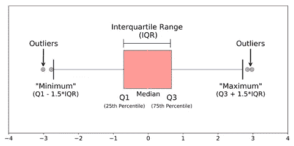

下面是我们数据集的箱线图。

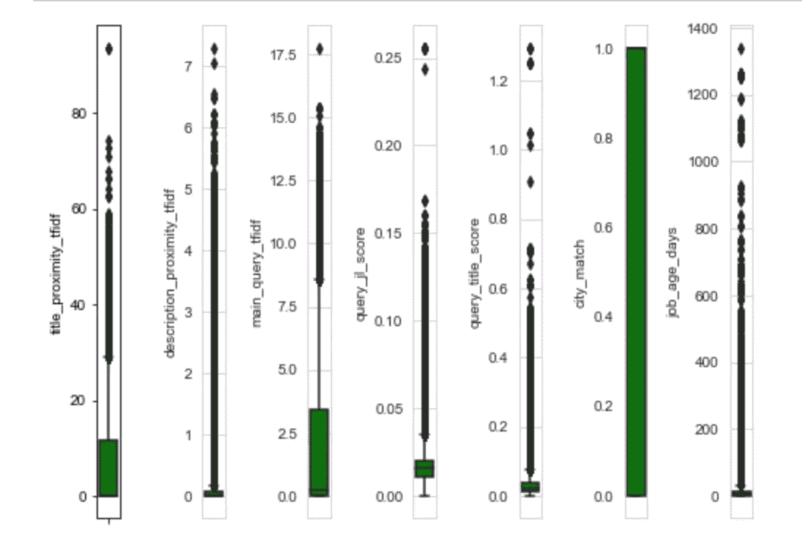

如您所见，数据集中有许多异常值。删除它们可能会导致重要信息的丢失。

# 数据清理

数据清理是每个人都在做但没有人真正谈论的事情之一。当然，这不是机器学习中“最性感”的部分。不，没有隐藏的技巧和秘密要揭开。

然而，适当的数据清理可以成就或破坏您的项目。专业数据科学家通常会在这一步花费大量时间。

为什么？因为机器学习中一个简单的道理:

> 更好的数据胜过更好的算法。

换句话说……垃圾进来，垃圾出去。即使你忘记了本课程的其他内容，请记住这一点。

事实上，如果您有一个适当清理的数据集，即使简单的算法也可以从数据中获得令人印象深刻的见解！

显然，不同类型的数据需要不同类型的清理。然而，本文中介绍的系统化方法总是可以作为一个很好的起点。

## 移除不需要的观察

数据清理的第一步是从数据集中移除不需要的观测值。这包括**重复的**或**不相关的**观察值。我们的数据集包含相当多的重复条目，这些条目将被删除。

## 处理缺失值

在应用机器学习中，缺失数据是一个看似棘手的问题。

首先，明确一点， ***你不能简单地忽略数据集中的缺失值*。你必须以某种方式处理它们，因为大多数算法不接受缺失值。**

> **“常识”在这里是不理智的**

以下是处理缺失数据的最常用方法:

1.  删除有缺失值的观察值
2.  输入基于其他观察的缺失值
3.  插值和外推
4.  使用 KNN
5.  均值/中位数插补
6.  回归插补
7.  随机回归插补
8.  热卡插补

如果你想更详细地了解他们，请参考这篇[文章](/6-different-ways-to-compensate-for-missing-values-data-imputation-with-examples-6022d9ca0779)。在我们的例子中，两个特征(标题邻近 tfidf 和描述邻近 tfidf)主要包含 0，因此我将用 0 替换缺少的值。对于城市匹配特征，1 和 0 分布几乎相等。在这里，我可以选择删除包含 null 的值，或者使用 mean 替换。我已经删除了这种情况下的值。

# 特征工程

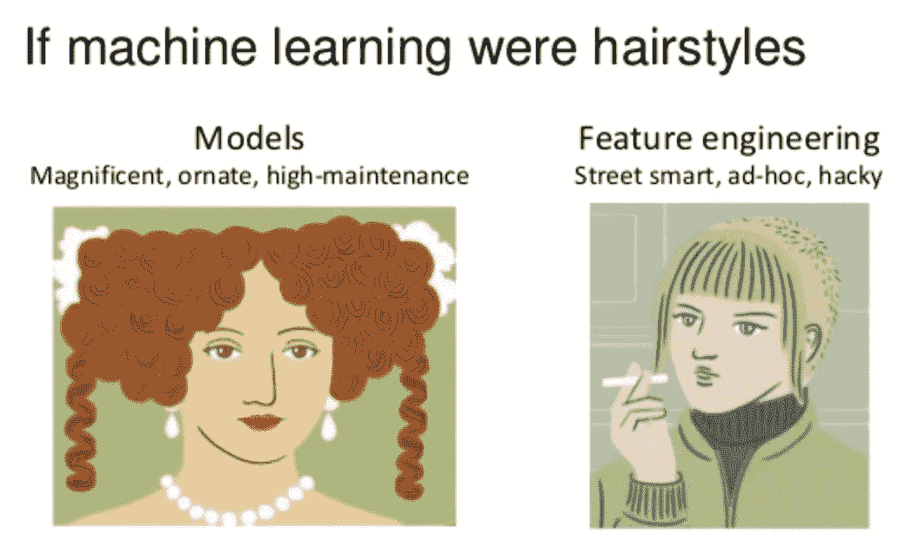

特征工程是关于*从现有的输入特征中创建新的输入特征*。

一般来说，你可以把数据清理看成是一个减法的过程，把特征工程看成是一个加法的过程。

这通常是数据科学家为提高模型性能所能做的最有价值的任务之一，原因有三:

1.  您可以隔离并突出显示关键信息，这有助于您的算法“专注于”重要的内容。
2.  可以自带 ***领域专长*** *。*
3.  最重要的是，一旦你理解了特性工程的“词汇表”，你就可以引入其他人的领域专长！

以下是我们可以执行特征工程的一些方法，但是请注意，这并不是所有特征工程的详尽概要，因为这个步骤有无限的可能性。好消息是，随着你获得更多的经验，这项技能自然会提高。

1.  注入领域知识
2.  创建交互式功能
3.  组合稀疏类
4.  添加虚拟变量
5.  移除未使用的功能

在我们的例子中，由于没有太多关于数据集的领域知识，我们在特征工程的应用中受到限制。我应用的唯一特征工程是将两个相关的特征(title_proximity_tfid 和 main_query_tfidf)相乘，以创建一个名为 main title tfidf 的新列。

# 算法选择

影响模型选择的一些因素有:

1.  模型是否满足业务目标
2.  模型需要多少预处理
3.  模型有多精确
4.  这个模型的解释力有多强
5.  模型有多快:建立模型需要多长时间，模型做预测需要多长时间。
6.  模型的可伸缩性如何

影响算法选择的一个重要标准是模型复杂度。一般来说，较复杂的模型是:

1.  它依赖于更多的特征来学习和预测(例如，使用两个特征对十个特征来预测目标)
2.  它依赖于更复杂的特征工程(例如，使用多项式、相互作用或主成分)
3.  它有更多的计算开销(例如，单个决策树与 100 棵树的随机森林相比)。

除此之外，基于参数的数量或一些超参数的选择，相同的机器学习算法可以变得更加复杂。举个例子，

1.  一个回归模型可以有更多的特征，或者多项式项和交互项。
2.  决策树可以有或多或少的深度。

使相同的算法更复杂会增加过度拟合的机会。

## **用于分类的常用机器学习算法**

***逻辑回归***

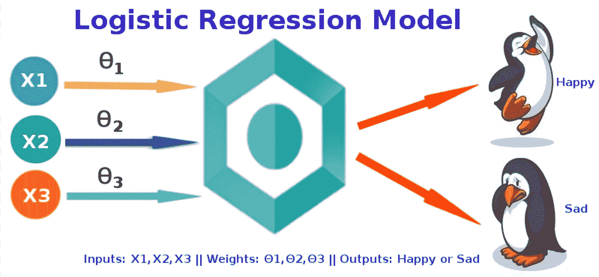

逻辑回归模型符合一条“直线”。实际上，他们很少表现良好。对于大多数机器学习问题，我们实际上建议跳过它们。

它们的主要优点是易于解释和理解。但是，我们的目标不是研究数据，写研究报告。我们的目标是建立一个可以做出准确预测的模型。

在这方面，逻辑回归有两个主要缺陷:

1.  ***输入特征多了容易过拟合。***
2.  ***它不能轻易表达非线性关系。***

***正规化***

如上所述，逻辑回归遭受过拟合和处理非线性关系的困难。正则化是一种通过人为惩罚模型系数来防止过度拟合的技术。

*   它可以阻止大系数(通过抑制它们)。
*   它还可以完全移除要素(通过将它们的系数设置为 0)。
*   惩罚的“力度”是 ***可调*** 。(明天会有更多相关内容……)

正则化的类型有套索(L1)、脊(L2)和弹性网(脊和套索的折衷)

***决策树***

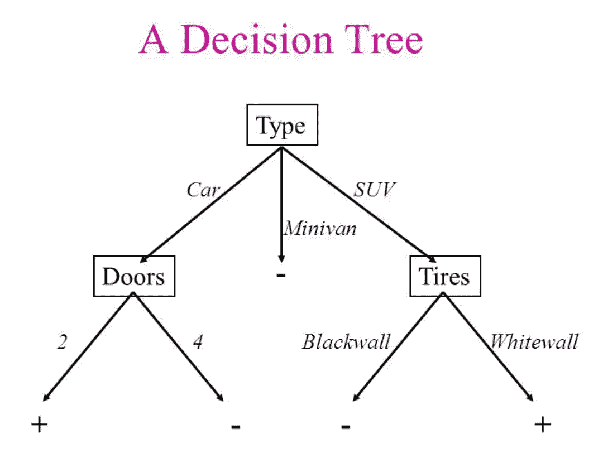

决策树将数据建模为分层分支的“树”。它们分支，直到到达代表预测的“叶子”。由于它们的分支结构，决策树可以很容易地模拟非线性关系。

不幸的是，决策树也有一个重大缺陷。如果你允许他们无限制地增长，他们可以完全“记住”训练数据，只是从创建越来越多的分支开始。因此，单个无约束决策树非常容易过度拟合。​

那么，我们如何利用决策树的灵活性，同时防止它们过度拟合训练数据呢？

***树系综***

集成是用于组合来自多个独立模型的预测的机器学习方法。有几种不同的组装方法，但最常用的两种是:

1.  **装袋**:试图*减少复杂模型过度拟合的机会*。

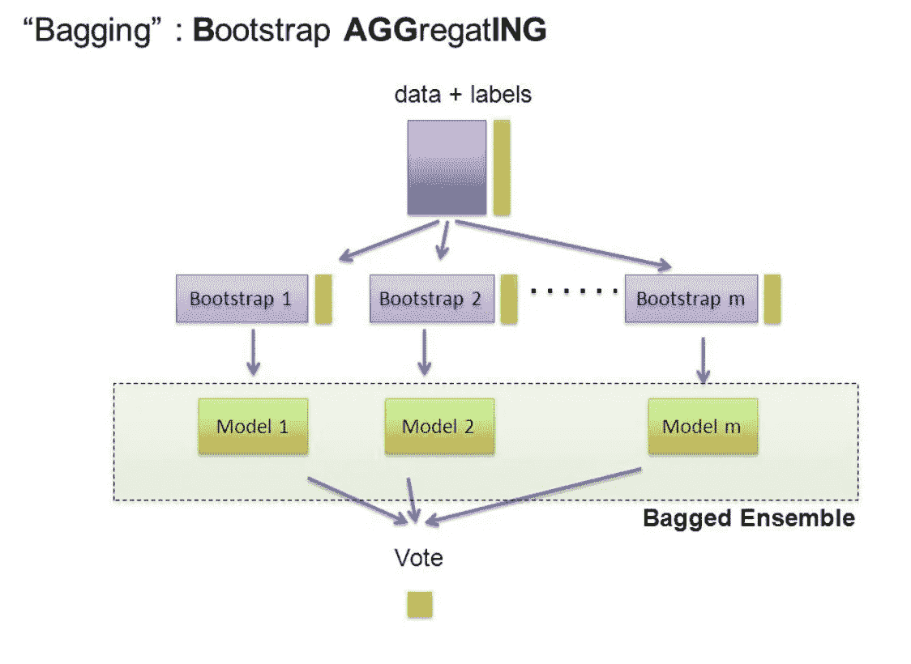

Bagging

*   它并行培养了大量的“强”学习者。
*   一个 ***强学习者*** 是一个相对*无约束*的模型。
*   Bagging 然后将所有强学习者结合在一起，以便“平滑”他们的预测。
*   常用的技术是随机森林

2.**助推**:试图*提高简单模型的预测灵活性*。

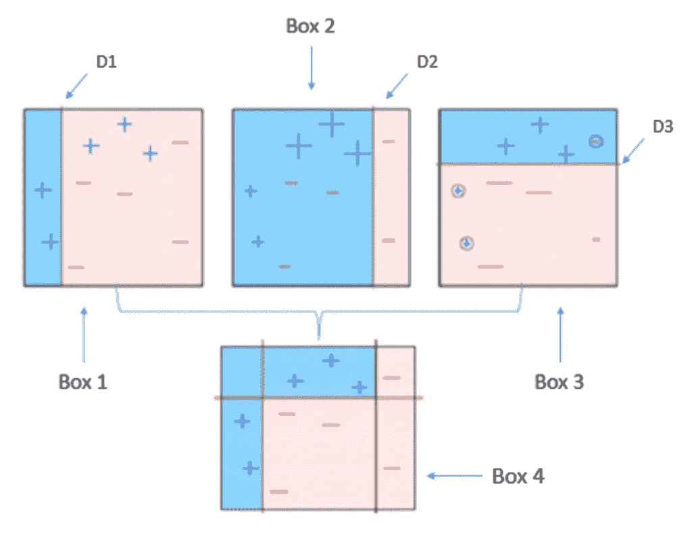

Boosting

*   它按顺序训练出大量的“弱”学习者。
*   一个 ***弱学习器*** 是一个*约束*模型(即你可以限制每个决策树的最大深度)。
*   序列中的每一个都着重于从之前的错误中学习。
*   然后，Boosting 将所有弱学习者组合成一个强学习者。
*   常用的技术是 XGBoost 和 LightGBM

3. **LightGBM:** Light GBM 是一个使用基于树的学习算法的梯度推进框架。轻型 GBM 垂直生长树而其他算法水平生长树意味着轻型 GBM 逐叶生长而其他算法逐级生长。它会选择 delta 损失最大的叶子来生长。当生长相同的叶子时，逐叶算法可以比逐层算法减少更多的损失。

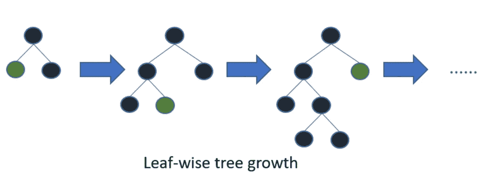

How LightGBM works

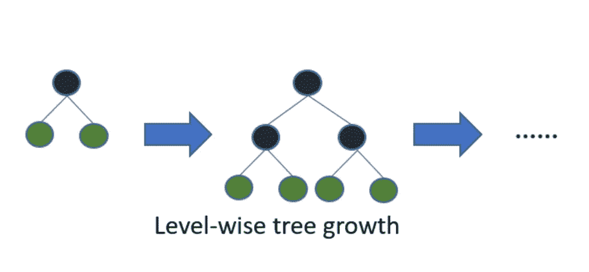

How other boosting algorithm works

还有许多其他算法，如支持向量机、神经网络等。但我们不会在这里接受。

对于我们的例子，我将使用 XGBoost、Random Forest 和 LightGBM。

# 模型训练和调整

培训模式:2018 年 1 月 21 日至 2018 年 1 月 26 日

测试型号:2018 年 1 月 27 日

我们将使用的指标是 AUC。我们得到的初始 AUC 值

1.  XGBoost: 0.5803
2.  LightGBM: 0.5807
3.  随机森林:0.5806

## 使用贝叶斯优化的超参数调整

在几乎所有实际情况下，都需要搜索机器学习模型的参数以获得最佳交叉验证性能，从而获得具有最佳泛化估计的模型。scikit-learn 中的一个标准方法是使用 GridSearchCV 类，它为每个要尝试的参数取一组值，并简单地枚举参数值的所有组合。随着新参数的增加，这种搜索的复杂性呈指数增长。一种更可扩展的方法是使用 RandomizedSearchCV，但是它没有利用搜索空间的结构。

Scikit-optimize 为 GridSearchCV 提供了一个替代方案，它利用贝叶斯优化，其中一个称为“代理”的预测模型用于对搜索空间建模，并用于尽快获得良好的参数值组合。

[贝叶斯优化](https://en.wikipedia.org/wiki/Bayesian_optimization)，一种基于模型的寻找函数最小值的方法，最近被应用于机器学习超参数调整，结果表明这种方法可以在测试集上实现更好的性能，同时比随机搜索需要更少的迭代。

在应用贝叶斯优化和交叉验证后，AUC 值:

1.  XGBoost: 0.5819
2.  LightGBM: 0.5819
3.  随机森林:0.5810

尽管改进并不显著，但贝叶斯优化器能够以更快的速度执行调优操作。

# 堆垛

**堆叠**是一种集成**学习**技术，通过元分类器或元回归器组合多个分类或回归模型。基于完整的训练集来训练基础级模型，然后在基础级模型的输出上训练元模型作为特征。

基础层通常由不同的学习算法组成，因此堆叠集成通常是异构的。在我们的例子中，我将组合 XGBoost 和 LGBoost 输出，并将使用投票分类器，这是 Scikit-learn 中提供的一个包。

如下图所示，叠加两个输出后，AUC 得分从 0.5819 提高到 0.5848。

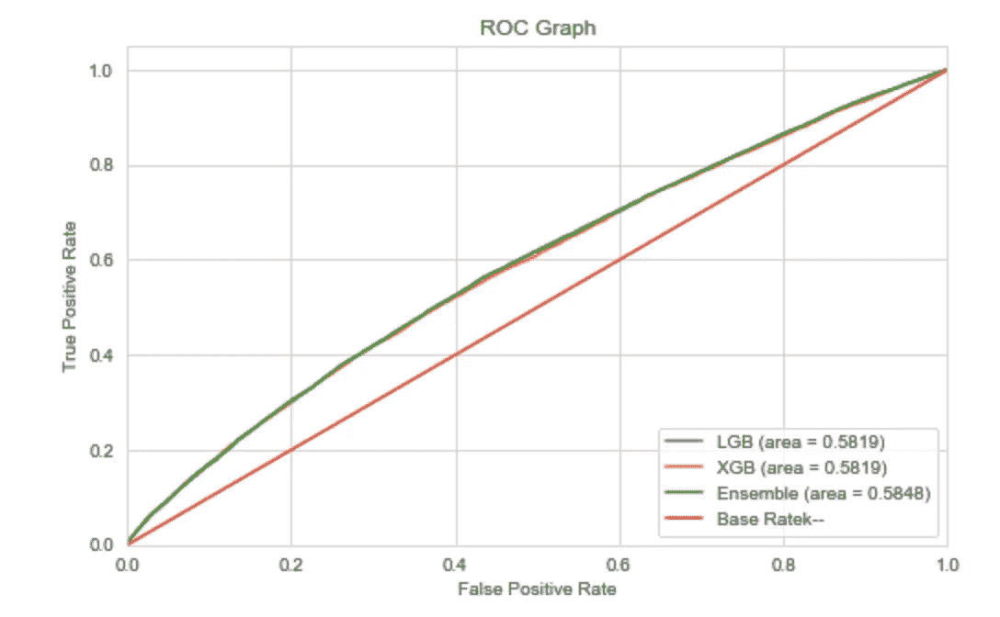

ROC Graph for XGB, LGB, and Stacking

# `Insights`

1.  如此低的 AUC 分数 0.5848 可能是由于我们在数据集中没有太多的特征，这使得算法很难正确地对目标变量进行分类。

# 待办事项:

1.  包含最后一列(class_id)以改善结果

如果你对代码感兴趣，你可以在这里找到我的笔记本。

# 参考

 [## 利用机器学习检测信用卡欺诈

### 用数据科学抓坏人

towardsdatascience.com](/detecting-credit-card-fraud-using-machine-learning-a3d83423d3b8)  [## 第五章:机器学习中的算法选择-数据科学入门

### 在本指南中，我们将向您展示如何在众多选项中选择最有效的机器学习算法…

elitedatascience.com](https://elitedatascience.com/algorithm-selection)  [## Python 中的自动机器学习超参数调整

### Python 中使用贝叶斯优化进行自动超参数调优的完整演练

towardsdatascience.com](/automated-machine-learning-hyperparameter-tuning-in-python-dfda59b72f8a)