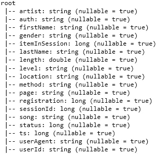
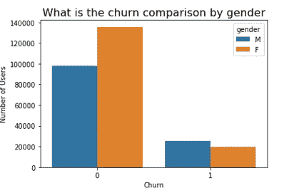
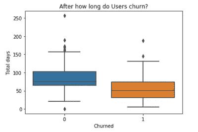
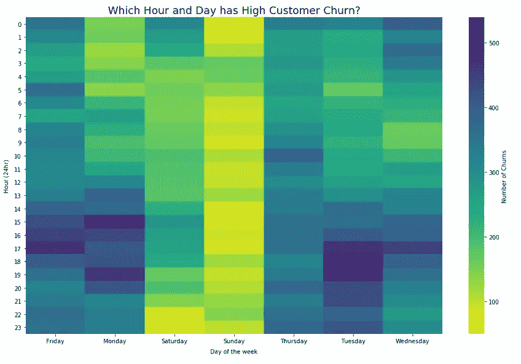
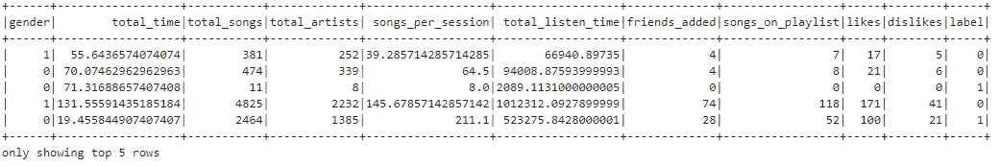
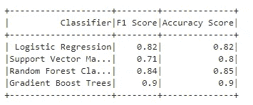

# 使用 PySpark 预测客户流失

> 原文：<https://towardsdatascience.com/predicting-customer-churn-using-pyspark-6a78a78a8412?source=collection_archive---------25----------------------->

## [数据探索](https://www.denotedata.co.ke/)，特征生成、建模和调整——使用 Spark。


Photo by [Kaboompics](https://www.pexels.com/@kaboompics?utm_content=attributionCopyText&utm_medium=referral&utm_source=pexels) from [Pexels](https://www.pexels.com/photo/customers-users-color-wheel-6231/?utm_content=attributionCopyText&utm_medium=referral&utm_source=pexels)

客户流失是当今商业世界的一个主要商业问题，数据科学家正在快速采用工具和技术来有效预测客户流失并实时避免客户流失。

Apache Spark，尤其是 PySpark，是执行探索性分析和机器学习来解决这一分类问题的最快工具之一。

在本文中，主要目标是探索用户活动数据集，并使用 Spark 建立一个预测用户流失的机器学习模型。

**喜欢你读的书吗？**关注我上[**LinkedIn**](https://www.linkedin.com/in/ephraimwaithaka/) 或 [**中**](https://medium.com/@ephraim.mwai)

> 点击获取数据服务产品

# **数据**

数据已经出来了。json 格式由别名为 Sparkify 的音乐公司的日志组成。这是用户与音乐平台交互时捕获的日志。

加载数据

```
path = “s3n://xxxxxxx-xxxx/sparkify/mini_sparkify_event_data.json”
df = spark.read.json(path)
```

数据架构:

```
df.printSchema()
```



# **探索性数据分析**

在本节中，我们将执行一些数据预处理，以回答一些业务问题。

删除任何空行或缺少 userId 的行

```
#Drop null rows
df = df.dropna(how = “any”, subset = [“userId”, “sessionId”,”ts”])#Drop rows with missing userId
df = df.filter(df["userId"] != "")
```

删除任何重复的行

```
df.select(“userId”).dropDuplicates()
```

添加流失标签

```
churn_indicator = udf(lambda c: 1 if c == 'Cancellation Confirmation' else 0, IntegerType())
df = df.withColumn('churn_indication', churn_indicator('page'))#Add churn columns to indicate users who have churned
windowval = Window.partitionBy('userId')
df = df.withColumn('churn', max('churn_indication').over(windowval))
```

那么我们的客户流失数据框架将会是:

```
df_churn = df.filter('churn == 1')
```

下一步，我们将回答以下业务问题:

性别对流失有影响吗？

```
#Group by users and gender to aggregate count of usersdf_churn_by_gender = df.select(["userId", "gender","churn"]).groupby(["churn", "gender"]).count().sort("churn").toPandas()#Plot a barplotsb.barplot(x='churn', y='count', hue='gender', data=df_churn_by_gender)
plt.title('What is the churn comparison by gender', fontsize= 16);
plt.xlabel('Churn');
plt.ylabel('Number of Users');
```



从上图可以看出，男性比女性有更多的麻烦，因为女性是这项服务的主要用户。

**用户流失多久？**

为了回答这个问题，我们添加了一个以天为单位的总时间列，并计算每个用户总天数的最大值。

```
df = df.withColumn('total_time_days', (df.ts-df.registration)/1000/3600/24)total_time_df = df.select('UserId','churn','total_time_days').groupBy('userId','churn').agg(max('total_time_days').alias('total_time')).toPandas()sb.boxplot(data=total_time_df, x='churn', y='total_time', orient='v');
plt.ylabel('Total days');
plt.xlabel('Churned');
plt.title('After how long do Users churn?');
```



大多数用户在使用音乐平台的第二个月就会流失

哪一天和哪一小时的客户流失率高？

我们从添加小时和工作日列开始。为了对上述问题有所了解，我们将汇总每天每小时的用户数量，然后以工作日为中心，如下图所示。

```
#Create an hour and weekday column
calc_hour = udf(lambda t: dt.datetime.fromtimestamp(t / 1000.0).hour)
df_churn = df_churn.withColumn(“ts_hour”, calc_hour(df.ts))calc_weekday = udf(lambda t: dt.datetime.fromtimestamp(t / 1000.0).strftime(“%A”))
df_churn = df_churn.withColumn(“ts_weekday”, calc_weekday(df.ts))df_churn_by_time = df_churn.select(['userId', 'ts_weekday','ts_hour','churn']).groupby(["userId","ts_weekday","ts_hour"]).agg(count(df.userId).alias('count'))#.toPandas()df_churn_by_hr_week = df_churn_by_time.groupBy('ts_hour').pivot('ts_weekday').sum('count').sort('ts_hour')df_churn_by_hr_week = df_churn_by_hr_week.withColumn('ts_hour',df_churn_by_hr_week.ts_hour.cast('int'))
df_churn_by_hr_week = df_churn_by_hr_week.toPandas().set_index('ts_hour').sort_index(axis=0,ascending=True)#Plot a Heat Mapplt.figure(figsize=(16,10))
sb.heatmap(df_churn_by_hr_week, fmt='d',  cmap='viridis_r', annot_kws={"size": 12},  cbar_kws={'label': 'Number of Churns'})
plt.title("Which Hour and Day has High Customer Churn?", y=1, fontsize=18)
plt.xlabel('Day of the week', labelpad=8)
plt.ylabel('Hour (24hr)', labelpad=8)
plt.yticks(rotation=360);
```



# **特色工程**

让我们开始构建一些有希望的特性，我们将使用它们来训练我们的模型

1.  性别特征。男性或女性

```
gender_ft = df.select("userId", "gender").dropDuplicates().replace(['M', 'F'], ['0', '1'], 'gender').select('userId', col('gender').cast('int'))
```

2.订阅级别—付费或免费

```
level_ft = df.select("userId", "level").dropDuplicates().replace(['free', 'paid'], ['0', '1'], 'level').select('userId', col('level').cast('int'))
```

3.用户在平台上的总时间(生命周期)

```
total_time_ft = df.select(‘UserId’,’total_time_days’).groupBy(‘userId’).agg(max(‘total_time_days’).alias(‘total_time’))
```

4.用户听过的歌曲总数

```
total_songs_ft = df.select(‘UserId’,’song’).groupBy(‘userId’).agg(count(‘UserId’).alias(‘total_songs’))
```

5.平台上每个用户会话的歌曲数量

```
songs_per_session_ft = df.filter(df.page=="NextSong").groupBy('UserId','sessionId').count().groupBy('userId').agg(avg('count').alias('songs_per_session'))
```

6.艺术家总数

```
total_artists_ft = df.filter(df.page==”NextSong”).select(‘UserId’,’artist’).dropDuplicates().groupBy(‘userId’).agg(count(‘UserId’).alias(‘total_artists’))
```

7.总收听时间

```
total_listening_ft = df.select(‘UserId’,’length’).groupBy(‘userId’).sum().withColumnRenamed(‘sum(length)’, ‘total_listen_time’)
```

基于页面导航日志的更多功能

8.添加的好友数量

```
friends_added_ft = df.filter(df.page==”Add Friend”).groupBy(‘userId’).agg(count(‘UserId’).alias(‘friends_added’))
```

9.帮助页面访问

```
help_ft = df.filter(df.page==”Help”).groupBy(‘UserId’).agg(count(‘UserId’).alias(‘help_access’))
```

10.添加到播放列表的歌曲数量

```
songs_playlist_ft = df.filter(df.page==”Add to Playlist”).groupBy(‘UserId’).agg(count(‘UserId’).alias(‘songs_on_playlist’))
```

11.赞数—竖起大拇指页面

```
likes_ft = df.filter(df.page==”Thumbs Up”).groupBy(‘UserId’).agg(count(‘UserId’).alias(‘likes’))
```

12.不喜欢的数量—拇指向下页面

```
dislikes_ft = df.filter(df.page==”Thumbs Down”).groupBy(‘UserId’).agg(count(‘UserId’).alias(‘dislikes’))
```

最后，

13.流失标签

```
churn_label_ft = df.select(‘UserId’, col(‘churn’).alias(‘label’)).dropDuplicates()
```

最后，我们将使用外部连接将我们的特性连接到一个数据帧中，清除一些空值并删除不必要的 UserId 列

```
#combine all datasources into a single data frame
feature_df = gender_ft.join(level_ft,’userID’,’outer’) \
 .join(total_time_ft,’userID’,’outer’) \
 .join(total_songs_ft,’userID’,’outer’) \
 .join(total_artists_ft,’userID’,’outer’) \
 .join(songs_per_session_ft,’userID’,’outer’) \
 .join(total_listening_ft,’userID’,’outer’) \
 .join(friends_added_ft,’userID’,’outer’) \
 .join(help_ft,’userID’,’outer’) \
 .join(songs_playlist_ft,’userID’,’outer’) \
 .join(likes_ft,’userID’,’outer’) \
 .join(dislikes_ft,’userID’,’outer’) \
 .join(churn_label_ft,’userID’,’outer’)#Drop unnecessary userid column and fill null valuesfeature_df = feature_df.drop(‘userID’).fillna(0)feature_df.show(5)
```



# **建模**

我们将首先使用 VestorAssembler(一种将多个列合并为一个向量列的要素转换器)和 StandardScaler(通过移除平均值并缩放至单位方差来标准化要素)对要素数据集进行矢量化和标准化

```
#Vectorize features
cols = [‘gender’, ‘level’, ‘total_time’, ‘total_songs’, ‘total_artists’, ‘songs_per_session’, ‘total_listen_time’, ‘friends_added’, ‘help_access’, ‘songs_on_playlist’, ‘likes’, ‘dislikes’]
assembler = VectorAssembler(inputCols=cols, outputCol=”vfeatures”)
data = assembler.transform(feature_df)# standardize features
scaler = StandardScaler(inputCol="vfeatures", outputCol="features", withStd=True)
scalerModel = scaler.fit(data)
data = scalerModel.transform(data)
```

将数据集分为训练、测试、验证和测试，如下所示:

```
# train test split
train, rest = data.randomSplit([0.6, 0.4], seed=42)
validation, test = rest.randomSplit([0.5, 0.5], seed=42)
```

下一步包括比较模型的性能并选择性能最佳的模型。我们将使用默认参数训练模型，并对最佳模型进行改进。最佳模型将用于扩展到更大的数据集。

1.  逻辑回归

```
#estimator
lr = LogisticRegression(maxIter=10)
#evaluator
mce_f1_evaluator = MulticlassClassificationEvaluator(metricName=’f1')# build an empty paramGrid for now
paramGrid = ParamGridBuilder().build()lr_cv = CrossValidator(estimator=lr,
 evaluator=mce_f1_evaluator, 
 estimatorParamMaps=paramGrid,
 numFolds=3)#Train the model
lr_cv_model = lr_cv.fit(train)
#fit the model
svm_results = svm_model.transform(validation)#Evaluate using f1 score
evaluator = MulticlassClassificationEvaluator(predictionCol = "prediction")
print('F1 Score:{}'.format(evaluator.evaluate(svm_results, {evaluator.metricName: "f1"})))
```

2.支持向量机

```
#estimator
svm = LinearSVC(maxIter=10)
#evluator
mce_f1_evaluator = MulticlassClassificationEvaluator(metricName=’f1')
# build an empty paramGrid for now
paramGrid = ParamGridBuilder().build()svm_cv = CrossValidator(estimator=svm,
 estimatorParamMaps=paramGrid,
 evaluator=mce_f1_evaluator,
 numFolds=3)#train
svm_model = svm_cv.fit(train)
#fit
svm_results = svm_model.transform(validation)
#evaluate
evaluator = MulticlassClassificationEvaluator(predictionCol = "prediction")
print('F1 Score:{}'.format(evaluator.evaluate(svm_results, {evaluator.metricName: "f1"})))
```

3.随机森林分类器

```
#classifier
rf = RandomForestClassifier()#evaluator
mce_f1_evaluator = MulticlassClassificationEvaluator(metricName=’f1')# build an empty paramGrid for now
paramGrid = ParamGridBuilder().build()rf_cv = CrossValidator(estimator=rf,
 estimatorParamMaps=paramGrid,
 evaluator=mce_f1_evaluator,
 numFolds=3)#train
rf_model = rf_cv.fit(train)#validate
rf_results = rf_model.transform(validation)#evaluate
evaluator = MulticlassClassificationEvaluator(predictionCol = "prediction")
print('F1 Score:{}'.format(evaluator.evaluate(rf_results, {evaluator.metricName: "f1"})))
```

4.梯度推进树

```
#classifier
gbt = GBTClassifier(maxIter=10,seed=42)#evaluator
mce_f1_evaluator = MulticlassClassificationEvaluator(metricName=’f1')# build an empty paramGrid for now
paramGrid = ParamGridBuilder().build()gbt_cv = CrossValidator(estimator=gbt,
 estimatorParamMaps=paramGrid,
 evaluator=mce_f1_evaluator,
 numFolds=3)#train
gbt_model = gbt_cv.fit(train)#validate
gbt_results = gb.model.transform(validation)#evaluate
evaluator = MulticlassClassificationEvaluator(predictionCol = "prediction")
print('F1 Score:{}'.format(evaluator.evaluate(gbt_results, {evaluator.metricName: "f1"})))
```

4 个分类器的结果如下:



Classifier Results

梯度提升树是迄今为止最好的评分模型，F1 得分为 0.9，准确度得分为 0.9，其次是随机森林分类器。我们还可以观察其他指标，比如模型训练所需的时间。可以说，我们希望提供最好的结果，因此基于准确性和 f1 分数，我们可以选择我们在这种情况下的最佳模型。

# **超参数调谐**

在这最后一部分，我们希望通过将**超参数**添加到梯度推进树和随机森林分类器模型来调整我们的 2 个最佳模型

**渐变提升树**

以下是默认参数

```
{'seed': 42, 'predictionCol': 'prediction', 'labelCol': 'label', 'featuresCol': 'features', 'maxDepth': 5, 'maxBins': 32, 'minInstancesPerNode': 1, 'minInfoGain': 0.0, 'maxMemoryInMB': 256, 'cacheNodeIds': False, 'checkpointInterval': 10, 'lossType': 'logistic', 'maxIter': 10, 'stepSize': 0.1, 'subsamplingRate': 1.0, 'featureSubsetStrategy': 'all'}
```

用参数建立模型

```
gbt = GBTClassifier(maxIter=10,seed=42)# build param Grid
paramGrid_gbt = ParamGridBuilder() \
    .addGrid(gbt.maxIter,[5, 10,15]) \
    .addGrid(gbt.maxDepth,[2,3,4,5,6,7,8]) \
    .build()
# set evaluator
mce_f1_evaluator = MulticlassClassificationEvaluator(metricName='f1')gbt_hpt_cv = CrossValidator(estimator=gbt,
                          estimatorParamMaps=paramGrid_gbt,
                          evaluator=mce_f1_evaluator,
                          numFolds=3)gbt_hpt_model = gbt_hpt_cv.fit(train)#Test the model using test data
gbt_model_results = gbt_hpt_model.transform(test)
```

**随机森林分类器**

```
#Default parameters
{'probabilityCol': 'probability', 'rawPredictionCol': 'rawPrediction', 'seed': -5387697053847413545, 'predictionCol': 'prediction', 'labelCol': 'label', 'featuresCol': 'features', 'maxDepth': 5, 'maxBins': 32, 'minInstancesPerNode': 1, 'minInfoGain': 0.0, 'maxMemoryInMB': 256, 'cacheNodeIds': False, 'checkpointInterval': 10, 'impurity': 'gini', 'numTrees': 20, 'featureSubsetStrategy': 'auto', 'subsamplingRate': 1.0}
```

用参数建立模型

```
#classifier
rf = RandomForestClassifier()#evaluator
mce_f1_evaluator = MulticlassClassificationEvaluator(metricName=’f1')# build an empty paramGrid for now
paramGrid = ParamGridBuilder() \
 .addGrid(rf.impurity,[‘entropy’, ‘gini’]) \
 .addGrid(rf.maxDepth,[2,3,4,5,6,7,8]) \
 .build()rf_cv = CrossValidator(estimator=rf,
 estimatorParamMaps=paramGrid,
 evaluator=mce_f1_evaluator,
 numFolds=3)
#train model
rf_model = rf_cv.fit(train)
#Test using test data set
rf_model_results = rf_model.transform(test)
```

在测试数据上测试两个调整的模型之后，随机森林分类器具有体面的 **0.85 准确度分数**和 **0.84 f1 分数。**

梯度提升以 0.78 的准确度分数**和 0.78 的 f1 分数**位居第二

**与梯度相比，随机森林分类器**在参数调整后的测试数据集上得分最高。当把时间作为一个衡量标准时，训练也需要更少的时间。因此，在 4 种算法中，随机森林是最健壮的

# **结论**

我首先加载数据，删除丢失的值，删除重复的行，为数据探索创建额外的列，并使用可视化工具回答了一些业务问题。然后开始研究特征生成和建模。该项目的最有趣和最困难的部分是 spark ML 的实现，使用 PySpark 预处理和特征工程数据；考虑到这是第一次使用这个工具。能够在云上部署 ML 解决方案(在本例中是 AWS EMR 服务)是一个很好的技能补充。

# 改进

另一个具有挑战性的部分是特征生成。虽然我只能想出 12 个功能，但他们有可能创造更多。因此，有了更大的数据集和更多的特征，该模型在预测客户流失方面会更加准确和稳健

该模型也可以作为 API 部署，在业务环境中使用。

更多细节请查看我的 [Github 库](https://github.com/ephraimmwai/Capstone-Project-Predicting-Churn-Rates)