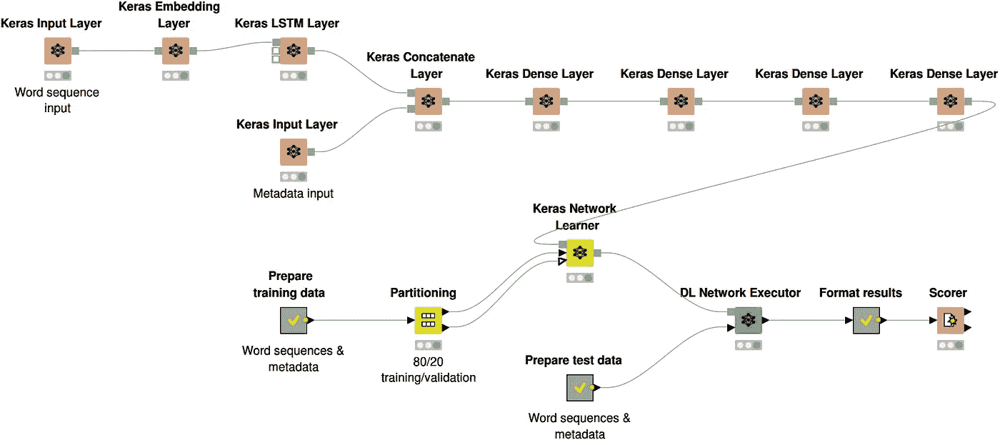
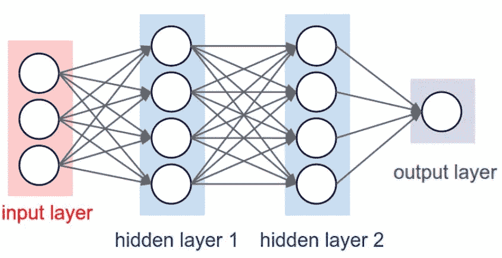
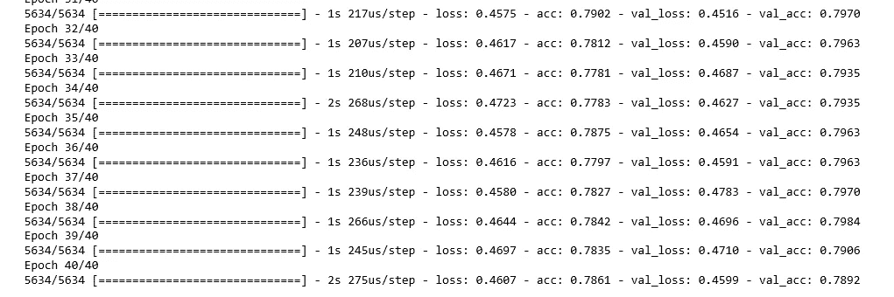
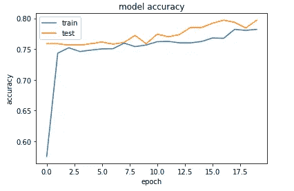

# Keras 中用神经网络预测客户流失

> 原文：<https://towardsdatascience.com/predicting-customer-churn-with-neural-networks-in-keras-f904c7113fcd?source=collection_archive---------12----------------------->



# 为什么要预测客户流失？

这对于任何地方的组织都是一个大问题，也是我们看到机器学习高采用率的主要领域之一，这可能是因为我们正在**预测客户行为**。

“流失”一词用于描述客户停止使用某个组织的服务。对于订阅服务来说，这是一个非常强大的 KPI，订阅服务的大部分收入来自重复支付(通常是每月支付)。

# 深度学习用例—网飞

网飞是订阅公司的一个很好的例子，他们也是一个接近技术前沿的组织。网飞使用**深度学习技术**来预测客户是否会在实际离开之前离开，这意味着他们可以采取预防措施来确保他们留下来。

## 他们是怎么做到的？

不用深入兔子洞，开始吧…

网飞收集了很多关于个人的数据，你看了什么，你什么时候看的，你喜欢和不喜欢的一切等等。他们可以将这些数据与**深度学习**分类技术结合使用，计算出他们认为客户何时会离开。简单的解释可能是这样的“如果一个客户 N 天没看任何东西，那么他们很快就会流失”。

使用神经网络分析所有收集到的数据将使组织能够根据他们现有的数据建立他们客户的档案。一旦一群用户被分类，网飞可以决定采取什么行动，如果一个客户是一个可疑的流失。例如，他们可以了解他们想要留住哪些客户，并为这些人提供折扣和促销，然后还可以确定哪些客户是“注定失败的”，可以让他们离开。

# 所以，这个实验…

IBM 电信数据集已经在互联网上流传了一年多，所以我想现在是尝试使用它来预测客户流失的好时机。

我需要从别处借用一些代码。我直接从[这篇博文](https://medium.com/gdgsrilanka/customer-churn-prediction-with-keras-and-pandas-267f9ce0c950)中摘录了数据准备代码。这让我可以花更多的时间调整模型，并(试图)获得更高的精确度。

# 导入必要的库

这是非常简单的，它几乎是一个直接的复制/粘贴到您自己的笔记本上的工作。在网上搜索时，我发现一大堆人在分发导入了错误库的代码。这里要注意的主要事情是我导入 Keras 模块的第二个块。

很多帖子(我假设都来自同一个帖子)混淆了导入 **Keras** 库和 **TensorFlow** 库。一个好的经验法则是确保你是:

*   只进口 Keras 的东西:他们会从“Keras”开始。例如，从 keras.models 导入…
*   仅导入 TensorFlow Keras 库，这些库以 TensorFlow.Keras 开头，例如来自 TensorFlow。Keras.models 导入…

```
import numpy as np 
import pandas as pd 
from matplotlib import pyplot as plt 
from sklearn.model_selection import train_test_split 
import keras 
from keras.models import Sequential 
from keras.layers import InputLayer 
from keras.layers import Dense 
from keras.layers import Dropout 
from keras.constraints import maxnorm
```

读取 pandas 数据框架中的测试数据(通过单击顶部的 IBM 数据集链接来获取 CSV)。

```
data = pd.read_csv('churn.csv')
```

# 数据预处理

一旦我们在 Pandas DF 中有了数据，我们就可以使用窃取的预处理代码将数据转换成针对神经网络优化的格式。本质上，我们正在做以下事情:

*   将分类变量转换为数值变量(例如，是/否转换为 0/1)。
*   正确设置列格式，使它们都是数字格式
*   填充任何空值。

```
data.SeniorCitizen.replace([0, 1], ["No", "Yes"], inplace= True) data.TotalCharges.replace([" "], ["0"], inplace= True) data.TotalCharges = data.TotalCharges.astype(float) data.drop("customerID", axis= 1, inplace= True) data.Churn.replace(["Yes", "No"], [1, 0], inplace= True)
```

一旦我们有了一个干净的数据集，我们就可以使用 pandas [get_dummies](https://pandas.pydata.org/pandas-docs/stable/reference/api/pandas.get_dummies.html) 功能将所有分类列替换为‘dummy’数字‘indicator’列。类似于上面的代码所做的，但是这将去掉整个数据集。

```
data = pd.get_dummies(data)
```

# 拆分数据

像任何模型一样，我们应该将数据分成训练和验证(或测试集)。

首先我们把数据集分成 X 和 y。

*   x 包含了我们用来做预测的所有变量。
*   y 只包含结果(无论客户是否翻炒)。

```
X = data.drop("Churn", axis= 1) y = data.Churn
```

接下来，我们使用标准的 [train_test_split](https://scikit-learn.org/stable/modules/generated/sklearn.model_selection.train_test_split.html) 将数据分成训练和测试(验证)集。

```
X_train, X_test, y_train, y_test = train_test_split(X, y, test_size= 0.2, random_state= 1234)
```

现在我们已经准备好数据集，让我们建立一个模型。

# 构建模型

Keras 的一个伟大之处在于，我们可以非常简单地建立一个基于层的神经网络。看起来有点像这个图。



首先，我们告诉 Keras 我们想要使用什么类型的模型。大多数情况下，你会使用序列模型。

```
model = Sequential()
```

接下来让我们首先构建输入层。图中的红色层。这里有几点需要注意。

我们在整个神经网络中使用密集层，我不会深入不同层和神经网络之间的差异，但大多数时候你会使用密集层或 LSTM 层。点击此处了解更多信息。

第一个数字— 16 是节点(或上图中的圆圈)的数量。我们从 16 开始，以后我们可以改变它，看看它如何影响我们的精度。

设置 *input_dim* 参数很重要，它必须与 X_train 数据集中的列数相匹配。我们可以简单地计算数据集中的列数，然后像我下面所做的那样键入它——但实际上，您会希望使用 X_train.shape[1]来自动计算值。

激活函数——你真的应该在某个时候仔细阅读这些——我可能会专门就这些写另一篇文章，但目前只知道我们的层都使用“Relu ”,除了输出层(我们将在后面讨论)。作为一般的经验法则*——“如果你不确定，使用 relu”*

```
model.add(Dense(16, input_dim=46, activation='relu', kernel_constraint=maxnorm(3)))
```

我们增加了一个辍学层。dropout 层确保我们在每次迭代神经网络时删除设定百分比(在本例中为 0.2%或 20%)的数据。这是可选的，但值得包含在您的代码中，以防止它过度适应。你可以改变不同的辍学率来进行实验，以获得更高的精确度。

```
model.add(Dropout(rate=0.2))
```

现在，我们添加了所谓的隐藏层，我们可以拥有尽可能多的隐藏层，但值得考虑的是，使具有大量隐藏层的神经网络工作所需的额外计算能力。

注意到“内核约束”参数了吗？这涉及使“下降”层有效工作所需的权重的缩放。文档中还有更多的信息，但我想你需要知道的是，从本质上讲，神经网络会自动试错数据集中变量的所有不同权重(这就是为什么我们首先使用神经网络)，kernel_constraint 参数增加了对这一过程的控制。

```
model.add(Dense(8, activation='relu', kernel_constraint=maxnorm(3)))
```

添加另一个脱落层，以避免过度拟合。

```
model.add(Dropout(rate=0.2))
```

最后，我们添加一个输出层:这定义了神经网络的最终输出。这里有几件事你需要记住:

*   我们的第一个参数是数字 1。这是因为我们的 NN 的 out 是一个包含指示符的列，该指示符将指定我们的客户是否会流失。
*   激活功能不同。对于单个(是/否)分类模型，我们使用“sigmoid ”,有许多不同的功能可用，例如，如果我们正在构建一个对多个结果进行分类的网络(例如将客户分组到特定的组),我们可以使用“softmax”激活功能。

```
model.add(Dense(1, activation='sigmoid'))
```

现在我已经描述了每一个单独的层，我将展示挤在一起的整体。

```
model = Sequential() 
model.add(Dense(16, input_dim=46, activation='relu', kernel_constraint=maxnorm(3)))
model.add(Dropout(rate=0.2)) 
model.add(Dense(8, activation='relu', kernel_constraint=maxnorm(3))) model.add(Dropout(rate=0.2)) model.add(Dense(1, activation='sigmoid'))
```

# 编译模型

接下来，我们编译我们的模型(把它们粘在一起，告诉它应该如何工作)。

我们使用编译方法来实现这一点。它需要三个参数:

*   优化器。这可能是现有优化器的字符串标识符(我们使用“Adam”)，可以使用这些标识符，看看哪个是最好的，您也可以将其拆分出来，并手动调整学习速率以受益于更高的准确性，但我们将使用默认值。参见:[优化师](https://keras.io/optimizers)。
*   损失函数。这是模型试图最小化的目标。由于这是一个单一的分类问题，我们将使用“二元交叉熵”。参见:[损失](https://keras.io/losses)。
*   指标列表。对于任何分类问题，我们都将其设置为“准确性”。

```
model.compile(loss = "binary_crossentropy", optimizer = 'adam', metrics=['accuracy'])
```

# 拟合模型

快速拟合模型，请注意，我们在这里将测试和验证数据集都拟合到了我们的模型中，这样 Keras 将立即告诉我们在这两个数据集上的表现。

这里我们需要注意几个论点。

*   Epochs =这是我们在神经网络中来回移动的次数——更多的 Epochs 意味着更高的准确性，但也意味着更多的处理时间，而且太多的 epochs 会导致过度拟合。您可以随时对此进行调整，所以尝试一些不同的值，看看结果会发生什么变化。
*   batch_size =这是一次通过神经网络的记录批数。批量越小，精确度越低，但速度越快。同样，您可以通过在代码中直接更改这个数字来进行试验。

```
history = model.fit(X_train, y_train, validation_data=(X_test, y_test), epochs=40, batch_size=10)
```

# 模型评分

一旦我们运行上面的代码，我们将得到模型执行情况的指示——您将看到它在各个时期运行，并为训练(acc)和测试(val_acc)集提供准确性分数。



一旦它完成了它的任务，剩下要做的就是观想结果。

```
plt.plot(history.history['acc']) plt.plot(history.history['val_acc']) 
plt.title('model accuracy') plt.ylabel('accuracy') plt.xlabel('epoch') plt.legend(['train', 'test'], loc='upper left') plt.show()
```



我们需要做的最后一件事是保存模型，这样我们就可以在以后将它部署到生产环境中——AWS SageMaker/Azure/Google 都有不同的方法来做到这一点，但是通常你需要一个 JSON 和一个权重文件。

```
# serialize model to JSON 
model_json = model.to_json() with open("model.json", "w") as json_file: json_file.write(model_json) # serialize weights to HDF5 model.save_weights("model.h5") print("Saved model to disk")
```

所以我们有它。一个神经网络产生了大约 79%的客户流失准确率。当然，我们可以花更多的时间研究学习率、激活函数、节点数量、时期数量等，以使其更加准确，但希望这是开始研究的坚实基础。

接下来，我将研究如何将这些代码部署到生产环境中——这变得很棘手。

*原载于 2019 年 5 月 27 日*[*【http://drunkendatascience.com*](http://drunkendatascience.com/predicting-customer-churn-with-neural-networks-in-keras/)*。*