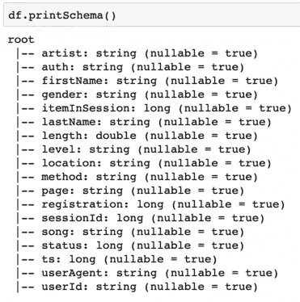
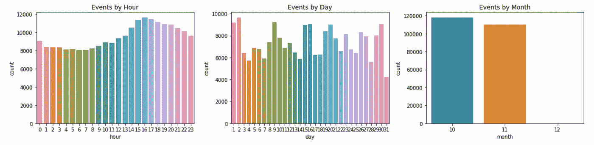
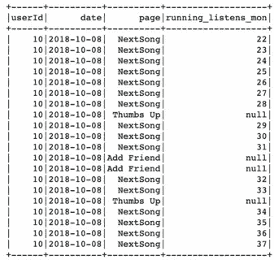
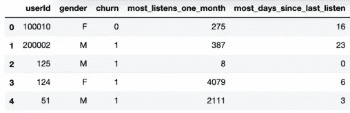
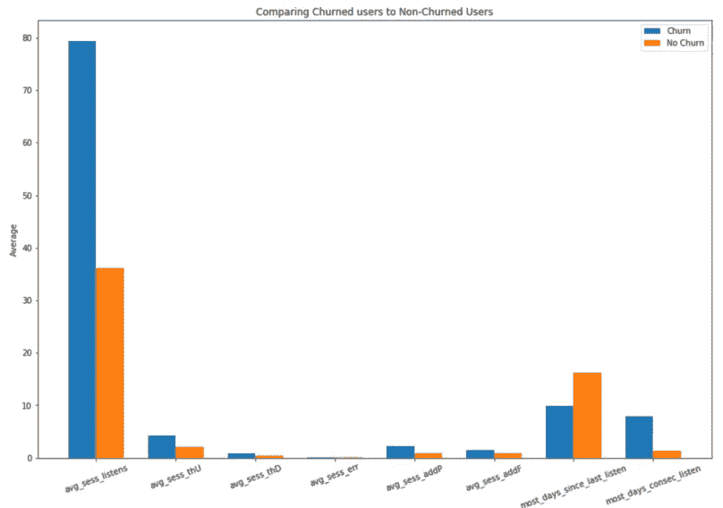
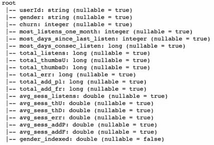
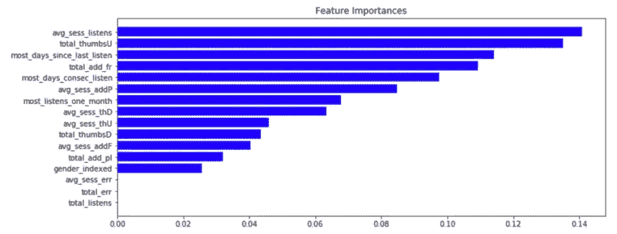
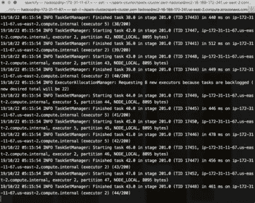

# PySpark & AWS |预测客户流失

> 原文：<https://towardsdatascience.com/predicting-customer-churn-with-pyspark-95cd352d393?source=collection_archive---------27----------------------->

你怎么称呼一群分散的恐龙繁殖岛？

*侏罗纪火花...*Ba Dum Tss**

O 对于采用订阅式商业模式的公司来说，最重要的问题之一是客户流失。客户因为各种原因降级或停止服务，服务提供商通常直到客户离开才知道他们何时或为什么离开！

> 如果公司能够在客户离开之前预测到他们何时会流失，会怎么样？

这将是强大的！如果我们能够可靠地预测客户是否会流失，我们就有机会通过促销、宣传新功能等方式留住这些客户。这是一种**主动的**方法来留住客户，而不是一种**被动的**方法来挽回失去的客户。

Udacity 提供了两个类似格式的用户活动数据集(128MB 和 12GB)，来自一家虚构的音乐流媒体公司 Sparkify，我使用这些数据来更好地了解 Sparkify 的客户，然后预测客户是否会流失，准确率超过 80%。

***我无法在本地对我的机器上的 12GB 数据集进行分析和建模，所以我在 Jupyter 笔记本中使用 ***PySpark 的本地模式*** 在 128MB 数据集上探索并原型化了我的工作流，这让您 ***模拟在一台机器上的分布式集群上工作的*** 。***

然后，我把工作流变成了一个 ***Python 脚本*** ，旋出了一个 ***4 节点 AWS EC2 集群*** ，在集群上通过 ***AWS EMR*** 执行脚本。

以下是我在这篇文章中将要涉及的内容:

1.  特征工程&在本地探索数据
2.  本地数据预处理
3.  本地机器学习
4.  在 AWS 分布式集群上运行步骤 1–3

**这篇文章是写给谁的？**

本文旨在向您介绍我所采取的步骤和一些有用的代码，这些步骤和代码带我从一个小型 Jupyter 笔记本分析到一个 4 节点 AWS EMR 集群上的 12GB 数据集分析。所以，我假设你对****Python***&***机器学习*** 。*

*此外，在这篇文章中，我展示了许多我使用***【py spark】***的代码片段，这些代码片段与通过 ***Pandas*** 和 ***Scikit-Learn*** 库处理数据的*非常不同。如果你不熟悉 PySpark，那就略读一下吧！没什么大不了的。**

**最后，如果你想对分析和机器学习如何通过我的代码进行更详细的分析和演练，请查看我的完整 [Jupyter 笔记本](http://patrickdeguzman.me/notebooks/SparkifyAnalysis.html)(托管在我的[网站](http://patrickdeguzman.me/))或 [GitHub Repo](https://github.com/pdeguzman96/sparkify) 。**

**我希望你喜欢这个！**

> **现在让我们开始吧…**

# **一、特征工程&探索数据**

**首先，我将 128MB 的数据集从 JSON 格式转换成 Spark 数据帧。以下是模式，以便您了解数据的结构:**

****

**Original imported features.**

****日期特性工程|** 经过一些简单的探索，我使用“ts”(时间戳)属性通过 PySpark UDF(用户定义函数)创建了一些日期特性。**

**我为新的日期特性创建了一个计数图，以便更好地理解用户在整个数据集期间的行为。**

****

**Note this smaller dataset (128MB) only contains data for about two months.**

**事件特性工程| 我使用了“页面”特性来标记用户访问的特定页面或执行的特定操作。这些标志特性将在以后帮助我在用户级别而不是事件级别聚合用户活动。**

**This is identical to one-hot encoding based on this feature. In hindsight, this would have been faster with PySpark’s native OneHotEncoder. Oh well! It works.**

****运行计数特征工程|** 我还利用了数据的事务性质(例如，某个用户在某个时间点执行的每个事件对应一行)来创建一些窗口计算特征(例如，一个月内的运行收听计数等)。)这里有一个例子，说明这样的功能是如何创建的。**

**Creating a window for each user per month, counting rows whenever a user listens, and joining back to DF.**

**这将创建一个类似于图中第四列的列:**

****

**Last Column: Note the null values**

**由于这是一个连续计数，空值*应该在前面填充*。然而，鉴于 Spark 的弹性分布式数据集(rdd)的分布式本质，没有前置填充空值的原生函数。为了解释，如果一个数据集在云中的几个机器之间随机分区，那么机器如何知道前一个值何时是数据集中的*真*直接前一个值？**

**我最好的解决方法是创建一个 running listens 列的 lag，然后用这个 lag 迭代地替换空值。*连续的*空值需要多次执行这种练习，因为我们实际上是用先前的值替换当前的空值(对于连续的空值，先前的值为空)。我是这样实现的:**

**Sharing this snippet in case anyone finds it useful. This is the only way I found to front-fill null values that was computationally cheaper than using a complicated cross-join.**

**上面的代码片段用其先前的值填充空值 6 次，然后用 0 填充剩余的值以节省计算时间。这可能不是前置填充的最佳方式，但如果要用相对较少的空值填充大型数据集，这可能会很有用。这是可行的，因为该操作需要 Spark 连接分区来计算 lag(即紧接在前面的值)。**

****定义流失|** 最后，我将客户流失定义为每当用户访问“取消确认”或“降级”页面时。**

**This labels the “Churn” column of the DataFrame as 1 if a user visits the aforementioned pages.**

# **二。数据预处理**

**现在让我们退一步，想想我们拥有什么，我们想要实现什么。**

*****我们所拥有的:*** 一个“事件”数据集，指定用户在给定的时间点执行什么活动。**

*****我们想要的:*** 预测客户流失。**

**凭直觉，我不认为在我们现有的数据集中预测变动是一个好主意。基于用户事件进行训练和预测将是非常昂贵的**，这可能是非常非常昂贵的*因为你每小时可以有数千个事件(或者更多！)*****

***因此，我的方法是简单地汇总每个用户的数据。具体来说:***

> ****我使用了* **、事件级数据** *到* *来创建* *一个基于* **指标的用户级矩阵** *，它本质上是在一个矩阵中总结每个用户的活动，该矩阵的行数与唯一用户的行数一样多*。***

***这可能无法从文本中很好地翻译出来，所以让我给你看看我是怎么做的。下面是一个代码聚合示例，用于查看每个用户执行的全部活动:***

***这种类型的聚合帮助我创建一个整洁的数据框架和可视化，如下所示…***

******

***Truncated DF | One row per user with user-specific summary statistics.***

******

***Using the summary statistics to compare our churned users vs. our non-churned users.***

***有趣的是，看起来我们被激怒的用户比我们没有被激怒的用户更活跃。***

***现在我有了一个很好的、紧密的矩阵中的数据，我用它作为机器学习模型的基础。***

# ***三。机器学习***

***我的建模方法简单明了:尝试一些算法，选择一个看起来最有希望的，然后调整这个模型的超参数。***

***这里有一个用户矩阵的模式，这样您就知道正在建模什么了:***

******

***One user and several metrics/aggregations for this user per row.***

***PySpark ML 要求数据采用非常特殊的数据帧格式。它需要它的 ***特征*** 在一个 ***列的向量*** 中，其中向量的每个元素代表它的每个特征的值。它还要求其 ***标签*** 在其 ***自有列*** 中。***

**下面的代码将原始矩阵转换成这种 ML 友好的格式，并标准化这些值，使它们具有相同的比例。**

**现在我们已经准备好了数据，下面的代码显示了我最初是如何评估模型的。我任意选择了逻辑回归、随机森林和梯度提升树作为最终流失模型的候选。**

**在初始模型评估后，我发现 gbt 分类器(梯度增强树)表现最好，准确率为 79.1%，F-1 得分为 0.799。**

**因此，我使用 PySpark 的原生 CrossValidator 和 ParamGridBuilder 将该模型调优为网格搜索，网格搜索使用 K-Fold 验证选择最佳超参数。这里，由于计算时间昂贵，我使用了超参数的小网格和 3 重验证。**

**经过调优后，重新评估模型，准确率和 F-1 分别提高到 82.35%和 0.831！最佳模型的最大深度为 3，最大箱数为 16。如果在我的笔记本电脑上运行不需要这么长时间(大约需要 1 个小时)，我会尝试更广泛的网格搜索。**

**PySpark 自动计算这些基于树的模型的特征重要性。**

***注意:出于好奇，* [*下面是*](https://explained.ai/rf-importance/) *一篇有趣的文章，解释了特征重要性是如何计算的，以及* ***为什么它实际上不是那么准确*** *。这真的不在这个项目的范围内，所以我只是敷衍一下。***

****

**Feature Importances calculated for the tuned GBTClassifier.**

**看来前三个 ***预测流失最重要的特征*** 是:**

*   **每次会话的平均歌曲播放次数**
*   **总赞数**
*   **最连续几天不播放歌曲**

**看起来，与错误和歌曲播放总量相关的指标与预测客户流失完全无关。**

# **四。AWS 集群部署**

**到目前为止，我一直在描述我在笔记本电脑上使用 Spark 的本地模式对小型 128MB 数据集执行的分析。**

**为了对 12GB 的数据集进行同样的分析，我需要更多的处理能力。这就是 AWS 弹性地图简化(EMR)和弹性云计算(EC2)的用武之地。**

***注意:EC2 可以让你在云中的机器上工作。EMR 用于轻松管理已经安装了 Spark 的 EC2 集群*。**

**在设置好 EMR 并通过我的终端访问 AWS 之后，我将我的脚本上传到我的集群的 Hadoop 分布式文件系统(HDFS)，从 Udacity 的 S3 存储桶加载包含 12GB 数据集的数据，并从我的终端在主节点上运行该脚本。**

***注意:* [*这里是我用来设置 EMR 的*](https://www.perfectlyrandom.org/2018/08/11/setup-spark-cluster-on-aws-emr/) *和* [*这里是我用来设置我在终端上访问 AWS 的*](https://docs.aws.amazon.com/cli/latest/userguide/cli-chap-install.html#install-bundle-other-os) *。***

****

**Don’t even try to read this. Just FYI: this is what it looks like when you run a Spark app through EMR from your CLI/terminal.**

**这个脚本需要很长时间才能完成(我在 4 台机器上花了大约 5 个小时)。为了不浪费所有这些辛苦的工作，我在脚本的最后保存了模型和预处理过的用户矩阵。**

**如果您感到好奇，在完整的 12GB 数据集上运行此分析和工作流会产生非常高的准确性和 F-1 分数！**

****

**This was a HUGE improvement from the model trained on 128MB dataset.**

# **动词 （verb 的缩写）总结**

**更多的功能可以从用户活动中设计出来，比如每天/每周/每月的竖起大拇指数，竖起大拇指与不竖起大拇指的比率，等等。特征工程可以比简单地优化一种算法更好地改善结果。**

**因此，可以做进一步的工作，从我们的交易用户数据中提取更多的特征来改进我们的预测！**

**一旦一个模型被创建，也许它可以被部署到生产中，并且每隔 x 天或 x 小时运行一次。一旦我们预测到用户可能会流失，我们就有机会进行干预！**

**为了评估这个假设部署的模型做得有多好，我们可以运行一些概念验证分析，并且在给定的测试期间不干预它的预测。如果它预测的用户将以比普通用户更高的速度流失，这可以表明我们的模型工作正常！**

# **不及物动词总结想法**

**学习 PySpark 和 AWS 好像是一场噩梦(我从这次经历中知道)。然而，如果你已经熟悉 Python 和机器学习，你不需要知道太多的*来开始使用 PySpark 和 AWS。***

**你知道如何处理数据。你知道机器学习是如何工作的。战斗的另一半是知道如何在 PySpark 和 AWS 集群上执行这些相同的任务，这可以通过 Google 搜索和教程找到！我建议慢慢浏览我的(或其他人的) [Jupyter 笔记本](http://patrickdeguzman.me/notebooks/SparkifyAnalysis.html)以便你对 PySpark 有所了解，然后查找如何在 AWS EMR 上运行 Spark 应用程序。**

**这看起来工作量很大，但是我根本不可能用笔记本电脑处理 12GB 的数据集。每天都有令人难以置信的大量数据被创建，如果你想处理这么多数据，Spark 是一个很好的学习工具！**