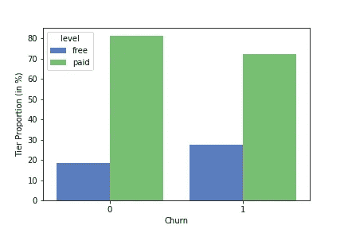
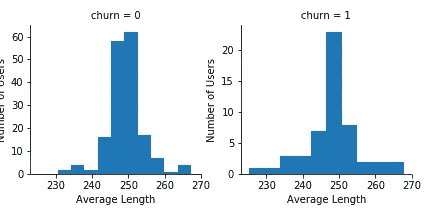
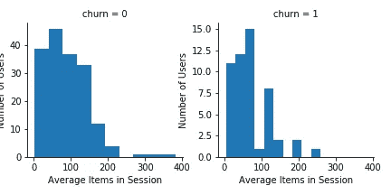

# 用 Spark 预测客户流失

> 原文：<https://towardsdatascience.com/predicting-customer-churn-with-spark-4d093907b2dc?source=collection_archive---------16----------------------->

对于许多公司来说，客户流失是一个主要问题。一些人停止使用这项服务是很自然的，但如果这个比例变得太大，就会阻碍增长，不管收入来源如何(广告销售、订阅或两者兼而有之)。考虑到这一点，企业通过识别处于风险中的客户来预测客户流失的能力至关重要，因为这使他们能够采取某些行动，如个性化的优惠或折扣，以尝试和减少客户的流失。基于历史数据建立的机器学习模型可以让我们洞察客户流失的信号，并帮助我们在它发生之前预测它。

对于这个例子，我们使用一个虚构的音乐应用公司 Sparkify 的日志数据。这是一个玩具数据集，相对较小，因此可以由一台计算机处理。尽管如此，为了模拟真实世界，我们使用 Spark(在本地模式下)来处理数据和构建模型。Spark 是大数据处理和建模的领先解决方案之一，通过 DAG 的内存处理和计算延迟评估来提高速度。你可以点击[这里](https://spark.apache.org/)了解更多。通过在这个项目中使用 Spark，尽管这不是绝对必要的，但我们建立了一个可扩展的框架来分析任何大小的数据的变动，因为代码和分析可以很容易地扩展，只要它们部署在能够处理所需计算的集群(如 AWS、IBM Cloud 或 GCP)上。

在这篇博文中，我将总结包含在[这个 GitHub 库](https://github.com/celestinhermez/sparkify_customer_churn)中的分析。在简要概述手头的数据后，我们将介绍该模型、其结果以及它对 Sparkify 的意义。

**数据**

在本地模式下启动 Spark 会话后，我们可以加载数据集。它包含 2018 年 10 月 1 日至 2018 年 12 月 3 日之间 226 个不同用户的信息。它是 JSON 格式的(关于 JSON 格式的更多信息[在这里](https://www.json.org/))，可以很容易地用以下命令加载:

```
path = “mini_sparkify_event_data.json”df = spark.read.json(path)
```

这些数据捕捉了各种各样的行为，如听歌、竖起大拇指、点击主页、更改帐户设置或向播放列表添加歌曲。因此，尽管它是一个很小的用户子集，但数据集仍然包括 278，251 行。

在数据集中出现的 226 名用户中，有 52 名用户最终出现了混乱。为了正确地训练和评估我们的模型，我们解决了这种不均衡，以确保我们的预测可以准确地预测这两个类别，而不是过度倾向于预测不存在流失。我们通过一种称为上采样的技术来做到这一点，即从搅动的用户群体中进行替换采样，直到我们得到两个大小相当的群体。

**型号**

为了构建这个模型的功能，我让数据探索决定了我的方法，以及我在一家非常相似的(真实的)音乐应用公司工作时获得的领域知识。特别是，我在寻找那些在翻炒用户和不翻炒用户之间价值差异很大的特性。寻找这样的功能突出了帐户类型(免费与付费)以及其他帐户相关信息的重要性，如状态和注册日期，让我们对用户有所了解。



Users who churned are more likely to have a free account

另一组特性集中在人们在平台上的行为。这些元素，如会话长度、每次会话的歌曲数量以及拇指向上/拇指向下、添加到播放列表或添加朋友，为我们提供了额外的洞察力。建模之前的直观解释是，这些特征捕捉到了与用户参与度相关的潜在变量，较低的参与度与较高的搅动可能性相关联。例如，停止搅动的用户每月来平台 9 次，而留下来的用户每月来 14 次。我们将在后面看到这种前概念是否被数据所证实。



The distribution in terms of session length and number of items in session differs between both groups

那些对创建这些特性的技术细节感兴趣的人可以参考介绍中链接的代码，但是由于 Spark 的管道，我们可以高效地处理所有这些特性，并将其转换为适合分析的形式。您可以在下面看到数据集的前几行及其所有功能。


First few rows of features dataset

检查这些特性的分布，我们可以看到 itemInSession、thumbsUp、addFriend 和 addToPlaylist 非常分散地分布在平均值周围。这一点很重要，因为模型依赖于可变性来学习和做出预测。另一方面，每日会话或长度等特征的变化较小，因此我预计这些特征在预测中的权重较小。

完成后，我们测试三种不同的分类模型(随机森林、逻辑回归和梯度推进),并评估它们在测试集上的准确性和 F1 得分。考虑这两者是很重要的(不仅仅是准确性)，因为后一个度量允许我们调整测试集中存在的类不平衡，并且通过扩展，在真实世界中也是如此。由于三个模型之间的结果没有显著差异，我们选择进一步调整逻辑回归模型，因为它具有更好的可解释性。我们通过交叉验证，利用网格搜索算法找到最佳的参数组合。特别是，我们测试了以下值:

*   minInfoGain(在树节点处被考虑的分割的最小信息增益):0，1
*   maxDepth(树的最大深度):5，10
*   numTrees(树的数量):20，50

我特别选择了这些参数，因为它们与防止过度拟合有关。

**结果**

优化后，最优超参数是 50 棵树，0 最小信息增益和最大深度 10。我们有一个模型，在测试集上达到 73%的准确率，F1 值为 0.72。这两个指标合在一起非常令人鼓舞:只有关于 191 个用户(在我们的训练集中)的数据，我们就能够有效地将用户分类到这两个类别中，而在预测一个或另一个方面的性能没有显著差异。有趣的是，网格搜索后我们模型的性能并没有提高，很可能是因为我们的数据集很小。我们甚至通过训练和预测不同的随机状态来评估模型的稳健性，并发现模型的准确性在它们之间非常一致。

看看特征重要性，我们之前的直觉得到了证实:静态变量(注册月份、地理位置)和行为(添加好友)在我们的预测中都有很大的分量。这应该鼓励 Sparkify 记录尽可能多的信息，因为在试图预测客户流失时，所有信号都很重要。

**结论**

Spark 为我们提供了一个预测客户流失的通用框架。它可以为任何公司处理大数据，只要它部署在能够处理所需计算的集群上。如果这种分析应用于具有更多可用计算能力的更大数据集，我认为甚至会达到更好的精确度/F1，因为我们将能够在更大的超参数空间中为更多用户进行搜索。我们甚至可以在一个非常大的超参数空间上组合随机搜索，以产生一个子集，网格搜索将在这个子集上寻找最佳组合，以便进一步加快计算速度和提高性能。最后，为了更深入地了解模型，我们可以利用 SHAP 值或排列重要性来了解各个特征如何影响模型预测。

根据一小部分客户的历史数据，我们建立了一个模型，能够以 73%的准确率识别出有流失风险的用户。它可以定期(每天/每周，取决于现有的计算基础设施)应用于用户群，并标记可能很快离开服务的用户。记住这些信息，Sparkify 可以采取缓解措施，例如发送个性化信息或提供每月折扣。所有这些都可以自动化，并将对收入和增长产生巨大影响。应该通过 A/B 测试来确定要采取的具体行动。

最后，随着缓解措施的实施以及用户群的增长和演变，必须定期对该模型进行重新训练，以使该模型适应不断变化的条件。