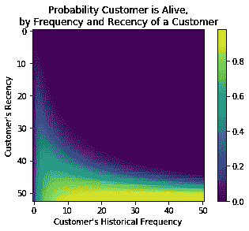
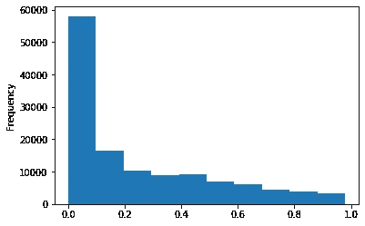

# 电子商务中无标签数据的顾客流失预测。

> 原文：<https://towardsdatascience.com/predicting-customer-churns-without-any-labelling-data-in-e-commerce-e54cb70944fe?source=collection_archive---------19----------------------->


Beautiful Cali

当你花了很大的力气去吸引你的客户，却不知道谁会去吸引时，你会感到困惑甚至沮丧吗？当你打算花 1 万美元，却只能获得 5 万美元的收入时，一切都感觉崩溃了(可能会让情况变得更糟)。我们发现在帮助你限制营销成本方面非常有用的一件事是定义和预测你的流失客户。有了一个精确的模型，你将能够削减高达 80%的成本，并减少你的竞选战略的不确定性的一大部分。让我们直接进入今天的话题吧！

首先，我们想谈谈为什么很难预测搅动。但在此之前，我们需要了解一下两种不同类型的 2C(对客户)商业模式。№1 是人们订阅和预付费的地方，这称为订阅模式。№2 是人们来买东西时没有留下任何关于他们何时会回来下一个订单的暗示，这被称为交易模式。

订阅模式有哪些例子？我会暂停 30 秒让你思考至少 2 秒。我的答案是苹果音乐，Spotify，亚马逊 Prime，纽约时报，甚至你的电，煤气，垃圾，下水道，有线电视都算在订阅里。订阅模式与众不同的是一个明确的契约。这意味着双方都知道钱和时间。因此，在客户流失建模中，这是一个相对简单的案例。

事务模型的一些例子是什么？每一个销售有形产品而没有签约重复的品牌都是一种交易模式。您现在将立即理解为什么在这种情况下更难对搅动进行建模，因为搅动实际上是不可见和不透明的。

我们将在事务模型中讨论搅动，因为我们喜欢挑战。但是为了克服挑战，我们需要变得更聪明。我们知道在监督学习的框架下解决这个问题是不可能的。为什么？因为作为一名员工，99%的时候你会发现自己在为一个项目争取多一天的时间。当你有一个监督学习的问题，但你没有足够的标记数据时，通常正确的解决方案是找到另一种方法，而不是为自己自我标记 1000，2000 个数据。时间很重要。(参见我的另一篇[帖子](https://www.linkedin.com/feed/?trk=baidubrand-mainlink)关于作为初级数据科学家你肯定会陷入的一些陷阱。)

那么我们如何解决这个问题呢？我们需要转向营销中另一个更广为人知和使用的问题，顾客终身价值(CLV)。

CLV 是做什么的？CLV 是一个相当简单的模型，它可以根据顾客的历史行为来估计你能从他/她那里得到多少。让它简单有效的是 CLV 分析中只有三个组成部分，频率、最近和货币价值。频率是到目前为止的订单数量。最近是第一个订单和最后一个订单之间的天数。几乎每个人都很难记住这个定义，因为 recency 与“最近”有关，后者本质上代表你最后一次做某事是什么时候？这与新近的定义相反。你需要翻转它来记住它。货币价值是所有订单的平均价格。在我们的客户流失模型中，我们不太在乎钱，所以我们暂时不考虑它。

在继续之前，我想请读者暂停 30 秒，思考一下为什么这种模式在营销中如此有用和受欢迎。我的答案是 a)它对每个人都有意义 b)因为它直觉上有意义，它一定抓住了人类行为的本质。

现在是时候真正了解这个模型了。我会把所有的数学都交给最初的[论文](https://www.jstor.org/stable/2631608?seq=1#page_scan_tab_contents)，因为不是这里的每个人都同意这种复杂性。我们更关心可用性而不是理论。该模型的基本思想是这样的:我们通过某个时间单位(天)观察每个客户，每个客户在任何给定的一天都有一定的订购概率，每个客户在任何给定的一天都有一定的流失概率。我们假设这两个概率是独立的，并且随时间保持不变。然后，我们可以建立一些方程来描述交易行为，并使用数学来估计概率。使用 Python，我们可以充分利用这个[包](https://github.com/CamDavidsonPilon/lifetimes)。

首先，您需要使用以下命令安装这个包:

```
pip install lifetimes
```

该产品包包括 4 个可用于我们客户流失模型的模型，如果您感兴趣，可以查看[**gamma gamma fitter**](https://lifetimes.readthedocs.io/en/latest/lifetimes.fitters.html#module-lifetimes.fitters.gamma_gamma_fitter)**以全面评估客户生命周期价值建模之旅**。****

**我个人建议在最初的尝试中使用 **BetaGeoFitter** 或 **ModifiedBetaGeoFitter** 。原因是它们相对更容易收敛，训练速度更快(这也是原作者开发它们而不是经典的**paretonbfilter**的重要原因之一)。我使用**betageobitabinomfitter**的经验告诉我，这个模型也比其他两个模型需要更多的时间来训练。**

**我们现在需要一些训练数据，您可以通过在 python 中键入以下命令来获得**

```
from lifetimes.datasets import load_cdnow_summary
data = load_cdnow_summary(index_col=[0])
```

**我在这篇文章中使用了一些其他数据源，但是您可以预期使用这个示例数据集生成类似的曲线图、图表和数字。**

**查看数据集，我们有以下结构:**

```
print(data.head())
*"""*
 *frequency   recency      T*
*ID*
*1    2           30.43       38.86
"""*
```

***频率*是某个客户的历史订单数量。*最近度*是第一次发现和最后一次购买之间的天数。 *T* 是客户被发现的天数。**如果你使用自己的数据集，你需要以同样的方式组织你的数据**。**

**我将在我的帖子中使用 **ModifiedBetaGeoFitter** 。**

```
mbgf = ModifiedBetaGeoFitter(penalizer_coef=0.001)# penalizer_coef is helpful in converging the trainingmbgf.fit(summary_train['frequency'], summary_train['recency'], summary_train['T'])# display some parameters of the model
display(mbgf)# <lifetimes.ModifiedBetaGeoFitter: fitted with xxx subjects, a: 1.10, alpha: 3.27, b: 0.05, r: 0.85>
```

**这个模型已经训练成功，我们希望得到它的一些视觉效果:**

```
plot_probability_alive_matrix(mbgf)
```

****

**The brighter, the more likely a customer has **not** churned**

**该图描述了*新近度*和*频率*与流失可能性之间的关系。给定一定的频率，较高的新近度增加了**不流失**的可能性。这是有道理的，因为高新近性意味着客户最近的活动表明他们坚持使用该品牌。给定一定程度的新近性，更高的频率增加了**流失**的可能性。这可能看起来不直观，因为我们通常认为顾客买得越多，他们就越喜欢这个品牌，离开的可能性就越小。但是如果我解释给你听的话，它就不一样了:**

**假设你经营一家超市，你有一些忠实的顾客，你至少每隔一天就会见到他们。我们把其中一个叫做贝拉吧。她一年前就开始来了，她从来没有错过一天，所以你真的认为她很忠诚。有一天你没有见到她，第二天你又没有见到她，你开始自言自语“她一切都好吗？我会永远失去她吗？”。当你从一两天前开始不再见到一些忠实的客户时，你的担心就会立即产生。因为你非常关心你的敬业的人，所以你不会太关心一年只来一次的人。现在，根据你对他们是否会回来的担心程度，想想他们回来的可能性。一个忠诚的人不再拜访你，这比你 7 个月没见一个人，但你只希望一年见一次更强烈的信号。正是这种行为的改变引起了我们的担忧，我们真的感觉到了。**

**现在我们完全理解了这个模型能给我们什么样的预测，接下来我们真正的预测是什么:**

```
summary_train['mbgf_lh'] = mbgf.conditional_probability_alive(summary_train['frequency'], summary_train['recency'], summary_train['T'])summary_train['mbgf_lh'].plot.hist()
```

****

**Most customers have low probability to return, but you can manage it before it happens**

**这张图显示了未来返回可能性的分布。我们注意到，大多数人不太可能回来(在电子商务中，大多数人都是买了就走，再也不回来)。现在我遵守了我的诺言，带你走到了这段旅程的终点。**

**我想给你留一个作业，你可以在下面评论:你如何利用这个情节来管理你的电子商务业务？你能从中赚钱吗？如果有，如何实现？**

**一些有用的资源:**

**彼得·法德尔教授在沃顿商学院谈论顾客终身价值。**

**他的论文:**

**[*盘点你的客户:他们是谁，接下来会做什么？*T3，](https://www.jstor.org/stable/2631608?seq=1#page_scan_tab_contents)**