# 用 Python 中的“买到死”概率模型预测顾客终身价值

> 原文：<https://towardsdatascience.com/predicting-customer-lifetime-value-with-buy-til-you-die-probabilistic-models-in-python-f5cac78758d9?source=collection_archive---------1----------------------->

Tokyo, Japan - photo credit: Pexels

客户的价值是什么？在搅动之前，客户还会购买多少次？他在未来 3 个月内流失的可能性有多大？最重要的是，我们应该期望客户“存活”多久？

虽然这些问题在营销、产品、风险投资和公司财务专业人士中很常见，但总是很难用准确的数字来正确回答。

在**的非契约性商业环境**，顾客可以随时终止与零售商的关系，无需事先通知，这可能更加棘手。
亚马逊的图书(或任何其他没有订阅的产品类别)，Zalando 的服装，Booking.com 的酒店都是非合同商业设置的例子。对于所有这三种电子商务，我们无法通过查看客户合同的结束日期来了解他是“活着”(将来会购买)还是“死了”(永远不会再购买)。我们只能依靠客户过去的购买和其他不太典型的事件(网站访问、评论等)。).
但在这种情况下，我们如何决定客户是会回来还是永远离开呢？

> “买到死”概率模型通过评估客户未来交易的预期次数及其“活着”的概率，帮助我们量化客户的终身价值。

# 英国天然气公司/NBD 模型

为了理解“买直到你死”模型是如何工作的，我们把重点放在预测现实生活数据的最佳选择上:BG/NBD 模型。
贝塔几何/负二项分布模型于 2004 年由 [P. Fader 的论文](http://www.brucehardie.com/papers/bgnbd_2004-04-20.pdf)提出，是对 Schmittlein 等人于 1987 年开发的帕累托/NBD 模型(第一个 BTYD)的改进。

特别是，为了预测未来的交易，该模型将客户的购买行为视为掷硬币游戏。
每位顾客有 2 枚硬币:一枚*购买硬币*控制顾客购买的概率，一枚*骰子硬币*控制顾客退出且不再购买的概率。

让我们通过模型假设来理解一切是如何进行的。

> ***假设 1:*** *活跃时，客户的交易笔数遵循一个* [*泊松过程*](/the-poisson-distribution-and-poisson-process-explained-4e2cb17d459) *，交易率****λ(=一个时间间隔内的预期交易笔数)。***

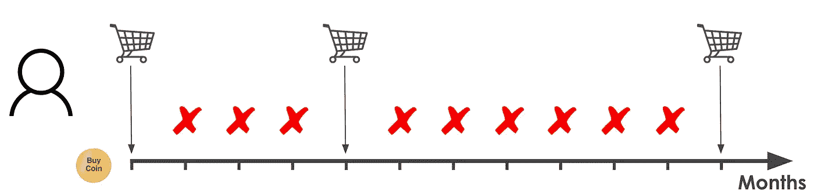

A customer’s purchasing behavior observed over a period of 12 months, where the number of transactions is distributed as a Poisson Process with unobserved transaction rate *c*

在特定时间间隔(12 个月)的每个子周期(1 个月)，每个顾客投掷他的购买硬币，根据结果，他购买或不购买。
我们在周期内观察到的交易数量(头数)取决于每个客户在λ附近的概率分布。
让我们在客户的泊松概率分布下方绘图，以形象化我们刚才所说的内容。

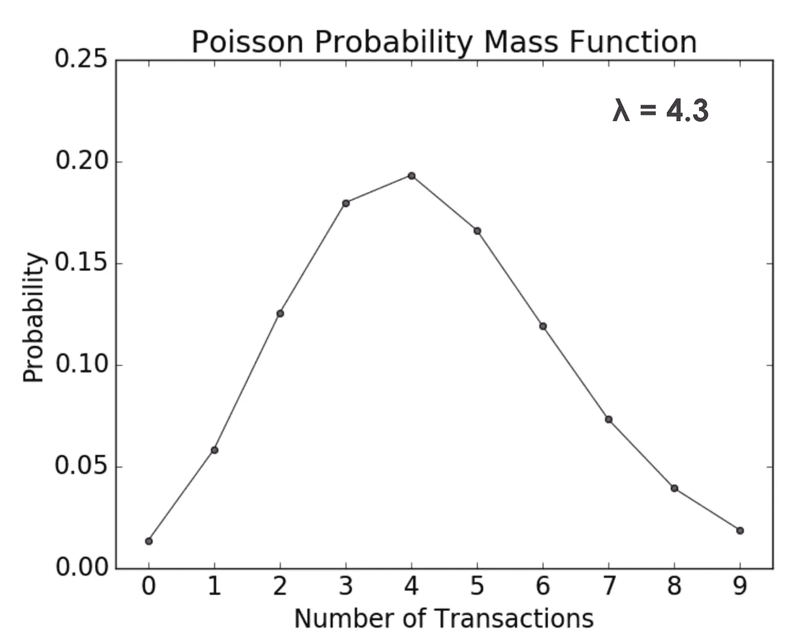

Poisson Probability Mass Function of a customer with *λ = 4.3*

这里我们假设我们的随机客户的交易率λ = 4.3。
因此，他有 19%的概率在随机的 12 个月内购买 4 次，有 4%的概率购买 8 次，等等。

> ***假设 2:*** *客户间交易率的异质性遵循一个* [*伽玛分布*](https://en.wikipedia.org/wiki/Gamma_distribution) *。*

这相当于说**每个顾客都有自己的购买硬币(有自己的头尾概率)。** 为了更好地理解这一假设，我们模拟了 100 个客户的泊松分布，其中每个λ都用伽马分布建模，参数为:形状=9，比例=0.5。

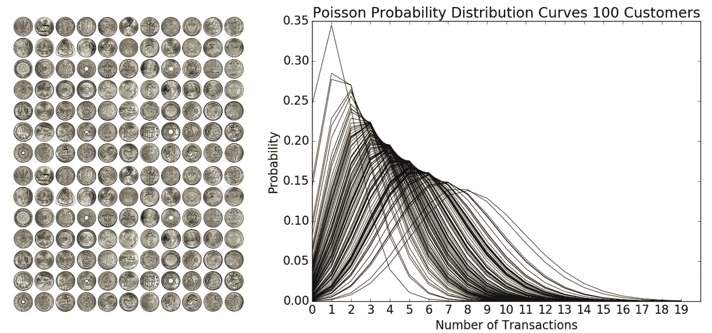

Simulation of 100 customers Poisson Probability distributions where each customer’s λ depends on a Gamma distribution with shape = 9 and scale = 0.5

如假设中所述，在给定的时间间隔内，每个顾客都有自己购买 x 次的概率。

> ***假设 3:*** *在任何一笔交易之后，* ***一个客户以概率 p 变得不活跃*** *因此，客户“退出”的点按照一个* [*(移位)几何分布*](https://en.wikipedia.org/wiki/Geometric_distribution) *跨交易分布。*

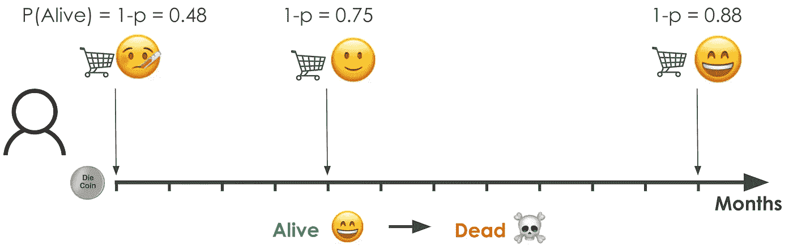

每次交易结束后，每位顾客都会投掷第二枚硬币，即*骰子硬币。* 鉴于 *p* 是“死亡”的概率，那么我们可以定义 *P(活着)= 1-p.* 再一次，我们来绘制一个随机的客户概率分布，更好地把握这个假设的含义。

Shifted Geometric Probability Mass Function for a customer with p = 0.52

假设我们的客户变得不活跃的概率 p = 0.52，那么他在第二次交易后变得不活跃的概率是 25%，他在第三次交易后变得不活跃的概率是 12%。

正如你所看到的，顾客买的越多，他活着的概率就越高。

> ***假设 4:****p 中的异质性遵循一个* [*贝塔分布*](https://en.wikipedia.org/wiki/Beta_distribution) *。*

至于购买硬币，每个顾客都有自己的硬币，在特定数量的交易后，它有自己的存活概率。
我们可以在下面看到如何寻找 10 个客户的模拟，其中 *p* 遵循 Beta 分布，其中 *α* = 2， *β* = 3。

Simulation of 10 random customers Geometric Probability distributions where p is follows a beta distribution with parameters *α* = 2 and *β* = 3

> ***假设 5:*** *t* 交易率 **λ** 和退出概率 **p 在客户之间独立变化。**

## 模型输出

最后，通过对历史客户数据拟合前面提到的分布，我们能够推导出一个模型，该模型为每个客户提供:

*   *P(X(t) = x | λ，p)* - **在长度为 t 的时间段内观察到 X 笔交易的概率**
*   *E(X(t) | λ，p)* - **长度为 t 的时间段内的预期交易数**
*   *P(τ > t)* - **客户在** τ期间变得不活跃的概率

然后，拟合的分布参数被用于前瞻性的基于客户的分析中，以找到**具有由 *x，t* ₓ *，T —*** 定义的过去观察到的行为的个人在长度为 t 的未来时间段中的预期交易次数，其中 *x* =历史交易次数， *t* ₓ =最后购买时间， *T* =客户年龄。
下面是数学爱好者的最终公式(详细推导见 [P. Fader 论文](http://www.brucehardie.com/papers/bgnbd_2004-04-20.pdf)的附录):

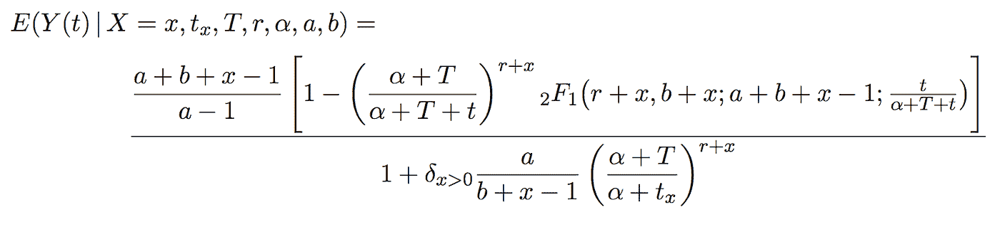

The expected number of transactions in a future period of length t for an individual with past observed behavior (X = x, *t*ₓ, T; where x = n. historical transactions, *t*ₓ = time of last purchase and T = Age of a customer) given the fitted model parameters r, *α,* a, b

# 用 Python 实现 CLV 模型

既然我们已经了解了“买到死”模型是如何工作的，我们终于准备好从理论到实践，将 BG/NBD 模型应用于真实的客户数据。

在可用于实现模型的各种备选方案中，我强烈推荐 Python 中的[生存期包](https://lifetimes.readthedocs.io/en/master/lifetimes.html)(在此使用)和 r 中的 [BTYD 库](https://cran.r-project.org/web/packages/BTYD/vignettes/BTYD-walkthrough.pdf)，这些包在将模型的方程包装成方便的函数方面做得非常好，使我们的生活变得非常容易。

## 数据的形状

如前所述，BG/NBD 模型将几种分布拟合到历史客户购买数据中。为此，我们需要建立一个数据集，为每个客户提供以下三个信息:

> **最近(来源于 *t* ₓ)** :顾客最后一次购买时的年龄，等于顾客第一次购买和最后一次购买之间的时间。
> 
> **频率(x)** :客户重复购买的次数。
> 
> **客户年龄(T)** :客户在研究期间结束时的年龄，等于客户第一次购买和数据集中最后一天之间的持续时间。

下面是您的数据应该是什么样子的示例:

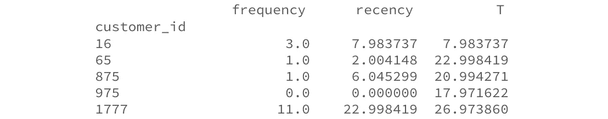

您是选择几天、几个月还是几年，很大程度上取决于您典型的客户购买周期。例如，送餐业务往往会在同一周内遇到重复的顾客，所以他们可能会去几天。在上面的例子中，我用了月，因为它更合适。

## 拟合模型

一旦我们创建了数据集，我们就可以将它传递给模型并打印出摘要。

如果您需要一些真实的客户数据，请随意使用 UCI ML 存储库提供的[在线零售数据集](http://archive.ics.uci.edu/ml/datasets/online+retail)(我将使用一个虚构的数据集，不提供任何有关我分析的公司的敏感信息)。

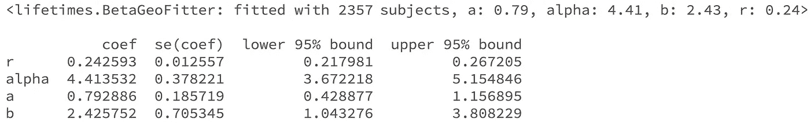

酷！这是什么？我们将假设的分布拟合到历史数据中，并推导出模型参数: *alpha* 和 *r* 用于伽马分布(假设 2)，而 *a* 和 *b* 用于贝塔分布(假设 4)。
在总结中，我们还为每个参数提供了一个置信区间，我们可以用它来计算每个客户的预期未来交易的置信区间。

## 评估模型拟合度

现在我们已经建立了一个模型，我们可以检查它是否真的有意义。第一种方法是根据拟合的模型参数人工生成具有预期购买行为的客户，并将其与真实数据进行比较。

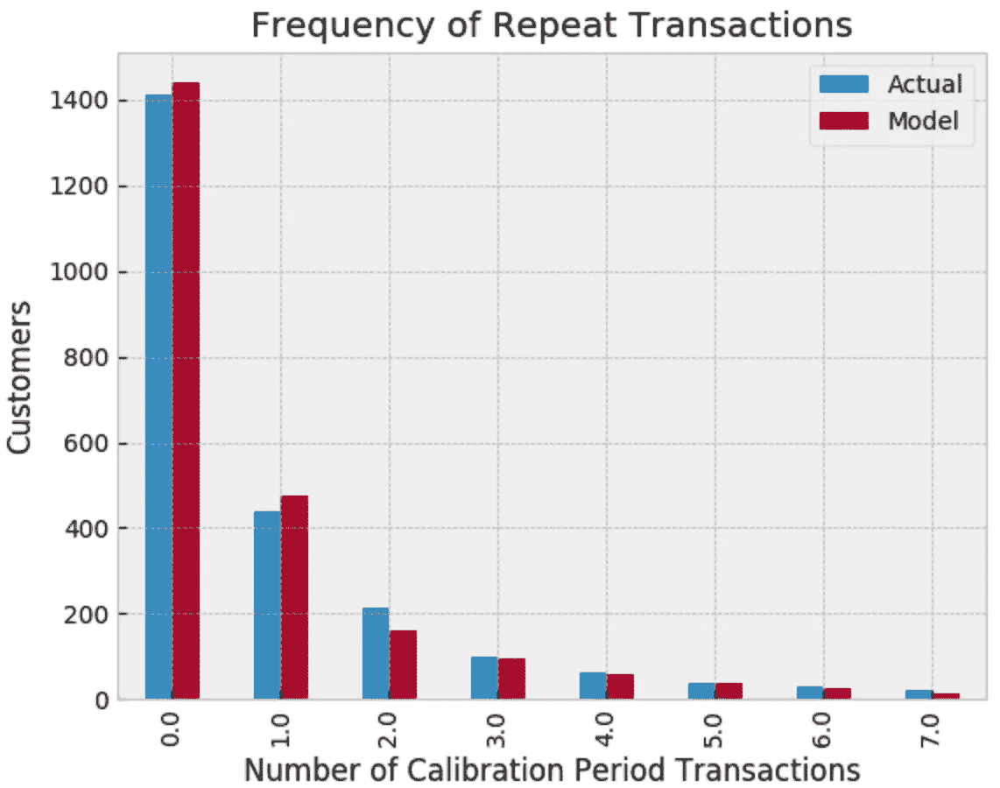

就我们所见，人为的客户分布与真实数据非常相似。
在这一步，我还建议计算总体***百分比误差***(=预测交易/实际交易-1)和 ***在校准周期*** 中完成的每笔交易的百分比误差。
通过这种方式，您可以量化模型与现实的接近程度，以及它是否更适合某些客户。例如，该模型在 5、6 和 7 个校准交易桶中放置的客户可能比实际少，这可能最终导致整体严重低估。

## 可视化模型频率/新近矩阵

现在我们有了一个拟合的模型，我们可以查看它的频率/最近矩阵，以检查客户最近(上次购买时的年龄)、频率(重复交易的次数)和下一个时间段的预期交易次数之间的预期关系(基于我们的拟合模型参数)(下图左侧)。
我们还可以根据客户的近期情况和频率来想象客户存活的预期概率(下图)。

事实上，我们看到，如果一个客户购买了超过 25 次，并且他们最近一次购买是在他们超过 25 个月大的时候(右下角)，那么他们是你最热门的客户，最有可能活着并购买。相反，你最冷的客户在右上角:他们很快买了很多，我们几个月没见了。

## 交互效度分析

一旦您验证了模型足够接近实际数据，我们就可以看到它在预测未来购买方面有多好。

得益于 Lifetimes '*calibration _ and _ holdout _ data()*函数，我们可以将简单的事务数据集快速拆分为校准期和维持期。我们首先将模型拟合到 2 年的校准期，然后预测下一年的事务，最后比较预测的事务与维持的事务。

下面是 cal_hold 数据帧的样子:

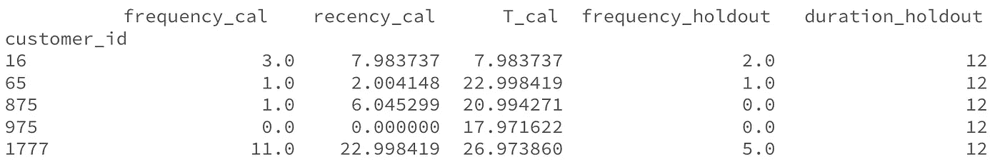

通过比较下图中的平均实际购买量和预测购买量，我们可以注意到，对于在校准期内有 0 到 3 次重复交易的客户，预测购买量和实际购买量非常接近，而对于重复交易次数较多的客户，预测购买量和实际购买量会越来越大。

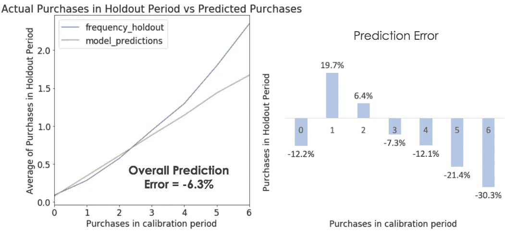

同样在这种情况下，由于图表本身可能会产生误导—对于有很多客户的时段，小的差异可能会导致大的误差—为了正确地评估预测，我们应该查看*总体百分比误差*(图表中的预测误差)、，在我的场景中它占-6.3%(模型预测的交易比实际少 6.3%)。
通过查看校准期内重复测试的误差百分比，我们注意到，我们低估了重复测试 3 次或更多次的客户(-7.3%至-30.3%)，以及没有重复测试的客户(-12.2%)。我们还强烈高估了 1 个回头客(+19.7%)。

尽管我们在更细的层次上预测失误，但这是一个相当好的结果，因为我们感兴趣的是交易的总体预测量。尽管如此，仅仅在一个时期内的交叉验证并不能让我们理解未来会发生什么。未来预期的-6.3%的误差合理吗，或者这是一个难以置信的幸运机会？

为了更好地评估模型，我们将在几个期间进行交叉验证，然后检查每个期间的错误。为此，我们简单地构建一个 For 循环，在几个周期内迭代交叉验证。
具体来说，我们在具有 6 年交易的数据集上运行它，其中对于每次迭代，我们在选定的 2 年校准期内对客户子集进行采样，并预测未来 1 年的交易。因此，我们最终有 4 个交叉验证的期间。
然后我们标绘结果。

如下图所示，*每年的预测误差始终在 4.1%到-7.9%之间，2018 年是预测最好的一年(-2.3%预测误差)*。这是非常好的，尤其是与绝对预测误差大于 10%的普通队列模型相比。

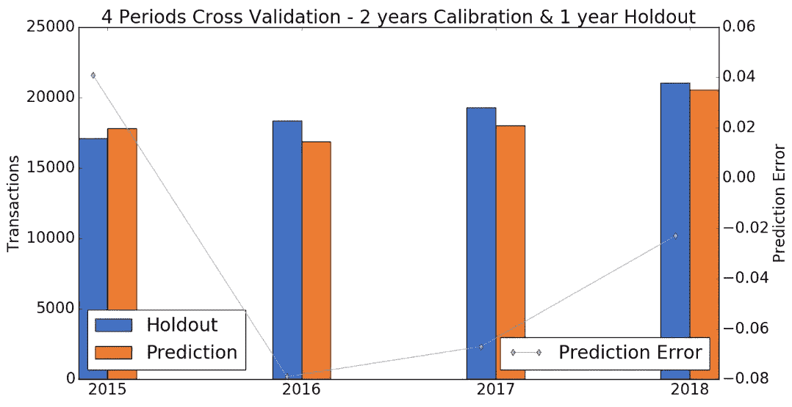

## 客户预测和概率历史

一旦你建立了模型并验证了它的有效性，你就可以很容易地查看单个客户的预测以及他们存活的概率。这非常有价值，因为你可以将 CLV 预测用于营销活动、预测或更普遍的防止流失。

例如，在下面，我们绘制了客户存活的历史概率。

从图中我们可以观察到*顾客每增加一次购买，他活着的概率就增加，然后又开始下降；但是速度较慢，因为每个新的交易增加了他的频率和他的新近度。*

# 结论

总之，预测 CLV 总是一项棘手的任务，通常历史频率模型无法区分过去购买次数接近的客户。
购买直到你买概率模型来拯救我们，它允许我们仅使用 3 个客户的信息(客户的频率、最近和年龄)来建立相当准确的预测。

在本文中，我们有意没有提及一些与 CLV 有关的重要话题，但在让您了解之前，让我对其中的三个话题做一个简短的评论:

*   我们预测了未来的交易，但是我们忽略了 CLV 等式中的“价值”部分。通常[伽马-伽马子模型](http://www.brucehardie.com/notes/025/gamma_gamma.pdf)用于 BG/NBD 模型之上，以估计交易的**货币价值。**
*   我们使用 BG/NBD 模型来预测未来交易总量，但如果您打算在用户层面采取行动，您应该正确衡量单个客户预测的准确性。
*   如果模型不太适合您的客户(并且这些假设对您的业务来说是合理的)，那么**考虑让它适合客户群体**(例如。按用户国家划分)，**和/或** **将其与具有附加功能的线性模型**(例如。客户的网站访问量、自上次访问以来的时间、产品评论、获取渠道等。).

感谢阅读，用数据不断改造世界！

建设性的反馈和激励性的谈话总是受欢迎的。随意连接在[*Linkedin*](https://www.linkedin.com/in/deangelisluca1/)*上打招呼！*