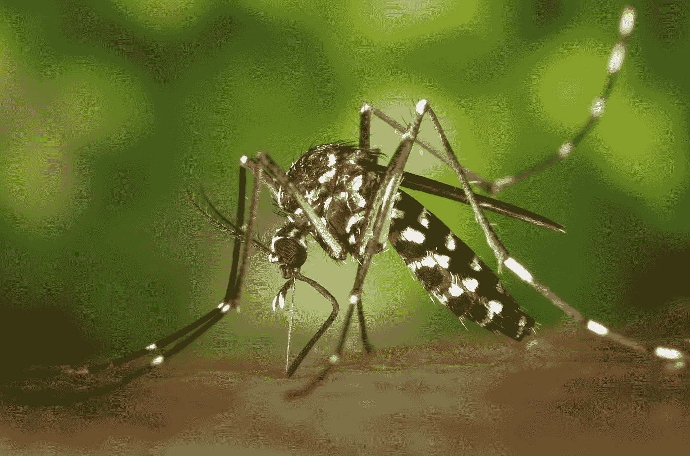
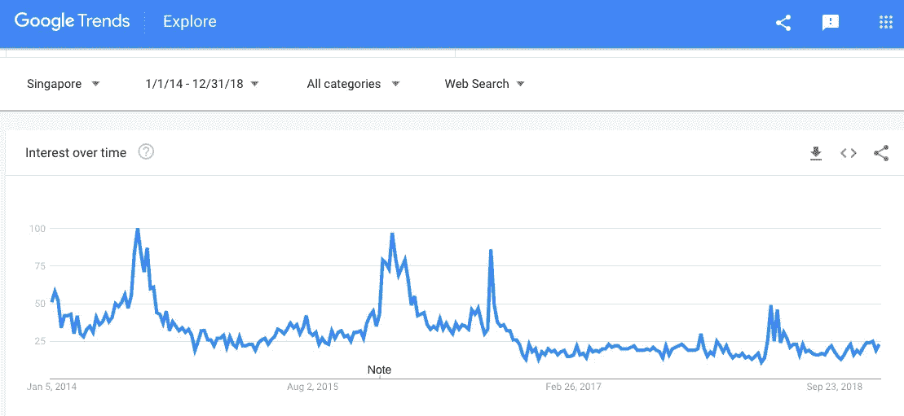
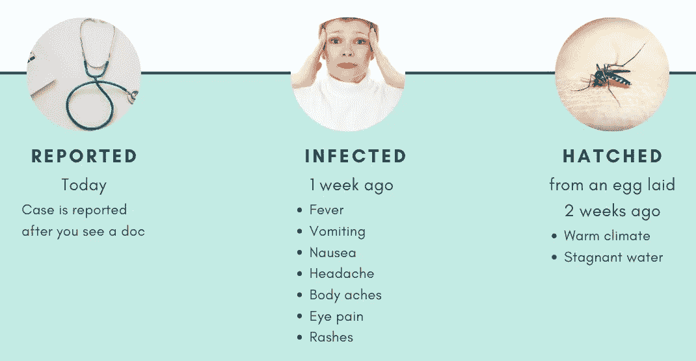
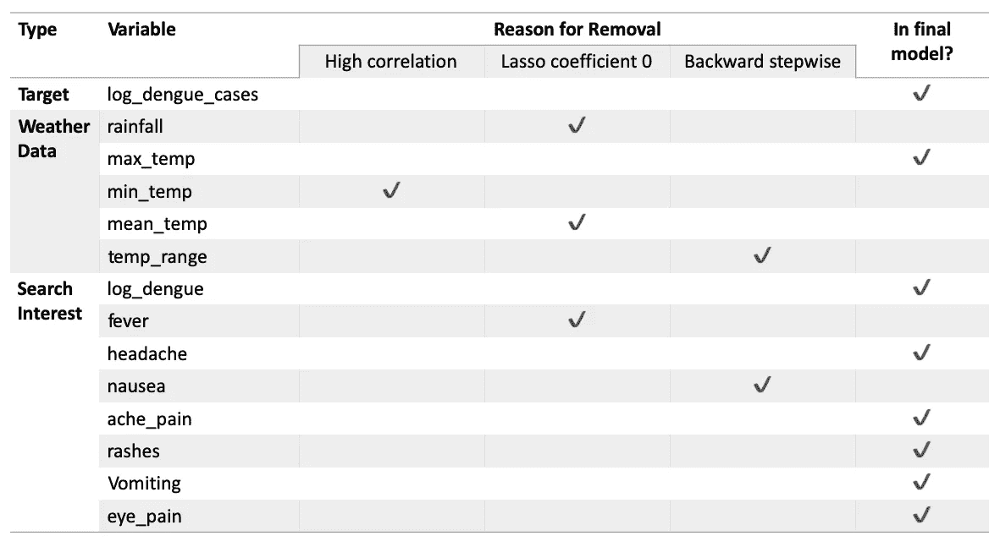
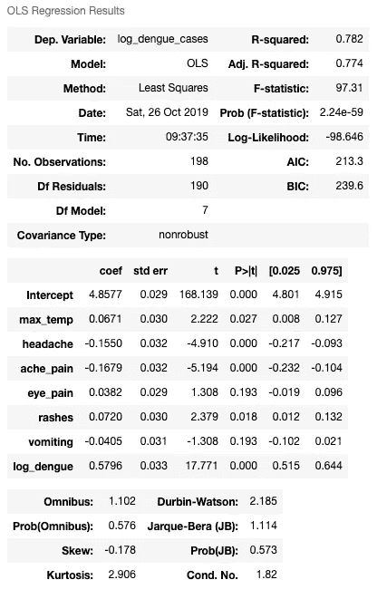
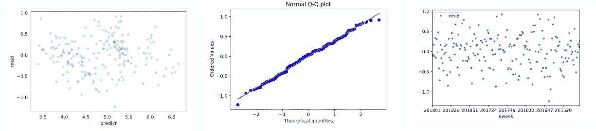

# 预测新加坡的登革热病例

> 原文：<https://towardsdatascience.com/predicting-dengue-in-singapore-f9be0a761ce4?source=collection_archive---------19----------------------->

你正在公园里享受一个愉快的夜晚，野餐垫已经摆好，手里拿着一杯可口的冷饮。

“啪！”



你刚刚杀死了一只埃及伊蚊。你欣赏它手上独特的黑白条纹身体。你认为只是无害的咬一口。

接下来的一周，你躺在床上发高烧，肌肉疼痛，出皮疹。究竟发生了什么事？你从两周前孵化的伊蚊身上感染了登革热。

# 预警系统

登革热是一种可怕的疾病。如果没有及时或有效的干预，散发的登革热病例很容易演变成流行病。伊蚊通过吸食受感染的人类或其母亲感染登革热，后者在其两周的寿命内可以产下数百个卵。

如果流行病发生，早期预警系统可以帮助医疗保健提供者更好地管理登革热患者的增加。

# 登革热的潜在预测者

天气信息:雌性伊蚊喜欢炎热多雨的天气。它们在死水中产卵，温暖的温度促使它们的后代生长得更快。

**谷歌趋势:**包含“登革热”一词的搜索词已被成功用于预测[多个国家](https://journals.plos.org/ploscompbiol/article?id=10.1371/journal.pcbi.1005607)的登革热病例。这可能是因为那些对病毒更敏感的人，也更有可能搜索它。

# 数据收集

从网络上收集了 2014 年至 2018 年新加坡特定的登革热病例数据、天气信息和搜索兴趣。

使用 *Selenium* 和 *BeautifulSoup* 从政府网站上搜集登革热和天气数据:

1.  [每周登革热病例数](https://data.gov.sg/dataset/weekly-number-of-dengue-and-dengue-haemorrhagic-fever-cases)。报废时只有 2014 年到 2018 年的数据。此限制为所有其他数据源设置时间段。
2.  [每日天气信息](http://www.weather.gov.sg/climate-historical-daily/)。只有樟宜气象站的数据被废弃；这个车站是政府的主要历史参考点。



Google Trends search interest data for search term ‘dengue’ from 2014 to 2018.

以下词语的每周搜索兴趣数据来自 Google Trends:

*   疼痛或疼痛
*   登革热
*   发热
*   头痛
*   呕吐
*   恶心
*   发疹
*   目痛

# 数据清理和合并

数据集相对干净，除了重复和缺失的值，它们都被删除了。登革出血热病例也从登革热数据集中删除，因为这类病例很少。

主要挑战是创建一个跨数据集的公共时间要素来合并它们。使用流行病学周(e 周，例如 2018 年第 52 周)对登革热数据集进行了日期确定。 [Epiweeks](https://pypi.org/project/epiweeks/) 软件包用于将数据集的日期特征转换为 e-weeks。

对于天气数据集，使用 *groupby* 获得每个 e 周的平均温度和降雨量。

在将数据拟合到模型之前，删除了所有日期时间功能。

# 时间滞后

时滞被用来解释感染者出现症状和伊蚊孵化所需的时间。



Assumed timeline of events

对于每个每周的登革热观察，其对应的搜索兴趣数据将来自一周前，而天气数据将来自两周前。原因如下:

*   登革热的症状通常在被感染后的 4 到 7 天内出现。我认为在此期间，潜在的患者可能会在谷歌上搜索登革热及其症状。
*   天气变化被认为会影响蚊子的繁殖速度。假设是较高的温度促使伊蚊产卵；伊蚊大约需要一周的时间孵化和生长。

# 列车测试分离

合并的数据框架被分成 20%的测试数据和 80%的训练验证数据(用于 k 倍交叉验证)。

# **特色工程&改造**

通过取最高和最低温度之间的差值创建了温度范围特征。我预计较小的温度范围预示着登革热病例，尤其是在较温暖的几周。

对登革热病例数(目标)和对登革热的搜索兴趣(特征)进行对数转换，以校正偏差并提高其相关性。

在模型拟合之前，使用*标准定标器*对所有变量进行标准化。

# 特征选择

在模型构建过程的不同阶段进行特征选择。

1.  **在构建模型之前:**为了避免多重共线性，高度相关的要素被移除。
2.  **交叉验证确定线性模型可能适用于数据后:** Lasso 回归用于特征选择。使用 *LassoCV* 获得 alpha 值，并应用于模型。移除了具有零值系数的要素。
3.  **选择合适的线性模型**后:使用向后逐步方法选择特征。具有最高 p 值的要素被移除，直到模型的校正 r 减小。

以下是这些变量及其被删除原因的摘要:



Table of variables, and their status (removed/included in model)

# k 倍交叉验证

由于观察值数量较少(248，在去除了因对数据应用时间滞后而产生的缺失值后)，因此模型选择使用了 5 k 倍交叉验证。

以下是所用线性模型的总结，以及它们在 k 倍范围内的 r 均值和标准差。对于脊和套索，alpha 值设置为默认值 1。

```
Simple linear model r^2: 0.755 +- 0.041 
Polynomial model r^2: 0.441 +- 0.153
Ridge model r^2: 0.755 +- 0.043
Lasso model r^2: -0.010 +- 0.012
```

为了在简单模型和脊模型之间进行选择，在使用 Lasso 回归进行特征选择并应用从 *RidgeCV* 获得的 alpha 值之后，我重新运行了交叉验证。

```
Simple linear model r^2:: 0.757 +- 0.043 
Polynomial model r^2: 0.665 +- 0.053
Ridge model r^2: 0.757 +- 0.046
Lasso model r^2: -0.010 +- 0.012
```

两个模型的 r 均值和标准差相似，因此**选择了一个简单的线性回归**。

# **测试&评估**

使用 *StatsModel* 对整个 80%的训练验证数据重新训练模型。为了进一步简化模型，进行了向后逐步特征选择。

以下是最终模型的结果:



StatsModel Output for Training-Validation Set

将测试数据拟合到模型后，得到的调整后的 r 为:0.760。这个模型似乎概括得很好。

# 检查假设



Left to Right: Scatterplot of y-predicted and y-residuals; Q-Q plot of y-residuals; Scatterplot of e-week and y-residuals.

散点图中没有可辨别的模式，y 残差似乎呈正态分布，除了尾部的一些偏差。

从 *StatsModel* 输出和上述图表判断，线性回归模型似乎适用于该数据。

# 结论

该模型可以解释新加坡每周登革热病例记录中 77%的差异，并具有良好的泛化能力。

在预测未来登革热病例时，对“登革热”的搜索兴趣似乎是最重要的。这一专题可能已经包含了一些关于蚊子繁殖和传播的信息，因为新加坡新闻媒体倾向于报道繁殖集群、登革热感染和相关死亡。

因此，**医疗保健提供者可以使用登革热搜索兴趣** **作为粗略的指标**，而不是监控大范围的变量。

# 未来的工作

我对头痛和疼痛的显著负系数感到惊讶。新加坡对登革热的认识很高。我怀疑，当蚊子叮咬后出现这些症状或登革热病例增加时，意识到登革热的人可能会直接搜索“登革热”。因此，更好地理解搜索模式有助于改进模型。

*** [GitHub](https://github.com/adelweiss/Dengue/tree/master) ***

** * *这是一个 METIS 数据科学训练营项目。线性回归和网页抓取是项目需求****