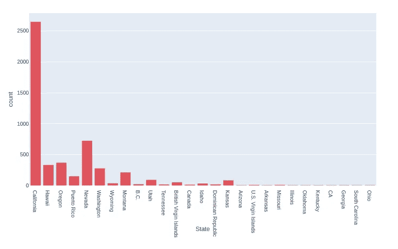
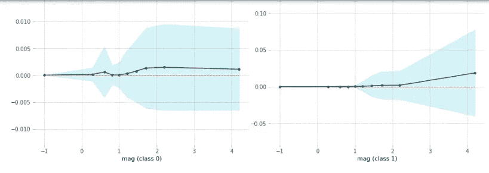
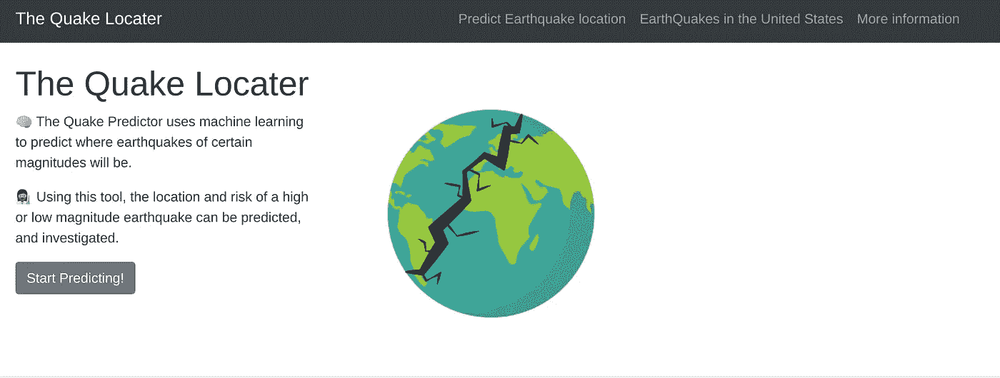

# 用 XGBoost 预测地震

> 原文：<https://towardsdatascience.com/predicting-earthquakes-with-xgboost-5feca64d28f6?source=collection_archive---------36----------------------->

我最近创建了一个 Plot.ly Dash web 应用程序，它处理地震的震级和深度，以预测它们在美国和美国领土内的位置。

# 处理我的数据

很多时候，当我开始一个新的机器学习项目，并开始查看我的数据时，我会先发制人地考虑模型和验证。尽管我喜欢筛选 NaNs 和脏数据，但我更喜欢拟合模型和预测结果。尽管如此，我倾向于最初选择一个最小可行的产品，然后向上滚动开始数据清理过程。数据清理和模型选择一样重要，这一点在这个项目中得到了很好的证明，在这个项目中，我从一个随机的森林分类器开始，得到了低得多的分数。最后，在最后一秒，我将模型切换到 XGBoost 分类器，这使我的分数提高了约 0.01%，但对复制的 gap-per 预测大幅下降。

## 数据探索

一开始，我很快意识到我的模型将围绕着根据地震的属性对州名进行分类。预期的结果将是明确的，并使用地震的属性进行预测。我从一个快速、极简的数据清理开始，为了避免一些严重的泄漏，我做了一些删减，包括经度和纬度列，这会使算法完全不相关。接下来，我开始了一些经典的数据探索。我决定用直方图开始我的分析，以确定州数据中某些结果的频率。这个直方图对于确定我的过程中的下一步，以及在开始拟合模型之前，数据下一步需要去哪里是必不可少的。



California is separated marginally from the rest of the data.

我对这一结果的最初反应是恐惧，这是理所当然的；如果加州比其他地方的数据要对更多的地震负责，那么真的有必要应用一个模型吗？这个问题很好地延续到任何数据科学家将对他们的数据做的下一件事。所以我用 iter-tools 写了一个函数，它能给我一个很好的主意，如果没有一个真实的模型，预测会有多准确，这当然也被称为多数类基线。这将让我知道，如果我们提供的任何数据(x)只猜测加利福尼亚，这个模型会有多准确。此外，您可能已经注意到直方图中有一个“CA ”,所以我很快将其替换为“California ”,以使命名更加一致，并且对该州有一个单独的预测。有趣的是，这是这个特定问题暴露出来的唯一地点。在将查询“CA”替换为“California”之后，我继续获取我的多数类基线。

```
def most_common(L):
  SL = sorted((x, i) for i, x in enumerate(L))
  groups = itertools.groupby(SL, key=operator.itemgetter(0))
  def _auxfun(g):
    item, iterable = g
    count = 0
    min_index = len(L)
    for _, where in iterable:
      count += 1
      min_index = min(min_index, where)
    return count, -min_index
  return max(groups, key=_auxfun)[0]
def baseliner(y,ypr):
  r = []
  m = most_common(y)
  for i in ypr:
    r.append(m)
  return(r)
```

我快速编写了两个函数，并使用测试集中的目标和特性运行该函数，产生了以下结果:

```
from sklearn.metrics import accuracy_score# Setting our majority class accuracy
acc = accuracy_score(ytest,y_pred)
# Printing out the results:
print("Baseline Accuracy:",acc)
```

结果是:

```
Baseline Accuracy: 0.5108583247156153
```

至少可以说，我非常震惊！令人高兴的是，这表明数据对于一点点机器学习仍然是可行的，生活中没有比这更令人兴奋的事情了。考虑到这一点，我用一个顺序编码器、迭代估算器和最后的 XGBoost 分类器设置并安装了我的管道。当内核计算结果时，我积极地预期结果，希望模型最初会获得很高的分数，因为仍然有很大的改进空间，使我能够获得非常高的训练准确度分数，这使我对模型的验证非常兴奋。

# 拟合模型

```
pipeline.fit(Xtrain,ytrain)
```

我安装了管道，设置了模型，并准备获得一些验证准确性，看看这个项目的未来会发生什么。这听起来好像我是在杞人忧天，但这真的是“数据科学家的事情”，你不会明白的。我在从我的 test-x 预测我的 test-y 时初始化了管道。

```
ypr = pipeline.predict(Xtest)
accuracy_rf = accuracy_score(ytest,ypr)
```

我终于得到了我的准确度分数，为了制造悬念，我不得不为我最初的准确度做一个夸张的展示:

```
print("===================================================================")
print("___Unscaled, continous encoded Xgb Classifier Accuracy___")
print("_________________________",accuracy_rf,"______________________")
print("===================================================================")
```

这产生了:

```
===================================================================
___Unscaled, continous encoded Random Forest Classifier Accuracy___
_________________________ 0.8749038445433443 ______________________
===================================================================
```

在这之后，我回去清理了数据——稍微深入一点，我最终回去删除了“时间”一栏，因为害怕泄露。此外，我优化了一些超参数，以小幅提高精度，最高可达:

```
===================================================================
_______________________Xgb Classifier Accuracy______________________
_________________________ 0.9118407445708376 ______________________
===================================================================
```

这表明，当数据猴子不断提醒你不断清理数据的重要性时，它们可能终究是正确的。

# 探索模型特征

在获得一个相当准确的模型后，我决定在将所有这些都转移到 Dash-app 之前，用 Plotly 对数据进行更多的探索，从一些幅度的依赖关系图开始。



虽然这肯定不是该项目的必要获得，也没有必要说明任何不可能假设的事情，但它确实显示了一些关于这个特性在实际预测中有多少作用的事情，并且看到它与其他特性相比的位置是非常令人惊讶的。接下来，a 用各州的震级标绘了一些点:


我认为这可能是一个更重要的可视化，因为现在我们可以看到为什么多数类不是一个非常准确的预测器，通常某一级别的地震在位置上是一致的，至少在某种程度上是如此。此外，值得注意的是，气泡的大小是地震的间隙，(这在悬停数据中更明显，在停滞的截图中不太明显)。在 3.0-4.0 的震级范围内，加利福尼亚州不太可能发生地震，被多米尼加共和国忽视了，该国也没有发生-1.0-2.5 的地震。

虽然这看起来像是旧闻，特别是对那些有领域知识的人来说，但了解一下为什么准确度可以如此容易地非常高是非常有趣的，尽管该模型需要的工作比清理数据要少。

当然，下一步是将这个模型放入 Dash 应用程序，提供一个用户友好的体验，使用这个模型预测地震的准确率达到 91%。但是我认为现在是提供一个[笔记本链接](https://github.com/emmettgb/Emmetts-DS-NoteBooks/blob/master/Python3/Earthquake_Predictor_Dash.ipynb)的好时机，它也将出现在页脚，因为我们正在从笔记本转移到 flask/dash。

# 创建一个 Plotly-Dash 应用程序



对我来说，这是这样一个项目的另一部分，我觉得比清理数据更有趣。很多时候，整天埋头于笔记本会变得乏味，感觉有点做作。当然，我不得不从矢量图形开始，但是*我是数据科学家，不是图形设计师*，所以我不太热衷于提供更多关于 Adobe Illustrator 设计的信息。

为了创建 Dash 应用程序，我需要知道更多关于数据的事情。由于数据主要是振动扰动(seismec)，它主要以 double 数据类型存储，所以我的范围主要由一些非常精确的小数组成。此外，我需要分类特征观测值中的所有唯一值。我决定快速创建一个新的笔记本，我可以用它来填充我的半个屏幕，以便快速简单地将最小值和最大值输入到我的 IDE 中。这让我真的希望有一种简单的方法在 Dash 中将列表添加到组合框中。

这里有一个[笔记本的链接。](https://github.com/emmettgb/Emmetts-DS-NoteBooks/blob/master/Python3/Quake_Analysis.ipynb)我使用了 Numpy idx-min 和 max，以及 Numpy unique，这两个都是熊猫内置的，这里没有什么真正严重或复杂的事情发生。

至少对于 slider 的来说，更自动化的方法是可能的，通过在 DCC 中使用 min()和 max()作为 slider 构造函数中的 max 和 min 值。

由于这不是一个情节性的 Dash 教程，(也许有一天)，我不会解释如何使用 Dash 进行机器学习。但如果你愿意，你可以看看这个应用程序，它将于今天下午(9 月 27 日)推出，[这里](http://emmettboudreau.com/Quake-Locator/)。而至于来源，这里[有](https://github.com/emmettgb/Quake-Predictor)。

我真诚地希望这次旅行至少能读起来有趣，或者甚至有一点教育意义。构建 Dash 应用程序是一种简单、快速、有趣且富有创造性的方式，可以展示您的数据科学实力，同时还可以产生一个伟大的项目，并在此过程中学习一些东西。将来我肯定会在空闲时间赚更多的钱。