# 利用向量误差修正模型预测方股票价格

> 原文：<https://towardsdatascience.com/predicting-fang-stock-prices-ecac4ddd27c1?source=collection_archive---------10----------------------->

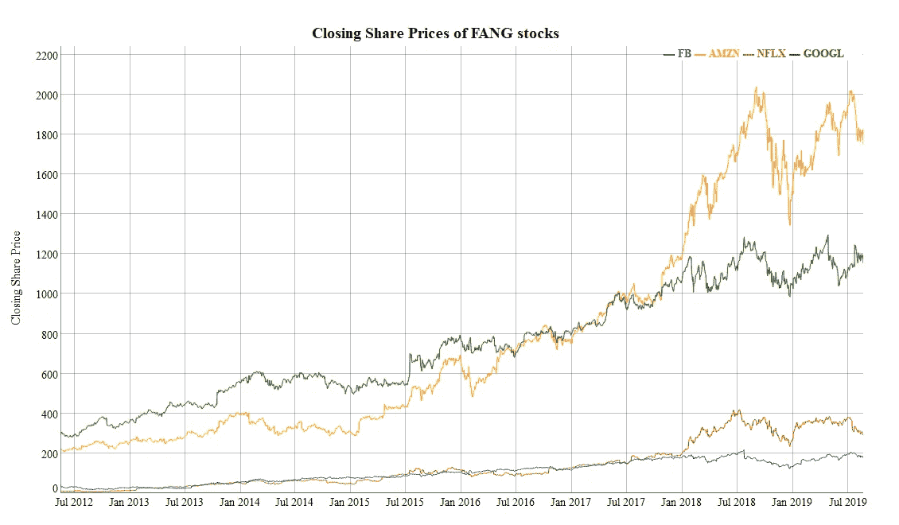

Source: All images in this article were generated by the author in R using dygraphs

## 基于向量误差修正模型的协整时间序列数据建模

金融数据是时间序列数据最著名的资源。一个多世纪以来，股票价格的记录被一丝不苟地记录下来，提供了丰富的数据集。所谓的“方”公司，即脸书、亚马逊、网飞和谷歌/Alphabet 的股票因其令人印象深刻的回报率和这些高科技公司的“酷”因素而受到了很多关注。但是这些股票真的相互关联吗？或者这是华尔街营销一堆不相关商品的一个例子？还有一种可能是，投资者认为他们之间存在关联，这足以导致他们的股票一起波动。即使我们不知道它们为什么一起移动，如果它们一起移动，我们至少可以确定你是否可以预测一只股票和其他股票。

我从雅虎财经获得了方股票的收盘价数据。脸书的首次公开募股是在 2012 年，所以这是样本期的限制因素。我们的样本期从 2012 年 5 月 18 日到 2019 年 8 月 23 日。我截掉了 2019 年的所有交易日作为测试数据集，把剩下的观测值留给训练数据集。这意味着数据集缺乏这些公司的股票在衰退中如何表现的数据。不管怎样，我继续我的分析。我测试了整合度、格兰杰因果关系和约翰森整合。基于这些结果，我继续进行向量误差修正模型(VECM)，这是一种同时估计至少有一个协整关系的多个时间序列的技术。


# **平稳性测试**

平稳性是指时间序列的均值方差不依赖于时间。当用图表表示时，它看起来像白噪声。由于对非平稳时间序列建模所引起的几个问题，主要是自相关，你需要在建模之前检查一个时间序列是否是平稳的。如果它不是静止的，你需要通过差分得到它。

上图显示了 4 个绝对看起来不稳定的时间序列。但是，在继续之前，我们需要对它进行正式测试。

无差异股票的自相关函数(ACF)图表明，股票肯定不是平稳的。差异变量的 ACF 看起来可能是稳定的。这表明每只股票都是综合 I(1)。增强的 Dickey-Fuller (ADF)测试可以证实这一点。

## **脸书的自相关函数图**

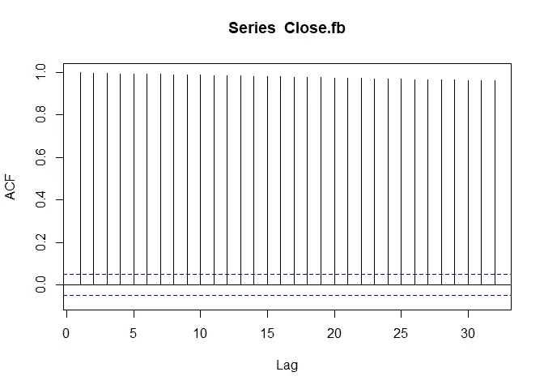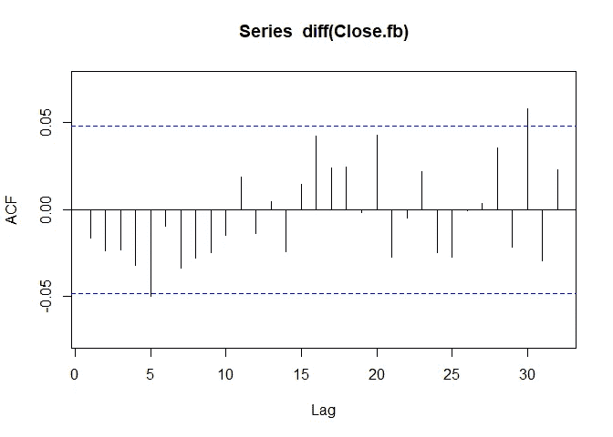

## **亚马逊的自相关函数图**

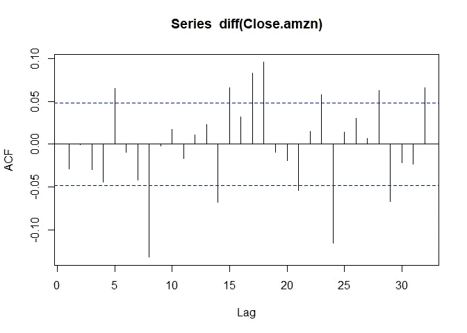

## **网飞的自相关函数图**

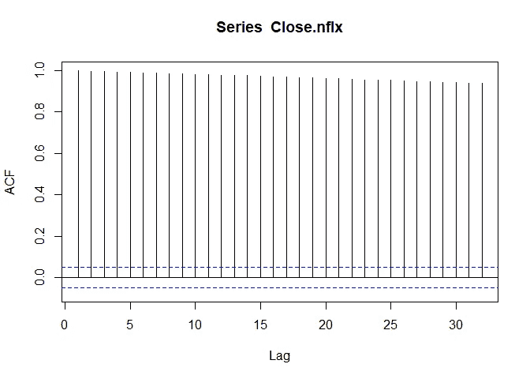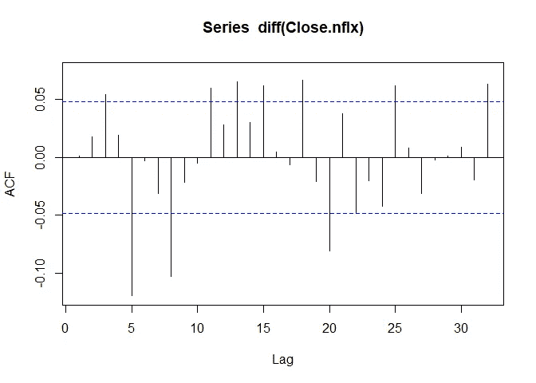

## **谷歌的自相关函数图**

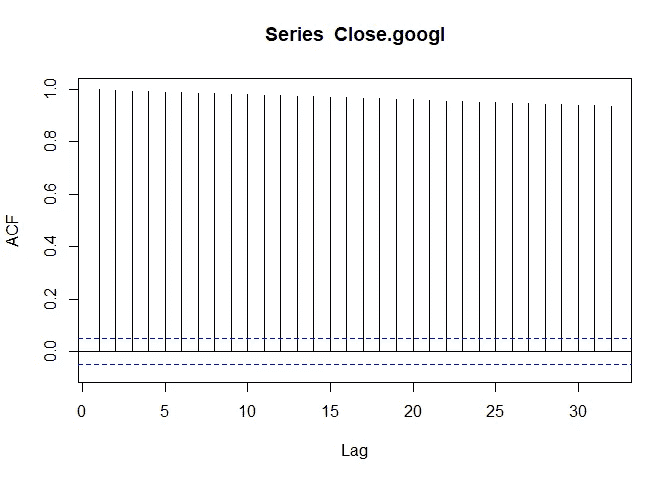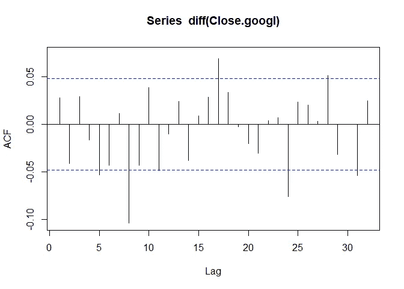

无差异和有差异的 ADF 测试的输出强烈支持股票是整合的 I(1)的假设。在建模之前，需要对这些股票价格进行一次区分。许多用于集成时间序列模型的时间序列包会自动完成这项工作。

## **针对脸书的增强迪基-富勒测验**

```
Non-Differenced## Augmented Dickey-Fuller Test 
## alternative: stationary 
##  
## Type 1: no drift no trend 
##      lag   ADF p.value
## [1,]   0 0.405   0.760
## [2,]   1 0.441   0.771
## [3,]   2 0.483   0.783
## [4,]   3 0.508   0.790
## [5,]   4 0.542   0.800
## [6,]   5 0.608   0.819
## [7,]   6 0.639   0.828
## [8,]   7 0.692   0.843
## Type 2: with drift no trend 
##      lag   ADF p.value
## [1,]   0 -1.11   0.661
## [2,]   1 -1.16   0.644
## [3,]   2 -1.19   0.634
## [4,]   3 -1.17   0.642
## [5,]   4 -1.14   0.651
## [6,]   5 -1.14   0.651
## [7,]   6 -1.19   0.635
## [8,]   7 -1.19   0.635
## Type 3: with drift and trend 
##      lag   ADF p.value
## [1,]   0 -2.42   0.399
## [2,]   1 -2.25   0.469
## [3,]   2 -2.08   0.541
## [4,]   3 -2.01   0.572
## [5,]   4 -1.88   0.628
## [6,]   5 -1.60   0.745
## [7,]   6 -1.47   0.803
## [8,]   7 -1.28   0.881
## ---- 
## Note: in fact, p.value = 0.01 means p.value <= 0.01Differenced## Augmented Dickey-Fuller Test 
## alternative: stationary 
##  
## Type 1: no drift no trend 
##      lag   ADF p.value
## [1,]   0 -41.5    0.01
## [2,]   1 -29.8    0.01
## [3,]   2 -24.6    0.01
## [4,]   3 -21.7    0.01
## [5,]   4 -20.1    0.01
## [6,]   5 -18.3    0.01
## [7,]   6 -17.3    0.01
## [8,]   7 -16.4    0.01
## Type 2: with drift no trend 
##      lag   ADF p.value
## [1,]   0 -41.5    0.01
## [2,]   1 -29.8    0.01
## [3,]   2 -24.6    0.01
## [4,]   3 -21.7    0.01
## [5,]   4 -20.2    0.01
## [6,]   5 -18.4    0.01
## [7,]   6 -17.4    0.01
## [8,]   7 -16.5    0.01
## Type 3: with drift and trend 
##      lag   ADF p.value
## [1,]   0 -41.5    0.01
## [2,]   1 -29.8    0.01
## [3,]   2 -24.6    0.01
## [4,]   3 -21.7    0.01
## [5,]   4 -20.2    0.01
## [6,]   5 -18.4    0.01
## [7,]   6 -17.4    0.01
## [8,]   7 -16.5    0.01
## ---- 
## Note: in fact, p.value = 0.01 means p.value <= 0.01
```

## **亚马逊增强的迪基-富勒测试**

```
Non-Differenced## Augmented Dickey-Fuller Test 
## alternative: stationary 
##  
## Type 1: no drift no trend 
##      lag  ADF p.value
## [1,]   0 1.54   0.969
## [2,]   1 1.60   0.974
## [3,]   2 1.60   0.974
## [4,]   3 1.67   0.977
## [5,]   4 1.76   0.980
## [6,]   5 1.62   0.975
## [7,]   6 1.63   0.976
## [8,]   7 1.75   0.980
## Type 2: with drift no trend 
##      lag      ADF p.value
## [1,]   0 -0.03873   0.953
## [2,]   1  0.00509   0.956
## [3,]   2  0.00206   0.956
## [4,]   3  0.04246   0.959
## [5,]   4  0.08628   0.963
## [6,]   5  0.01241   0.957
## [7,]   6  0.02187   0.957
## [8,]   7  0.07776   0.962
## Type 3: with drift and trend 
##      lag   ADF p.value
## [1,]   0 -1.93   0.605
## [2,]   1 -1.90   0.619
## [3,]   2 -1.89   0.622
## [4,]   3 -1.86   0.637
## [5,]   4 -1.80   0.663
## [6,]   5 -1.87   0.631
## [7,]   6 -1.87   0.634
## [8,]   7 -1.80   0.664
## ---- 
## Note: in fact, p.value = 0.01 means p.value <= 0.01Differenced## Augmented Dickey-Fuller Test 
## alternative: stationary 
##  
## Type 1: no drift no trend 
##      lag   ADF p.value
## [1,]   0 -41.9    0.01
## [2,]   1 -29.1    0.01
## [3,]   2 -24.3    0.01
## [4,]   3 -21.7    0.01
## [5,]   4 -17.8    0.01
## [6,]   5 -16.4    0.01
## [7,]   6 -15.9    0.01
## [8,]   7 -16.9    0.01
## Type 2: with drift no trend 
##      lag   ADF p.value
## [1,]   0 -41.9    0.01
## [2,]   1 -29.2    0.01
## [3,]   2 -24.4    0.01
## [4,]   3 -21.8    0.01
## [5,]   4 -17.9    0.01
## [6,]   5 -16.5    0.01
## [7,]   6 -16.0    0.01
## [8,]   7 -17.1    0.01
## Type 3: with drift and trend 
##      lag   ADF p.value
## [1,]   0 -41.9    0.01
## [2,]   1 -29.2    0.01
## [3,]   2 -24.5    0.01
## [4,]   3 -21.8    0.01
## [5,]   4 -18.0    0.01
## [6,]   5 -16.5    0.01
## [7,]   6 -16.1    0.01
## [8,]   7 -17.1    0.01
## ---- 
## Note: in fact, p.value = 0.01 means p.value <= 0.01
```

## **为网飞增加了迪基-富勒测验**

```
Non-Differenced## Augmented Dickey-Fuller Test 
## alternative: stationary 
##  
## Type 1: no drift no trend 
##      lag   ADF p.value
## [1,]   0 0.837   0.885
## [2,]   1 0.833   0.884
## [3,]   2 0.799   0.874
## [4,]   3 0.701   0.846
## [5,]   4 0.670   0.837
## [6,]   5 0.880   0.897
## [7,]   6 0.890   0.900
## [8,]   7 0.946   0.907
## Type 2: with drift no trend 
##      lag    ADF p.value
## [1,]   0 -0.516   0.873
## [2,]   1 -0.517   0.873
## [3,]   2 -0.541   0.864
## [4,]   3 -0.598   0.844
## [5,]   4 -0.618   0.837
## [6,]   5 -0.492   0.882
## [7,]   6 -0.486   0.884
## [8,]   7 -0.455   0.895
## Type 3: with drift and trend 
##      lag   ADF p.value
## [1,]   0 -2.00   0.576
## [2,]   1 -2.01   0.574
## [3,]   2 -2.04   0.562
## [4,]   3 -2.14   0.517
## [5,]   4 -2.18   0.501
## [6,]   5 -1.95   0.597
## [7,]   6 -1.94   0.602
## [8,]   7 -1.89   0.623
## ---- 
## Note: in fact, p.value = 0.01 means p.value <= 0.01Differenced## Augmented Dickey-Fuller Test 
## alternative: stationary 
##  
## Type 1: no drift no trend 
##      lag   ADF p.value
## [1,]   0 -40.6    0.01
## [2,]   1 -28.2    0.01
## [3,]   2 -21.9    0.01
## [4,]   3 -18.8    0.01
## [5,]   4 -19.2    0.01
## [6,]   5 -17.5    0.01
## [7,]   6 -16.5    0.01
## [8,]   7 -16.7    0.01
## Type 2: with drift no trend 
##      lag   ADF p.value
## [1,]   0 -40.6    0.01
## [2,]   1 -28.2    0.01
## [3,]   2 -21.9    0.01
## [4,]   3 -18.8    0.01
## [5,]   4 -19.3    0.01
## [6,]   5 -17.6    0.01
## [7,]   6 -16.6    0.01
## [8,]   7 -16.9    0.01
## Type 3: with drift and trend 
##      lag   ADF p.value
## [1,]   0 -40.6    0.01
## [2,]   1 -28.2    0.01
## [3,]   2 -21.9    0.01
## [4,]   3 -18.8    0.01
## [5,]   4 -19.3    0.01
## [6,]   5 -17.6    0.01
## [7,]   6 -16.6    0.01
## [8,]   7 -16.9    0.01
## ---- 
## Note: in fact, p.value = 0.01 means p.value <= 0.01
```

## **谷歌的增强 Dickey-Fuller 测试**

```
Non-Differenced## Augmented Dickey-Fuller Test 
## alternative: stationary 
##  
## Type 1: no drift no trend 
##      lag  ADF p.value
## [1,]   0 1.21   0.940
## [2,]   1 1.15   0.933
## [3,]   2 1.23   0.943
## [4,]   3 1.16   0.935
## [5,]   4 1.20   0.939
## [6,]   5 1.28   0.950
## [7,]   6 1.36   0.956
## [8,]   7 1.34   0.954
## Type 2: with drift no trend 
##      lag   ADF p.value
## [1,]   0 -1.07   0.677
## [2,]   1 -1.07   0.679
## [3,]   2 -1.06   0.680
## [4,]   3 -1.07   0.678
## [5,]   4 -1.07   0.676
## [6,]   5 -1.07   0.677
## [7,]   6 -1.04   0.687
## [8,]   7 -1.06   0.680
## Type 3: with drift and trend 
##      lag   ADF p.value
## [1,]   0 -3.52  0.0404
## [2,]   1 -3.64  0.0275
## [3,]   2 -3.49  0.0430
## [4,]   3 -3.63  0.0292
## [5,]   4 -3.56  0.0364
## [6,]   5 -3.36  0.0598
## [7,]   6 -3.22  0.0851
## [8,]   7 -3.26  0.0768
## ---- 
## Note: in fact, p.value = 0.01 means p.value <= 0.01Differenced## Augmented Dickey-Fuller Test 
## alternative: stationary 
##  
## Type 1: no drift no trend 
##      lag   ADF p.value
## [1,]   0 -39.6    0.01
## [2,]   1 -29.5    0.01
## [3,]   2 -23.1    0.01
## [4,]   3 -20.4    0.01
## [5,]   4 -19.1    0.01
## [6,]   5 -18.0    0.01
## [7,]   6 -16.3    0.01
## [8,]   7 -16.8    0.01
## Type 2: with drift no trend 
##      lag   ADF p.value
## [1,]   0 -39.6    0.01
## [2,]   1 -29.6    0.01
## [3,]   2 -23.2    0.01
## [4,]   3 -20.5    0.01
## [5,]   4 -19.2    0.01
## [6,]   5 -18.1    0.01
## [7,]   6 -16.4    0.01
## [8,]   7 -16.9    0.01
## Type 3: with drift and trend 
##      lag   ADF p.value
## [1,]   0 -39.6    0.01
## [2,]   1 -29.6    0.01
## [3,]   2 -23.2    0.01
## [4,]   3 -20.5    0.01
## [5,]   4 -19.2    0.01
## [6,]   5 -18.1    0.01
## [7,]   6 -16.4    0.01
## [8,]   7 -16.9    0.01
## ---- 
## Note: in fact, p.value = 0.01 means p.value <= 0.01
```

# **格兰杰因果关系**

众所周知，在观察数据中建立因果关系非常困难。格兰杰因果关系是一个较低的酒吧。它只是说，如果 X 的以前值可以预测 y 的未来值，那么 X 格兰杰原因是 y。它是通过估计 X 对 y 的滞后值的回归并执行 f 检验来执行的。如果 p 值足够小，你拒绝零假设，即 X 的所有滞后值的系数都是 0。简单地说，小 p 值表示滞后的 x 对未来的 y 有预测能力，并有相应的置信度。

下面的输出简单地说明了 FANG 的每只股票都比其他股票具有预测能力。这意味着同步建模是一个好方法。

```
## Granger causality test
## 
## Model 1: j ~ Lags(j, 1:30) + Lags(i, 1:30)
## Model 2: j ~ Lags(j, 1:30)
##   Res.Df  Df      F    Pr(>F)    
## 1   1574                         
## 2   1604 -30 2.9968 1.226e-07 ***
## ---
## Signif. codes:  0 '***' 0.001 '**' 0.01 '*' 0.05 '.' 0.1 ' ' 1
## Granger causality test
## 
## Model 1: j ~ Lags(j, 1:30) + Lags(i, 1:30)
## Model 2: j ~ Lags(j, 1:30)
##   Res.Df  Df      F    Pr(>F)    
## 1   1574                         
## 2   1604 -30 2.4849 1.635e-05 ***
## ---
## Signif. codes:  0 '***' 0.001 '**' 0.01 '*' 0.05 '.' 0.1 ' ' 1
## Granger causality test
## 
## Model 1: j ~ Lags(j, 1:30) + Lags(i, 1:30)
## Model 2: j ~ Lags(j, 1:30)
##   Res.Df  Df      F   Pr(>F)    
## 1   1574                        
## 2   1604 -30 2.5479 9.15e-06 ***
## ---
## Signif. codes:  0 '***' 0.001 '**' 0.01 '*' 0.05 '.' 0.1 ' ' 1
## Granger causality test
## 
## Model 1: j ~ Lags(j, 1:30) + Lags(i, 1:30)
## Model 2: j ~ Lags(j, 1:30)
##   Res.Df  Df      F   Pr(>F)    
## 1   1574                        
## 2   1604 -30 2.5026 1.39e-05 ***
## ---
## Signif. codes:  0 '***' 0.001 '**' 0.01 '*' 0.05 '.' 0.1 ' ' 1
## Granger causality test
## 
## Model 1: j ~ Lags(j, 1:30) + Lags(i, 1:30)
## Model 2: j ~ Lags(j, 1:30)
##   Res.Df  Df     F    Pr(>F)    
## 1   1574                        
## 2   1604 -30 3.838 2.082e-11 ***
## ---
## Signif. codes:  0 '***' 0.001 '**' 0.01 '*' 0.05 '.' 0.1 ' ' 1
## Granger causality test
## 
## Model 1: j ~ Lags(j, 1:30) + Lags(i, 1:30)
## Model 2: j ~ Lags(j, 1:30)
##   Res.Df  Df      F    Pr(>F)    
## 1   1574                         
## 2   1604 -30 2.0986 0.0004837 ***
## ---
## Signif. codes:  0 '***' 0.001 '**' 0.01 '*' 0.05 '.' 0.1 ' ' 1
## Granger causality test
## 
## Model 1: j ~ Lags(j, 1:30) + Lags(i, 1:30)
## Model 2: j ~ Lags(j, 1:30)
##   Res.Df  Df      F   Pr(>F)    
## 1   1574                        
## 2   1604 -30 2.0299 0.000852 ***
## ---
## Signif. codes:  0 '***' 0.001 '**' 0.01 '*' 0.05 '.' 0.1 ' ' 1
## Granger causality test
## 
## Model 1: j ~ Lags(j, 1:30) + Lags(i, 1:30)
## Model 2: j ~ Lags(j, 1:30)
##   Res.Df  Df      F    Pr(>F)    
## 1   1574                         
## 2   1604 -30 3.3817 2.497e-09 ***
## ---
## Signif. codes:  0 '***' 0.001 '**' 0.01 '*' 0.05 '.' 0.1 ' ' 1
## Granger causality test
## 
## Model 1: j ~ Lags(j, 1:30) + Lags(i, 1:30)
## Model 2: j ~ Lags(j, 1:30)
##   Res.Df  Df      F    Pr(>F)    
## 1   1574                         
## 2   1604 -30 3.0723 5.784e-08 ***
## ---
## Signif. codes:  0 '***' 0.001 '**' 0.01 '*' 0.05 '.' 0.1 ' ' 1
## Granger causality test
## 
## Model 1: j ~ Lags(j, 1:30) + Lags(i, 1:30)
## Model 2: j ~ Lags(j, 1:30)
##   Res.Df  Df      F   Pr(>F)   
## 1   1574                       
## 2   1604 -30 1.7205 0.009195 **
## ---
## Signif. codes:  0 '***' 0.001 '**' 0.01 '*' 0.05 '.' 0.1 ' ' 1
## Granger causality test
## 
## Model 1: j ~ Lags(j, 1:30) + Lags(i, 1:30)
## Model 2: j ~ Lags(j, 1:30)
##   Res.Df  Df     F   Pr(>F)   
## 1   1574                      
## 2   1604 -30 1.728 0.008712 **
## ---
## Signif. codes:  0 '***' 0.001 '**' 0.01 '*' 0.05 '.' 0.1 ' ' 1
## Granger causality test
## 
## Model 1: j ~ Lags(j, 1:30) + Lags(i, 1:30)
## Model 2: j ~ Lags(j, 1:30)
##   Res.Df  Df      F    Pr(>F)    
## 1   1574                         
## 2   1604 -30 3.3607 3.101e-09 ***
## ---
## Signif. codes:  0 '***' 0.001 '**' 0.01 '*' 0.05 '.' 0.1 ' ' 1
```

# **协整检验**

协整是我反复提到的一个词。这仅仅意味着我们的股票中至少有两只之间存在长期关系。协整检验被称为 Johansen 检验，以开发它的统计学家/计量经济学家的名字命名。它可以用两种方式来表述，迹检验和最大特征值检验，它们有不同的假设。细节是相当技术性的，所以 TL；它的 dr 版本是，如果长期关系矩阵的秩 r 为 0 或等于被测试的时间序列的数量，则不存在协整，不同的建模技术是合适的。如果 r 大于 0 且小于时间序列数，则存在 r 个协整关系。

从下面的输出中，我们可以非常确定存在大于 0 的协整关系，但是我们不能在任何合理的统计显著性水平上确定存在大于 1 的协整关系。因此，我们在建模时将假设 FANG 股票之间存在一种协整关系。

```
###################### 
# Johansen-Procedure # 
######################Test type: trace statistic , with linear trend in cointegrationEigenvalues (lambda):
[1] 2.054935e-02 1.133947e-02 6.555429e-03 4.658323e-03 -2.362375e-18Values of teststatistic and critical values of test:test 10pct 5pct 1pct
r <= 3 | 7.63 10.49 12.25 16.26
r <= 2 | 18.39 22.76 25.32 30.45
r <= 1 | 37.03 39.06 42.44 48.45
r = 0 | 70.98 59.14 62.99 70.05Eigenvectors, normalised to first column:
(These are the cointegration relations)Close.fb.l30 Close.amzn.l30 Close.nflx.l30 Close.googl.l30 trend.l30
Close.fb.l30 1.000000000 1.0000000 1.0000000 1.000000000 1.0000000
Close.amzn.l30 -0.004276658 1.0364900 0.2719707 0.102530094 -0.1327168
Close.nflx.l30 0.159547714 -1.8623141 -1.2702538 -0.746632744 0.5949550
Close.googl.l30 -0.143075556 -1.9821424 0.4921765 -0.150661845 0.2315739
trend.l30 -0.054567826 0.2916345 -0.3575875 0.005284555 -0.3248181Weights W:
(This is the loading matrix)Close.fb.l30 Close.amzn.l30 Close.nflx.l30 Close.googl.l30 trend.l30
Close.fb.d -0.00219271 -0.0006776299 -0.003233474 0.00356431 1.732653e-17
Close.amzn.d 0.18630132 -0.0084137379 -0.008556667 0.01693689 -8.853648e-16
Close.nflx.d 0.02105269 -0.0006557141 0.001122418 0.01106052 -1.271123e-16
Close.googl.d 0.10670446 0.0031632593 -0.012012380 0.01474776 -9.437844e-16
```

# **选择模型的滞后数量**

为了选择包含在最终模型中的滞后数量，我选取了我的训练数据的一个小子集；从 2018 年 5 月 9 日开始到年底。这个日期在小型测试数据集中留下了 163 个观察值，这与测试数据集中的观察值数量相等。然后，我用 1 到 30 个小训练数据估计模型，然后用该模型估计小测试数据集。我计算了每只股票的平均绝对百分比误差(MAPE ),并将它们相加。然后我选择了使每只股票的 MAPE 总和最小的滞后数。最小化该调谐数据集中的总 MAPE 的滞后数量是 5。

# **模型有多精确？**

评估模型准确性时，进行基线比较会有所帮助。对于分类，它可能是总是预测模式的误分类率。对于横截面回归，它可以是因变量的平均值。对于时间序列，我希望我的预测是前一段时间的值。这意味着我的基准准确度等级是说明天的股价就是今天的股价的准确度。

这样，脸书的基准 MAPE 为 1.36%，亚马逊为 1.20%，网飞为 1.70%，谷歌为 1.15%。对于一种不依赖复杂统计模型的预测方法来说，这还不算太糟糕。VECM 能胜过这个吗？

```
## [1] "Close.fb"
## [1] 1.360928
## [1] "Close.amzn"
## [1] 1.203783
## [1] "Close.nflx"
## [1] 1.697295
## [1] "Close.googl"
## [1] 1.150686
```

现在我们可以估计 VECM。它将具有下面的简化形式，其中α的列向量是对长期调整的速度，β的行向量包含长期关系系数。

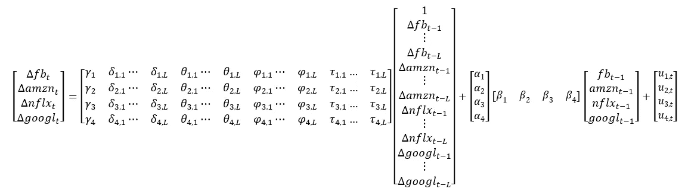

Formulation of the VECM with L lags

是的。VECM 得出脸书的 MAPE 为 0.30%，亚马逊为 0.28%，网飞为 0.40%，谷歌为 0.29%，这还不算太差。这些 MAPE 大约是基线错误率的四分之一。

```
## [1] "Close.fb"
## [1] 0.2972355
## [1] "Close.amzn"
## [1] 0.277129
## [1] "Close.nflx"
## [1] 0.3978918
## [1] "Close.googl"
## [1] 0.2943474
```

绘制每只股票的预测收盘价和实际收盘价表明，预测股价非常接近实际股价。由于股票价格比例的差异，每只股票都有自己的图表，以便更好地查看拟合值和预测值。

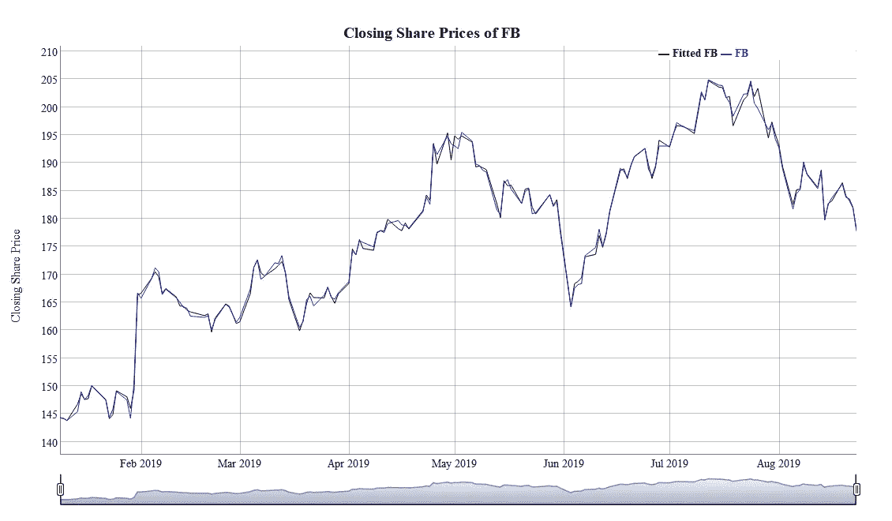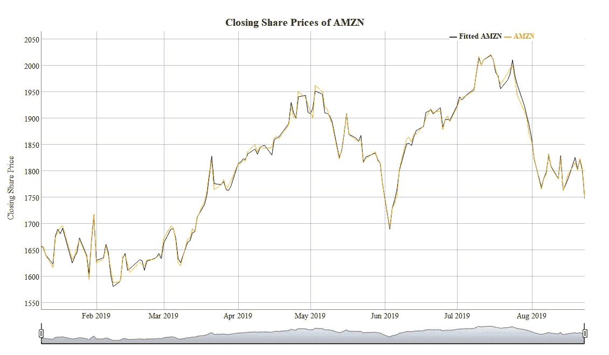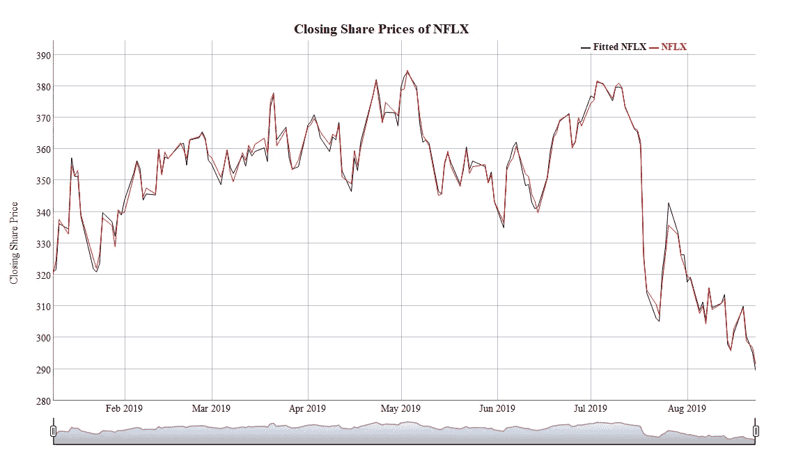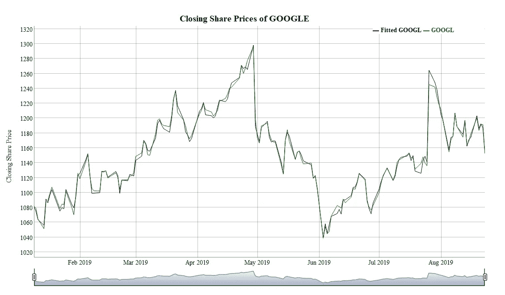

# **关闭思路**

所以这个模型表现不错。有什么意义？该模型预测收盘股价。因此，如果交易价格远低于预测的收盘价，远低于预测的收盘价是置信区间和你的风险承受能力的函数，在收盘前买入并卖出股票是有意义的；前提是没有充足的理由让股价持续下跌。如果价格远高于预测的收盘价格，卖出它是有意义的(**)我不是在提供财务建议。只是陈述如果我愿意，我会如何使用这个模型。**)。只有当你是日内交易者时，这些行为才有意义，但是这个模型的洞察力是有限的，因为它只预测前一天。

模型的准确性告诉我们模型是适合方股票的。从这里开始，重新构建模型来预测更远的时间，以决定一个期权是否被正确定价是一个合乎逻辑的地方。记住预测越来越远的未来是困难的，这一点很重要。随着人们对未来的预测越来越远，误差带变得越来越宽。在实施交易策略之前，严格的回溯测试和过去的表现不能保证未来的表现是关键。

我希望你对协整时间序列和 VEC 建模有所了解。还有很多工作没有在这里讨论，比如解释长期关系矩阵和脉冲响应函数。我希望这个博客能激发人们对此类数据的兴趣。

我的代码和数据可以在[https://github.com/jkclem/FANG-stock-prediction](https://github.com/jkclem/FANG-stock-prediction)获得。