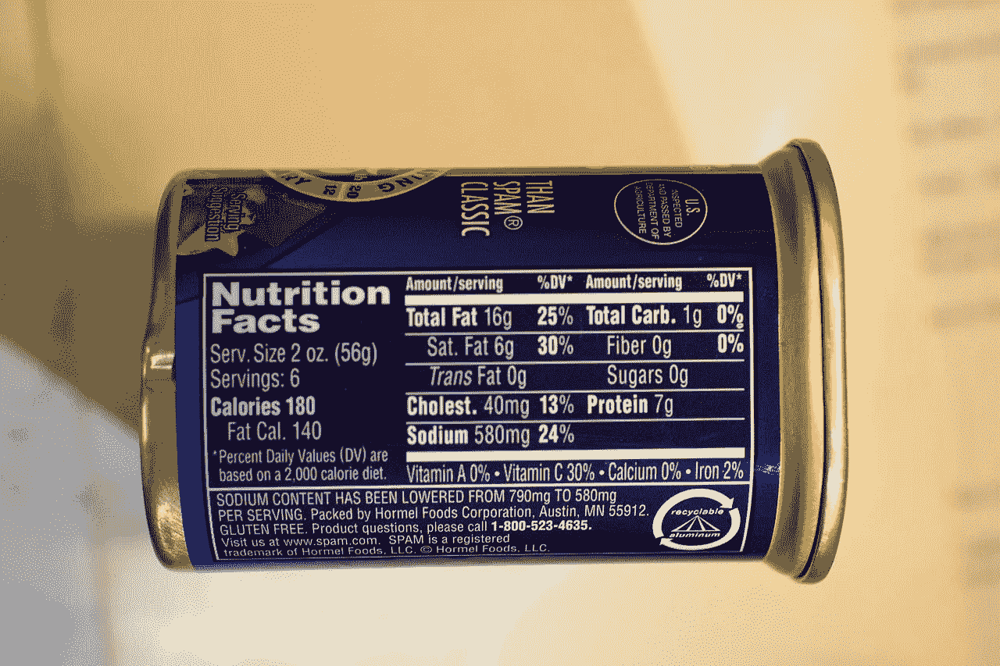
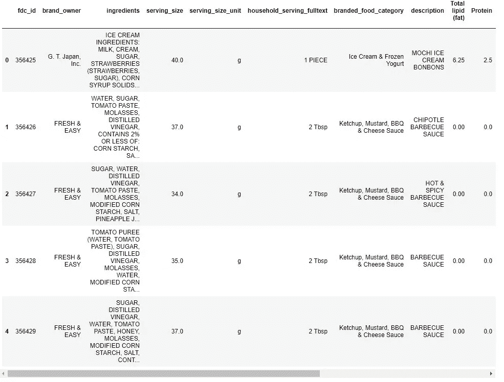
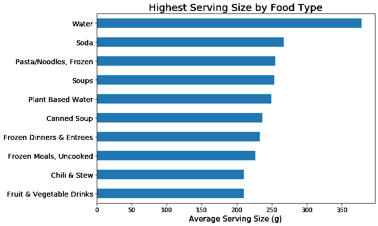
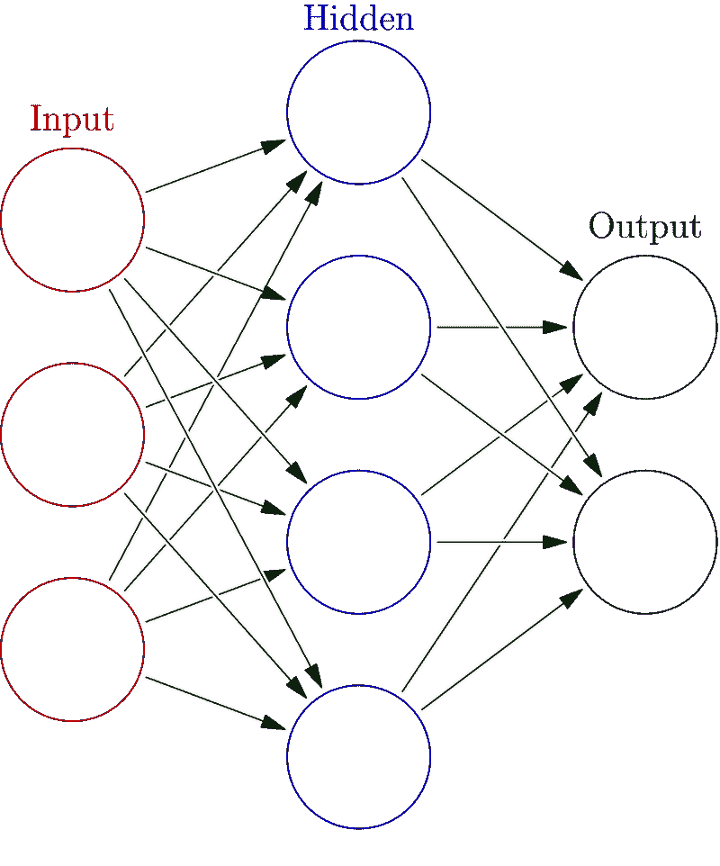
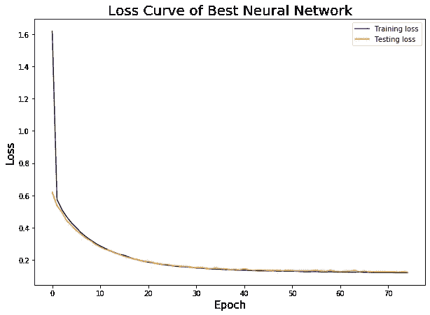
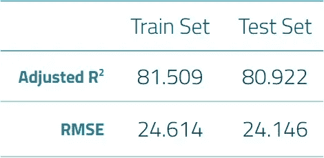

# 用前馈神经网络预测食物份量

> 原文：<https://towardsdatascience.com/predicting-food-serving-sizes-with-a-feed-forward-neural-network-2d8d40d82f72?source=collection_archive---------30----------------------->

在我在大会的沉浸式项目中，我必须完成一个顶点项目，一个完全由我自己设计的项目，除了满足几个关键标准之外，没有任何关于做什么或如何去做的指示。所以我决定专注于我非常了解并且热爱的东西——食物！我找到了一个由美国农业部维护的数据集，其中包含了该国超过 260，000 种包装和品牌食品，被恰当地命名为美国农业部品牌食品数据库。他们对数据库有相当开放的 API 访问，但幸运的是，完整的 API 也可以作为 zip 文件下载，节省了我 30 多个小时来 ping 他们的服务器。它保存了大量信息，从制造商和成分的基本信息到更具技术性的信息，如用于确定每种营养价值的特定实验室方法。引起我注意的一件事是这些产品的食用量差异很大。



Spam! Credit: [Lhe3460](https://commons.wikimedia.org/w/index.php?title=User:Lhe3460&action=edit&redlink=1), [CC BY-SA 4.0](https://creativecommons.org/licenses/by-sa/4.0/)

# **问题**

现在，对于那些不在食品科学游戏中的人来说，每份食物的份量实际上有食品和药物管理局的指导方针，食品公司必须遵守，称为习惯食用的参考量。这是一个灰色地带，因为它们不仅仅是一刀切的(老实说，我不能说这是一个双关语)，但它们必须被用作公司的出发点。因此，开发团队仍有大量工作要做，以确定食品的最终食用量。这成了我项目的中心目标:**建立一个模型来预测一种食品的份量。**

# **清洁**

第一步是合并所有的数据。因为这是一个关系数据库，所以我要找的信息被分散在多个表中。我将食品名称和它们的详细信息结合起来，比如品牌所有者、市场类别和成分。添加营养成分稍微有点棘手，因为我必须创建一个数据透视表，将它们与产品放在同一格式中。每种食物的能量含量有两个不同的单位:千卡和千焦，这有点小问题。千焦在欧洲更常见，而美国使用千卡，这是一个大写的 C 卡路里(是的，卡路里和卡路里之间有区别，不，我也不喜欢它)。我编码了一个快速转换，然后我就回到了正轨。最终的组合表如下所示:



然而，完整的营养表并没有被剔除。它必须被缩小到前 10 个最常见的。这主要是由于营养标签的一个重要事实:它们并不总是列出相同的东西。以外的常见营养素(脂肪、蛋白质、胆固醇等。)，必输项很少，大部分维生素和矿物质在大多数情况下是可选的。所以，在 97 种不同的营养成分中，绝大多数超过 90%是零的情况下，我不得不坚持强制输入。

从那以后，我还得清理许多遗留的东西。一个例子是许多卡路里计数是空的。起初，这似乎是一件大事，因为估算不是一件轻而易举的事情，但如果你对营养学很感兴趣，你应该知道实际上有一种非常简单的方法来估算卡路里，通过使用食物的三种主要营养素——脂肪、蛋白质和碳水化合物。总的来说，这些是我们每天摄入的卡路里的提供者，每种类型都有特定的量。蛋白质和碳水化合物每克都给我们的身体提供 4 卡路里，而脂肪每克提供 9 卡路里。再一次，一些快速的数学和代码是有序的，我们丢失的卡路里已经被考虑。

当我开始深入研究这些数据时，我注意到一些有趣的事实。食用量的分布有一个长的右尾，大部分食物在 0-50 克之间。由于形状的原因，我决定最好将数据转换成对数形式，以便进行建模。查看市场类别的影响也揭示了最大份量的食物类型，液体、汤类和冷冻食品构成了前 10 项。这很有意义，因为与许多其他食物相比，液体相当稠密，像冷冻主菜这样的东西可能会取代其他几种食物，本质上是多份食物(如意大利面、蔬菜和肉类)。



# **建模**

我最终使用的功能是全营养事实，和市场类别(这是 dummied)。我曾试图对配料表执行 NLP 以进一步扩展功能，但由于课程的时间限制，我无法有效地优化它们。现在我有了更多的时间，我想回到这个话题上来。



Basic Neural Network. Credit: [Glosser.ca](https://commons.wikimedia.org/wiki/User_talk:Glosser.ca), [CC BY-SA 3.0](https://creativecommons.org/licenses/by-sa/3.0)

使用并评估了几种模型，但最终我决定使用前馈神经网络。如果你需要复习一下神经网络，可以查看一下简单设置的图表。它们本质上是一系列复杂的逻辑回归(线条)，由您决定有多少隐藏层，以及每层中有多少节点(圆圈)。有一些关于建立神经网络的指导方针，但是可能性确实是无穷无尽的。

带着为我的神经网络寻找最佳参数的艰巨任务，我决定创建一个工具来帮助我加快这个过程。在 SciKit-Learn 中，有一个非常有用的工具，`GridSearchCV`可以为各种各样的模型找到最佳参数。您设置您正在构建的模型，然后可以输入广泛的超参数，`GridSearchCV`将构建这些模型，并告诉您哪个组合是最佳的。对于 Keras 中的神经网络，没有与此功能等效的功能，所以我构建了自己的功能。它是三个不同功能的组合:一个用于接受参数字典并迭代出每个排列，一个用于基于这些参数排列构建每个不同的神经网络，另一个用于组合这些功能，执行评估并跟踪最佳模型。这是很多代码，所以我只在这里包括了最后一块，但如果你有兴趣看到完整的细节，请[查看回购](https://github.com/ondovj/GA_capstone)。

```
**def** nn_grid_search(
    X,
    y,
    grid_params,
    random_state=42
):
    *### this will make a series of FFNN models* 
    *### and return the one with the best score as set below*
    *### currently set to test r2 score*

    *# list of all parameter combinations*
    all_params = permutate_params(grid_params)

    *# creating vars with to update each iter*
    best_model = **None**
    best_score = 0.0 
    best_params = **None**
    best_history = **None**

    *# train/test split the data*
    X_train, X_test, y_train, y_test = train_test_split(X, y, random_state=random_state)

    *# scaling data*
    ss = StandardScaler()
    X_train_sc = ss.fit_transform(X_train)
    X_test_sc = ss.transform(X_test)

    *# looping through the unpacked parameter list*
    **for** i, params **in** enumerate(all_params):

        *# keeping track of which model we're running*
        print(f"Building model {i + 1} of {len(all_params)}")

        *# bulding the model*
        model, history = build_model(
            params_dict = params,
            X_train = X_train_sc, 
            X_test = X_test_sc, 
            y_train = y_train, 
            y_test = y_test
        )

        *# making preds and scoring*
        test_preds = model.predict(X_test_sc)
        score = metrics.r2_score(y_test, test_preds)

        *# checking if the score beats the current best*
        *# updates vars if true*
        **if** score > best_score:
            print("***Good R2 found: **{:.2%}*****".format(score))
            best_score = score
            best_model = model
            best_params = params
            best_history = history

    *# loop is done, return the best model*
    **return** {
        "best_model"   : best_model,
        "best_score"   : best_score,
        "best_params"  : best_params,
        "best_history" : best_history,
        "test_preds"   : test_preds
    }
```

我决定给我的模型设置 3 个隐藏层，试图在避免过度拟合的同时平衡深度学习，并着手确定我的其他参数。我给了每一层一个 ReLU 激活，这通常被认为是这些网络最好的激活功能。接下来，我需要在每个隐藏层中选择多少个节点。这通常是一个基数为 2 的数字，因此这已经有助于缩小选择范围。此外，让您的第一个图层具有与输入(即您的要素)数量相似的结点是一个好主意。总共不到 200 个特征，我选择了一系列合适的数字。由于拥有一个金字塔形状的网络(每个后续层的节点更少)也是有帮助的，所以我有一个清晰的方向来建立我的完整参数字典。

在运行搜索并获得最佳模型的最终结果后，我采用这些参数，并通过增加运行的时期和应用各种正则化技术(L2 惩罚、退出和提前停止)来继续微调模型。我的模型的最终参数集如下:

```
'best_params': {
 'first_layer_nodes': 256,
  'first_dropout_rate': 0,
  'second_layer_nodes': 128,
  'second_dropout_rate': 0,
  'third_layer_nodes': 64,
  'third_dropout_rate': 0,
  'reg': 0.001,
  'epochs': 75,
}
```

# 评价

我评估神经网络的第一步是可视化它运行的全部 75 个时期的损失曲线，用 Adam 优化器监控均方误差作为损失。



我发现曲线非常平滑，训练集和测试集的损失值非常一致，没有任何明显的差异。

然后，我使用两个关键指标来分析模型的表现:调整后的 R 和均方根误差(RMSE)。使用调整后的 R 非常有用，因为它不仅能告诉您模型覆盖了多少数据方差，还能说明您拥有多少要素，从而确定它们是否真的有助于您的模型。另一方面，RMSE 为您提供了一个可直接解释的值，用于查看模型的预测值通常与真实值之间的误差。



这些分数彼此非常接近，也比我构建的其他模型的分数好得多，我觉得我已经在这段时间内尽可能地充分优化了我的模型。不幸的是，当我们现实地看待这些结果时，预测的食用量通常与实际食用量相差 24 克以上可能会有些问题，因为平均食用量约为 64 克(相差 38%)。

# 包扎

最后，我不相信这是一个完全的成功，因为我的模型有很多错误，它可能不会比仅仅遵循 FDA 的指导方针更有帮助。由于我无法将这些指导方针整合到数据中，我无法确定我的模型如何直接与它们相抗衡，所以一切都应该持保留态度(这绝对是一语双关)。

然而，它确实显示出了希望，我认为我可以做很多事情来改进这个项目。我要做的第一件事就是花些时间完善 NLP 步骤，从而整合这些成分。此外，如果这是一个生产设置，我将实现 API 访问，以跟上对数据库或目标相关食品的特定组所做的任何更改。

这绝对是一个有趣的项目，我学到了很多关于完整的从前到后的数据科学工作流程，清理数据，尤其是构建神经网络。

如果你碰巧还在读这篇文章，那么我为你坚持和我一起探索食物世界而鼓掌！请回来查看更多帖子！

你可以在这里找到[全项目回购。](https://github.com/ondovj/GA_capstone)

你也可以在 LinkedIn 上找到我[。](http://www.linkedin.com/in/jeremy-ondov)