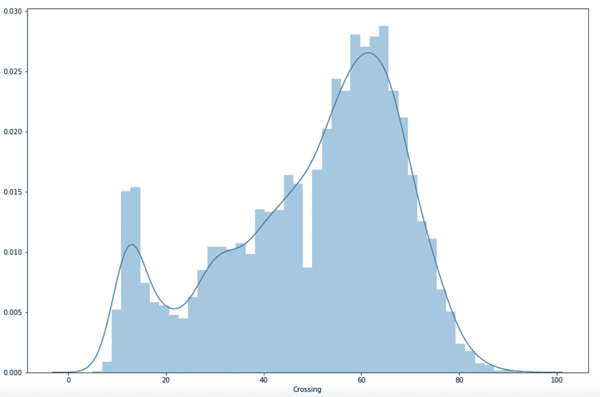
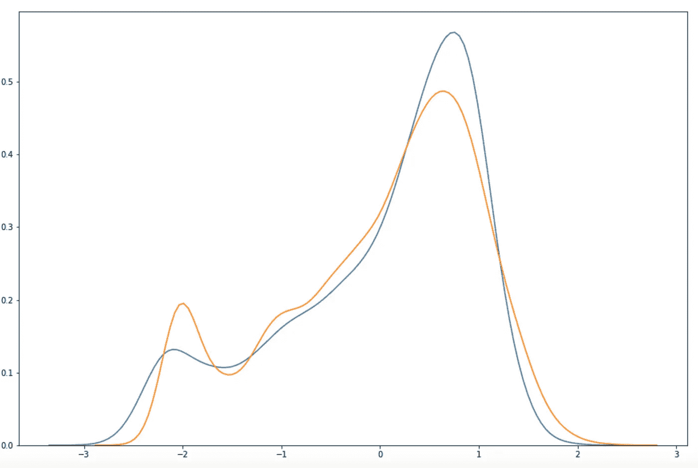
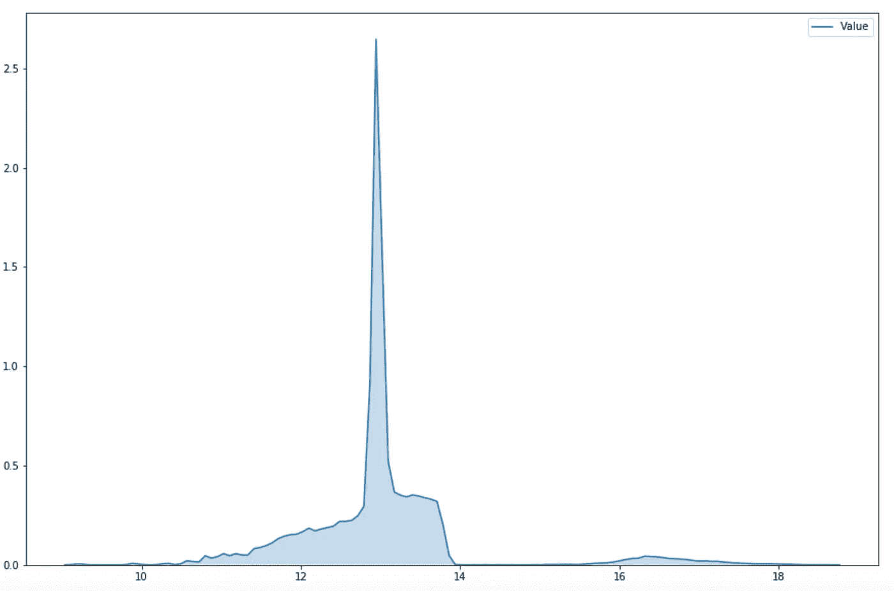

# 用 XGBoost 预测足球运动员的商业价值

> 原文：<https://towardsdatascience.com/predicting-football-players-commercial-value-with-xgboost-d0670d9e9d2e?source=collection_archive---------13----------------------->


Pic by Jannes Glas - Unsplash

## 商业价值真的只依赖于纯竞技场属性吗？还是另有隐情？

如果你和我一样，你会觉得有必要了解所有事物是如何工作的，如果你对数据科学感兴趣，你会觉得有冲动去预测所有可以预测的事情。在这种情况下，我会告诉你如何预测足球运动员的商业价值仅仅依靠他们的足球技术。我们将使用 XGBoost 来这样做，并在这样做的同时了解更多的库。

我使用 Jupyter 笔记本在 Python 中进行了分析。笔记本可以在我的 GitHub 页面上找到，我会不时地加入一些代码片段，让这个故事更有教育意义。我鼓励读者拿起笔记本，边阅读文章边阅读。

## 数据

该数据集包括超过 18000 个足球运动员的条目，按照价值排序，从最有价值到不太有价值。虽然数据集与 FIFA '19 视频游戏相关，但其玩家商业估值和玩家游戏技能评级非常准确，因此我们可以假设我们正在处理现实生活中的玩家数据。

## 导入

首先，让我们获取数据集。我最初是从 [Kaggle](https://www.kaggle.com/karangadiya/fifa19) 获得的，但是你也可以从我的 [GitHub](https://github.com/estebanvillaturek/fifa19) 页面获得。

安装 pandas 以便能够操作数据，然后直接从 URL 导入数据集:

```
import pandas as pdurl = '[https://raw.githubusercontent.com/estebanvillaturek/fifa19/master/fifa19_data.csv'](https://raw.githubusercontent.com/estebanvillaturek/fifa19/master/fifa19_data.csv')data = pd.read_csv(url)data.head()data.shape
```

正如我们所看到的，我们得到了一个包含超过 18k 行和 89 列的数据集，包括所有类型的数据格式。

## 探索

我们主要对“价值”一栏感兴趣，它包含了每个球员的商业价值。我们注意到一些事情:它的条目被格式化为字符串，前面有一个€符号，百万和千分别用大写的 M 和 K 表示。这意味着，我们将有一些争论和重新格式化要做，因为我们想得到所有的数值作为数值，以便建立和运行预测模型。

## 重新格式化“值”

我们可以使用一个简单的 lambda 函数来移除€符号。在这种情况下，我们求助于 lambda 函数(也称为匿名函数)，因为我们只需要对整个列应用一次性函数，并且不用任何东西替换€符号。

```
# Remove €data.Value = data.Value.apply(lambda x: x.replace('€', ''))
```

接下来，由于值的范围从数百万到数千，我们需要找到一种方法，首先找到以“K”结尾的条目，然后删除它，将字符串转换为浮点数(数字数据类型)，然后乘以 1000。然后，我们将对百万欧元的条目重复相同的过程。

最好的方法是使用 for 循环迭代该列。创建迭代器之前的最佳实践是使用 next()函数模拟迭代器，该函数返回第一次迭代，这样我们就可以使用结果来创建最终迭代器。注意，为了迭代 pandas 数据框列，即一个序列，我们调用。items()方法。

```
# preview iteration next(data.Value.items())
```

第一次迭代的结果是一个元组，由第一个元素索引和第二个元素值本身组成。有了这些信息，我们就可以构建第一个迭代器来重新格式化千欧元单元格。

```
# reformat thousands cellsfor i,j in data.Value.items():
    if 'K' in j:
        data.Value.iloc[i] = float(j.replace('K', '')) * 1000
```

现在，让我们对剩下的百万欧元细胞做同样的事情。

```
# Reformat millions cellsfor i,j in data.Value.items():
    if 'M' in j:
        data.Value.iloc[i] = float(j.replace('M', '')) * 1000000
```

## 将“值”转换为数值

既然“Value”列中的所有条目都可以表示为数字数据类型，我们就可以相应地转换它们，这样我们就可以获得回归模型的目标(没错，我们将预测一个连续的因变量，因此我们将编译一个回归模型，但稍后会详细介绍)。

```
# to_numericdata.Value = pd.to_numeric(data.Value, errors = 'coerce')
```

## 创建新的全数字数据框

现在我们知道我们将在练习中使用回归变量，我们将创建一个新的、更具体的数据框，该数据框将仅包含数字变量，并将由目标变量“值”和所有预测变量、每个玩家的游戏技能的排名分数(每个玩家总共 34 个排名能力)组成。

```
# first, the target variablescores = pd.DataFrame(data.Value) # then, slice the ranking scores for players' abilitiesdata1 = data.iloc[:, 54:88] #finally, join the the two subsetsscores = pd.concat([scores, data1], axis = 1)
```

## 描述分数&留意偏斜度

由于我们处理的是数值，我们必须检查数据是如何分布的。这是理解数据行为的基础，也是理解我们是否必须对数据进行规范化或标准化的基础。请记住，归一化将我们的数据转换为从 0 到 1 的范围，正则化将我们的数据转换为正态分布，平均值为 0，标准差为 1。

```
# The describe method returns an overview of the descriptive stats of all our columns.scores.describe()
```

我们可以从目测数据中看出，有轻微的偏态倾向，因为中位数和平均数总是分开的(在正态分布中，中位数和平均数是相同的)。在这种情况下，偏斜的一个特殊情况是“值”变量。它有相当多的离群值(梅西、罗纳尔多等)，将平均值拉向右边。我们可以使用 Seaborn 直观地看到分布，但首先我们需要检查数据中是否有缺失值。

## 检查 NaNs

检查缺失值、nan 等的简单方法。，就是使用。isnull()方法，然后按列对所有缺失值求和。像这样，我们可以看到每列有多少个 nan，因此，决定如何处理它们，即是否删除它们，估算它们，等等。

```
# sum up all non-values scores.isnull().sum()
```

结果是惊人的:尽管我们的预测变量每列只有 48 个缺失值，但我们的目标变量“值”有将近 6k 个缺失值。这意味着，如果我们决定删除所有的 nan，我们将丢失几乎三分之一的数据集。).那是不行的。

## 估算中值以避免数据丢失

或者，我们将求助于数据插补，这是一种允许我们用另一个值替换所有缺失值的技术。对于此示例，我们将使用每列的中值来估算每列中的 NaNs。我们选择中位数，因为它根本不会影响每个变量的分布，也许除了“价值”之外。让我们检查一下。

```
# to not lose around 6k data points, let's explore missing data imputationscores.iloc[:, :].fillna(scores.iloc[:, :].median(), inplace = True)print(scores.isnull().sum())
```

现在，数据集中没有丢失的值，所以我们可以开始可视化地研究分布。

## 检查单个分布

这里我们也可以求助于 for 循环，我们可以要求机器绘制每个变量的分布。

```
# Explore the distribution of each variableprovisional = scoresfor i, j in provisional.items():
    sns.kdeplot(j, shade = True)
    plt.figure()
```

正如我们所看到的，“价值”仍然是高度倾斜的，我们的大多数变量倾向于正态分布(除了那些相对于守门员能力排名的变量)，其中一些变量倾向于双峰。

## 正常化(如果需要)

首先，让我们把目标变量和预测变量分开，因为它们需要不同的处理方法。

```
# Separate examples and targetX = scores.iloc[:, 1:]y = scores.iloc[:, 0]
```

为了练习的缘故，我们将标准化和规范化(标度)我们的预测因子，以便能够评估治疗的差异。我们将使用 sklearn 库进行预处理任务。

```
# Now we’ll first normalize the data so that we can have it in a 0 to 1 range and then standardize itfrom sklearn import preprocessing#nrm_X = preprocessing.normalize(X)#std_X1 = preprocessing.scale(X)#std_X = preprocessing.scale(nrm_X)
```

现在，让我们直观地比较我们的原始“交叉”预测器及其缩放和标准化版本。

```
# Assess the difference visuallysns.kdeplot(std_X[:, 0])sns.kdeplot(std_X1[:, 0])
```



Original Crossing variable



The orange distribution is the scaled version w/o normalization. The blue distribution is the same scaled variable, only after being normalized first.

我们可以看到，虽然差别不大，但蓝色分布的方差要小一些。让我们继续这个标准化和缩放的预测数据。

## 对数转换目标变量

正如我们前面看到的，“价值”是相当扭曲的，因为有天文数字估计的商业价值的突出离群值:梅西，罗纳尔多，小内马尔，等等。这是有问题的，因为绝大多数球员的价值都远低于百万欧元。

要在数据中解决这个问题，我们必须对“值”变量进行对数转换。在处理随时间增长的经济或金融数据(工资、财富、GDP 等)时，对数变换非常有用。)因为它们往往是指数增长，而不是线性增长。但是要小心，不要对零进行对数转换，否则会得到 inf 值，这将使您无法绘制或继续分析您的数据！

```
# Now we'll have to rescale the target variable - we'll log-transform it - it's crazy skewed!plt.figure(figsize=(15,10))
sns.kdeplot(y, shade = True)
```

由于数据中有 252 个零，我们将再次估算中值，以便能够对变量进行对数转换。

```
y[y == 0].count() # we have 252 zeroes in 'Value' - we have to impute the with the mediany[y == 0] = np.median(scores.Value)y[y == 0].count() # ready, now we can log-transform the variable w/o getting any - inf values
```

现在，让我们对目标变量 y 进行对数变换，并对其值进行指数运算，以练习将它们恢复到原始比例。

```
# do the log-transformation - looks much better!y_log = np.log1p(y)plt.figure(figsize = (15,10))
sns.kdeplot(y_log, shade = True)
```



Log-transformed ‘Value’ variable

```
# now we can just do the exponential of any value of y to get back the original valuesnp.expm1(y_log[0])
```

## 构建 XGBoost 回归模型

首先，我们可以直观地评估随着每个游戏技能等级分数的增加，价值是如何增加的。为此，我们可以再次使用 For 循环，这样我们就可以创建 34 个散点图，每个散点图对应玩家的额定游戏能力。这里我们将使用未缩放的数据集，但是为了更好的可视化，我们将对图中的 x 变量进行对数变换。

```
# Visualize the relationships within the datasetx_col = "Value"
y_columns = scores.loc[:, scores.columns != 'Value']for y_col in y_columns:figure = plt.figure
    plt.figure(figsize = (15,10))
    ax = sns.regplot(x=x_col, y=y_col, data = scores, logx = True)
    ax.set_xlabel(x_col)
    ax.set_ylabel(y_col)
    ax.set_title("{} & {}".format(x_col, y_col))plt.show()
```

我们可以清楚地看到，随着每项技能的增加，价值也会增加，这是很自然的。我们还可以看到，在一大群更为普通的玩家中，具有更高商业价值的顶级玩家是如何成为显著的离群者的。

现在让我们来看看 XGBoost 模型。正如这里完美解释的，XGBoost 是 2016 年开发的一种基于决策树的卓越算法，它利用梯度下降和不同硬件相关计算技术的力量来提升模型，使其符合结构化集合的数据，这是其他算法无法做到的，至少在今天是如此。它非常适合构建分类或回归模型。

首先，我们将拆分数据，

```
# We will use a 20% of the data set as the test setfrom sklearn.model_selection import train_test_splitX_train, X_test, y_train, y_test = train_test_split(std_X, y_log ,test_size=0.2, random_state = 42)
```

然后我们将编译并拟合回归模型。

```
# Compile and fit the modelimport xgboostmodel = xgboost.XGBRegressor(objective='reg:squarederror')model.fit(X_train, y_train)
```

我们用我们的测试集来预测。

```
# Now we predict based on the fitted modelpreds = model.predict(X_test)
```

最后，我们基于适当的准确性指标来评估我们的模型。在这种情况下，我们将使用平均绝对误差(MAE ),它代表我们的预测和我们的真实测试目标之间的差异的绝对值。

```
# Accuracyfrom sklearn.metrics import mean_absolute_errormae = mean_absolute_error(y_test, preds)
```

请记住，由于我们的预测和测试目标是对数转换的，我们需要取 MAE 的指数来获得原始单位的度量。

```
np.expm1(mae)
```

这给了我们大约 0.75 €的平均相对误差，相当不错，对吧？

# 结论

我们刚刚看到了一种方法，只根据球员不同的足球能力评级来预测球员的商业价值，而不考虑其他因素。虽然预测本身相当精确，但我们在模型中的变量解释的方差并不太大(R2 上升到只有大约 35%)，这强调了清楚你想通过模型实现什么的重要性:要么是预测准确性，要么是通过自变量解释因变量中的方差来彻底解释现象，这是机器学习和统计学之间的基本差异之一。

# 奖励曲目

1.  想想职业足球历史上所有可以避免的转会失误！看看《经济学人》的这篇[文章](https://www.economist.com/game-theory/2019/05/12/how-manchester-city-came-to-rule-english-football)，感受一下成功(和失败)的球员在完成转会时的评估对球队表现的巨大影响。
2.  如果你想知道在预测商业价值时哪些玩家能力是最关键的，你可以探索 XGBoost 提供的特性重要性指标。不过要小心:看看这篇[文章](/be-careful-when-interpreting-your-features-importance-in-xgboost-6e16132588e7)，感受一下重要性度量告诉你什么！

让我知道你的想法，别忘了留下评论！